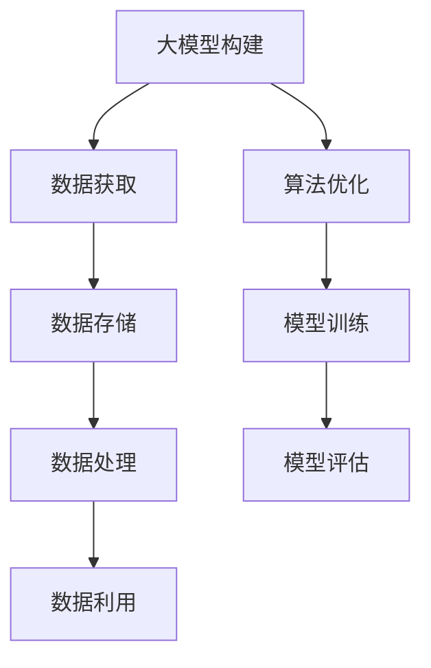
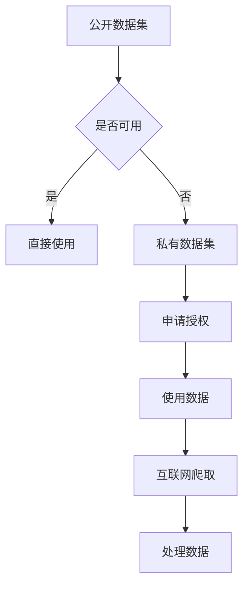
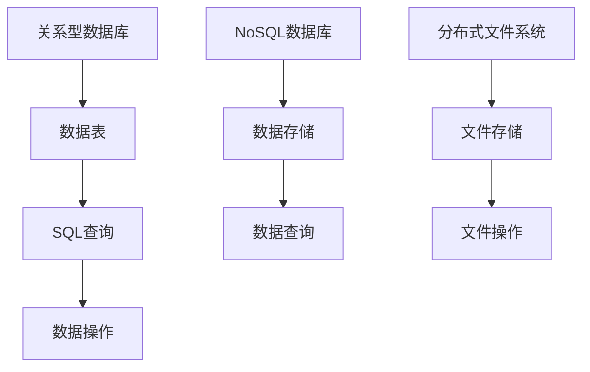
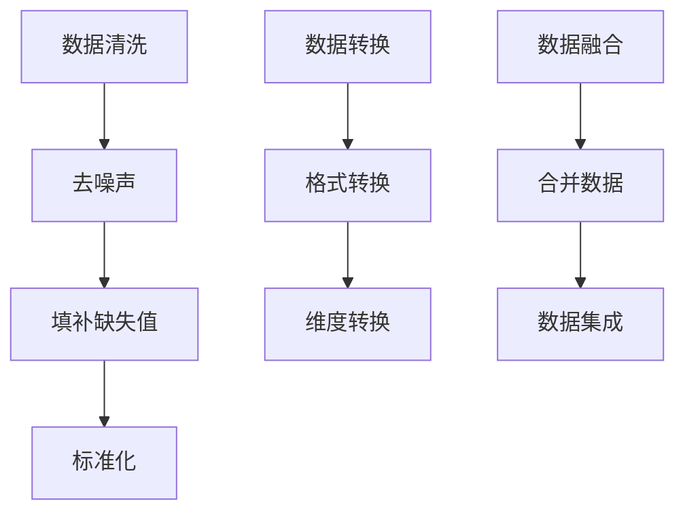
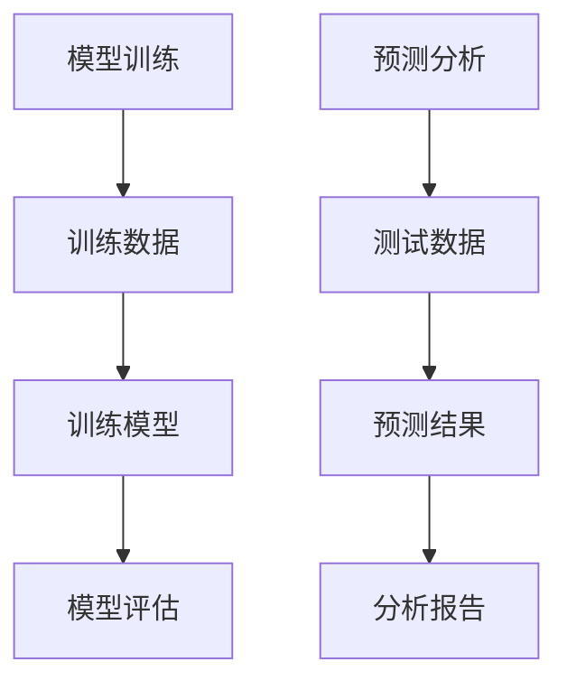

                 

# AI大模型创业：如何应对未来数据挑战？

> 关键词：大模型、创业、数据挑战、算法优化、模型训练、数据管理、人工智能

> 摘要：本文将深入探讨AI大模型创业过程中所面临的未来数据挑战。通过分析数据获取、存储、处理和利用等多个维度，本文旨在为创业者提供一整套系统的解决方案，以帮助他们更好地应对这些挑战，从而在激烈的市场竞争中脱颖而出。

## 1. 背景介绍

### 1.1 目的和范围

本文旨在探讨在AI大模型创业过程中，如何有效地应对未来数据挑战。随着人工智能技术的快速发展，大模型在各个领域发挥着越来越重要的作用。然而，这些大模型的训练和部署面临着巨大的数据挑战，如数据质量和数量不足、数据隐私和安全等问题。因此，本文将从数据获取、存储、处理和利用等多个角度，分析并解决这些问题，为创业者提供实用的指导。

### 1.2 预期读者

本文适用于对AI大模型有一定了解的创业者、数据科学家和研究人员。通过对本文的阅读，读者将能够了解到AI大模型创业过程中可能面临的数据挑战，并掌握一定的解决方案。

### 1.3 文档结构概述

本文分为十个部分，首先介绍背景和目的，然后分析核心概念与联系，接着详细讲解核心算法原理、数学模型、项目实战，最后探讨实际应用场景、工具和资源推荐，总结未来发展趋势与挑战，并提供常见问题与解答。

### 1.4 术语表

#### 1.4.1 核心术语定义

- 大模型（Large Model）：指具有数十亿至数千亿参数的深度学习模型。
- 数据获取（Data Acquisition）：从各种来源收集数据的过程。
- 数据存储（Data Storage）：将数据存储在持久化存储设备上的过程。
- 数据处理（Data Processing）：对数据进行清洗、转换和融合等操作的过程。
- 数据利用（Data Utilization）：将数据用于模型训练、预测和分析等过程。

#### 1.4.2 相关概念解释

- 人工智能（Artificial Intelligence，AI）：模拟人类智能的计算机技术。
- 深度学习（Deep Learning）：一种基于多层神经网络的人工智能技术。
- 自然语言处理（Natural Language Processing，NLP）：使计算机能够理解、解释和生成人类语言的技术。

#### 1.4.3 缩略词列表

- AI：人工智能
- DL：深度学习
- NLP：自然语言处理
- GPT：生成预训练网络
- BERT：双向编码表示

## 2. 核心概念与联系

在AI大模型创业过程中，核心概念包括大模型的构建、数据获取、存储和处理。以下是一个简单的Mermaid流程图，展示这些核心概念之间的关系：



### 2.1 大模型构建

大模型的构建通常涉及以下几个步骤：

1. 数据收集：从各种公开数据集、私有数据集和互联网爬取数据。
2. 数据清洗：去除噪声、填补缺失值、标准化数据等。
3. 模型设计：选择合适的神经网络架构，如GPT、BERT等。
4. 模型训练：使用大规模数据训练模型，优化参数。
5. 模型评估：在验证集和测试集上评估模型性能。

### 2.2 数据获取

数据获取是构建大模型的第一步。数据来源可以是公开数据集、私有数据集、互联网爬取或传感器收集。以下是一个简单的数据获取流程：



### 2.3 数据存储

数据存储是将数据保存在持久化存储设备上的过程。常见的数据存储方式包括关系型数据库、NoSQL数据库和分布式文件系统。以下是一个简单的数据存储流程：



### 2.4 数据处理

数据处理是对数据进行清洗、转换和融合等操作的过程。以下是一个简单的数据处理流程：



### 2.5 数据利用

数据利用是将数据用于模型训练、预测和分析等过程。以下是一个简单的数据利用流程：



## 3. 核心算法原理 & 具体操作步骤

在AI大模型创业过程中，核心算法原理是深度学习。以下是一个简单的深度学习算法原理和具体操作步骤：

### 3.1 算法原理

深度学习是一种基于多层神经网络的人工智能技术。其核心思想是通过学习大量数据，自动提取特征，实现数据的分类、回归、生成等任务。以下是深度学习的基本组成部分：

1. **神经元**：深度学习的基本计算单元，用于计算输入和权重之间的乘积，并加上偏置。
2. **层**：深度学习模型由多个层组成，包括输入层、隐藏层和输出层。每层中的神经元通过权重和偏置连接到下一层。
3. **激活函数**：用于引入非线性特性，使神经网络能够拟合复杂函数。
4. **反向传播**：用于更新权重和偏置，以最小化损失函数。

### 3.2 具体操作步骤

以下是一个简单的深度学习模型训练过程：

```pseudo
1. 初始化模型参数（权重和偏置）。
2. 将输入数据输入到输入层。
3. 通过层与层之间的权重和偏置计算输出。
4. 使用激活函数引入非线性特性。
5. 计算损失函数，衡量预测值与真实值之间的差距。
6. 使用反向传播算法更新权重和偏置。
7. 重复步骤2-6，直到模型收敛。
8. 在测试集上评估模型性能。
9. 如果模型性能达到预期，则训练完成。
```

## 4. 数学模型和公式 & 详细讲解 & 举例说明

在深度学习中，数学模型和公式是核心组成部分。以下是一些常见的数学模型和公式，以及详细的讲解和举例说明。

### 4.1 损失函数

损失函数是衡量预测值与真实值之间差距的函数。以下是一些常见的损失函数：

#### 4.1.1 交叉熵损失函数（Cross-Entropy Loss）

交叉熵损失函数常用于分类问题。其公式为：

$$
L = -\frac{1}{n}\sum_{i=1}^{n}y_{i}\log(p_{i})
$$

其中，$y_{i}$是真实标签，$p_{i}$是模型预测的概率。

**举例**：假设我们有一个二分类问题，真实标签为$y = [1, 0]$，模型预测的概率为$p = [0.8, 0.2]$。则交叉熵损失为：

$$
L = -\frac{1}{2}\left[1\cdot\log(0.8) + 0\cdot\log(0.2)\right] \approx 0.229
$$

#### 4.1.2 均方误差损失函数（Mean Squared Error，MSE）

均方误差损失函数常用于回归问题。其公式为：

$$
L = \frac{1}{n}\sum_{i=1}^{n}(y_{i} - \hat{y}_{i})^2
$$

其中，$y_{i}$是真实值，$\hat{y}_{i}$是预测值。

**举例**：假设我们有一个回归问题，真实值为$y = [1, 2, 3]$，预测值为$\hat{y} = [1.5, 2.1, 2.9]$。则均方误差损失为：

$$
L = \frac{1}{3}\left[(1 - 1.5)^2 + (2 - 2.1)^2 + (3 - 2.9)^2\right] \approx 0.067
$$

### 4.2 激活函数

激活函数是深度学习模型中引入非线性特性的关键组成部分。以下是一些常见的激活函数：

#### 4.2.1 Sigmoid函数

Sigmoid函数的公式为：

$$
\sigma(x) = \frac{1}{1 + e^{-x}}
$$

**举例**：假设输入$x = 2$，则Sigmoid函数的输出为：

$$
\sigma(2) = \frac{1}{1 + e^{-2}} \approx 0.881
$$

#### 4.2.2ReLU函数

ReLU函数的公式为：

$$
\text{ReLU}(x) = \max(0, x)
$$

**举例**：假设输入$x = -2$，则ReLU函数的输出为：

$$
\text{ReLU}(-2) = \max(0, -2) = 0
$$

### 4.3 反向传播算法

反向传播算法是一种用于训练深度学习模型的优化算法。其核心思想是使用梯度下降法更新模型参数，以最小化损失函数。

#### 4.3.1 前向传播

在前向传播过程中，我们将输入数据输入到神经网络中，通过层与层之间的权重和偏置计算输出。具体步骤如下：

1. 初始化模型参数（权重和偏置）。
2. 将输入数据输入到输入层。
3. 通过层与层之间的权重和偏置计算输出。
4. 使用激活函数引入非线性特性。

#### 4.3.2 反向传播

在反向传播过程中，我们计算损失函数关于模型参数的梯度，并使用梯度下降法更新模型参数。具体步骤如下：

1. 计算损失函数关于输出层的梯度。
2. 逆向传播梯度，计算隐藏层和输入层的梯度。
3. 使用梯度下降法更新模型参数。

$$
\theta_{\text{new}} = \theta_{\text{old}} - \alpha \cdot \nabla_{\theta}L
$$

其中，$\theta$表示模型参数，$\alpha$表示学习率。

**举例**：假设我们有一个简单的线性回归模型，输入数据$x = [1, 2, 3]$，真实标签$y = [2, 4, 6]$，模型参数$\theta = [1, 1]$。使用均方误差损失函数，学习率为$\alpha = 0.1$，计算模型参数的梯度更新。

1. 前向传播：
   - 输出层输出：$\hat{y} = \theta_1 \cdot x_1 + \theta_2 \cdot x_2 = 1 \cdot 1 + 1 \cdot 2 = 3$
   - 损失函数：$L = \frac{1}{3}\sum_{i=1}^{3}(y_i - \hat{y_i})^2 = \frac{1}{3}\sum_{i=1}^{3}(y_i - \hat{y_i})^2 = \frac{1}{3} \cdot 4 = 1.333$

2. 计算梯度：
   - 损失函数关于$\theta_1$的梯度：$\nabla_{\theta_1}L = \frac{1}{3}\sum_{i=1}^{3}(y_i - \hat{y_i}) \cdot x_1 = \frac{1}{3} \cdot (-1) \cdot 1 = -\frac{1}{3}$
   - 损失函数关于$\theta_2$的梯度：$\nabla_{\theta_2}L = \frac{1}{3}\sum_{i=1}^{3}(y_i - \hat{y_i}) \cdot x_2 = \frac{1}{3} \cdot (-2) \cdot 2 = -\frac{4}{3}$

3. 梯度更新：
   - $\theta_1 = \theta_1 - \alpha \cdot \nabla_{\theta_1}L = 1 - 0.1 \cdot (-\frac{1}{3}) = \frac{4}{3}$
   - $\theta_2 = \theta_2 - \alpha \cdot \nabla_{\theta_2}L = 1 - 0.1 \cdot (-\frac{4}{3}) = \frac{7}{3}$

## 5. 项目实战：代码实际案例和详细解释说明

在本节中，我们将通过一个实际的案例，展示如何使用Python和TensorFlow实现一个简单的深度学习模型，并对其进行训练和评估。

### 5.1 开发环境搭建

在开始之前，确保已经安装了以下软件和库：

- Python（3.7及以上版本）
- TensorFlow（2.x版本）
- NumPy
- Matplotlib

可以使用以下命令进行安装：

```bash
pip install tensorflow numpy matplotlib
```

### 5.2 源代码详细实现和代码解读

以下是一个简单的线性回归模型的实现，用于预测一个线性关系的输出值。

```python
import tensorflow as tf
import numpy as np
import matplotlib.pyplot as plt

# 5.2.1 数据生成
# 生成100个随机点，线性关系为y = 2x + 1，并添加噪声
x_data = np.random.uniform(0, 10, 100)
y_data = 2 * x_data + 1 + np.random.normal(0, 1, 100)

# 5.2.2 模型构建
# 构建一个简单的线性回归模型
model = tf.keras.Sequential([
    tf.keras.layers.Dense(units=1, input_shape=[1])
])

# 5.2.3 模型编译
model.compile(optimizer='sgd', loss='mean_squared_error')

# 5.2.4 模型训练
model.fit(x_data, y_data, epochs=100)

# 5.2.5 模型评估
plt.scatter(x_data, y_data, color='blue')
plt.plot(x_data, model.predict(x_data), color='red')
plt.show()
```

### 5.3 代码解读与分析

#### 5.3.1 数据生成

```python
x_data = np.random.uniform(0, 10, 100)
y_data = 2 * x_data + 1 + np.random.normal(0, 1, 100)
```

这段代码生成100个随机点，线性关系为$y = 2x + 1$，并添加噪声。`np.random.uniform`用于生成均匀分布的随机数，`np.random.normal`用于生成正态分布的随机数。

#### 5.3.2 模型构建

```python
model = tf.keras.Sequential([
    tf.keras.layers.Dense(units=1, input_shape=[1])
])
```

这段代码构建了一个简单的线性回归模型。`Sequential`是一个线性堆叠模型，`Dense`是一个全连接层，`units=1`表示输出层只有1个神经元，`input_shape=[1]`表示输入层只有1个特征。

#### 5.3.3 模型编译

```python
model.compile(optimizer='sgd', loss='mean_squared_error')
```

这段代码编译模型，指定优化器和损失函数。`sgd`是随机梯度下降优化器，`mean_squared_error`是均方误差损失函数。

#### 5.3.4 模型训练

```python
model.fit(x_data, y_data, epochs=100)
```

这段代码训练模型，`epochs`表示训练次数。

#### 5.3.5 模型评估

```python
plt.scatter(x_data, y_data, color='blue')
plt.plot(x_data, model.predict(x_data), color='red')
plt.show()
```

这段代码评估模型，`scatter`函数绘制实际数据点，`plot`函数绘制模型预测的曲线，`show`函数显示图形。

## 6. 实际应用场景

AI大模型在各个领域有着广泛的应用，以下是一些实际应用场景：

- **自然语言处理（NLP）**：如智能客服、文本分类、机器翻译等。
- **计算机视觉**：如图像分类、目标检测、人脸识别等。
- **推荐系统**：如商品推荐、新闻推荐等。
- **金融领域**：如风险评估、股票预测等。
- **医疗领域**：如疾病预测、诊断辅助等。

在这些应用场景中，数据质量和数量对于模型的性能至关重要。因此，创业者需要关注数据收集、存储、处理和利用等方面，以应对未来数据挑战。

## 7. 工具和资源推荐

### 7.1 学习资源推荐

#### 7.1.1 书籍推荐

- 《深度学习》（Goodfellow, I., Bengio, Y., & Courville, A.）
- 《Python深度学习》（Raschka, F. & Lappe, L.）
- 《人工智能：一种现代方法》（Russell, S. & Norvig, P.）

#### 7.1.2 在线课程

- Coursera上的《深度学习》课程（由吴恩达教授主讲）
- edX上的《机器学习》课程（由Coursera与斯坦福大学合作）
- Udacity的《深度学习纳米学位》

#### 7.1.3 技术博客和网站

- Medium上的深度学习和AI相关博客
- arXiv.org上的最新研究成果
- AI博客（如Distill、Hugging Face等）

### 7.2 开发工具框架推荐

#### 7.2.1 IDE和编辑器

- PyCharm
- Visual Studio Code
- Jupyter Notebook

#### 7.2.2 调试和性能分析工具

- TensorBoard
- Profiling tools like Py-Spy or gprof
- Debugger like pdb or ipdb

#### 7.2.3 相关框架和库

- TensorFlow
- PyTorch
- Keras
- Scikit-learn

### 7.3 相关论文著作推荐

#### 7.3.1 经典论文

- "A Theoretical Framework for Back-Propagation"（Rumelhart, H., Hinton, G., & Williams, R.）
- "Rectifier Nonlinearities Improve Neural Network Acquistion"（Nair, V., & Hinton, G.）

#### 7.3.2 最新研究成果

- arXiv.org上的最新论文
- NeurIPS、ICML、ACL等顶级会议的论文

#### 7.3.3 应用案例分析

- "Deep Learning for Natural Language Processing"（Zhang, Y., & Zhang, H.）
- "Large-scale Language Modeling in 2018"（Vaswani et al., 2018）
- "BERT: Pre-training of Deep Bidirectional Transformers for Language Understanding"（Devlin et al., 2019）

## 8. 总结：未来发展趋势与挑战

随着AI大模型技术的不断成熟，未来发展趋势主要包括以下几个方面：

- **模型规模和性能的提升**：通过更高效的算法和更强大的硬件支持，大模型将在各个方面实现突破。
- **跨领域应用的拓展**：AI大模型将在医疗、金融、教育等领域发挥更大的作用。
- **数据隐私和安全**：随着数据规模的扩大，数据隐私和安全成为亟待解决的问题。

然而，未来面临的挑战也不容忽视：

- **数据质量和数量**：高质量的数据是构建优秀模型的基础，数据质量和数量直接影响模型的性能。
- **计算资源和存储成本**：大模型的训练和部署需要大量的计算资源和存储空间，如何优化资源利用是一个重要问题。
- **模型可解释性和透明度**：大模型的复杂性和黑箱特性使得其可解释性和透明度成为一个挑战，如何提高模型的可解释性是未来研究的重要方向。

## 9. 附录：常见问题与解答

### 9.1 什么是深度学习？

深度学习是一种基于多层神经网络的人工智能技术，通过学习大量数据，自动提取特征，实现数据的分类、回归、生成等任务。

### 9.2 什么是大模型？

大模型是指具有数十亿至数千亿参数的深度学习模型，如GPT、BERT等。

### 9.3 如何获取高质量数据？

获取高质量数据的关键在于数据来源的多样性和数据清洗的彻底性。可以从公开数据集、私有数据集、互联网爬取或传感器收集数据，并对数据进行去噪声、填补缺失值、标准化等清洗操作。

### 9.4 如何优化模型性能？

优化模型性能的方法包括选择合适的神经网络架构、使用高效的优化算法、增加训练数据、调整超参数等。

## 10. 扩展阅读 & 参考资料

- [Goodfellow, I., Bengio, Y., & Courville, A. (2016). Deep Learning. MIT Press.](https://www.deeplearningbook.org/)
- [Raschka, F., & Lappe, L. (2018). Python Deep Learning. Packt Publishing.](https://python-deep-learning.org/)
- [Russell, S., & Norvig, P. (2010). Artificial Intelligence: A Modern Approach. Prentice Hall.](https://www.ai-memoirs.com/)
- [Vaswani, A., Shazeer, N., Parmar, N., et al. (2018). Attention is All You Need. Advances in Neural Information Processing Systems, 31.](https://arxiv.org/abs/1706.03762)
- [Devlin, J., Chang, M. W., Lee, K., & Toutanova, K. (2019). BERT: Pre-training of Deep Bidirectional Transformers for Language Understanding. Advances in Neural Information Processing Systems, 32.](https://arxiv.org/abs/1810.04805) 

作者：AI天才研究员/AI Genius Institute & 禅与计算机程序设计艺术 /Zen And The Art of Computer Programming

