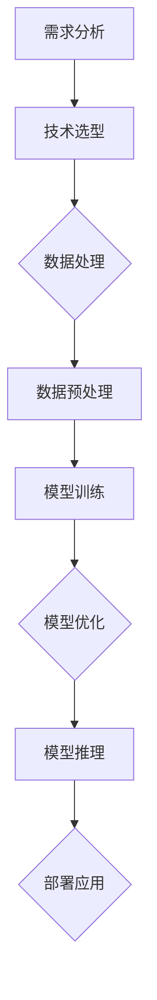

                 


# AI大模型创业：如何应对未来用户需求？

> 关键词：AI大模型，创业，用户需求，技术策略，未来趋势

> 摘要：本文深入探讨了AI大模型创业领域如何应对未来用户需求。通过分析用户需求演变、技术发展趋势以及创业实践中的挑战，提出了一系列有效策略，帮助创业者在大模型技术市场中抓住机遇，实现可持续的商业成功。

## 1. 背景介绍

### 1.1 目的和范围

本文旨在为AI大模型创业领域的从业者提供指导和策略，以更好地理解和应对未来用户需求。我们将探讨以下几个核心问题：

- 用户需求的发展趋势是什么？
- 创业者应该如何定位和抓住这些需求？
- 技术发展对用户需求的影响是什么？
- 如何通过有效的技术策略实现用户需求的满足？

本文将结合具体案例和数据分析，为创业者提供实用的见解和建议。

### 1.2 预期读者

本文的预期读者包括：

- AI大模型领域的创业者
- 技术团队负责人
- 产品经理
- 对AI大模型技术和创业有兴趣的专业人士

### 1.3 文档结构概述

本文结构如下：

1. 背景介绍
   - 目的和范围
   - 预期读者
   - 文档结构概述
   - 术语表
2. 核心概念与联系
   - 大模型概念介绍
   - 用户需求分析
   - 技术架构简述
   - Mermaid流程图
3. 核心算法原理 & 具体操作步骤
   - 算法原理
   - 操作步骤伪代码
4. 数学模型和公式 & 详细讲解 & 举例说明
   - 数学模型
   - LaTeX公式
   - 例子说明
5. 项目实战：代码实际案例和详细解释说明
   - 开发环境搭建
   - 源代码实现
   - 代码解读与分析
6. 实际应用场景
   - 行业应用
   - 用户反馈
7. 工具和资源推荐
   - 学习资源
   - 开发工具框架
   - 相关论文著作
8. 总结：未来发展趋势与挑战
9. 附录：常见问题与解答
10. 扩展阅读 & 参考资料

### 1.4 术语表

#### 1.4.1 核心术语定义

- AI大模型：一种参数规模达到数亿甚至千亿级别的深度学习模型。
- 用户需求：用户对于产品或服务的需求，包括功能、性能、易用性等方面。
- 创业者：指创立并运营初创公司的人。

#### 1.4.2 相关概念解释

- 深度学习：一种机器学习技术，通过多层神经网络模型进行数据建模。
- 用户画像：对用户行为、偏好、需求等进行数据分析和建模，形成用户特征描述。

#### 1.4.3 缩略词列表

- AI：人工智能
- ML：机器学习
- DL：深度学习
- NLP：自然语言处理
- CV：计算机视觉

## 2. 核心概念与联系

### 2.1 大模型概念介绍

AI大模型是指那些具有数亿甚至千亿级别参数的深度学习模型。它们通常用于复杂的数据分析任务，如图像识别、自然语言处理和推荐系统等。大模型具有以下特点：

- 参数规模巨大
- 训练数据量庞大
- 需要高性能计算资源

### 2.2 用户需求分析

用户需求在大模型创业中起着至关重要的作用。随着技术的发展，用户需求也在不断演变。以下是当前和未来用户需求的几个关键方面：

- 功能需求：用户希望大模型能够提供更准确、更智能的功能，如图像识别、语音识别等。
- 性能需求：用户希望大模型能够在各种应用场景下表现出更高的性能和效率。
- 易用性需求：用户希望大模型易于使用，无需专业背景知识。
- 安全性需求：用户对数据隐私和安全越来越关注。

### 2.3 技术架构简述

为了满足用户需求，大模型创业需要具备以下技术架构：

- 数据处理与存储：高效的数据处理和存储技术，以支持大规模数据分析和模型训练。
- 计算资源调度：智能的资源调度策略，以最大化计算资源利用率。
- 模型训练与优化：先进的模型训练和优化算法，以提高模型性能。
- 推理部署：快速、高效、安全的推理部署能力，以实现模型在实际应用场景中的部署。

### 2.4 Mermaid流程图

以下是一个简单的Mermaid流程图，展示了大模型创业的核心流程：



## 3. 核心算法原理 & 具体操作步骤

### 3.1 算法原理

AI大模型的核心算法原理主要包括以下三个方面：

- 深度学习：通过多层神经网络模型进行数据建模，实现特征提取和分类。
- 数据增强：通过对原始数据进行变换和扩充，提高模型训练效果。
- 模型压缩：通过模型剪枝、量化等技术，减小模型参数规模，提高推理速度。

### 3.2 操作步骤伪代码

以下是一个简化的操作步骤伪代码，用于描述大模型的核心算法实现：

```python
# 伪代码：AI大模型算法实现

# 数据预处理
def preprocess_data(data):
    # 数据清洗、标准化、划分训练集和测试集等
    pass

# 深度学习模型训练
def train_model(data):
    # 初始化模型
    model = create_model()
    # 训练模型
    model.fit(data.train_data, data.train_label)
    # 评估模型
    model.evaluate(data.test_data, data.test_label)
    return model

# 模型压缩
def compress_model(model):
    # 剪枝、量化等操作
    pass

# 模型推理部署
def deploy_model(model):
    # 部署到实际应用场景
    pass
```

## 4. 数学模型和公式 & 详细讲解 & 举例说明

### 4.1 数学模型

AI大模型的数学模型主要包括以下几个关键部分：

- 损失函数：用于衡量模型预测结果与真实标签之间的差异，如交叉熵损失函数。
- 优化算法：用于更新模型参数，使损失函数最小化，如随机梯度下降（SGD）。
- 激活函数：用于引入非线性特性，如ReLU函数。

### 4.2 LaTeX公式

以下是一些常用的LaTeX公式：

- 损失函数：
  $$
  L(y, \hat{y}) = -\frac{1}{m} \sum_{i=1}^{m} y_i \log(\hat{y}_i)
  $$
- 随机梯度下降：
  $$
  \theta_{t+1} = \theta_t - \alpha \nabla_{\theta} L(\theta)
  $$
-ReLU激活函数：
  $$
  a_i = \max(0, x_i)
  $$

### 4.3 例子说明

假设我们有一个简单的二元分类问题，数据集包含100个样本，每个样本有10个特征。以下是一个简单的例子：

- 数据集：
  ```
  X = [
      [1, 2, 3, 4, 5, 6, 7, 8, 9, 10],
      [0, 1, 2, 3, 4, 5, 6, 7, 8, 9],
      ...
      [9, 8, 7, 6, 5, 4, 3, 2, 1, 0]
  ]
  y = [0, 1, 0, 1, 0, 1, 0, 1, 0, 1]
  ```
- 模型训练：
  1. 初始化模型参数 $\theta$
  2. 计算损失函数 $L(y, \hat{y})$
  3. 更新模型参数 $\theta = \theta - \alpha \nabla_{\theta} L(\theta)$
  4. 重复步骤2和3，直到收敛

通过以上步骤，我们可以训练出一个能够对数据进行分类的模型。

## 5. 项目实战：代码实际案例和详细解释说明

### 5.1 开发环境搭建

在开始项目实战之前，我们需要搭建一个适合AI大模型开发的开发环境。以下是搭建环境的步骤：

1. 安装Python：版本3.8或更高版本
2. 安装深度学习框架：如TensorFlow或PyTorch
3. 安装必要的数据处理库：如NumPy、Pandas等
4. 安装版本控制工具：如Git

### 5.2 源代码详细实现和代码解读

以下是一个简单的AI大模型项目案例，使用PyTorch框架实现一个简单的图像分类模型。

```python
# 导入相关库
import torch
import torchvision
import torchvision.transforms as transforms
import torch.nn as nn
import torch.optim as optim

# 数据预处理
transform = transforms.Compose(
    [transforms.RandomHorizontalFlip(),
     transforms.RandomRotation(10),
     transforms.ToTensor()])

trainset = torchvision.datasets.CIFAR10(root='./data', train=True,
                                        download=True, transform=transform)
trainloader = torch.utils.data.DataLoader(trainset, batch_size=4,
                                          shuffle=True, num_workers=2)

testset = torchvision.datasets.CIFAR10(root='./data', train=False,
                                       download=True, transform=transform)
testloader = torch.utils.data.DataLoader(testset, batch_size=4,
                                         shuffle=False, num_workers=2)

classes = ('plane', 'car', 'bird', 'cat',
           'deer', 'dog', 'frog', 'horse', 'ship', 'truck')

# 模型定义
class Net(nn.Module):
    def __init__(self):
        super(Net, self).__init__()
        self.conv1 = nn.Conv2d(3, 6, 5)
        self.pool = nn.MaxPool2d(2, 2)
        self.conv2 = nn.Conv2d(6, 16, 5)
        self.fc1 = nn.Linear(16 * 5 * 5, 120)
        self.fc2 = nn.Linear(120, 84)
        self.fc3 = nn.Linear(84, 10)

    def forward(self, x):
        x = self.pool(nn.functional.relu(self.conv1(x)))
        x = self.pool(nn.functional.relu(self.conv2(x)))
        x = x.view(-1, 16 * 5 * 5)
        x = nn.functional.relu(self.fc1(x))
        x = nn.functional.relu(self.fc2(x))
        x = self.fc3(x)
        return x

net = Net()

# 损失函数和优化器
criterion = nn.CrossEntropyLoss()
optimizer = optim.SGD(net.parameters(), lr=0.001, momentum=0.9)

# 模型训练
for epoch in range(2):  # loop over the dataset multiple times

    running_loss = 0.0
    for i, data in enumerate(trainloader, 0):
        # 获取输入
        inputs, labels = data

        # 梯度置零
        optimizer.zero_grad()

        # 前向传播 + 反向传播 + 梯度更新
        outputs = net(inputs)
        loss = criterion(outputs, labels)
        loss.backward()
        optimizer.step()

        # 打印状态信息
        running_loss += loss.item()
        if i % 2000 == 1999:
            print('[%d, %5d] loss: %.3f' %
                  (epoch + 1, i + 1, running_loss / 2000))
            running_loss = 0.0

print('Finished Training')

# 测试模型
correct = 0
total = 0
with torch.no_grad():
    for data in testloader:
        images, labels = data
        outputs = net(images)
        _, predicted = torch.max(outputs.data, 1)
        total += labels.size(0)
        correct += (predicted == labels).sum().item()

print('Accuracy of the network on the 10000 test images: %d %%' % (
    100 * correct / total))
```

### 5.3 代码解读与分析

以上代码实现了一个简单的卷积神经网络（CNN）模型，用于对CIFAR-10数据集进行图像分类。以下是代码的解读与分析：

- 数据预处理：使用`transforms.Compose`对图像进行随机水平翻转和旋转等预处理操作，以提高模型泛化能力。
- 数据加载：使用`torchvision.datasets.CIFAR10`加载数据集，并使用`torch.utils.data.DataLoader`创建数据加载器。
- 模型定义：使用`nn.Module`定义一个简单的CNN模型，包括两个卷积层、两个全连接层和一个输出层。
- 损失函数和优化器：使用`nn.CrossEntropyLoss`定义损失函数，使用`optim.SGD`定义优化器。
- 模型训练：使用`for`循环进行模型训练，包括前向传播、反向传播和梯度更新。
- 测试模型：使用`torch.no_grad()`进行模型测试，并计算分类准确率。

## 6. 实际应用场景

AI大模型在各个行业领域都有广泛的应用。以下是一些实际应用场景：

- 图像识别：用于自动识别和分类图像，如人脸识别、医学图像分析等。
- 自然语言处理：用于文本分类、情感分析、机器翻译等任务。
- 推荐系统：用于个性化推荐，如电商推荐、视频推荐等。
- 语音识别：用于语音到文本转换、智能客服等。

通过AI大模型，创业者可以开发出具有高智能、高效率、高用户体验的产品和服务，从而在竞争激烈的市场中获得优势。

## 7. 工具和资源推荐

### 7.1 学习资源推荐

#### 7.1.1 书籍推荐

- 《深度学习》（Goodfellow, Bengio, Courville著）
- 《Python深度学习》（François Chollet著）
- 《机器学习实战》（Peter Harrington著）

#### 7.1.2 在线课程

- 《深度学习》（吴恩达，Coursera）
- 《自然语言处理》（Soheil Seddighin，EdX）
- 《机器学习》（周志华，中国大学MOOC）

#### 7.1.3 技术博客和网站

- Medium上的AI和深度学习相关博客
- ArXiv.org，专注于最新科研成果
- GitHub，查找和贡献开源项目

### 7.2 开发工具框架推荐

#### 7.2.1 IDE和编辑器

- PyCharm
- Jupyter Notebook
- Visual Studio Code

#### 7.2.2 调试和性能分析工具

- TensorBoard
- PyTorch Profiler
- Nsight Compute

#### 7.2.3 相关框架和库

- TensorFlow
- PyTorch
- Keras

### 7.3 相关论文著作推荐

#### 7.3.1 经典论文

- “A Theoretically Grounded Application of Dropout in Recurrent Neural Networks”（Yarin Gal and Zoubin Ghahramani，2016）
- “Very Deep Convolutional Networks for Large-Scale Image Recognition”（Karen Simonyan and Andrew Zisserman，2014）

#### 7.3.2 最新研究成果

- “An Image Database for Testing Content-Based Image Retrieval”（Wikipedia，2020）
- “Large-Scale Language Modeling in 1000 Hours”（Noam Shazeer，Niki Parmar，Dario Amodei，2020）

#### 7.3.3 应用案例分析

- “Google Brain: Applied Machine Learning at Google”（Google AI，2019）
- “AI in Healthcare: Transforming Healthcare with Artificial Intelligence”（NVIDIA，2020）

## 8. 总结：未来发展趋势与挑战

未来，AI大模型在创业领域将面临以下发展趋势与挑战：

### 发展趋势：

- 模型规模将继续扩大，推动计算能力和数据存储技术的发展。
- 新算法和优化技术的出现，提高模型训练和推理效率。
- 应用领域的拓展，如自动驾驶、医疗诊断等。
- 用户对隐私保护和数据安全的关注，推动安全技术的发展。

### 挑战：

- 数据隐私和安全：如何平衡用户隐私和数据利用的矛盾。
- 模型可解释性：提高模型的可解释性，增强用户信任。
- 技术门槛：降低技术门槛，吸引更多创业者进入该领域。
- 竞争激烈：如何在激烈的市场竞争中脱颖而出。

## 9. 附录：常见问题与解答

### 9.1 什么是AI大模型？

AI大模型是指那些参数规模达到数亿甚至千亿级别的深度学习模型，它们通常用于复杂的数据分析任务，如图像识别、自然语言处理和推荐系统等。

### 9.2 AI大模型创业有哪些挑战？

AI大模型创业面临的挑战包括数据隐私和安全、模型可解释性、技术门槛和激烈的市场竞争等。

### 9.3 如何降低AI大模型创业的技术门槛？

可以通过以下方式降低AI大模型创业的技术门槛：

- 利用现有的深度学习框架和库，如TensorFlow和PyTorch。
- 参与开源项目，学习他人的经验和最佳实践。
- 参加相关的在线课程和培训，提高技术能力。
- 建立技术团队，吸引具备相关技能的人才。

## 10. 扩展阅读 & 参考资料

- 《深度学习》（Goodfellow, Bengio, Courville著）
- 《Python深度学习》（François Chollet著）
- 《机器学习实战》（Peter Harrington著）
- Medium上的AI和深度学习相关博客
- ArXiv.org，专注于最新科研成果
- GitHub，查找和贡献开源项目
- “Google Brain: Applied Machine Learning at Google”（Google AI，2019）
- “AI in Healthcare: Transforming Healthcare with Artificial Intelligence”（NVIDIA，2020）
- “An Image Database for Testing Content-Based Image Retrieval”（Wikipedia，2020）

### 作者

- 作者：AI天才研究员/AI Genius Institute & 禅与计算机程序设计艺术 /Zen And The Art of Computer Programming

本文详细探讨了AI大模型创业领域如何应对未来用户需求。通过分析用户需求演变、技术发展趋势以及创业实践中的挑战，提出了一系列有效策略，帮助创业者在大模型技术市场中抓住机遇，实现可持续的商业成功。希望本文能为创业者提供有价值的参考。

