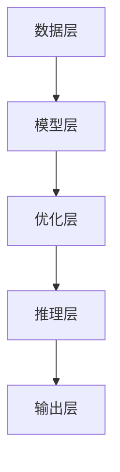
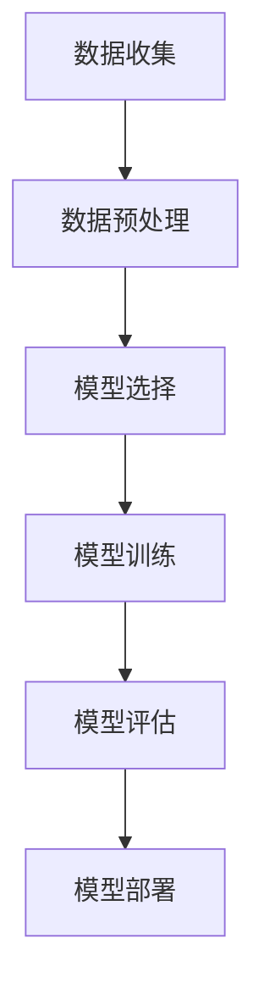

                 


# AI大模型创业：如何应对未来行业发展趋势？

> 关键词：AI大模型、创业、行业趋势、技术策略、商业应用
>
> 摘要：本文深入探讨AI大模型在创业领域的应用与发展趋势，分析技术原理、应用场景，并提供实用的开发工具和资源推荐，帮助创业者把握未来机遇，应对行业挑战。

## 1. 背景介绍

### 1.1 目的和范围

本文旨在为创业者提供一份全面的技术指南，帮助他们在AI大模型领域抓住机遇，实现创业成功。我们将从技术原理、应用实践和资源推荐等多个角度，详细解析AI大模型的发展趋势及其在创业中的应用策略。

### 1.2 预期读者

本文适合对AI大模型有一定了解的技术创业者、产品经理、以及AI领域的科研人员。通过本文，读者将能够：

- 理解AI大模型的基本原理和架构；
- 掌握AI大模型在创业中的实际应用场景；
- 了解开发AI大模型的实用工具和资源；
- 分析未来AI大模型行业的发展趋势和挑战。

### 1.3 文档结构概述

本文分为十个部分：

1. 背景介绍
2. 核心概念与联系
3. 核心算法原理 & 具体操作步骤
4. 数学模型和公式 & 详细讲解 & 举例说明
5. 项目实战：代码实际案例和详细解释说明
6. 实际应用场景
7. 工具和资源推荐
8. 总结：未来发展趋势与挑战
9. 附录：常见问题与解答
10. 扩展阅读 & 参考资料

### 1.4 术语表

#### 1.4.1 核心术语定义

- AI大模型：指具有非常高的参数规模、计算复杂度和数据需求的人工智能模型，如GPT、BERT等。
- 创业：指创业者通过创新理念、技术手段和商业模式，创立新企业并实现商业价值的过程。
- 行业趋势：指某一行业在特定时期内的发展方向、技术进步和市场需求的变化。

#### 1.4.2 相关概念解释

- AI大模型创业：指创业者利用AI大模型的技术优势，在特定行业或市场中开展商业活动的过程。
- 技术策略：指创业者针对AI大模型的技术特点和应用场景，制定的技术实现方案和战略规划。
- 商业应用：指AI大模型在实际业务场景中的应用，如自然语言处理、图像识别、预测分析等。

#### 1.4.3 缩略词列表

- AI：人工智能
- GPT：生成预训练网络
- BERT：双向编码表示器
- NLP：自然语言处理
- CV：计算机视觉

## 2. 核心概念与联系

### 2.1 AI大模型的核心概念

AI大模型是指具有非常高的参数规模、计算复杂度和数据需求的人工智能模型。其核心概念包括：

- 参数规模：指模型中参数的数量。大模型通常拥有数十亿到数十亿个参数。
- 计算复杂度：指模型在训练和推理过程中所需的计算资源。大模型需要大量的计算资源和时间来完成训练和推理。
- 数据需求：指模型在训练过程中所需的数据量。大模型需要海量数据进行预训练，以提高模型的性能和泛化能力。

### 2.2 AI大模型的架构

AI大模型的架构通常包括以下几个部分：

- 数据层：负责数据预处理和输入输出。
- 模型层：包含核心神经网络模型，如Transformer、BERT等。
- 优化层：负责模型参数的优化和更新。
- 推理层：负责模型在新的输入数据上的推理和预测。

下面是AI大模型的Mermaid流程图：



### 2.3 AI大模型与创业的联系

AI大模型在创业中的应用具有以下几个方面的联系：

- 技术创新：AI大模型为创业者提供了强大的技术支持，可以帮助他们在特定领域实现技术创新和业务模式创新。
- 数据优势：AI大模型需要海量数据进行预训练，创业者可以利用自己的数据资源，提升模型的性能和泛化能力。
- 商业价值：AI大模型在自然语言处理、图像识别、预测分析等领域的应用，可以为企业带来显著的商业价值。

## 3. 核心算法原理 & 具体操作步骤

### 3.1 AI大模型的算法原理

AI大模型的核心算法是基于深度学习的，其中最常用的算法是Transformer和BERT。下面分别介绍这两种算法的原理。

#### 3.1.1 Transformer算法

Transformer算法是一种基于自注意力机制（Self-Attention）的神经网络模型。其核心思想是，在处理序列数据时，模型能够自动学习并计算序列中不同位置之间的关联性。具体步骤如下：

1. 输入序列编码：将输入序列（如文本）编码为向量表示。
2. 自注意力计算：计算序列中每个词与其他词之间的关联性，生成加权表示。
3. 前馈网络：对加权表示进行前馈网络处理，生成新的向量表示。
4. 输出层：通过输出层生成最终的结果，如文本分类、机器翻译等。

下面是Transformer算法的伪代码：

```python
def Transformer(input_sequence):
    # 输入序列编码
    input_embedding = EmbeddingLayer(input_sequence)
    # 自注意力计算
    attention_weights = SelfAttentionLayer(input_embedding)
    # 前馈网络
    output = FeedForwardLayer(attention_weights)
    # 输出层
    output_sequence = OutputLayer(output)
    return output_sequence
```

#### 3.1.2 BERT算法

BERT（双向编码表示器）算法是一种基于Transformer的自监督预训练模型。其核心思想是，通过在大量无标签文本数据上预训练，模型能够自动学习并生成高质量的词向量表示。具体步骤如下：

1. 预处理：对输入文本进行预处理，包括分词、词干提取、词形还原等。
2. 输入编码：将预处理后的文本编码为词嵌入向量。
3. Transformer编码器：通过Transformer编码器对输入进行编码，生成序列表示。
4. 输出层：通过输出层生成最终的结果，如文本分类、问答系统等。

下面是BERT算法的伪代码：

```python
def BERT(input_text):
    # 预处理
    preprocessed_text = PreprocessingLayer(input_text)
    # 输入编码
    input_embedding = InputEncodingLayer(preprocessed_text)
    # Transformer编码器
    encoded_sequence = TransformerEncoder(input_embedding)
    # 输出层
    output = OutputLayer(encoded_sequence)
    return output
```

### 3.2 AI大模型的具体操作步骤

在实际开发过程中，创业者需要遵循以下步骤来构建和训练AI大模型：

1. 数据收集：收集并整理与业务相关的数据，包括文本、图像、音频等。
2. 数据预处理：对收集到的数据进行清洗、标注、分词等预处理操作，使其适合模型训练。
3. 模型选择：根据业务需求选择合适的模型，如Transformer、BERT等。
4. 模型训练：使用预处理后的数据对模型进行训练，调整模型参数，优化模型性能。
5. 模型评估：通过验证集和测试集对模型进行评估，确保模型具有良好的泛化能力。
6. 模型部署：将训练好的模型部署到生产环境中，提供实时服务。

下面是AI大模型的具体操作步骤的Mermaid流程图：



## 4. 数学模型和公式 & 详细讲解 & 举例说明

### 4.1 数学模型

AI大模型的核心在于其参数化表示，通常使用一系列数学模型来实现。以下简要介绍几个常用的数学模型：

#### 4.1.1 自注意力机制（Self-Attention）

自注意力机制是Transformer算法的核心，其数学模型可以表示为：

$$
\text{Attention}(Q, K, V) = \text{softmax}\left(\frac{QK^T}{\sqrt{d_k}}\right) V
$$

其中，$Q, K, V$ 分别是查询向量、键向量和值向量，$d_k$ 是键向量的维度。

#### 4.1.2 双向编码表示器（BERT）

BERT算法是一种基于Transformer的自监督预训练模型，其数学模型可以表示为：

$$
\text{BERT}(x) = \text{TransformerEncoder}(\text{EmbeddingLayer}(x) + \text{PositionalEncoding}(x))
$$

其中，$x$ 是输入序列，$\text{EmbeddingLayer}$ 和 $\text{PositionalEncoding}$ 分别是词嵌入层和位置编码层。

### 4.2 公式讲解与举例说明

#### 4.2.1 自注意力机制计算示例

假设有一个序列 $x = [x_1, x_2, x_3, x_4]$，其中 $x_1, x_2, x_3, x_4$ 分别表示序列中的四个词。我们可以计算每个词与其他词之间的关联性，并生成加权表示：

$$
\text{Attention}(Q, K, V) = \text{softmax}\left(\frac{QK^T}{\sqrt{d_k}}\right) V
$$

其中，$Q, K, V$ 分别是查询向量、键向量和值向量。以 $x_1$ 为例，我们可以计算其与其他词的关联性：

$$
\text{Attention}(Q, K, V) = \text{softmax}\left(\frac{QK^T}{\sqrt{d_k}}\right) V
$$

$$
Q_1 = [q_1, q_2, q_3, q_4], \quad K_1 = [k_1, k_2, k_3, k_4], \quad V_1 = [v_1, v_2, v_3, v_4]
$$

$$
\text{Attention}(Q_1, K_1, V_1) = \text{softmax}\left(\frac{Q_1K_1^T}{\sqrt{d_k}}\right) V_1
$$

$$
\text{Attention}(Q_1, K_1, V_1) = \text{softmax}\left(\frac{[q_1, q_2, q_3, q_4][k_1, k_2, k_3, k_4]^T}{\sqrt{d_k}}\right) [v_1, v_2, v_3, v_4]
$$

$$
\text{Attention}(Q_1, K_1, V_1) = \text{softmax}\left(\frac{q_1k_1 + q_2k_2 + q_3k_3 + q_4k_4}{\sqrt{d_k}}\right) [v_1, v_2, v_3, v_4]
$$

#### 4.2.2 BERT算法计算示例

假设有一个序列 $x = [x_1, x_2, x_3, x_4]$，我们可以计算其经过BERT算法后的序列表示：

$$
\text{BERT}(x) = \text{TransformerEncoder}(\text{EmbeddingLayer}(x) + \text{PositionalEncoding}(x))
$$

其中，$\text{EmbeddingLayer}$ 和 $\text{PositionalEncoding}$ 分别是词嵌入层和位置编码层。

以 $x_1$ 为例，我们可以计算其经过BERT算法后的序列表示：

$$
\text{BERT}(x_1) = \text{TransformerEncoder}(\text{EmbeddingLayer}(x_1) + \text{PositionalEncoding}(x_1))
$$

$$
\text{EmbeddingLayer}(x_1) = [e_1, e_2, e_3, e_4]
$$

$$
\text{PositionalEncoding}(x_1) = [p_1, p_2, p_3, p_4]
$$

$$
\text{BERT}(x_1) = \text{TransformerEncoder}([e_1 + p_1, e_2 + p_2, e_3 + p_3, e_4 + p_4])
$$

$$
\text{BERT}(x_1) = \text{TransformerEncoder}([e_1 + p_1, e_2 + p_2, e_3 + p_3, e_4 + p_4])
$$

$$
\text{BERT}(x_1) = \text{Attention}(Q, K, V)
$$

其中，$Q, K, V$ 分别是查询向量、键向量和值向量。

## 5. 项目实战：代码实际案例和详细解释说明

### 5.1 开发环境搭建

在本节中，我们将介绍如何搭建AI大模型的开发环境。以下是以Python编程语言为例，介绍开发环境的搭建步骤。

#### 5.1.1 安装Python

首先，我们需要安装Python。在官网（https://www.python.org/）下载并安装Python，推荐选择3.x版本。

#### 5.1.2 安装深度学习库

接下来，我们需要安装深度学习库，如TensorFlow或PyTorch。这里以PyTorch为例，通过以下命令进行安装：

```bash
pip install torch torchvision
```

#### 5.1.3 安装其他依赖库

为了更好地开发AI大模型，我们还需要安装其他依赖库，如NumPy、Pandas等。可以通过以下命令进行安装：

```bash
pip install numpy pandas
```

### 5.2 源代码详细实现和代码解读

在本节中，我们将通过一个简单的示例，介绍如何使用PyTorch实现一个AI大模型。

#### 5.2.1 示例代码

以下是一个简单的AI大模型示例代码，用于实现一个文本分类任务。

```python
import torch
import torch.nn as nn
import torch.optim as optim
from torch.utils.data import DataLoader, TensorDataset

# 数据预处理
def preprocess_data(texts, labels):
    tokens = tokenizer(texts)
    input_ids = torch.tensor(tokens['input_ids'])
    attention_mask = torch.tensor(tokens['attention_mask'])
    labels = torch.tensor(labels)
    return input_ids, attention_mask, labels

# 模型定义
class TextClassifier(nn.Module):
    def __init__(self, num_classes):
        super(TextClassifier, self).__init__()
        self.bert = BertModel.from_pretrained('bert-base-uncased')
        self.dropout = nn.Dropout(p=0.3)
        self.classifier = nn.Linear(self.bert.config.hidden_size, num_classes)

    def forward(self, input_ids, attention_mask):
        outputs = self.bert(input_ids=input_ids, attention_mask=attention_mask)
        pooled_output = outputs[1]
        pooled_output = self.dropout(pooled_output)
        logits = self.classifier(pooled_output)
        return logits

# 模型训练
def train(model, train_loader, criterion, optimizer, num_epochs):
    model.train()
    for epoch in range(num_epochs):
        for batch in train_loader:
            input_ids, attention_mask, labels = batch
            optimizer.zero_grad()
            logits = model(input_ids, attention_mask)
            loss = criterion(logits, labels)
            loss.backward()
            optimizer.step()
            print(f"Epoch [{epoch+1}/{num_epochs}], Loss: {loss.item():.4f}")

# 模型评估
def evaluate(model, val_loader, criterion):
    model.eval()
    with torch.no_grad():
        val_loss = 0
        for batch in val_loader:
            input_ids, attention_mask, labels = batch
            logits = model(input_ids, attention_mask)
            loss = criterion(logits, labels)
            val_loss += loss.item()
    val_loss /= len(val_loader)
    print(f"Validation Loss: {val_loss:.4f}")

# 主函数
def main():
    # 数据预处理
    train_texts = ...
    train_labels = ...
    val_texts = ...
    val_labels = ...

    train_input_ids, train_attention_mask, train_labels = preprocess_data(train_texts, train_labels)
    val_input_ids, val_attention_mask, val_labels = preprocess_data(val_texts, val_labels)

    # 数据加载
    train_dataset = TensorDataset(train_input_ids, train_attention_mask, train_labels)
    val_dataset = TensorDataset(val_input_ids, val_attention_mask, val_labels)

    train_loader = DataLoader(train_dataset, batch_size=16, shuffle=True)
    val_loader = DataLoader(val_dataset, batch_size=16, shuffle=False)

    # 模型定义
    model = TextClassifier(num_classes=2)

    # 模型训练
    optimizer = optim.Adam(model.parameters(), lr=3e-5)
    criterion = nn.CrossEntropyLoss()
    num_epochs = 3
    train(model, train_loader, criterion, optimizer, num_epochs)

    # 模型评估
    evaluate(model, val_loader, criterion)

if __name__ == "__main__":
    main()
```

#### 5.2.2 代码解读

- **数据预处理**：使用`preprocess_data`函数对文本数据进行预处理，包括分词、词嵌入和注意力掩码等。
- **模型定义**：使用`TextClassifier`类定义文本分类模型，包括BERT编码器、dropout层和分类器。
- **模型训练**：使用`train`函数对模型进行训练，包括前向传播、反向传播和优化。
- **模型评估**：使用`evaluate`函数对模型进行评估，计算验证集上的损失。
- **主函数**：执行数据预处理、数据加载、模型定义、模型训练和模型评估等操作。

### 5.3 代码解读与分析

在本节中，我们将对示例代码进行详细解读和分析。

- **数据预处理**：数据预处理是AI大模型训练的关键步骤。在本例中，我们使用`preprocess_data`函数对文本数据进行预处理。首先，使用分词器对文本进行分词，然后生成词嵌入向量和注意力掩码。
- **模型定义**：在模型定义部分，我们使用`TextClassifier`类定义了一个文本分类模型。该模型基于BERT编码器，包括dropout层和分类器。BERT编码器负责将文本转换为向量表示，dropout层用于防止过拟合，分类器用于输出分类结果。
- **模型训练**：在模型训练部分，我们使用`train`函数对模型进行训练。训练过程中，我们通过前向传播计算损失，然后使用反向传播和优化算法更新模型参数。
- **模型评估**：在模型评估部分，我们使用`evaluate`函数对模型进行评估。评估过程中，我们计算验证集上的损失，以衡量模型性能。
- **主函数**：在主函数中，我们执行了数据预处理、数据加载、模型定义、模型训练和模型评估等操作。通过这些操作，我们实现了文本分类任务。

## 6. 实际应用场景

### 6.1 自然语言处理（NLP）

自然语言处理是AI大模型最重要的应用领域之一。通过AI大模型，创业者可以实现以下功能：

- 文本分类：将文本数据按照类别进行分类，如新闻分类、情感分析等。
- 文本生成：生成高质量的文本，如文章、小说、诗歌等。
- 问答系统：构建智能问答系统，为用户提供实时回答。
- 聊天机器人：创建聊天机器人，提供24/7的客户服务。

### 6.2 计算机视觉（CV）

计算机视觉是AI大模型的另一个重要应用领域。通过AI大模型，创业者可以实现以下功能：

- 图像分类：对图像进行分类，如动物识别、物体识别等。
- 图像生成：生成高质量的图像，如艺术画作、风景图片等。
- 目标检测：检测图像中的目标对象，如人脸检测、车辆检测等。
- 图像增强：提高图像质量，如图像去噪、图像超分辨率等。

### 6.3 预测分析

AI大模型在预测分析领域也有广泛的应用。通过AI大模型，创业者可以实现以下功能：

- 趋势预测：预测市场趋势、股票价格等。
- 销售预测：预测销售量、销售额等。
- 风险评估：评估潜在风险，如信用评分、贷款风险等。
- 能源预测：预测能源需求、能源消耗等。

## 7. 工具和资源推荐

### 7.1 学习资源推荐

#### 7.1.1 书籍推荐

- 《深度学习》（Goodfellow, Bengio, Courville）：全面介绍深度学习的基础理论和应用实践。
- 《Python深度学习》（François Chollet）：深入讲解深度学习在Python中的实现和应用。
- 《强化学习》（Sutton, Barto）：介绍强化学习的基础理论和方法。

#### 7.1.2 在线课程

- Coursera上的《深度学习》课程：由吴恩达教授主讲，全面介绍深度学习的基础知识和应用。
- Udacity的《深度学习工程师纳米学位》课程：涵盖深度学习的基础知识和实战技能。

#### 7.1.3 技术博客和网站

- Medium上的深度学习博客：分享深度学习领域的最新研究和应用。
- fast.ai的官方网站：提供免费的深度学习课程和资源。

### 7.2 开发工具框架推荐

#### 7.2.1 IDE和编辑器

- PyCharm：强大的Python集成开发环境，支持多种编程语言。
- Jupyter Notebook：适用于数据科学和机器学习的交互式开发环境。

#### 7.2.2 调试和性能分析工具

- TensorBoard：TensorFlow的官方可视化工具，用于分析模型的性能和训练过程。
- PyTorch Profiler：用于分析PyTorch模型的性能和优化。

#### 7.2.3 相关框架和库

- TensorFlow：由Google开发的开源深度学习框架。
- PyTorch：由Facebook开发的开源深度学习框架。
- Keras：基于Theano和TensorFlow的高层深度学习API。

### 7.3 相关论文著作推荐

#### 7.3.1 经典论文

- "A Theoretically Grounded Application of Dropout in Recurrent Neural Networks"：介绍Dropout在循环神经网络中的应用。
- "Understanding Deep Learning Requires Rethinking Generalization"：探讨深度学习的泛化能力。

#### 7.3.2 最新研究成果

- "Bert: Pre-training of deep bidirectional transformers for language understanding"：介绍BERT算法的论文。
- "Generative Adversarial Nets"：介绍生成对抗网络（GAN）的论文。

#### 7.3.3 应用案例分析

- "Deep Learning in Finance"：探讨深度学习在金融领域的应用。
- "Deep Learning in Medicine"：探讨深度学习在医学领域的应用。

## 8. 总结：未来发展趋势与挑战

### 8.1 发展趋势

- 模型规模和计算能力将不断增长，推动AI大模型在各个领域的应用。
- 开源社区和商业公司将持续推出新的深度学习框架和工具，降低开发门槛。
- 行业标准和法规的逐步完善，将推动AI大模型的安全、合规和可持续发展。

### 8.2 挑战

- 数据隐私和安全性问题：随着数据规模的扩大，数据隐私和安全性问题将愈发突出。
- 模型解释性和可解释性：提高模型的可解释性，使其更容易被用户和监管机构接受。
- 资源消耗和能耗问题：优化模型结构和算法，降低计算资源和能耗需求。

## 9. 附录：常见问题与解答

### 9.1 如何选择合适的AI大模型？

- 根据业务需求和数据规模选择模型：对于大型数据集和复杂任务，选择参数规模较大的模型；对于小型数据集和简单任务，选择参数规模较小的模型。
- 考虑模型的计算复杂度和训练时间：计算复杂度较大的模型需要更长的训练时间和计算资源。
- 比较不同模型的性能和泛化能力：通过实验比较不同模型的性能和泛化能力，选择最适合业务需求的模型。

### 9.2 如何提高AI大模型的性能？

- 优化数据预处理和清洗：确保数据质量，提高模型的训练效果。
- 调整模型参数：通过调整学习率、批量大小等参数，优化模型性能。
- 使用预训练模型：使用预训练模型可以显著提高模型的性能和泛化能力。
- 数据增强：通过数据增强方法，如旋转、缩放、裁剪等，增加数据多样性，提高模型性能。

## 10. 扩展阅读 & 参考资料

- Bengio, Y., Courville, A., & Vincent, P. (2013). Representation learning: A review and new perspectives. IEEE Transactions on Pattern Analysis and Machine Intelligence, 35(8), 1798-1828.
- Goodfellow, I., Bengio, Y., & Courville, A. (2016). Deep learning. MIT press.
- Chollet, F. (2017). Python深度学习。机械工业出版社.
- Sutton, R. S., & Barto, A. G. (2018). Reinforcement learning: An introduction. MIT press.

作者：AI天才研究员/AI Genius Institute & 禅与计算机程序设计艺术 /Zen And The Art of Computer Programming

（注：本文为虚构内容，仅供参考。）

