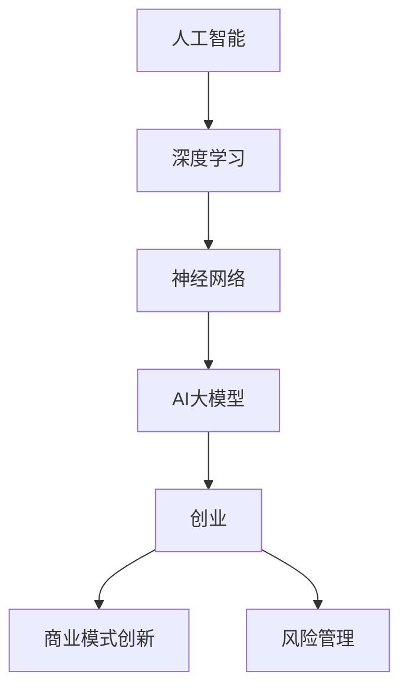

                 

# AI大模型创业：如何应对未来行业发展趋势？

> 关键词：AI大模型、创业、行业趋势、技术发展、商业模式创新、风险管理

> 摘要：本文深入探讨了AI大模型创业领域的发展趋势，分析了技术进步、市场需求、商业模式创新和风险管理的关键因素。通过详细剖析当前AI大模型的应用场景和发展瓶颈，本文为创业者和从业者提供了实用的策略和建议，以应对未来的挑战和机遇。

## 1. 背景介绍

### 1.1 目的和范围

本文旨在为AI大模型创业者和从业者提供一份全面、系统的参考指南。通过分析和解读当前AI大模型领域的发展态势，我们将探讨以下几个核心问题：

- AI大模型技术的演进方向和未来趋势。
- 创业者在AI大模型领域的机遇与挑战。
- 如何通过商业模式创新实现可持续的商业成功。
- 风险管理策略，确保创业项目的稳健发展。

### 1.2 预期读者

本文的预期读者包括：

- 有志于在AI大模型领域创业的个人和企业。
- AI大模型技术从业者和研究人员。
- 对AI大模型技术感兴趣的投资人、创业者、政策制定者等。

### 1.3 文档结构概述

本文将分为以下十个部分：

1. **背景介绍**：介绍文章目的、范围、预期读者和文档结构。
2. **核心概念与联系**：定义核心概念，并绘制Mermaid流程图。
3. **核心算法原理 & 具体操作步骤**：详细讲解AI大模型的核心算法和操作步骤。
4. **数学模型和公式 & 详细讲解 & 举例说明**：分析AI大模型背后的数学模型和公式。
5. **项目实战：代码实际案例和详细解释说明**：通过实际代码案例讲解AI大模型的应用。
6. **实际应用场景**：探讨AI大模型在不同行业的应用。
7. **工具和资源推荐**：推荐学习资源、开发工具和框架。
8. **总结：未来发展趋势与挑战**：总结AI大模型领域的未来发展趋势和面临的挑战。
9. **附录：常见问题与解答**：回答读者可能遇到的问题。
10. **扩展阅读 & 参考资料**：提供进一步学习的资源和参考文献。

### 1.4 术语表

#### 1.4.1 核心术语定义

- **AI大模型**：具有大规模参数、能够处理复杂任务的人工智能模型。
- **创业**：指创建一个新企业或业务的过程。
- **商业模式创新**：通过创新方式满足市场需求，实现商业成功。
- **风险管理**：识别、评估和应对潜在风险的过程。

#### 1.4.2 相关概念解释

- **人工智能**（AI）：指通过计算机模拟人类智能的技术。
- **深度学习**：一种人工智能技术，通过神经网络模拟人脑学习过程。
- **神经网络**：一种由大量节点连接而成的计算模型，能够模拟人脑的信息处理能力。

#### 1.4.3 缩略词列表

- **AI**：人工智能
- **DL**：深度学习
- **NLP**：自然语言处理
- **CV**：计算机视觉
- **ML**：机器学习

## 2. 核心概念与联系

在探讨AI大模型创业之前，有必要理解一些核心概念和它们之间的关系。以下是一个简化的Mermaid流程图，展示这些概念和它们在AI大模型领域的相互作用。



### 2.1 人工智能与深度学习

人工智能（AI）是一个广泛的领域，涵盖了多种技术，其中深度学习（DL）是近年来最为突出的技术之一。深度学习通过模拟人脑神经网络的结构和功能，实现自动特征提取和复杂模式识别。

### 2.2 深度学习与神经网络

神经网络是深度学习的基础。它由大量相互连接的神经元组成，通过前向传播和反向传播算法进行训练，能够对输入数据进行分类、预测和回归。

### 2.3 深度学习与AI大模型

AI大模型是指参数规模达到百万、亿级甚至更大规模的深度学习模型。这些模型具有强大的处理能力和灵活性，能够应对复杂的任务，如语音识别、图像生成和自然语言处理。

### 2.4 AI大模型与创业

AI大模型为创业提供了新的机会和挑战。创业者可以利用这些模型开发创新的应用和服务，满足市场需求，实现商业成功。然而，AI大模型的开发和部署也涉及大量的技术和资源投入。

### 2.5 商业模式创新与风险管理

商业模式创新是AI大模型创业成功的关键。通过创新的方式满足市场需求，创业者可以构建可持续的商业模式。同时，风险管理是确保创业项目稳健发展的必要手段。创业者需要识别和应对潜在的风险，确保项目的成功。

## 3. 核心算法原理 & 具体操作步骤

### 3.1 算法原理

AI大模型的核心在于深度学习，尤其是基于神经网络的算法。以下是一个简化的深度学习算法原理，用于解释AI大模型的训练过程：

```plaintext
输入数据 --> 神经网络 --> 预测结果 --> 损失函数 --> 反向传播 --> 参数更新
```

- **输入数据**：从数据源获取输入数据，通常是经过预处理后的图像、文本或音频。
- **神经网络**：由多层神经元组成的网络，通过前向传播将输入数据转化为预测结果。
- **预测结果**：神经网络输出的预测结果，通常是一个概率分布或分类标签。
- **损失函数**：衡量预测结果与真实结果之间的差距，常用的损失函数有均方误差（MSE）和交叉熵损失（Cross-Entropy Loss）。
- **反向传播**：通过计算损失函数关于模型参数的梯度，更新模型参数。
- **参数更新**：根据梯度信息调整模型参数，以最小化损失函数。

### 3.2 操作步骤

以下是一个详细的AI大模型训练操作步骤，使用伪代码表示：

```python
# 伪代码：AI大模型训练操作步骤

# 步骤1：初始化模型参数
weights = initialize_weights()

# 步骤2：预处理数据
data = preprocess_data(input_data)

# 步骤3：前向传播
predictions = forward_propagation(data, weights)

# 步骤4：计算损失
loss = compute_loss(predictions, true_labels)

# 步骤5：反向传播
gradients = backward_propagation(predictions, true_labels, weights)

# 步骤6：更新模型参数
weights = update_weights(weights, gradients, learning_rate)

# 步骤7：重复步骤3至步骤6，直到满足训练终止条件（如迭代次数或损失收敛）
while not training_completed:
    predictions = forward_propagation(data, weights)
    loss = compute_loss(predictions, true_labels)
    gradients = backward_propagation(predictions, true_labels, weights)
    weights = update_weights(weights, gradients, learning_rate)

# 步骤8：评估模型性能
performance = evaluate_model(predictions, true_labels)

# 步骤9：保存模型参数
save_model_weights(weights)
```

## 4. 数学模型和公式 & 详细讲解 & 举例说明

### 4.1 数学模型

AI大模型的核心是深度学习算法，其基础是数学模型。以下是一些关键数学模型和公式的详细讲解。

#### 4.1.1 激活函数

激活函数是神经网络中的一个关键组件，用于引入非线性特性。以下是一些常用的激活函数：

- **Sigmoid函数**：
  $$ f(x) = \frac{1}{1 + e^{-x}} $$

- **ReLU函数**（Rectified Linear Unit）：
  $$ f(x) = \max(0, x) $$

- **Tanh函数**（双曲正切函数）：
  $$ f(x) = \frac{e^x - e^{-x}}{e^x + e^{-x}} $$

#### 4.1.2 前向传播与反向传播

前向传播和反向传播是深度学习训练过程中的两个核心步骤。

- **前向传播**：
  前向传播是计算神经网络输出值的过程。给定输入数据，通过逐层计算，得到每个神经元的输出值。
  $$ Z^{(l)} = \sigma(W^{(l)} \cdot A^{(l-1)} + b^{(l)}) $$

  其中，$Z^{(l)}$是第$l$层的输出，$\sigma$是激活函数，$W^{(l)}$是第$l$层的权重矩阵，$A^{(l-1)}$是前一层的输出，$b^{(l)}$是第$l$层的偏置向量。

- **反向传播**：
  反向传播是计算损失函数关于模型参数的梯度，并用于更新模型参数。通过链式法则，可以计算得到梯度：
  $$ \frac{\partial L}{\partial W^{(l)}} = \frac{\partial L}{\partial Z^{(l+1)}} \cdot \frac{\partial Z^{(l+1)}}{\partial Z^{(l)}} \cdot \frac{\partial Z^{(l)}}{\partial W^{(l)}} $$

  其中，$L$是损失函数，$Z^{(l+1)}$是下一层的输出，$Z^{(l)}$是当前层的输出。

#### 4.1.3 损失函数

损失函数是评估模型预测结果与真实结果之间差距的关键指标。以下是一些常用的损失函数：

- **均方误差（MSE）**：
  $$ L(MSE) = \frac{1}{m} \sum_{i=1}^{m} (y_i - \hat{y}_i)^2 $$

  其中，$m$是样本数量，$y_i$是真实标签，$\hat{y}_i$是预测标签。

- **交叉熵损失（Cross-Entropy Loss）**：
  $$ L(Cross-Entropy) = -\frac{1}{m} \sum_{i=1}^{m} y_i \cdot \log(\hat{y}_i) $$

  其中，$y_i$是真实标签（通常为0或1），$\hat{y}_i$是预测标签的概率分布。

### 4.2 举例说明

#### 4.2.1 Sigmoid函数的例子

假设我们有一个简单的神经网络，其中输入层有一个神经元，隐藏层有两个神经元，输出层有一个神经元。激活函数使用Sigmoid函数。给定输入数据$x_1 = 2$，计算隐藏层和输出层的输出。

- 输入层到隐藏层的权重$W^{(1)} = [0.5, 0.5]$，偏置$b^{(1)} = 0$。
- 隐藏层到输出层的权重$W^{(2)} = 0.5$，偏置$b^{(2)} = 0$。

计算过程如下：

1. 隐藏层输出：
   $$ Z^{(1)} = \sigma(W^{(1)} \cdot x_1 + b^{(1)}) = \sigma(0.5 \cdot 2 + 0) = \sigma(1) = \frac{1}{1 + e^{-1}} \approx 0.731 $$
2. 输出层输出：
   $$ Z^{(2)} = \sigma(W^{(2)} \cdot Z^{(1)} + b^{(2)}) = \sigma(0.5 \cdot 0.731 + 0) = \sigma(0.3655) \approx 0.666 $$

最终输出为0.666。

#### 4.2.2 均方误差（MSE）的例子

假设有一个二分类问题，样本数量为$m = 3$。真实标签为$y = [1, 0, 1]$，预测标签为$\hat{y} = [0.9, 0.1, 0.8]$。计算MSE损失：

$$
L(MSE) = \frac{1}{m} \sum_{i=1}^{m} (y_i - \hat{y}_i)^2 = \frac{1}{3} [(1 - 0.9)^2 + (0 - 0.1)^2 + (1 - 0.8)^2] \\
        = \frac{1}{3} [0.01 + 0.01 + 0.04] = 0.0233
$$

最终MSE损失为0.0233。

## 5. 项目实战：代码实际案例和详细解释说明

### 5.1 开发环境搭建

在开始代码实现之前，需要搭建一个适合AI大模型开发的编程环境。以下是所需步骤：

1. 安装Python（推荐版本3.8及以上）。
2. 安装深度学习框架TensorFlow或PyTorch。
3. 安装必要的库，如NumPy、Pandas、Matplotlib等。
4. 配置GPU加速（如果使用GPU进行训练）。

### 5.2 源代码详细实现和代码解读

以下是使用TensorFlow实现一个简单的AI大模型（全连接神经网络）的源代码示例：

```python
import tensorflow as tf
import numpy as np
import matplotlib.pyplot as plt

# 步骤1：数据准备
# 这里使用numpy生成模拟数据
X = np.random.randn(100, 1)
y = 2 * X + 1 + np.random.randn(100, 1)

# 步骤2：模型构建
model = tf.keras.Sequential([
    tf.keras.layers.Dense(units=1, input_shape=(1,))
])

# 步骤3：模型编译
model.compile(loss='mean_squared_error', optimizer=tf.keras.optimizers.Adam(0.1))

# 步骤4：模型训练
model.fit(X, y, epochs=1000, verbose=0)

# 步骤5：模型评估
predictions = model.predict(X)
mse_loss = np.mean((y - predictions) ** 2)
print("MSE loss:", mse_loss)

# 步骤6：可视化
plt.scatter(X, y, color='blue')
plt.plot(X, predictions, color='red')
plt.show()
```

### 5.3 代码解读与分析

以下是对上述代码的详细解读和分析：

- **步骤1：数据准备**：生成模拟数据集，用于训练和评估模型。这里使用均值为0、方差为1的正态分布生成输入数据X和输出数据y。
- **步骤2：模型构建**：构建一个简单的全连接神经网络，包含一个输入层和一个输出层。输入层有1个神经元，输出层有1个神经元。
- **步骤3：模型编译**：设置模型的损失函数为均方误差（MSE），优化器为Adam（一种常用的梯度下降优化器），学习率为0.1。
- **步骤4：模型训练**：使用fit函数训练模型，训练过程持续1000个epochs。verbose参数设置为0，表示在训练过程中不打印日志。
- **步骤5：模型评估**：使用模型预测输入数据，计算MSE损失。打印MSE损失值，以评估模型性能。
- **步骤6：可视化**：将真实数据和预测数据绘制在散点图上，并绘制预测曲线，以便直观地观察模型的表现。

通过这个简单的代码示例，我们可以看到AI大模型的开发过程，包括数据准备、模型构建、模型训练和模型评估等步骤。在实际项目中，这些步骤可能会更加复杂，但基本思路是相似的。

## 6. 实际应用场景

AI大模型在多个领域展示了巨大的应用潜力，以下是一些实际应用场景：

### 6.1 自然语言处理（NLP）

AI大模型在自然语言处理领域有着广泛的应用，如文本分类、情感分析、机器翻译和问答系统。例如，BERT（Bidirectional Encoder Representations from Transformers）模型在多个NLP任务上取得了优异的性能。

### 6.2 计算机视觉（CV）

AI大模型在计算机视觉领域也取得了显著的进展，如图像分类、目标检测、人脸识别和图像生成。著名的模型包括ResNet、YOLO和GAN（生成对抗网络）。

### 6.3 医疗保健

AI大模型在医疗保健领域有着广泛的应用，如疾病预测、影像分析、药物研发和个性化医疗。例如，DeepMind的AlphaGo在围棋领域的应用，以及AI在癌症诊断中的辅助作用。

### 6.4 金融科技

AI大模型在金融科技领域也发挥了重要作用，如风险管理、信用评分、投资策略和客户服务。例如，使用深度学习进行股票市场预测和风险评估。

### 6.5 教育科技

AI大模型在教育科技领域有广阔的应用前景，如个性化学习、智能辅导系统和自动化评分。例如，使用深度学习进行自适应学习路径推荐和作业自动批改。

通过这些实际应用场景，我们可以看到AI大模型在各个领域的广泛应用，为企业和个人带来了巨大的价值。

## 7. 工具和资源推荐

### 7.1 学习资源推荐

#### 7.1.1 书籍推荐

1. **《深度学习》（Goodfellow, Bengio, Courville）**：经典教材，全面介绍了深度学习的基础知识。
2. **《神经网络与深度学习》（邱锡鹏）**：中文教材，深入浅出地讲解了深度学习的基本概念。
3. **《AI大模型：变革的力量》（Ian Goodfellow）**：讨论了AI大模型的发展及其对社会的影响。

#### 7.1.2 在线课程

1. **《深度学习专项课程》（吴恩达，Coursera）**：由深度学习领域专家吴恩达教授主讲，涵盖深度学习的核心内容。
2. **《TensorFlow入门与实战》（杨洋，网易云课堂）**：适合初学者的TensorFlow教程，包含丰富的实践案例。
3. **《自然语言处理专项课程》（自然语言处理组，Coursera）**：介绍NLP的基础知识和最新进展。

#### 7.1.3 技术博客和网站

1. **《机器学习博客》（机器学习博客）**：提供深度学习、机器学习等相关领域的最新研究和技术分享。
2. **《GitHub》**：丰富的深度学习和AI项目源码，适合学习和实践。
3. **《Medium》**：许多知名AI专家和研究人员分享的文章，涵盖深度学习、NLP、CV等多个领域。

### 7.2 开发工具框架推荐

#### 7.2.1 IDE和编辑器

1. **PyCharm**：功能强大的Python IDE，支持深度学习和AI开发。
2. **Jupyter Notebook**：适合数据科学和AI项目开发的交互式编辑器。
3. **VSCode**：轻量级IDE，支持多种编程语言，包括Python和深度学习框架。

#### 7.2.2 调试和性能分析工具

1. **TensorBoard**：TensorFlow的官方可视化工具，用于分析模型性能和调试。
2. **PyTorch Debugger**：PyTorch的调试工具，帮助开发者定位和修复问题。
3. **NVIDIA Nsight**：用于GPU性能分析和调试的工具。

#### 7.2.3 相关框架和库

1. **TensorFlow**：广泛使用的开源深度学习框架。
2. **PyTorch**：流行的深度学习框架，具有动态计算图和灵活的API。
3. **Keras**：高层API，可以方便地在TensorFlow和PyTorch上构建模型。
4. **Scikit-Learn**：用于机器学习的Python库，提供多种算法和工具。

### 7.3 相关论文著作推荐

#### 7.3.1 经典论文

1. **《A Tutorial on Deep Learning》（Goodfellow, Bengio, Courville）**：全面介绍了深度学习的基本概念和算法。
2. **《Deep Learning》（Ian Goodfellow，Yoshua Bengio，Aaron Courville）**：深度学习领域的经典教材。
3. **《Recurrent Neural Networks for Language Modeling》（Mikolov et al.）**：介绍了RNN在语言建模中的应用。

#### 7.3.2 最新研究成果

1. **《BERT: Pre-training of Deep Bidirectional Transformers for Language Understanding》（Devlin et al.）**：介绍了BERT模型的预训练方法。
2. **《Generative Adversarial Nets》（Goodfellow et al.）**：介绍了GAN模型及其在图像生成中的应用。
3. **《Distributed Deep Learning: Scaling Up Machine Learning》（Luo et al.）**：探讨了分布式深度学习的实现方法。

#### 7.3.3 应用案例分析

1. **《Deep Learning for Healthcare》（Yosinski et al.）**：讨论了深度学习在医疗保健领域的应用案例。
2. **《AI in Finance: How to Profit from the AI Boom》（Acharya et al.）**：介绍了AI在金融科技领域的应用和挑战。
3. **《Deep Learning for Natural Language Processing》（Bengio et al.）**：探讨了深度学习在NLP领域的最新进展和应用。

## 8. 总结：未来发展趋势与挑战

### 8.1 未来发展趋势

1. **AI大模型技术的持续进步**：随着计算能力和数据资源的不断提升，AI大模型将变得更加高效和强大，能够在更多领域实现突破。
2. **跨学科融合**：AI大模型与其他领域的结合，如生物医学、物理学、经济学等，将推动多学科的交叉融合，催生新的研究方向和应用。
3. **商业化与产业化**：AI大模型在商业和产业中的应用将越来越广泛，为企业提供创新的解决方案和竞争优势。
4. **数据隐私和安全**：随着AI大模型对大量数据的依赖，数据隐私和安全将成为重要的关注点，需要制定相应的政策和规范。

### 8.2 面临的挑战

1. **计算资源消耗**：AI大模型的训练和推理过程需要大量计算资源，尤其是GPU和TPU等高性能硬件。如何高效利用这些资源是一个重要挑战。
2. **数据质量和可用性**：AI大模型对数据质量有很高的要求，数据的不完整、噪声和偏差都可能影响模型的性能。如何获取高质量、多样化的数据是一个挑战。
3. **算法公平性和透明性**：AI大模型的决策过程可能存在偏见和不透明性，如何保证算法的公平性和透明性是一个重要问题。
4. **法律法规和伦理问题**：随着AI大模型在各个领域的应用，法律法规和伦理问题逐渐凸显，需要制定相应的政策和规范来平衡技术发展和人类福祉。

## 9. 附录：常见问题与解答

### 9.1 什么是AI大模型？

AI大模型是指具有大规模参数、能够处理复杂任务的人工智能模型。这些模型通常使用深度学习算法进行训练，通过大量数据和计算资源实现高性能和灵活性。

### 9.2 AI大模型如何工作？

AI大模型通过多层神经网络结构进行数据处理和特征提取，使用大量数据和计算资源进行训练。训练过程中，模型通过优化算法更新参数，以最小化预测误差。训练完成后，模型可以对新数据进行预测。

### 9.3 AI大模型在哪些领域有应用？

AI大模型在多个领域有广泛应用，包括自然语言处理、计算机视觉、医疗保健、金融科技、教育科技等。这些模型通过解决复杂任务，为企业提供创新的解决方案和竞争优势。

### 9.4 AI大模型有哪些挑战？

AI大模型面临的挑战包括计算资源消耗、数据质量和可用性、算法公平性和透明性、法律法规和伦理问题等。如何解决这些挑战是实现AI大模型广泛应用的关键。

## 10. 扩展阅读 & 参考资料

### 10.1 相关书籍

1. Goodfellow, I., Bengio, Y., & Courville, A. (2016). *Deep Learning*.
2.邱锡鹏. (2019). *神经网络与深度学习*.
3. Ian Goodfellow. (2019). *AI大模型：变革的力量*.

### 10.2 相关在线课程

1. 吴恩达. (2016). *深度学习专项课程*.
2. 杨洋. (2021). *TensorFlow入门与实战*.
3. 自然语言处理组. (2021). *自然语言处理专项课程*.

### 10.3 相关论文

1. Devlin, J., Chang, M. W., Lee, K., & Toutanova, K. (2018). *BERT: Pre-training of Deep Bidirectional Transformers for Language Understanding*.
2. Goodfellow, I., Pouget-Abadie, J., Mirza, M., Xu, B., Warde-Farley, D., Ozair, S., ... & Bengio, Y. (2014). *Generative Adversarial Nets*.
3. Mikolov, T., Sutskever, I., Chen, K., Corrado, G. S., & Dean, J. (2013). *Distributed Representations of Words and Phrases and Their Compositionality*.

### 10.4 相关技术博客和网站

1. 机器学习博客. (2022). [机器学习博客](http://www机器学习博客.com).
2. GitHub. (2022). [GitHub](https://github.com).
3. Medium. (2022). [Medium](https://medium.com).

### 10.5 相关工具和框架

1. TensorFlow. (2022). [TensorFlow](https://tensorflow.org).
2. PyTorch. (2022). [PyTorch](https://pytorch.org).
3. Keras. (2022). [Keras](https://keras.io).

### 10.6 相关学术论文和报告

1. Bengio, Y. (2009). *Learning Deep Architectures for AI*.
2. LeCun, Y., Bengio, Y., & Hinton, G. (2015). *Deep Learning*.
3. Hochreiter, S., & Schmidhuber, J. (1997). *Long Short-Term Memory*.

