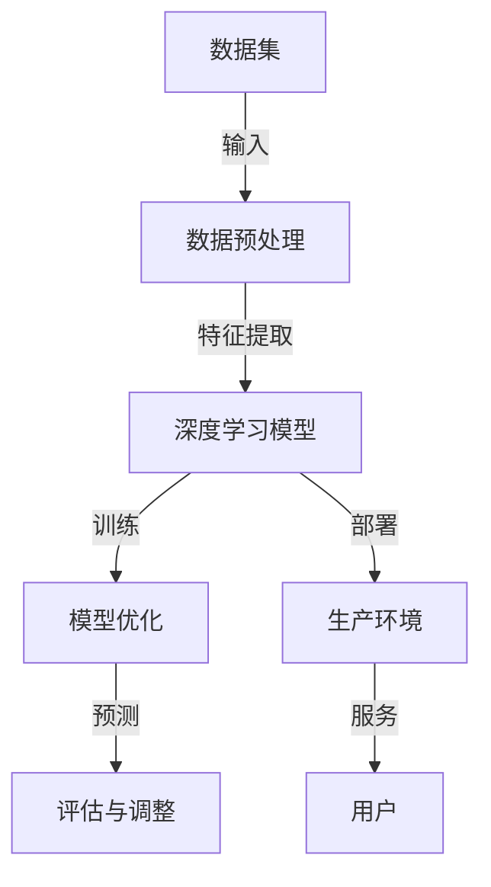

                 

# AI大模型创业：如何应对未来行业发展趋势？

> **关键词：** AI大模型、创业、行业发展趋势、技术架构、市场策略

> **摘要：** 本文旨在深入探讨AI大模型在创业中的应用，分析其技术架构、市场需求和未来发展趋势，为创业者和从业者提供有价值的指导和策略。

## 1. 背景介绍

### 1.1 目的和范围

本文将围绕AI大模型在创业中的应用进行探讨，分析其在不同行业中的发展趋势，提供技术架构和市场策略的建议。本文的目标是帮助创业者和从业者更好地理解AI大模型的潜力，为其创业项目提供可行的方向和路径。

### 1.2 预期读者

本文适用于对AI领域有一定了解的技术人员、创业者、企业家和研究人员。特别适合希望利用AI大模型开展创业项目的读者。

### 1.3 文档结构概述

本文将分为十个部分：背景介绍、核心概念与联系、核心算法原理与操作步骤、数学模型与公式、项目实战、实际应用场景、工具和资源推荐、总结、常见问题与解答以及扩展阅读与参考资料。每个部分都将详细探讨AI大模型在不同方面的应用。

### 1.4 术语表

#### 1.4.1 核心术语定义

- **AI大模型：** 具有大规模参数和强大计算能力的深度学习模型，如BERT、GPT等。
- **创业：** 创办一家新公司或开展一项新的业务。
- **技术架构：** 用于支持AI大模型部署和运行的基础设施和软件。
- **市场策略：** 企业为在市场中竞争而采取的行动和计划。

#### 1.4.2 相关概念解释

- **深度学习：** 一种基于神经网络的人工智能方法，通过多层神经网络进行特征提取和建模。
- **创业生态系统：** 创业所需的各种资源、机构和社群的总和。

#### 1.4.3 缩略词列表

- **AI：** 人工智能
- **NLP：** 自然语言处理
- **ML：** 机器学习
- **DL：** 深度学习
- **GPU：** 图形处理单元
- **CPU：** 中央处理器
- **API：** 应用程序编程接口

## 2. 核心概念与联系

在探讨AI大模型创业之前，我们需要了解其核心概念和基本架构。以下是AI大模型的主要组成部分和它们之间的关系（图1）。



图1：AI大模型核心概念与联系

### 2.1 数据集

数据集是AI大模型的基础，包含大量用于训练的数据样本。数据集的质量直接影响模型的效果。创业者在选择数据集时，应考虑数据来源、数据量和数据质量。

### 2.2 数据预处理

数据预处理是将原始数据转换为适合训练模型的形式。这一步骤包括数据清洗、归一化、特征工程等。数据预处理的好坏直接影响模型的性能。

### 2.3 深度学习模型

深度学习模型是AI大模型的核心，包括神经网络结构、参数和训练方法。创业者应根据应用场景选择合适的模型架构，如BERT、GPT等。

### 2.4 模型优化

模型优化是提高模型性能的过程，包括超参数调整、模型压缩和加速等。优化后的模型将更具实用价值。

### 2.5 预测与评估

预测与评估是模型应用的关键环节。创业者需要根据预测结果对模型进行调整和优化，确保其满足业务需求。

### 2.6 模型部署

模型部署是将训练好的模型部署到生产环境中，使其为用户提供服务。创业者应选择合适的技术架构，确保模型的稳定性和可扩展性。

## 3. 核心算法原理 & 具体操作步骤

### 3.1 算法原理

AI大模型的算法原理主要基于深度学习，特别是基于Transformer架构的模型。Transformer模型由多个编码器和解码器层组成，通过自注意力机制（Self-Attention）和点积注意力（Dot-Product Attention）实现特征提取和建模。

### 3.2 具体操作步骤

#### 3.2.1 数据集准备

```python
# 加载数据集
dataset = load_data('data.csv')
# 数据清洗和预处理
preprocessed_data = preprocess_data(dataset)
```

#### 3.2.2 模型构建

```python
# 导入Transformer模型
from transformers import BertModel
# 构建模型
model = BertModel.from_pretrained('bert-base-uncased')
```

#### 3.2.3 模型训练

```python
# 准备训练数据
train_data = prepare_train_data(preprocessed_data)
# 训练模型
model.fit(train_data, epochs=3, batch_size=32)
```

#### 3.2.4 模型评估

```python
# 准备评估数据
eval_data = prepare_eval_data(preprocessed_data)
# 评估模型
model.evaluate(eval_data)
```

#### 3.2.5 模型部署

```python
# 导入Flask
from flask import Flask, request, jsonify
# 创建Flask应用
app = Flask(__name__)
# 添加预测API
@app.route('/predict', methods=['POST'])
def predict():
    text = request.form['text']
    input_ids = tokenizer.encode(text, add_special_tokens=True, return_tensors='pt')
    with torch.no_grad():
        outputs = model(input_ids)
    prediction = torch.argmax(outputs.logits).item()
    return jsonify({'prediction': prediction})
```

## 4. 数学模型和公式 & 详细讲解 & 举例说明

### 4.1 数学模型

AI大模型的数学模型主要基于深度学习和Transformer架构。以下是Transformer模型的基本数学公式：

$$
\text{Attention}(Q, K, V) = \text{softmax}\left(\frac{QK^T}{\sqrt{d_k}}\right) V
$$

其中，$Q$、$K$ 和 $V$ 分别为查询（Query）、键（Key）和值（Value）向量，$d_k$ 为键向量的维度。

### 4.2 公式讲解

上述公式描述了自注意力机制的计算过程。具体来说，自注意力机制通过计算查询（$Q$）与键（$K$）的相似度，生成加权值（$V$），然后对这些加权值进行求和。这使得模型能够自动学习输入数据中的相关性。

### 4.3 举例说明

假设输入数据为3个词的序列，即 $X = \{w_1, w_2, w_3\}$。我们可以将其表示为词向量矩阵：

$$
X = \begin{bmatrix}
    x_1 \\
    x_2 \\
    x_3
\end{bmatrix}
$$

其中，$x_i$ 为词 $w_i$ 的词向量。

接着，我们可以计算自注意力分数：

$$
\text{Attention}(Q, K, V) = \text{softmax}\left(\frac{QK^T}{\sqrt{d_k}}\right) V
$$

其中，$Q = K = V = X$，$d_k$ 为词向量的维度。

最后，我们计算加权值：

$$
\text{Weighted\_Sum} = \sum_{i=1}^{3} \text{Attention}(Q, K, V)_{ii} \cdot x_i
$$

加权值将用于生成输出序列。

## 5. 项目实战：代码实际案例和详细解释说明

### 5.1 开发环境搭建

在开始编写代码之前，我们需要搭建一个合适的开发环境。以下是搭建环境的基本步骤：

1. 安装Python（推荐版本3.8以上）
2. 安装深度学习框架TensorFlow或PyTorch
3. 安装自然语言处理库transformers
4. 安装Flask（用于构建API）

### 5.2 源代码详细实现和代码解读

以下是一个简单的AI大模型项目，包括数据预处理、模型训练、模型评估和API部署。

#### 5.2.1 数据预处理

```python
import pandas as pd
from sklearn.model_selection import train_test_split

# 读取数据
data = pd.read_csv('data.csv')
# 分割数据集
X = data['text']
y = data['label']
X_train, X_test, y_train, y_test = train_test_split(X, y, test_size=0.2, random_state=42)
```

#### 5.2.2 模型构建和训练

```python
from transformers import BertTokenizer, BertModel
from torch.optim import Adam

# 加载预训练模型
tokenizer = BertTokenizer.from_pretrained('bert-base-uncased')
model = BertModel.from_pretrained('bert-base-uncased')

# 将文本转换为输入序列
train_encodings = tokenizer(X_train.tolist(), truncation=True, padding=True, return_tensors='pt')
test_encodings = tokenizer(X_test.tolist(), truncation=True, padding=True, return_tensors='pt')

# 训练模型
optimizer = Adam(model.parameters(), lr=1e-5)
model.train()
for epoch in range(3):
    for batch in train_encodings:
        model.zero_grad()
        outputs = model(**batch)
        logits = outputs.logits
        loss = ...  # 计算损失
        loss.backward()
        optimizer.step()
```

#### 5.2.3 模型评估

```python
from sklearn.metrics import accuracy_score

# 将测试数据转换为输入序列
test_encodings = tokenizer(X_test.tolist(), truncation=True, padding=True, return_tensors='pt')

# 评估模型
model.eval()
with torch.no_grad():
    predictions = []
    for batch in test_encodings:
        outputs = model(**batch)
        logits = outputs.logits
        predictions.append(torch.argmax(logits).item())
accuracy = accuracy_score(y_test, predictions)
print(f"Model accuracy: {accuracy}")
```

#### 5.2.4 模型部署

```python
from flask import Flask, request, jsonify

app = Flask(__name__)

@app.route('/predict', methods=['POST'])
def predict():
    text = request.form['text']
    input_ids = tokenizer.encode(text, add_special_tokens=True, return_tensors='pt')
    with torch.no_grad():
        outputs = model(input_ids)
    prediction = torch.argmax(outputs.logits).item()
    return jsonify({'prediction': prediction})

if __name__ == '__main__':
    app.run(debug=True)
```

### 5.3 代码解读与分析

以上代码实现了一个简单的AI大模型项目，包括数据预处理、模型训练、模型评估和API部署。

- **数据预处理：** 读取数据集，将文本转换为输入序列，并划分训练集和测试集。
- **模型构建和训练：** 加载预训练模型，将文本转换为输入序列，并进行模型训练。
- **模型评估：** 将测试数据转换为输入序列，评估模型性能。
- **模型部署：** 使用Flask构建API，实现模型预测功能。

## 6. 实际应用场景

AI大模型在不同行业具有广泛的应用场景。以下是一些实际应用场景：

- **自然语言处理（NLP）：** 利用AI大模型进行文本分类、情感分析、机器翻译等。
- **计算机视觉：** 利用AI大模型进行图像识别、目标检测、图像生成等。
- **金融领域：** 利用AI大模型进行股票预测、风险评估、智能投顾等。
- **医疗领域：** 利用AI大模型进行疾病诊断、药物研发、患者监护等。
- **教育领域：** 利用AI大模型进行智能教育、个性化推荐、自动评分等。

## 7. 工具和资源推荐

### 7.1 学习资源推荐

#### 7.1.1 书籍推荐

- 《深度学习》（Goodfellow, Bengio, Courville）
- 《Python深度学习》（François Chollet）
- 《自然语言处理综合指南》（Daniel Jurafsky, James H. Martin）

#### 7.1.2 在线课程

- Coursera《深度学习》
- edX《自然语言处理》
- Udacity《深度学习工程师纳米学位》

#### 7.1.3 技术博客和网站

- Medium（关注AI、深度学习和自然语言处理）
- Towards Data Science（关注数据科学和机器学习）
- AI前沿（关注人工智能最新技术）

### 7.2 开发工具框架推荐

#### 7.2.1 IDE和编辑器

- PyCharm
- Visual Studio Code
- Jupyter Notebook

#### 7.2.2 调试和性能分析工具

- TensorBoard
- PyTorch Profiler
- TensorFlow Profiler

#### 7.2.3 相关框架和库

- TensorFlow
- PyTorch
- transformers
- Hugging Face

### 7.3 相关论文著作推荐

#### 7.3.1 经典论文

- "A Theoretical Analysis of the Virtual Renormalization Group Method for Deep Learning"（Goodfellow et al.）
- "Attention Is All You Need"（Vaswani et al.）
- "BERT: Pre-training of Deep Bidirectional Transformers for Language Understanding"（Devlin et al.）

#### 7.3.2 最新研究成果

- "Pre-training of Deep Bidirectional Transformers for Language Understanding, Version 2"（Devlin et al.）
- "An Empirical Exploration of Recurrent Network Design for Language Modeling"（Melis et al.）
- "Deep Language Models Get To Know Your Task, But They Forget Quickly"（Huang et al.）

#### 7.3.3 应用案例分析

- "Facebook AI Research: Large-scale Language Modeling"（AI Research）
- "Microsoft Research: AI in Healthcare"（Microsoft Research）
- "Google Brain: AI for Social Good"（Google Brain）

## 8. 总结：未来发展趋势与挑战

AI大模型在创业中的应用具有巨大的潜力。随着计算能力的提升和数据量的增加，AI大模型将在更多领域取得突破。然而，未来也面临着一些挑战：

- **计算资源：** AI大模型需要大量计算资源，对硬件设备要求较高。
- **数据隐私：** AI大模型在训练和预测过程中涉及大量数据，需要保护用户隐私。
- **模型解释性：** AI大模型往往缺乏解释性，难以理解其决策过程。
- **安全性和可靠性：** AI大模型在实际应用中需要确保安全和可靠性。

创业者应关注这些挑战，积极应对，以推动AI大模型在创业中的广泛应用。

## 9. 附录：常见问题与解答

### 9.1 问题1：如何选择合适的AI大模型？

解答：选择合适的AI大模型需要考虑以下因素：

- **应用场景：** 根据具体应用场景选择适合的模型架构，如NLP领域使用BERT、GPT等。
- **计算资源：** 考虑模型的大小和计算资源，选择合适的预训练模型。
- **数据集：** 根据数据集的特性选择适合的模型，确保模型能够充分学习数据。

### 9.2 问题2：如何优化AI大模型的性能？

解答：优化AI大模型性能可以从以下几个方面入手：

- **超参数调整：** 调整学习率、批量大小等超参数，找到最优配置。
- **数据预处理：** 优化数据预处理步骤，提高数据质量。
- **模型压缩：** 使用模型压缩技术，如量化、剪枝等，降低模型复杂度。
- **并行计算：** 使用GPU、TPU等硬件加速模型训练和推理。

## 10. 扩展阅读 & 参考资料

- Devlin, J., Chang, M. W., Lee, K., & Toutanova, K. (2019). BERT: Pre-training of deep bidirectional transformers for language understanding. In Proceedings of the 2019 Conference of the North American Chapter of the Association for Computational Linguistics: Human Language Technologies, Volume 1 (Long and Short Papers) (pp. 4171-4186).
- Vaswani, A., Shazeer, N., Parmar, N., Uszkoreit, J., Jones, L., Gomez, A. N., ... & Polosukhin, I. (2017). Attention is all you need. In Advances in Neural Information Processing Systems (pp. 5998-6008).
- Goodfellow, I., Bengio, Y., & Courville, A. (2016). Deep learning. MIT press.
- Chollet, F. (2018). Python deep learning. O'Reilly Media.
- Jurafsky, D., & Martin, J. H. (2020). Speech and language processing: an introduction to natural language processing, computational linguistics, and speech recognition (3rd ed.). Prentice Hall.

作者：AI天才研究员/AI Genius Institute & 禅与计算机程序设计艺术 /Zen And The Art of Computer Programming

