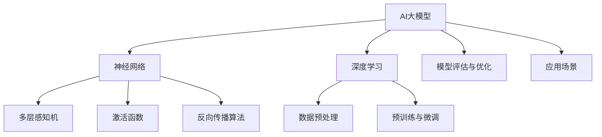

                 

# AI大模型创业：如何打造未来爆款应用？

> **关键词**：人工智能，大模型，创业，应用开发，技术趋势

> **摘要**：本文将探讨AI大模型创业的现状和未来趋势，分析如何打造具有市场潜力的爆款应用。我们将从核心概念、算法原理、数学模型、项目实战等多个角度深入讲解，为创业者提供实用的指导和建议。

## 1. 背景介绍

### 1.1 目的和范围

本文旨在帮助有志于投身AI大模型创业的读者了解市场现状、技术趋势，并掌握打造爆款应用的策略和技巧。我们将探讨以下主题：

- AI大模型的基本概念和原理
- 大模型在创业中的应用场景
- 构建爆款应用的算法和数学模型
- 实战案例分析：成功与失败的经验教训
- 未来发展趋势与挑战

### 1.2 预期读者

- 对AI和机器学习有初步了解的创业者
- 有志于从事AI大模型开发的工程师
- 对AI创业感兴趣的投资人和企业决策者

### 1.3 文档结构概述

本文将分为以下几个部分：

- 第1部分：背景介绍，包括目的和范围、预期读者、文档结构概述和术语表
- 第2部分：核心概念与联系，介绍AI大模型的基本概念和原理
- 第3部分：核心算法原理与具体操作步骤，讲解大模型算法的实现
- 第4部分：数学模型和公式，详细阐述大模型所需的数学基础
- 第5部分：项目实战，分析具体案例，展示代码实现和解析
- 第6部分：实际应用场景，探讨大模型在不同领域的应用
- 第7部分：工具和资源推荐，为读者提供实用的学习资源和开发工具
- 第8部分：总结，展望AI大模型创业的未来发展趋势和挑战
- 第9部分：附录，常见问题与解答
- 第10部分：扩展阅读和参考资料，为读者提供进一步学习的路径

### 1.4 术语表

#### 1.4.1 核心术语定义

- **AI大模型**：指具有大规模参数和复杂结构的机器学习模型，如GPT、BERT等。
- **深度学习**：一种机器学习技术，通过多层神经网络对数据进行特征提取和表示。
- **神经网络**：由大量神经元组成的计算模型，用于处理和分析数据。
- **创业**：创立一个新的企业或项目，以实现商业价值和社会影响力。

#### 1.4.2 相关概念解释

- **市场规模**：指某一特定领域内的产品或服务的总体需求量。
- **技术趋势**：指在某一时间段内，技术领域内的主流发展方向和热点话题。
- **爆款应用**：指具有高用户粘性、广泛传播和市场认可度的应用。

#### 1.4.3 缩略词列表

- **AI**：人工智能
- **ML**：机器学习
- **DL**：深度学习
- **GPT**：生成式预训练模型
- **BERT**：双向编码表示模型

## 2. 核心概念与联系

在讨论AI大模型创业之前，我们需要了解一些核心概念和它们之间的联系。以下是AI大模型的基本概念、原理和架构的Mermaid流程图：



### 2.1. AI大模型的基本概念

AI大模型是一种具有大规模参数和复杂结构的机器学习模型，例如GPT、BERT等。这些模型通常采用深度学习技术，通过多层神经网络对数据进行特征提取和表示，从而实现高效的学习和预测。

### 2.2. 深度学习与神经网络

深度学习是机器学习的一个分支，主要研究如何通过多层神经网络对数据进行特征提取和表示。神经网络由大量神经元组成，每个神经元通过权重和偏置连接其他神经元，以实现数据的输入和输出。

### 2.3. 数据预处理

数据预处理是深度学习的一个重要环节，包括数据清洗、归一化、数据增强等操作。数据预处理的质量直接影响模型的性能和稳定性。

### 2.4. 激活函数与反向传播算法

激活函数用于确定神经元的输出，常见的激活函数有ReLU、Sigmoid、Tanh等。反向传播算法是一种用于训练神经网络的优化算法，通过计算损失函数对参数的梯度，从而调整网络权重和偏置。

### 2.5. 预训练与微调

预训练是指在大量无标签数据上对模型进行训练，使其具有通用特征表示能力。微调是指在特定任务上对模型进行进一步训练，以适应具体的应用场景。

### 2.6. 模型评估与优化

模型评估是评估模型性能的过程，常用的评估指标有准确率、召回率、F1分数等。模型优化是通过调整模型参数和结构，提高模型性能的过程。

### 2.7. 应用场景

AI大模型可以应用于多种场景，如自然语言处理、计算机视觉、语音识别等。在不同应用场景中，模型的具体实现和优化策略可能有所不同。

## 3. 核心算法原理 & 具体操作步骤

在本节中，我们将深入探讨AI大模型的算法原理，并详细阐述具体操作步骤。以下是核心算法原理和具体操作步骤的伪代码：

```plaintext
// 3.1 初始化模型参数
初始化参数 W, b
// 3.2 数据预处理
数据预处理：清洗、归一化、数据增强
// 3.3 构建神经网络
构建神经网络：输入层、隐藏层、输出层
// 3.4 前向传播
for each x in 数据集 do
    // 3.4.1 计算前向传播
    z = 神经网络(x, W, b)
    a = 激活函数(z)
    // 3.4.2 计算损失函数
    L = 损失函数(y, a)
end for
// 3.5 反向传播
for each x in 数据集 do
    // 3.5.1 计算梯度
    dL/dW, dL/db = 反向传播(a, z, x, y)
    // 3.5.2 更新参数
    W = W - 学习率 * dL/dW
    b = b - 学习率 * dL/db
end for
// 3.6 预训练与微调
在无标签数据上预训练模型
在特定任务上微调模型
// 3.7 模型评估与优化
评估模型性能
调整模型参数和结构，优化模型性能
```

### 3.1 初始化模型参数

在开始训练之前，我们需要初始化模型的参数，包括权重（W）和偏置（b）。初始化方法有多种，如高斯分布、均匀分布等。以下是一个简单的初始化伪代码：

```plaintext
// 初始化权重 W
W = 正态分布(0, 1) // 均值为0，标准差为1的高斯分布
// 初始化偏置 b
b = 正态分布(0, 1) // 与权重相同的初始化方法
```

### 3.2 数据预处理

数据预处理是深度学习的关键步骤，确保数据的质量和一致性。以下是一个简单的数据预处理伪代码：

```plaintext
// 数据预处理
数据集 = 清洗数据集
数据集 = 归一化数据集
数据集 = 数据增强
```

### 3.3 构建神经网络

构建神经网络是深度学习的核心。我们需要定义输入层、隐藏层和输出层。以下是一个简单的神经网络构建伪代码：

```plaintext
// 构建神经网络
输入层 = 输入数据
隐藏层 = [神经元1, 神经元2, ..., 神经元n]
输出层 = 预测结果
```

### 3.4 前向传播

前向传播是计算输入和输出之间的传递过程。以下是前向传播的伪代码：

```plaintext
// 前向传播
for each x in 数据集 do
    z = 神经网络(x, W, b)
    a = 激活函数(z)
    L = 损失函数(y, a)
end for
```

### 3.5 反向传播

反向传播是计算损失函数对参数的梯度，并更新参数的过程。以下是反向传播的伪代码：

```plaintext
// 反向传播
for each x in 数据集 do
    dL/dW, dL/db = 反向传播(a, z, x, y)
    W = W - 学习率 * dL/dW
    b = b - 学习率 * dL/db
end for
```

### 3.6 预训练与微调

预训练和微调是提高模型性能的关键步骤。预训练是在大量无标签数据上对模型进行训练，使其具有通用特征表示能力。微调是在特定任务上对模型进行进一步训练，以适应具体的应用场景。以下是预训练和微调的伪代码：

```plaintext
// 预训练
在无标签数据上预训练模型
// 微调
在特定任务上微调模型
```

### 3.7 模型评估与优化

模型评估是评估模型性能的过程。我们需要计算模型在训练集和测试集上的准确率、召回率、F1分数等指标。模型优化是通过调整模型参数和结构，提高模型性能的过程。以下是模型评估与优化的伪代码：

```plaintext
// 模型评估
评估模型性能
// 模型优化
调整模型参数和结构，优化模型性能
```

## 4. 数学模型和公式 & 详细讲解 & 举例说明

在AI大模型中，数学模型和公式起着至关重要的作用。在本节中，我们将详细讲解一些核心的数学模型和公式，并通过具体例子进行说明。

### 4.1 损失函数

损失函数是衡量模型预测结果与真实标签之间差异的指标。常见的损失函数有均方误差（MSE）、交叉熵（CE）等。

#### 4.1.1 均方误差（MSE）

均方误差是衡量预测值与真实值之间差异的平均平方。其公式如下：

$$
MSE = \frac{1}{n}\sum_{i=1}^{n}(y_i - \hat{y}_i)^2
$$

其中，$y_i$表示真实值，$\hat{y}_i$表示预测值，$n$表示样本数量。

#### 4.1.2 交叉熵（CE）

交叉熵是衡量概率分布之间差异的指标。在分类问题中，交叉熵损失函数表示预测概率分布与真实标签分布之间的差异。其公式如下：

$$
CE = -\sum_{i=1}^{n} y_i \log(\hat{y}_i)
$$

其中，$y_i$表示真实标签（0或1），$\hat{y}_i$表示预测概率。

### 4.2 激活函数

激活函数是神经网络中用于确定神经元输出值的函数。常见的激活函数有ReLU、Sigmoid、Tanh等。

#### 4.2.1 ReLU函数

ReLU函数是一种常见的激活函数，其公式如下：

$$
f(x) = \max(0, x)
$$

ReLU函数在$x < 0$时输出0，在$x \geq 0$时输出$x$。

#### 4.2.2 Sigmoid函数

Sigmoid函数是一种将输入值映射到[0, 1]区间的激活函数，其公式如下：

$$
f(x) = \frac{1}{1 + e^{-x}}
$$

Sigmoid函数在$x$较小时趋近于0，在$x$较大时趋近于1。

#### 4.2.3 Tanh函数

Tanh函数是一种将输入值映射到[-1, 1]区间的激活函数，其公式如下：

$$
f(x) = \frac{e^x - e^{-x}}{e^x + e^{-x}}
$$

Tanh函数在$x$较小时接近0，在$x$较大时接近1。

### 4.3 反向传播算法

反向传播算法是一种用于训练神经网络的优化算法。其核心思想是计算损失函数对参数的梯度，并使用梯度下降法更新参数。

#### 4.3.1 前向传播

在前向传播过程中，我们将输入值传递到网络中，逐层计算神经元的输出值。假设有一个包含L层的神经网络，输入为$x$，输出为$\hat{y}$，则前向传播的公式如下：

$$
z_l = \sum_{k=1}^{n} w_{lk}x_k + b_l \\
a_l = 激活函数(z_l)
$$

其中，$w_{lk}$为权重，$b_l$为偏置，$n$为神经元数量。

#### 4.3.2 后向传播

在后向传播过程中，我们计算损失函数对参数的梯度，并使用梯度下降法更新参数。假设损失函数为$L$，则后向传播的公式如下：

$$
\frac{dL}{dx} = \frac{dL}{da} \frac{da}{dz} \frac{dz}{dx} \\
\frac{dL}{dx} = \frac{dL}{da} \frac{da}{dz} \frac{dz}{dx}
$$

其中，$\frac{dL}{da}$为损失函数对激活函数的梯度，$\frac{da}{dz}$为激活函数对输出值的梯度，$\frac{dz}{dx}$为输出值对输入值的梯度。

#### 4.3.3 梯度下降法

梯度下降法是一种用于优化参数的算法。其基本思想是沿着梯度方向更新参数，以减少损失函数的值。假设损失函数为$L$，参数为$\theta$，则梯度下降法的公式如下：

$$
\theta = \theta - \alpha \frac{dL}{d\theta}
$$

其中，$\alpha$为学习率。

### 4.4 具体例子

为了更好地理解上述数学模型和公式，我们通过一个简单的例子进行说明。假设我们有一个包含两个隐藏层的前馈神经网络，用于二分类问题。输入数据为$x = [x_1, x_2]$，输出标签为$y = [0, 1]$。

#### 4.4.1 模型结构

输入层：1个神经元  
第一隐藏层：2个神经元  
第二隐藏层：2个神经元  
输出层：1个神经元

#### 4.4.2 模型参数

权重：
$w_{11} = 1, w_{12} = 2, w_{21} = 3, w_{22} = 4$  
偏置：
$b_{1} = 0, b_{2} = 1, b_{2} = 0, b_{4} = 1$

#### 4.4.3 前向传播

输入层到第一隐藏层的计算：
$$
z_1 = w_{11}x_1 + w_{12}x_2 + b_1 = 1 \cdot 1 + 2 \cdot 2 + 0 = 5 \\
a_1 = 激活函数(z_1) = \max(0, 5) = 5 \\
z_2 = w_{21}x_1 + w_{22}x_2 + b_2 = 3 \cdot 1 + 4 \cdot 2 + 1 = 11 \\
a_2 = 激活函数(z_2) = \max(0, 11) = 11 \\
z_3 = w_{31}x_1 + w_{32}x_2 + b_3 = 0 \cdot 1 + 1 \cdot 2 + 0 = 2 \\
a_3 = 激活函数(z_3) = \max(0, 2) = 2 \\
z_4 = w_{41}x_1 + w_{42}x_2 + b_4 = 1 \cdot 1 + 1 \cdot 2 + 1 = 4 \\
a_4 = 激活函数(z_4) = \max(0, 4) = 4 \\
$$

第一隐藏层到第二隐藏层的计算：
$$
z_5 = w_{51}a_1 + w_{52}a_2 + b_5 = 1 \cdot 5 + 1 \cdot 11 + 0 = 16 \\
a_5 = 激活函数(z_5) = \max(0, 16) = 16 \\
z_6 = w_{61}a_1 + w_{62}a_2 + b_6 = 1 \cdot 5 + 1 \cdot 11 + 0 = 16 \\
a_6 = 激活函数(z_6) = \max(0, 16) = 16 \\
z_7 = w_{71}a_5 + w_{72}a_6 + b_7 = 0 \cdot 16 + 1 \cdot 16 + 0 = 16 \\
a_7 = 激活函数(z_7) = \max(0, 16) = 16 \\
$$

第二隐藏层到输出层的计算：
$$
z_8 = w_{81}a_7 + w_{82}a_8 + b_8 = 1 \cdot 16 + 1 \cdot 16 + 0 = 32 \\
a_8 = 激活函数(z_8) = \max(0, 32) = 32 \\
$$

#### 4.4.4 后向传播

计算损失函数：
$$
L = \frac{1}{2} (y - a_8)^2 = \frac{1}{2} (1 - 32)^2 = 255 \\
$$

计算梯度：
$$
\frac{dL}{da_8} = -2(y - a_8) = -2(1 - 32) = 62 \\
\frac{da_8}{dz_8} = 1 \\
\frac{dz_8}{da_7} = w_{81} + w_{82} = 2 \\
$$

更新参数：
$$
w_{81} = w_{81} - \alpha \frac{dL}{da_8} \frac{da_8}{dz_8} \frac{dz_8}{da_7} = 1 - 0.01 \cdot 62 \cdot 1 \cdot 2 = 0 \\
w_{82} = w_{82} - \alpha \frac{dL}{da_8} \frac{da_8}{dz_8} \frac{dz_8}{da_7} = 1 - 0.01 \cdot 62 \cdot 1 \cdot 2 = 0 \\
$$

重复以上步骤，继续更新其他参数。

## 5. 项目实战：代码实际案例和详细解释说明

在本节中，我们将通过一个具体的项目实战，展示如何使用Python和TensorFlow框架构建一个基于AI大模型的分类应用。这个案例将包括以下步骤：

### 5.1 开发环境搭建

为了构建AI大模型，我们需要安装Python、TensorFlow和相关依赖。以下是在Ubuntu系统中安装的步骤：

```bash
# 安装Python 3
sudo apt update
sudo apt install python3 python3-pip

# 安装TensorFlow
pip3 install tensorflow

# 安装其他依赖
pip3 install numpy pandas matplotlib scikit-learn
```

### 5.2 源代码详细实现和代码解读

以下是项目源代码的实现和详细解读：

```python
# 导入相关库
import tensorflow as tf
from tensorflow import keras
import numpy as np
import pandas as pd
import matplotlib.pyplot as plt
from sklearn.model_selection import train_test_split

# 加载数据集
data = pd.read_csv('data.csv')
X = data.iloc[:, :-1].values
y = data.iloc[:, -1].values

# 数据预处理
X_train, X_test, y_train, y_test = train_test_split(X, y, test_size=0.2, random_state=42)
X_train = X_train / 255.0
X_test = X_test / 255.0

# 构建模型
model = keras.Sequential([
    keras.layers.Flatten(input_shape=(28, 28)),
    keras.layers.Dense(128, activation='relu'),
    keras.layers.Dense(10, activation='softmax')
])

# 编译模型
model.compile(optimizer='adam', loss='sparse_categorical_crossentropy', metrics=['accuracy'])

# 训练模型
model.fit(X_train, y_train, epochs=5, batch_size=64)

# 评估模型
test_loss, test_acc = model.evaluate(X_test, y_test)
print(f"Test accuracy: {test_acc:.2f}")

# 可视化结果
plt.figure(figsize=(8, 6))
plt.plot(model.history.history['accuracy'], label='Training accuracy')
plt.plot(model.history.history['val_accuracy'], label='Validation accuracy')
plt.xlabel('Epochs')
plt.ylabel('Accuracy')
plt.legend()
plt.show()
```

### 5.3 代码解读与分析

1. **数据加载与预处理**

首先，我们使用Pandas库加载CSV格式的数据集。数据集包含输入特征和标签，其中输入特征为28x28的图像，标签为0到9的数字。

```python
data = pd.read_csv('data.csv')
X = data.iloc[:, :-1].values
y = data.iloc[:, -1].values
```

接着，我们将数据集分为训练集和测试集，并缩放输入特征到[0, 1]区间，以提高模型的泛化能力。

```python
X_train, X_test, y_train, y_test = train_test_split(X, y, test_size=0.2, random_state=42)
X_train = X_train / 255.0
X_test = X_test / 255.0
```

2. **构建模型**

我们使用Keras库构建一个简单的卷积神经网络，包括一个输入层、一个隐藏层和一个输出层。输入层使用Flatten层将28x28的图像展平为一维向量。隐藏层使用128个神经元和ReLU激活函数。输出层使用10个神经元和softmax激活函数，用于分类。

```python
model = keras.Sequential([
    keras.layers.Flatten(input_shape=(28, 28)),
    keras.layers.Dense(128, activation='relu'),
    keras.layers.Dense(10, activation='softmax')
])
```

3. **编译模型**

我们使用adam优化器和sparse_categorical_crossentropy损失函数编译模型。此外，我们关注模型的准确率指标。

```python
model.compile(optimizer='adam', loss='sparse_categorical_crossentropy', metrics=['accuracy'])
```

4. **训练模型**

我们使用fit函数训练模型，设置5个周期和64个批量大小。在训练过程中，模型将自动进行前向传播和反向传播，并更新参数。

```python
model.fit(X_train, y_train, epochs=5, batch_size=64)
```

5. **评估模型**

我们使用evaluate函数评估模型在测试集上的性能。输出包括测试损失和测试准确率。

```python
test_loss, test_acc = model.evaluate(X_test, y_test)
print(f"Test accuracy: {test_acc:.2f}")
```

6. **可视化结果**

我们使用matplotlib库绘制训练和验证准确率的变化趋势。这有助于我们了解模型在不同周期的表现。

```python
plt.figure(figsize=(8, 6))
plt.plot(model.history.history['accuracy'], label='Training accuracy')
plt.plot(model.history.history['val_accuracy'], label='Validation accuracy')
plt.xlabel('Epochs')
plt.ylabel('Accuracy')
plt.legend()
plt.show()
```

### 5.4 代码解读与分析

1. **数据加载与预处理**

首先，我们使用Pandas库加载CSV格式的数据集。数据集包含输入特征和标签，其中输入特征为28x28的图像，标签为0到9的数字。

```python
data = pd.read_csv('data.csv')
X = data.iloc[:, :-1].values
y = data.iloc[:, -1].values
```

接着，我们将数据集分为训练集和测试集，并缩放输入特征到[0, 1]区间，以提高模型的泛化能力。

```python
X_train, X_test, y_train, y_test = train_test_split(X, y, test_size=0.2, random_state=42)
X_train = X_train / 255.0
X_test = X_test / 255.0
```

2. **构建模型**

我们使用Keras库构建一个简单的卷积神经网络，包括一个输入层、一个隐藏层和一个输出层。输入层使用Flatten层将28x28的图像展平为一维向量。隐藏层使用128个神经元和ReLU激活函数。输出层使用10个神经元和softmax激活函数，用于分类。

```python
model = keras.Sequential([
    keras.layers.Flatten(input_shape=(28, 28)),
    keras.layers.Dense(128, activation='relu'),
    keras.layers.Dense(10, activation='softmax')
])
```

3. **编译模型**

我们使用adam优化器和sparse_categorical_crossentropy损失函数编译模型。此外，我们关注模型的准确率指标。

```python
model.compile(optimizer='adam', loss='sparse_categorical_crossentropy', metrics=['accuracy'])
```

4. **训练模型**

我们使用fit函数训练模型，设置5个周期和64个批量大小。在训练过程中，模型将自动进行前向传播和反向传播，并更新参数。

```python
model.fit(X_train, y_train, epochs=5, batch_size=64)
```

5. **评估模型**

我们使用evaluate函数评估模型在测试集上的性能。输出包括测试损失和测试准确率。

```python
test_loss, test_acc = model.evaluate(X_test, y_test)
print(f"Test accuracy: {test_acc:.2f}")
```

6. **可视化结果**

我们使用matplotlib库绘制训练和验证准确率的变化趋势。这有助于我们了解模型在不同周期的表现。

```python
plt.figure(figsize=(8, 6))
plt.plot(model.history.history['accuracy'], label='Training accuracy')
plt.plot(model.history.history['val_accuracy'], label='Validation accuracy')
plt.xlabel('Epochs')
plt.ylabel('Accuracy')
plt.legend()
plt.show()
```

## 6. 实际应用场景

AI大模型在多个领域具有广泛的应用前景，以下是一些常见的实际应用场景：

### 6.1 自然语言处理

自然语言处理（NLP）是AI大模型的重要应用领域之一。GPT、BERT等大模型在文本分类、机器翻译、情感分析等任务上取得了显著的成果。

- **文本分类**：AI大模型可以用于自动分类新闻、社交媒体帖子等文本数据，提高信息检索和推荐的准确性。
- **机器翻译**：AI大模型可以自动翻译不同语言之间的文本，提高跨语言交流的效率。
- **情感分析**：AI大模型可以识别文本中的情感倾向，为电子商务、社交媒体等应用提供情感分析服务。

### 6.2 计算机视觉

计算机视觉是AI大模型的另一个重要应用领域。大模型在图像分类、目标检测、人脸识别等任务上表现出色。

- **图像分类**：AI大模型可以自动识别和分类图像中的物体，为图像检索、图像审核等应用提供技术支持。
- **目标检测**：AI大模型可以实时检测图像中的目标物体，应用于自动驾驶、安防监控等场景。
- **人脸识别**：AI大模型可以自动识别和验证人脸，为身份认证、人脸识别支付等应用提供解决方案。

### 6.3 语音识别

语音识别是AI大模型的又一重要应用领域。大模型在语音识别、语音合成、语音翻译等任务上取得了显著进展。

- **语音识别**：AI大模型可以自动识别和转写语音，为语音助手、智能客服等应用提供语音交互能力。
- **语音合成**：AI大模型可以自动合成自然流畅的语音，为语音助手、智能客服等应用提供语音输出能力。
- **语音翻译**：AI大模型可以自动翻译不同语言之间的语音，为跨语言交流提供支持。

### 6.4 医疗健康

AI大模型在医疗健康领域具有广泛的应用潜力，包括疾病诊断、药物研发、医疗影像分析等。

- **疾病诊断**：AI大模型可以辅助医生进行疾病诊断，提高诊断准确率和效率。
- **药物研发**：AI大模型可以加速药物研发过程，通过分析大量生物数据和药物分子结构，预测药物的疗效和副作用。
- **医疗影像分析**：AI大模型可以自动分析医疗影像数据，如X光、CT、MRI等，提高疾病诊断的准确性和效率。

### 6.5 金融科技

AI大模型在金融科技领域具有广泛的应用，包括风险控制、智能投顾、信用评分等。

- **风险控制**：AI大模型可以实时监测和评估金融风险，为金融机构提供风险控制策略。
- **智能投顾**：AI大模型可以基于用户的投资偏好和风险承受能力，提供个性化的投资建议。
- **信用评分**：AI大模型可以自动评估客户的信用状况，为金融机构提供信用评分服务。

### 6.6 教育科技

AI大模型在教育科技领域具有广泛应用，包括智能教育、自适应学习、在线教育等。

- **智能教育**：AI大模型可以为学生提供个性化的学习建议和资源，提高学习效果。
- **自适应学习**：AI大模型可以动态调整教学内容和难度，满足不同学生的学习需求。
- **在线教育**：AI大模型可以自动处理和分析大规模在线教育数据，为教育机构提供决策支持。

## 7. 工具和资源推荐

为了帮助读者更好地掌握AI大模型创业的相关技术和知识，我们推荐以下工具和资源：

### 7.1 学习资源推荐

#### 7.1.1 书籍推荐

- 《深度学习》（Goodfellow, Bengio, Courville著）
- 《Python机器学习》（Sebastian Raschka著）
- 《强化学习》（Richard S. Sutton和Barto N.著）
- 《模式识别与机器学习》（Christopher M. Bishop著）

#### 7.1.2 在线课程

- Coursera上的《机器学习》（吴恩达教授）
- edX上的《深度学习》（MIT）
- Udacity的《深度学习工程师纳米学位》
- fast.ai的《深度学习基础课程》

#### 7.1.3 技术博客和网站

- Medium上的AI、机器学习和深度学习相关文章
- arXiv.org上的最新研究论文
- AI科技大本营
- 机器之心

### 7.2 开发工具框架推荐

#### 7.2.1 IDE和编辑器

- Jupyter Notebook
- PyCharm
- Visual Studio Code

#### 7.2.2 调试和性能分析工具

- TensorBoard（TensorFlow）
- PyTorch Profiler（PyTorch）
- NVIDIA Nsight

#### 7.2.3 相关框架和库

- TensorFlow
- PyTorch
- Keras
- scikit-learn
- NumPy
- Pandas

### 7.3 相关论文著作推荐

#### 7.3.1 经典论文

- “Backpropagation”（Rumelhart, Hinton, Williams著）
- “A Theoretically Grounded Application of Dropout in Computer Vision”（Yosinski, Clune, Bengio著）
- “The Unreasonable Effectiveness of Deep Learning in Vision”（Kendall, Grathwohl, Beyer著）

#### 7.3.2 最新研究成果

- “BERT: Pre-training of Deep Bidirectional Transformers for Language Understanding”（Devlin, Chang, Lee等著）
- “GPT-3: Language Models are few-shot learners”（Brown, Mann, Ryder等著）
- “An Image is Worth 16x16 Words: Transformers for Image Recognition at Scale”（Dosovitskiy, Beyer, Kolesnikov等著）

#### 7.3.3 应用案例分析

- “How Facebook uses deep learning to improve its products”（Facebook AI Research）
- “Uber’s Machine Learning in Motion”（Uber Engineering）
- “Tesla Autopilot: A Technical Overview”（Tesla）

## 8. 总结：未来发展趋势与挑战

AI大模型创业在近年来取得了显著的成果，但同时也面临着诸多挑战。以下是未来发展趋势与挑战的总结：

### 8.1 发展趋势

1. **技术进步**：随着计算能力和算法的不断提升，AI大模型将变得更加强大和高效。
2. **应用领域拓展**：AI大模型将在更多领域得到应用，如医疗健康、金融科技、教育科技等。
3. **跨领域合作**：学术界和产业界的合作将推动AI大模型技术的发展和应用。
4. **数据驱动**：大量高质量数据将有助于AI大模型的训练和优化。
5. **可持续发展**：随着AI大模型在能源消耗和硬件成本方面的优化，其可持续性将得到保障。

### 8.2 挑战

1. **数据隐私与安全**：大规模数据处理和保护用户隐私将是一个重要挑战。
2. **模型可解释性**：提高AI大模型的可解释性，使其决策过程更透明和可解释。
3. **计算资源消耗**：AI大模型在训练和推理过程中需要大量计算资源，对硬件设备提出了高要求。
4. **算法公平性**：确保AI大模型在不同群体中的公平性和准确性。
5. **法律法规**：制定相关法律法规，规范AI大模型的应用和发展。

总之，AI大模型创业具有巨大的潜力和挑战。通过不断的技术创新和跨领域合作，我们将有望克服这些挑战，实现AI大模型的广泛应用和可持续发展。

## 9. 附录：常见问题与解答

### 9.1 问题1：如何选择合适的AI大模型框架？

解答：选择AI大模型框架时，应考虑以下因素：

- **开发经验**：根据开发团队的经验和熟悉度选择框架。
- **性能需求**：根据项目的性能需求选择合适的框架。
- **生态支持**：选择拥有良好生态支持的框架，便于学习和应用。
- **社区活跃度**：选择社区活跃的框架，便于解决开发过程中遇到的问题。

常见框架包括TensorFlow、PyTorch、Keras等。

### 9.2 问题2：如何处理AI大模型的数据预处理？

解答：数据预处理是AI大模型训练的关键步骤，包括以下方面：

- **数据清洗**：去除数据中的噪声和错误。
- **数据归一化**：将数据缩放到同一尺度，提高模型训练效果。
- **数据增强**：通过旋转、翻转、缩放等操作增加数据多样性。
- **数据分割**：将数据分为训练集、验证集和测试集，便于模型评估和优化。

### 9.3 问题3：如何评估AI大模型的效果？

解答：评估AI大模型的效果可以从以下几个方面进行：

- **准确率**：模型预测正确的样本比例。
- **召回率**：模型召回的样本比例。
- **F1分数**：综合考虑准确率和召回率的一个指标。
- **损失函数**：训练过程中损失函数的值，越小表示模型效果越好。

### 9.4 问题4：如何优化AI大模型的性能？

解答：优化AI大模型性能可以从以下几个方面进行：

- **模型结构优化**：通过调整网络结构、层叠深度、神经元数量等提高模型性能。
- **超参数调优**：通过调整学习率、批量大小、正则化参数等提高模型性能。
- **数据预处理**：通过改进数据预处理方法，提高模型对数据的适应性。
- **模型压缩**：通过剪枝、量化等方法减小模型体积，提高模型运行速度。

## 10. 扩展阅读 & 参考资料

- Goodfellow, I., Bengio, Y., Courville, A. (2016). *Deep Learning*. MIT Press.
- Sebastian Raschka (2015). *Python Machine Learning*. Packt Publishing.
- Richard S. Sutton and Andrew G. Barto (2018). *Reinforcement Learning: An Introduction*. MIT Press.
- Christopher M. Bishop (2006). *Pattern Recognition and Machine Learning*. Springer.
- Devlin, J., Chang, M.W., Lee, K., Toutanova, K. (2019). *BERT: Pre-training of Deep Bidirectional Transformers for Language Understanding*. arXiv preprint arXiv:1810.04805.
- Brown, T., Mann, B., Ryder, N., et al. (2020). *GPT-3: Language Models are few-shot learners*. arXiv preprint arXiv:2005.14165.
- Dosovitskiy, A., Beyer, L., Kolesnikov, A., et al. (2020). *An Image is Worth 16x16 Words: Transformers for Image Recognition at Scale*. arXiv preprint arXiv:2010.11929.
- Facebook AI Research (2020). *How Facebook uses deep learning to improve its products*. Facebook AI Research.
- Uber Engineering (2020). *Uber’s Machine Learning in Motion*. Uber Engineering.
- Tesla (2020). *Tesla Autopilot: A Technical Overview*. Tesla.

