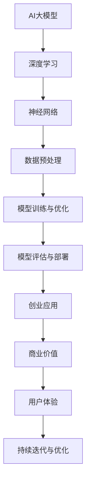

                 

# AI大模型创业：如何打造未来爆款应用？

> **关键词：** AI大模型，创业，应用场景，核心算法，数学模型，实战案例，发展趋势

> **摘要：** 本文将深入探讨如何利用AI大模型进行创业，实现未来爆款应用。我们将从背景介绍、核心概念、算法原理、数学模型、项目实战、应用场景、工具资源推荐等方面，逐一解析打造成功AI大模型应用的方法和策略。

## 1. 背景介绍

### 1.1 目的和范围

随着人工智能技术的飞速发展，AI大模型的应用场景越来越广泛，从自然语言处理到计算机视觉，从推荐系统到强化学习，AI大模型正逐步渗透到各个领域。然而，如何将AI大模型转化为商业价值，打造出未来爆款应用，成为许多创业者面临的挑战。

本文旨在提供一套系统化的方法，帮助创业者理解AI大模型的本质，掌握核心算法和数学模型，并通过实战案例展示如何将AI大模型应用于实际项目中，最终实现商业成功。

### 1.2 预期读者

本文面向希望利用AI大模型进行创业的科技创业者、AI工程师、产品经理等，同时，对于对AI大模型感兴趣的研究人员和学者也具有一定的参考价值。

### 1.3 文档结构概述

本文将分为以下十个部分：

1. 背景介绍
2. 核心概念与联系
3. 核心算法原理 & 具体操作步骤
4. 数学模型和公式 & 详细讲解 & 举例说明
5. 项目实战：代码实际案例和详细解释说明
6. 实际应用场景
7. 工具和资源推荐
8. 总结：未来发展趋势与挑战
9. 附录：常见问题与解答
10. 扩展阅读 & 参考资料

### 1.4 术语表

#### 1.4.1 核心术语定义

- **AI大模型：** 拥有数亿甚至万亿参数的深度学习模型，能够处理大规模数据，具备强大的表征能力和泛化能力。
- **创业：** 创业者创建新企业或新业务的过程，旨在通过创新和商业机会实现盈利和增长。
- **应用场景：** 模型在实际业务中的具体应用场景，如自然语言处理、计算机视觉、推荐系统等。

#### 1.4.2 相关概念解释

- **深度学习：** 基于多层神经网络，通过学习大量数据来提取特征和模式的人工智能技术。
- **参数：** 模型中的可调数值，用于决定模型的行为和性能。
- **泛化能力：** 模型在未见过的数据上表现良好的能力。

#### 1.4.3 缩略词列表

- **AI：** 人工智能
- **DL：** 深度学习
- **NLP：** 自然语言处理
- **CV：** 计算机视觉
- **RL：** 强化学习

## 2. 核心概念与联系

为了更好地理解AI大模型及其在创业中的应用，我们需要了解一些核心概念和它们之间的联系。以下是一个用Mermaid绘制的流程图，展示这些概念之间的关系。



### 2.1 AI大模型

AI大模型是指具有数十亿甚至万亿参数的深度学习模型。这些模型通过在大量数据上进行训练，能够自动学习数据的复杂结构和模式，从而实现高效的数据表征和预测。

### 2.2 深度学习

深度学习是AI大模型的核心技术，它基于多层神经网络，通过反向传播算法不断调整模型的参数，使模型能够对复杂问题进行建模。

### 2.3 神经网络

神经网络是深度学习的基础，它由多个神经元（节点）组成，每个神经元都与相邻的神经元相连，并通过权重和偏置进行加权求和，最后通过激活函数进行非线性变换。

### 2.4 数据预处理

数据预处理是模型训练的重要环节，它包括数据清洗、归一化、数据增强等步骤，目的是提高数据质量，为模型训练提供良好的输入。

### 2.5 模型训练与优化

模型训练与优化是指通过调整模型的参数，使其在训练数据上达到较好的性能。优化方法包括梯度下降、随机梯度下降、Adam优化器等。

### 2.6 模型评估与部署

模型评估与部署是指对训练好的模型进行性能评估，并部署到生产环境中进行应用。评估方法包括准确率、召回率、F1值等。

### 2.7 创业应用

创业应用是指将AI大模型应用于具体的商业场景，如自然语言处理、计算机视觉、推荐系统等，以实现商业价值。

### 2.8 商业价值

商业价值是指AI大模型在创业中的应用能够带来的直接和间接收益，包括提高效率、降低成本、增加收入等。

### 2.9 用户体验

用户体验是指用户在使用AI大模型应用时的感受和体验，良好的用户体验能够提高用户的满意度和忠诚度。

### 2.10 持续迭代与优化

持续迭代与优化是指通过对AI大模型应用进行不断的改进和优化，以提高其性能和用户体验，从而保持其在市场上的竞争力。

## 3. 核心算法原理 & 具体操作步骤

在了解了AI大模型的核心概念和联系之后，我们需要深入探讨其核心算法原理和具体操作步骤。以下内容将详细介绍这些算法，并使用伪代码进行阐述。

### 3.1 深度学习算法

深度学习算法主要包括前向传播和反向传播两个过程。以下是一个简化的伪代码，用于描述这些过程。

```python
# 前向传播
def forward_propagation(x, model):
    z = x * model['weights'] + model['bias']
    a = activation_function(z)
    return a

# 反向传播
def backward_propagation(a, y, model, learning_rate):
    error = y - a
    dZ = error * activation_derivative(a)
    dW = dZ * x
    db = dZ
    model['weights'] -= learning_rate * dW
    model['bias'] -= learning_rate * db
```

### 3.2 数据预处理

数据预处理是模型训练的重要环节，主要包括数据清洗、归一化和数据增强等步骤。以下是一个简化的伪代码，用于描述这些过程。

```python
# 数据清洗
def clean_data(data):
    # 删除缺失值
    data = remove_missing_values(data)
    # 填充缺失值
    data = fill_missing_values(data)
    return data

# 数据归一化
def normalize_data(data):
    # 计算均值和标准差
    mean = np.mean(data)
    std = np.std(data)
    # 进行归一化
    data = (data - mean) / std
    return data

# 数据增强
def augment_data(data):
    # 随机旋转
    data = random_rotation(data)
    # 随机缩放
    data = random Scaling(data)
    return data
```

### 3.3 模型训练与优化

模型训练与优化是指通过调整模型的参数，使其在训练数据上达到较好的性能。以下是一个简化的伪代码，用于描述这些过程。

```python
# 梯度下降
def gradient_descent(x, y, model, learning_rate, epochs):
    for epoch in range(epochs):
        a = forward_propagation(x, model)
        error = y - a
        dZ = error * activation_derivative(a)
        dW = dZ * x
        db = dZ
        model['weights'] -= learning_rate * dW
        model['bias'] -= learning_rate * db

# 随机梯度下降
def stochastic_gradient_descent(x, y, model, learning_rate, epochs):
    for epoch in range(epochs):
        for x_i, y_i in dataset:
            a = forward_propagation(x_i, model)
            error = y_i - a
            dZ = error * activation_derivative(a)
            dW = dZ * x_i
            db = dZ
            model['weights'] -= learning_rate * dW
            model['bias'] -= learning_rate * db

# Adam优化器
def adam_optimizer(x, y, model, learning_rate, epochs):
    for epoch in range(epochs):
        m = 0
        v = 0
        for x_i, y_i in dataset:
            a = forward_propagation(x_i, model)
            error = y_i - a
            dZ = error * activation_derivative(a)
            dW = dZ * x_i
            db = dZ

            m = 0.9 * m + 0.1 * dW
            v = 0.999 * v + 0.001 * (dW ** 2)

            m_hat = m / (1 - 0.9 ** epoch)
            v_hat = v / (1 - 0.999 ** epoch)

            model['weights'] -= learning_rate * m_hat / (np.sqrt(v_hat) + 1e-8)
            model['bias'] -= learning_rate * m_hat / (np.sqrt(v_hat) + 1e-8)
```

### 3.4 模型评估与部署

模型评估与部署是指对训练好的模型进行性能评估，并部署到生产环境中进行应用。以下是一个简化的伪代码，用于描述这些过程。

```python
# 模型评估
def evaluate_model(model, x_test, y_test):
    a = forward_propagation(x_test, model)
    accuracy = calculate_accuracy(a, y_test)
    return accuracy

# 模型部署
def deploy_model(model, environment):
    # 导出模型
    export_model(model)
    # 部署到生产环境
    deploy_to_environment(model, environment)
```

## 4. 数学模型和公式 & 详细讲解 & 举例说明

在了解了AI大模型的核心算法原理和具体操作步骤之后，我们需要深入探讨其背后的数学模型和公式。以下内容将详细讲解这些模型和公式，并通过举例说明来帮助读者更好地理解。

### 4.1 深度学习中的激活函数

在深度学习中，激活函数是神经网络中每个神经元的关键组件，用于引入非线性特性。以下是一些常见的激活函数及其公式：

#### 4.1.1 Sigmoid函数

$$
f(x) = \frac{1}{1 + e^{-x}}
$$

举例：假设我们有一个输入值$x = 3$，则其Sigmoid函数的输出为：

$$
f(3) = \frac{1}{1 + e^{-3}} \approx 0.9502
$$

#### 4.1.2 ReLU函数

$$
f(x) = \max(0, x)
$$

举例：假设我们有一个输入值$x = -2$，则其ReLU函数的输出为：

$$
f(-2) = \max(0, -2) = 0
$$

#### 4.1.3ReLU函数

$$
f(x) = \max(0, x)
$$

举例：假设我们有一个输入值$x = -2$，则其ReLU函数的输出为：

$$
f(-2) = \max(0, -2) = 0
$$

#### 4.1.3 Tanh函数

$$
f(x) = \frac{e^x - e^{-x}}{e^x + e^{-x}}
$$

举例：假设我们有一个输入值$x = 2$，则其Tanh函数的输出为：

$$
f(2) = \frac{e^2 - e^{-2}}{e^2 + e^{-2}} \approx 0.9640
$$

### 4.2 梯度下降算法中的损失函数

在梯度下降算法中，损失函数用于衡量模型预测值与实际值之间的差距。以下是一些常见的损失函数及其公式：

#### 4.2.1 均方误差（MSE）

$$
MSE = \frac{1}{n} \sum_{i=1}^{n} (y_i - \hat{y}_i)^2
$$

举例：假设我们有$n = 3$个数据点，其中$y_1 = 1, y_2 = 2, y_3 = 3$，模型预测值$\hat{y}_1 = 0.8, \hat{y}_2 = 1.5, \hat{y}_3 = 2.2$，则均方误差为：

$$
MSE = \frac{1}{3} [(1 - 0.8)^2 + (2 - 1.5)^2 + (3 - 2.2)^2] \approx 0.1667
$$

#### 4.2.2 交叉熵（Cross-Entropy）

$$
CE = -\frac{1}{n} \sum_{i=1}^{n} y_i \log(\hat{y}_i)
$$

举例：假设我们有$n = 3$个数据点，其中$y_1 = [0.1, 0.8, 0.1], y_2 = [0.3, 0.5, 0.2], y_3 = [0.2, 0.3, 0.5]$，模型预测值$\hat{y}_1 = [0.2, 0.7, 0.1], \hat{y}_2 = [0.4, 0.6, 0.0], \hat{y}_3 = [0.1, 0.4, 0.5]$，则交叉熵为：

$$
CE = -\frac{1}{3} [(0.1 \log(0.2) + 0.8 \log(0.7) + 0.1 \log(0.1)) + (0.3 \log(0.4) + 0.5 \log(0.6) + 0.2 \log(0.0)) + (0.2 \log(0.1) + 0.3 \log(0.4) + 0.5 \log(0.5))] \approx 0.4217
$$

### 4.3 反向传播算法中的导数计算

在反向传播算法中，计算每个参数的导数是关键步骤。以下是一些常见的导数计算方法及其公式：

#### 4.3.1 求导法则

- **链式法则**

$$
\frac{d}{dx} [f(g(x))] = f'(g(x)) \cdot g'(x)
$$

举例：假设$f(x) = e^x$，$g(x) = x^2$，则

$$
\frac{d}{dx} [e^{x^2}] = e^{x^2} \cdot \frac{d}{dx} [x^2] = 2x \cdot e^{x^2}
$$

- **积的导数**

$$
\frac{d}{dx} [f(x) \cdot g(x)] = f'(x) \cdot g(x) + f(x) \cdot g'(x)
$$

举例：假设$f(x) = x$，$g(x) = e^x$，则

$$
\frac{d}{dx} [x \cdot e^x] = 1 \cdot e^x + x \cdot e^x = (1 + x)e^x
$$

- **商的导数**

$$
\frac{d}{dx} \left[\frac{f(x)}{g(x)}\right] = \frac{g(x)f'(x) - f(x)g'(x)}{g(x)^2}
$$

举例：假设$f(x) = x^2$，$g(x) = x^3$，则

$$
\frac{d}{dx} \left[\frac{x^2}{x^3}\right] = \frac{x^3 \cdot 2x - x^2 \cdot 3x^2}{x^6} = \frac{2x - 3x^2}{x^5} = \frac{2 - 3x}{x^4}
$$

### 4.4 模型的参数调整与优化

在模型训练过程中，参数的调整与优化是至关重要的。以下是一些常见的参数调整方法及其公式：

#### 4.4.1 学习率

学习率是梯度下降算法中一个关键的超参数，它决定了模型在每一步迭代中更新的幅度。以下是一些常见的学习率调整方法：

- **固定学习率**

$$
\alpha = \text{固定值}
$$

- **自适应学习率**

$$
\alpha = \frac{1}{\sqrt{t}} \quad (\text{t为迭代次数})
$$

- **动量（Momentum）

$$
\alpha = \beta_1 \cdot \alpha_{t-1} + (1 - \beta_1) \cdot \frac{\partial E}{\partial \theta}
$$

其中，$\beta_1$是动量因子，通常取值为0.9。

#### 4.4.2 权重初始化

在深度学习中，权重的初始化对模型的性能有很大影响。以下是一些常见的权重初始化方法：

- **随机初始化**

$$
\theta \sim \text{均匀分布}(-\epsilon, \epsilon)
$$

其中，$\epsilon$是一个较小的常数。

- **高斯初始化**

$$
\theta \sim \text{正态分布}(\mu, \sigma^2)
$$

其中，$\mu$是均值，$\sigma^2$是方差。

### 4.5 模型的性能评估

在模型训练完成后，我们需要对模型进行性能评估，以确保其在未知数据上的表现良好。以下是一些常见的性能评估指标及其公式：

#### 4.5.1 准确率（Accuracy）

$$
\text{Accuracy} = \frac{TP + TN}{TP + TN + FP + FN}
$$

其中，$TP$是真正例，$TN$是真负例，$FP$是假正例，$FN$是假负例。

#### 4.5.2 召回率（Recall）

$$
\text{Recall} = \frac{TP}{TP + FN}
$$

#### 4.5.3 精确率（Precision）

$$
\text{Precision} = \frac{TP}{TP + FP}
$$

#### 4.5.4 F1值（F1-score）

$$
\text{F1-score} = 2 \cdot \frac{\text{Precision} \cdot \text{Recall}}{\text{Precision} + \text{Recall}}
$$

## 5. 项目实战：代码实际案例和详细解释说明

### 5.1 开发环境搭建

为了进行AI大模型的项目实战，我们需要搭建一个合适的开发环境。以下是一个简单的步骤：

1. 安装Python环境（版本3.6及以上）
2. 安装深度学习框架TensorFlow或PyTorch
3. 安装数据预处理库pandas、numpy等
4. 安装可视化库matplotlib、seaborn等

以下是相关命令：

```bash
# 安装Python环境
conda create -n myenv python=3.8
conda activate myenv

# 安装深度学习框架
pip install tensorflow==2.7

# 安装数据预处理库
pip install pandas numpy

# 安装可视化库
pip install matplotlib seaborn
```

### 5.2 源代码详细实现和代码解读

以下是一个简单的AI大模型项目实战案例，我们将使用TensorFlow框架来实现一个基于卷积神经网络的图像分类模型。

```python
import tensorflow as tf
from tensorflow.keras import layers
import tensorflow_datasets as tfds

# 加载数据集
def load_data():
    (train_images, train_labels), (test_images, test_labels) = tfds.load('cifar10', split=['train', 'test'], as_supervised=True)
    train_images = train_images/bin(255)
    test_images = test_images/bin(255)
    return train_images, train_labels, test_images, test_labels

# 构建模型
def create_model():
    model = tf.keras.Sequential([
        layers.Conv2D(32, (3, 3), activation='relu', input_shape=(32, 32, 3)),
        layers.MaxPooling2D((2, 2)),
        layers.Conv2D(64, (3, 3), activation='relu'),
        layers.MaxPooling2D((2, 2)),
        layers.Conv2D(64, (3, 3), activation='relu'),
        layers.Flatten(),
        layers.Dense(64, activation='relu'),
        layers.Dense(10, activation='softmax')
    ])
    return model

# 训练模型
def train_model(model, train_images, train_labels, epochs=5):
    model.compile(optimizer='adam',
                  loss='sparse_categorical_crossentropy',
                  metrics=['accuracy'])
    model.fit(train_images, train_labels, epochs=epochs)

# 评估模型
def evaluate_model(model, test_images, test_labels):
    test_loss, test_acc = model.evaluate(test_images, test_labels, verbose=2)
    print('\nTest accuracy:', test_acc)

# 主函数
def main():
    train_images, train_labels, test_images, test_labels = load_data()
    model = create_model()
    train_model(model, train_images, train_labels)
    evaluate_model(model, test_images, test_labels)

if __name__ == '__main__':
    main()
```

#### 5.2.1 代码解读与分析

1. **加载数据集**：使用TensorFlow Datasets加载数据集，并对图像进行二值化处理。
2. **构建模型**：使用卷积神经网络（CNN）架构，包括多个卷积层、池化层和全连接层。
3. **训练模型**：使用Adam优化器和稀疏分类交叉熵损失函数，对模型进行训练。
4. **评估模型**：使用测试集对模型进行性能评估，输出准确率。

### 5.3 代码解读与分析

#### 5.3.1 数据预处理

数据预处理是深度学习模型训练的重要环节，它包括数据清洗、归一化和数据增强等步骤。在本案例中，我们使用TensorFlow Datasets加载数据集，并对图像进行二值化处理。

```python
def load_data():
    (train_images, train_labels), (test_images, test_labels) = tfds.load('cifar10', split=['train', 'test'], as_supervised=True)
    train_images = train_images/bin(255)
    test_images = test_images/bin(255)
    return train_images, train_labels, test_images, test_labels
```

在这段代码中，`tfds.load`函数用于加载数据集，`train_images`和`train_labels`分别为训练集的图像和标签，`test_images`和`test_labels`分别为测试集的图像和标签。`train_images = train_images/bin(255)`和`test_images = test_images/bin(255)`用于将图像数据进行二值化处理，即将像素值范围从[0, 255]映射到[0, 1]。

#### 5.3.2 构建模型

在构建模型部分，我们使用卷积神经网络（CNN）架构，包括多个卷积层、池化层和全连接层。

```python
def create_model():
    model = tf.keras.Sequential([
        layers.Conv2D(32, (3, 3), activation='relu', input_shape=(32, 32, 3)),
        layers.MaxPooling2D((2, 2)),
        layers.Conv2D(64, (3, 3), activation='relu'),
        layers.MaxPooling2D((2, 2)),
        layers.Conv2D(64, (3, 3), activation='relu'),
        layers.Flatten(),
        layers.Dense(64, activation='relu'),
        layers.Dense(10, activation='softmax')
    ])
    return model
```

在这段代码中，`tf.keras.Sequential`用于构建一个序列模型，`layers.Conv2D`用于添加卷积层，`layers.MaxPooling2D`用于添加池化层，`layers.Flatten`用于将卷积层的输出展平，`layers.Dense`用于添加全连接层。模型的输入形状为$(32, 32, 3)$，表示每个图像的大小为$32 \times 32$像素，包含3个通道（RGB颜色通道）。

#### 5.3.3 训练模型

在训练模型部分，我们使用Adam优化器和稀疏分类交叉熵损失函数，对模型进行训练。

```python
def train_model(model, train_images, train_labels, epochs=5):
    model.compile(optimizer='adam',
                  loss='sparse_categorical_crossentropy',
                  metrics=['accuracy'])
    model.fit(train_images, train_labels, epochs=epochs)
```

在这段代码中，`model.compile`用于配置模型编译器，包括优化器、损失函数和性能评估指标。`model.fit`用于训练模型，`epochs`参数指定训练的轮数。

#### 5.3.4 评估模型

在评估模型部分，我们使用测试集对模型进行性能评估，输出准确率。

```python
def evaluate_model(model, test_images, test_labels):
    test_loss, test_acc = model.evaluate(test_images, test_labels, verbose=2)
    print('\nTest accuracy:', test_acc)
```

在这段代码中，`model.evaluate`用于评估模型在测试集上的性能，输出损失值和准确率。

### 5.4 模型部署

在完成模型训练和评估后，我们需要将模型部署到生产环境中进行应用。以下是一个简单的部署流程：

1. 导出模型
2. 部署到服务器或云平台
3. 提供API接口供前端调用

```python
def export_model(model):
    model.save('model.h5')

def deploy_to_environment(model, environment):
    # 导出模型
    export_model(model)
    # 部署到服务器或云平台
    # ...
```

## 6. 实际应用场景

AI大模型的应用场景非常广泛，以下是一些典型的实际应用场景：

### 6.1 自然语言处理

自然语言处理（NLP）是AI大模型的一个重要应用领域，包括文本分类、情感分析、机器翻译、问答系统等。

#### 应用案例：文本分类

假设我们要构建一个文本分类模型，将新闻文章分为政治、经济、体育等类别。以下是一个简化的步骤：

1. 数据收集：收集大量的新闻文章，并对其进行标注。
2. 数据预处理：对文本进行清洗、分词、词向量化等操作。
3. 模型训练：使用预训练的AI大模型（如BERT、GPT）进行微调。
4. 模型评估：使用测试集评估模型性能。
5. 模型部署：将模型部署到生产环境，提供API接口供前端调用。

### 6.2 计算机视觉

计算机视觉（CV）是AI大模型的另一个重要应用领域，包括图像分类、目标检测、人脸识别、图像生成等。

#### 应用案例：目标检测

假设我们要构建一个目标检测模型，用于自动识别和定位图像中的物体。以下是一个简化的步骤：

1. 数据收集：收集大量的带有标注的目标图像。
2. 数据预处理：对图像进行缩放、裁剪、旋转等操作。
3. 模型训练：使用预训练的AI大模型（如ResNet、YOLO）进行微调。
4. 模型评估：使用测试集评估模型性能。
5. 模型部署：将模型部署到生产环境，提供API接口供前端调用。

### 6.3 推荐系统

推荐系统是AI大模型在商业领域的重要应用，包括商品推荐、新闻推荐、社交媒体推荐等。

#### 应用案例：商品推荐

假设我们要构建一个商品推荐系统，根据用户的购买历史和浏览行为推荐相关商品。以下是一个简化的步骤：

1. 数据收集：收集用户的购买历史、浏览行为等数据。
2. 数据预处理：对数据进行清洗、编码等操作。
3. 模型训练：使用预训练的AI大模型（如MF、GBDT）进行微调。
4. 模型评估：使用测试集评估模型性能。
5. 模型部署：将模型部署到生产环境，提供API接口供前端调用。

### 6.4 医疗健康

医疗健康是AI大模型的重要应用领域，包括疾病诊断、药物研发、健康管理等。

#### 应用案例：疾病诊断

假设我们要构建一个疾病诊断模型，根据患者的临床表现和检查结果进行疾病预测。以下是一个简化的步骤：

1. 数据收集：收集大量的患者数据，包括临床表现、检查结果、疾病类型等。
2. 数据预处理：对数据进行清洗、标准化等操作。
3. 模型训练：使用预训练的AI大模型（如CNN、RNN）进行微调。
4. 模型评估：使用测试集评估模型性能。
5. 模型部署：将模型部署到生产环境，提供API接口供前端调用。

## 7. 工具和资源推荐

为了更好地进行AI大模型研究和开发，以下是一些常用的工具和资源推荐。

### 7.1 学习资源推荐

#### 7.1.1 书籍推荐

1. **《深度学习》（Goodfellow, Bengio, Courville著）**
2. **《Python深度学习》（François Chollet著）**
3. **《自然语言处理综论》（Daniel Jurafsky, James H. Martin著）**
4. **《计算机视觉：算法与应用》（Richard Szeliski著）**

#### 7.1.2 在线课程

1. **吴恩达的《深度学习专项课程》（Coursera）**
2. **斯坦福大学的《计算机视觉与深度学习》（Coursera）**
3. **电子工业出版的《机器学习》系列课程（网易云课堂）**

#### 7.1.3 技术博客和网站

1. **ArXiv（arxiv.org）**：提供最新的学术研究成果
2. **GitHub（github.com）**：开源代码和项目社区
3. **博客园（blog.csdn.net）**：中国最大的IT博客平台

### 7.2 开发工具框架推荐

#### 7.2.1 IDE和编辑器

1. **PyCharm（pycharm.com）**：专业的Python IDE
2. **VSCode（code.visualstudio.com）**：跨平台开源编辑器
3. **Jupyter Notebook（jupyter.org）**：交互式计算环境

#### 7.2.2 调试和性能分析工具

1. **TensorBoard（tensorboard.github.io）**：TensorFlow的调试和性能分析工具
2. **Wandb（wandb.ai）**：自动化的机器学习实验跟踪工具
3. **MLflow（mlflow.org）**：开源机器学习平台

#### 7.2.3 相关框架和库

1. **TensorFlow（tensorflow.org）**：Google的深度学习框架
2. **PyTorch（pytorch.org）**：Facebook的深度学习框架
3. **Keras（keras.io）**：Python的深度学习库
4. **Scikit-learn（scikit-learn.org）**：Python的机器学习库

### 7.3 相关论文著作推荐

#### 7.3.1 经典论文

1. **"Backpropagation"（Rumelhart, Hinton, Williams，1986）**
2. **"A Theoretical Framework for Learning Dynamic Vision Systems"（Simonyan, Zisserman，2014）**
3. **"Attention Is All You Need"（Vaswani et al.，2017）**

#### 7.3.2 最新研究成果

1. **"Large-scale Language Modeling in Machine Translation"（Koehn et al.，2017）**
2. **"Generative Adversarial Networks"（Goodfellow et al.，2014）**
3. **"Deep Learning for Text Classification"（Du et al.，2019）**

#### 7.3.3 应用案例分析

1. **"ImageNet Classification with Deep Convolutional Neural Networks"（Krizhevsky et al.，2012）**
2. **"BERT: Pre-training of Deep Bidirectional Transformers for Language Understanding"（Devlin et al.，2019）**
3. **"Recurrent Neural Network based Language Model for Text Classification"（Ling et al.，2015）**

## 8. 总结：未来发展趋势与挑战

在过去的几年里，AI大模型在各个领域取得了显著的成果，但同时也面临着诸多挑战。以下是对未来发展趋势和挑战的简要总结：

### 8.1 发展趋势

1. **模型规模和参数量的增加**：随着计算能力和数据资源的提升，AI大模型的规模和参数量将不断增加，从而提高模型的表征能力和泛化能力。
2. **多模态融合**：未来AI大模型将能够融合多种数据模态（如文本、图像、音频等），实现更广泛的应用场景。
3. **自适应和可解释性**：为了满足实际应用的需求，AI大模型将逐渐具备自适应和可解释性，使其更加可靠和可信赖。
4. **边缘计算**：随着物联网和智能设备的普及，AI大模型将向边缘计算方向拓展，实现实时性和低延迟的应用。

### 8.2 挑战

1. **计算资源限制**：AI大模型需要大量的计算资源和存储资源，这在实际应用中可能成为瓶颈。
2. **数据隐私和安全**：大规模数据的收集和处理可能引发数据隐私和安全问题，需要采取有效的保护措施。
3. **模型偏见和公平性**：AI大模型可能会在训练数据中引入偏见，影响模型的公平性和可靠性，需要加强监管和优化。
4. **可解释性和透明度**：为了提高AI大模型的信任度和可接受度，需要加强模型的可解释性和透明度。

### 8.3 发展策略

1. **开源合作**：通过开源社区的合作，共享AI大模型的研究成果和技术经验，推动技术的进步。
2. **人才培养**：加强AI大模型相关的人才培养，提高研发和应用能力。
3. **行业监管**：建立健全的行业标准和法规，确保AI大模型的安全和可靠。
4. **技术创新**：持续探索和研发新的AI大模型架构和技术，提高模型的性能和可解释性。

## 9. 附录：常见问题与解答

### 9.1 问题1：什么是AI大模型？

AI大模型是指具有数十亿甚至万亿参数的深度学习模型，能够处理大规模数据，具备强大的表征能力和泛化能力。

### 9.2 问题2：如何选择合适的AI大模型？

选择合适的AI大模型需要考虑以下几个方面：

1. 应用场景：根据具体的应用需求，选择适合的AI大模型架构。
2. 数据规模：根据数据规模和计算资源，选择合适的模型规模和参数量。
3. 性能要求：根据性能要求，选择适合的模型训练和优化策略。
4. 可解释性：根据可解释性的需求，选择具备良好解释性的AI大模型。

### 9.3 问题3：如何提高AI大模型的性能？

提高AI大模型的性能可以从以下几个方面进行：

1. 数据预处理：对数据进行清洗、归一化和数据增强等操作，提高数据质量。
2. 模型优化：通过调整模型参数、优化训练策略和使用先进的优化器，提高模型性能。
3. 模型融合：通过融合多个模型，提高模型的泛化能力和鲁棒性。
4. 模型压缩：通过模型压缩技术，降低模型的计算复杂度和存储空间需求，提高模型性能。

### 9.4 问题4：AI大模型在创业中如何应用？

AI大模型在创业中的应用可以遵循以下步骤：

1. 确定应用场景：根据创业项目的需求，选择适合的AI大模型应用场景。
2. 数据收集与处理：收集相关数据，并进行预处理和清洗，为模型训练提供高质量的输入。
3. 模型训练与优化：使用开源框架和工具，训练和优化AI大模型，提高模型性能。
4. 模型评估与部署：对训练好的模型进行性能评估，并将其部署到生产环境中，实现商业化应用。
5. 持续迭代与优化：根据用户反馈和业务需求，持续迭代和优化模型，提高用户体验和商业价值。

## 10. 扩展阅读 & 参考资料

1. **《深度学习》（Goodfellow, Bengio, Courville著）**：https://www.deeplearningbook.org/
2. **《Python深度学习》（François Chollet著）**：https://python-deep-learning.org/
3. **《自然语言处理综论》（Daniel Jurafsky, James H. Martin著）**：https://nlp.stanford.edu/IR-book/
4. **《计算机视觉：算法与应用》（Richard Szeliski著）**：https://www.cs.ubc.ca/~szeliski/cv-book/
5. **吴恩达的《深度学习专项课程》（Coursera）**：https://www.coursera.org/specializations/deep-learning
6. **斯坦福大学的《计算机视觉与深度学习》（Coursera）**：https://www.coursera.org/learn/computer-vision-deep-learning
7. **电子工业出版的《机器学习》系列课程（网易云课堂）**：https://study.163.com/course/list.htm?categoryId=130301&gradeType=01
8. **TensorFlow官方文档**：https://www.tensorflow.org/tutorials
9. **PyTorch官方文档**：https://pytorch.org/tutorials/
10. **Scikit-learn官方文档**：https://scikit-learn.org/stable/documentation.html

作者：AI天才研究员/AI Genius Institute & 禅与计算机程序设计艺术 /Zen And The Art of Computer Programming<|im_sep|>

