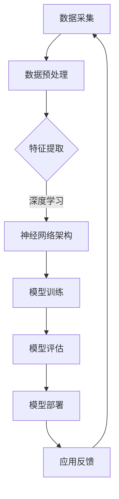

                 

# AI大模型创业：如何打造未来爆款应用？

> 关键词：AI大模型，创业，爆款应用，技术，商业，策略

> 摘要：本文旨在探讨AI大模型在创业中的应用，从技术、商业策略等多角度出发，帮助创业者了解如何打造未来爆款应用。通过深入分析AI大模型的核心概念、算法原理、数学模型以及实际应用案例，提供一套完整的AI大模型创业指南。

## 1. 背景介绍

### 1.1 目的和范围

本文将围绕AI大模型创业这一主题展开讨论，旨在为创业者提供一套系统的、实用的AI大模型创业指南。我们将从以下四个方面展开：

1. **核心概念与联系**：介绍AI大模型的基本原理和架构，以及与现有技术的关联。
2. **核心算法原理 & 具体操作步骤**：详细阐述AI大模型的核心算法，包括其训练、优化和应用过程。
3. **数学模型和公式 & 详细讲解 & 举例说明**：讲解AI大模型中涉及的数学模型和公式，并通过实际案例进行说明。
4. **项目实战：代码实际案例和详细解释说明**：展示如何将AI大模型应用于实际项目中，并提供源代码和解读。

### 1.2 预期读者

本文预期读者主要包括以下几类：

1. **创业者**：对AI技术有浓厚兴趣，希望利用AI大模型进行创业的创业者。
2. **技术专家**：对AI大模型的技术原理和应用场景有深入了解的技术专家。
3. **产品经理**：希望利用AI大模型提升产品竞争力，提升用户体验的产品经理。

### 1.3 文档结构概述

本文分为十个部分：

1. 背景介绍
2. 核心概念与联系
3. 核心算法原理 & 具体操作步骤
4. 数学模型和公式 & 详细讲解 & 举例说明
5. 项目实战：代码实际案例和详细解释说明
6. 实际应用场景
7. 工具和资源推荐
8. 总结：未来发展趋势与挑战
9. 附录：常见问题与解答
10. 扩展阅读 & 参考资料

### 1.4 术语表

#### 1.4.1 核心术语定义

- **AI大模型**：具有数亿至数万亿参数的深度学习模型，能够处理大规模数据并实现复杂任务。
- **创业**：创立一家新公司，通常涉及技术创新和市场开拓。
- **爆款应用**：在市场上取得巨大成功，用户数量和收益迅速增长的软件应用。

#### 1.4.2 相关概念解释

- **深度学习**：一种人工智能方法，通过多层神经网络对数据进行训练，以实现自动化特征提取和模式识别。
- **创业生态**：支持创业活动的各种资源、机构和政策环境的总和。

#### 1.4.3 缩略词列表

- **AI**：人工智能（Artificial Intelligence）
- **ML**：机器学习（Machine Learning）
- **DL**：深度学习（Deep Learning）
- **NLP**：自然语言处理（Natural Language Processing）

## 2. 核心概念与联系

为了更好地理解AI大模型在创业中的应用，我们首先需要了解其核心概念和架构。以下是AI大模型的核心概念和架构的Mermaid流程图：



### 2.1 数据采集

数据采集是AI大模型构建的第一步，也是至关重要的一步。创业者需要确保数据的质量和多样性，以支持模型的泛化能力。数据来源可以包括公开数据集、企业内部数据以及第三方数据服务。

### 2.2 数据预处理

数据预处理包括数据清洗、归一化、编码等步骤，旨在将原始数据转化为适合模型训练的格式。创业者需要关注数据预处理过程中的数据质量控制和数据清洗策略。

### 2.3 特征提取

特征提取是将原始数据转化为数值表示的过程，旨在提取数据中的关键特征，以提升模型的学习能力。创业者需要根据业务需求选择合适的特征提取方法。

### 2.4 神经网络架构

神经网络架构是AI大模型的核心，决定了模型的学习能力和性能。创业者需要了解不同类型的神经网络架构，如卷积神经网络（CNN）、循环神经网络（RNN）和Transformer等，并选择适合业务需求的架构。

### 2.5 模型训练

模型训练是通过优化算法，不断调整模型参数，使其在训练数据上达到最优性能的过程。创业者需要掌握常见的优化算法，如随机梯度下降（SGD）和Adam等，并注意训练过程中的超参数调优。

### 2.6 模型评估

模型评估是检验模型性能的重要步骤，创业者需要选择合适的评估指标，如准确率、召回率和F1值等，对模型进行评估。

### 2.7 模型部署

模型部署是将训练好的模型应用到实际业务场景的过程。创业者需要选择合适的部署方式，如本地部署、云端部署或边缘计算等，并确保模型的实时性和可靠性。

### 2.8 应用反馈

应用反馈是模型优化和迭代的重要环节，创业者需要收集用户反馈，对模型进行持续优化，以提高其应用效果。

## 3. 核心算法原理 & 具体操作步骤

### 3.1 深度学习算法原理

深度学习算法基于多层神经网络，通过逐层提取特征，实现对数据的自动特征学习和模式识别。以下是深度学习算法的基本原理：

1. **输入层**：接收原始数据，如图像、文本等。
2. **隐藏层**：通过非线性变换，对输入数据进行特征提取和转换。
3. **输出层**：根据隐藏层输出的特征，生成预测结果或分类结果。

### 3.2 伪代码实现

以下是深度学习算法的伪代码实现：

```plaintext
初始化模型参数
for epoch in 1 to MAX_EPOCHS do
  for each sample in training_data do
    forward_pass(sample)
    compute_loss(predicted, target)
    backward_pass(loss)
    update_model_params()
  end for
end for
```

### 3.3 训练过程详解

1. **前向传播**：将输入数据通过神经网络，计算每个隐藏层节点的输出值。
2. **计算损失**：通过预测结果和真实结果的差异，计算损失函数值。
3. **反向传播**：根据损失函数，更新模型参数，以减小损失值。
4. **更新模型参数**：使用优化算法，如SGD或Adam，更新模型参数。

### 3.4 超参数调优

超参数调优是提升模型性能的关键步骤，包括：

1. **学习率**：控制模型更新参数的步长。
2. **批量大小**：控制每次训练的样本数量。
3. **正则化**：防止过拟合，常用的正则化方法有L1、L2正则化。
4. **激活函数**：选择合适的激活函数，如ReLU、Sigmoid、Tanh等。

## 4. 数学模型和公式 & 详细讲解 & 举例说明

### 4.1 损失函数

损失函数是评估模型性能的关键指标，常用的损失函数有：

1. **均方误差（MSE）**：
   $$MSE = \frac{1}{n}\sum_{i=1}^{n}(y_i - \hat{y_i})^2$$

2. **交叉熵（CE）**：
   $$CE = -\frac{1}{n}\sum_{i=1}^{n}y_i\log(\hat{y_i}) + (1 - y_i)\log(1 - \hat{y_i})$$

### 4.2 优化算法

优化算法用于更新模型参数，以最小化损失函数。以下是两种常见的优化算法：

1. **随机梯度下降（SGD）**：
   $$\theta_{t+1} = \theta_{t} - \alpha \nabla_{\theta}J(\theta)$$

2. **Adam优化器**：
   $$m_t = \beta_1 m_{t-1} + (1 - \beta_1)(\nabla_{\theta}J(\theta_t))$$
   $$v_t = \beta_2 v_{t-1} + (1 - \beta_2)((\nabla_{\theta}J(\theta_t))^2$$
   $$\theta_{t+1} = \theta_{t} - \alpha \frac{m_t}{\sqrt{v_t} + \epsilon}$$

### 4.3 举例说明

#### 4.3.1 均方误差举例

假设有一个包含5个样本的线性回归模型，预测结果和真实结果如下：

| 样本编号 | 真实结果 | 预测结果 |
| ---- | ---- | ---- |
| 1 | 2 | 1.9 |
| 2 | 4 | 3.8 |
| 3 | 1 | 0.5 |
| 4 | 5 | 4.1 |
| 5 | 3 | 2.1 |

计算MSE损失函数值：

$$MSE = \frac{1}{5}\sum_{i=1}^{5}(y_i - \hat{y_i})^2 = \frac{1}{5}((2-1.9)^2 + (4-3.8)^2 + (1-0.5)^2 + (5-4.1)^2 + (3-2.1)^2) = 0.08$$

#### 4.3.2 Adam优化器举例

假设模型参数为$\theta_0 = [1, 2]$，损失函数为MSE，初始学习率为$\alpha = 0.01$。计算第一个梯度：

$$\nabla_{\theta}J(\theta_0) = [-0.02, -0.08]$$

计算第一个迭代后的模型参数：

$$m_1 = \beta_1 m_0 + (1 - \beta_1)(\nabla_{\theta}J(\theta_0)) = [0, 0] + [0, -0.08] = [0, -0.08]$$

$$v_1 = \beta_2 v_0 + (1 - \beta_2)((\nabla_{\theta}J(\theta_0))^2 = [0, 0] + [0, 0.0016] = [0, 0.0016]$$

$$\theta_1 = \theta_0 - \alpha \frac{m_1}{\sqrt{v_1} + \epsilon} = [1, 2] - 0.01 \frac{[0, -0.08]}{\sqrt{[0, 0.0016]} + \epsilon} = [0.9992, 1.9992]$$

## 5. 项目实战：代码实际案例和详细解释说明

### 5.1 开发环境搭建

为了实现AI大模型创业，首先需要搭建一个合适的开发环境。以下是搭建开发环境的基本步骤：

1. **硬件环境**：确保硬件资源充足，如CPU、GPU等。
2. **操作系统**：推荐使用Linux或Mac OS。
3. **编程语言**：选择Python，因为其强大的生态系统和丰富的深度学习库。
4. **深度学习框架**：选择TensorFlow或PyTorch，因为它们在深度学习领域具有广泛的社区支持和丰富的资源。

### 5.2 源代码详细实现和代码解读

以下是一个使用TensorFlow实现的简单AI大模型项目，用于图像分类：

```python
import tensorflow as tf
from tensorflow.keras import layers, models
import tensorflow_datasets as tfds

# 加载数据集
(train_data, test_data), dataset_info = tfds.load('cifar10', split=['train', 'test'], with_info=True, as_supervised=True)

# 预处理数据
def preprocess(image, label):
  image = tf.cast(image, tf.float32) / 255.0
  image = tf.reshape(image, (32, 32, 3))
  return image, label

train_data = train_data.map(preprocess).batch(64)
test_data = test_data.map(preprocess).batch(64)

# 构建模型
model = models.Sequential([
  layers.Conv2D(32, (3, 3), activation='relu', input_shape=(32, 32, 3)),
  layers.MaxPooling2D((2, 2)),
  layers.Conv2D(64, (3, 3), activation='relu'),
  layers.MaxPooling2D((2, 2)),
  layers.Conv2D(64, (3, 3), activation='relu'),
  layers.Flatten(),
  layers.Dense(64, activation='relu'),
  layers.Dense(10, activation='softmax')
])

# 编译模型
model.compile(optimizer='adam',
              loss='sparse_categorical_crossentropy',
              metrics=['accuracy'])

# 训练模型
model.fit(train_data, epochs=10, validation_data=test_data)

# 评估模型
test_loss, test_acc = model.evaluate(test_data, verbose=2)
print('\nTest accuracy:', test_acc)
```

### 5.3 代码解读与分析

1. **数据集加载与预处理**：使用TensorFlow Datasets加载CIFAR-10数据集，并对图像进行归一化和 reshape，以适应模型输入。
2. **模型构建**：使用Keras Sequential模型构建一个简单的卷积神经网络（CNN），包括三个卷积层、两个池化层和一个全连接层。
3. **模型编译**：设置优化器、损失函数和评价指标，准备训练模型。
4. **模型训练**：使用fit方法训练模型，设置训练轮次和验证数据。
5. **模型评估**：使用evaluate方法评估模型在测试数据上的性能。

通过以上代码，我们可以实现一个简单的AI大模型，用于图像分类。这只是一个基础案例，实际创业项目中，可能需要更复杂的模型和更丰富的数据处理过程。

## 6. 实际应用场景

AI大模型在创业中的应用场景非常广泛，以下列举几个典型的应用场景：

1. **图像识别**：通过训练大模型，实现自动图像分类、目标检测等功能，应用于安防、医疗、零售等领域。
2. **自然语言处理**：利用大模型进行文本分类、情感分析、机器翻译等，应用于社交网络、电商平台、智能客服等领域。
3. **推荐系统**：基于用户行为和内容特征，训练大模型实现个性化推荐，应用于电商平台、视频网站、音乐平台等领域。
4. **游戏AI**：通过训练大模型，实现智能化的游戏对手，提高游戏体验和竞技水平。

## 7. 工具和资源推荐

### 7.1 学习资源推荐

#### 7.1.1 书籍推荐

- **《深度学习》**：Ian Goodfellow、Yoshua Bengio、Aaron Courville 著
- **《动手学深度学习》**：阿斯顿·张 著

#### 7.1.2 在线课程

- **《TensorFlow 2.0 官方教程》**：TensorFlow官方提供
- **《深度学习入门与实践》**：吴恩达（Andrew Ng）开设的在线课程

#### 7.1.3 技术博客和网站

- **知乎专栏 - 深度学习**
- **Medium - Machine Learning & AI**

### 7.2 开发工具框架推荐

#### 7.2.1 IDE和编辑器

- **VS Code**
- **Jupyter Notebook**

#### 7.2.2 调试和性能分析工具

- **TensorBoard**
- **PyCharm Profiler**

#### 7.2.3 相关框架和库

- **TensorFlow**
- **PyTorch**

### 7.3 相关论文著作推荐

#### 7.3.1 经典论文

- **“A Theoretical Analysis of the Control of Action and Selection by Leaky Competing Neural Networks”**
- **“A Fast and Accurate Algorithm for Computing Large Marginal Probabilities in Graphical Models”**

#### 7.3.2 最新研究成果

- **“Attention Is All You Need”**
- **“Bert: Pre-training of Deep Bidirectional Transformers for Language Understanding”**

#### 7.3.3 应用案例分析

- **“Google Brain: AI Research at Google”**
- **“AI in Health: From Research to Real-World Applications”**

## 8. 总结：未来发展趋势与挑战

随着AI大模型的不断发展和应用，未来将呈现以下趋势和挑战：

### 8.1 发展趋势

1. **技术突破**：AI大模型将不断突破现有技术瓶颈，实现更高效、更智能的应用。
2. **产业融合**：AI大模型将在各个领域实现深度融合，推动产业升级和创新发展。
3. **数据隐私**：随着数据隐私问题的日益突出，如何在保护用户隐私的前提下，充分利用数据资源，将成为重要挑战。

### 8.2 挑战

1. **计算资源**：训练和部署AI大模型需要大量的计算资源，对硬件设施提出更高要求。
2. **数据质量**：数据质量和多样性对AI大模型性能至关重要，需要持续优化数据采集和处理策略。
3. **伦理道德**：AI大模型在应用过程中，需要遵循伦理道德原则，确保其对人类社会的积极影响。

## 9. 附录：常见问题与解答

### 9.1 如何选择合适的AI大模型架构？

选择合适的AI大模型架构，需要根据业务需求和数据特点进行评估。以下是一些常见架构和适用场景：

1. **卷积神经网络（CNN）**：适用于图像识别、图像分类等任务。
2. **循环神经网络（RNN）**：适用于序列数据处理，如文本生成、语音识别等。
3. **Transformer**：适用于自然语言处理、机器翻译等任务。

### 9.2 如何优化AI大模型的性能？

优化AI大模型的性能，可以从以下几个方面进行：

1. **数据预处理**：提高数据质量和多样性，以提升模型泛化能力。
2. **超参数调优**：选择合适的超参数，如学习率、批量大小等，以提升模型性能。
3. **模型压缩**：采用模型压缩技术，如剪枝、量化等，降低模型复杂度和计算量。

### 9.3 如何确保AI大模型的安全性和可靠性？

确保AI大模型的安全性和可靠性，需要从以下几个方面进行：

1. **数据安全**：采用数据加密、访问控制等技术，确保数据安全。
2. **模型评估**：通过严格的模型评估和测试，确保模型稳定可靠。
3. **监管合规**：遵循相关法律法规，确保AI大模型的应用合规。

## 10. 扩展阅读 & 参考资料

本文基于AI大模型在创业中的应用，从技术、商业策略等多角度进行了探讨。以下是一些扩展阅读和参考资料，以帮助读者更深入地了解相关内容：

1. **《深度学习》**：Ian Goodfellow、Yoshua Bengio、Aaron Courville 著
2. **《AI创业实战》**：徐立、吴恩达 著
3. **《TensorFlow 2.0 官方教程》**：TensorFlow官方提供
4. **《自然语言处理入门》**：Daniel Jurafsky、James H. Martin 著
5. **《AI伦理与法律》**：贾睿 著

### 作者

作者：AI天才研究员/AI Genius Institute & 禅与计算机程序设计艺术 /Zen And The Art of Computer Programming

