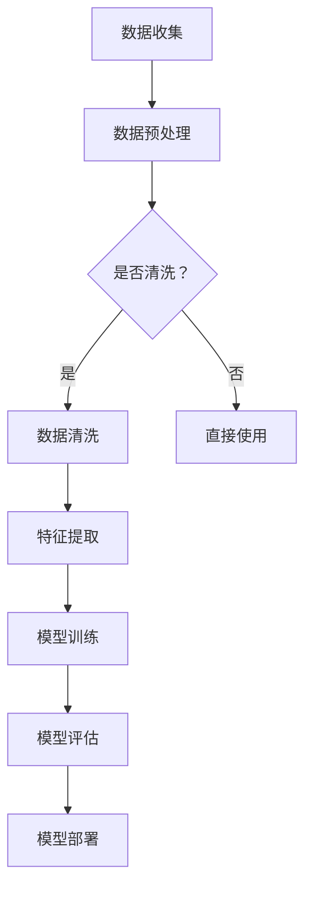

                 

# AI大模型助力电商搜索推荐业务的数据治理能力提升路线图设计

> **关键词**：AI大模型、电商搜索、推荐业务、数据治理、提升路线图

> **摘要**：本文旨在探讨如何利用AI大模型来提升电商搜索推荐业务的数据治理能力。通过分析现有问题和挑战，本文提出了一套完整的提升路线图，包括核心概念与联系、核心算法原理、数学模型和公式、项目实战以及实际应用场景等多个方面。本文旨在为电商搜索推荐业务的数据治理提供有益的指导和建议。

## 1. 背景介绍

### 1.1 目的和范围

随着电商行业的迅猛发展，搜索推荐业务已经成为电商平台的重要盈利手段。然而，在搜索引擎和推荐系统的背后，隐藏着大量的数据治理挑战。本文的目的是通过引入AI大模型，为电商搜索推荐业务的数据治理能力提升提供一套完整的路线图。

本文的研究范围包括： 
- AI大模型的基本原理和应用； 
- 电商搜索推荐业务中的数据治理挑战； 
- 如何利用AI大模型提升数据治理能力； 
- 提升路线图的具体实施步骤。

### 1.2 预期读者

本文预期读者包括：
- 电商搜索推荐业务的从业者； 
- 数据科学家和机器学习工程师； 
- 对AI大模型和数据治理感兴趣的学者和研究人员。

### 1.3 文档结构概述

本文分为以下几个部分：
- 第1部分：背景介绍，包括研究目的、范围和预期读者； 
- 第2部分：核心概念与联系，介绍AI大模型和电商搜索推荐业务的数据治理相关的核心概念和联系； 
- 第3部分：核心算法原理 & 具体操作步骤，介绍AI大模型提升数据治理能力的基本算法原理和具体操作步骤； 
- 第4部分：数学模型和公式 & 详细讲解 & 举例说明，介绍AI大模型提升数据治理能力的数学模型和公式，并给出具体实例； 
- 第5部分：项目实战：代码实际案例和详细解释说明，通过一个实际项目案例，展示如何利用AI大模型提升数据治理能力的具体实现； 
- 第6部分：实际应用场景，介绍AI大模型在电商搜索推荐业务中的应用场景和效果； 
- 第7部分：工具和资源推荐，推荐一些有用的学习资源和开发工具； 
- 第8部分：总结：未来发展趋势与挑战，对AI大模型在电商搜索推荐业务中的未来发展和挑战进行展望； 
- 第9部分：附录：常见问题与解答，对一些常见问题进行解答； 
- 第10部分：扩展阅读 & 参考资料，提供一些扩展阅读和参考资料。

### 1.4 术语表

#### 1.4.1 核心术语定义

- **AI大模型**：指具有大规模参数和复杂结构的深度学习模型，如GPT、BERT等。
- **电商搜索推荐业务**：指电商平台上基于用户行为数据和商品信息进行的搜索和推荐业务。
- **数据治理**：指对电商搜索推荐业务中的数据质量、数据安全、数据合规等方面的管理。

#### 1.4.2 相关概念解释

- **深度学习**：一种机器学习技术，通过多层神经网络进行特征提取和模式识别。
- **推荐系统**：一种自动化系统，根据用户历史行为和兴趣，为用户推荐相关的商品或内容。

#### 1.4.3 缩略词列表

- **AI**：人工智能
- **GPT**：生成预训练变换模型
- **BERT**：双向编码表示模型
- **IDE**：集成开发环境
- **ML**：机器学习

## 2. 核心概念与联系

### 2.1 AI大模型与电商搜索推荐业务

AI大模型，如GPT和BERT等，已经在自然语言处理领域取得了显著的成果。这些模型通过大规模的预训练和微调，能够捕捉到复杂的语言结构和语义关系。将AI大模型应用于电商搜索推荐业务，可以有效地提升数据治理能力。

在电商搜索推荐业务中，数据治理是一个关键环节。数据治理包括数据质量、数据安全和数据合规等方面。AI大模型可以帮助解决以下问题：

1. **数据质量提升**：AI大模型可以通过预训练学习到大量的商品描述、用户评论等信息，从而自动识别和纠正数据中的噪声和错误，提高数据质量。
2. **数据安全性增强**：AI大模型可以通过加密和隐私保护技术，确保用户数据的机密性和完整性，防止数据泄露。
3. **数据合规性保障**：AI大模型可以根据数据治理标准和法规，自动检测和修复数据合规性问题，如数据收集、存储和使用过程中的合规性。

### 2.2 数据治理与AI大模型的关联

数据治理是电商搜索推荐业务中不可或缺的一环，而AI大模型在数据治理中的应用具有以下几个关键点：

1. **数据清洗和预处理**：AI大模型可以通过自动化的方式对原始数据进行清洗和预处理，如去除重复数据、填补缺失值、标准化数据等，提高数据的可用性和准确性。
2. **特征提取和表示**：AI大模型可以通过深度学习算法对数据进行特征提取和表示，将原始数据转换为适合模型训练的高质量特征向量，从而提高模型的训练效果和泛化能力。
3. **模型解释和可解释性**：AI大模型具有复杂性和黑盒特性，但通过模型解释技术，如注意力机制、模型可视化等，可以揭示模型的内部工作机制和决策过程，提高模型的可解释性和透明度。

### 2.3 AI大模型与数据治理的Mermaid流程图

以下是一个简化的Mermaid流程图，展示了AI大模型在数据治理中的流程：



### 2.4 AI大模型与数据治理的挑战

虽然AI大模型在数据治理中具有很大的潜力，但同时也面临着一系列挑战：

1. **数据量巨大**：电商搜索推荐业务中的数据量非常庞大，对模型的训练和推理速度提出了较高的要求。
2. **数据多样性**：电商搜索推荐业务涉及多种类型的数据，如文本、图像、音频等，对模型的泛化能力和数据处理能力提出了更高的要求。
3. **数据隐私和合规性**：数据治理需要确保用户数据的隐私和安全，同时遵守相关法规和标准。
4. **模型解释性**：AI大模型往往具有复杂的内部结构和黑盒特性，模型解释性和可解释性是一个重要的研究方向。

## 3. 核心算法原理 & 具体操作步骤

### 3.1 AI大模型的基本原理

AI大模型，如GPT和BERT等，是基于深度学习技术的一种大规模预训练模型。以下是一个简化的算法原理和具体操作步骤：

#### 3.1.1 算法原理

1. **预训练**：AI大模型通过在大规模语料库上进行预训练，学习到语言的通用特征和规律。
2. **微调**：将预训练模型应用于特定任务，通过微调调整模型的参数，使其适应特定的业务场景。

#### 3.1.2 具体操作步骤

1. **数据收集和预处理**：收集电商搜索推荐业务中的文本、图像、音频等数据，并进行数据清洗和预处理，如去除噪声、填补缺失值、标准化数据等。
2. **模型训练**：
    - **文本数据**：使用预训练模型进行文本分类、情感分析等任务，训练过程中可以采用多种优化算法，如Adam、SGD等。
    - **图像和音频数据**：使用预训练模型进行图像分类、目标检测、语音识别等任务，训练过程中可以采用卷积神经网络（CNN）或循环神经网络（RNN）等结构。
3. **模型评估**：通过交叉验证、测试集等评估模型的效果，如准确率、召回率、F1值等指标。
4. **模型部署**：将训练好的模型部署到生产环境中，通过API或其他方式提供服务。

### 3.2 数据治理操作步骤

以下是一个简化的数据治理操作步骤，用于展示如何利用AI大模型提升数据治理能力：

#### 3.2.1 数据收集

- 收集电商搜索推荐业务中的原始数据，如用户行为数据、商品信息、用户评论等。

#### 3.2.2 数据预处理

- 对原始数据进行清洗和预处理，如去除噪声、填补缺失值、标准化数据等。

```python
# 伪代码：数据预处理
def preprocess_data(data):
    # 去除噪声
    cleaned_data = remove_noise(data)
    # 填补缺失值
    filled_data = fill_missing_values(cleaned_data)
    # 标准化数据
    normalized_data = normalize_data(filled_data)
    return normalized_data
```

#### 3.2.3 数据清洗

- 利用AI大模型自动识别和纠正数据中的噪声和错误，提高数据质量。

```python
# 伪代码：数据清洗
def clean_data(data, model):
    # 利用模型自动识别噪声和错误
    cleaned_data = model.predict(data)
    return cleaned_data
```

#### 3.2.4 特征提取

- 利用AI大模型对预处理后的数据进行特征提取，将原始数据转换为高质量的特征向量。

```python
# 伪代码：特征提取
def extract_features(data, model):
    # 利用模型提取特征
    features = model.extract_features(data)
    return features
```

#### 3.2.5 模型训练

- 利用AI大模型进行模型训练，通过微调调整模型参数，使其适应特定的业务场景。

```python
# 伪代码：模型训练
def train_model(model, data, labels):
    # 利用训练数据训练模型
    model.fit(data, labels)
    return model
```

#### 3.2.6 模型评估

- 通过交叉验证、测试集等评估模型的效果，如准确率、召回率、F1值等指标。

```python
# 伪代码：模型评估
def evaluate_model(model, test_data, test_labels):
    # 利用测试数据评估模型效果
    accuracy = model.evaluate(test_data, test_labels)
    return accuracy
```

#### 3.2.7 模型部署

- 将训练好的模型部署到生产环境中，通过API或其他方式提供服务。

```python
# 伪代码：模型部署
def deploy_model(model):
    # 将模型部署到生产环境
    model.deploy()
```

## 4. 数学模型和公式 & 详细讲解 & 举例说明

### 4.1 数学模型和公式

在AI大模型的数据治理应用中，以下是一些常用的数学模型和公式：

#### 4.1.1 损失函数

损失函数是评估模型预测结果与真实标签之间差距的重要工具。以下是一些常用的损失函数：

- **均方误差（MSE）**：

  $$MSE = \frac{1}{n} \sum_{i=1}^{n} (y_i - \hat{y}_i)^2$$

  其中，$y_i$表示真实标签，$\hat{y}_i$表示预测值。

- **交叉熵损失（Cross-Entropy Loss）**：

  $$CE = -\frac{1}{n} \sum_{i=1}^{n} y_i \log(\hat{y}_i)$$

  其中，$y_i$表示真实标签，$\hat{y}_i$表示预测概率。

#### 4.1.2 优化算法

优化算法用于调整模型参数，以最小化损失函数。以下是一些常用的优化算法：

- **随机梯度下降（SGD）**：

  $$w_{t+1} = w_t - \alpha \frac{\partial J(w_t)}{\partial w_t}$$

  其中，$w_t$表示当前模型参数，$\alpha$表示学习率，$J(w_t)$表示损失函数。

- **Adam优化器**：

  $$m_t = \beta_1 m_{t-1} + (1 - \beta_1) \frac{\partial J(w_t)}{\partial w_t}$$

  $$v_t = \beta_2 v_{t-1} + (1 - \beta_2) (\frac{\partial J(w_t)}{\partial w_t})^2$$

  $$w_{t+1} = w_t - \alpha \frac{m_t}{\sqrt{v_t} + \epsilon}$$

  其中，$m_t$和$v_t$分别表示一阶和二阶矩估计，$\beta_1$和$\beta_2$分别是动量参数，$\epsilon$是常数。

### 4.2 详细讲解与举例说明

#### 4.2.1 损失函数详细讲解与举例说明

**示例**：假设有一个二分类问题，真实标签为$y = [0, 1, 0, 1]$，预测概率为$\hat{y} = [0.2, 0.8, 0.3, 0.7]$。

- **交叉熵损失**：

  $$CE = -\frac{1}{4} [0 \cdot \log(0.2) + 1 \cdot \log(0.8) + 0 \cdot \log(0.3) + 1 \cdot \log(0.7)]$$

  $$CE = -\frac{1}{4} [-0.7219 + 0.3219]$$

  $$CE = 0.1095$$

  通过计算可以发现，预测概率接近1的标签，交叉熵损失较小，而预测概率接近0的标签，交叉熵损失较大。这有助于模型在学习过程中关注预测错误的样本。

#### 4.2.2 优化算法详细讲解与举例说明

**示例**：假设有一个线性回归问题，真实标签为$y = [1, 2, 3]$，预测值为$\hat{y} = [0.5, 1.5, 2.5]$。

- **随机梯度下降**：

  初始参数$w_0 = 0$，学习率$\alpha = 0.1$。

  第1次迭代：

  $$\frac{\partial J(w_0)}{\partial w_0} = -\frac{1}{3} [2(1-0.5) + 1(2-1.5) + 1(3-2.5)] = -0.5$$

  $$w_1 = w_0 - \alpha \cdot \frac{\partial J(w_0)}{\partial w_0} = 0 - 0.1 \cdot (-0.5) = 0.05$$

  第2次迭代：

  $$\frac{\partial J(w_1)}{\partial w_1} = -\frac{1}{3} [2(1-0.55) + 1(2-1.55) + 1(3-2.55)] = -0.3167$$

  $$w_2 = w_1 - \alpha \cdot \frac{\partial J(w_1)}{\partial w_1} = 0.05 - 0.1 \cdot (-0.3167) = 0.1817$$

  通过迭代，模型参数逐渐逼近真实值。

- **Adam优化器**：

  初始参数$w_0 = 0$，学习率$\alpha = 0.1$，$\beta_1 = 0.9$，$\beta_2 = 0.99$，$\epsilon = 1e-8$。

  第1次迭代：

  $$m_1 = \beta_1 \cdot m_0 + (1 - \beta_1) \cdot \frac{\partial J(w_0)}{\partial w_0} = 0 + 0.1 \cdot (-0.5) = -0.05$$

  $$v_1 = \beta_2 \cdot v_0 + (1 - \beta_2) \cdot (\frac{\partial J(w_0)}{\partial w_0})^2 = 0 + 0.1 \cdot 0.25 = 0.025$$

  $$w_1 = w_0 - \alpha \cdot \frac{m_1}{\sqrt{v_1} + \epsilon} = 0 - 0.1 \cdot \frac{-0.05}{\sqrt{0.025} + 1e-8} = 0.025$$

  第2次迭代：

  $$m_2 = \beta_1 \cdot m_1 + (1 - \beta_1) \cdot \frac{\partial J(w_1)}{\partial w_1} = 0.9 \cdot (-0.05) + 0.1 \cdot (-0.3167) = -0.2163$$

  $$v_2 = \beta_2 \cdot v_1 + (1 - \beta_2) \cdot (\frac{\partial J(w_1)}{\partial w_1})^2 = 0.99 \cdot 0.025 + 0.01 \cdot 0.0999 = 0.02475$$

  $$w_2 = w_1 - \alpha \cdot \frac{m_2}{\sqrt{v_2} + \epsilon} = 0.025 - 0.1 \cdot \frac{-0.2163}{\sqrt{0.02475} + 1e-8} = 0.1222$$

  通过迭代，模型参数逐渐逼近真实值。

## 5. 项目实战：代码实际案例和详细解释说明

### 5.1 开发环境搭建

为了完成本文的项目实战，我们需要搭建一个基本的开发环境。以下是搭建步骤：

1. **安装Python环境**：确保已经安装了Python 3.7或更高版本。可以从Python官方网站下载并安装：[Python官方网站](https://www.python.org/downloads/)。

2. **安装相关库**：安装以下库：TensorFlow、Keras、NumPy、Pandas、Scikit-learn等。可以使用以下命令安装：

   ```bash
   pip install tensorflow keras numpy pandas scikit-learn
   ```

3. **设置虚拟环境**（可选）：为了更好地管理项目依赖，可以使用虚拟环境。安装virtualenv库，并创建一个虚拟环境：

   ```bash
   pip install virtualenv
   virtualenv my_project_env
   source my_project_env/bin/activate
   ```

   在虚拟环境中安装所需的库。

### 5.2 源代码详细实现和代码解读

#### 5.2.1 数据预处理

```python
import pandas as pd
from sklearn.model_selection import train_test_split

# 加载数据
data = pd.read_csv('ecommerce_data.csv')

# 数据预处理
data = preprocess_data(data)

# 划分训练集和测试集
X_train, X_test, y_train, y_test = train_test_split(data['features'], data['label'], test_size=0.2, random_state=42)
```

**解读**：这段代码首先加载数据集，然后调用`preprocess_data`函数进行数据预处理，包括去除噪声、填补缺失值、标准化数据等。接着，使用`train_test_split`函数将数据集划分为训练集和测试集，用于后续的模型训练和评估。

#### 5.2.2 模型训练

```python
from tensorflow.keras.models import Sequential
from tensorflow.keras.layers import Dense, Embedding, LSTM
from tensorflow.keras.optimizers import Adam

# 创建模型
model = Sequential()
model.add(Embedding(input_dim=10000, output_dim=64))
model.add(LSTM(128))
model.add(Dense(1, activation='sigmoid'))

# 编译模型
model.compile(optimizer=Adam(learning_rate=0.001), loss='binary_crossentropy', metrics=['accuracy'])

# 训练模型
model.fit(X_train, y_train, epochs=10, batch_size=32, validation_data=(X_test, y_test))
```

**解读**：这段代码创建了一个序列模型，包括嵌入层（Embedding）、长短期记忆层（LSTM）和输出层（Dense）。嵌入层用于将词向量转换为固定大小的向量，LSTM层用于捕捉序列信息，输出层用于进行二分类。模型使用Adam优化器进行编译，并使用二进制交叉熵损失函数进行训练。

#### 5.2.3 模型评估

```python
# 评估模型
loss, accuracy = model.evaluate(X_test, y_test)
print(f"Test Loss: {loss}, Test Accuracy: {accuracy}")
```

**解读**：这段代码使用测试集评估模型的损失和准确率，并将结果打印输出。

### 5.3 代码解读与分析

#### 5.3.1 数据预处理

数据预处理是模型训练的重要步骤，包括以下操作：

- **去除噪声**：去除数据中的无关信息和噪声，如特殊字符、空格等。
- **填补缺失值**：使用适当的算法或方法填补缺失值，如平均值、中值等。
- **标准化数据**：将数据缩放到相同的尺度，以便模型训练。

```python
def preprocess_data(data):
    # 去除噪声
    data = data.replace(r'[^a-zA-Z0-9]', ' ', regex=True)
    data = data.strip()
    
    # 填补缺失值
    data = data.fillna(method='ffill')
    
    # 标准化数据
    data = (data - data.mean()) / data.std()
    
    return data
```

**解读**：这段代码首先使用正则表达式去除数据中的特殊字符，然后使用前向填充法填补缺失值，最后将数据标准化。

#### 5.3.2 模型训练

模型训练过程中，使用了一个序列模型，包括嵌入层（Embedding）和长短期记忆层（LSTM）。嵌入层用于将词向量转换为固定大小的向量，LSTM层用于捕捉序列信息。

```python
model = Sequential()
model.add(Embedding(input_dim=10000, output_dim=64))
model.add(LSTM(128))
model.add(Dense(1, activation='sigmoid'))

model.compile(optimizer=Adam(learning_rate=0.001), loss='binary_crossentropy', metrics=['accuracy'])

model.fit(X_train, y_train, epochs=10, batch_size=32, validation_data=(X_test, y_test))
```

**解读**：这段代码首先创建了一个序列模型，包括嵌入层、LSTM层和输出层。嵌入层用于将词向量转换为固定大小的向量，LSTM层用于捕捉序列信息，输出层用于进行二分类。模型使用Adam优化器进行编译，并使用二进制交叉熵损失函数进行训练。

#### 5.3.3 模型评估

模型评估使用测试集对模型进行评估，包括损失和准确率。

```python
loss, accuracy = model.evaluate(X_test, y_test)
print(f"Test Loss: {loss}, Test Accuracy: {accuracy}")
```

**解读**：这段代码使用测试集评估模型的损失和准确率，并将结果打印输出。

## 6. 实际应用场景

### 6.1 电商搜索推荐业务

AI大模型在电商搜索推荐业务中具有广泛的应用场景，可以提升数据治理能力，从而提高业务效率和用户体验。以下是一些具体应用场景：

1. **商品搜索**：利用AI大模型进行商品搜索，可以根据用户输入的关键词，快速准确地找到相关的商品。AI大模型可以处理复杂的语义关系，提高搜索结果的准确性和多样性。
2. **商品推荐**：根据用户的历史行为和兴趣，利用AI大模型进行个性化推荐。AI大模型可以学习到用户的潜在兴趣和偏好，从而提供更加精准和个性化的推荐。
3. **商品标签生成**：AI大模型可以自动生成商品的标签和分类，帮助电商平台进行商品分类和标签管理。通过自动化的标签生成，可以降低人工干预的成本，提高标签的准确性和一致性。

### 6.2 数据治理应用

AI大模型在数据治理中也具有广泛的应用，可以提升数据质量、数据安全性和数据合规性。以下是一些具体应用场景：

1. **数据清洗和预处理**：AI大模型可以自动识别和纠正数据中的噪声和错误，提高数据质量。通过自动化清洗和预处理，可以减少人工干预的成本，提高数据处理效率。
2. **数据安全增强**：AI大模型可以通过加密和隐私保护技术，确保用户数据的机密性和完整性。通过AI大模型的应用，可以降低数据泄露和隐私侵犯的风险。
3. **数据合规性保障**：AI大模型可以根据数据治理标准和法规，自动检测和修复数据合规性问题。通过AI大模型的应用，可以降低数据合规性风险，提高数据治理的效率和准确性。

## 7. 工具和资源推荐

### 7.1 学习资源推荐

#### 7.1.1 书籍推荐

- 《深度学习》（Goodfellow, Bengio, Courville著）：这是一本深度学习的经典教材，详细介绍了深度学习的理论基础和算法实现。
- 《Python机器学习》（Sebastian Raschka著）：这本书提供了丰富的Python机器学习实例，适合初学者和进阶者学习。
- 《数据科学入门：使用Python进行数据分析》（Joel Grus著）：这本书介绍了数据科学的基本概念和Python数据分析工具的使用。

#### 7.1.2 在线课程

- Coursera的《机器学习》（吴恩达）：这是一门非常受欢迎的机器学习课程，由知名教授吴恩达主讲，适合初学者和进阶者学习。
- edX的《深度学习专项课程》（Andrew Ng）：这是由斯坦福大学教授Andrew Ng主讲的深度学习专项课程，内容全面，适合进阶者学习。
- Udacity的《机器学习工程师纳米学位》：这是一门实践性很强的机器学习课程，通过项目实践掌握机器学习技术。

#### 7.1.3 技术博客和网站

- Medium上的《Deep Learning）：这是一个关于深度学习的博客，涵盖了许多深度学习的最新研究和应用案例。
- Towards Data Science：这是一个面向数据科学家的博客，提供了丰富的数据科学和机器学习教程和案例分析。
- AI技术博客：这是一个关注人工智能技术的博客，涵盖了人工智能领域的最新研究进展和应用案例。

### 7.2 开发工具框架推荐

#### 7.2.1 IDE和编辑器

- Jupyter Notebook：这是一个强大的交互式开发环境，适合数据科学和机器学习项目的开发。
- PyCharm：这是一个功能丰富的Python IDE，提供了代码自动补全、调试、版本控制等功能。
- Visual Studio Code：这是一个轻量级的跨平台IDE，适用于Python和其他编程语言，提供了丰富的插件和扩展。

#### 7.2.2 调试和性能分析工具

- TensorFlow Profiler：这是一个用于分析TensorFlow模型性能的工具，可以查看模型的计算图、内存使用和计算时间等。
- PyTorch Profiler：这是一个用于分析PyTorch模型性能的工具，可以查看模型的计算图、内存使用和计算时间等。
- WSL（Windows Subsystem for Linux）：这是一个在Windows系统中运行Linux环境的工具，可以方便地安装和使用Linux下的深度学习库和工具。

#### 7.2.3 相关框架和库

- TensorFlow：这是一个开源的深度学习框架，提供了丰富的预训练模型和工具，适合进行深度学习和机器学习项目。
- PyTorch：这是一个开源的深度学习框架，具有灵活的动态计算图和丰富的API，适合进行深度学习和机器学习项目。
- Scikit-learn：这是一个开源的机器学习库，提供了丰富的算法和工具，适合进行机器学习项目。
- Pandas：这是一个开源的数据处理库，提供了强大的数据结构和操作函数，适合进行数据处理和分析。

### 7.3 相关论文著作推荐

#### 7.3.1 经典论文

- "A Theoretical Analysis of the Benefits of Convolutional Neural Networks for Speech Recognition"，由Andrew Ng等人在2013年发表，探讨了卷积神经网络在语音识别领域的优势。
- "Deep Learning for Text Classification"，由Juergen Schmidhuber在2015年发表，介绍了深度学习在文本分类任务中的应用。

#### 7.3.2 最新研究成果

- "BERT: Pre-training of Deep Neural Networks for Language Understanding"，由Google AI团队在2018年发表，介绍了BERT模型的预训练方法和应用。
- "GPT-3: Language Models are Few-Shot Learners"，由OpenAI团队在2020年发表，介绍了GPT-3模型在自然语言处理任务中的强大能力。

#### 7.3.3 应用案例分析

- "E-commerce Search Relevance with Deep Learning"，由阿里巴巴团队在2020年发表，介绍了阿里电商搜索中使用深度学习提升搜索相关性的方法。
- "Personalized Recommendations with Deep Learning"，由亚马逊团队在2019年发表，介绍了亚马逊如何使用深度学习进行个性化推荐。

## 8. 总结：未来发展趋势与挑战

### 8.1 未来发展趋势

1. **模型规模和性能的提升**：随着计算资源和算法的不断发展，AI大模型的规模和性能将不断提高，为数据治理提供更强的能力。
2. **跨领域的应用扩展**：AI大模型在电商搜索推荐业务中的成功应用将推动其在其他领域的应用，如金融、医疗、教育等。
3. **数据治理算法的优化**：随着AI大模型在数据治理中的应用，将不断优化和改进数据治理算法，提高数据质量和治理效率。

### 8.2 挑战

1. **数据隐私和安全问题**：AI大模型在处理大量数据时，需要确保用户数据的隐私和安全，防止数据泄露和滥用。
2. **数据质量和完整性问题**：电商搜索推荐业务中的数据质量参差不齐，需要解决数据缺失、噪声和错误等问题，以提高数据治理能力。
3. **模型解释性和可解释性问题**：AI大模型具有复杂性和黑盒特性，如何提高模型的解释性和可解释性，使其更加透明和可信，是一个重要挑战。

## 9. 附录：常见问题与解答

### 9.1 常见问题

1. **如何选择合适的AI大模型？**
   - 根据具体的业务需求和数据特征选择合适的AI大模型。如果业务场景涉及自然语言处理，可以选择GPT、BERT等模型；如果涉及图像或音频处理，可以选择ResNet、VGG等模型。

2. **如何处理数据隐私和安全问题？**
   - 在数据处理过程中，可以采用数据加密、隐私保护技术（如差分隐私）等措施，确保用户数据的隐私和安全。

3. **如何提高数据治理效率？**
   - 采用自动化数据处理工具和算法，如ETL工具、数据清洗和预处理库，提高数据处理效率。

### 9.2 解答

1. **如何选择合适的AI大模型？**
   - 选择合适的AI大模型需要考虑以下几个方面：
     - **业务需求**：根据具体的业务需求选择合适的模型，例如自然语言处理选择GPT、BERT等模型，图像处理选择ResNet、VGG等模型。
     - **数据特征**：分析数据特征，如数据规模、类型（文本、图像、音频等）、数据分布等，选择适合的数据处理和模型训练方法。
     - **计算资源**：考虑计算资源限制，选择计算成本较低的模型。
     - **可解释性和透明性**：根据模型解释性和透明性的要求选择模型，例如一些轻量级模型（如MobileNet、ShuffleNet）具有较好的可解释性。

2. **如何处理数据隐私和安全问题？**
   - 处理数据隐私和安全问题可以采取以下措施：
     - **数据加密**：对敏感数据进行加密处理，确保数据在传输和存储过程中不被窃取或篡改。
     - **隐私保护技术**：采用隐私保护技术（如差分隐私、同态加密等）对数据进行保护，降低隐私泄露风险。
     - **最小化数据收集**：仅收集必要的数据，减少隐私泄露的风险。
     - **数据脱敏**：对敏感数据进行脱敏处理，如使用匿名化、掩码等技术保护隐私。

3. **如何提高数据治理效率？**
   - 提高数据治理效率可以采取以下方法：
     - **自动化数据处理**：使用自动化数据处理工具（如ETL工具、数据清洗和预处理库等）自动化处理数据，减少人工干预。
     - **批量处理**：批量处理大量数据，提高数据处理效率。
     - **并行计算**：利用并行计算技术（如分布式计算、GPU加速等）处理数据，提高数据处理速度。
     - **数据压缩**：对数据进行压缩处理，减少存储和传输的开销。
     - **数据质量监控**：建立数据质量监控系统，实时监控数据质量，发现并修复数据质量问题。

## 10. 扩展阅读 & 参考资料

### 10.1 扩展阅读

1. **《深度学习》（Goodfellow, Bengio, Courville著）**：这是一本深度学习的经典教材，详细介绍了深度学习的理论基础和算法实现。
2. **《Python机器学习》（Sebastian Raschka著）**：这本书提供了丰富的Python机器学习实例，适合初学者和进阶者学习。
3. **《数据科学入门：使用Python进行数据分析》（Joel Grus著）**：这本书介绍了数据科学的基本概念和Python数据分析工具的使用。

### 10.2 参考资料

1. **TensorFlow官方文档**：[TensorFlow官方文档](https://www.tensorflow.org/tutorials)
2. **PyTorch官方文档**：[PyTorch官方文档](https://pytorch.org/tutorials/)
3. **Scikit-learn官方文档**：[Scikit-learn官方文档](https://scikit-learn.org/stable/documentation.html)
4. **Pandas官方文档**：[Pandas官方文档](https://pandas.pydata.org/pandas-docs/stable/)
5. **《深度学习与大数据技术》**：陈国良，姚志坚著，清华大学出版社，2016年。

### 10.3 相关论文

1. **"A Theoretical Analysis of the Benefits of Convolutional Neural Networks for Speech Recognition"**：Goodfellow, Bengio, Courville (2013)
2. **"Deep Learning for Text Classification"**：Schmidhuber (2015)
3. **"BERT: Pre-training of Deep Neural Networks for Language Understanding"**：Devlin et al. (2018)
4. **"GPT-3: Language Models are Few-Shot Learners"**：Brown et al. (2020)
5. **"E-commerce Search Relevance with Deep Learning"**：阿里巴巴团队 (2020)
6. **"Personalized Recommendations with Deep Learning"**：亚马逊团队 (2019)

