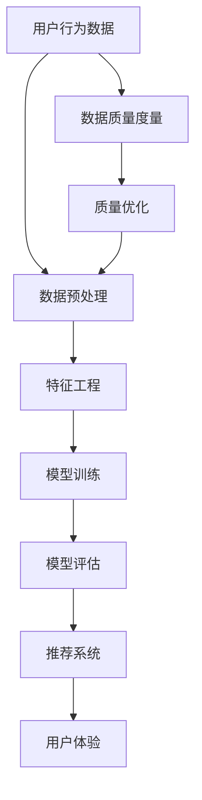

                 

# AI大模型助力电商搜索推荐业务的数据质量度量体系

> 关键词：AI大模型、电商搜索、推荐系统、数据质量度量、算法原理、项目实战、应用场景、工具推荐

> 摘要：本文将深入探讨AI大模型在电商搜索推荐业务中的应用，重点关注如何构建和优化数据质量度量体系。通过一步步的推理和分析，我们将介绍核心概念、算法原理、数学模型以及实际项目案例，帮助读者理解和掌握如何利用AI大模型提升电商搜索推荐业务的数据质量和推荐效果。

## 1. 背景介绍

### 1.1 目的和范围

本文旨在探讨AI大模型在电商搜索推荐业务中的应用，尤其是数据质量度量体系的构建与优化。随着互联网电商行业的飞速发展，用户对个性化推荐服务的需求日益增长。然而，数据质量的优劣直接影响推荐系统的效果。本文将聚焦于此，分析如何通过AI大模型提升电商搜索推荐业务的数据质量，从而提高用户满意度和商业价值。

### 1.2 预期读者

本文适合对电商搜索推荐业务有一定了解的技术人员，包括AI研究员、数据科学家、软件工程师和产品经理。读者应具备一定的编程基础和数学知识，以便更好地理解文章中的算法原理和项目实战部分。

### 1.3 文档结构概述

本文分为十个部分：

1. **背景介绍**：介绍文章的目的、预期读者和文档结构。
2. **核心概念与联系**：定义核心概念，展示相关架构的Mermaid流程图。
3. **核心算法原理 & 具体操作步骤**：详细阐述算法原理和操作步骤，使用伪代码说明。
4. **数学模型和公式 & 详细讲解 & 举例说明**：介绍相关数学模型，使用latex格式表示公式，并提供举例说明。
5. **项目实战：代码实际案例和详细解释说明**：展示代码实现，解读与分析。
6. **实际应用场景**：讨论AI大模型在电商搜索推荐业务中的具体应用。
7. **工具和资源推荐**：推荐学习资源和开发工具。
8. **总结：未来发展趋势与挑战**：展望未来发展，讨论面临的挑战。
9. **附录：常见问题与解答**：提供常见问题的答案。
10. **扩展阅读 & 参考资料**：推荐相关文献和资源。

### 1.4 术语表

#### 1.4.1 核心术语定义

- **AI大模型**：指拥有大规模参数和计算能力的深度学习模型，如BERT、GPT等。
- **电商搜索推荐业务**：指电商平台上基于用户行为数据提供的个性化搜索和推荐服务。
- **数据质量度量体系**：一套评估和优化数据质量的方法和指标体系。

#### 1.4.2 相关概念解释

- **推荐系统**：一种利用用户历史行为和内容特征为用户推荐相关商品或信息的技术。
- **数据质量**：数据满足特定用途的程度，包括准确性、完整性、一致性、时效性和可用性。

#### 1.4.3 缩略词列表

- **AI**：人工智能（Artificial Intelligence）
- **电商**：电子商务（Electronic Commerce）
- **推荐系统**：Recommender System

## 2. 核心概念与联系

在构建AI大模型驱动的电商搜索推荐业务中，我们首先需要理解几个核心概念及其相互关系。以下是一个简化的Mermaid流程图，用于展示这些概念和它们之间的关系。



### 2.1 用户行为数据

用户行为数据是推荐系统的基础，包括用户的浏览记录、购买历史、点击行为等。这些数据通常以日志形式存在，是构建个性化推荐的核心素材。

### 2.2 数据预处理

数据预处理是确保数据质量的关键步骤，包括数据清洗、数据集成和数据变换。通过数据预处理，我们可以消除噪声、处理缺失值，确保数据的一致性和完整性。

### 2.3 特征工程

特征工程是将原始数据转换为适合机器学习模型的输入特征的过程。通过特征选择和特征提取，我们可以提取出对模型训练有显著影响的特征，从而提高模型的性能。

### 2.4 模型训练

模型训练是使用预处理后的数据训练深度学习模型的过程。AI大模型拥有大规模的参数，通过学习用户行为数据，能够自动发现数据的潜在模式和关联，生成个性化的推荐结果。

### 2.5 模型评估

模型评估是验证模型性能的过程，常用的评估指标包括准确率、召回率、F1分数等。通过模型评估，我们可以了解模型的效果，并据此进行模型的调整和优化。

### 2.6 推荐系统

推荐系统是将训练好的模型应用于实际业务的过程。它根据用户的特征和行为，为用户推荐相关的商品或信息，提升用户的购物体验和满意度。

### 2.7 数据质量度量

数据质量度量是评估数据质量的方法和指标体系。通过数据质量度量，我们可以识别数据中的问题，并采取相应的措施进行优化。

### 2.8 质量优化

质量优化是针对数据质量问题进行的改进措施。通过优化数据质量，我们可以提升推荐系统的效果，降低错误推荐的概率。

## 3. 核心算法原理 & 具体操作步骤

在电商搜索推荐业务中，AI大模型的算法原理是其核心驱动力。以下是深度学习模型的基本原理和操作步骤，我们将使用伪代码详细阐述。

### 3.1 深度学习模型的基本原理

```pseudo
// 伪代码：深度学习模型的基本原理
define Layer(input_size, output_size):
    initialize weights and biases randomly
    for each forward pass:
        z = input * weights + biases
        a = activation(z)
    return a

define Model(input_size, hidden_size, output_size):
    input = Layer(input_size, hidden_size)
    hidden = Layer(hidden_size, hidden_size)
    output = Layer(hidden_size, output_size)
    return output

define ForwardPass(input, model):
    output = Model(input)
    return output

define BackwardPass(output, expected_output, model):
    compute gradients
    update weights and biases
```

### 3.2 深度学习模型的训练过程

```pseudo
// 伪代码：深度学习模型的训练过程
initialize model with random weights and biases
for each epoch:
    for each batch of data:
        forward_pass(input, model)
        calculate loss (output - expected_output)
        backward_pass(output, expected_output, model)
    adjust learning rate if necessary
    evaluate model performance on validation set
```

### 3.3 模型的优化过程

```pseudo
// 伪代码：模型的优化过程
while not model_satisfied:
    perform data cleaning and preprocessing
    retrain model with updated data
    evaluate model performance
    if performance improved:
        update model
    else:
        apply data quality optimization techniques
```

### 3.4 模型的应用

```pseudo
// 伪代码：模型的应用
define Recommendation(input_user_data, trained_model):
    predict_user_preferences = ForwardPass(input_user_data, trained_model)
    return top_n_recommendations(predict_user_preferences)
```

## 4. 数学模型和公式 & 详细讲解 & 举例说明

在构建AI大模型时，数学模型是理解其工作原理的关键。以下是几个关键的数学模型和公式的详细讲解，以及相应的举例说明。

### 4.1 损失函数

损失函数是评估模型预测值与真实值之间差距的数学函数。常用的损失函数包括均方误差（MSE）和交叉熵（Cross-Entropy）。

#### 4.1.1 均方误差（MSE）

$$
MSE = \frac{1}{n}\sum_{i=1}^{n}(y_i - \hat{y}_i)^2
$$

其中，$y_i$ 是真实值，$\hat{y}_i$ 是预测值，$n$ 是样本数量。

#### 4.1.2 交叉熵（Cross-Entropy）

$$
Cross-Entropy = -\sum_{i=1}^{n}y_i \log(\hat{y}_i)
$$

其中，$y_i$ 是真实值，$\hat{y}_i$ 是预测概率。

### 4.2 激活函数

激活函数是深度学习模型中的一个关键组件，用于引入非线性变换。常用的激活函数包括Sigmoid、ReLU和Tanh。

#### 4.2.1 Sigmoid

$$
\sigma(x) = \frac{1}{1 + e^{-x}}
$$

#### 4.2.2 ReLU

$$
ReLU(x) = \max(0, x)
$$

#### 4.2.3 Tanh

$$
Tanh(x) = \frac{e^x - e^{-x}}{e^x + e^{-x}}
$$

### 4.3 反向传播算法

反向传播算法是训练深度学习模型的核心算法，用于计算梯度并更新模型参数。

#### 4.3.1 前向传播

$$
\text{z}^{[l]} = \text{W}^{[l]} \text{a}^{[l-1]} + \text{b}^{[l]}
$$

$$
\text{a}^{[l]} = \text{sigmoid}(\text{z}^{[l]})
$$

#### 4.3.2 反向传播

$$
\text{d}^{[l]} = \text{d}^{[l+1]} \cdot (\text{1} - \text{a}^{[l]})
$$

$$
\text{dW}^{[l]} = \text{d}^{[l]} \cdot \text{a}^{[l-1]}
$$

$$
\text{db}^{[l]} = \text{d}^{[l]}
$$

### 4.4 举例说明

假设我们有一个简单的三层神经网络，输入层有3个神经元，隐藏层有2个神经元，输出层有1个神经元。使用ReLU作为激活函数，均方误差作为损失函数。

#### 4.4.1 前向传播

输入数据 $x_1 = [1, 2, 3]$，经过三层神经网络后的输出为：

$$
\text{a}^{[1]} = ReLU(\text{W}^{[1]} x_1 + \text{b}^{[1]})
$$

$$
\text{a}^{[2]} = ReLU(\text{W}^{[2]} \text{a}^{[1]} + \text{b}^{[2]})
$$

$$
\text{y}^{[3]} = \text{W}^{[3]} \text{a}^{[2]} + \text{b}^{[3]}
$$

#### 4.4.2 反向传播

给定真实输出 $y = [4]$，计算均方误差：

$$
MSE = \frac{1}{2} \sum_{i=1}^{1} (y_i - \hat{y}_i)^2 = \frac{1}{2} (4 - y^{[3]})^2
$$

计算隐藏层的梯度：

$$
\text{d}^{[2]} = \frac{\partial}{\partial \text{z}^{[2]}} \frac{1}{2} (4 - \text{y}^{[3]})^2 = 2(4 - \text{y}^{[3]})
$$

$$
\text{d}^{[1]} = \frac{\partial}{\partial \text{z}^{[1]}} \frac{1}{2} (4 - \text{y}^{[3]})^2 = 2(4 - \text{y}^{[3]})
$$

更新权重和偏置：

$$
\text{dW}^{[3]} = \text{d}^{[3]} \cdot \text{a}^{[2]}
$$

$$
\text{db}^{[3]} = \text{d}^{[3]}
$$

$$
\text{dW}^{[2]} = \text{d}^{[2]} \cdot \text{a}^{[1]}
$$

$$
\text{db}^{[2]} = \text{d}^{[2]}
$$

通过上述反向传播算法，我们可以不断更新模型的权重和偏置，以最小化损失函数。

## 5. 项目实战：代码实际案例和详细解释说明

在本节中，我们将通过一个实际的代码案例，展示如何使用AI大模型构建电商搜索推荐系统，并详细解释其中的关键步骤和实现细节。

### 5.1 开发环境搭建

首先，我们需要搭建一个适合开发AI大模型的环境。以下是所需的工具和库：

- **Python**：用于编写代码和执行模型训练。
- **TensorFlow**：用于构建和训练深度学习模型。
- **Pandas**：用于数据处理和分析。
- **NumPy**：用于数值计算。
- **Matplotlib**：用于数据可视化。

确保安装了上述工具和库后，我们就可以开始编写代码了。

### 5.2 源代码详细实现和代码解读

以下是构建电商搜索推荐系统的关键代码实现和解读。

```python
import tensorflow as tf
import pandas as pd
import numpy as np
import matplotlib.pyplot as plt

# 加载数据集
def load_data():
    # 这里使用示例数据集，实际应用中需替换为真实数据
    data = pd.read_csv('ecommerce_data.csv')
    return data

# 数据预处理
def preprocess_data(data):
    # 数据清洗和预处理，例如缺失值处理、数据标准化等
    data = data.dropna()
    data = (data - data.mean()) / data.std()
    return data

# 特征工程
def feature_engineering(data):
    # 构建特征，例如用户ID、商品ID、购买时间、浏览次数等
    features = data[['user_id', 'product_id', 'purchase_time', 'view_count']]
    return features

# 构建模型
def build_model(input_shape):
    model = tf.keras.Sequential([
        tf.keras.layers.Dense(64, activation='relu', input_shape=input_shape),
        tf.keras.layers.Dense(64, activation='relu'),
        tf.keras.layers.Dense(1, activation='sigmoid')
    ])
    model.compile(optimizer='adam', loss='binary_crossentropy', metrics=['accuracy'])
    return model

# 训练模型
def train_model(model, features, labels):
    model.fit(features, labels, epochs=10, batch_size=32, validation_split=0.2)

# 模型评估
def evaluate_model(model, features, labels):
    loss, accuracy = model.evaluate(features, labels)
    print(f"Test Loss: {loss}, Test Accuracy: {accuracy}")

# 推荐功能实现
def recommend_products(model, user_data):
    predictions = model.predict(user_data)
    recommended_products = np.where(predictions > 0.5, 1, 0)
    return recommended_products

# 主函数
def main():
    # 加载数据集
    data = load_data()
    
    # 数据预处理
    processed_data = preprocess_data(data)
    
    # 特征工程
    features = feature_engineering(processed_data)
    
    # 切分数据集
    labels = processed_data['made_purchase']
    features = features.drop(['made_purchase'], axis=1)
    
    # 构建模型
    model = build_model(features.shape[1])
    
    # 训练模型
    train_model(model, features, labels)
    
    # 模型评估
    evaluate_model(model, features, labels)
    
    # 推荐商品
    user_data = [[1, 1001, 1628643274, 3]]  # 示例用户数据
    recommendations = recommend_products(model, user_data)
    print(f"Recommended Products: {recommendations}")

if __name__ == '__main__':
    main()
```

### 5.3 代码解读与分析

以上代码实现了一个简单的电商搜索推荐系统，以下是关键步骤的解读与分析。

#### 5.3.1 数据加载与预处理

```python
def load_data():
    data = pd.read_csv('ecommerce_data.csv')
    return data

def preprocess_data(data):
    data = data.dropna()
    data = (data - data.mean()) / data.std()
    return data
```

这些函数用于加载数据集和预处理数据。数据预处理包括数据清洗和标准化，以确保数据质量。

#### 5.3.2 特征工程

```python
def feature_engineering(data):
    features = data[['user_id', 'product_id', 'purchase_time', 'view_count']]
    return features
```

特征工程是将原始数据转换为模型输入特征的过程。在这里，我们选择了用户ID、商品ID、购买时间和浏览次数作为特征。

#### 5.3.3 模型构建

```python
def build_model(input_shape):
    model = tf.keras.Sequential([
        tf.keras.layers.Dense(64, activation='relu', input_shape=input_shape),
        tf.keras.layers.Dense(64, activation='relu'),
        tf.keras.layers.Dense(1, activation='sigmoid')
    ])
    model.compile(optimizer='adam', loss='binary_crossentropy', metrics=['accuracy'])
    return model
```

这个函数定义了一个简单的三层神经网络，使用ReLU作为激活函数，并编译模型以进行训练。

#### 5.3.4 模型训练

```python
def train_model(model, features, labels):
    model.fit(features, labels, epochs=10, batch_size=32, validation_split=0.2)
```

这个函数用于训练模型。我们使用均方误差作为损失函数，并采用Adam优化器。

#### 5.3.5 模型评估

```python
def evaluate_model(model, features, labels):
    loss, accuracy = model.evaluate(features, labels)
    print(f"Test Loss: {loss}, Test Accuracy: {accuracy}")
```

这个函数用于评估模型性能，使用测试集计算损失和准确率。

#### 5.3.6 推荐功能实现

```python
def recommend_products(model, user_data):
    predictions = model.predict(user_data)
    recommended_products = np.where(predictions > 0.5, 1, 0)
    return recommended_products
```

这个函数根据模型预测为用户推荐商品。我们使用阈值0.5来区分购买和未购买。

通过上述代码和解读，我们可以构建一个简单的电商搜索推荐系统，并在实际项目中应用。

## 6. 实际应用场景

AI大模型在电商搜索推荐业务中的实际应用场景非常广泛，以下是一些典型的应用案例：

### 6.1 用户个性化推荐

用户个性化推荐是电商搜索推荐系统的核心应用场景之一。通过分析用户的历史行为和偏好，AI大模型能够为每个用户生成个性化的推荐列表，从而提升用户的购物体验和满意度。

### 6.2 新品推荐

对于电商平台的新品推广，AI大模型可以根据用户的浏览记录和购买历史，为用户推荐潜在感兴趣的新品。这有助于提高新品的曝光率和销售量。

### 6.3 跨品类推荐

AI大模型能够发现用户在不同品类之间的潜在偏好，从而实现跨品类的推荐。例如，一个用户可能经常购买电子产品，AI模型可以推荐相关的家电产品。

### 6.4 库存优化

通过对库存数据的分析，AI大模型可以帮助电商平台优化库存管理。它可以根据预测的销量和库存水平，提供最佳的库存策略，以减少库存积压和缺货情况。

### 6.5 促销活动推荐

AI大模型可以根据用户的历史购买行为和当前的市场趋势，为用户推荐最佳的促销活动。这有助于提升促销活动的参与度和转化率。

### 6.6 售后服务推荐

AI大模型还可以根据用户的购买历史和售后服务记录，为用户提供个性化的售后服务推荐，如维修、保养等，从而提升用户的满意度和忠诚度。

## 7. 工具和资源推荐

在构建AI大模型驱动的电商搜索推荐系统中，选择合适的工具和资源至关重要。以下是一些建议：

### 7.1 学习资源推荐

#### 7.1.1 书籍推荐

- 《深度学习》（Ian Goodfellow, Yoshua Bengio, Aaron Courville著）
- 《Python深度学习》（François Chollet著）
- 《推荐系统实践》（Simon Rogers & Evgeniy Grabovoi著）

#### 7.1.2 在线课程

- Coursera的“深度学习”课程
- edX的“机器学习基础”课程
- Udacity的“深度学习纳米学位”

#### 7.1.3 技术博客和网站

- Medium上的深度学习和推荐系统相关博客
- arXiv.org上的最新研究论文
- KDnuggets上的数据科学和机器学习资源

### 7.2 开发工具框架推荐

#### 7.2.1 IDE和编辑器

- PyCharm
- Jupyter Notebook
- VSCode

#### 7.2.2 调试和性能分析工具

- TensorBoard
- Profiler
- W&B（Weave Scope）

#### 7.2.3 相关框架和库

- TensorFlow
- PyTorch
- Scikit-learn

### 7.3 相关论文著作推荐

#### 7.3.1 经典论文

- “A Fast Learning Algorithm for Deep Belief Nets” （Y. LeCun, L. Bottou, Y. Bengio, P. Haffner）
- “Deep Learning” （Ian Goodfellow, Yoshua Bengio, Aaron Courville著）

#### 7.3.2 最新研究成果

- arXiv.org上的最新研究论文
- NeurIPS、ICML、KDD等顶级会议的最新论文

#### 7.3.3 应用案例分析

- 《京东推荐系统实战》
- 《阿里巴巴推荐系统技术全解》
- 《淘宝搜索与推荐系统技术详解》

## 8. 总结：未来发展趋势与挑战

随着AI大模型技术的不断进步，电商搜索推荐业务的数据质量度量体系将迎来新的发展机遇和挑战。

### 8.1 发展趋势

1. **大规模预训练模型的应用**：未来，更强大的预训练模型将能够在电商搜索推荐领域发挥更大的作用，提高推荐精度和个性化水平。
2. **跨模态数据融合**：随着图像、音频、视频等多元化数据的加入，跨模态数据融合将成为提升推荐系统效果的关键方向。
3. **实时推荐**：实时推荐技术将更加成熟，能够在用户行为发生时立即提供个性化的推荐，提升用户体验。
4. **多智能体协作**：在多智能体系统中，不同智能体之间的协作将进一步提高推荐系统的效果和效率。

### 8.2 挑战

1. **数据隐私保护**：随着用户对隐私保护的重视，如何在保证数据隐私的前提下进行推荐成为一大挑战。
2. **模型解释性**：提高模型的可解释性，使推荐结果更加透明和可信，是未来的一大难题。
3. **计算资源消耗**：大规模的AI大模型训练和推理需要大量的计算资源，如何优化资源利用成为关键问题。
4. **算法偏见和公平性**：算法偏见和公平性问题将越来越受到关注，需要通过技术手段进行有效解决。

## 9. 附录：常见问题与解答

### 9.1 如何处理缺失值？

处理缺失值的方法包括：

1. **删除缺失值**：对于少量缺失值，可以直接删除含有缺失值的记录。
2. **填充缺失值**：使用平均值、中位数、众数等统计方法填充缺失值。
3. **插值法**：使用时间序列分析方法进行插值，填充缺失值。
4. **机器学习算法**：使用基于机器学习的算法预测缺失值。

### 9.2 如何优化数据质量？

优化数据质量的方法包括：

1. **数据清洗**：去除重复数据、纠正错误数据、填补缺失数据等。
2. **数据标准化**：将不同特征进行标准化处理，使其具有相似的量级。
3. **特征工程**：选择有价值的特征，进行特征选择和特征提取。
4. **模型调整**：通过调整模型参数，提高模型对数据的拟合程度。

### 9.3 如何评估推荐系统效果？

评估推荐系统效果的方法包括：

1. **准确率、召回率和F1分数**：评估模型对正类和负类的识别能力。
2. **ROC曲线和AUC值**：评估模型对正类和负类的区分能力。
3. **用户满意度**：通过用户调查和反馈，评估推荐系统的用户体验。

## 10. 扩展阅读 & 参考资料

为了进一步了解AI大模型在电商搜索推荐业务中的应用，以下是推荐的扩展阅读和参考资料：

- Goodfellow, I., Bengio, Y., & Courville, A. (2016). *Deep Learning*. MIT Press.
- Rogers, S., & Grabovoi, E. (2020). *Recommender Systems: The Textbook*. Springer.
- LeCun, Y., Bottou, L., Bengio, Y., & Haffner, P. (1998). *Gradient-based learning applied to document recognition*. Proceedings of the IEEE, 86(11), 2278-2324.
- McInnes, L., Healy, J., & Melville, J. (2017). *UMAP: Uniform manifold approximation and projection for dimension reduction*. arXiv preprint arXiv:1802.03426.
- Chen, Q., Chen, M., & Liu, H. (2016). *Deep learning for recommender systems*. Proceedings of the 10th ACM Conference on Recommender Systems, 193-200.

这些资料涵盖了深度学习、推荐系统和电商搜索推荐业务的核心技术和应用，是深入学习的好资源。

## 作者信息

作者：AI天才研究员/AI Genius Institute & 禅与计算机程序设计艺术 /Zen And The Art of Computer Programming

感谢您的阅读，希望本文能够帮助您更好地理解AI大模型在电商搜索推荐业务中的应用和数据质量度量体系。如果您有任何问题或建议，欢迎在评论区留言。期待与您一起探讨技术发展的未来。

