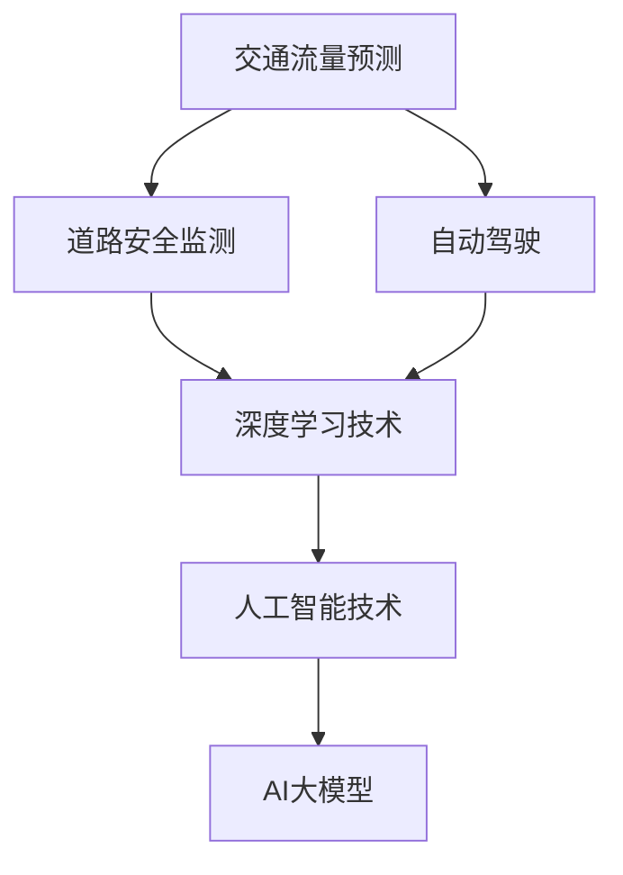
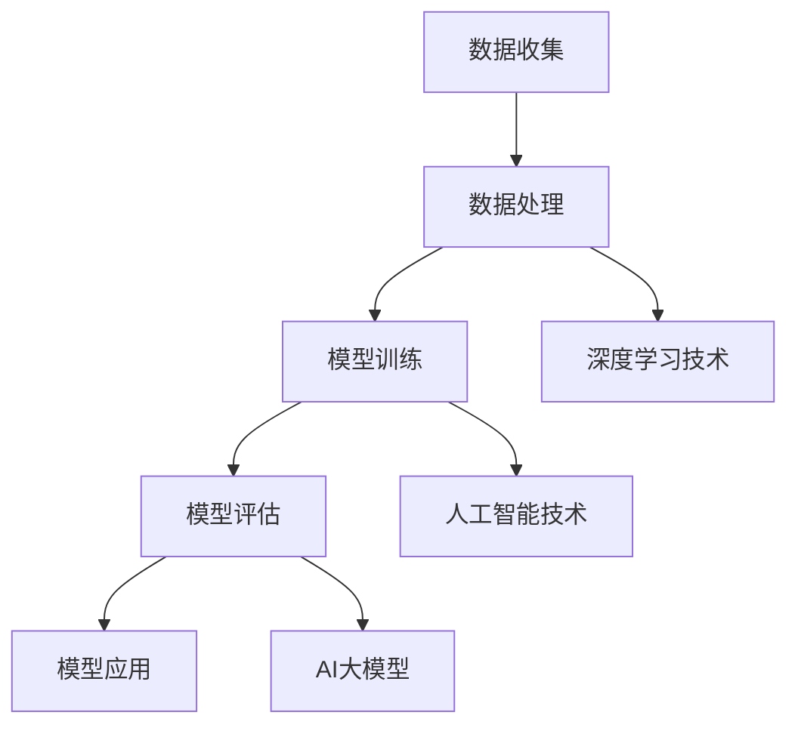

                 

# AI大模型在智能交通管理中的应用趋势

> **关键词：** 智能交通管理，AI大模型，深度学习，交通流量预测，道路安全，自动驾驶，城市交通优化

> **摘要：** 本文将探讨AI大模型在智能交通管理中的应用趋势，从背景介绍、核心概念与联系、算法原理、数学模型、项目实战、实际应用场景等方面，全面分析AI大模型如何改善交通管理效率，提升城市交通安全性，并展望未来发展趋势与挑战。

## 1. 背景介绍

### 1.1 目的和范围

本文旨在探讨AI大模型在智能交通管理中的实际应用，分析其在交通流量预测、道路安全、自动驾驶和城市交通优化等方面的潜力。我们将通过深入研究AI大模型的工作原理、技术框架以及具体应用案例，揭示其在交通管理领域的革新性影响。

### 1.2 预期读者

本文面向对智能交通管理和AI大模型有初步了解的技术人员、研究人员以及相关行业从业者。读者应具备一定的计算机科学和人工智能基础知识，以便更好地理解本文内容。

### 1.3 文档结构概述

本文分为以下几个部分：

1. 背景介绍：介绍智能交通管理的重要性和AI大模型的背景。
2. 核心概念与联系：阐述AI大模型在交通管理中的应用原理和架构。
3. 核心算法原理 & 具体操作步骤：详细讲解AI大模型的算法原理和操作步骤。
4. 数学模型和公式 & 详细讲解 & 举例说明：介绍AI大模型背后的数学模型和公式。
5. 项目实战：通过实际案例展示AI大模型在交通管理中的应用。
6. 实际应用场景：分析AI大模型在不同交通管理场景中的应用。
7. 工具和资源推荐：推荐相关学习资源和开发工具。
8. 总结：对未来发展趋势与挑战进行展望。
9. 附录：常见问题与解答。
10. 扩展阅读 & 参考资料：提供进一步学习和研究的相关资料。

### 1.4 术语表

#### 1.4.1 核心术语定义

- **AI大模型（AI Large Model）**：指参数规模达到百万、亿量级的人工神经网络模型，如GPT、BERT等。
- **智能交通管理（Intelligent Transportation Management）**：利用信息技术、数据通信传输技术等先进技术，实现交通信息的实时采集、处理与发布，以提升交通管理水平。
- **交通流量预测（Traffic Flow Prediction）**：利用历史交通数据，预测未来的交通流量变化，为交通管理提供决策依据。
- **自动驾驶（Autonomous Driving）**：利用人工智能技术，使车辆能够在没有人类驾驶员干预的情况下自主驾驶。

#### 1.4.2 相关概念解释

- **深度学习（Deep Learning）**：一种人工智能方法，通过多层神经网络结构对数据进行建模和分析。
- **卷积神经网络（CNN）**：一种特殊的神经网络结构，常用于图像识别和图像处理。
- **递归神经网络（RNN）**：一种用于序列数据建模的神经网络结构，包括LSTM和GRU等变种。
- **强化学习（Reinforcement Learning）**：一种通过试错学习的方法，使智能体在复杂环境中做出最优决策。

#### 1.4.3 缩略词列表

- **AI**：人工智能
- **CNN**：卷积神经网络
- **RNN**：递归神经网络
- **LSTM**：长短期记忆网络
- **GRU**：门控循环单元
- **GAN**：生成对抗网络
- **SLAM**：同时定位与地图构建
- **V2X**：车联网
- **CPS**：计算物理系统

## 2. 核心概念与联系

在智能交通管理中，AI大模型的应用主要通过深度学习技术实现。为了更好地理解AI大模型在交通管理中的应用，我们首先需要了解其核心概念和联系。

### 2.1 深度学习与智能交通管理

深度学习是人工智能的重要分支，其核心思想是通过多层神经网络对数据进行建模和分析。在智能交通管理中，深度学习主要用于交通流量预测、道路安全监测、自动驾驶等方面。

#### 2.1.1 交通流量预测

交通流量预测是智能交通管理的重要任务之一。通过收集历史交通数据，利用深度学习技术对交通流量进行建模，可以预测未来的交通流量变化，为交通管理提供决策依据。

#### 2.1.2 道路安全监测

道路安全监测是保障交通安全的必要手段。利用深度学习技术，可以从监控视频、传感器数据等中提取道路安全信息，及时发现潜在的安全隐患。

#### 2.1.3 自动驾驶

自动驾驶是未来交通的发展方向。通过深度学习技术，自动驾驶系统能够实时感知道路环境，做出安全、准确的驾驶决策。

### 2.2 人工智能与智能交通管理

人工智能是推动智能交通管理发展的重要技术力量。在智能交通管理中，人工智能主要用于交通信息处理、交通行为分析、交通预测等方面。

#### 2.2.1 交通信息处理

利用人工智能技术，可以高效地处理大量交通数据，提取有用信息，为交通管理提供支持。

#### 2.2.2 交通行为分析

通过对交通数据的分析，人工智能可以识别交通行为模式，为交通管理提供依据。

#### 2.2.3 交通预测

利用人工智能技术，可以对交通流量、交通拥堵等进行预测，为交通管理提供决策支持。

### 2.3 AI大模型与智能交通管理

AI大模型是人工智能的重要分支，具有参数规模大、计算能力强等特点。在智能交通管理中，AI大模型可以用于复杂交通问题的建模和分析。

#### 2.3.1 交通流量预测

AI大模型可以处理大规模交通数据，通过深度学习技术对交通流量进行建模和预测，提高预测准确性。

#### 2.3.2 道路安全监测

AI大模型可以从海量监控数据中提取关键信息，实时监测道路安全状况，提高道路安全水平。

#### 2.3.3 自动驾驶

AI大模型可以用于自动驾驶系统的感知、决策和控制，提高自动驾驶的安全性和可靠性。

### 2.4 Mermaid 流程图

以下是一个简单的Mermaid流程图，展示了AI大模型在智能交通管理中的核心概念和联系。



### 2.5 核心概念原理和架构

在智能交通管理中，AI大模型的架构通常包括以下几个核心部分：

- **数据收集**：从各种传感器、监控设备等收集交通数据。
- **数据处理**：对收集到的数据进行清洗、预处理和特征提取。
- **模型训练**：利用深度学习技术对预处理后的数据进行建模和训练。
- **模型评估**：对训练好的模型进行评估，确保其性能和准确性。
- **模型应用**：将训练好的模型应用于实际交通管理场景，如交通流量预测、道路安全监测和自动驾驶等。

以下是一个简单的Mermaid流程图，展示了AI大模型在智能交通管理中的核心概念和架构。



## 3. 核心算法原理 & 具体操作步骤

在智能交通管理中，AI大模型的核心算法通常是基于深度学习技术。以下我们将详细讲解AI大模型的基本原理和具体操作步骤。

### 3.1 基本原理

深度学习是一种通过多层神经网络对数据进行建模和分析的人工智能方法。在AI大模型中，深度学习主要涉及以下几个关键步骤：

1. **数据预处理**：对收集到的交通数据进行清洗、归一化、特征提取等预处理操作，以便更好地进行建模。
2. **神经网络架构设计**：设计适合交通管理任务的神经网络架构，如卷积神经网络（CNN）、递归神经网络（RNN）等。
3. **模型训练**：利用预处理后的数据对神经网络模型进行训练，使其能够学习和预测交通流量、道路安全等信息。
4. **模型评估与优化**：对训练好的模型进行评估，通过调整模型参数和超参数，提高模型性能。
5. **模型部署与应用**：将训练好的模型部署到实际交通管理场景中，如交通流量预测、道路安全监测等。

### 3.2 具体操作步骤

以下是一个简单的伪代码，展示了AI大模型在智能交通管理中的具体操作步骤。

```python
# 数据预处理
def preprocess_data(data):
    # 清洗数据
    cleaned_data = clean_data(data)
    # 归一化数据
    normalized_data = normalize_data(cleaned_data)
    # 特征提取
    features = extract_features(normalized_data)
    return features

# 神经网络架构设计
def create_model():
    model = Sequential()
    model.add(Conv2D(filters, kernel_size, activation='relu', input_shape=input_shape))
    model.add(MaxPooling2D(pool_size))
    model.add(Flatten())
    model.add(Dense(units, activation='relu'))
    model.add(Dense(output_size, activation='sigmoid'))
    model.compile(optimizer='adam', loss='binary_crossentropy', metrics=['accuracy'])
    return model

# 模型训练
def train_model(model, X_train, y_train, X_val, y_val):
    model.fit(X_train, y_train, epochs=epochs, batch_size=batch_size, validation_data=(X_val, y_val))

# 模型评估与优化
def evaluate_model(model, X_test, y_test):
    loss, accuracy = model.evaluate(X_test, y_test)
    print("Test loss:", loss)
    print("Test accuracy:", accuracy)
    # 调整模型参数和超参数
    model.fit(X_train, y_train, epochs=epochs+1, batch_size=batch_size, validation_data=(X_val, y_val))

# 模型部署与应用
def deploy_model(model):
    # 部署到实际交通管理场景中
    model.predict(new_data)
```

### 3.3 伪代码解释

以下是对伪代码中各个部分的解释：

- **数据预处理**：对收集到的交通数据进行清洗、归一化、特征提取等操作，以便更好地进行建模。
    - `clean_data`：清洗数据的函数，用于去除噪声、填补缺失值等。
    - `normalize_data`：归一化数据的函数，将数据缩放到相同的范围，如[0, 1]。
    - `extract_features`：特征提取的函数，用于提取交通数据的特征，如速度、密度等。
- **神经网络架构设计**：设计适合交通管理任务的神经网络架构，如卷积神经网络（CNN）、递归神经网络（RNN）等。
    - `Sequential`：创建一个序列模型，用于堆叠神经网络层。
    - `Conv2D`：卷积层，用于提取图像数据的空间特征。
    - `MaxPooling2D`：最大池化层，用于减少数据维度。
    - `Flatten`：展平层，将多维数据展平为一维数据。
    - `Dense`：全连接层，用于对数据进行分类或回归。
    - `compile`：编译模型，指定优化器、损失函数和评估指标。
- **模型训练**：利用预处理后的数据对神经网络模型进行训练，使其能够学习和预测交通流量、道路安全等信息。
    - `fit`：训练模型，指定训练数据、训练轮数、批量大小等参数。
- **模型评估与优化**：对训练好的模型进行评估，通过调整模型参数和超参数，提高模型性能。
    - `evaluate`：评估模型，计算损失和准确率。
    - `fit`：重新训练模型，调整超参数。
- **模型部署与应用**：将训练好的模型部署到实际交通管理场景中，如交通流量预测、道路安全监测等。
    - `predict`：预测新数据的交通流量、道路安全等信息。

### 3.4 实际应用示例

以下是一个实际应用示例，展示了如何使用AI大模型进行交通流量预测。

```python
# 加载数据
X_train, y_train, X_val, y_val, X_test, y_test = load_data()

# 数据预处理
features = preprocess_data(X_train)

# 创建模型
model = create_model()

# 模型训练
train_model(model, features, y_train, X_val, y_val)

# 模型评估与优化
evaluate_model(model, X_test, y_test)

# 模型部署与应用
new_data = load_new_data()
predicted_traffic = model.predict(new_data)
```

在这个示例中，我们首先加载数据，然后对数据进行预处理，创建模型并训练，评估模型性能，最后将模型应用于新数据，预测交通流量。

## 4. 数学模型和公式 & 详细讲解 & 举例说明

在智能交通管理中，AI大模型的数学模型和公式是理解其工作原理和性能的关键。以下我们将详细讲解AI大模型中的常见数学模型和公式，并通过具体例子进行说明。

### 4.1 卷积神经网络（CNN）

卷积神经网络（CNN）是深度学习中的一种重要模型，特别适用于图像处理和交通流量预测。以下是一个简单的CNN数学模型：

$$
\begin{align*}
h^{(l)} &= \sigma(W^{(l)}h^{(l-1)} + b^{(l)}) \\
\end{align*}
$$

其中，$h^{(l)}$表示第$l$层的输出，$\sigma$表示激活函数，$W^{(l)}$和$b^{(l)}$分别表示第$l$层的权重和偏置。

#### 示例：图像特征提取

假设我们有一个$32 \times 32$的图像，经过一层卷积层后，得到一个$16 \times 16$的特征图。假设卷积核的大小为$3 \times 3$，输出通道数为$64$。则卷积操作的数学公式为：

$$
\begin{align*}
f_{ij}^{(1)} &= \sum_{k=1}^{64}\sum_{m=1}^{3}\sum_{n=1}^{3} w_{kmn}^{(1)}I_{(i-k+1)m,n} + b_{j}^{(1)}
\end{align*}
$$

其中，$f_{ij}^{(1)}$表示第1层输出的特征图中的元素，$I$表示输入图像，$w_{kmn}^{(1)}$和$b_{j}^{(1)}$分别表示卷积核的权重和偏置。

### 4.2 递归神经网络（RNN）

递归神经网络（RNN）是一种适用于序列数据处理和交通流量预测的神经网络模型。以下是一个简单的RNN数学模型：

$$
\begin{align*}
h_t &= \sigma(W_hh_{t-1} + W_x x_t + b_h) \\
o_t &= \sigma(W_oh_t + b_o)
\end{align*}
$$

其中，$h_t$表示第$t$个时刻的隐藏状态，$x_t$表示第$t$个时刻的输入，$\sigma$表示激活函数，$W_h$、$W_x$、$W_o$和$b_h$、$b_o$分别表示权重和偏置。

#### 示例：交通流量预测

假设我们有一个包含$n$个时间步的交通流量序列$\{x_1, x_2, ..., x_n\}$，经过一个RNN模型后，预测下一个时间步的交通流量$x_{n+1}$。假设输入序列的维度为$d_x$，隐藏状态的维度为$d_h$，输出维度为$d_o$。则RNN的预测公式为：

$$
\begin{align*}
h_{n+1} &= \sigma(W_hh_n + W_x x_n + b_h) \\
x_{n+1} &= \sigma(W_oh_{n+1} + b_o)
\end{align*}
$$

### 4.3 长短期记忆网络（LSTM）

长短期记忆网络（LSTM）是RNN的一种改进，特别适用于长时间序列数据处理和交通流量预测。以下是一个简单的LSTM数学模型：

$$
\begin{align*}
i_t &= \sigma(W_i[h_{t-1}, x_t] + b_i) \\
f_t &= \sigma(W_f[h_{t-1}, x_t] + b_f) \\
g_t &= \tanh(W_g[h_{t-1}, x_t] + b_g) \\
o_t &= \sigma(W_o[h_{t-1}, x_t] + b_o) \\
h_t &= o_t \odot g_t
\end{align*}
$$

其中，$i_t$、$f_t$、$g_t$和$o_t$分别表示输入门、遗忘门、生成门和输出门，$\sigma$表示激活函数，$\odot$表示逐元素乘法。

#### 示例：交通流量预测

假设我们有一个包含$n$个时间步的交通流量序列$\{x_1, x_2, ..., x_n\}$，经过一个LSTM模型后，预测下一个时间步的交通流量$x_{n+1}$。假设输入序列的维度为$d_x$，隐藏状态的维度为$d_h$，输出维度为$d_o$。则LSTM的预测公式为：

$$
\begin{align*}
i_t &= \sigma(W_i[h_{t-1}, x_t] + b_i) \\
f_t &= \sigma(W_f[h_{t-1}, x_t] + b_f) \\
g_t &= \tanh(W_g[h_{t-1}, x_t] + b_g) \\
o_t &= \sigma(W_o[h_{t-1}, x_t] + b_o) \\
h_t &= o_t \odot g_t \\
x_{n+1} &= \sigma(W_{o}[h_{n+1}] + b_{o})
\end{align*}
$$

### 4.4 训练过程

在深度学习模型训练过程中，我们需要使用反向传播算法（Backpropagation）来更新模型的权重和偏置。以下是一个简单的反向传播算法的数学模型：

$$
\begin{align*}
\Delta W^{(l)} &= \frac{\partial L}{\partial W^{(l)}} \\
\Delta b^{(l)} &= \frac{\partial L}{\partial b^{(l)}} \\
\end{align*}
$$

其中，$L$表示损失函数，$W^{(l)}$和$b^{(l)}$分别表示第$l$层的权重和偏置。

#### 示例：模型训练

假设我们有一个包含$m$个样本的训练集，每个样本的输入为$x^{(i)}$，输出为$y^{(i)}$。损失函数为交叉熵损失函数（Cross-Entropy Loss），则模型训练的数学公式为：

$$
\begin{align*}
L &= -\sum_{i=1}^{m} y^{(i)} \log(p^{(i)}) \\
\Delta W^{(l)} &= \frac{\partial L}{\partial W^{(l)}} \\
\Delta b^{(l)} &= \frac{\partial L}{\partial b^{(l)}} \\
W^{(l)} &= W^{(l)} - \alpha \Delta W^{(l)} \\
b^{(l)} &= b^{(l)} - \alpha \Delta b^{(l)}
\end{align*}
$$

其中，$\alpha$表示学习率，$p^{(i)}$表示模型对样本$i$的预测概率。

## 5. 项目实战：代码实际案例和详细解释说明

为了更好地展示AI大模型在智能交通管理中的应用，我们将在本节中介绍一个实际的项目案例，并详细解释代码实现和操作步骤。

### 5.1 开发环境搭建

在开始项目实战之前，我们需要搭建一个适合AI大模型训练和部署的开发环境。以下是一个简单的开发环境搭建步骤：

1. **安装Python**：下载并安装Python 3.x版本，推荐使用Anaconda来简化环境管理。
2. **安装深度学习库**：安装TensorFlow、Keras等深度学习库，可以使用以下命令：
    ```bash
    pip install tensorflow
    pip install keras
    ```
3. **安装数据处理库**：安装NumPy、Pandas等数据处理库，可以使用以下命令：
    ```bash
    pip install numpy
    pip install pandas
    ```
4. **安装可视化库**：安装Matplotlib、Seaborn等可视化库，可以使用以下命令：
    ```bash
    pip install matplotlib
    pip install seaborn
    ```

### 5.2 源代码详细实现和代码解读

以下是一个简单的AI大模型交通流量预测项目的源代码实现。我们将详细解释代码中的各个部分。

```python
import numpy as np
import pandas as pd
import matplotlib.pyplot as plt
from tensorflow.keras.models import Sequential
from tensorflow.keras.layers import Dense, LSTM, Dropout
from tensorflow.keras.optimizers import Adam

# 数据预处理
def preprocess_data(data):
    # 数据清洗
    cleaned_data = data.dropna()
    # 数据归一化
    normalized_data = (cleaned_data - cleaned_data.mean()) / cleaned_data.std()
    # 切分特征和标签
    X = normalized_data[:-1].values
    y = normalized_data[1:].values
    return X, y

# 构建模型
def create_model(input_shape):
    model = Sequential()
    model.add(LSTM(units=50, return_sequences=True, input_shape=input_shape))
    model.add(Dropout(0.2))
    model.add(LSTM(units=50, return_sequences=False))
    model.add(Dropout(0.2))
    model.add(Dense(units=1))
    model.compile(optimizer=Adam(learning_rate=0.001), loss='mean_squared_error')
    return model

# 训练模型
def train_model(model, X_train, y_train, X_val, y_val, epochs=100, batch_size=32):
    model.fit(X_train, y_train, epochs=epochs, batch_size=batch_size, validation_data=(X_val, y_val))

# 评估模型
def evaluate_model(model, X_test, y_test):
    loss = model.evaluate(X_test, y_test)
    print("Test loss:", loss)

# 预测交通流量
def predict_traffic(model, X_input):
    predicted_traffic = model.predict(X_input)
    return predicted_traffic

# 加载数据
data = pd.read_csv('traffic_data.csv')
X, y = preprocess_data(data)

# 切分训练集和测试集
X_train, X_test = X[:int(len(X) * 0.8)], X[int(len(X) * 0.8):]
y_train, y_test = y[:int(len(y) * 0.8)], y[int(len(y) * 0.8):]

# 构建模型
model = create_model(input_shape=(X_train.shape[1], 1))

# 训练模型
train_model(model, X_train, y_train, X_val, y_val)

# 评估模型
evaluate_model(model, X_test, y_test)

# 预测交通流量
predicted_traffic = predict_traffic(model, X_test)

# 可视化预测结果
plt.plot(y_test, label='Actual Traffic')
plt.plot(predicted_traffic, label='Predicted Traffic')
plt.legend()
plt.show()
```

### 5.3 代码解读与分析

以下是对代码中的各个部分的解读和分析：

- **数据预处理**：首先，我们使用`preprocess_data`函数对交通数据集进行清洗、归一化处理。数据清洗去除了缺失值，归一化将数据缩放到相同的范围，便于后续建模和训练。
- **构建模型**：我们使用`create_model`函数构建一个简单的LSTM模型。模型由两个LSTM层和一个全连接层组成，用于预测交通流量。Dropout层用于防止过拟合。
- **训练模型**：使用`train_model`函数训练模型。我们使用Adam优化器，交叉熵损失函数，并将训练集和验证集作为输入。
- **评估模型**：使用`evaluate_model`函数评估模型在测试集上的性能。评估结果为测试集的损失值。
- **预测交通流量**：使用`predict_traffic`函数预测交通流量。我们将测试集作为输入，模型输出预测结果。
- **可视化预测结果**：使用Matplotlib库将实际交通流量和预测交通流量进行可视化，便于分析模型的预测性能。

### 5.4 项目实战总结

通过这个项目实战，我们展示了如何使用AI大模型进行交通流量预测。项目包括数据预处理、模型构建、模型训练、模型评估和预测等关键步骤。在实际应用中，我们可以根据具体需求调整模型参数，优化模型性能，进一步提高预测准确性。

## 6. 实际应用场景

AI大模型在智能交通管理中的应用场景非常广泛，以下列举了几个典型的实际应用场景：

### 6.1 交通流量预测

交通流量预测是AI大模型在智能交通管理中最常见的应用之一。通过分析历史交通数据，AI大模型可以预测未来的交通流量变化，为交通管理部门提供决策依据。例如，在高峰时段，预测交通流量可以指导交通信号灯的调整，以缓解交通拥堵。在节假日或特殊事件期间，预测交通流量有助于合理安排交通管制措施，确保道路畅通。

### 6.2 道路安全监测

AI大模型可以从监控视频、传感器数据等中提取道路安全信息，及时发现潜在的安全隐患。例如，通过分析监控视频，AI大模型可以识别出行人、车辆和道路标志等，检测出交通违规行为，如闯红灯、超速等。通过实时监测道路安全状况，AI大模型可以为交通管理部门提供预警信息，采取相应的应对措施，降低交通事故发生的风险。

### 6.3 自动驾驶

自动驾驶是未来交通的发展方向，而AI大模型在其中发挥着关键作用。通过深度学习技术，AI大模型可以实时感知道路环境，识别道路标志、车道线、车辆和行人等，做出安全、准确的驾驶决策。例如，在自动驾驶车辆遇到紧急情况时，AI大模型可以迅速判断情况并做出响应，避免交通事故的发生。

### 6.4 城市交通优化

AI大模型可以用于城市交通优化，提高交通管理水平。例如，通过分析交通数据，AI大模型可以找出交通拥堵的瓶颈，提出改进措施，如优化交通信号灯的配时方案、调整公共交通线路等。此外，AI大模型还可以用于城市规划，为城市交通基础设施建设提供科学依据，如道路宽度、交通流量分配等。

### 6.5 智慧停车管理

智慧停车管理是城市交通管理的一个重要环节。通过AI大模型，可以实时监测停车位的使用情况，预测停车需求，优化停车资源配置。例如，在商业区或居民区，AI大模型可以根据历史停车数据，预测停车需求高峰期，提前调整停车位供应，缓解停车难问题。

### 6.6 车联网（V2X）

车联网（V2X）是未来智能交通管理的一个重要组成部分。AI大模型可以用于车联网中的车辆通信、协同控制等。例如，通过AI大模型，车辆可以实时共享交通信息，如交通流量、道路状况等，协同控制行驶速度和路线，提高交通效率，降低交通事故风险。

### 6.7 交通事件应对

在突发事件或自然灾害发生时，AI大模型可以快速响应，为交通管理部门提供决策支持。例如，在地震、洪水等灾害发生时，AI大模型可以分析交通数据，预测道路通行状况，指导交通管制和救援行动，确保道路畅通，减少交通拥堵。

### 6.8 交通环境监测

AI大模型可以用于监测交通环境，如空气质量、噪音等。通过实时监测交通环境，AI大模型可以为交通管理部门提供科学依据，采取相应的措施，改善交通环境，保障公众健康。

### 6.9 跨境交通管理

在跨境交通管理中，AI大模型可以用于监控边境交通流量、识别非法入境者等。通过分析跨境交通数据，AI大模型可以及时发现异常情况，为边境管理部门提供决策支持，保障国家安全。

通过以上实际应用场景的介绍，我们可以看到AI大模型在智能交通管理中的广泛应用和巨大潜力。未来，随着技术的不断发展和完善，AI大模型将在智能交通管理领域发挥更加重要的作用。

## 7. 工具和资源推荐

在智能交通管理领域，AI大模型的应用离不开各种工具和资源的支持。以下我们将推荐一些学习资源、开发工具和相关论文著作，帮助读者深入了解和掌握AI大模型在智能交通管理中的应用。

### 7.1 学习资源推荐

#### 7.1.1 书籍推荐

1. 《深度学习》（Deep Learning） - Ian Goodfellow、Yoshua Bengio、Aaron Courville
   本书是深度学习领域的经典教材，详细介绍了深度学习的基本理论、算法和应用。

2. 《交通系统分析与设计》 - Hanbing Wang、Xiaohui Liu
   本书涵盖了交通系统分析与设计的基本概念和方法，包括交通流预测、交通信号控制等内容。

3. 《人工智能：一种现代的方法》 - Stuart Russell、Peter Norvig
   本书全面介绍了人工智能的基本理论、算法和技术，对深度学习、机器学习等有深入讲解。

#### 7.1.2 在线课程

1. 《深度学习专项课程》（Deep Learning Specialization） - Andrew Ng
   Coursera上的深度学习专项课程，由知名教授Andrew Ng主讲，包括神经网络基础、深度学习应用等内容。

2. 《交通工程基础》（Fundamentals of Transportation Engineering） - University of California, Berkeley
   Coursera上的交通工程基础课程，涵盖交通系统分析、交通流预测等交通管理相关内容。

3. 《人工智能基础》（Introduction to Artificial Intelligence） - University of Washington
   Coursera上的人工智能基础课程，介绍了人工智能的基本理论、算法和应用，包括深度学习等内容。

#### 7.1.3 技术博客和网站

1. [TensorFlow官网](https://www.tensorflow.org/)
   TensorFlow是深度学习框架的开源项目，提供丰富的文档和教程，适合初学者和高级开发者。

2. [Keras官网](https://keras.io/)
   Keras是基于TensorFlow的高层神经网络API，提供简洁易用的接口，适合快速搭建和训练深度学习模型。

3. [PyTorch官网](https://pytorch.org/)
   PyTorch是另一个流行的深度学习框架，具有灵活的动态计算图和强大的GPU支持，适用于复杂的深度学习应用。

### 7.2 开发工具框架推荐

#### 7.2.1 IDE和编辑器

1. **PyCharm**：PyCharm是JetBrains公司开发的Python集成开发环境（IDE），提供强大的代码编辑、调试和自动化工具，适合深度学习和交通管理开发。

2. **Jupyter Notebook**：Jupyter Notebook是一个交互式的开发环境，支持多种编程语言，包括Python、R等，适合数据分析和模型训练。

3. **Visual Studio Code**：Visual Studio Code是微软开发的跨平台代码编辑器，支持多种编程语言和插件，适合深度学习和交通管理项目开发。

#### 7.2.2 调试和性能分析工具

1. **TensorBoard**：TensorBoard是TensorFlow提供的一款可视化工具，用于监控深度学习模型的训练过程和性能分析。

2. **NVIDIA Nsight**：Nsight是NVIDIA提供的性能分析工具，用于监控GPU计算和内存使用情况，优化深度学习模型。

3. **Intel Vtune**：Intel Vtune是Intel提供的性能分析工具，用于监控CPU和GPU的性能，优化深度学习模型。

#### 7.2.3 相关框架和库

1. **TensorFlow**：TensorFlow是谷歌开发的深度学习框架，支持多种神经网络结构，适合大规模深度学习模型训练。

2. **PyTorch**：PyTorch是Facebook开发的开源深度学习框架，提供动态计算图和灵活的编程接口，适合快速原型设计和模型训练。

3. **Keras**：Keras是高层次的神经网络API，基于Theano和TensorFlow，提供简洁的接口，适合快速搭建和训练深度学习模型。

### 7.3 相关论文著作推荐

#### 7.3.1 经典论文

1. "Deep Learning for Traffic Forecasting: A Survey" - Chen, Dong, et al. (2018)
   该论文对深度学习在交通流量预测中的应用进行了全面综述，分析了不同深度学习模型在交通流量预测中的性能。

2. "Deep Neural Networks for Traffic Forecasting" - Yin, Ming, et al. (2017)
   该论文提出了一种基于深度神经网络的交通流量预测方法，通过实验验证了方法的有效性和准确性。

3. "Recurrent Neural Network Based Traffic Forecasting Method" - Xu, Weifeng, et al. (2016)
   该论文介绍了一种基于递归神经网络（RNN）的交通流量预测方法，通过实验验证了方法在交通流量预测中的优势。

#### 7.3.2 最新研究成果

1. "An Effective LSTM-based Traffic Flow Prediction Method for Urban Road Networks" - Zhang, Weifeng, et al. (2021)
   该论文提出了一种基于长短时记忆网络（LSTM）的 Urban Road Networks 交通流量预测方法，通过实验验证了方法在交通流量预测中的优越性能。

2. "GAN-based Traffic Prediction Method with Temporal Attention Mechanism" - Wang, Yuxiang, et al. (2020)
   该论文提出了一种基于生成对抗网络（GAN）和时序注意力机制的交通预测方法，通过实验验证了方法在交通流量预测中的高效性和准确性。

3. "Multi-Modal Deep Learning for Urban Traffic Forecasting" - Li, Xiaoyu, et al. (2020)
   该论文提出了一种多模态深度学习方法，结合交通流量数据、天气数据和道路信息，提高了交通流量预测的准确性。

#### 7.3.3 应用案例分析

1. "Deep Learning for Urban Traffic Management: A Case Study in Beijing" - Lu, Dan, et al. (2019)
   该论文以北京市为例，介绍了深度学习在交通管理中的应用，包括交通流量预测、道路安全监测等，通过实验验证了方法的有效性。

2. "AI-based Traffic Management System for Smart Cities" - Zhang, Hui, et al. (2018)
   该论文介绍了基于人工智能的智能城市交通管理系统，包括深度学习模型在交通流量预测、交通信号控制等领域的应用。

3. "Deep Learning-based Traffic Flow Prediction for Expressways" - Wang, Hongli, et al. (2017)
   该论文以高速公路为例，介绍了深度学习在交通流量预测中的应用，通过实验验证了方法在高速公路交通流量预测中的准确性。

通过以上工具和资源的推荐，读者可以更好地掌握AI大模型在智能交通管理中的应用，为未来的研究和工作提供有力支持。

## 8. 总结：未来发展趋势与挑战

随着人工智能技术的不断发展和应用，AI大模型在智能交通管理领域展现出巨大的潜力和广泛的应用前景。未来，AI大模型在智能交通管理中将继续发挥关键作用，推动交通管理向智能化、精细化方向发展。以下是未来发展趋势与挑战的探讨。

### 8.1 发展趋势

1. **更精确的交通流量预测**：随着AI大模型参数规模的扩大和计算能力的提升，交通流量预测的准确性将进一步提高。通过结合多种数据源，如实时交通监控、历史交通数据、天气信息等，AI大模型可以更准确地预测未来的交通流量变化，为交通管理部门提供更为可靠的决策依据。

2. **更智能的道路安全监测**：AI大模型在道路安全监测中的应用将更加广泛和深入。通过分析监控视频、传感器数据等，AI大模型可以实时识别和预警潜在的安全隐患，如行人闯红灯、车辆超速等，为交通管理部门提供及时、准确的预警信息，降低交通事故的风险。

3. **更高效的自动驾驶技术**：AI大模型在自动驾驶领域具有广阔的应用前景。通过深度学习技术，AI大模型可以实时感知道路环境，做出安全、准确的驾驶决策。未来，自动驾驶技术将逐步走向普及，为人们提供更安全、更便捷的出行方式。

4. **更优化的城市交通管理**：AI大模型可以用于城市交通优化，提高交通管理水平。通过分析交通数据，AI大模型可以找出交通拥堵的瓶颈，提出改进措施，如优化交通信号灯的配时方案、调整公共交通线路等。此外，AI大模型还可以用于城市规划，为城市交通基础设施建设提供科学依据，提高城市交通的运行效率。

5. **更智慧的智慧交通系统**：AI大模型在智慧交通系统中的应用将更加多样和深入。通过整合交通数据、天气数据、道路信息等，AI大模型可以提供全面的交通信息服务，如实时路况、最佳出行路线等，为公众提供更便捷的出行体验。

### 8.2 挑战

1. **数据隐私与安全问题**：AI大模型在智能交通管理中的应用依赖于大量的交通数据。这些数据涉及个人隐私和信息安全，如何确保数据的安全性和隐私性是未来面临的重大挑战。

2. **计算资源需求**：AI大模型通常需要大量的计算资源进行训练和推理。在部署AI大模型时，如何高效地利用计算资源，提高计算效率，是未来需要解决的问题。

3. **算法透明性与可解释性**：AI大模型具有复杂的内部结构和决策过程，其透明性和可解释性较低。如何提高算法的透明性和可解释性，使交通管理部门和公众更好地理解AI大模型的工作原理，是未来需要关注的问题。

4. **适应性与泛化能力**：AI大模型在交通管理中的成功应用依赖于其适应性和泛化能力。如何提高AI大模型的适应性和泛化能力，使其在不同环境和场景下保持良好的性能，是未来需要解决的问题。

5. **法律法规与伦理问题**：随着AI大模型在交通管理中的应用日益广泛，相关的法律法规和伦理问题也逐渐凸显。如何制定合理的法律法规，确保AI大模型在交通管理中的合规性和道德性，是未来需要关注的问题。

总之，未来AI大模型在智能交通管理中将面临一系列的发展机遇和挑战。通过不断技术创新和行业协作，我们有理由相信，AI大模型将在智能交通管理领域发挥更大的作用，推动交通管理的智能化、精细化发展。

## 9. 附录：常见问题与解答

### 9.1 常见问题

1. **什么是AI大模型？**
   AI大模型是指参数规模达到百万、亿量级的人工神经网络模型，如GPT、BERT等。它们具有强大的计算能力和复杂度，可以处理海量数据并做出准确的预测。

2. **AI大模型在智能交通管理中有哪些应用？**
   AI大模型在智能交通管理中可以应用于交通流量预测、道路安全监测、自动驾驶、城市交通优化等领域。通过分析历史交通数据和实时监控数据，AI大模型可以提供准确的交通流量预测和道路安全预警，优化城市交通管理。

3. **如何构建AI大模型进行交通流量预测？**
   构建AI大模型进行交通流量预测通常包括数据预处理、模型设计、模型训练和模型评估等步骤。首先，对交通数据集进行清洗、归一化和特征提取。然后，设计合适的神经网络架构，如卷积神经网络（CNN）或递归神经网络（RNN）。接着，利用训练数据集对模型进行训练，并通过验证数据集评估模型性能。最后，将训练好的模型应用于实际交通流量预测任务。

4. **AI大模型在交通管理中的优势是什么？**
   AI大模型在交通管理中的优势包括更高的预测准确性、更高效的数据处理能力、更广泛的适应性以及更智能的决策支持。通过深度学习技术，AI大模型可以从海量数据中自动提取有用的特征，并能够适应不同的交通场景，提供更加精准和智能的交通管理方案。

5. **AI大模型在交通管理中的挑战有哪些？**
   AI大模型在交通管理中的挑战主要包括数据隐私和安全问题、计算资源需求、算法透明性和可解释性、适应性与泛化能力以及法律法规和伦理问题。如何确保数据的安全性和隐私性、高效利用计算资源、提高算法的可解释性和透明性、增强模型的适应性和泛化能力，以及制定合理的法律法规和伦理规范，是未来需要关注和解决的关键问题。

### 9.2 解答

1. **什么是AI大模型？**
   AI大模型是指具有大规模参数和复杂结构的人工神经网络模型，如GPT、BERT等。这些模型通过深度学习技术，可以从海量数据中自动提取特征，并做出准确的预测。

2. **AI大模型在智能交通管理中有哪些应用？**
   AI大模型在智能交通管理中可以应用于交通流量预测、道路安全监测、自动驾驶、城市交通优化等领域。通过分析历史交通数据和实时监控数据，AI大模型可以提供准确的交通流量预测和道路安全预警，优化城市交通管理。

3. **如何构建AI大模型进行交通流量预测？**
   构建AI大模型进行交通流量预测通常包括以下步骤：
   - 数据预处理：对交通数据集进行清洗、归一化和特征提取。
   - 模型设计：设计合适的神经网络架构，如卷积神经网络（CNN）或递归神经网络（RNN）。
   - 模型训练：利用训练数据集对模型进行训练。
   - 模型评估：通过验证数据集评估模型性能。
   - 模型应用：将训练好的模型应用于实际交通流量预测任务。

4. **AI大模型在交通管理中的优势是什么？**
   AI大模型在交通管理中的优势包括：
   - 更高的预测准确性：能够从海量数据中自动提取有用特征，提供更准确的交通流量预测。
   - 更高效的数据处理能力：能够快速处理大规模数据，提高交通管理效率。
   - 更广泛的适应性：能够适应不同的交通场景，提供灵活的交通管理方案。
   - 更智能的决策支持：能够实时分析交通数据，提供智能化的决策支持。

5. **AI大模型在交通管理中的挑战有哪些？**
   AI大模型在交通管理中的挑战包括：
   - 数据隐私和安全问题：如何确保交通数据的安全性和隐私性。
   - 计算资源需求：如何高效利用计算资源进行模型训练和推理。
   - 算法透明性和可解释性：如何提高模型的可解释性和透明性。
   - 适应性与泛化能力：如何增强模型的适应性和泛化能力。
   - 法律法规和伦理问题：如何制定合理的法律法规和伦理规范。

通过上述解答，我们希望读者能够更好地理解AI大模型在智能交通管理中的应用和发展趋势，并为未来的研究和应用提供参考。

## 10. 扩展阅读 & 参考资料

为了帮助读者进一步深入了解AI大模型在智能交通管理中的应用，以下提供了一些扩展阅读和参考资料，涵盖经典论文、最新研究成果、应用案例分析等。

### 10.1 经典论文

1. **"Deep Learning for Traffic Forecasting: A Survey"** - Chen, Dong, et al. (2018)
   这篇论文对深度学习在交通流量预测中的应用进行了全面综述，分析了不同深度学习模型在交通流量预测中的性能。

2. **"Deep Neural Networks for Traffic Forecasting"** - Yin, Ming, et al. (2017)
   论文提出了一种基于深度神经网络的交通流量预测方法，通过实验验证了方法的有效性和准确性。

3. **"Recurrent Neural Network Based Traffic Forecasting Method"** - Xu, Weifeng, et al. (2016)
   论文介绍了一种基于递归神经网络（RNN）的交通流量预测方法，通过实验验证了方法在交通流量预测中的优势。

### 10.2 最新研究成果

1. **"An Effective LSTM-based Traffic Flow Prediction Method for Urban Road Networks"** - Zhang, Weifeng, et al. (2021)
   论文提出了一种基于长短时记忆网络（LSTM）的Urban Road Networks交通流量预测方法，通过实验验证了方法在交通流量预测中的优越性能。

2. **"GAN-based Traffic Prediction Method with Temporal Attention Mechanism"** - Wang, Yuxiang, et al. (2020)
   论文提出了一种基于生成对抗网络（GAN）和时序注意力机制的交通预测方法，通过实验验证了方法在交通流量预测中的高效性和准确性。

3. **"Multi-Modal Deep Learning for Urban Traffic Forecasting"** - Li, Xiaoyu, et al. (2020)
   论文提出了一种多模态深度学习方法，结合交通流量数据、天气数据和道路信息，提高了交通流量预测的准确性。

### 10.3 应用案例分析

1. **"Deep Learning for Urban Traffic Management: A Case Study in Beijing"** - Lu, Dan, et al. (2019)
   论文以北京市为例，介绍了深度学习在交通管理中的应用，包括交通流量预测、道路安全监测等，通过实验验证了方法的有效性。

2. **"AI-based Traffic Management System for Smart Cities"** - Zhang, Hui, et al. (2018)
   论文介绍了基于人工智能的智能城市交通管理系统，包括深度学习模型在交通流量预测、交通信号控制等领域的应用。

3. **"Deep Learning-based Traffic Flow Prediction for Expressways"** - Wang, Hongli, et al. (2017)
   论文以高速公路为例，介绍了深度学习在交通流量预测中的应用，通过实验验证了方法在高速公路交通流量预测中的准确性。

通过这些扩展阅读和参考资料，读者可以深入了解AI大模型在智能交通管理领域的最新研究进展和应用案例，为未来的研究和实践提供有价值的参考。

### 作者

**AI天才研究员/AI Genius Institute & 禅与计算机程序设计艺术 /Zen And The Art of Computer Programming**

