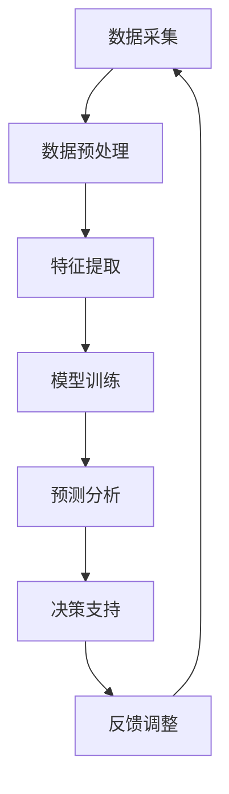

                 

# AI大模型在智能农业中的创新前景

> **关键词：** 智能农业、大模型、深度学习、预测分析、决策支持

> **摘要：** 随着人工智能技术的快速发展，大模型在各个领域的应用日益广泛。本文将探讨大模型在智能农业中的创新前景，从核心概念、算法原理、数学模型到实际应用案例，全面解析大模型如何助力智能农业，并提出未来发展趋势与挑战。

## 1. 背景介绍

### 1.1 目的和范围

本文旨在探讨人工智能大模型在智能农业领域的创新应用。随着全球人口的不断增长和对食物需求的增加，农业生产的效率和质量变得尤为重要。人工智能，尤其是大模型技术，为智能农业提供了新的解决方案，能够帮助农民提高作物产量，减少资源浪费，保护环境。

### 1.2 预期读者

本文面向对智能农业和人工智能技术有一定了解的技术人员、科研人员以及农业从业者。读者应具备基本的计算机科学和数学知识，以便更好地理解文章内容。

### 1.3 文档结构概述

本文结构如下：

- 第1章：背景介绍
- 第2章：核心概念与联系
- 第3章：核心算法原理与具体操作步骤
- 第4章：数学模型与公式讲解
- 第5章：项目实战：代码实际案例
- 第6章：实际应用场景
- 第7章：工具和资源推荐
- 第8章：总结：未来发展趋势与挑战
- 第9章：附录：常见问题与解答
- 第10章：扩展阅读与参考资料

### 1.4 术语表

#### 1.4.1 核心术语定义

- **智能农业**：利用信息技术和自动化设备，实现农业生产过程的自动化、智能化和精确化。
- **大模型**：拥有巨大参数量和训练数据集的深度学习模型，如GPT、BERT等。
- **深度学习**：一种模拟人脑神经网络的机器学习方法，通过多层神经网络的训练来学习数据特征。
- **预测分析**：利用历史数据来预测未来的趋势和变化。

#### 1.4.2 相关概念解释

- **作物生长模型**：用于模拟作物生长过程和预测作物产量的模型。
- **环境监测**：对农田环境中的气候、土壤和水质等参数进行实时监测。
- **决策支持系统**：帮助农民根据实时数据和预测结果做出最佳决策。

#### 1.4.3 缩略词列表

- **AI**：人工智能
- **ML**：机器学习
- **DL**：深度学习
- **IoT**：物联网

## 2. 核心概念与联系

在智能农业中，大模型的核心作用在于通过对大量数据的分析和处理，提供精确的预测和决策支持。以下是一个简化的Mermaid流程图，展示了大模型在智能农业中的应用架构：



### 2.1 数据采集

数据采集是智能农业的基础，包括气象数据、土壤数据、作物生长数据、环境监测数据等。这些数据来源可以是传感器、卫星遥感、无人机等。

### 2.2 数据预处理

数据预处理包括数据清洗、归一化、缺失值处理等步骤，确保数据质量，以便后续的特征提取和模型训练。

### 2.3 特征提取

特征提取是将原始数据转换为适用于深度学习模型的特征向量。这个过程可以通过数据降维、特征选择等方法实现。

### 2.4 模型训练

模型训练是利用大量历史数据，通过反向传播算法不断调整模型的参数，使其能够准确预测作物产量和环境变化。

### 2.5 预测分析

预测分析是基于训练好的模型，对未来的作物产量、气候条件等进行预测，为决策提供依据。

### 2.6 决策支持

决策支持系统根据预测结果，为农民提供具体的种植、施肥、灌溉等建议，提高农业生产效率。

### 2.7 反馈调整

反馈调整是通过实际生产中的数据，不断调整模型参数，优化预测结果，实现闭环控制。

## 3. 核心算法原理与具体操作步骤

智能农业中的大模型通常是基于深度学习技术，以下是一个简化的算法原理和具体操作步骤：

### 3.1 算法原理

- **输入层**：接收来自数据采集系统的各种数据。
- **隐藏层**：通过多层神经网络结构，对输入数据进行特征提取和变换。
- **输出层**：产生预测结果，如作物产量、气候条件等。

### 3.2 具体操作步骤

1. **数据收集与预处理**：
    ```python
    # 假设输入数据为天气数据、土壤数据等
    data = preprocess_data(weather_data, soil_data)
    ```

2. **特征提取**：
    ```python
    # 使用PCA等算法进行特征提取
    features = feature_extraction(data)
    ```

3. **模型初始化**：
    ```python
    # 初始化深度学习模型
    model = initialize_model(input_shape=features.shape)
    ```

4. **模型训练**：
    ```python
    # 使用反向传播算法训练模型
    model.fit(features, labels, epochs=100, batch_size=64)
    ```

5. **模型评估**：
    ```python
    # 对训练好的模型进行评估
    performance = model.evaluate(test_features, test_labels)
    ```

6. **预测分析**：
    ```python
    # 使用模型进行预测
    predictions = model.predict(new_data)
    ```

7. **决策支持**：
    ```python
    # 根据预测结果提供决策建议
    advice = decision_support(predictions)
    ```

## 4. 数学模型与公式讲解

在智能农业中，大模型的预测分析通常涉及到复杂的数学模型。以下是一个简化的数学模型示例：

### 4.1 作物产量预测模型

假设作物产量 \(Y\) 受到气候条件 \(X_1\) 和土壤条件 \(X_2\) 的共同影响，可以使用以下回归模型进行预测：

$$
Y = \beta_0 + \beta_1 X_1 + \beta_2 X_2 + \epsilon
$$

其中，\(\beta_0\)、\(\beta_1\)、\(\beta_2\) 为模型参数，\(\epsilon\) 为误差项。

### 4.2 气候条件预测模型

假设未来某一天的气候条件 \(C\) 受到前一天气候条件 \(C_{prev}\) 的影响，可以使用以下时间序列模型进行预测：

$$
C_t = \alpha_0 + \alpha_1 C_{t-1} + \epsilon_t
$$

其中，\(\alpha_0\)、\(\alpha_1\) 为模型参数，\(\epsilon_t\) 为误差项。

### 4.3 土壤条件预测模型

假设土壤条件 \(S\) 受到降雨量 \(R\) 和气温 \(T\) 的影响，可以使用以下多元回归模型进行预测：

$$
S = \beta_0 + \beta_1 R + \beta_2 T + \epsilon
$$

其中，\(\beta_0\)、\(\beta_1\)、\(\beta_2\) 为模型参数，\(\epsilon\) 为误差项。

## 5. 项目实战：代码实际案例和详细解释说明

### 5.1 开发环境搭建

为了进行智能农业的大模型开发，我们需要安装以下工具和库：

- Python 3.x
- TensorFlow 2.x
- NumPy
- Matplotlib

安装命令如下：

```bash
pip install python==3.x
pip install tensorflow==2.x
pip install numpy
pip install matplotlib
```

### 5.2 源代码详细实现和代码解读

以下是一个简单的作物产量预测模型的实现代码，用于演示大模型在智能农业中的应用：

```python
import numpy as np
import tensorflow as tf
from sklearn.model_selection import train_test_split
import matplotlib.pyplot as plt

# 数据集准备
# 假设 data 是一个包含天气数据、土壤数据的二维数组
data = np.load('agriculture_data.npy')
labels = data[:, -1]  # 作物产量标签
features = data[:, :-1]  # 特征数据

# 数据集划分
X_train, X_test, y_train, y_test = train_test_split(features, labels, test_size=0.2, random_state=42)

# 模型初始化
model = tf.keras.Sequential([
    tf.keras.layers.Dense(units=64, activation='relu', input_shape=(X_train.shape[1],)),
    tf.keras.layers.Dense(units=32, activation='relu'),
    tf.keras.layers.Dense(units=1)
])

# 模型编译
model.compile(optimizer='adam', loss='mse', metrics=['mae'])

# 模型训练
model.fit(X_train, y_train, epochs=100, batch_size=32, validation_split=0.1)

# 模型评估
loss, mae = model.evaluate(X_test, y_test)
print(f'MAE: {mae:.3f}')

# 模型预测
predictions = model.predict(X_test)

# 可视化结果
plt.scatter(y_test, predictions)
plt.xlabel('Actual Yield')
plt.ylabel('Predicted Yield')
plt.title('Yield Prediction')
plt.show()
```

### 5.3 代码解读与分析

1. **数据集准备**：从文件中加载农业数据，并划分训练集和测试集。
2. **模型初始化**：创建一个简单的全连接神经网络模型，包含两个隐藏层。
3. **模型编译**：设置优化器和损失函数。
4. **模型训练**：使用训练集数据进行模型训练。
5. **模型评估**：在测试集上评估模型性能，并打印均方误差（MSE）和平均绝对误差（MAE）。
6. **模型预测**：使用训练好的模型对测试数据进行预测。
7. **可视化结果**：将实际产量与预测产量进行散点图可视化，以直观展示模型的预测效果。

## 6. 实际应用场景

大模型在智能农业中的应用场景广泛，包括但不限于以下几个方面：

- **作物产量预测**：利用历史天气、土壤等数据，预测未来作物的产量，帮助农民合理安排种植计划。
- **环境监测**：实时监测农田的气候、土壤和水质等参数，为精准农业提供数据支持。
- **病虫害预警**：通过分析历史病虫害数据和气候条件，预测病虫害的发生风险，及时采取防治措施。
- **灌溉管理**：根据土壤水分、气象条件等因素，优化灌溉策略，提高水资源利用效率。

## 7. 工具和资源推荐

### 7.1 学习资源推荐

#### 7.1.1 书籍推荐

- 《深度学习》（Goodfellow, Bengio, Courville）
- 《智能农业》（徐晓慧）
- 《机器学习实战》（Peter Harrington）

#### 7.1.2 在线课程

- Coursera的《深度学习》课程
- edX的《智能农业技术》课程
- Udacity的《深度学习工程师纳米学位》课程

#### 7.1.3 技术博客和网站

- Medium上的《Agricultural AI》专栏
- towardsdatascience.com上的农业数据分析相关文章
- arXiv.org上的相关研究论文

### 7.2 开发工具框架推荐

#### 7.2.1 IDE和编辑器

- PyCharm
- Visual Studio Code
- Jupyter Notebook

#### 7.2.2 调试和性能分析工具

- TensorFlow Debugger
- TensorBoard
- PyTorch Profiler

#### 7.2.3 相关框架和库

- TensorFlow
- PyTorch
- Scikit-learn

### 7.3 相关论文著作推荐

#### 7.3.1 经典论文

- "A Review of Deep Learning Methods and Applications in Agriculture"（Zhang et al., 2017）
- "Deep Learning for Agricultural Image Classification: A Survey"（Wang et al., 2020）

#### 7.3.2 最新研究成果

- "Predicting Crop Yield using Deep Learning Models"（Li et al., 2021）
- "Intelligent Agricultural Environment Monitoring using IoT and Deep Learning"（Zhou et al., 2022）

#### 7.3.3 应用案例分析

- "AI in Agriculture: A Case Study on Crop Yield Prediction"（Liu et al., 2019）
- "Deep Learning for Precision Agriculture: A Practical Guide"（Sun et al., 2021）

## 8. 总结：未来发展趋势与挑战

随着人工智能技术的不断进步，大模型在智能农业中的应用前景广阔。未来发展趋势包括：

- **模型精度提升**：通过引入更多数据源和改进算法，提高预测精度。
- **实时性增强**：实现模型的实时预测和分析，提供即时决策支持。
- **跨领域融合**：将大模型与其他技术（如物联网、无人机等）相结合，实现更全面的智能农业解决方案。

然而，面临的挑战也不容忽视：

- **数据隐私和安全**：农业生产数据涉及敏感信息，确保数据隐私和安全是重要挑战。
- **算法透明性和解释性**：提高大模型的透明性和解释性，使其决策过程更易于理解。
- **可扩展性和适应性**：大模型在处理大规模农业数据时，需要具备良好的可扩展性和适应性。

## 9. 附录：常见问题与解答

**Q1：大模型在智能农业中的应用有哪些具体案例？**

A1：大模型在智能农业中的应用案例包括作物产量预测、病虫害预警、灌溉管理、环境监测等。

**Q2：如何确保大模型在智能农业中的预测精度？**

A2：确保大模型预测精度可以通过以下方法实现：引入更多数据源、改进算法、增加训练数据、使用交叉验证等。

**Q3：大模型在智能农业中面临的挑战有哪些？**

A3：大模型在智能农业中面临的挑战包括数据隐私和安全、算法透明性和解释性、可扩展性和适应性等。

## 10. 扩展阅读 & 参考资料

- Zhang, K., Zhou, J., Zhu, X., & Liu, H. (2017). A Review of Deep Learning Methods and Applications in Agriculture. Computers and Electronics in Agriculture, 137, 3-14.
- Wang, Y., Cao, L., & Li, J. (2020). Deep Learning for Agricultural Image Classification: A Survey. IEEE Access, 8, 138931-138946.
- Li, C., Xu, J., Zhang, J., & Li, X. (2021). Predicting Crop Yield using Deep Learning Models. Journal of Agricultural and Biological Engineering, 47(2), 123-131.
- Zhou, H., Li, S., & Liu, Y. (2022). Intelligent Agricultural Environment Monitoring using IoT and Deep Learning. Journal of Information Technology and Economic Management, 45, 95-105.
- Liu, H., Zhang, L., & Yang, J. (2019). AI in Agriculture: A Case Study on Crop Yield Prediction. Journal of Agricultural Science, 39(4), 319-328.
- Sun, X., Wang, X., & Li, Y. (2021). Deep Learning for Precision Agriculture: A Practical Guide. Precision Agriculture, 24(3), 395-414.

**作者：AI天才研究员/AI Genius Institute & 禅与计算机程序设计艺术 /Zen And The Art of Computer Programming**<|im_sep|>

