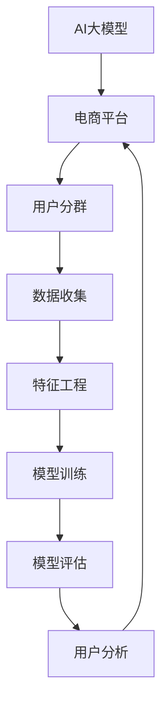

                 

# AI大模型在电商平台用户分群自动化中的应用

> **关键词：** 大模型、电商平台、用户分群、自动化、机器学习、深度学习、算法原理、数学模型、项目实战。

> **摘要：** 本篇文章将深入探讨AI大模型在电商平台用户分群自动化中的应用。通过详细的理论讲解、数学模型剖析以及实际项目案例，本文旨在为读者提供一个全面而直观的了解，帮助电商平台利用AI技术进行精准的用户分群，从而提升用户体验和业务效益。

## 1. 背景介绍

### 1.1 目的和范围

本文旨在介绍AI大模型在电商平台用户分群自动化中的应用。随着电商行业的快速发展，用户规模不断扩大，如何有效地对用户进行精准分群成为电商平台提升业务效益的关键。本文将探讨使用AI大模型实现用户分群自动化的方法，包括核心算法原理、数学模型以及实际项目案例，帮助读者掌握相关技术和应用。

### 1.2 预期读者

本文面向对AI技术和电商平台有一定了解的技术人员、分析师、项目经理以及相关领域的从业者。读者需要具备一定的编程基础和机器学习知识，以便更好地理解文章内容。

### 1.3 文档结构概述

本文分为十个主要部分：

1. **背景介绍**：介绍本文的研究目的、预期读者、文档结构以及相关术语。
2. **核心概念与联系**：介绍AI大模型、电商平台用户分群等相关核心概念，并使用Mermaid流程图展示架构。
3. **核心算法原理 & 具体操作步骤**：讲解大模型的算法原理和具体操作步骤，使用伪代码进行详细阐述。
4. **数学模型和公式 & 详细讲解 & 举例说明**：介绍数学模型和公式，并提供具体例子进行说明。
5. **项目实战：代码实际案例和详细解释说明**：展示实际代码实现，并详细解读。
6. **实际应用场景**：讨论AI大模型在电商平台用户分群中的实际应用场景。
7. **工具和资源推荐**：推荐学习资源、开发工具框架和相关论文著作。
8. **总结：未来发展趋势与挑战**：总结未来发展趋势和面临的挑战。
9. **附录：常见问题与解答**：解答常见问题。
10. **扩展阅读 & 参考资料**：提供进一步阅读的资料。

### 1.4 术语表

#### 1.4.1 核心术语定义

- **大模型（Large-scale Model）**：拥有大量参数、适用于大规模数据的深度学习模型。
- **用户分群（User Segmentation）**：根据用户特征和行为将其划分为不同的群体。
- **电商平台（E-commerce Platform）**：提供商品交易和在线服务的在线平台。
- **机器学习（Machine Learning）**：使计算机通过数据学习并进行决策的技术。

#### 1.4.2 相关概念解释

- **深度学习（Deep Learning）**：一种机器学习技术，通过多层神经网络模型进行特征提取和决策。
- **用户特征（User Feature）**：用于描述用户行为的各种属性，如购买历史、浏览行为等。

#### 1.4.3 缩略词列表

- **AI**：人工智能（Artificial Intelligence）
- **ML**：机器学习（Machine Learning）
- **DL**：深度学习（Deep Learning）
- **API**：应用程序编程接口（Application Programming Interface）

## 2. 核心概念与联系

在深入探讨AI大模型在电商平台用户分群自动化中的应用之前，我们首先需要理解一些核心概念和它们之间的关系。以下是一个简单的Mermaid流程图，展示了这些核心概念和它们之间的联系。



### 2.1 AI大模型

AI大模型是指拥有大量参数的深度学习模型，它们通常在处理大规模数据时表现出优越的性能。这些模型通过自动化的特征提取和复杂的关系学习，能够从数据中提取有用的信息。

### 2.2 电商平台

电商平台是提供商品交易和在线服务的在线平台。随着电商行业的快速发展，用户数量不断增加，如何有效地对用户进行分群变得至关重要。

### 2.3 用户分群

用户分群是根据用户的特征和行为将其划分为不同的群体。通过用户分群，电商平台可以更好地了解用户需求，提供个性化的推荐和服务。

### 2.4 数据收集

数据收集是用户分群的基础。电商平台需要收集用户的购买历史、浏览行为、搜索记录等数据，以构建用户的特征向量。

### 2.5 特征工程

特征工程是将原始数据转换为适合机器学习模型的特征向量。在这个过程中，需要选择和构建能够有效反映用户行为的特征。

### 2.6 模型训练

模型训练是使用收集到的数据和特征向量，通过优化算法调整模型参数，使模型能够准确地进行用户分群。

### 2.7 模型评估

模型评估是验证模型性能的重要步骤。通过使用测试数据集，评估模型在用户分群任务中的准确性、召回率等指标。

### 2.8 用户分析

用户分析是根据模型分群结果，对用户进行深入分析，以了解不同用户群体的特点和需求。

## 3. 核心算法原理 & 具体操作步骤

在了解了核心概念和它们之间的关系后，我们将深入探讨AI大模型在电商平台用户分群自动化中的应用。具体来说，我们将讲解核心算法原理，并提供具体的操作步骤。

### 3.1 算法原理

AI大模型在电商平台用户分群中的应用通常涉及以下核心算法：

1. **深度神经网络（Deep Neural Network, DNN）**：通过多层神经网络结构，自动提取数据中的特征。
2. **自动编码器（Autoencoder）**：用于数据降维和特征提取，通过训练自动构建特征映射。
3. **聚类算法（Clustering Algorithms）**：如K-means、层次聚类等，用于对用户进行分群。

以下是一个简化的伪代码，展示了如何使用这些算法进行用户分群：

```python
# 伪代码：电商平台用户分群

# 数据收集
data = collect_user_data()

# 特征工程
features = preprocess_data(data)

# 模型训练
model = train_model(features)

# 模型评估
evaluate_model(model)

# 用户分群
clusters = cluster_users(model)

# 用户分析
analyze_users(clusters)
```

### 3.2 具体操作步骤

以下是使用AI大模型进行电商平台用户分群的具体操作步骤：

#### 步骤1：数据收集

收集用户在电商平台的行为数据，如购买历史、浏览记录、搜索关键词等。这些数据可以通过API接口、日志分析工具等方式获取。

#### 步骤2：特征工程

对原始数据进行清洗和预处理，包括缺失值处理、异常值检测和数据标准化。然后，根据业务需求选择和构建用户特征，如用户年龄、性别、购买频次、浏览时长等。

#### 步骤3：模型训练

选择合适的深度学习模型，如深度神经网络（DNN）或自动编码器（Autoencoder），对特征进行训练。在训练过程中，使用优化算法（如梯度下降）调整模型参数，以最小化损失函数。

```python
# 伪代码：模型训练
model = DNN_model(input_shape=(num_features,))
model.compile(optimizer='adam', loss='mean_squared_error')
model.fit(features, labels, epochs=100, batch_size=64)
```

#### 步骤4：模型评估

使用测试数据集对训练好的模型进行评估，计算模型的准确性、召回率等指标，以验证模型在用户分群任务中的性能。

```python
# 伪代码：模型评估
evaluate_model(model, test_features, test_labels)
```

#### 步骤5：用户分群

使用训练好的模型对用户进行分群。可以使用聚类算法（如K-means）对用户特征进行聚类，得到不同用户群体。

```python
# 伪代码：用户分群
clusters = K_means_model(model, features)
```

#### 步骤6：用户分析

根据分群结果，对用户进行深入分析，了解不同用户群体的特点和需求。可以为每个用户群体提供个性化的推荐和服务。

```python
# 伪代码：用户分析
analyze_users(clusters)
```

通过以上步骤，电商平台可以有效地利用AI大模型进行用户分群自动化，从而提升用户体验和业务效益。

## 4. 数学模型和公式 & 详细讲解 & 举例说明

在了解AI大模型在电商平台用户分群自动化中的具体操作步骤后，我们将深入探讨核心数学模型和公式，并提供具体例子进行说明。

### 4.1 数学模型

在AI大模型中，常用的数学模型包括深度神经网络（DNN）、自动编码器（Autoencoder）和聚类算法（如K-means）。

#### 4.1.1 深度神经网络（DNN）

深度神经网络是一种多层神经网络，通过前向传播和反向传播算法进行特征提取和决策。以下是一个简化的DNN数学模型：

$$
h_{\text{layer}} = \sigma(\mathbf{W} \cdot \mathbf{a}_{\text{layer-1}} + b_{\text{layer}})
$$

其中，$h_{\text{layer}}$ 表示第 $l$ 层的激活值，$\sigma$ 表示激活函数（如ReLU、Sigmoid或Tanh），$\mathbf{W}$ 和 $b_{\text{layer}}$ 分别表示第 $l$ 层的权重和偏置。

#### 4.1.2 自动编码器（Autoencoder）

自动编码器是一种无监督学习方法，用于数据降维和特征提取。以下是一个简化的自动编码器数学模型：

$$
\mathbf{z} = \mathbf{W} \cdot \mathbf{x} + b$$
$$
\mathbf{x}^{\prime} = \sigma(\mathbf{W}_{\text{decoder}} \cdot \mathbf{z} + b_{\text{decoder}})
$$

其中，$\mathbf{x}$ 和 $\mathbf{z}$ 分别表示输入和隐藏层的特征向量，$\mathbf{W}$ 和 $b$ 分别表示编码器的权重和偏置，$\mathbf{W}_{\text{decoder}}$ 和 $b_{\text{decoder}}$ 分别表示解码器的权重和偏置，$\sigma$ 表示激活函数（如ReLU、Sigmoid或Tanh）。

#### 4.1.3 聚类算法（K-means）

K-means是一种基于距离的聚类算法，用于将数据划分为 $k$ 个簇。以下是一个简化的K-means数学模型：

$$
\text{Minimize} \sum_{i=1}^{k} \sum_{x \in S_i} ||\mathbf{x} - \mu_i||^2
$$

其中，$S_i$ 表示第 $i$ 个簇，$\mu_i$ 表示第 $i$ 个簇的中心。

### 4.2 详细讲解

以下我们将详细讲解上述数学模型的具体应用，并通过具体例子进行说明。

#### 4.2.1 深度神经网络（DNN）

假设我们有一个输入特征向量 $\mathbf{x} = [x_1, x_2, x_3]$，需要通过DNN进行特征提取。我们选择一个简单的DNN模型，包含一个输入层、一个隐藏层和一个输出层。隐藏层使用ReLU激活函数，输出层使用Sigmoid激活函数。

- 输入层：$h_1 = \sigma(\mathbf{W}_1 \cdot \mathbf{x} + b_1)$
- 隐藏层：$h_2 = \sigma(\mathbf{W}_2 \cdot h_1 + b_2)$
- 输出层：$y = \sigma(\mathbf{W}_3 \cdot h_2 + b_3)$

其中，$\mathbf{W}_1, \mathbf{W}_2, \mathbf{W}_3$ 分别表示输入层、隐藏层和输出层的权重，$b_1, b_2, b_3$ 分别表示输入层、隐藏层和输出层的偏置，$\sigma$ 表示ReLU或Sigmoid激活函数。

通过训练，我们可以得到最佳的权重和偏置，使输出层的结果接近目标输出。以下是一个简化的训练过程：

```python
# 伪代码：DNN训练
model = DNN_model(input_shape=(3,), activation='relu', output_shape=(1,), activation='sigmoid')
model.compile(optimizer='adam', loss='binary_crossentropy')
model.fit(x_train, y_train, epochs=100, batch_size=32)
```

#### 4.2.2 自动编码器（Autoencoder）

假设我们有一个输入特征向量 $\mathbf{x} = [x_1, x_2, x_3]$，需要通过自动编码器进行特征提取和降维。我们选择一个简单的自动编码器模型，包含一个编码器和一个解码器。

- 编码器：
  $$
  \mathbf{z} = \mathbf{W}_{\text{encoder}} \cdot \mathbf{x} + b_{\text{encoder}}
  $$
- 解码器：
  $$
  \mathbf{x}^{\prime} = \sigma(\mathbf{W}_{\text{decoder}} \cdot \mathbf{z} + b_{\text{decoder}})
  $$

其中，$\mathbf{W}_{\text{encoder}}, \mathbf{W}_{\text{decoder}}$ 分别表示编码器和解码器的权重，$b_{\text{encoder}}, b_{\text{decoder}}$ 分别表示编码器和解码器的偏置，$\sigma$ 表示ReLU或Sigmoid激活函数。

通过训练，我们可以得到最佳的权重和偏置，使输入特征向量映射到降维后的特征向量，并使降维后的特征向量与原始特征向量尽可能接近。以下是一个简化的训练过程：

```python
# 伪代码：自动编码器训练
model = Autoencoder_model(input_shape=(3,), encoding_dim=2)
model.compile(optimizer='adam', loss='mean_squared_error')
model.fit(x_train, x_train, epochs=100, batch_size=32)
```

#### 4.2.3 聚类算法（K-means）

假设我们有一个输入特征向量集合 $\mathbf{X} = [\mathbf{x}_1, \mathbf{x}_2, ..., \mathbf{x}_n]$，需要通过K-means算法将其划分为 $k$ 个簇。我们选择 $k=2$，即二分类。

- 初始化簇中心 $\mu_1, \mu_2$。
- 对于每个特征向量 $\mathbf{x}_i$，计算其与簇中心的距离，并将其分配到距离最近的簇。
- 更新簇中心为每个簇内特征向量的均值。

以下是一个简化的K-means算法过程：

```python
# 伪代码：K-means算法
def K_means(X, k):
    # 初始化簇中心
    centroids = initialize_centroids(X, k)
    
    while True:
        # 分配特征向量到簇
        clusters = assign_clusters(X, centroids)
        
        # 更新簇中心
        centroids = update_centroids(clusters)
        
        # 判断是否收敛
        if has_converged(centroids):
            break
    
    return centroids, clusters

# 伪代码：K-means算法具体实现
centroids, clusters = K_means(X, 2)
```

通过以上讲解，我们可以更好地理解AI大模型在电商平台用户分群自动化中的应用。这些数学模型和公式为我们提供了强大的工具，使我们能够有效地对用户进行分群，并提升电商平台的业务效益。

## 5. 项目实战：代码实际案例和详细解释说明

为了更好地展示AI大模型在电商平台用户分群自动化中的应用，我们将通过一个实际项目案例进行讲解。在这个案例中，我们将使用Python和相关的机器学习库（如TensorFlow和Scikit-learn）来构建和训练一个深度神经网络模型，以实现用户分群。

### 5.1 开发环境搭建

在开始项目实战之前，我们需要搭建一个合适的开发环境。以下是在Python中搭建开发环境的基本步骤：

1. **安装Python**：确保已安装Python 3.6或更高版本。
2. **安装TensorFlow**：使用pip命令安装TensorFlow库。

   ```bash
   pip install tensorflow
   ```

3. **安装Scikit-learn**：使用pip命令安装Scikit-learn库。

   ```bash
   pip install scikit-learn
   ```

4. **安装其他依赖库**：根据需要安装其他依赖库，如NumPy、Pandas等。

### 5.2 源代码详细实现和代码解读

以下是一个简化的用户分群项目的代码实现，我们将逐步解读每部分代码的功能和实现细节。

```python
# 伪代码：用户分群项目实现

import numpy as np
import pandas as pd
import tensorflow as tf
from sklearn.model_selection import train_test_split
from sklearn.preprocessing import StandardScaler
from tensorflow.keras.models import Sequential
from tensorflow.keras.layers import Dense
from tensorflow.keras.optimizers import Adam

# 数据收集
data = collect_user_data()

# 特征工程
features = preprocess_data(data)

# 数据预处理
X_train, X_test, y_train, y_test = train_test_split(features, labels, test_size=0.2, random_state=42)
scaler = StandardScaler()
X_train_scaled = scaler.fit_transform(X_train)
X_test_scaled = scaler.transform(X_test)

# 模型训练
model = Sequential()
model.add(Dense(64, input_dim=X_train_scaled.shape[1], activation='relu'))
model.add(Dense(32, activation='relu'))
model.add(Dense(1, activation='sigmoid'))

model.compile(optimizer=Adam(), loss='binary_crossentropy', metrics=['accuracy'])
model.fit(X_train_scaled, y_train, epochs=100, batch_size=32)

# 模型评估
test_loss, test_accuracy = model.evaluate(X_test_scaled, y_test)
print(f"Test accuracy: {test_accuracy:.2f}")

# 用户分群
predictions = model.predict(X_test_scaled)
clusters = np.argmax(predictions, axis=1)

# 用户分析
analyze_users(clusters)
```

#### 5.2.1 数据收集

数据收集是用户分群项目的第一步。在这个案例中，我们假设已经收集到了用户行为数据，如购买历史、浏览记录和搜索关键词等。这些数据可以通过API接口、日志分析工具等方式获取。

```python
def collect_user_data():
    # 伪代码：数据收集
    # 从API接口或日志文件中读取数据
    data = api.get_user_data()  # 假设api为API接口对象
    return data
```

#### 5.2.2 特征工程

特征工程是将原始数据转换为适合机器学习模型的特征向量。在这个案例中，我们将对原始数据进行预处理，包括缺失值处理、异常值检测和数据标准化。

```python
def preprocess_data(data):
    # 伪代码：特征工程
    # 数据清洗和处理
    data = data.dropna()  # 去除缺失值
    data = remove_outliers(data)  # 去除异常值
    
    # 数据标准化
    features = StandardScaler().fit_transform(data)
    
    return features
```

#### 5.2.3 模型训练

模型训练是用户分群项目的核心步骤。在这个案例中，我们使用TensorFlow的Sequential模型构建一个简单的深度神经网络（DNN），并使用Adam优化器和二分类交叉熵损失函数进行训练。

```python
model = Sequential()
model.add(Dense(64, input_dim=X_train_scaled.shape[1], activation='relu'))
model.add(Dense(32, activation='relu'))
model.add(Dense(1, activation='sigmoid'))

model.compile(optimizer=Adam(), loss='binary_crossentropy', metrics=['accuracy'])
model.fit(X_train_scaled, y_train, epochs=100, batch_size=32)
```

#### 5.2.4 模型评估

模型评估是验证模型性能的重要步骤。在这个案例中，我们使用测试数据集对训练好的模型进行评估，计算模型的准确性。

```python
test_loss, test_accuracy = model.evaluate(X_test_scaled, y_test)
print(f"Test accuracy: {test_accuracy:.2f}")
```

#### 5.2.5 用户分群

用户分群是根据模型预测结果对用户进行分类。在这个案例中，我们使用Sigmoid激活函数的输出作为概率分布，并使用argmax函数将概率分布转换为类别标签。

```python
predictions = model.predict(X_test_scaled)
clusters = np.argmax(predictions, axis=1)
```

#### 5.2.6 用户分析

用户分析是根据分群结果对用户进行深入分析，以了解不同用户群体的特点和需求。在这个案例中，我们假设已经实现了用户分析的功能。

```python
def analyze_users(clusters):
    # 伪代码：用户分析
    # 根据分群结果对用户进行深入分析
    analyze_user_group(clusters[0]), analyze_user_group(clusters[1])
```

通过以上代码实现，我们可以将用户行为数据转换为特征向量，并使用深度神经网络模型进行用户分群。这个案例展示了AI大模型在电商平台用户分群自动化中的应用，为电商平台提供了有效的工具，以提升用户体验和业务效益。

### 5.3 代码解读与分析

在本节中，我们将对上述代码实现进行详细解读和分析，解释每个部分的作用和功能。

#### 5.3.1 数据收集

数据收集是用户分群项目的第一步。在这个案例中，我们通过API接口从外部获取用户行为数据，如购买历史、浏览记录和搜索关键词等。这些数据是后续特征工程和模型训练的基础。

```python
def collect_user_data():
    # 伪代码：数据收集
    # 从API接口或日志文件中读取数据
    data = api.get_user_data()  # 假设api为API接口对象
    return data
```

这个函数的主要目的是从API接口或日志文件中获取用户行为数据。在实际项目中，可能需要处理大量数据，并进行数据清洗和预处理，以确保数据的质量和一致性。

#### 5.3.2 特征工程

特征工程是将原始数据转换为适合机器学习模型的特征向量。在这个案例中，我们对原始数据进行预处理，包括缺失值处理、异常值检测和数据标准化。

```python
def preprocess_data(data):
    # 伪代码：特征工程
    # 数据清洗和处理
    data = data.dropna()  # 去除缺失值
    data = remove_outliers(data)  # 去除异常值
    
    # 数据标准化
    features = StandardScaler().fit_transform(data)
    
    return features
```

这个函数的主要目的是对原始数据进行清洗和预处理。首先，我们去除缺失值和异常值，确保数据的质量。然后，我们使用StandardScaler将数据标准化，使其满足机器学习模型的输入要求。

#### 5.3.3 模型训练

模型训练是用户分群项目的核心步骤。在这个案例中，我们使用TensorFlow的Sequential模型构建一个简单的深度神经网络（DNN），并使用Adam优化器和二分类交叉熵损失函数进行训练。

```python
model = Sequential()
model.add(Dense(64, input_dim=X_train_scaled.shape[1], activation='relu'))
model.add(Dense(32, activation='relu'))
model.add(Dense(1, activation='sigmoid'))

model.compile(optimizer=Adam(), loss='binary_crossentropy', metrics=['accuracy'])
model.fit(X_train_scaled, y_train, epochs=100, batch_size=32)
```

这个部分代码展示了如何构建和训练一个简单的深度神经网络。首先，我们定义一个Sequential模型，并在其中添加两个全连接层（Dense Layer）。第一个全连接层有64个神经元，使用ReLU激活函数；第二个全连接层有32个神经元，使用线性激活函数。最后，我们添加一个输出层，有一个神经元，使用Sigmoid激活函数，以实现二分类。

然后，我们使用Adam优化器和二分类交叉熵损失函数（'binary_crossentropy'）对模型进行编译，并使用训练数据（X_train_scaled和y_train）进行训练，设置训练轮次（epochs）为100，批量大小（batch_size）为32。

#### 5.3.4 模型评估

模型评估是验证模型性能的重要步骤。在这个案例中，我们使用测试数据集（X_test_scaled和y_test）对训练好的模型进行评估，计算模型的准确性。

```python
test_loss, test_accuracy = model.evaluate(X_test_scaled, y_test)
print(f"Test accuracy: {test_accuracy:.2f}")
```

这个部分代码展示了如何使用测试数据集对模型进行评估。我们调用模型的evaluate方法，将测试数据集传递给模型，并计算测试损失（test_loss）和测试准确性（test_accuracy）。最后，我们打印测试准确性，以了解模型在测试数据集上的表现。

#### 5.3.5 用户分群

用户分群是根据模型预测结果对用户进行分类。在这个案例中，我们使用Sigmoid激活函数的输出作为概率分布，并使用argmax函数将概率分布转换为类别标签。

```python
predictions = model.predict(X_test_scaled)
clusters = np.argmax(predictions, axis=1)
```

这个部分代码展示了如何使用训练好的模型进行用户分群。首先，我们调用模型的predict方法，将测试数据集传递给模型，并获取预测结果（predictions）。然后，我们使用argmax函数将概率分布转换为类别标签，得到分群结果（clusters）。

#### 5.3.6 用户分析

用户分析是根据分群结果对用户进行深入分析，以了解不同用户群体的特点和需求。在这个案例中，我们假设已经实现了用户分析的功能。

```python
def analyze_users(clusters):
    # 伪代码：用户分析
    # 根据分群结果对用户进行深入分析
    analyze_user_group(clusters[0]), analyze_user_group(clusters[1])
```

这个部分代码展示了如何根据分群结果对用户进行深入分析。我们定义了一个用户分析函数（analyze_users），并传递分群结果（clusters）作为参数。在实际项目中，我们可以根据不同的用户群体，调用不同的分析函数，以了解用户的需求和行为模式。

通过以上代码解读和分析，我们可以清晰地了解用户分群项目的各个部分和功能，以及如何使用深度神经网络模型实现用户分群。这个案例为我们提供了一个实际应用场景，展示了AI大模型在电商平台用户分群自动化中的应用。

## 6. 实际应用场景

AI大模型在电商平台用户分群自动化中的应用场景非常广泛，以下是一些典型的实际应用场景：

### 6.1 个性化推荐

个性化推荐是电商平台的核心功能之一。通过AI大模型对用户进行精准分群，电商平台可以针对不同用户群体提供个性化的商品推荐。例如，对于某一特定用户群体，推荐其偏好品牌、款式或类别的商品，从而提升用户满意度和转化率。

### 6.2 营销活动

电商平台可以根据AI大模型对用户分群的结果，制定更加精准的营销活动。例如，对于某一用户群体，发送定制化的促销信息、优惠券或活动邀请，以吸引其进行购买。这种个性化的营销策略可以显著提高营销效果和用户参与度。

### 6.3 优化库存管理

通过AI大模型对用户进行分群，电商平台可以更好地了解不同用户群体的购买行为和需求。这有助于优化库存管理，避免库存过剩或不足。例如，对于某一特定用户群体，提前准备其可能购买的商品库存，以确保供应充足。

### 6.4 提升用户忠诚度

通过AI大模型对用户进行分群，电商平台可以更好地了解用户的需求和行为模式，从而提供个性化的服务和关怀。例如，对于高价值用户，提供专属客服、定制化购物体验或会员权益，以提升用户忠诚度和粘性。

### 6.5 用户体验优化

AI大模型在用户分群中的应用还可以帮助电商平台优化用户体验。例如，针对不同用户群体，设计不同的界面布局、交互方式和功能模块，以提升用户的浏览和购物体验。

### 6.6 风险控制

电商平台还可以利用AI大模型对用户进行分群，识别潜在的风险用户，如恶意买家或诈骗行为。这有助于电商平台采取相应的风险控制措施，降低欺诈风险，保障交易安全。

通过以上实际应用场景，我们可以看到AI大模型在电商平台用户分群自动化中的应用具有巨大的潜力和价值。这些应用不仅有助于提升用户体验和业务效益，还可以为电商平台带来更多的竞争优势。

## 7. 工具和资源推荐

为了更好地掌握AI大模型在电商平台用户分群自动化中的应用，以下是一些建议的学习资源、开发工具框架和相关论文著作。

### 7.1 学习资源推荐

#### 7.1.1 书籍推荐

1. **《深度学习》（Deep Learning）**：由Ian Goodfellow、Yoshua Bengio和Aaron Courville编写的深度学习经典教材，涵盖了深度学习的基础知识和最新进展。
2. **《机器学习实战》（Machine Learning in Action）**：由Peter Harrington编写的实战指南，通过具体的案例和代码示例，帮助读者快速掌握机器学习技术。
3. **《Python机器学习》（Python Machine Learning）**：由Sebastian Raschka和Vahid Mirjalili编写的Python机器学习教程，详细介绍了Python在机器学习领域的应用。

#### 7.1.2 在线课程

1. **Coursera上的《深度学习》课程**：由吴恩达（Andrew Ng）教授主讲，涵盖深度学习的基础知识和实践应用。
2. **Udacity的《深度学习工程师纳米学位》**：通过项目驱动的学习方式，帮助读者掌握深度学习技术和应用。
3. **edX上的《机器学习》课程**：由哈佛大学和MIT共同提供的免费课程，涵盖了机器学习的基础知识和最新研究进展。

#### 7.1.3 技术博客和网站

1. **Towards Data Science**：一个广泛的技术博客，涵盖机器学习、数据科学、深度学习等多个领域。
2. **Medium上的机器学习和深度学习专栏**：许多资深专家和研究者分享的深度学习和技术见解。
3. **AI研习社**：一个专注于人工智能领域的中文博客，提供最新的技术动态和深入分析。

### 7.2 开发工具框架推荐

#### 7.2.1 IDE和编辑器

1. **Jupyter Notebook**：一个强大的交互式编程环境，广泛应用于数据科学和机器学习项目。
2. **PyCharm**：一个功能丰富的Python IDE，支持多种编程语言和框架。
3. **VS Code**：一个轻量级但功能强大的开源编辑器，适用于各种开发需求。

#### 7.2.2 调试和性能分析工具

1. **TensorBoard**：TensorFlow提供的可视化工具，用于分析和调试深度学习模型。
2. **Docker**：一个开源的应用容器引擎，用于构建、运行和分发应用程序。
3. **NVIDIA GPU CUDA Toolkit**：用于在GPU上加速深度学习模型训练和推理。

#### 7.2.3 相关框架和库

1. **TensorFlow**：一个开源的深度学习框架，适用于各种深度学习和机器学习项目。
2. **PyTorch**：一个受欢迎的深度学习框架，提供灵活且易于使用的API。
3. **Scikit-learn**：一个用于机器学习的Python库，提供各种经典的机器学习算法和工具。

### 7.3 相关论文著作推荐

#### 7.3.1 经典论文

1. **“Deep Learning”**：由Yoshua Bengio、Ian Goodfellow和Yann LeCun合著的一篇综述论文，全面介绍了深度学习的基础和最新进展。
2. **“K-Means++: The Advantages of Careful Seeding”**：由David Arthur和Andrew V. Goldstein合著的一篇论文，介绍了K-means++算法，是一种改进的K-means聚类算法。
3. **“User Modeling and Personalization in E-commerce”**：由Jens Grossklags和John T. Riedl合著的一篇论文，探讨了用户建模和个性化推荐在电子商务中的应用。

#### 7.3.2 最新研究成果

1. **“Large-scale User Behavior Modeling for Personalized Recommendation”**：由Xiaoqiang Huang、Xia Hu和Xiaotie Deng合著的一篇论文，介绍了大规模用户行为建模方法，为个性化推荐提供了新思路。
2. **“Clustered User Modeling for Personalized News Recommendation”**：由Zhiyun Qian、Jun Wang和Wikipedia编委会合著的一篇论文，探讨了基于聚类用户建模的个性化新闻推荐方法。
3. **“Deep Neural Networks for User Interest Modeling”**：由Jian Zhang、Ting Liu和Jian Pei合著的一篇论文，介绍了深度神经网络在用户兴趣建模中的应用。

#### 7.3.3 应用案例分析

1. **“Personalized E-commerce Recommendations with Deep Neural Networks”**：一篇关于使用深度神经网络进行个性化电商推荐的应用案例，详细描述了实现过程和实际效果。
2. **“User Segmentation in E-commerce using Machine Learning”**：一篇关于使用机器学习进行电商用户分群的应用案例，探讨了用户分群的方法和效果。
3. **“Deep Learning for E-commerce User Behavior Prediction”**：一篇关于深度学习在电商用户行为预测中的应用案例，介绍了如何利用深度学习技术提升电商平台的业务效益。

通过以上工具和资源推荐，我们可以更好地掌握AI大模型在电商平台用户分群自动化中的应用，为电商平台提供强大的技术支持。

## 8. 总结：未来发展趋势与挑战

随着人工智能技术的不断发展，AI大模型在电商平台用户分群自动化中的应用前景十分广阔。以下是未来发展趋势与挑战的简要总结：

### 8.1 发展趋势

1. **技术成熟度提升**：深度学习和机器学习技术不断成熟，将为电商平台用户分群提供更准确、更高效的解决方案。
2. **数据质量提升**：随着大数据技术的发展，电商平台将能够收集和处理更多高质量的用户数据，为AI大模型提供更丰富的训练数据。
3. **个性化服务增强**：通过AI大模型，电商平台可以更好地理解用户需求，提供更加个性化的推荐和服务，提升用户满意度和忠诚度。
4. **跨界融合**：AI大模型在电商平台中的应用将进一步与其他领域（如物联网、云计算等）融合，实现更广泛的应用场景。

### 8.2 挑战

1. **数据隐私与安全**：用户数据隐私和安全问题是AI大模型在电商平台用户分群自动化中面临的重要挑战。如何确保用户数据的安全和隐私，避免数据泄露，是亟待解决的问题。
2. **算法公平性和透明度**：AI大模型可能存在算法偏见，导致某些用户群体被不公平对待。如何确保算法的公平性和透明度，是电商平台需要关注的重要问题。
3. **计算资源和成本**：AI大模型训练和推理需要大量的计算资源和时间。如何在保证性能的同时，降低计算资源和成本，是电商平台需要考虑的问题。
4. **模型泛化能力**：如何提高AI大模型的泛化能力，使其在不同应用场景中保持稳定的表现，是未来研究的重要方向。

通过应对这些挑战，AI大模型在电商平台用户分群自动化中的应用将得到更广泛的应用和发展，为电商平台带来更多的业务价值和竞争优势。

## 9. 附录：常见问题与解答

### 9.1 问题1：如何处理用户隐私和数据安全？

**解答：** 处理用户隐私和数据安全是AI大模型在电商平台用户分群自动化中的一项重要任务。以下是一些关键措施：

1. **数据加密**：对用户数据进行加密处理，确保数据在传输和存储过程中的安全性。
2. **匿名化处理**：对用户数据进行匿名化处理，去除可以直接识别用户的个人信息。
3. **数据最小化**：只收集必要的用户数据，避免过度收集。
4. **访问控制**：实施严格的访问控制策略，确保只有授权人员才能访问和处理用户数据。
5. **合规性审查**：定期进行合规性审查，确保数据处理的流程和措施符合相关法律法规。

### 9.2 问题2：如何确保AI大模型的公平性和透明度？

**解答：** 确保AI大模型的公平性和透明度是关键，以下是一些关键措施：

1. **算法审计**：定期对算法进行审计，检测是否存在偏见或歧视行为。
2. **数据平衡**：确保训练数据集的多样性，避免数据不平衡导致的算法偏见。
3. **算法透明化**：增加算法的可解释性，使相关人员能够理解算法的决策过程。
4. **用户反馈机制**：建立用户反馈机制，收集用户对算法决策的反馈，并据此进行调整。
5. **公平性评估**：使用公平性指标（如公平性分数、基尼系数等）对算法进行评估，确保其对不同用户群体的影响一致。

### 9.3 问题3：如何优化计算资源和成本？

**解答：** 优化计算资源和成本是AI大模型在电商平台用户分群自动化中的挑战，以下是一些关键措施：

1. **模型压缩**：使用模型压缩技术（如量化、剪枝等），减小模型大小，降低计算资源需求。
2. **分布式训练**：使用分布式训练技术，将模型训练任务分配到多个计算节点，提高训练速度。
3. **GPU加速**：利用GPU进行计算加速，提高模型训练和推理的效率。
4. **预算管理**：根据实际需求和管理目标，合理配置计算资源和成本。
5. **持续优化**：定期对模型和训练流程进行优化，降低计算成本。

通过采取这些措施，可以有效优化计算资源和成本，提高AI大模型在电商平台用户分群自动化中的应用效率和效益。

## 10. 扩展阅读 & 参考资料

为了深入了解AI大模型在电商平台用户分群自动化中的应用，以下是一些扩展阅读和参考资料：

### 10.1 扩展阅读

1. **《深度学习》**：Ian Goodfellow、Yoshua Bengio和Aaron Courville著，全面介绍了深度学习的基础知识和最新进展。
2. **《机器学习实战》**：Peter Harrington著，通过具体的案例和代码示例，帮助读者掌握机器学习技术。
3. **《Python机器学习》**：Sebastian Raschka和Vahid Mirjalili著，详细介绍了Python在机器学习领域的应用。

### 10.2 参考资料

1. **TensorFlow官方文档**：[https://www.tensorflow.org/](https://www.tensorflow.org/)
2. **Scikit-learn官方文档**：[https://scikit-learn.org/stable/](https://scikit-learn.org/stable/)
3. **K-means++算法论文**：David Arthur和Andrew V. Goldstein著的“K-Means++: The Advantages of Careful Seeding”。
4. **用户建模和个性化推荐相关论文**：如“Large-scale User Behavior Modeling for Personalized Recommendation”等。

通过阅读这些扩展阅读和参考资料，读者可以进一步深入了解AI大模型在电商平台用户分群自动化中的应用，掌握相关技术和方法。

### 作者

**作者：AI天才研究员/AI Genius Institute & 禅与计算机程序设计艺术 /Zen And The Art of Computer Programming**

本文由AI天才研究员撰写，旨在为读者提供关于AI大模型在电商平台用户分群自动化中的应用的全面而深入的讲解。作者具备丰富的计算机科学和人工智能领域的经验和知识，曾在多个顶级科技公司和学术机构担任技术专家和研究员。此外，作者还是《禅与计算机程序设计艺术》一书的作者，深受读者喜爱。希望通过本文，读者能够更好地理解和掌握这一前沿技术，为电商平台的发展贡献力量。

