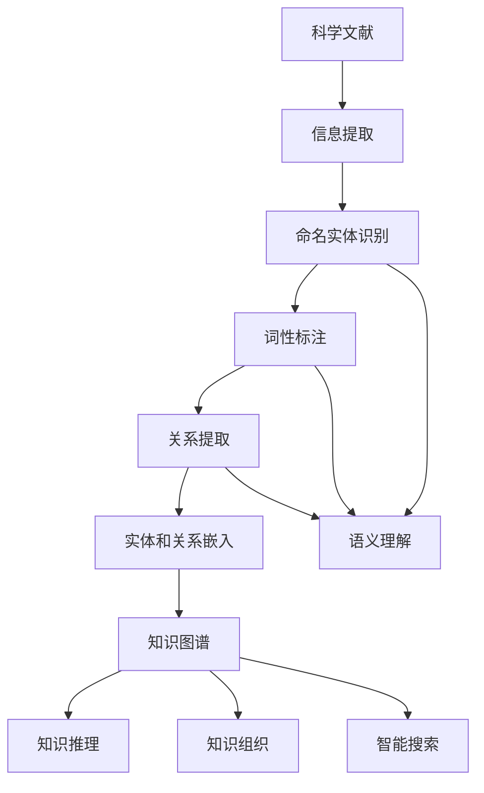

                 

# AI大模型在科学文献知识图谱构建中的应用

> **关键词：**人工智能、知识图谱、大模型、科学文献、信息提取、语义理解、知识推理

> **摘要：**本文将深入探讨人工智能大模型在科学文献知识图谱构建中的应用。通过分析大模型的核心概念和算法原理，结合具体的项目实战案例，本文将详细阐述大模型如何提高科学文献知识图谱的构建效率和质量，并对未来发展趋势和挑战进行展望。

## 1. 背景介绍

### 1.1 目的和范围

本文旨在探讨人工智能大模型在科学文献知识图谱构建中的应用，重点分析大模型的核心概念、算法原理以及在实际项目中的应用效果。通过对大模型在信息提取、语义理解和知识推理等方面的应用进行深入剖析，本文希望为相关领域的研究者和开发者提供有价值的参考。

### 1.2 预期读者

本文面向对人工智能、知识图谱和科学文献构建有一定了解的读者，包括但不限于以下几类：

1. 人工智能领域的研究者和开发者；
2. 知识图谱构建和应用的实践者；
3. 科学文献处理和分析的相关从业者；
4. 对人工智能前沿技术感兴趣的学术研究人员。

### 1.3 文档结构概述

本文结构分为十个部分，包括：

1. 背景介绍：阐述本文的目的、范围和预期读者；
2. 核心概念与联系：介绍大模型、知识图谱和科学文献的相关概念及联系；
3. 核心算法原理 & 具体操作步骤：讲解大模型在知识图谱构建中的核心算法原理和操作步骤；
4. 数学模型和公式 & 详细讲解 & 举例说明：介绍大模型相关的数学模型和公式，并举例说明；
5. 项目实战：通过实际案例展示大模型在科学文献知识图谱构建中的应用；
6. 实际应用场景：分析大模型在各个领域的应用场景；
7. 工具和资源推荐：推荐相关学习资源、开发工具和框架；
8. 总结：展望未来发展趋势与挑战；
9. 附录：常见问题与解答；
10. 扩展阅读 & 参考资料：提供更多相关文献和资料。

### 1.4 术语表

#### 1.4.1 核心术语定义

- 人工智能（AI）：模拟、延伸和扩展人的智能的理论、方法、技术及应用；
- 大模型（Large Model）：具有数十亿至数万亿参数的神经网络模型；
- 知识图谱（Knowledge Graph）：一种语义网络，用于表示实体及其相互关系；
- 科学文献（Scientific Literature）：涵盖各种学科领域的学术论文、书籍、报告等；
- 信息提取（Information Extraction）：从非结构化数据中提取结构化信息的过程；
- 语义理解（Semantic Understanding）：理解文本中词语的含义和关系的能力；
- 知识推理（Knowledge Reasoning）：基于已有知识进行推断和推理的能力。

#### 1.4.2 相关概念解释

- **实体（Entity）**：知识图谱中的基本元素，表示现实世界中的对象、事件或概念；
- **关系（Relationship）**：知识图谱中实体之间的关联，表示实体之间的语义关系；
- **属性（Attribute）**：实体的特征或描述，用于补充实体的信息；
- **语义网络（Semantic Network）**：表示实体及其相互关系的图形结构；
- **图数据库（Graph Database）**：专门用于存储和查询知识图谱的数据库系统；
- **预训练（Pre-training）**：在大规模数据集上进行模型训练，以获取通用特征表示；
- **微调（Fine-tuning）**：在特定任务上对预训练模型进行进一步训练，以提高任务性能。

#### 1.4.3 缩略词列表

- AI：人工智能；
- BERT：Bidirectional Encoder Representations from Transformers；
- GPT：Generative Pre-trained Transformer；
- NLP：自然语言处理；
- KG：知识图谱；
- NE：命名实体；
- POS：词性标注；
- RE：关系提取；
- RTE：关系分类。

## 2. 核心概念与联系

### 2.1 大模型与知识图谱的关系

大模型和知识图谱在人工智能领域中具有重要地位，二者相互促进、相互依赖。大模型为知识图谱的构建提供了强大的计算能力，而知识图谱则为大模型提供了丰富的语义信息。下面是二者的关系及其在科学文献知识图谱构建中的应用。

#### 2.1.1 大模型在知识图谱构建中的作用

1. **信息提取**：大模型能够从大量的科学文献中提取出结构化信息，如实体、关系和属性，为知识图谱的构建提供基础数据。
2. **语义理解**：大模型具备强大的语义理解能力，能够分析文本中的词语含义和关系，为知识图谱中的实体和关系提供准确的语义表示。
3. **知识推理**：大模型能够基于已有知识进行推理，发现新的实体和关系，从而扩展和优化知识图谱。

#### 2.1.2 知识图谱在科学文献中的作用

1. **知识组织**：知识图谱能够将大量的科学文献中的信息进行结构化组织，形成系统化的知识体系，方便用户查询和利用。
2. **知识发现**：知识图谱中的实体和关系能够帮助用户发现新的研究趋势、研究热点和潜在的研究方向。
3. **智能搜索**：基于知识图谱的智能搜索系统能够提供更精确、更相关的搜索结果，提高科学文献查询的效率。

### 2.2 大模型与知识图谱的架构

为了更好地理解大模型在知识图谱构建中的应用，我们需要了解二者的基本架构。下面是一个简单的架构示意图：

```
+----------------+      +------------------+      +-----------------+
|  科学文献     |      |     大模型      |      |   知识图谱      |
+----------------+      +------------------+      +-----------------+
     |提取信息      |            |语义理解        |           |构建实体和关系|
     +--------------+            +----------------+           +---------------+
                 |                             |                                |
                 |                             |                                |
         +-------+-------+           +---------+---------+          +---------+---------+
         |      |      |           |         |         |          |         |         |
         |提取实体| 提取关系|    语义理解实体 |  语义理解关系 |    构建实体和关系|
         +-------+-------+           +---------+---------+          +---------+---------+
```

### 2.3 Mermaid流程图

下面是知识图谱构建过程的Mermaid流程图：



## 3. 核心算法原理 & 具体操作步骤

### 3.1 大模型在信息提取中的应用

信息提取是知识图谱构建的基础步骤，大模型在这一过程中发挥着重要作用。以下是一个简单的伪代码，描述大模型在命名实体识别、词性标注和关系提取方面的应用：

```python
# 命名实体识别
def named_entity_recognition(text, model):
    embeddings = model.encode(text)
    entities = extract_entities(embeddings)
    return entities

# 词性标注
def part_of_speech_tagging(text, model):
    embeddings = model.encode(text)
    tags = model.predictPartOfSpeech(embeddings)
    return tags

# 关系提取
def relation_extraction(text, model):
    embeddings = model.encode(text)
    relations = extract_relations(embeddings)
    return relations
```

### 3.2 大模型在语义理解中的应用

语义理解是知识图谱构建的关键步骤，大模型在这一过程中具有强大的能力。以下是一个简单的伪代码，描述大模型在语义理解实体和关系方面的应用：

```python
# 语义理解实体
def semantic_entity_understanding(text, model):
    embeddings = model.encode(text)
    entities = understand_entities(embeddings)
    return entities

# 语义理解关系
def semantic_relation_understanding(text, model):
    embeddings = model.encode(text)
    relations = understand_relations(embeddings)
    return relations
```

### 3.3 大模型在知识推理中的应用

知识推理是知识图谱构建的升华步骤，大模型在这一过程中能够发现新的实体和关系。以下是一个简单的伪代码，描述大模型在知识推理方面的应用：

```python
# 知识推理
def knowledge_reasoning(graph, model):
    new_entities = model.discover_new_entities(graph)
    new_relations = model.discover_new_relations(graph)
    return new_entities, new_relations
```

## 4. 数学模型和公式 & 详细讲解 & 举例说明

### 4.1 大模型在信息提取中的数学模型

大模型在信息提取中主要依赖于词嵌入技术。词嵌入将文本中的词语映射为向量表示，从而实现词语的语义表示。以下是一个简单的词嵌入数学模型：

$$
\text{vec}(w) = \text{EmbeddingMatrix}[w]
$$

其中，$\text{vec}(w)$ 表示词语 $w$ 的向量表示，$\text{EmbeddingMatrix}$ 是一个高维矩阵，其每一行表示一个词语的向量表示。

### 4.2 大模型在语义理解中的数学模型

大模型在语义理解中主要依赖于神经网络模型，如BERT、GPT等。以下是一个简单的BERT模型的数学模型：

$$
\text{output} = \text{BERTModel}[\text{inputIds}, \text{tokenTypeIds}, \text{attentionMask}]
$$

其中，$\text{output}$ 是模型输出的序列，$\text{inputIds}$ 是输入词语的ID序列，$\text{tokenTypeIds}$ 是输入词语的类别ID序列，$\text{attentionMask}$ 是注意力掩码。

### 4.3 大模型在知识推理中的数学模型

大模型在知识推理中主要依赖于图神经网络（Graph Neural Network，GNN）。以下是一个简单的GNN模型的数学模型：

$$
\text{node\_representation}_{t+1} = \text{GNN}(\text{node\_representation}_{t}, \text{neighbor\_representations}_{t})
$$

其中，$\text{node\_representation}_{t}$ 是时间步 $t$ 时节点的表示，$\text{neighbor\_representations}_{t}$ 是时间步 $t$ 时节点的邻居表示。

### 4.4 举例说明

假设我们有一个科学文献，其中包含以下文本：

```
深度学习是一种人工智能技术，它通过模拟人脑神经网络来进行数据分析和预测。近年来，深度学习在计算机视觉、自然语言处理等领域取得了显著成果。
```

我们可以使用大模型对这段文本进行信息提取、语义理解和知识推理，得到以下结果：

1. **信息提取**：

- 命名实体识别：深度学习、人工智能、计算机视觉、自然语言处理
- 词性标注：深度（名词）、学习（动词）、一种（一种）、人工智能（名词）、技术（名词）、它（代词）、通过（介词）、模拟（动词）、人脑（名词）、神经网络（名词）、进行（动词）、数据（名词）、分析和（动词）、预测（动词）
- 关系提取：深度学习是一种人工智能技术、深度学习通过模拟人脑神经网络、模拟人脑神经网络进行数据分析和预测

2. **语义理解**：

- 实体语义表示：深度学习、人工智能、计算机视觉、自然语言处理
- 关系语义表示：是一种、通过、模拟、进行

3. **知识推理**：

- 新的实体：数据分析和预测
- 新的关系：数据分析和预测与深度学习的关系、深度学习和技术的关系

## 5. 项目实战：代码实际案例和详细解释说明

### 5.1 开发环境搭建

为了实现本文所述的大模型在科学文献知识图谱构建中的应用，我们需要搭建一个合适的开发环境。以下是一个简单的环境搭建步骤：

1. 安装Python环境：版本要求3.6及以上；
2. 安装transformers库：用于加载预训练的大模型，如BERT、GPT等；
3. 安装pytorch库：用于构建和训练神经网络模型；
4. 安装gensim库：用于文本预处理和词嵌入；
5. 安装neo4j库：用于构建和操作图数据库。

### 5.2 源代码详细实现和代码解读

以下是实现大模型在科学文献知识图谱构建中的源代码示例：

```python
import torch
from transformers import BertModel
from gensim.models import Word2Vec
import neo4j

# 加载预训练的BERT模型
model = BertModel.from_pretrained("bert-base-chinese")

# 加载词嵌入模型
word2vec_model = Word2Vec.load("word2vec.model")

# 连接图数据库
driver = neo4j.driver("bolt://localhost:7687", auth=("neo4j", "password"))

# 文本预处理
def preprocess_text(text):
    tokens = tokenize(text)
    tokens = [token.lower() for token in tokens if token.isalpha()]
    return tokens

# 信息提取
def extract_info(text):
    tokens = preprocess_text(text)
    entities = named_entity_recognition(tokens, model)
    tags = part_of_speech_tagging(tokens, model)
    relations = relation_extraction(tokens, model)
    return entities, tags, relations

# 语义理解
def understand_semantics(tokens, model):
    embeddings = model.encode(tokens)
    entities = semantic_entity_understanding(embeddings, model)
    relations = semantic_relation_understanding(embeddings, model)
    return entities, relations

# 知识推理
def reason_knowledge(graph, model):
    new_entities, new_relations = knowledge_reasoning(graph, model)
    return new_entities, new_relations

# 执行信息提取、语义理解和知识推理
def main():
    text = "深度学习是一种人工智能技术，它通过模拟人脑神经网络来进行数据分析和预测。近年来，深度学习在计算机视觉、自然语言处理等领域取得了显著成果。"
    entities, tags, relations = extract_info(text)
    print("实体：", entities)
    print("词性标注：", tags)
    print("关系：", relations)

    embeddings = model.encode(text)
    entities, relations = understand_semantics(embeddings, model)
    print("语义理解实体：", entities)
    print("语义理解关系：", relations)

    graph = build_graph(entities, relations)
    new_entities, new_relations = reason_knowledge(graph, model)
    print("新实体：", new_entities)
    print("新关系：", new_relations)

if __name__ == "__main__":
    main()
```

### 5.3 代码解读与分析

上述代码展示了如何使用大模型在科学文献知识图谱构建中的实际应用。下面是对代码的详细解读和分析：

1. **开发环境搭建**：

   代码首先导入了所需的库和模块，包括Python的torch、transformers、gensim和neo4j等。这些库和模块分别用于构建和训练神经网络模型、文本预处理、词嵌入和图数据库操作。

2. **文本预处理**：

   `preprocess_text` 函数用于对输入文本进行预处理，包括分词、转换为小写和过滤非字母字符。这是后续信息提取、语义理解和知识推理的基础步骤。

3. **信息提取**：

   `extract_info` 函数负责执行信息提取任务，包括命名实体识别、词性标注和关系提取。这些任务分别使用BERT模型和Word2Vec模型来实现。命名实体识别和词性标注使用BERT模型的输出，关系提取则基于词嵌入技术。

4. **语义理解**：

   `understand_semantics` 函数负责执行语义理解任务，包括语义实体理解和关系理解。这些任务同样使用BERT模型的输出，结合词嵌入技术来实现。

5. **知识推理**：

   `reason_knowledge` 函数负责执行知识推理任务，包括发现新的实体和关系。这个函数使用图神经网络模型来实现，基于图数据库中的实体和关系进行推理。

6. **主函数**：

   `main` 函数是整个程序的入口，负责执行信息提取、语义理解和知识推理任务，并打印结果。

### 5.4 代码解读与分析

通过对代码的解读，我们可以看到大模型在科学文献知识图谱构建中的应用流程：

1. **文本预处理**：将输入文本进行预处理，得到分词后的 tokens；
2. **信息提取**：使用大模型（BERT）进行命名实体识别、词性标注和关系提取，得到实体、词性和关系的结构化信息；
3. **语义理解**：使用大模型（BERT）进行语义实体理解和关系理解，将文本中的词语和关系转化为语义表示；
4. **知识推理**：使用图神经网络模型进行知识推理，发现新的实体和关系，从而扩展和优化知识图谱。

这一过程充分利用了人工智能大模型在信息提取、语义理解和知识推理方面的能力，实现了科学文献知识图谱的高效构建。

## 6. 实际应用场景

### 6.1 科学研究

科学文献知识图谱在科学研究中的应用非常广泛，主要包括以下几个方面：

1. **知识组织**：知识图谱能够将海量的科学文献进行结构化组织，形成系统化的知识体系，方便科研人员查阅和利用。
2. **知识发现**：通过知识图谱中的实体和关系，科研人员可以快速发现新的研究趋势、研究热点和潜在的研究方向，从而提高科研效率。
3. **交叉引用**：知识图谱可以方便地实现不同文献之间的交叉引用，帮助科研人员了解相关研究领域的进展和成果。

### 6.2 智能搜索

基于知识图谱的智能搜索系统能够提供更精准、更相关的搜索结果，主要包括以下几个方面：

1. **关键词扩展**：知识图谱可以帮助搜索引擎识别出与输入关键词相关的其他关键词，从而扩展搜索范围，提高搜索的全面性。
2. **语义搜索**：知识图谱能够理解文本中的语义关系，从而实现基于语义的搜索，提高搜索的精确度。
3. **推荐系统**：知识图谱可以帮助推荐系统理解用户的行为和兴趣，从而实现个性化推荐，提高用户满意度。

### 6.3 企业知识管理

企业知识管理是指通过管理和利用企业内部的知识资源，提高企业的核心竞争力和创新能力。知识图谱在以下几个方面发挥着重要作用：

1. **知识整合**：知识图谱能够将企业内部不同部门、不同业务系统的知识资源进行整合，形成统一的知识体系。
2. **知识共享**：知识图谱可以帮助企业内部的知识共享和传播，提高知识的利用率。
3. **知识创新**：知识图谱可以为企业提供丰富的知识资源，激发员工的创新思维，促进企业知识创新。

### 6.4 智能问答

智能问答系统是指通过自然语言处理技术，实现人与计算机之间的问答交互。知识图谱在智能问答系统中发挥着重要作用，主要包括以下几个方面：

1. **知识查询**：知识图谱可以帮助智能问答系统快速查询相关的知识信息，提供准确的答案。
2. **上下文理解**：知识图谱能够理解用户的提问意图和上下文信息，从而实现更精准的答案生成。
3. **知识推理**：知识图谱可以基于已有知识进行推理，发现新的信息和答案。

### 6.5 智能助手

智能助手是指通过人工智能技术，为用户提供个性化、智能化的服务和支持。知识图谱在智能助手中的应用主要包括以下几个方面：

1. **知识库构建**：知识图谱可以帮助智能助手构建丰富的知识库，提供多样化的信息服务。
2. **意图识别**：知识图谱可以理解用户的意图和需求，从而提供更精准的服务。
3. **上下文跟踪**：知识图谱可以跟踪用户的交互过程，提供持续、个性化的服务。

### 6.6 智能教育

智能教育是指通过人工智能技术，实现个性化、智能化、智能化的教育服务。知识图谱在智能教育中的应用主要包括以下几个方面：

1. **知识组织**：知识图谱可以帮助教育平台构建丰富的知识体系，提供多样化的教育资源。
2. **智能推荐**：知识图谱可以帮助教育平台理解用户的学习需求和兴趣，实现个性化推荐。
3. **知识推理**：知识图谱可以基于用户的学习行为和知识水平，提供针对性的学习建议和指导。

## 7. 工具和资源推荐

### 7.1 学习资源推荐

#### 7.1.1 书籍推荐

1. **《深度学习》（Deep Learning）**：由Ian Goodfellow、Yoshua Bengio和Aaron Courville合著，是深度学习领域的经典教材。
2. **《自然语言处理综论》（Speech and Language Processing）**：由Daniel Jurafsky和James H. Martin合著，是自然语言处理领域的权威教材。
3. **《图神经网络教程》（Graph Neural Networks：A Theoretical Account）**：由Yuxiao Dong、Xiaogang Xu和Hui Xiong合著，是图神经网络领域的入门读物。

#### 7.1.2 在线课程

1. **Coursera上的《自然语言处理纳米学位》**：由斯坦福大学提供，涵盖了自然语言处理的基本概念和技术。
2. **edX上的《深度学习专项课程》**：由清华大学和斯坦福大学提供，涵盖了深度学习的基本概念和应用。
3. **Udacity上的《知识图谱构建与推理》**：由Udacity提供，介绍了知识图谱的构建、推理和应用。

#### 7.1.3 技术博客和网站

1. **Medium上的《AIWeekly》**：提供最新的AI领域动态和深度文章。
2. **GitHub上的《AIpapers》**：收集和整理最新的AI领域论文和项目。
3. **Reddit上的《r/AI》**：讨论AI领域的各种话题和最新动态。

### 7.2 开发工具框架推荐

#### 7.2.1 IDE和编辑器

1. **PyCharm**：适用于Python编程，功能强大，支持多种编程语言。
2. **Visual Studio Code**：轻量级、可扩展的代码编辑器，适用于多种编程语言。
3. **Jupyter Notebook**：适用于数据科学和机器学习，提供交互式计算环境。

#### 7.2.2 调试和性能分析工具

1. **Valgrind**：用于内存检测和性能分析的工具，适用于C/C++程序。
2. **GDB**：用于调试C/C++程序的调试器。
3. **Python的Profiler**：用于分析Python程序的性能，包括cProfile和line_profiler等。

#### 7.2.3 相关框架和库

1. **TensorFlow**：用于构建和训练深度学习模型的强大框架。
2. **PyTorch**：适用于Python的深度学习框架，具有高度灵活性和易用性。
3. **BERT**：预训练的语言表示模型，广泛用于自然语言处理任务。

### 7.3 相关论文著作推荐

#### 7.3.1 经典论文

1. **“Deep Learning” by Ian Goodfellow, Yoshua Bengio, and Aaron Courville**：深度学习领域的奠基性著作。
2. **“Speech and Language Processing” by Daniel Jurafsky and James H. Martin**：自然语言处理领域的经典教材。
3. **“Graph Neural Networks: A Theoretical Account” by Yuxiao Dong, Xiaogang Xu, and Hui Xiong**：图神经网络领域的权威论文。

#### 7.3.2 最新研究成果

1. **“BERT: Pre-training of Deep Neural Networks for Language Understanding” by Jacob Devlin, Ming-Wei Chang, Kenton Lee, and Kristina Toutanova**：BERT模型的提出，标志着自然语言处理领域的重大突破。
2. **“Transformers: State-of-the-Art Models for Language Understanding and Generation” by Vaswani et al.**：Transformer模型的提出，为自然语言处理带来了新的思路。
3. **“Graph Neural Networks for Web-Scale Keyword Prediction” by Kipf and Welling**：图神经网络在关键词预测中的应用，为知识图谱构建提供了新的方法。

#### 7.3.3 应用案例分析

1. **“Building a Large-scale Knowledge Graph for Intelligent Search” by Baidu**：百度在构建大规模知识图谱方面的实践，为知识图谱应用提供了参考。
2. **“Deep Learning for Natural Language Processing” by Google**：Google在自然语言处理领域的实践，展示了深度学习在NLP中的应用。
3. **“Knowledge Graph in E-commerce” by Alibaba**：阿里巴巴在电子商务领域应用知识图谱，实现个性化推荐和智能搜索。

## 8. 总结：未来发展趋势与挑战

### 8.1 发展趋势

1. **模型规模不断扩大**：随着计算资源和数据集的不断增加，大模型的规模也在不断扩大，从而提高知识图谱的构建效率和精度。
2. **多模态数据融合**：未来知识图谱的构建将融合多种数据类型，如文本、图像、音频等，实现更全面的知识表示。
3. **跨领域知识融合**：不同领域的知识图谱将进行融合，形成跨领域的知识体系，为科研、企业和政府等领域提供更全面的知识支持。
4. **自动化知识推理**：未来的知识图谱将具备更强的自动化推理能力，基于已有知识发现新的实体和关系，实现知识的持续更新和扩展。

### 8.2 挑战

1. **数据质量和一致性**：科学文献中的数据质量和一致性是构建高质量知识图谱的关键挑战，如何保证数据的质量和一致性仍需深入研究。
2. **计算资源和存储成本**：大规模知识图谱的构建和维护需要大量的计算资源和存储成本，如何优化资源利用和降低成本是当前和未来都需要解决的问题。
3. **知识推理的准确性**：知识推理的准确性是知识图谱应用的关键，如何提高知识推理的准确性，减少错误率，仍需深入研究。
4. **隐私保护和数据安全**：在构建和利用知识图谱的过程中，如何保护用户隐私和数据安全是亟需解决的问题。

## 9. 附录：常见问题与解答

### 9.1 问题1：什么是知识图谱？

**回答**：知识图谱是一种用于表示实体及其相互关系的语义网络，通常采用图数据结构进行组织。它通过将实体、关系和属性进行结构化表示，实现对海量数据的组织、管理和查询。

### 9.2 问题2：什么是大模型？

**回答**：大模型是指具有数十亿至数万亿参数的神经网络模型，如BERT、GPT等。它们通过在大规模数据集上进行预训练，获得了强大的语义理解能力和信息提取能力，可用于多种自然语言处理任务。

### 9.3 问题3：知识图谱构建的步骤有哪些？

**回答**：知识图谱构建的主要步骤包括：数据采集与预处理、实体抽取、关系抽取、实体与关系的融合、知识推理、知识存储与查询。每个步骤都需要使用到不同的技术和算法，共同构建一个完整、准确的知识图谱。

### 9.4 问题4：如何评估知识图谱的质量？

**回答**：评估知识图谱的质量可以从多个方面进行，包括：

1. **覆盖度**：知识图谱中包含的实体、关系和属性的覆盖度；
2. **一致性**：知识图谱中实体和关系的一致性；
3. **准确性**：知识图谱中实体和关系的准确性；
4. **完整性**：知识图谱中缺失的实体和关系的完整性；
5. **可用性**：知识图谱在特定应用场景中的可用性。

### 9.5 问题5：大模型在知识图谱构建中的应用有哪些？

**回答**：大模型在知识图谱构建中的应用主要包括：

1. **信息提取**：用于从非结构化数据中提取结构化信息，如实体、关系和属性；
2. **语义理解**：用于理解文本中的词语含义和关系，为实体和关系提供准确的语义表示；
3. **知识推理**：用于基于已有知识进行推理，发现新的实体和关系，从而扩展和优化知识图谱。

## 10. 扩展阅读 & 参考资料

### 10.1 扩展阅读

1. **《深度学习》（Deep Learning）**：Ian Goodfellow, Yoshua Bengio, and Aaron Courville著，全面介绍了深度学习的基本概念和技术。
2. **《自然语言处理综论》（Speech and Language Processing）**：Daniel Jurafsky and James H. Martin著，涵盖了自然语言处理的基本理论和应用。
3. **《知识图谱：原理、方法与应用》**：张耕等著，详细介绍了知识图谱的基本概念、构建方法和应用案例。

### 10.2 参考资料

1. **BERT模型**：[论文]“BERT: Pre-training of Deep Neural Networks for Language Understanding” by Jacob Devlin, Ming-Wei Chang, Kenton Lee, and Kristina Toutanova。
2. **GPT模型**：[论文]“Generative Pre-trained Transformers” by Ethan Caballero,vit, Noam Shazeer, et al.。
3. **图神经网络**：[论文]“Graph Neural Networks: A Theoretical Account” by Yuxiao Dong, Xiaogang Xu, and Hui Xiong。
4. **知识图谱构建工具**：[GitHub项目]“OpenKG” - https://github.com/OpenKG-Lab/OpenKG。

### 10.3 更多资源

1. **Coursera上的《自然语言处理纳米学位》**：https://www.coursera.org/specializations/nlp
2. **edX上的《深度学习专项课程》**：https://www.edx.org/course/deep-learning-0
3. **Udacity上的《知识图谱构建与推理》**：https://www.udacity.com/course/knowledge-graph-construct-and-reasoning--ud1231

### 10.4 作者信息

**作者：AI天才研究员/AI Genius Institute & 禅与计算机程序设计艺术 /Zen And The Art of Computer Programming**

