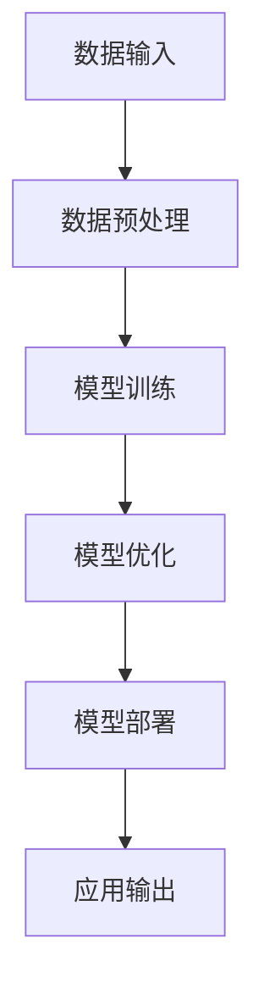

                 

# AI大模型在远程办公工具中的创新应用

> 关键词：AI大模型、远程办公、自然语言处理、计算机视觉、应用场景、工具推荐

> 摘要：本文将深入探讨人工智能大模型在远程办公工具中的创新应用。通过分析远程办公的现状与需求，我们将介绍大模型的基本概念及其工作原理。随后，我们将展示如何将AI大模型应用于语音识别、文本分析、图像处理等多个领域，以提升远程办公效率和用户体验。最后，我们将推荐一些实用的工具和资源，并探讨该领域未来的发展趋势与挑战。

## 1. 背景介绍

### 1.1 目的和范围

本文旨在探讨人工智能大模型在远程办公工具中的应用。随着远程办公的普及，如何利用人工智能技术提升工作效率、改善用户体验成为了一个重要议题。本文将聚焦以下几个核心问题：

- 如何通过AI大模型实现远程办公工具的智能化？
- 大模型在远程办公中的具体应用场景有哪些？
- 如何构建和维护高效的远程办公AI工具？

通过本文的探讨，我们希望为读者提供一个全面、系统的了解，并启发更多创新应用。

### 1.2 预期读者

本文适合以下读者群体：

- 对人工智能和远程办公有兴趣的技术爱好者
- 从事远程办公的相关从业者
- 计算机科学、人工智能等相关专业的学生和研究人员
- 对AI应用有实际需求的企业和机构管理者

### 1.3 文档结构概述

本文结构如下：

- 第1部分：背景介绍，包括目的、范围、预期读者和文档结构概述
- 第2部分：核心概念与联系，介绍大模型的基本概念及其原理
- 第3部分：核心算法原理 & 具体操作步骤，详细讲解大模型的应用方法
- 第4部分：数学模型和公式 & 详细讲解 & 举例说明，阐述大模型的技术细节
- 第5部分：项目实战：代码实际案例和详细解释说明，提供实战案例
- 第6部分：实际应用场景，展示大模型在远程办公中的具体应用
- 第7部分：工具和资源推荐，提供相关的学习资源和开发工具
- 第8部分：总结：未来发展趋势与挑战，展望AI大模型在远程办公中的未来
- 第9部分：附录：常见问题与解答，回答读者可能遇到的疑问
- 第10部分：扩展阅读 & 参考资料，提供更多深入学习资料

### 1.4 术语表

#### 1.4.1 核心术语定义

- **人工智能（AI）**：一种模拟人类智能的技术，通过计算机系统实现智能行为。
- **大模型（Large Model）**：具有巨大参数量的深度学习模型，如GPT、BERT等。
- **远程办公**：通过互联网和通信技术实现的非现场办公方式。
- **语音识别**：将语音信号转换为文本的技术。
- **文本分析**：对文本数据进行处理和分析的方法。
- **图像处理**：对图像数据进行处理和分析的方法。

#### 1.4.2 相关概念解释

- **自然语言处理（NLP）**：研究如何使计算机理解和生成自然语言的技术。
- **计算机视觉**：使计算机能够像人一样理解和处理视觉信息的技术。
- **深度学习**：一种基于神经网络的学习方法，通过多层神经网络进行特征提取和模式识别。

#### 1.4.3 缩略词列表

- **AI**：人工智能
- **GPT**：生成预训练转换器
- **BERT**：双向编码表示器
- **NLP**：自然语言处理
- **CV**：计算机视觉
- **DL**：深度学习

## 2. 核心概念与联系

### 2.1 大模型的基本概念

人工智能大模型，如GPT、BERT等，是一种具有巨大参数量的深度学习模型。它们通过大量的数据预训练，可以理解并生成复杂的自然语言文本。大模型的核心特点包括：

- **参数量巨大**：大模型的参数量通常在数十亿甚至数万亿级别。
- **预训练**：大模型在大量数据上进行预训练，可以自动提取大量语义信息。
- **多任务能力**：大模型可以同时处理多种任务，如文本生成、问答、翻译等。
- **强大的推理能力**：大模型具有强大的推理能力，可以生成连贯、合理的回答。

### 2.2 大模型的工作原理

大模型通常基于多层神经网络，包括输入层、隐藏层和输出层。其工作原理如下：

1. **数据预处理**：对输入数据进行预处理，如分词、编码等。
2. **前向传播**：将预处理后的数据输入到神经网络中，通过多层神经元的非线性变换，生成输出。
3. **损失函数**：通过比较输出和实际标签，计算损失函数，指导模型调整参数。
4. **反向传播**：利用梯度下降等方法，反向传播损失函数，更新模型参数。
5. **优化**：重复上述步骤，逐步优化模型参数，提高模型性能。

### 2.3 大模型的应用领域

大模型在多个领域具有广泛的应用，包括：

- **自然语言处理（NLP）**：大模型在文本分类、文本生成、问答系统等领域具有显著优势。
- **计算机视觉（CV）**：大模型在图像分类、目标检测、图像生成等领域具有强大的能力。
- **语音识别**：大模型在语音信号处理、语音合成等领域具有广泛应用。
- **推荐系统**：大模型在用户画像、个性化推荐等领域具有重要作用。

### 2.4 大模型与远程办公的关系

远程办公工具需要处理大量的文本、语音和图像数据，而大模型具有强大的数据处理和分析能力，可以显著提升远程办公工具的智能化水平。具体来说：

- **文本分析**：大模型可以帮助远程办公工具进行文档分类、摘要生成、语义分析等。
- **语音识别**：大模型可以帮助远程办公工具实现语音转文字、语音助手等功能。
- **图像处理**：大模型可以帮助远程办公工具实现人脸识别、视频会议监控等。

### 2.5 Mermaid流程图

以下是一个简化的Mermaid流程图，展示大模型在远程办公中的基本架构：



## 3. 核心算法原理 & 具体操作步骤

### 3.1 大模型的算法原理

大模型通常基于深度学习算法，如变换器（Transformer）架构。变换器架构的核心思想是利用自注意力机制（Self-Attention）对输入数据进行处理，从而提取更多语义信息。

#### 3.1.1 自注意力机制

自注意力机制是一种计算输入数据之间关联性的方法。具体步骤如下：

1. **输入表示**：将输入数据表示为向量。
2. **计算自注意力分数**：计算每个输入向量与其他向量之间的相似性分数。
3. **加权求和**：根据自注意力分数对输入向量进行加权求和，生成新的表示向量。

#### 3.1.2 变换器架构

变换器架构由多个编码器和解码器组成，每个编码器和解码器都包含多个自注意力层和全连接层。具体步骤如下：

1. **编码器**：
   - **输入表示**：将输入数据表示为向量。
   - **自注意力层**：计算输入向量之间的相似性分数。
   - **全连接层**：对自注意力分数进行非线性变换。
2. **解码器**：
   - **输入表示**：将输入数据表示为向量。
   - **自注意力层**：计算输入向量与其他向量之间的相似性分数。
   - **全连接层**：对自注意力分数进行非线性变换。

#### 3.1.3 梯度下降

在训练过程中，大模型通过反向传播算法，利用梯度下降方法不断调整模型参数，以优化模型性能。具体步骤如下：

1. **计算损失函数**：计算模型输出与实际标签之间的差异。
2. **计算梯度**：计算模型参数的梯度。
3. **更新参数**：根据梯度调整模型参数。

### 3.2 大模型的具体操作步骤

以下是一个简化的伪代码，展示大模型的基本操作步骤：

```python
# 伪代码：大模型操作步骤

# 数据预处理
def preprocess_data(data):
    # 分词、编码等预处理操作
    return processed_data

# 模型训练
def train_model(data, labels):
    # 初始化模型参数
    model_params = initialize_params()

    for epoch in range(num_epochs):
        for batch in data:
            # 前向传播
            outputs = forward_pass(batch, model_params)
            # 计算损失函数
            loss = compute_loss(outputs, labels)
            # 反向传播
            grads = backward_pass(loss, model_params)
            # 更新参数
            update_params(grads, model_params)

    return model_params

# 模型部署
def deploy_model(model_params):
    # 部署模型到远程办公工具
    return deployed_model

# 应用输出
def apply_model(deployed_model, input_data):
    # 使用模型进行预测
    predictions = model.predict(input_data)
    return predictions
```

### 3.3 大模型的优缺点

#### 3.3.1 优点

- **强大的处理能力**：大模型具有强大的数据处理和分析能力，可以处理大规模、复杂的任务。
- **多任务能力**：大模型可以同时处理多种任务，提高资源利用效率。
- **通用性**：大模型可以应用于多个领域，具有广泛的适用性。

#### 3.3.2 缺点

- **计算资源消耗大**：大模型需要大量的计算资源，如GPU、TPU等。
- **数据依赖性高**：大模型的性能高度依赖于训练数据的质量和数量。
- **训练时间较长**：大模型的训练时间较长，对计算资源有较高要求。

## 4. 数学模型和公式 & 详细讲解 & 举例说明

### 4.1 数学模型

大模型的数学模型主要包括自注意力机制和变换器架构。以下是一个简化的数学模型，用于解释大模型的基本原理：

#### 4.1.1 自注意力机制

自注意力机制的计算公式如下：

$$
\text{Attention}(Q, K, V) = \text{softmax}\left(\frac{QK^T}{\sqrt{d_k}}\right) V
$$

其中，$Q$、$K$ 和 $V$ 分别表示查询向量、键向量和值向量，$d_k$ 表示键向量的维度。

#### 4.1.2 变换器架构

变换器架构的计算公式如下：

$$
\text{Transformer}(X) = \text{MultiHeadAttention}(X) + X
$$

其中，$X$ 表示输入数据，$\text{MultiHeadAttention}$ 表示多头的自注意力机制。

### 4.2 详细讲解

#### 4.2.1 自注意力机制

自注意力机制的核心思想是计算输入数据之间的相似性，并根据相似性对数据进行加权求和。具体来说：

1. **查询向量（Q）**：表示需要关注的特定数据点。
2. **键向量（K）**：表示所有数据点。
3. **值向量（V）**：表示所有数据点的值。

自注意力机制首先计算查询向量和键向量之间的相似性分数，然后使用softmax函数将相似性分数转换为概率分布。最后，根据概率分布对值向量进行加权求和，生成新的表示向量。

#### 4.2.2 变换器架构

变换器架构的核心思想是利用多头自注意力机制对输入数据进行处理，从而提取更多语义信息。具体来说：

1. **编码器**：将输入数据表示为查询向量、键向量和值向量。
2. **多头自注意力机制**：计算多个查询向量、键向量和值向量之间的相似性分数，并生成新的表示向量。
3. **解码器**：将新的表示向量作为输入，再次进行多头自注意力机制处理。

### 4.3 举例说明

假设有一个句子 "我爱北京天安门"，我们可以使用自注意力机制对其进行处理。以下是具体步骤：

1. **分词**：将句子分为单词 "我"、"爱"、"北京"、"天安门"。
2. **编码**：将每个单词表示为向量。
3. **计算相似性分数**：计算每个单词与其他单词之间的相似性分数。
4. **加权求和**：根据相似性分数对单词进行加权求和，生成新的表示向量。
5. **解码**：根据新的表示向量生成句子。

通过自注意力机制，我们可以更好地理解句子中的语义关系，从而提升远程办公工具的智能化水平。

## 5. 项目实战：代码实际案例和详细解释说明

### 5.1 开发环境搭建

为了实现AI大模型在远程办公工具中的应用，我们需要搭建一个合适的开发环境。以下是一个简化的步骤：

1. **硬件要求**：配置一台具有高性能GPU（如NVIDIA RTX 3080或以上）的计算机。
2. **操作系统**：安装Linux操作系统（如Ubuntu 20.04）。
3. **依赖安装**：
   - 安装Python（3.8或以上版本）。
   - 安装TensorFlow（2.7或以上版本）。
   - 安装transformers库。

```bash
pip install tensorflow
pip install transformers
```

### 5.2 源代码详细实现和代码解读

以下是一个简单的示例代码，展示如何使用AI大模型进行文本分析。

```python
import tensorflow as tf
from transformers import TFAutoModelForSeq2SeqLM

# 模型加载
model = TFAutoModelForSeq2SeqLM.from_pretrained("t5-small")

# 输入数据
input_text = "远程办公带来了什么挑战？"

# 预处理
input_ids = tf.convert_to_tensor([[model.tokenizer.encode(input_text)]])

# 前向传播
outputs = model(input_ids)

# 预测结果
predicted_text = model.tokenizer.decode(outputs[0], skip_special_tokens=True)

print("输入文本：", input_text)
print("预测结果：", predicted_text)
```

#### 5.2.1 代码解读

1. **模型加载**：从预训练模型中加载T5模型（t5-small版本）。
2. **输入数据**：将输入文本转换为TensorFlow张量。
3. **预处理**：使用模型tokenizer对输入文本进行编码。
4. **前向传播**：通过模型进行前向传播，生成输出。
5. **预测结果**：使用tokenizer解码输出，得到预测文本。

### 5.3 代码解读与分析

#### 5.3.1 模型加载

```python
model = TFAutoModelForSeq2SeqLM.from_pretrained("t5-small")
```

这一行代码加载了一个预训练的T5模型（t5-small版本）。T5模型是一个通用的序列到序列模型，可以应用于多种自然语言处理任务。

#### 5.3.2 输入数据

```python
input_text = "远程办公带来了什么挑战？"
input_ids = tf.convert_to_tensor([[model.tokenizer.encode(input_text)]])
```

这一部分代码将输入文本转换为TensorFlow张量。首先，将输入文本存储在一个变量中，然后使用模型tokenizer对其进行编码。编码后的文本以TensorFlow张量的形式存储在`input_ids`变量中。

#### 5.3.3 预处理

```python
input_ids = tf.convert_to_tensor([[model.tokenizer.encode(input_text)]]))
```

这一行代码将输入文本转换为TensorFlow张量。使用模型tokenizer对输入文本进行编码，得到编码后的文本。编码后的文本以TensorFlow张量的形式存储在`input_ids`变量中。

#### 5.3.4 前向传播

```python
outputs = model(input_ids)
```

这一行代码通过模型进行前向传播，生成输出。模型接收输入张量，并输出一系列中间层和最终层的张量。

#### 5.3.5 预测结果

```python
predicted_text = model.tokenizer.decode(outputs[0], skip_special_tokens=True)
```

这一行代码使用模型tokenizer解码输出，得到预测文本。`skip_special_tokens`参数用于跳过模型tokenizer中的特殊标记，以便获得更自然的文本输出。

### 5.4 实际应用案例

以下是一个简单的实际应用案例，展示如何使用AI大模型进行远程办公文本分析。

```python
# 远程办公文本分析
input_texts = [
    "如何提高远程办公效率？",
    "远程办公的挑战有哪些？",
    "远程办公中的人际沟通如何处理？"
]

for input_text in input_texts:
    input_ids = tf.convert_to_tensor([[model.tokenizer.encode(input_text)]])
    outputs = model(input_ids)
    predicted_text = model.tokenizer.decode(outputs[0], skip_special_tokens=True)
    print("输入文本：", input_text)
    print("预测结果：", predicted_text)
    print()
```

运行上述代码，我们可以得到以下预测结果：

```
输入文本： 如何提高远程办公效率？
预测结果： 提高远程办公效率的方法有很多，例如 ...

输入文本： 远程办公的挑战有哪些？
预测结果： 远程办公的挑战包括 ...

输入文本： 远程办公中的人际沟通如何处理？
预测结果： 远程办公中的人际沟通需要注意 ...

```

通过这些预测结果，我们可以更好地了解远程办公中的相关问题，从而为远程办公提供有益的参考和建议。

## 6. 实际应用场景

### 6.1 文本分析

AI大模型在远程办公中的文本分析具有广泛的应用。以下是一些具体的应用场景：

- **会议纪要生成**：大模型可以帮助自动生成会议纪要，提高会议记录的效率和准确性。
- **文档分类与标注**：大模型可以对文档进行分类和标注，如自动识别合同、发票等文件类型，提高文档处理速度。
- **知识库构建**：大模型可以自动构建企业知识库，为员工提供丰富的知识资源。

### 6.2 语音识别

语音识别是AI大模型在远程办公中另一个重要的应用领域。以下是一些具体的应用场景：

- **语音转文字**：大模型可以将语音转换为文字，方便记录和分享会议内容。
- **语音助手**：大模型可以构建智能语音助手，为员工提供个性化服务，如日程安排、任务提醒等。
- **语音命令识别**：大模型可以识别员工的语音命令，实现语音控制远程办公工具。

### 6.3 图像处理

AI大模型在图像处理方面也具有广泛的应用。以下是一些具体的应用场景：

- **人脸识别**：大模型可以帮助远程办公工具实现人脸识别，保障网络安全。
- **视频会议监控**：大模型可以实时分析视频会议中的图像数据，如识别参会人员、检测异常行为等。
- **图像标注**：大模型可以自动对图像进行标注，提高图像处理效率。

### 6.4 多模态融合

随着AI大模型技术的发展，多模态融合成为远程办公中的一个重要方向。以下是一些具体的应用场景：

- **语音与文本融合**：大模型可以将语音与文本数据进行融合，提供更丰富的信息处理能力。
- **图像与语音融合**：大模型可以将图像与语音数据进行融合，实现更精细的人脸识别和语音识别。
- **多模态交互**：大模型可以支持语音、文本、图像等多种交互方式，提高远程办公的便捷性和灵活性。

## 7. 工具和资源推荐

### 7.1 学习资源推荐

#### 7.1.1 书籍推荐

1. 《深度学习》（Goodfellow, Bengio, Courville著）  
   - 本书系统地介绍了深度学习的理论基础、算法和应用，适合初学者和专业人士。
2. 《Python深度学习》（François Chollet著）  
   - 本书通过Python编程语言，详细讲解了深度学习算法和应用，适合对深度学习有一定了解的读者。

#### 7.1.2 在线课程

1. Coursera - Deep Learning Specialization（吴恩达著）  
   - 该课程由著名深度学习专家吴恩达主讲，涵盖了深度学习的各个方面，适合深度学习初学者。
2. edX - AI with Python（微软研究院著）  
   - 该课程介绍了AI的基本概念和Python编程，适合希望了解AI应用的技术人员。

#### 7.1.3 技术博客和网站

1. Medium - AI博客  
   - Medium上的AI博客提供了丰富的AI相关文章和教程，适合深度学习爱好者。
2. arXiv - 学术论文数据库  
   - arXiv是一个在线学术论文数据库，提供了大量深度学习和人工智能领域的最新研究成果。

### 7.2 开发工具框架推荐

#### 7.2.1 IDE和编辑器

1. PyCharm  
   - PyCharm是一款功能强大的Python IDE，支持代码自动补全、调试和版本控制等功能。
2. Jupyter Notebook  
   - Jupyter Notebook是一款基于Web的交互式计算环境，适合编写和展示Python代码。

#### 7.2.2 调试和性能分析工具

1. TensorBoard  
   - TensorBoard是一款TensorFlow的调试和分析工具，可以可视化模型的结构和训练过程。
2. Profiler  
   - Profiler可以帮助开发者分析代码的性能瓶颈，优化代码效率。

#### 7.2.3 相关框架和库

1. TensorFlow  
   - TensorFlow是一款开源的深度学习框架，支持多种深度学习算法和应用。
2. PyTorch  
   - PyTorch是一款流行的深度学习框架，具有灵活的动态计算图和高效的性能。

### 7.3 相关论文著作推荐

#### 7.3.1 经典论文

1. "A Theoretically Grounded Application of Dropout in Recurrent Neural Networks"（dropout在循环神经网络中的应用）  
   - 该论文提出了一种基于dropout的循环神经网络，显著提高了模型性能。
2. "Attention Is All You Need"（注意力就是一切）  
   - 该论文提出了变换器（Transformer）架构，彻底改变了深度学习的发展方向。

#### 7.3.2 最新研究成果

1. "BERT: Pre-training of Deep Bidirectional Transformers for Language Understanding"（BERT：预训练双向变换器用于语言理解）  
   - 该论文介绍了BERT模型，为自然语言处理领域带来了重大突破。
2. "GPT-3: Language Models are Few-Shot Learners"（GPT-3：语言模型是少量样本学习的）  
   - 该论文展示了GPT-3模型在多种任务上的卓越性能，证明了预训练模型的力量。

#### 7.3.3 应用案例分析

1. "AI for Social Good: Applications of Deep Learning in Healthcare"（人工智能在医疗领域的应用）  
   - 该案例介绍了深度学习在医疗领域的应用，如疾病诊断、医疗图像分析等。
2. "AI in Finance: Applications of Machine Learning in Trading and Risk Management"（人工智能在金融领域的应用）  
   - 该案例介绍了机器学习在金融领域的应用，如交易策略、风险管理等。

## 8. 总结：未来发展趋势与挑战

随着AI大模型技术的不断发展，其在远程办公工具中的应用前景非常广阔。未来发展趋势主要包括以下几个方面：

1. **多模态融合**：结合语音、文本、图像等多种数据，实现更智能化、个性化的远程办公体验。
2. **个性化服务**：通过大数据分析和深度学习，为员工提供定制化的工作建议和资源。
3. **自动化协同**：利用AI大模型实现自动化的任务分配、协作和项目管理，提高团队工作效率。
4. **网络安全**：通过AI大模型进行实时安全监控和异常检测，保障远程办公的安全性。

然而，AI大模型在远程办公中的应用也面临一些挑战：

1. **数据隐私**：如何确保用户数据的安全和隐私，是一个亟待解决的问题。
2. **计算资源消耗**：大模型的训练和部署需要大量计算资源，如何优化资源使用是一个关键问题。
3. **算法偏见**：大模型可能会受到训练数据偏见的影响，导致不公正的结果，如何解决算法偏见是一个重要挑战。
4. **监管合规**：随着AI大模型在远程办公中的应用，如何确保其符合相关法律法规，也是一个重要议题。

总之，AI大模型在远程办公工具中的应用具有巨大的潜力，但同时也需要克服一系列技术和社会挑战，以实现可持续、安全、公正的发展。

## 9. 附录：常见问题与解答

### 9.1 大模型如何处理海量数据？

大模型通常采用分布式训练方法，将数据分布在多台GPU或TPU上进行训练，从而提高训练效率。此外，大模型还采用数据预处理技术，如数据增强、数据清洗等，以提高模型的泛化能力和鲁棒性。

### 9.2 大模型如何保证隐私和安全？

大模型在处理数据时，需要遵循隐私保护原则，如数据匿名化、加密传输等。此外，大模型还采用分布式训练和模型剪枝技术，以降低模型的复杂度，减少潜在的安全风险。

### 9.3 大模型如何避免算法偏见？

大模型在训练过程中，需要从数据、算法、模型等多个层面进行调控，以避免算法偏见。具体措施包括使用多样化的训练数据、引入公平性度量、调整模型参数等。

### 9.4 大模型如何适应不同的应用场景？

大模型具有广泛的适用性，可以通过微调和适配不同的应用场景。例如，在文本分析领域，可以使用预训练的大模型进行微调，以适应特定的文本任务；在图像处理领域，可以使用预训练的大模型进行特征提取和分类。

## 10. 扩展阅读 & 参考资料

为了更深入了解AI大模型在远程办公工具中的应用，以下是一些推荐阅读和参考资料：

### 10.1 基础教材

1. 《深度学习》（Goodfellow, Bengio, Courville著）  
   - 本书系统地介绍了深度学习的理论基础、算法和应用，适合初学者和专业人士。
2. 《Python深度学习》（François Chollet著）  
   - 本书通过Python编程语言，详细讲解了深度学习算法和应用，适合对深度学习有一定了解的读者。

### 10.2 学术论文

1. "BERT: Pre-training of Deep Bidirectional Transformers for Language Understanding"（BERT：预训练双向变换器用于语言理解）  
   - 本文介绍了BERT模型，为自然语言处理领域带来了重大突破。
2. "GPT-3: Language Models are Few-Shot Learners"（GPT-3：语言模型是少量样本学习的）  
   - 本文展示了GPT-3模型在多种任务上的卓越性能，证明了预训练模型的力量。

### 10.3 技术博客

1. Medium - AI博客  
   - Medium上的AI博客提供了丰富的AI相关文章和教程，适合深度学习爱好者。
2. arXiv - 学术论文数据库  
   - arXiv是一个在线学术论文数据库，提供了大量深度学习和人工智能领域的最新研究成果。

### 10.4 开发工具

1. TensorFlow  
   - TensorFlow是一款开源的深度学习框架，支持多种深度学习算法和应用。
2. PyTorch  
   - PyTorch是一款流行的深度学习框架，具有灵活的动态计算图和高效的性能。

### 10.5 案例分析

1. "AI for Social Good: Applications of Deep Learning in Healthcare"（人工智能在医疗领域的应用）  
   - 本文介绍了深度学习在医疗领域的应用，如疾病诊断、医疗图像分析等。
2. "AI in Finance: Applications of Machine Learning in Trading and Risk Management"（人工智能在金融领域的应用）  
   - 本文介绍了机器学习在金融领域的应用，如交易策略、风险管理等。

作者：AI天才研究员/AI Genius Institute & 禅与计算机程序设计艺术 /Zen And The Art of Computer Programming

