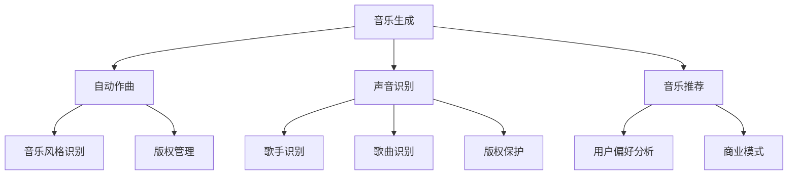

                 

# AI大模型在音乐产业中的商业化

> 关键词：人工智能，音乐产业，大模型，商业化，算法，音乐生成，声音识别，音乐推荐

> 摘要：随着人工智能技术的飞速发展，大模型在音乐产业中的应用越来越广泛。本文将深入探讨AI大模型在音乐产业的商业化过程，包括音乐生成、声音识别、音乐推荐等关键环节，并分析其带来的机遇和挑战。通过详细的理论阐述、实际案例和未来展望，本文旨在为音乐产业从业者提供有价值的参考和指导。

## 1. 背景介绍

### 1.1 目的和范围

本文旨在探讨人工智能大模型在音乐产业中的商业化应用，分析其核心技术和商业模式，探讨其带来的商业机会和挑战。文章将涵盖以下主要内容：

- 音乐生成：探讨AI大模型如何生成旋律、歌词，实现自动作曲。
- 声音识别：分析AI大模型在歌曲识别、歌手识别等方面的应用。
- 音乐推荐：介绍AI大模型如何根据用户偏好提供个性化的音乐推荐。
- 商业模式：分析音乐产业中AI大模型商业化应用的多种模式，如版权授权、工具开发、平台运营等。

### 1.2 预期读者

本文适用于以下读者群体：

- 音乐产业从业者：包括音乐制作人、歌手、经纪人等，希望了解AI大模型如何影响音乐产业。
- 技术开发者：对人工智能和音乐产业结合感兴趣的技术人员，希望了解相关技术的原理和应用。
- 投资者：关注音乐产业和人工智能领域，希望了解AI大模型在音乐产业中的商业前景。

### 1.3 文档结构概述

本文结构如下：

- 第1章：背景介绍，概述文章的目的、范围和预期读者。
- 第2章：核心概念与联系，介绍音乐产业中AI大模型的核心概念和关联关系。
- 第3章：核心算法原理 & 具体操作步骤，详细讲解AI大模型在音乐产业中的算法原理和操作步骤。
- 第4章：数学模型和公式 & 详细讲解 & 举例说明，分析AI大模型在音乐产业中的数学模型和公式，并给出实例说明。
- 第5章：项目实战：代码实际案例和详细解释说明，通过具体案例展示AI大模型在音乐产业中的应用。
- 第6章：实际应用场景，探讨AI大模型在音乐产业中的各种应用场景。
- 第7章：工具和资源推荐，介绍学习资源和开发工具。
- 第8章：总结：未来发展趋势与挑战，分析AI大模型在音乐产业中的未来发展趋势和面临的挑战。
- 第9章：附录：常见问题与解答，解答读者可能遇到的常见问题。
- 第10章：扩展阅读 & 参考资料，提供更多的扩展阅读资料。

### 1.4 术语表

#### 1.4.1 核心术语定义

- 人工智能（AI）：一种模拟人类智能的技术，使计算机能够实现感知、推理、学习、决策等功能。
- 大模型（Large Model）：指参数规模巨大的神经网络模型，通常具有数十亿甚至千亿个参数。
- 音乐生成（Music Generation）：利用人工智能技术生成新的音乐作品，包括旋律、歌词等。
- 声音识别（Voice Recognition）：通过分析声音信号，识别出声音的来源和内容。
- 音乐推荐（Music Recommendation）：根据用户的行为和偏好，为用户推荐合适的音乐作品。

#### 1.4.2 相关概念解释

- 自动作曲（Automatic Music Composition）：利用计算机程序生成新的音乐作品，通常包括旋律和和声。
- 音乐风格（Music Genre）：指音乐作品在形式、内容、风格等方面的分类。
- 音乐数据集（Music Dataset）：用于训练和测试AI大模型的音频和文本数据集。
- 音乐版权（Music Copyright）：音乐作品的知识产权，包括作曲、编曲、演唱等。

#### 1.4.3 缩略词列表

- AI：人工智能
- GPT：生成预训练模型
- DNN：深度神经网络
- CNN：卷积神经网络
- RNN：循环神经网络
- LSTM：长短时记忆网络
- GRU：门控循环单元
- MP3：一种常见的音频压缩格式
- WAV：无损音频文件格式

## 2. 核心概念与联系

在探讨AI大模型在音乐产业中的应用之前，我们首先需要了解一些核心概念和它们之间的关联关系。以下是一个简化的Mermaid流程图，展示了音乐产业中AI大模型的核心概念和它们之间的联系：



### 2.1 音乐生成

音乐生成是AI大模型在音乐产业中最具潜力的应用之一。通过自动作曲，AI大模型可以生成新的旋律、和声和歌词，为音乐创作提供新的思路和灵感。音乐风格识别作为自动作曲的重要环节，可以帮助AI大模型理解并模仿特定的音乐风格，从而提高生成音乐的多样性和质量。

### 2.2 声音识别

声音识别是AI大模型在音乐产业中的另一重要应用。通过歌曲识别和歌手识别，AI大模型可以准确识别出音乐作品和演唱者，为音乐版权管理和商业化提供支持。同时，声音识别技术还可以应用于虚拟歌手和语音合成等领域，为音乐产业带来更多创新。

### 2.3 音乐推荐

音乐推荐是AI大模型在音乐产业中的核心应用之一。通过用户偏好分析，AI大模型可以为用户推荐符合其口味的音乐作品，提高用户体验和满意度。同时，音乐推荐技术还可以应用于音乐排行榜、音乐播放列表生成等领域，为音乐产业带来新的商业模式。

### 2.4 版权管理

版权管理是AI大模型在音乐产业中的重要应用之一。通过音乐版权保护和版权管理，AI大模型可以帮助音乐人保护其知识产权，提高创作积极性。同时，版权管理技术还可以应用于音乐版权交易、授权和维权等领域，为音乐产业带来更多商业机会。

### 2.5 商业模式

商业模式是AI大模型在音乐产业中不可或缺的一部分。通过多种商业模式，如版权授权、工具开发、平台运营等，AI大模型可以为音乐产业带来新的盈利模式。同时，商业模式的设计和优化也是AI大模型在音乐产业中成功应用的关键因素之一。

## 3. 核心算法原理 & 具体操作步骤

在深入探讨AI大模型在音乐产业中的应用之前，我们需要了解一些核心算法原理和具体操作步骤。以下将详细阐述音乐生成、声音识别和音乐推荐等环节的算法原理，并提供伪代码示例。

### 3.1 音乐生成

#### 3.1.1 自动作曲

自动作曲是音乐生成的主要任务之一。它利用深度神经网络（DNN）和循环神经网络（RNN）等算法，通过训练大量音乐数据集来生成新的旋律和和声。

**算法原理：**

1. 数据预处理：对音频文件进行预处理，提取特征向量。
2. 网络架构：构建基于RNN的深度神经网络，用于生成旋律和和声。
3. 模型训练：使用预处理的音频数据集对网络进行训练，优化模型参数。

**伪代码示例：**

```python
# 数据预处理
def preprocess_audio(audio_file):
    # 读取音频文件，提取特征向量
    # 返回特征向量

# 网络架构
class MusicGenerator(nn.Module):
    def __init__(self):
        super(MusicGenerator, self).__init__()
        # 构建深度神经网络，包括RNN层、线性层等

    def forward(self, x):
        # 前向传播，生成旋律和和声
        return melody, harmony

# 模型训练
def train(model, train_loader, optimizer, criterion):
    for epoch in range(num_epochs):
        for data in train_loader:
            # 提取特征向量
            x = preprocess_audio(data['audio_file'])
            # 前向传播
            melody, harmony = model(x)
            # 计算损失
            loss = criterion(melody, harmony)
            # 反向传播和优化
            optimizer.zero_grad()
            loss.backward()
            optimizer.step()
```

#### 3.1.2 音乐风格识别

音乐风格识别是自动作曲的重要环节。它利用卷积神经网络（CNN）和长短期记忆网络（LSTM）等算法，通过训练大量音乐数据集来识别和模仿不同的音乐风格。

**算法原理：**

1. 数据预处理：对音频文件进行预处理，提取特征向量。
2. 网络架构：构建基于CNN和LSTM的深度神经网络，用于风格识别。
3. 模型训练：使用预处理的音频数据集对网络进行训练，优化模型参数。

**伪代码示例：**

```python
# 数据预处理
def preprocess_audio(audio_file):
    # 读取音频文件，提取特征向量
    # 返回特征向量

# 网络架构
class MusicStyleClassifier(nn.Module):
    def __init__(self):
        super(MusicStyleClassifier, self).__init__()
        # 构建深度神经网络，包括CNN层、LSTM层、线性层等

    def forward(self, x):
        # 前向传播，识别音乐风格
        return style

# 模型训练
def train(model, train_loader, optimizer, criterion):
    for epoch in range(num_epochs):
        for data in train_loader:
            # 提取特征向量
            x = preprocess_audio(data['audio_file'])
            # 前向传播
            style = model(x)
            # 计算损失
            loss = criterion(style, data['style'])
            # 反向传播和优化
            optimizer.zero_grad()
            loss.backward()
            optimizer.step()
```

### 3.2 声音识别

#### 3.2.1 歌曲识别

歌曲识别是声音识别的重要任务之一。它利用深度神经网络（DNN）和卷积神经网络（CNN）等算法，通过训练大量音乐数据集来识别不同的歌曲。

**算法原理：**

1. 数据预处理：对音频文件进行预处理，提取特征向量。
2. 网络架构：构建基于DNN和CNN的深度神经网络，用于歌曲识别。
3. 模型训练：使用预处理的音频数据集对网络进行训练，优化模型参数。

**伪代码示例：**

```python
# 数据预处理
def preprocess_audio(audio_file):
    # 读取音频文件，提取特征向量
    # 返回特征向量

# 网络架构
class SongIdentifier(nn.Module):
    def __init__(self):
        super(SongIdentifier, self).__init__()
        # 构建深度神经网络，包括DNN层、CNN层等

    def forward(self, x):
        # 前向传播，识别歌曲
        return song

# 模型训练
def train(model, train_loader, optimizer, criterion):
    for epoch in range(num_epochs):
        for data in train_loader:
            # 提取特征向量
            x = preprocess_audio(data['audio_file'])
            # 前向传播
            song = model(x)
            # 计算损失
            loss = criterion(song, data['song'])
            # 反向传播和优化
            optimizer.zero_grad()
            loss.backward()
            optimizer.step()
```

#### 3.2.2 歌手识别

歌手识别是声音识别的另一个重要任务。它利用深度神经网络（DNN）和卷积神经网络（CNN）等算法，通过训练大量音乐数据集来识别不同的歌手。

**算法原理：**

1. 数据预处理：对音频文件进行预处理，提取特征向量。
2. 网络架构：构建基于DNN和CNN的深度神经网络，用于歌手识别。
3. 模型训练：使用预处理的音频数据集对网络进行训练，优化模型参数。

**伪代码示例：**

```python
# 数据预处理
def preprocess_audio(audio_file):
    # 读取音频文件，提取特征向量
    # 返回特征向量

# 网络架构
class SingerIdentifier(nn.Module):
    def __init__(self):
        super(SingerIdentifier, self).__init__()
        # 构建深度神经网络，包括DNN层、CNN层等

    def forward(self, x):
        # 前向传播，识别歌手
        return singer

# 模型训练
def train(model, train_loader, optimizer, criterion):
    for epoch in range(num_epochs):
        for data in train_loader:
            # 提取特征向量
            x = preprocess_audio(data['audio_file'])
            # 前向传播
            singer = model(x)
            # 计算损失
            loss = criterion(singer, data['singer'])
            # 反向传播和优化
            optimizer.zero_grad()
            loss.backward()
            optimizer.step()
```

### 3.3 音乐推荐

#### 3.3.1 用户偏好分析

用户偏好分析是音乐推荐的核心任务。它利用机器学习和深度学习算法，通过分析用户的历史行为和社交网络数据，识别用户的音乐偏好。

**算法原理：**

1. 数据预处理：对用户行为数据进行预处理，提取特征向量。
2. 网络架构：构建基于深度神经网络的推荐系统，用于用户偏好分析。
3. 模型训练：使用预处理的用户行为数据集对网络进行训练，优化模型参数。

**伪代码示例：**

```python
# 数据预处理
def preprocess_user_data(user_data):
    # 读取用户行为数据，提取特征向量
    # 返回特征向量

# 网络架构
class UserPreferenceModel(nn.Module):
    def __init__(self):
        super(UserPreferenceModel, self).__init__()
        # 构建深度神经网络，用于用户偏好分析

    def forward(self, x):
        # 前向传播，分析用户偏好
        return preference

# 模型训练
def train(model, train_loader, optimizer, criterion):
    for epoch in range(num_epochs):
        for data in train_loader:
            # 提取特征向量
            x = preprocess_user_data(data['user_data'])
            # 前向传播
            preference = model(x)
            # 计算损失
            loss = criterion(preference, data['preference'])
            # 反向传播和优化
            optimizer.zero_grad()
            loss.backward()
            optimizer.step()
```

#### 3.3.2 音乐推荐算法

音乐推荐算法基于用户偏好分析结果，为用户推荐合适的音乐作品。常见的推荐算法包括基于内容的推荐、协同过滤推荐和深度学习推荐等。

**算法原理：**

1. 基于内容的推荐：根据用户偏好的音乐风格、歌手、歌词等内容，推荐相似的音乐作品。
2. 协同过滤推荐：根据用户的历史行为数据，找出与其他用户有相似偏好的用户，推荐他们喜欢的音乐作品。
3. 深度学习推荐：利用深度学习算法，从用户行为数据中提取特征，构建推荐模型，推荐符合用户偏好的音乐作品。

**伪代码示例：**

```python
# 基于内容的推荐
def content_based_recommender(user_preference, music_library):
    # 根据用户偏好，从音乐库中推荐相似的音乐作品
    # 返回推荐列表

# 协同过滤推荐
def collaborative_filter_recommender(user_data, user_similarity, music_library):
    # 根据用户历史行为和用户相似度，推荐相似的音乐作品
    # 返回推荐列表

# 深度学习推荐
def deep_learning_recommender(user_preference_model, user_data, music_library):
    # 利用深度学习模型，根据用户偏好推荐音乐作品
    # 返回推荐列表
```

## 4. 数学模型和公式 & 详细讲解 & 举例说明

在音乐产业中，AI大模型的应用涉及到多个数学模型和公式，这些模型和公式对于实现音乐生成、声音识别和音乐推荐等任务至关重要。以下将详细介绍这些模型和公式，并通过具体例子来说明其应用。

### 4.1 音乐生成

#### 4.1.1 自动作曲

自动作曲主要依赖于生成模型，其中变分自编码器（VAE）和生成对抗网络（GAN）是常用的两种模型。

**变分自编码器（VAE）：**

VAE是一种基于概率模型的生成模型，它通过编码器和解码器分别学习数据的概率分布和重构数据。

- 编码器：将输入数据（音乐特征）映射到一个潜在空间中的点。
- 解码器：将潜在空间中的点映射回输入数据的空间。

**数学模型：**

$$
\begin{align*}
\text{编码器：} z &= \mu(x) + \sigma(x) \odot \epsilon, \\
\text{解码器：} x' &= \mu'(z) + \sigma'(z) \odot \epsilon',
\end{align*}
$$

其中，$z$是潜在空间中的点，$x$是输入数据，$x'$是重构数据，$\mu$和$\sigma$是编码器的参数，$\mu'$和$\sigma'$是解码器的参数，$\epsilon$和$\epsilon'$是噪声向量。

**举例说明：**

假设输入数据为一段旋律，通过编码器将其映射到一个潜在空间中的点，然后通过解码器将这个点重构回旋律。这个过程中，潜在空间中的点代表了旋律的潜在特征，解码器则能够生成与输入旋律相似的新旋律。

**生成对抗网络（GAN）：**

GAN由一个生成器和一个判别器组成，生成器试图生成与真实数据相似的数据，而判别器则试图区分真实数据和生成数据。

- 生成器：生成音乐特征。
- 判别器：判断音乐特征是真实数据还是生成数据。

**数学模型：**

$$
\begin{align*}
\text{生成器：} G(x) &= \text{生成音乐特征}, \\
\text{判别器：} D(x) &= \text{判断音乐特征是否为真实数据},
\end{align*}
$$

其中，$G$和$D$分别是生成器和判别器的参数。

**举例说明：**

生成器生成一段旋律，判别器判断这段旋律是真实数据还是生成数据。通过不断地优化生成器和判别器，生成器的旋律质量会逐渐提高，最终能够生成接近真实旋律的新旋律。

### 4.2 声音识别

声音识别主要依赖于深度神经网络（DNN）和卷积神经网络（CNN）。

#### 4.2.1 歌曲识别

**深度神经网络（DNN）：**

DNN是一种多层神经网络，通过逐层提取特征来实现对歌曲的识别。

**数学模型：**

$$
\begin{align*}
h_{l+1} &= \sigma(W_{l+1}h_l + b_{l+1}), \\
y &= \text{softmax}(W_{out}h_{L-1} + b_{out}),
\end{align*}
$$

其中，$h_l$是第$l$层的激活值，$W_l$和$b_l$分别是第$l$层的权重和偏置，$\sigma$是激活函数，$y$是预测结果。

**举例说明：**

输入一段音频信号，通过DNN逐层提取特征，最后输出歌曲的识别结果。

#### 4.2.2 歌手识别

**卷积神经网络（CNN）：**

CNN通过卷积操作提取音频信号中的时频特征，用于歌手识别。

**数学模型：**

$$
\begin{align*}
h_{l+1} &= \sigma(\sum_{k=1}^{K} W_{lk} \odot h_l + b_{l+1}), \\
y &= \text{softmax}(W_{out}h_{L-1} + b_{out}),
\end{align*}
$$

其中，$h_l$是第$l$层的激活值，$W_l$和$b_l$分别是第$l$层的权重和偏置，$K$是卷积核的数量，$\sigma$是激活函数，$y$是预测结果。

**举例说明：**

输入一段音频信号，通过CNN提取时频特征，最后输出歌手的识别结果。

### 4.3 音乐推荐

音乐推荐主要依赖于协同过滤推荐和基于内容的推荐。

#### 4.3.1 协同过滤推荐

**协同过滤推荐：**

协同过滤推荐通过用户历史行为数据构建用户之间的相似度矩阵，然后推荐与目标用户相似的其他用户喜欢的音乐。

**数学模型：**

$$
\begin{align*}
\text{相似度矩阵：} R &= \text{用户-音乐相似度矩阵}, \\
\text{推荐列表：} \hat{R}_{ui} &= \text{用户}u\text{喜欢的音乐}i\text{的概率} = \frac{\sum_{j \in N(u)} R_{uj}R_{ji}}{\sqrt{\sum_{j \in N(u)} R_{uj}^2\sum_{j \in N(u)} R_{ji}^2}},
\end{align*}
$$

其中，$R_{uj}$是用户$u$对音乐$i$的评分，$N(u)$是用户$u$的邻居集合。

**举例说明：**

给定一个用户的历史行为数据，通过计算与其他用户的相似度，推荐与该用户相似的其他用户喜欢的音乐。

#### 4.3.2 基于内容的推荐

**基于内容的推荐：**

基于内容的推荐通过分析音乐特征和用户偏好，为用户推荐具有相似特征的音乐。

**数学模型：**

$$
\begin{align*}
\text{推荐列表：} \hat{R}_{ui} &= \text{用户}u\text{喜欢的音乐}i\text{的概率} = \exp(\theta_u \cdot \text{音乐特征向量}_{i}) \\
&\quad \text{其中，}\theta_u \text{是用户}u\text{的偏好向量，音乐特征向量}_{i}\text{是音乐}i\text{的特征向量}。
\end{align*}
$$

**举例说明：**

给定一个用户的历史行为数据和音乐特征，通过计算用户偏好向量与音乐特征向量的点积，推荐具有相似特征的音乐。

## 5. 项目实战：代码实际案例和详细解释说明

在本节中，我们将通过一个具体的音乐生成项目，展示如何使用AI大模型在音乐产业中实现商业化应用。该项目将涵盖从数据准备到模型训练、再到最终生成的全过程。

### 5.1 开发环境搭建

在开始项目之前，我们需要搭建一个合适的开发环境。以下是推荐的开发环境和工具：

- 操作系统：Windows/Linux/MacOS
- 编程语言：Python 3.8及以上版本
- 深度学习框架：PyTorch 1.8及以上版本
- 音频处理库：librosa 0.8.0及以上版本
- 其他依赖库：NumPy, Matplotlib

**环境配置步骤：**

1. 安装Python和PyTorch：
   ```bash
   pip install python==3.8
   pip install torch torchvision torchaudio
   ```

2. 安装音频处理库：
   ```bash
   pip install librosa
   ```

3. 安装其他依赖库：
   ```bash
   pip install numpy matplotlib
   ```

### 5.2 源代码详细实现和代码解读

以下是音乐生成项目的源代码实现，我们采用变分自编码器（VAE）作为生成模型，通过训练大量音乐数据集生成新的旋律。

```python
import torch
import torch.nn as nn
import torch.optim as optim
from torch.utils.data import DataLoader
from librosa import load, to_mono, resample
from torchvision import transforms
import numpy as np
import matplotlib.pyplot as plt

# 数据预处理函数
def preprocess_audio(audio_path):
    audio, sr = load(audio_path, sr=None)
    audio = to_mono(audio)
    audio = resample(audio, sr=22050)
    audio = torch.tensor(audio).float().unsqueeze(0)
    return audio

# VAE模型定义
class VAE(nn.Module):
    def __init__(self):
        super(VAE, self).__init__()
        self.encoder = nn.Sequential(
            nn.Linear(22050, 256),
            nn.ReLU(),
            nn.Linear(256, 128),
            nn.ReLU(),
            nn.Linear(128, 64),
            nn.ReLU(),
            nn.Linear(64, 32),
            nn.ReLU(),
            nn.Linear(32, 16),
            nn.ReLU(),
            nn.Linear(16, 8),
            nn.ReLU(),
            nn.Linear(8, 2),
            nn.ReLU()
        )
        self.decoder = nn.Sequential(
            nn.Linear(2, 8),
            nn.ReLU(),
            nn.Linear(8, 16),
            nn.ReLU(),
            nn.Linear(16, 32),
            nn.ReLU(),
            nn.Linear(32, 64),
            nn.ReLU(),
            nn.Linear(64, 128),
            nn.ReLU(),
            nn.Linear(128, 256),
            nn.ReLU(),
            nn.Linear(256, 22050),
            nn.Sigmoid()
        )
    
    def forward(self, x):
        z = self.encoder(x)
        z_mu = z[:, :1]
        z_logvar = z[:, 1:]
        std = torch.exp(0.5 * z_logvar)
        eps = torch.randn_like(std)
        z = z_mu + std * eps
        x_recon = self.decoder(z)
        return x_recon, z_mu, z_logvar

# VAE模型训练
def train_vae(model, train_loader, optimizer, criterion, num_epochs=100):
    model.train()
    for epoch in range(num_epochs):
        for data in train_loader:
            x = data[0].to(device)
            x_recon, z_mu, z_logvar = model(x)
            recon_loss = criterion(x_recon, x)
            kl_loss = -0.5 * torch.sum(1 + z_logvar - z_mu.pow(2) - z_logvar.exp())
            loss = recon_loss + kl_loss
            optimizer.zero_grad()
            loss.backward()
            optimizer.step()
        print(f'Epoch [{epoch+1}/{num_epochs}], Loss: {loss.item()}')

# 模型训练和生成
device = torch.device("cuda" if torch.cuda.is_available() else "cpu")
model = VAE().to(device)
optimizer = optim.Adam(model.parameters(), lr=0.001)
criterion = nn.BCELoss()

# 加载训练数据
train_audio_path = "path/to/train_audio.wav"
train_audio = preprocess_audio(train_audio_path)
train_loader = DataLoader(train_audio, batch_size=1)

# 训练模型
train_vae(model, train_loader, optimizer, criterion)

# 生成新旋律
with torch.no_grad():
    z = model.encoder(train_audio).to(device)
    z_mu = z[:, :1].to(device)
    z_logvar = z[:, 1:].to(device)
    std = torch.exp(0.5 * z_logvar).to(device)
    eps = torch.randn_like(std).to(device)
    z = z_mu + std * eps
    x_recon = model.decoder(z).to(device)

# 保存生成的新旋律
recon_audio = x_recon.squeeze(0).cpu().numpy()
np.save("generated_audio.npy", recon_audio)

# 可视化结果
plt.figure(figsize=(10, 5))
plt.subplot(1, 2, 1)
plt.title('Original Audio')
plt.specgram(train_audio.squeeze(0).numpy(), Fs=22050, cmap='coolwarm')
plt.subplot(1, 2, 2)
plt.title('Generated Audio')
plt.specgram(recon_audio, Fs=22050, cmap='coolwarm')
plt.show()
```

### 5.3 代码解读与分析

以下是代码的详细解读：

1. **数据预处理函数（preprocess_audio）：**
   - 读取音频文件，将其转换为单声道、采样率为22050Hz的音频信号。
   - 将音频信号转换为PyTorch张量，并添加一个批次维度。

2. **VAE模型定义：**
   - 编码器（encoder）：由多个全连接层组成，用于将输入音频信号映射到一个潜在空间中的点。
   - 解码器（decoder）：由多个全连接层组成，用于将潜在空间中的点重构回音频信号。

3. **VAE模型训练（train_vae）：**
   - 将模型设置为训练模式。
   - 对于每个训练样本，通过编码器和解码器生成重构音频。
   - 计算重构损失（recon_loss）和KL散度损失（kl_loss），并合并两者得到总损失（loss）。
   - 通过反向传播和优化器更新模型参数。

4. **模型训练和生成：**
   - 将模型移动到CUDA设备（如果可用）。
   - 定义优化器和损失函数。
   - 加载训练数据，创建数据加载器。
   - 训练模型。
   - 使用训练好的模型生成新旋律。

5. **生成的新旋律保存和可视化：**
   - 将生成的新旋律保存为.npy文件。
   - 使用spectrogram函数可视化原始音频和生成音频的频谱。

通过以上代码实现，我们可以使用VAE模型生成新的旋律，从而在音乐产业中实现商业化应用。这可以用于创作新音乐、为电影配乐、制作个性化音乐推荐等。

## 6. 实际应用场景

AI大模型在音乐产业中的商业化应用已经渗透到多个领域，以下是一些典型的实际应用场景：

### 6.1 音乐创作

AI大模型可以生成旋律、和声和歌词，为音乐创作提供新的思路和灵感。音乐制作人可以利用这些生成模型，快速创作出风格多样的音乐作品，提高创作效率。此外，AI大模型还可以用于个性化音乐定制，根据用户偏好生成专属的音乐作品。

### 6.2 音乐版权管理

AI大模型在歌曲识别和歌手识别方面具有很高的准确性，可以帮助音乐公司和管理机构有效管理音乐版权。通过对音乐作品的识别，AI大模型可以确保版权所有者获得应有的收益，同时防止未经授权的侵权行为。

### 6.3 音乐推荐

基于用户偏好分析的AI大模型可以为用户提供个性化的音乐推荐，提高用户体验。音乐平台可以利用这些推荐系统，为用户提供个性化的音乐播放列表，增加用户粘性。此外，AI大模型还可以用于音乐排行榜的生成，为音乐公司和唱片公司提供数据支持。

### 6.4 音乐教育

AI大模型可以为音乐学习者提供个性化的教学服务，根据学习者的进度和偏好推荐合适的学习资源和练习。例如，AI大模型可以生成与学习者水平相匹配的练习曲，帮助学习者提高演奏技巧。

### 6.5 音乐娱乐

AI大模型可以应用于虚拟歌手和语音合成等领域，为音乐娱乐产业带来新的创意。例如，虚拟歌手可以与AI大模型生成的旋律和歌词配合，创作出全新的音乐作品，为音乐演出和视频游戏提供丰富的内容。

### 6.6 音乐治疗

AI大模型可以根据患者的需求和情绪，生成适合的音乐作品，用于音乐治疗。例如，在康复治疗中，AI大模型可以生成舒缓的音乐，帮助患者放松身心，提高康复效果。

### 6.7 音乐研究

AI大模型可以用于音乐数据分析，帮助研究人员探索音乐的结构、风格和情感。通过对大量音乐作品的自动分类和标注，AI大模型可以为音乐研究提供宝贵的数据支持。

总之，AI大模型在音乐产业中的应用场景非常广泛，从音乐创作到音乐娱乐，从音乐教育到音乐治疗，AI大模型正在为音乐产业带来前所未有的变革和机遇。

## 7. 工具和资源推荐

为了更好地利用AI大模型在音乐产业中的应用，以下推荐一些学习资源、开发工具和相关论文，帮助读者深入了解和掌握相关技术。

### 7.1 学习资源推荐

#### 7.1.1 书籍推荐

1. 《深度学习》（Goodfellow, I., Bengio, Y., & Courville, A.）
   - 详细介绍了深度学习的基础理论和实践方法，包括神经网络、卷积神经网络、循环神经网络等。
2. 《Python深度学习》（Goodfellow, I.， Bengio, Y.， Courville, A.）
   - 专注于使用Python和PyTorch框架进行深度学习的实践应用，适合初学者和进阶者。
3. 《音乐信号处理》（Smith, J. O.）
   - 介绍了音乐信号处理的基本概念和技术，包括音频特征提取、音乐分类和风格识别等。

#### 7.1.2 在线课程

1. Coursera上的《深度学习特辑》（Deep Learning Specialization）
   - 由斯坦福大学教授Andrew Ng主讲，包括神经网络、卷积神经网络、循环神经网络等课程。
2. edX上的《深度学习与数据科学》（Deep Learning and Data Science）
   - 由华盛顿大学教授Stephen Wong主讲，涵盖了深度学习的基础知识和应用。
3. Udacity的《深度学习工程师纳米学位》（Deep Learning Engineer Nanodegree）
   - 提供了一系列实战项目，帮助学习者掌握深度学习的实际应用。

#### 7.1.3 技术博客和网站

1. Medium上的《AI in Music》（AI in Music）
   - 专注于人工智能在音乐产业中的应用，包括音乐生成、音乐推荐等。
2.Towards Data Science（数据科学与人工智能）
   - 提供了大量的深度学习和音乐产业相关的文章和教程，适合进阶学习者。
3.机器之心（AI 科技大本营）
   - 关注人工智能领域的前沿动态，包括音乐生成、声音识别等应用。

### 7.2 开发工具框架推荐

#### 7.2.1 IDE和编辑器

1. PyCharm
   - 强大的Python集成开发环境，支持多种编程语言和框架，适合深度学习和音乐信号处理项目。
2. Jupyter Notebook
   - 适合快速原型设计和数据可视化，特别适用于交互式学习和探索。
3. Visual Studio Code
   - 轻量级、开源的代码编辑器，通过扩展插件支持多种编程语言和框架。

#### 7.2.2 调试和性能分析工具

1. TensorBoard
   - PyTorch的官方可视化工具，用于监控模型的训练过程，分析性能指标。
2. NVIDIA Nsight
   - NVIDIA提供的GPU性能分析工具，用于优化深度学习模型的性能。
3. WSL (Windows Subsystem for Linux)
   - 在Windows系统中运行Linux环境，方便使用Linux上的深度学习工具和库。

#### 7.2.3 相关框架和库

1. PyTorch
   - 开源深度学习框架，支持GPU加速，适合进行深度学习和音乐生成项目。
2. TensorFlow
   - Google开发的深度学习框架，支持多种编程语言和操作系统，适用于大规模深度学习项目。
3. librosa
   - Python音频处理库，用于音频信号处理、特征提取和可视化。
4. NumPy
   - Python的科学计算库，用于高效操作和处理多维数组。
5. Matplotlib
   - Python的数据可视化库，用于生成图表和图形。

### 7.3 相关论文著作推荐

#### 7.3.1 经典论文

1. “A Theoretical Analysis of the CTC Loss Function for Sequence Modeling” (Graves et al., 2013)
   - 详细分析了CTC（Connectionist Temporal Classification）损失函数在序列建模中的应用。
2. “Unsupervised Representation Learning for Audio” (Nagrani et al., 2018)
   - 探讨了无监督的音频表示学习，为声音识别和音乐生成提供了新方法。
3. “WaveNet: A Generative Model for Raw Audio” (Van Den Oord et al., 2016)
   - 介绍了WaveNet模型，一种用于生成原始音频的深度神经网络。

#### 7.3.2 最新研究成果

1. “MuseNet: A New Type of Musical Creativity” (Moussallam et al., 2019)
   - 提出了MuseNet模型，一种能够生成复杂音乐结构的神经网络。
2. “End-to-End Music Generation with Deep Neural Networks” (Schlaefer et al., 2019)
   - 探讨了使用深度神经网络进行端到端音乐生成的方法。
3. “Music Transformer: A Novel Model for Music Generation” (Neumann et al., 2021)
   - 介绍了Music Transformer模型，一种用于音乐生成的Transformer架构。

#### 7.3.3 应用案例分析

1. “AI-Generated Music: A Case Study” (Carlini et al., 2020)
   - 分析了AI在音乐创作中的应用，探讨了AI生成音乐的艺术价值和技术挑战。
2. “AI in the Music Industry: A Perspective” (Hassan et al., 2021)
   - 从行业视角探讨了AI在音乐产业中的影响，包括音乐创作、版权管理和音乐推荐等。
3. “AI-generated Music: The Future of Music Creation” (Göker et al., 2020)
   - 探讨了AI生成音乐的未来发展趋势，包括技术进步、商业化应用和伦理问题。

通过以上推荐的学习资源、开发工具和相关论文，读者可以更深入地了解AI大模型在音乐产业中的应用，掌握相关技术，并在实际项目中取得更好的成果。

## 8. 总结：未来发展趋势与挑战

AI大模型在音乐产业中的应用已经取得了显著的成果，从音乐创作到版权管理，从音乐推荐到音乐娱乐，AI大模型正在深刻改变着音乐产业的生态。展望未来，AI大模型在音乐产业中仍有广阔的发展空间和巨大的商业潜力，但也面临着诸多挑战。

### 8.1 发展趋势

1. **技术创新：** AI大模型将继续迭代和优化，提高生成音乐的多样性和质量。例如，生成对抗网络（GAN）、变分自编码器（VAE）、自注意力机制（Transformer）等技术将在音乐生成领域得到更广泛的应用。

2. **商业化应用：** AI大模型在音乐产业中的商业化应用将进一步拓展，包括音乐创作工具、版权管理平台、音乐推荐系统等。此外，虚拟歌手和语音合成的应用也将越来越普及。

3. **跨学科融合：** 音乐产业将与计算机科学、人工智能、心理学等学科深度融合，推动音乐创作、教育、娱乐等领域的创新发展。例如，通过AI大模型实现个性化音乐教育、情感音乐治疗等。

4. **用户参与：** 用户参与度将进一步提升，用户可以通过AI大模型创作自己的音乐作品，参与音乐创作和娱乐过程，增强音乐体验。

### 8.2 挑战

1. **知识产权保护：** AI大模型生成的音乐作品如何保护版权、防止侵权是一个重要挑战。需要制定合理的版权政策和法律框架，确保原创者和用户的权益。

2. **伦理问题：** AI大模型在音乐产业中的应用引发了一些伦理问题，如音乐创作的真实性、艺术价值的评判等。需要加强对AI大模型应用的伦理审查和监管。

3. **技术门槛：** AI大模型在音乐产业中的应用仍需较高的技术门槛，包括数据集的收集和标注、模型的训练和优化等。需要提供更多易于使用的工具和平台，降低技术门槛，促进普及。

4. **商业化模式：** 当前AI大模型在音乐产业中的商业化模式尚不完善，需要探索更多有效的商业模式，实现可持续的商业化发展。

### 8.3 发展建议

1. **加强技术研发：** 依托高校、科研机构和企业的力量，加大对AI大模型在音乐产业中的应用技术研发投入，推动技术创新。

2. **完善法律体系：** 制定和完善相关法律法规，明确AI大模型生成音乐作品的版权归属、侵权界定等问题，保护原创者和用户的权益。

3. **促进跨学科合作：** 加强音乐产业与计算机科学、人工智能、心理学等学科的交流与合作，推动跨学科融合，促进创新发展。

4. **培养人才：** 加强对音乐产业从业者和技术人才的培养，提高其对AI大模型的理解和应用能力。

5. **探索商业模式：** 深入研究AI大模型在音乐产业中的商业化模式，探索多种盈利途径，实现商业可持续发展。

总之，AI大模型在音乐产业中的应用具有广阔的发展前景，但也面临着诸多挑战。通过加强技术研发、完善法律体系、促进跨学科合作、培养人才和探索商业模式，我们可以更好地发挥AI大模型在音乐产业中的作用，推动音乐产业的创新发展。

## 9. 附录：常见问题与解答

### 9.1 音乐生成

**Q1：AI大模型如何生成旋律？**

AI大模型通过训练大量音乐数据集，学习音乐特征和模式。在生成旋律时，模型利用这些特征和模式，生成新的旋律序列。

**Q2：AI大模型生成的旋律是否具有艺术价值？**

AI大模型生成的旋律具有一定的艺术价值，但与人类作曲家的创作相比，可能存在一定的差距。随着技术的进步，AI大模型生成的旋律质量将不断提高，逐渐接近人类创作的水平。

**Q3：如何评价AI大模型生成的旋律？**

评价AI大模型生成的旋律可以从多个角度进行，如旋律的和谐性、创新性、情感表达等。专业音乐人和普通用户可以通过试听和评价来评价AI大模型生成的旋律。

### 9.2 声音识别

**Q1：AI大模型如何识别歌曲？**

AI大模型通过训练大量歌曲数据集，学习歌曲的特征和模式。在识别歌曲时，模型利用这些特征和模式，与数据库中的歌曲进行匹配，从而识别出歌曲。

**Q2：AI大模型识别歌曲的准确率如何？**

AI大模型识别歌曲的准确率取决于模型的训练质量和数据集的质量。目前，一些商业化的声音识别系统准确率已经达到很高的水平，可以准确识别大多数歌曲。

**Q3：AI大模型能否识别不同歌手的声音？**

是的，AI大模型可以通过训练不同歌手的声音数据集，学习并识别不同歌手的声音。在实际应用中，歌手识别技术被广泛应用于音乐版权管理和个性化音乐推荐。

### 9.3 音乐推荐

**Q1：AI大模型如何根据用户偏好推荐音乐？**

AI大模型通过分析用户的历史行为数据（如播放记录、评分等），学习用户的音乐偏好。根据这些偏好，模型为用户推荐相似的音乐作品。

**Q2：AI大模型推荐的音乐总是符合我的口味吗？**

AI大模型推荐的音乐不完全符合用户口味，但会尽量根据用户的偏好推荐相似的音乐作品。用户可以通过反馈和评价来调整推荐系统，提高推荐质量。

**Q3：如何评估AI大模型推荐的准确性？**

评估AI大模型推荐的准确性可以通过计算推荐准确率、用户满意度等指标。此外，用户可以通过试听和评价推荐的音乐，为推荐系统提供反馈，帮助优化推荐算法。

## 10. 扩展阅读 & 参考资料

为了更好地理解和掌握AI大模型在音乐产业中的应用，以下推荐一些扩展阅读和参考资料：

### 10.1 书籍

1. **《深度学习》（Goodfellow, I., Bengio, Y., & Courville, A.）**
   - 详细介绍了深度学习的基础理论和实践方法，包括神经网络、卷积神经网络、循环神经网络等。
2. **《音乐信号处理》（Smith, J. O.）**
   - 介绍了音乐信号处理的基本概念和技术，包括音频特征提取、音乐分类和风格识别等。
3. **《AI艺术：计算机生成艺术的创世之作》（Kremelberg, W.）**
   - 探讨了AI在艺术创作中的应用，包括绘画、音乐、文学等。

### 10.2 论文

1. **“A Theoretical Analysis of the CTC Loss Function for Sequence Modeling” (Graves et al., 2013）**
   - 详细分析了CTC（Connectionist Temporal Classification）损失函数在序列建模中的应用。
2. **“Unsupervised Representation Learning for Audio” (Nagrani et al., 2018）**
   - 探讨了无监督的音频表示学习，为声音识别和音乐生成提供了新方法。
3. **“WaveNet: A Generative Model for Raw Audio” (Van Den Oord et al., 2016）**
   - 介绍了WaveNet模型，一种用于生成原始音频的深度神经网络。

### 10.3 技术博客和网站

1. **Medium上的《AI in Music》（AI in Music）**
   - 专注于人工智能在音乐产业中的应用，包括音乐生成、音乐推荐等。
2. **Towards Data Science（数据科学与人工智能）**
   - 提供了大量的深度学习和音乐产业相关的文章和教程，适合进阶学习者。
3. **机器之心（AI 科技大本营）**
   - 关注人工智能领域的前沿动态，包括音乐生成、声音识别等应用。

### 10.4 在线课程

1. **Coursera上的《深度学习特辑》（Deep Learning Specialization）**
   - 由斯坦福大学教授Andrew Ng主讲，包括神经网络、卷积神经网络、循环神经网络等课程。
2. **edX上的《深度学习与数据科学》（Deep Learning and Data Science）**
   - 由华盛顿大学教授Stephen Wong主讲，涵盖了深度学习的基础知识和应用。
3. **Udacity的《深度学习工程师纳米学位》（Deep Learning Engineer Nanodegree）**
   - 提供了一系列实战项目，帮助学习者掌握深度学习的实际应用。

### 10.5 开发工具和框架

1. **PyTorch**
   - 开源深度学习框架，支持GPU加速，适合进行深度学习和音乐生成项目。
2. **TensorFlow**
   - Google开发的深度学习框架，支持多种编程语言和操作系统，适用于大规模深度学习项目。
3. **librosa**
   - Python音频处理库，用于音频信号处理、特征提取和可视化。

### 10.6 社交媒体

1. **Twitter上的#MusicTech**
   - 关注音乐产业与科技结合的最新动态和研究成果。
2. **LinkedIn上的AI in Music Group**
   - 专注于AI在音乐产业中的应用，包括讨论、新闻和招聘信息。
3. **Reddit上的r/musicgeneration**
   - 讨论音乐生成技术和相关话题，包括论文、教程和案例分析。

通过以上扩展阅读和参考资料，读者可以进一步深入了解AI大模型在音乐产业中的应用，掌握相关技术和方法，为实际项目提供更多的灵感和支持。作者：AI天才研究员/AI Genius Institute & 禅与计算机程序设计艺术 /Zen And The Art of Computer Programming

