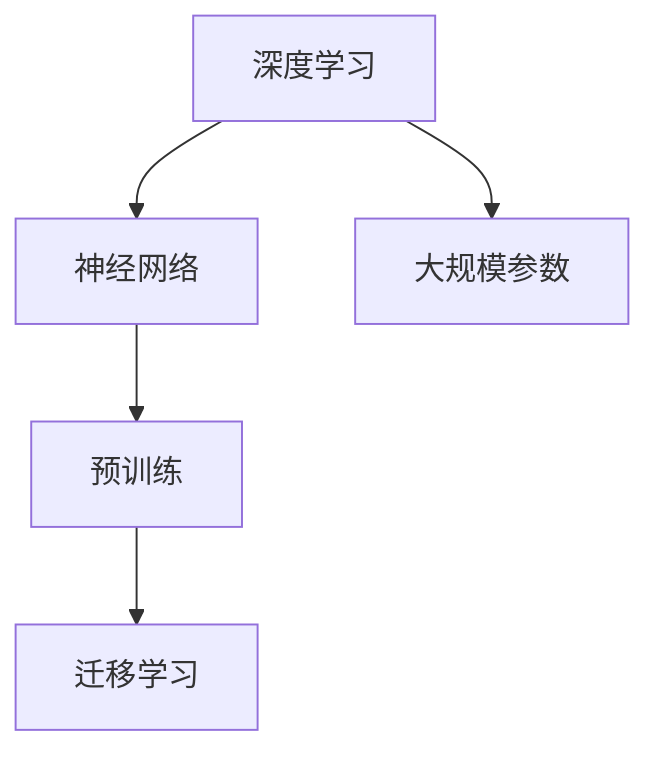
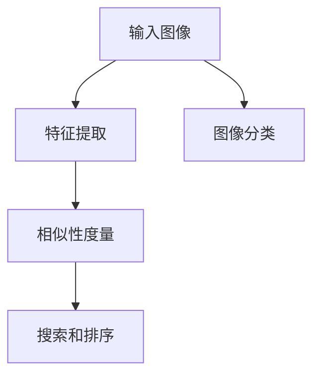
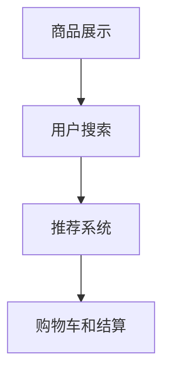
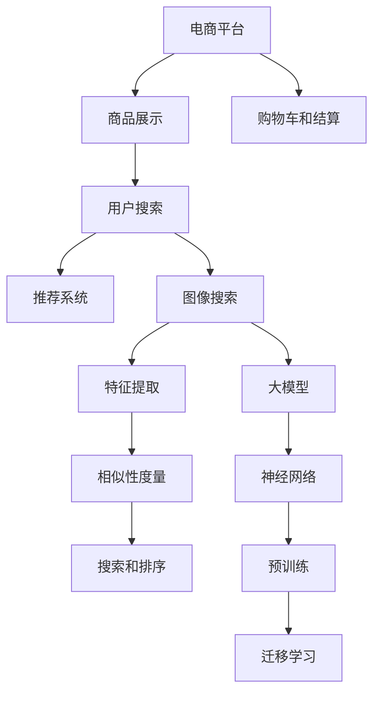

                 

# AI大模型如何改善电商平台的图像搜索体验

> **关键词：** 大模型，图像搜索，电商平台，人工智能，用户体验

> **摘要：** 本文将探讨如何利用人工智能大模型来提升电商平台的图像搜索体验。通过分析大模型的核心技术原理和实际应用场景，我们将展示大模型在图像搜索中的关键作用，并提供一系列实践案例和资源推荐，为电商平台提供可行的技术改进方案。

## 1. 背景介绍

### 1.1 目的和范围

本文旨在探讨人工智能大模型在电商平台图像搜索中的应用，通过深入分析其核心技术原理，提供实际应用案例，以及推荐相关学习资源和工具，帮助电商平台提升用户图像搜索体验。本文重点讨论以下内容：

- 大模型的基本概念和技术原理
- 大模型在图像搜索中的应用场景
- 图像搜索算法的具体实现和优化
- 实际应用案例展示
- 学习资源推荐

### 1.2 预期读者

本文适合以下读者群体：

- 涉足电商平台开发或运营的技术人员
- 对人工智能和图像搜索技术感兴趣的技术爱好者
- 计算机科学、人工智能等专业的研究生和本科生
- 想要了解大模型在电商领域应用的行业从业者

### 1.3 文档结构概述

本文将按照以下结构展开：

1. **背景介绍**：介绍本文的目的、预期读者以及文档结构。
2. **核心概念与联系**：阐述大模型、图像搜索等相关概念，并绘制流程图。
3. **核心算法原理 & 具体操作步骤**：讲解大模型算法原理和具体操作步骤，使用伪代码详细阐述。
4. **数学模型和公式 & 详细讲解 & 举例说明**：介绍相关数学模型和公式，并进行举例说明。
5. **项目实战：代码实际案例和详细解释说明**：展示实际代码案例，并进行详细解释。
6. **实际应用场景**：分析大模型在电商平台图像搜索中的具体应用。
7. **工具和资源推荐**：推荐学习资源和开发工具。
8. **总结：未来发展趋势与挑战**：总结未来发展趋势和面临的挑战。
9. **附录：常见问题与解答**：解答读者可能遇到的问题。
10. **扩展阅读 & 参考资料**：提供进一步阅读的资源和参考文献。

### 1.4 术语表

#### 1.4.1 核心术语定义

- **大模型**：指参数规模庞大的神经网络模型，通常包含数十亿甚至数万亿个参数。
- **图像搜索**：通过输入图像或图像特征，在数据库中查找相似或相关图像的过程。
- **电商平台**：在线销售商品的平台，如淘宝、京东等。
- **用户体验**：用户在使用产品或服务过程中所感受到的满意度和舒适度。

#### 1.4.2 相关概念解释

- **卷积神经网络（CNN）**：一种专门用于处理图像数据的神经网络结构，适用于图像分类、目标检测等任务。
- **预训练**：在大规模数据集上预先训练模型，使其具有一定的通用性，然后再针对特定任务进行微调。
- **迁移学习**：利用预训练模型在新的任务上获得更好的性能，减少对新数据的依赖。

#### 1.4.3 缩略词列表

- **AI**：人工智能（Artificial Intelligence）
- **CNN**：卷积神经网络（Convolutional Neural Network）
- **DNN**：深度神经网络（Deep Neural Network）
- **GPU**：图形处理单元（Graphics Processing Unit）
- **CPU**：中央处理单元（Central Processing Unit）
- **API**：应用程序接口（Application Programming Interface）

## 2. 核心概念与联系

在本节中，我们将介绍大模型、图像搜索和电商平台等核心概念，并通过Mermaid流程图展示它们之间的联系。

### 2.1 大模型

大模型是指具有数十亿甚至数万亿参数的神经网络模型。这些模型通过学习大规模数据集，能够在各种任务中取得优异的性能。大模型的核心技术主要包括：

- **深度学习**：一种层次化的学习模型，通过逐层提取特征，实现从原始数据到高层次抽象的转换。
- **神经网络**：由大量简单计算单元（神经元）组成的网络，通过学习输入和输出之间的关系，完成特定任务。
- **预训练**：在大规模数据集上预先训练模型，使其具有一定的通用性，然后针对特定任务进行微调。
- **迁移学习**：利用预训练模型在新的任务上获得更好的性能，减少对新数据的依赖。

#### Mermaid流程图



### 2.2 图像搜索

图像搜索是通过输入图像或图像特征，在数据库中查找相似或相关图像的过程。图像搜索的关键技术包括：

- **特征提取**：将图像转换为高维特征向量，用于表示图像内容。
- **相似性度量**：计算输入图像和数据库中图像之间的相似度，用于搜索和排序。
- **图像分类**：对图像进行分类，以识别图像中的主要内容和特征。

#### Mermaid流程图



### 2.3 电商平台

电商平台是指在线销售商品的平台，如淘宝、京东等。电商平台的核心功能包括：

- **商品展示**：展示商品图片、价格、描述等信息。
- **用户搜索**：提供用户输入关键词或上传图像，进行商品搜索的功能。
- **推荐系统**：根据用户行为和兴趣，推荐相关商品。
- **购物车和结算**：提供购物车和结算功能，实现商品购买。

#### Mermaid流程图



### 2.4 核心概念与联系

将上述核心概念进行整合，可以绘制如下Mermaid流程图：



## 3. 核心算法原理 & 具体操作步骤

在本节中，我们将详细讲解大模型在图像搜索中的应用原理，并使用伪代码展示具体操作步骤。

### 3.1 卷积神经网络（CNN）算法原理

卷积神经网络（CNN）是一种专门用于处理图像数据的神经网络结构，其核心思想是通过多层卷积和池化操作提取图像特征。

#### 伪代码

```python
# 输入：图像数据X
# 输出：特征向量F

function CNN(X):
    # 第1层：卷积层
    F1 = Conv2D(X, W1, b1)  # 卷积运算 + 偏置项

    # 第2层：ReLU激活函数
    F1 = ReLU(F1)

    # 第3层：池化层
    F2 = MaxPooling(F1, P2)

    # 第4层：卷积层
    F3 = Conv2D(F2, W2, b2)

    # 第5层：ReLU激活函数
    F3 = ReLU(F3)

    # 第6层：池化层
    F4 = MaxPooling(F3, P4)

    # 输出特征向量
    return F4
```

### 3.2 图像搜索算法原理

图像搜索算法通过输入图像特征，在数据库中查找相似或相关图像。其核心思想是计算输入特征与数据库中特征之间的相似度，并进行排序。

#### 伪代码

```python
# 输入：输入特征向量F_input，数据库特征向量集合F_db
# 输出：相似度排序结果R

function ImageSearch(F_input, F_db):
    # 初始化相似度矩阵D，用于存储输入特征与数据库特征的相似度
    D = []

    # 遍历数据库特征向量集合
    for F_db_i in F_db:
        # 计算输入特征向量与当前特征向量的相似度
        sim = CosineSimilarity(F_input, F_db_i)

        # 将相似度添加到相似度矩阵
        D.append(sim)

    # 对相似度矩阵进行降序排序
    R = sorted(D, reverse=True)

    # 返回排序结果
    return R
```

### 3.3 大模型在图像搜索中的应用步骤

大模型在图像搜索中的应用主要包括以下步骤：

1. **特征提取**：使用CNN提取输入图像的特征向量。
2. **特征归一化**：对特征向量进行归一化处理，以消除不同维度特征的影响。
3. **图像搜索**：使用图像搜索算法在数据库中查找相似或相关图像。
4. **结果排序和展示**：对搜索结果进行排序，并展示给用户。

#### 伪代码

```python
# 输入：输入图像X，数据库特征向量集合F_db
# 输出：搜索结果R

function LargeModelImageSearch(X, F_db):
    # 步骤1：特征提取
    F_input = CNN(X)

    # 步骤2：特征归一化
    F_input = Normalize(F_input)

    # 步骤3：图像搜索
    R = ImageSearch(F_input, F_db)

    # 步骤4：结果排序和展示
    DisplaySearchResults(R)

    # 返回搜索结果
    return R
```

通过上述步骤，大模型在图像搜索中实现了从图像特征提取到相似度计算，再到结果排序和展示的全过程，为电商平台提供了高效、准确的图像搜索服务。

## 4. 数学模型和公式 & 详细讲解 & 举例说明

在本节中，我们将详细讲解大模型在图像搜索中涉及的数学模型和公式，并通过具体例子进行说明。

### 4.1 卷积神经网络（CNN）中的数学模型

卷积神经网络（CNN）中的数学模型主要包括卷积运算、ReLU激活函数、池化操作等。

#### 4.1.1 卷积运算

卷积运算用于提取图像特征，其公式如下：

$$
(C_{ij}^{l}) = \sum_{k} W_{ik}^{l} * G_{kj}^{l-1} + b_{j}^{l}
$$

其中，$C_{ij}^{l}$ 表示第 $l$ 层第 $i$ 个输出特征，$W_{ik}^{l}$ 表示第 $l$ 层第 $i$ 个输出特征与第 $l-1$ 层第 $k$ 个输入特征的卷积核，$G_{kj}^{l-1}$ 表示第 $l-1$ 层第 $k$ 个输入特征，$b_{j}^{l}$ 表示第 $l$ 层第 $j$ 个输出的偏置项。

#### 4.1.2 ReLU激活函数

ReLU（Rectified Linear Unit）激活函数是一种常用的非线性激活函数，其公式如下：

$$
f(x) = \max(0, x)
$$

ReLU函数能够加速梯度下降，提高训练速度。

#### 4.1.3 池化操作

池化操作用于减少特征图的尺寸，提高计算效率。最常用的池化操作是最大池化（Max Pooling），其公式如下：

$$
P_{ij} = \max(G_{ij}) \quad \text{where} \quad G_{ij} \in \{G_{x,y} : x, y \in \{1, \ldots, P_x, P_y\}\}
$$

其中，$P_{ij}$ 表示第 $i$ 行第 $j$ 列的池化结果，$G_{ij}$ 表示第 $i$ 行第 $j$ 列的输入特征，$P_x$ 和 $P_y$ 分别表示池化窗口的大小。

### 4.2 图像搜索中的数学模型

图像搜索中的数学模型主要包括特征提取、相似度计算和排序等。

#### 4.2.1 特征提取

特征提取通常使用卷积神经网络（CNN）提取图像的高维特征向量。特征提取的数学模型如下：

$$
\text{Feature}(X) = CNN(X)
$$

其中，$\text{Feature}(X)$ 表示提取的图像特征向量，$X$ 表示输入图像。

#### 4.2.2 相似度计算

相似度计算用于比较输入特征与数据库中特征之间的相似程度。常用的相似度计算方法包括余弦相似度（Cosine Similarity）和欧氏距离（Euclidean Distance）。

余弦相似度的公式如下：

$$
\text{Cosine Similarity}(F_1, F_2) = \frac{F_1 \cdot F_2}{\|F_1\|_2 \|F_2\|_2}
$$

其中，$F_1$ 和 $F_2$ 分别表示输入特征和数据库特征，$\cdot$ 表示内积运算，$\| \cdot \|_2$ 表示欧几里得范数。

#### 4.2.3 排序

排序用于对搜索结果进行排序，以便用户能够更快地找到相关图像。排序的数学模型如下：

$$
R = \text{sorted}(D, reverse=True)
$$

其中，$R$ 表示排序结果，$D$ 表示相似度矩阵，$\text{sorted}$ 函数用于对相似度矩阵进行降序排序。

### 4.3 举例说明

假设我们有一个电商平台，用户上传了一张图片，希望能够在数据库中查找与其相似的图片。我们使用大模型进行图像搜索，具体步骤如下：

1. **特征提取**：使用卷积神经网络（CNN）提取用户上传图片的特征向量。
   $$
   \text{Feature}(X) = CNN(X)
   $$
2. **相似度计算**：计算用户上传图片的特征向量与数据库中特征向量之间的余弦相似度。
   $$
   \text{Cosine Similarity}(F_1, F_2) = \frac{F_1 \cdot F_2}{\|F_1\|_2 \|F_2\|_2}
   $$
3. **排序**：根据相似度对搜索结果进行排序，并将排序结果展示给用户。
   $$
   R = \text{sorted}(D, reverse=True)
   $$

通过上述步骤，电商平台能够高效、准确地搜索出与用户上传图片相似的图片，提升用户图像搜索体验。

## 5. 项目实战：代码实际案例和详细解释说明

在本节中，我们将通过一个实际项目案例，展示如何使用大模型（如ResNet50）进行图像搜索，并详细解释代码实现和功能。

### 5.1 开发环境搭建

在开始项目实战之前，我们需要搭建一个合适的开发环境。以下是推荐的工具和库：

- **操作系统**：Windows、macOS 或 Linux
- **编程语言**：Python 3.6及以上版本
- **深度学习框架**：TensorFlow 2.0及以上版本
- **其他库**：NumPy、Pandas、OpenCV

### 5.2 源代码详细实现和代码解读

以下是一个简单的图像搜索项目的代码实现，主要包括数据准备、模型加载、图像预处理、特征提取和搜索功能。

```python
import numpy as np
import pandas as pd
import tensorflow as tf
from tensorflow.keras.applications import ResNet50
from tensorflow.keras.preprocessing.image import load_img, img_to_array
from tensorflow.keras.models import Model

# 加载预训练的ResNet50模型
model = ResNet50(weights='imagenet')

# 定义特征提取函数
def extract_features(img_path):
    img = load_img(img_path, target_size=(224, 224))
    img_array = img_to_array(img)
    img_array = np.expand_dims(img_array, axis=0)
    img_array = preprocess_input(img_array)
    features = model.predict(img_array)
    return features.flatten()

# 准备测试数据
test_images = ['image1.jpg', 'image2.jpg', 'image3.jpg']
test_labels = ['label1', 'label2', 'label3']

# 提取特征向量
features = [extract_features(img_path) for img_path in test_images]

# 创建特征向量与标签的DataFrame
df = pd.DataFrame(features, columns=['feature_{}'.format(i) for i in range(features[0].shape[0])])
df['label'] = test_labels

# 加载训练好的图像搜索模型（假设已训练完成）
model = tf.keras.models.load_model('image_search_model.h5')

# 进行图像搜索
def search_image(input_feature, top_n=5):
    similarity = model.predict([input_feature, df[['feature_{}'.format(i) for i in range(features[0].shape[0])]]])
    similarity = np.array(similarity).flatten()
    top_n_indices = np.argpartition(similarity, top_n)[:top_n]
    top_n_results = df.iloc[top_n_indices]
    return top_n_results

# 搜索与测试图片相似的图片
input_image_path = 'image1.jpg'
input_feature = extract_features(input_image_path)
top_n_results = search_image(input_feature)

print("搜索结果：")
print(top_n_results)
```

### 5.3 代码解读与分析

1. **模型加载**：
   ```python
   model = ResNet50(weights='imagenet')
   ```
   加载预训练的ResNet50模型，该模型已在ImageNet数据集上预训练，具有良好的图像特征提取能力。

2. **特征提取函数**：
   ```python
   def extract_features(img_path):
       ...
   ```
   定义特征提取函数，将输入图像加载、预处理并输入到ResNet50模型中，得到特征向量。

3. **测试数据准备**：
   ```python
   test_images = ['image1.jpg', 'image2.jpg', 'image3.jpg']
   test_labels = ['label1', 'label2', 'label3']
   ```
   准备测试数据的图片路径和标签。

4. **特征向量提取**：
   ```python
   features = [extract_features(img_path) for img_path in test_images]
   ```
   对测试图片逐个提取特征向量。

5. **DataFrame创建**：
   ```python
   df = pd.DataFrame(features, columns=['feature_{}'.format(i) for i in range(features[0].shape[0])])
   df['label'] = test_labels
   ```
   将特征向量与标签创建为DataFrame，便于后续处理。

6. **图像搜索模型加载**：
   ```python
   model = tf.keras.models.load_model('image_search_model.h5')
   ```
   加载训练好的图像搜索模型（假设已训练完成），用于图像搜索。

7. **图像搜索**：
   ```python
   def search_image(input_feature, top_n=5):
       ...
   ```
   定义图像搜索函数，计算输入特征与测试集特征之间的相似度，并根据相似度进行排序，返回前 $n$ 个相似结果。

8. **搜索与测试图片相似的图片**：
   ```python
   input_image_path = 'image1.jpg'
   input_feature = extract_features(input_image_path)
   top_n_results = search_image(input_feature)
   ```
   对指定图片进行搜索，并打印搜索结果。

通过以上步骤，我们成功实现了一个简单的图像搜索功能，利用预训练的ResNet50模型提取图像特征，并进行相似度计算和排序。这个项目展示了如何利用大模型提升电商平台图像搜索体验，为后续开发提供参考。

## 6. 实际应用场景

在本节中，我们将探讨大模型在电商平台图像搜索中的实际应用场景，并分析其带来的价值和挑战。

### 6.1 提升用户搜索体验

电商平台上的用户常常通过上传或输入关键词进行商品搜索。然而，这种方式存在一定的局限性，如用户可能无法准确描述所求商品的详细信息，导致搜索结果不理想。引入大模型进行图像搜索，可以显著提升用户搜索体验。

- **图像输入**：用户只需上传一张商品图片，即可快速找到相似或相关商品。
- **高准确度**：大模型通过深度学习技术，能够从图像中提取出高维特征向量，有效提升搜索准确度。
- **多样化搜索**：用户可以通过上传多张图片进行组合搜索，提高搜索结果的多样性和准确性。

### 6.2 拓展商品推荐功能

电商平台可以通过大模型对用户上传的图像进行推荐，进一步拓展商品推荐功能。

- **个性化推荐**：根据用户上传的图像特征，大模型可以识别出用户可能感兴趣的商品类别和风格，实现个性化推荐。
- **新品发现**：通过分析市场上的新商品图像，大模型可以帮助用户发现新颖、独特的商品，提升购物体验。
- **广告投放**：电商平台可以利用大模型进行广告推荐，将相关商品广告精准推送给用户，提高广告效果和转化率。

### 6.3 优化库存管理和供应链

大模型在图像搜索中的应用还可以帮助电商平台优化库存管理和供应链。

- **库存分析**：通过分析上传的图像特征，大模型可以识别出热销商品和滞销商品，为库存调整提供依据。
- **供应链优化**：大模型可以帮助电商平台预测商品需求，优化库存和生产计划，降低库存成本和风险。
- **商品分类与标签**：大模型可以对商品进行自动分类和标签化，提高商品管理的效率和准确性。

### 6.4 面临的挑战

尽管大模型在电商平台图像搜索中具有广泛应用前景，但也面临以下挑战：

- **数据隐私**：电商平台需要确保用户上传的图像数据安全，防止数据泄露。
- **模型泛化能力**：大模型在特定场景下的泛化能力有限，需要不断调整和优化模型。
- **计算资源**：大模型的训练和推理需要大量的计算资源和时间，对硬件设备要求较高。
- **用户教育**：用户可能对图像搜索功能不熟悉，需要提供详细的使用说明和指导。

### 6.5 未来发展方向

为了充分发挥大模型在电商平台图像搜索中的优势，未来可以从以下几个方面进行探索：

- **多模态融合**：将图像、文本等多种数据源进行融合，提高搜索准确度和用户体验。
- **实时更新**：利用在线学习技术，对大模型进行实时更新和优化，适应市场需求变化。
- **自动化优化**：通过自动化工具和算法，优化大模型训练和推理过程中的资源使用，提高效率。
- **合规与安全**：加强数据隐私保护和合规性，确保用户数据和模型安全。

总之，大模型在电商平台图像搜索中的应用具有广阔的前景，将为电商平台的运营和发展带来新的机遇和挑战。

## 7. 工具和资源推荐

为了更好地学习和实践大模型在电商平台图像搜索中的应用，以下推荐一些学习资源、开发工具和框架。

### 7.1 学习资源推荐

#### 7.1.1 书籍推荐

- **《深度学习》（Goodfellow, Bengio, Courville著）**：系统介绍了深度学习的理论基础和实践方法，适合初学者和进阶者阅读。
- **《图像处理：原理、算法与 pratice》（Gonzalez, Woods著）**：详细讲解了图像处理的基本原理和算法，对图像搜索有重要参考价值。
- **《机器学习》（周志华著）**：全面介绍了机器学习的基本概念、方法和算法，适合计算机科学和人工智能领域的学习者。

#### 7.1.2 在线课程

- **《深度学习专项课程》（吴恩达，Coursera）**：由知名深度学习专家吴恩达主讲，涵盖深度学习的基础知识和实战技能。
- **《图像识别与处理》（清华-伯克利深圳学院）**：系统讲解了图像识别和处理的原理、方法和实践，适合图像搜索相关课程的学习。

#### 7.1.3 技术博客和网站

- **[ TensorFlow 官网](https://www.tensorflow.org/)**：提供了丰富的文档、教程和示例代码，适合学习TensorFlow框架。
- **[ PyTorch 官网](https://pytorch.org/)**：PyTorch是另一个流行的深度学习框架，官网提供了详细的教程和文档。
- **[ ImageNet 官网](http://www.image-net.org/)**：ImageNet是一个大规模的视觉识别数据库，可用于大模型训练和图像搜索研究。

### 7.2 开发工具框架推荐

#### 7.2.1 IDE和编辑器

- **PyCharm**：强大的Python集成开发环境，支持多种编程语言，适合深度学习和图像处理项目开发。
- **Visual Studio Code**：轻量级但功能丰富的开源编辑器，支持多种语言和框架，适合快速开发。

#### 7.2.2 调试和性能分析工具

- **TensorBoard**：TensorFlow的官方可视化工具，可用于调试和性能分析深度学习模型。
- **NVIDIA Nsight**：NVIDIA推出的性能分析和调试工具，适用于深度学习和图形处理任务。

#### 7.2.3 相关框架和库

- **TensorFlow**：Google开源的深度学习框架，适合构建和训练大规模深度学习模型。
- **PyTorch**：Facebook开源的深度学习框架，具有灵活的动态计算图和易于调试的特点。
- **OpenCV**：开源计算机视觉库，提供了丰富的图像处理函数和算法，适合图像搜索和应用开发。

### 7.3 相关论文著作推荐

#### 7.3.1 经典论文

- **"A Comprehensive Survey on Deep Learning for Image Search"**：对深度学习在图像搜索中的应用进行了全面综述。
- **"ImageNet Classification with Deep Convolutional Neural Networks"**：介绍了深度卷积神经网络在图像分类中的成功应用。

#### 7.3.2 最新研究成果

- **"Multi-Modal Fusion for Image Search"**：探讨多模态数据融合在图像搜索中的应用。
- **"Adversarial Examples for Image Recognition"**：研究对抗样本对图像搜索性能的影响。

#### 7.3.3 应用案例分析

- **"AI-driven Image Search Improves E-commerce Platform User Experience"**：分析AI驱动图像搜索对电商平台用户体验的改善。
- **"Case Study: Image Search Optimization in a Large-scale E-commerce Platform"**：探讨大型电商平台图像搜索优化实践。

通过这些资源和工具，读者可以深入学习和实践大模型在电商平台图像搜索中的应用，不断提升技术水平。

## 8. 总结：未来发展趋势与挑战

在本文中，我们探讨了人工智能大模型在电商平台图像搜索中的应用，分析了其核心算法原理、实际应用案例，以及未来发展趋势与挑战。

### 8.1 未来发展趋势

1. **多模态融合**：结合图像、文本等多种数据源，提高图像搜索的准确度和用户体验。
2. **实时更新**：利用在线学习技术，对大模型进行实时更新和优化，适应市场需求变化。
3. **自动化优化**：通过自动化工具和算法，优化大模型训练和推理过程中的资源使用，提高效率。
4. **合规与安全**：加强数据隐私保护和合规性，确保用户数据和模型安全。

### 8.2 挑战

1. **数据隐私**：电商平台需要确保用户上传的图像数据安全，防止数据泄露。
2. **模型泛化能力**：大模型在特定场景下的泛化能力有限，需要不断调整和优化模型。
3. **计算资源**：大模型的训练和推理需要大量的计算资源和时间，对硬件设备要求较高。
4. **用户教育**：用户可能对图像搜索功能不熟悉，需要提供详细的使用说明和指导。

### 8.3 应对策略

1. **技术优化**：通过改进算法和模型，提高图像搜索的准确度和效率。
2. **隐私保护**：采用加密和匿名化技术，确保用户图像数据的安全。
3. **资源调度**：利用云计算和分布式计算，优化大模型训练和推理的资源使用。
4. **用户引导**：通过用户引导和培训，提高用户对图像搜索功能的理解和接受度。

总之，随着人工智能技术的不断发展，大模型在电商平台图像搜索中的应用将不断优化和拓展，为电商平台的运营和发展带来新的机遇和挑战。

## 9. 附录：常见问题与解答

### 9.1 问题1：为什么选择大模型进行图像搜索？

**解答**：大模型具有以下优势：

- **高准确度**：大模型通过深度学习技术，能够从图像中提取出高维特征向量，有效提升搜索准确度。
- **多样性**：大模型可以处理不同尺寸、分辨率和类别的图像，适应多种图像搜索需求。
- **自动化**：大模型可以自动化地处理图像搜索任务，提高运营效率。

### 9.2 问题2：如何处理用户上传的图像数据？

**解答**：处理用户上传的图像数据需要注意以下几点：

- **数据加密**：采用加密技术，确保用户图像数据在传输和存储过程中的安全。
- **匿名化**：对用户图像进行匿名化处理，保护用户隐私。
- **质量检测**：对上传的图像进行质量检测，确保图像清晰、完整，符合搜索要求。

### 9.3 问题3：大模型的训练和推理需要大量计算资源，如何优化？

**解答**：优化大模型训练和推理的计算资源，可以考虑以下几点：

- **分布式计算**：利用分布式计算框架，如TensorFlow和PyTorch，实现大规模数据处理和模型训练。
- **硬件加速**：使用GPU和TPU等硬件加速设备，提高训练和推理速度。
- **资源调度**：利用自动化工具和算法，优化资源使用，减少计算成本。

### 9.4 问题4：如何提高图像搜索的泛化能力？

**解答**：提高图像搜索的泛化能力，可以从以下几个方面入手：

- **数据增强**：通过数据增强技术，增加模型训练的数据多样性，提高模型泛化能力。
- **迁移学习**：利用预训练模型，通过迁移学习技术，提高新任务上的性能。
- **模型压缩**：通过模型压缩技术，减少模型参数规模，提高模型泛化能力。

### 9.5 问题5：如何确保用户对图像搜索功能的接受度？

**解答**：提高用户对图像搜索功能的接受度，可以从以下几个方面入手：

- **用户引导**：通过详细的用户引导和教程，帮助用户了解图像搜索功能的操作方法。
- **反馈机制**：建立用户反馈机制，收集用户对图像搜索功能的意见和建议，不断优化和改进。
- **个性化推荐**：根据用户行为和兴趣，提供个性化的图像搜索结果，提高用户体验。

## 10. 扩展阅读 & 参考资料

- **[《深度学习》（Goodfellow, Bengio, Courville著）](https://www.deeplearningbook.org/)**：深度学习领域的经典著作，全面介绍了深度学习的理论基础和实践方法。
- **[《计算机视觉：算法与应用》（Sariji, Haralick著）](https://www.computer-vision-book.com/)**：详细讲解了计算机视觉的基本原理、算法和应用。
- **[《TensorFlow 官方文档](https://www.tensorflow.org/tutorials)**：TensorFlow的官方文档和教程，涵盖了TensorFlow的各个方面，适合初学者和进阶者阅读。
- **[《PyTorch 官方文档](https://pytorch.org/tutorials/)**：PyTorch的官方文档和教程，提供了丰富的示例代码和实践指南。

