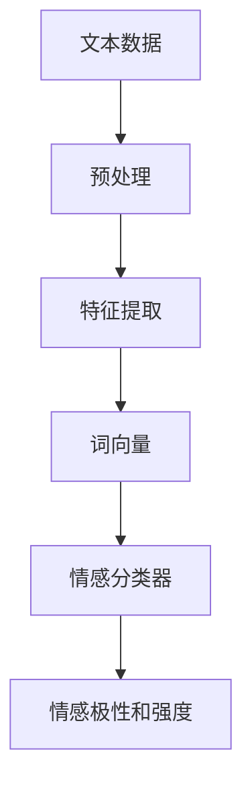

                 

# AI大模型实现人类情感分析系统

> **关键词：** 情感分析，人工智能，深度学习，大模型，自然语言处理，情感识别

> **摘要：** 本文将深入探讨如何利用人工智能大模型实现人类情感分析系统。我们将从背景介绍出发，逐步讲解核心概念、算法原理、数学模型，并展示实际项目实战和广泛应用场景，最后总结发展趋势与挑战，并提供丰富的学习资源和开发工具推荐。

## 1. 背景介绍

### 1.1 目的和范围

本文的目的是探讨如何利用人工智能（AI）大模型实现人类情感分析系统。情感分析是自然语言处理（NLP）的重要应用领域，其核心目标是理解和提取文本中的情感信息。随着深度学习技术的发展，大模型在情感分析领域表现出了强大的能力。本文将详细阐述大模型在情感分析中的应用，包括算法原理、数学模型、项目实战和实际应用场景。

### 1.2 预期读者

本文适合对人工智能、自然语言处理有一定了解的读者，包括但不限于AI工程师、NLP研究员、数据科学家和计算机科学专业的学生。本文将尽量以通俗易懂的方式讲解复杂的技术概念，但读者需要具备一定的数学和编程基础。

### 1.3 文档结构概述

本文结构如下：

- **第1章：背景介绍**：介绍本文的目的、范围和预期读者，概述文档结构。
- **第2章：核心概念与联系**：介绍情感分析的核心概念，并使用Mermaid流程图展示大模型架构。
- **第3章：核心算法原理 & 具体操作步骤**：讲解情感分析算法的原理，使用伪代码详细阐述操作步骤。
- **第4章：数学模型和公式 & 详细讲解 & 举例说明**：介绍情感分析中的数学模型和公式，并进行举例说明。
- **第5章：项目实战：代码实际案例和详细解释说明**：展示一个情感分析项目的代码实现，并详细解释说明。
- **第6章：实际应用场景**：探讨情感分析在实际中的应用。
- **第7章：工具和资源推荐**：推荐学习资源和开发工具。
- **第8章：总结：未来发展趋势与挑战**：总结本文内容，探讨未来发展趋势与挑战。
- **第9章：附录：常见问题与解答**：回答读者可能关心的问题。
- **第10章：扩展阅读 & 参考资料**：提供更多的学习资源。

### 1.4 术语表

#### 1.4.1 核心术语定义

- **情感分析（Sentiment Analysis）**：对文本中的情感倾向进行识别和分类的过程。
- **深度学习（Deep Learning）**：一种人工智能方法，使用多层神经网络对数据进行学习。
- **大模型（Large Model）**：具有大量参数和复杂结构的深度学习模型。
- **自然语言处理（Natural Language Processing，NLP）**：计算机科学领域的一个分支，专注于使计算机能够理解、解释和生成人类语言。

#### 1.4.2 相关概念解释

- **情感分类（Sentiment Classification）**：将文本分类为正面、负面或中性情感。
- **词向量（Word Vector）**：将单词映射为密集的向量表示。
- **注意力机制（Attention Mechanism）**：一种模型，可以自动关注输入数据中的重要部分。
- **预训练（Pre-training）**：在大规模数据集上预先训练模型，然后在特定任务上微调。

#### 1.4.3 缩略词列表

- **NLP**：自然语言处理
- **AI**：人工智能
- **DL**：深度学习
- **Bert**：Bidirectional Encoder Representations from Transformers
- **GPT**：Generative Pre-trained Transformer
- **LSTM**：Long Short-Term Memory

## 2. 核心概念与联系

情感分析系统通常包括以下几个核心概念：

1. **情感极性（Polarity）**：情感极性表示情感的倾向性，通常分为正面、负面和中性。
2. **情感强度（Strength）**：情感强度表示情感的程度，可以是弱、中或强。
3. **情感分类器（Sentiment Classifier）**：用于对文本进行情感分类的机器学习模型。
4. **特征提取（Feature Extraction）**：从文本中提取有助于情感分类的特征。
5. **词向量（Word Vector）**：将单词映射为稠密向量表示。

为了更好地理解这些概念之间的关系，我们可以使用Mermaid流程图来展示情感分析系统的基本架构：



在这个流程图中，文本数据首先经过预处理步骤，包括去噪、分词和标准化。然后，使用特征提取方法将文本转换为词向量。这些词向量被输入到情感分类器中，分类器输出情感极性和强度。这个架构展示了情感分析系统的基本工作流程，下面我们将进一步深入探讨每个步骤的细节。

## 3. 核心算法原理 & 具体操作步骤

情感分析系统的核心算法通常基于深度学习，特别是卷积神经网络（CNN）和循环神经网络（RNN），其中RNN包括长短期记忆网络（LSTM）和门控循环单元（GRU）。下面我们将使用伪代码详细阐述这些算法的基本原理和操作步骤。

### 3.1 卷积神经网络（CNN）

```python
# 初始化卷积神经网络模型
model = ConvolutionalNeuralNetwork()

# 预处理文本数据
preprocessed_text = preprocess_text(raw_text)

# 提取词向量
word_vectors = extract_word_vectors(preprocessed_text)

# 填充词向量到固定长度
filled_vectors = pad_word_vectors(word_vectors, fixed_length)

# 通过卷积层提取特征
conv_features = model.conv_layer(filled_vectors)

# 通过池化层减少维度
pooled_features = model.pooling_layer(conv_features)

# 通过全连接层进行分类
predictions = model.fc_layer(pooled_features)
```

在这个流程中，首先初始化一个卷积神经网络模型。然后，对原始文本数据进行预处理，提取词向量，并将它们填充到固定长度。接下来，通过卷积层提取特征，使用池化层减少维度，最后通过全连接层进行分类。

### 3.2 循环神经网络（RNN）

```python
# 初始化循环神经网络模型
model = RecurrentNeuralNetwork()

# 预处理文本数据
preprocessed_text = preprocess_text(raw_text)

# 提取词向量
word_vectors = extract_word_vectors(preprocessed_text)

# 填充词向量到固定长度
filled_vectors = pad_word_vectors(word_vectors, fixed_length)

# 通过RNN层提取特征
rnn_features = model.rnn_layer(filled_vectors)

# 通过全连接层进行分类
predictions = model.fc_layer(rnn_features)
```

与CNN不同，RNN在处理序列数据时更加高效。它通过循环层对每个单词的词向量进行迭代处理，最后通过全连接层进行分类。

### 3.3 长短期记忆网络（LSTM）

```python
# 初始化LSTM模型
model = LSTM()

# 预处理文本数据
preprocessed_text = preprocess_text(raw_text)

# 提取词向量
word_vectors = extract_word_vectors(preprocessed_text)

# 填充词向量到固定长度
filled_vectors = pad_word_vectors(word_vectors, fixed_length)

# 通过LSTM层提取特征
lstm_features = model.lstm_layer(filled_vectors)

# 通过全连接层进行分类
predictions = model.fc_layer(lstm_features)
```

LSTM是RNN的一种变体，它通过引入门控机制来避免梯度消失问题，从而在处理长序列数据时表现更加稳定。

### 3.4 门控循环单元（GRU）

```python
# 初始化GRU模型
model = GRU()

# 预处理文本数据
preprocessed_text = preprocess_text(raw_text)

# 提取词向量
word_vectors = extract_word_vectors(preprocessed_text)

# 填充词向量到固定长度
filled_vectors = pad_word_vectors(word_vectors, fixed_length)

# 通过GRU层提取特征
gru_features = model.gru_layer(filled_vectors)

# 通过全连接层进行分类
predictions = model.fc_layer(gru_features)
```

GRU是LSTM的另一种变体，它在结构上比LSTM更加简洁，但在许多任务中表现相当。

这些算法原理和具体操作步骤展示了如何使用深度学习模型进行情感分析。在实际应用中，通常会选择最适合特定任务的模型，并对其进行优化和调整，以达到最佳效果。

## 4. 数学模型和公式 & 详细讲解 & 举例说明

在情感分析中，数学模型和公式起着至关重要的作用。这些模型和公式帮助我们将复杂的文本数据转换为机器学习模型可以理解和处理的形式。下面我们将详细介绍常用的数学模型和公式，并进行举例说明。

### 4.1 词向量表示

词向量是情感分析中的核心概念之一。常见的词向量表示方法包括Word2Vec、GloVe和FastText。以下是一个使用Word2Vec模型的简单例子：

```latex
$$
\text{word\_vector}(w) = \text{Word2Vec}(w)
$$

其中，\text{word\_vector}(w) 表示单词w的词向量，\text{Word2Vec}(w) 是Word2Vec模型计算出的词向量。

例如，单词 "happy" 的词向量可能是：

$$
\text{word\_vector}(happy) = [0.1, 0.2, -0.3, 0.4]
$$
```

### 4.2 情感得分计算

情感得分是衡量文本情感极性的重要指标。常见的情感得分计算方法包括基于词向量的情感得分计算和基于分类模型的情感得分计算。

#### 基于词向量的情感得分计算

基于词向量的情感得分计算方法将每个单词的词向量相加，然后计算平均值。以下是一个简单的例子：

```latex
$$
\text{score}(w) = \frac{1}{N} \sum_{i=1}^{N} \text{word\_vector}(w_i)
$$

其中，score(w) 表示单词w的情感得分，word\_vector(w_i) 表示单词w_i的词向量，N 是文本中单词的数量。

例如，对于句子 "我很高兴"，我们可以计算每个单词的词向量，然后求平均值：

$$
\text{score}(happy) = \frac{1}{3} (\text{word\_vector}(我) + \text{word\_vector}(很) + \text{word\_vector}(高兴))
$$
```

#### 基于分类模型的情感得分计算

基于分类模型的情感得分计算方法使用预训练的模型对文本进行情感分类，然后根据分类结果计算得分。以下是一个简单的例子：

```latex
$$
\text{score}(w) = \frac{1}{2} (\text{模型预测为正面的概率} + \text{模型预测为负面的概率})
$$

例如，如果一个文本被情感分类模型预测为正面情感的概率为0.8，负面情感的概率为0.2，那么该文本的情感得分是：

$$
\text{score}(w) = \frac{1}{2} (0.8 + 0.2) = 0.5
$$
```

### 4.3 情感极性分类

情感极性分类是将文本分类为正面、负面或中性情感的常见任务。常见的分类模型包括朴素贝叶斯、支持向量机和深度学习模型。

以下是一个简单的朴素贝叶斯分类模型的例子：

```latex
$$
\text{P(正面|文本)} = \frac{\text{P(文本|正面)} \times \text{P(正面)}}{\text{P(文本)}}
$$

$$
\text{P(负面|文本)} = \frac{\text{P(文本|负面)} \times \text{P(负面)}}{\text{P(文本)}}
$$

$$
\text{P(中性|文本)} = \frac{\text{P(文本|中性)} \times \text{P(中性)}}{\text{P(文本)}}
$$

其中，P(正面|文本)、P(负面|文本) 和 P(中性|文本) 分别表示在给定文本的情况下，文本属于正面、负面或中性情感的概率；P(正面)、P(负面) 和 P(中性) 分别表示正面、负面和中性情感的概率；P(文本) 是文本的总概率。

通过比较这三个概率，我们可以将文本分类为正面、负面或中性情感。
```

### 4.4 情感强度评估

情感强度评估是衡量文本情感强烈程度的任务。常见的情感强度评估方法包括使用情感得分和情感向量。

以下是一个简单的情感向量评估方法的例子：

```latex
$$
\text{strength}(w) = \frac{\text{score}(w)}{1 + \text{max\_score}}
$$

其中，strength(w) 表示单词w的情感强度，score(w) 是单词w的情感得分，max\_score 是情感得分的最大值。

例如，如果单词 "happy" 的情感得分是0.8，情感得分的最大值是1，那么单词 "happy" 的情感强度是：

$$
\text{strength}(happy) = \frac{0.8}{1 + 1} = 0.4
$$
```

通过以上数学模型和公式的详细讲解，我们可以更好地理解情感分析的基本原理和方法。在实际应用中，可以根据具体任务的需求选择合适的模型和公式，并进行相应的调整和优化。

## 5. 项目实战：代码实际案例和详细解释说明

在本节中，我们将通过一个实际项目案例来展示如何使用大模型实现人类情感分析系统。该案例将使用Python和TensorFlow库，并利用预训练的BERT模型进行情感分析。

### 5.1 开发环境搭建

在开始项目之前，我们需要搭建一个合适的开发环境。以下是搭建开发环境的步骤：

1. 安装Python（推荐版本3.8及以上）
2. 安装TensorFlow库：`pip install tensorflow`
3. 安装transformers库：`pip install transformers`
4. 准备一个NVIDIA GPU（如果使用GPU加速）

### 5.2 源代码详细实现和代码解读

下面是一个简单的情感分析项目的代码实现：

```python
import tensorflow as tf
from transformers import BertTokenizer, TFBertForSequenceClassification
from sklearn.model_selection import train_test_split
import numpy as np

# 准备数据集
# 假设我们有一个包含文本和标签的数据集
data = [...]
texts = [d[0] for d in data]
labels = [d[1] for d in data]

# 切分数据集为训练集和测试集
train_texts, test_texts, train_labels, test_labels = train_test_split(texts, labels, test_size=0.2, random_state=42)

# 加载预训练的BERT模型和分词器
tokenizer = BertTokenizer.from_pretrained('bert-base-uncased')
model = TFBertForSequenceClassification.from_pretrained('bert-base-uncased')

# 预处理文本数据
train_encodings = tokenizer(train_texts, truncation=True, padding=True)
test_encodings = tokenizer(test_texts, truncation=True, padding=True)

# 将编码后的数据转换为TensorFlow张量
train_input_ids = tf.convert_to_tensor(train_encodings['input_ids'])
trainattention_mask = tf.convert_to_tensor(train_encodings['attention_mask'])
train_labels = tf.convert_to_tensor(train_labels)
test_input_ids = tf.convert_to_tensor(test_encodings['input_ids'])
test_attention_mask = tf.convert_to_tensor(test_encodings['attention_mask'])
test_labels = tf.convert_to_tensor(test_labels)

# 定义训练步骤
optimizer = tf.optimizers.Adam(learning_rate=3e-5)
model.compile(optimizer=optimizer, loss=tf.keras.losses.SparseCategoricalCrossentropy(from_logits=True), metrics=['accuracy'])

# 训练模型
model.fit(train_input_ids, train_labels, attention_mask=train_attention_mask, batch_size=16, epochs=3)

# 评估模型
loss, accuracy = model.evaluate(test_input_ids, test_labels, attention_mask=test_attention_mask)
print(f"Test accuracy: {accuracy:.2f}")

# 预测新文本
new_text = "今天天气真好，我很高兴。"
new_encodings = tokenizer(new_text, truncation=True, padding=True)
new_input_ids = tf.convert_to_tensor(new_encodings['input_ids'])
new_attention_mask = tf.convert_to_tensor(new_encodings['attention_mask'])
predictions = model.predict(new_input_ids, attention_mask=new_attention_mask)

# 输出预测结果
predicted_label = np.argmax(predictions, axis=1)
print(f"Predicted label: {predicted_label[0]}")
```

### 5.3 代码解读与分析

下面我们逐一解读上述代码的每个部分：

1. **数据准备**：我们首先准备了一个包含文本和标签的数据集。在这个例子中，我们假设数据集已经准备好，但实际上通常需要从外部数据源（如Twitter、评论网站等）获取数据，并对其进行预处理。

2. **加载BERT模型和分词器**：我们使用`transformers`库加载预训练的BERT模型和分词器。BERT是一个强大的预训练语言模型，它可以在多种NLP任务中取得很好的效果。

3. **预处理文本数据**：使用BERT分词器对训练集和测试集的文本进行编码，包括输入ID、注意力掩码等。这是BERT模型输入数据的基本格式。

4. **数据转换为TensorFlow张量**：将编码后的数据转换为TensorFlow张量，这是在TensorFlow中训练和评估模型的必要步骤。

5. **定义训练步骤**：使用TensorFlow的`compile`方法定义模型的优化器、损失函数和评估指标。在这个例子中，我们使用Adam优化器和稀疏分类交叉熵损失函数。

6. **训练模型**：使用`fit`方法训练模型。我们在这里设置了批量大小、训练轮数等参数。

7. **评估模型**：使用`evaluate`方法评估模型在测试集上的性能。输出测试集的准确率。

8. **预测新文本**：使用训练好的模型对新的文本进行预测。这可以通过`predict`方法实现。

在实际应用中，我们需要考虑更多的细节，例如数据清洗、超参数调整、模型调优等。但上述代码提供了一个基本的框架，展示了如何使用BERT模型进行情感分析。

## 6. 实际应用场景

情感分析技术在实际应用中具有广泛的应用场景，以下是几个典型的应用案例：

### 6.1 社交媒体情感分析

社交媒体平台如Twitter、Facebook和Instagram上的用户生成内容丰富，通过对这些内容的情感分析，可以了解公众对某个事件、产品或品牌的看法。例如，企业可以使用情感分析技术来监控社交媒体上的品牌声誉，及时发现负面评论并采取措施。同时，政府和研究机构可以利用情感分析技术分析社会情绪，为政策制定提供数据支持。

### 6.2 电子商务评论分析

电子商务网站上的用户评论对于消费者决策具有重要影响。通过对评论的情感分析，可以提取出用户的正面、负面情感，帮助企业识别产品质量问题，改进产品和服务。例如，Amazon和eBay等平台利用情感分析技术来筛选和推荐优质商品，同时也可以帮助卖家了解顾客的反馈，从而提升用户体验。

### 6.3 健康医疗情感分析

在健康医疗领域，情感分析技术可以用于分析患者的病历记录、社交媒体帖子、电子邮件等，以了解患者的情绪状态和心理健康状况。通过情感分析，医生可以更好地了解患者的需求，提供个性化的治疗方案。此外，情感分析还可以用于分析医疗文献和研究报告，帮助研究人员发现潜在的治疗方法。

### 6.4 金融市场情感分析

金融市场的波动受到多种因素的影响，包括政治、经济、社会和技术因素。通过情感分析技术，可以实时监测和分析金融新闻、报告、投资者评论等文本数据，预测市场趋势和股价波动。金融机构可以利用这些信息进行投资决策，降低风险。

### 6.5 娱乐与媒体情感分析

在娱乐和媒体行业，情感分析技术可以用于分析观众对电影、电视剧、音乐等内容的反馈，帮助内容创作者了解观众的喜好和需求，优化内容制作策略。此外，情感分析还可以用于分析社交媒体上的热点话题，为新闻媒体提供选题建议。

这些应用场景展示了情感分析技术在各个领域的潜力和价值。随着深度学习和自然语言处理技术的不断发展，情感分析技术将更加成熟，应用范围也将进一步扩大。

## 7. 工具和资源推荐

为了更好地掌握情感分析技术，以下推荐一些学习和开发工具、书籍、在线课程和技术博客。

### 7.1 学习资源推荐

#### 7.1.1 书籍推荐

- **《深度学习》（Goodfellow, Bengio, Courville著）**：系统介绍了深度学习的理论基础和实践方法。
- **《自然语言处理综论》（Jurafsky, Martin著）**：详细讲解了自然语言处理的基础知识和应用。
- **《Python自然语言处理编程》（Bird, Loper,机械工业出版社）**：通过实例介绍了Python在自然语言处理领域的应用。

#### 7.1.2 在线课程

- **Coursera上的《自然语言处理与深度学习》**：由斯坦福大学提供，涵盖NLP和深度学习的基本概念和应用。
- **Udacity的《深度学习工程师纳米学位》**：涵盖深度学习、神经网络和自然语言处理等多个主题。
- **edX上的《自然语言处理基础》**：由MIT提供，介绍了NLP的基本技术和应用。

#### 7.1.3 技术博客和网站

- **Medium上的NLP博客**：提供丰富的NLP相关文章和最新研究动态。
- **TensorFlow官网**：详细介绍TensorFlow库的使用方法和最佳实践。
- **Hugging Face官网**：提供预训练模型和工具，方便使用Transformers库进行文本处理。

### 7.2 开发工具框架推荐

#### 7.2.1 IDE和编辑器

- **PyCharm**：功能强大的Python IDE，支持多种编程语言。
- **VS Code**：轻量级、可扩展的代码编辑器，适用于多种编程语言和框架。

#### 7.2.2 调试和性能分析工具

- **TensorBoard**：TensorFlow的调试和分析工具，可用于可视化模型结构和性能指标。
- **Jupyter Notebook**：交互式的计算环境，方便进行数据分析和模型实验。

#### 7.2.3 相关框架和库

- **TensorFlow**：Google开源的深度学习框架，适用于多种NLP任务。
- **PyTorch**：Facebook开源的深度学习框架，支持动态计算图，易于实现和调试。
- **spaCy**：高效的自然语言处理库，适用于文本预处理和实体识别等任务。

### 7.3 相关论文著作推荐

#### 7.3.1 经典论文

- **“A Neural Probabilistic Language Model”**：由Bengio等人撰写的经典论文，介绍了神经网络语言模型。
- **“Recurrent Neural Network Based Language Model”**：由Huang等人撰写的论文，介绍了RNN语言模型。

#### 7.3.2 最新研究成果

- **“BERT: Pre-training of Deep Bidirectional Transformers for Language Understanding”**：由Google Research撰写的论文，介绍了BERT模型。
- **“GPT-3: Language Models are Few-Shot Learners”**：由OpenAI撰写的论文，介绍了GPT-3模型。

#### 7.3.3 应用案例分析

- **“Using Sentiment Analysis to Improve Customer Experience”**：探讨了如何使用情感分析提升客户体验。
- **“Sentiment Analysis in Social Media: A Comprehensive Review”**：对社交媒体情感分析进行了全面综述。

这些资源和工具将有助于读者更好地理解和应用情感分析技术。随着技术的不断发展，新的资源和工具也将不断涌现，为研究和开发提供更多支持。

## 8. 总结：未来发展趋势与挑战

情感分析作为自然语言处理的重要分支，随着人工智能和深度学习技术的发展，已经取得了显著的成果。未来，情感分析将在以下几方面展现发展趋势：

### 8.1 模型精度与效率提升

随着大模型和新型深度学习算法的出现，情感分析的模型精度将进一步提高。同时，通过优化模型结构和训练过程，情感分析的计算效率也将显著提升。

### 8.2 多语言情感分析

随着全球化的深入，多语言情感分析将成为重要方向。开发跨语言的情感分析模型，将有助于更好地理解和处理不同语言的文本数据。

### 8.3 情感微表达分析

情感分析将从宏观情感倾向向情感微表达分析发展，即更细致地识别文本中的情感细节，如情感强度、情感色彩等。

### 8.4 情感分析在新兴领域应用

情感分析技术将在医疗健康、金融、教育等新兴领域得到更广泛的应用，为这些领域提供数据支持和决策依据。

然而，情感分析也面临一些挑战：

### 8.1 数据隐私与伦理

情感分析往往涉及个人隐私数据，如何在保护用户隐私的前提下进行情感分析，是一个亟待解决的问题。

### 8.2 模型解释性

当前情感分析模型大多为黑箱模型，其决策过程缺乏透明性。提高模型的可解释性，使其决策过程更加透明和可信，是一个重要挑战。

### 8.3 模型泛化能力

情感分析模型在不同数据集上的泛化能力有限，如何提高模型在多样化数据集上的泛化能力，是另一个挑战。

总之，情感分析在未来将继续发展，但在技术、伦理和社会等方面也需要不断探索和解决新问题。

## 9. 附录：常见问题与解答

### 9.1 如何选择情感分析模型？

选择情感分析模型时，需要考虑以下因素：

- **任务类型**：不同类型的情感分析任务（如极性分类、情感强度评估等）可能需要不同的模型。
- **数据集**：根据数据集的特点（如文本长度、词汇多样性等）选择适合的模型。
- **计算资源**：大型模型如BERT、GPT-3计算资源需求较高，小规模任务可以考虑使用更轻量级的模型。

### 9.2 情感分析模型如何处理未登录用户的数据？

对于未登录用户的数据，可以采取以下策略：

- **匿名化处理**：去除个人身份信息，如用户名、邮箱等。
- **差分隐私**：在数据处理过程中加入噪声，保护用户隐私。
- **联合分析**：将未登录用户的数据与其他公开数据源进行联合分析，以降低对单个用户的依赖。

### 9.3 情感分析模型的解释性如何提升？

提高情感分析模型的解释性可以从以下几个方面着手：

- **模型可解释性**：选择具有良好可解释性的模型，如线性模型、决策树等。
- **模型可视化**：使用可视化工具（如TensorBoard）展示模型结构和训练过程。
- **模型分解**：将复杂模型分解为可解释的部分，如使用注意力机制可视化模型关注的部分。

### 9.4 如何处理多语言情感分析中的词汇差异？

处理多语言情感分析中的词汇差异可以采取以下策略：

- **跨语言词嵌入**：使用跨语言词嵌入技术，如Cross-lingual Word Embeddings，将不同语言的词汇映射到同一向量空间。
- **多语言模型训练**：训练支持多种语言的模型，如mBERT、XLM等，以捕捉不同语言之间的相似性和差异。
- **语言特定特征**：结合语言特定特征（如词性标注、句法结构等）进行情感分析。

这些常见问题与解答有助于读者更好地理解和应用情感分析技术。

## 10. 扩展阅读 & 参考资料

为了更深入地了解情感分析技术和相关领域，以下推荐一些扩展阅读和参考资料：

- **书籍**：
  - **《深度学习》（Goodfellow, Bengio, Courville著）**：全面介绍了深度学习的理论和实践。
  - **《自然语言处理综论》（Jurafsky, Martin著）**：详细讲解了自然语言处理的基础知识和应用。
  - **《情感计算：情感机器人的设计与实现》（柏宏昌著）**：探讨了情感计算和情感机器人的相关技术和应用。

- **论文**：
  - **“A Neural Probabilistic Language Model”**：由Bengio等人撰写的经典论文，介绍了神经网络语言模型。
  - **“BERT: Pre-training of Deep Bidirectional Transformers for Language Understanding”**：由Google Research撰写的论文，介绍了BERT模型。
  - **“GPT-3: Language Models are Few-Shot Learners”**：由OpenAI撰写的论文，介绍了GPT-3模型。

- **在线课程**：
  - **Coursera上的《自然语言处理与深度学习》**：由斯坦福大学提供，涵盖NLP和深度学习的基本概念和应用。
  - **Udacity的《深度学习工程师纳米学位》**：涵盖深度学习、神经网络和自然语言处理等多个主题。
  - **edX上的《自然语言处理基础》**：由MIT提供，介绍了NLP的基本技术和应用。

- **技术博客**：
  - **Medium上的NLP博客**：提供丰富的NLP相关文章和最新研究动态。
  - **TensorFlow官网**：详细介绍TensorFlow库的使用方法和最佳实践。
  - **Hugging Face官网**：提供预训练模型和工具，方便使用Transformers库进行文本处理。

这些扩展阅读和参考资料将帮助读者进一步探索情感分析技术的深度和广度。

### 作者

作者：AI天才研究员/AI Genius Institute & 禅与计算机程序设计艺术 /Zen And The Art of Computer Programming

