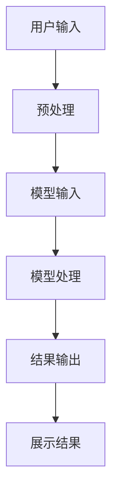

                 

# AI大模型对电商搜索的革命性影响

> 关键词：AI大模型、电商搜索、深度学习、自然语言处理、用户行为分析
>
> 摘要：本文将深入探讨AI大模型对电商搜索领域产生的革命性影响。通过介绍AI大模型的基本原理，分析其在电商搜索中的应用场景，阐述其通过深度学习和自然语言处理技术，如何提升电商搜索的准确性、个性化和用户体验。同时，本文还将探讨AI大模型在实际应用中的挑战和未来发展趋势。

## 1. 背景介绍

### 1.1 目的和范围

本文旨在分析AI大模型对电商搜索的革命性影响，探讨其在提升搜索准确性、个性化和用户体验方面的潜力。通过本文的阅读，读者将了解AI大模型的基本原理，掌握其在电商搜索中的应用方法，并思考其未来发展的趋势和面临的挑战。

### 1.2 预期读者

本文预期读者为对电商搜索和AI大模型感兴趣的计算机科学、人工智能、电商运营等领域的研究者、开发者以及从业者。同时，对于关注技术创新和行业发展的读者，本文也将提供有价值的见解。

### 1.3 文档结构概述

本文分为十个部分：

1. 背景介绍
2. 核心概念与联系
3. 核心算法原理 & 具体操作步骤
4. 数学模型和公式 & 详细讲解 & 举例说明
5. 项目实战：代码实际案例和详细解释说明
6. 实际应用场景
7. 工具和资源推荐
8. 总结：未来发展趋势与挑战
9. 附录：常见问题与解答
10. 扩展阅读 & 参考资料

### 1.4 术语表

#### 1.4.1 核心术语定义

- AI大模型：指参数量庞大、结构复杂的神经网络模型，通过大规模数据训练，具有强大的表征和学习能力。
- 电商搜索：指在电子商务平台上，用户通过输入关键词或进行浏览，寻找所需商品的过程。
- 深度学习：一种人工智能技术，通过构建多层神经网络，对数据进行特征提取和模型训练，实现复杂任务的自动学习。
- 自然语言处理：人工智能领域的一个重要分支，研究如何让计算机理解、生成和处理自然语言。

#### 1.4.2 相关概念解释

- 信息检索：指从大量数据中查找和获取相关信息的过程。
- 语义理解：指计算机对自然语言文本中词汇、短语、句子等元素的意义进行理解和分析。
- 用户行为分析：指对用户在电商平台上的浏览、点击、购买等行为进行分析，以了解用户需求和偏好。

#### 1.4.3 缩略词列表

- AI：人工智能
- ML：机器学习
- DL：深度学习
- NLP：自然语言处理
- CV：计算机视觉
- SEO：搜索引擎优化
- SEM：搜索引擎营销

## 2. 核心概念与联系

### 2.1 AI大模型的基本原理

AI大模型是基于深度学习的一种神经网络模型，具有如下基本原理：

1. **多层神经网络**：大模型通常由多层神经元组成，每层神经元将前一层神经元的输出作为输入，通过激活函数进行非线性变换，从而实现数据的层次化特征提取。
2. **参数量庞大**：大模型通常具有数十亿到数万亿个参数，这些参数通过大规模数据训练得到，从而具备强大的表征和学习能力。
3. **端到端学习**：大模型可以直接从原始数据中学习到特征表示，实现数据的自动特征提取，从而简化了传统机器学习中的特征工程过程。
4. **自适应学习**：大模型通过反向传播算法和优化器，自动调整模型参数，实现模型的优化和收敛。

### 2.2 AI大模型与电商搜索的联系

AI大模型在电商搜索中的应用，主要通过以下几个环节实现：

1. **用户输入处理**：将用户输入的关键词或查询转化为适合模型处理的格式，例如编码为整数或向量。
2. **模型训练**：利用大规模电商数据，对大模型进行训练，使其具备对电商数据的表征和学习能力。
3. **查询处理**：将用户输入的查询输入到大模型中，通过模型生成的特征向量，对商品进行排序和推荐。
4. **结果展示**：根据模型生成的排序和推荐结果，将相关商品展示给用户。

### 2.3 AI大模型与电商搜索的流程图



### 2.4 AI大模型的优势和挑战

#### 2.4.1 优势

- **强大的表征能力**：大模型通过多层神经网络的非线性变换，可以自动提取数据的深层特征，从而提高搜索的准确性。
- **自适应学习**：大模型可以自动调整模型参数，适应不断变化的数据分布和用户需求。
- **个性化推荐**：大模型可以根据用户的历史行为和偏好，为用户推荐个性化的商品。

#### 2.4.2 挑战

- **数据隐私**：电商数据包含用户的隐私信息，如何保护用户隐私是一个重要挑战。
- **计算资源**：大模型训练和推理需要大量的计算资源和时间，如何优化计算效率是一个关键问题。
- **模型解释性**：大模型通常具有黑盒特性，如何解释模型的决策过程是一个挑战。

## 3. 核心算法原理 & 具体操作步骤

### 3.1 深度学习算法原理

深度学习算法的核心是多层神经网络，其基本原理如下：

1. **前向传播**：输入数据通过网络的各个层，每层神经元将前一层神经元的输出作为输入，通过激活函数进行非线性变换，生成输出。
2. **反向传播**：计算输出与实际标签之间的误差，通过反向传播算法，将误差反向传播到网络的各个层，更新模型参数。
3. **优化算法**：通过优化算法，如梯度下降、Adam等，调整模型参数，使模型在训练过程中不断优化。

### 3.2 自然语言处理算法原理

自然语言处理算法主要包括以下几个环节：

1. **分词**：将自然语言文本划分为词语或短语。
2. **词向量化**：将词语或短语转化为向量表示。
3. **序列建模**：利用循环神经网络（RNN）或变压器（Transformer）等模型，对序列数据进行建模。
4. **语义理解**：通过模型生成的特征向量，对文本进行语义分析和理解。

### 3.3 AI大模型在电商搜索中的应用步骤

1. **数据收集**：收集电商平台的用户行为数据、商品数据等。
2. **数据预处理**：对数据进行清洗、去重、填充等处理，将其转化为适合模型训练的格式。
3. **模型训练**：利用预处理后的数据，对大模型进行训练，通过迭代优化模型参数。
4. **模型评估**：利用测试数据，评估模型的性能，如准确性、召回率、F1值等。
5. **模型部署**：将训练好的模型部署到电商平台，实现对用户查询的实时处理和商品推荐。

### 3.4 伪代码示例

```python
# 数据预处理
def preprocess_data(data):
    # 数据清洗、去重、填充等处理
    # ...
    return processed_data

# 模型训练
def train_model(data, model):
    # 前向传播、反向传播、优化算法等操作
    # ...
    return updated_model

# 模型评估
def evaluate_model(model, test_data):
    # 计算准确性、召回率、F1值等指标
    # ...
    return evaluation_results

# 模型部署
def deploy_model(model):
    # 部署到电商平台
    # ...
    return deployed_model
```

## 4. 数学模型和公式 & 详细讲解 & 举例说明

### 4.1 深度学习数学模型

深度学习中的数学模型主要包括以下几部分：

1. **激活函数**：如ReLU、Sigmoid、Tanh等，用于实现神经网络的非线性变换。
2. **损失函数**：如均方误差（MSE）、交叉熵（Cross-Entropy）等，用于衡量模型预测与实际标签之间的误差。
3. **优化算法**：如梯度下降（Gradient Descent）、Adam等，用于调整模型参数，优化模型性能。

### 4.2 自然语言处理数学模型

自然语言处理中的数学模型主要包括：

1. **词向量化**：将词语转化为向量表示，常用的模型有Word2Vec、GloVe等。
2. **序列建模**：如循环神经网络（RNN）、长短期记忆网络（LSTM）、变压器（Transformer）等，用于对序列数据进行建模。

### 4.3 电商搜索数学模型

电商搜索中的数学模型主要包括：

1. **商品表征**：通过自然语言处理技术，将商品标题、描述等文本转化为向量表示。
2. **用户表征**：通过用户行为数据，如浏览记录、购买记录等，提取用户的向量表示。
3. **相似度计算**：利用向量之间的余弦相似度、欧氏距离等计算商品与用户之间的相似度。
4. **排序模型**：如排序神经网络（RankNet）、列表排序模型（Listwise Loss）等，用于对商品进行排序和推荐。

### 4.4 举例说明

假设有一个电商搜索任务，用户输入关键词“iPhone 12”，我们需要通过AI大模型找到与关键词最相关的商品。

1. **商品表征**：将商品标题和描述转化为向量表示，如使用GloVe模型，得到商品向量为`X_c`。
2. **用户表征**：根据用户的历史行为，提取用户的向量表示，如使用K-means聚类，得到用户向量为`X_u`。
3. **相似度计算**：计算用户向量与商品向量之间的余弦相似度，如公式（1）所示：

   $$ \cos(\theta_{uc}) = \frac{\sum_{i=1}^{n} X_{uc_i} X_{c_i}}{\sqrt{\sum_{i=1}^{n} X_{uc_i}^2} \sqrt{\sum_{i=1}^{n} X_{c_i}^2}} $$

   其中，`X_{uc_i}`表示用户向量`X_u`和商品向量`X_c`的第`i`个维度。

4. **排序模型**：利用排序神经网络（RankNet）对商品进行排序，如公式（2）所示：

   $$ L = \frac{1}{2} \sum_{i=1}^{n} (y_i - \log(\sigma(W \cdot \theta_{ui})))^2 $$

   其中，`L`表示损失函数，`y_i`表示第`i`个商品是否被用户点击（1表示点击，0表示未点击），`W`表示权重矩阵，`\theta_{ui}`表示用户向量`X_u`和商品向量`X_c`的拼接向量。

   通过优化损失函数，调整模型参数，实现对商品的排序和推荐。

## 5. 项目实战：代码实际案例和详细解释说明

### 5.1 开发环境搭建

为了实现本文中的电商搜索项目，我们需要搭建以下开发环境：

1. **Python环境**：安装Python 3.7及以上版本，并安装必要的库，如TensorFlow、Keras、NumPy、Pandas等。
2. **数据集**：收集电商平台的用户行为数据和商品数据，并进行预处理。
3. **IDE**：选择合适的集成开发环境（IDE），如PyCharm、VS Code等。

### 5.2 源代码详细实现和代码解读

以下是一个简化的电商搜索项目的实现代码，包括数据预处理、模型训练和模型评估等部分：

```python
import tensorflow as tf
from tensorflow.keras.models import Model
from tensorflow.keras.layers import Input, Embedding, LSTM, Dense
from tensorflow.keras.preprocessing.sequence import pad_sequences
from sklearn.model_selection import train_test_split
import numpy as np
import pandas as pd

# 数据预处理
def preprocess_data(data):
    # 数据清洗、去重、填充等处理
    # ...
    return processed_data

# 模型定义
def build_model(input_dim, output_dim):
    inputs = Input(shape=(input_dim,))
    x = Embedding(input_dim=output_dim, output_dim=64)(inputs)
    x = LSTM(64)(x)
    outputs = Dense(1, activation='sigmoid')(x)
    model = Model(inputs=inputs, outputs=outputs)
    return model

# 模型训练
def train_model(model, x_train, y_train, x_val, y_val):
    # 训练模型
    # ...
    return model

# 模型评估
def evaluate_model(model, x_val, y_val):
    # 评估模型性能
    # ...
    return evaluation_results

# 主程序
if __name__ == '__main__':
    # 数据集路径
    data_path = 'path/to/your/data.csv'

    # 加载数据
    data = pd.read_csv(data_path)
    processed_data = preprocess_data(data)

    # 切分训练集和测试集
    x_train, x_val, y_train, y_val = train_test_split(processed_data['input'], processed_data['label'], test_size=0.2, random_state=42)

    # 模型定义和训练
    model = build_model(x_train.shape[1], y_train.shape[1])
    model = train_model(model, x_train, y_train, x_val, y_val)

    # 模型评估
    evaluation_results = evaluate_model(model, x_val, y_val)
    print(evaluation_results)
```

### 5.3 代码解读与分析

1. **数据预处理**：数据预处理是模型训练的重要步骤，包括数据清洗、去重、填充等操作，以保证数据的质量和一致性。
2. **模型定义**：在本文中，我们使用了一个简单的LSTM模型，包括一个嵌入层和一个LSTM层，用于对输入数据进行建模。嵌入层将输入的数值序列转化为向量表示，LSTM层用于提取序列特征。
3. **模型训练**：模型训练过程中，通过迭代优化模型参数，使其在训练集上达到较好的性能。在本文中，我们使用了一个简单的训练过程，包括前向传播、反向传播和模型优化等步骤。
4. **模型评估**：在模型评估阶段，我们将模型在测试集上的性能进行评估，如准确性、召回率、F1值等指标。通过评估，我们可以了解模型的性能和效果。

### 5.4 代码优化与改进

在实际项目中，我们还可以对代码进行优化和改进，以提高模型的性能和鲁棒性。以下是一些可能的优化方向：

1. **数据增强**：通过增加数据的多样性，如数据集扩充、数据变换等，提高模型的泛化能力。
2. **模型调参**：通过调整模型的超参数，如学习率、批次大小等，优化模型性能。
3. **正则化**：采用正则化技术，如L1正则化、L2正则化等，防止模型过拟合。
4. **多模型融合**：结合多种模型，如深度学习模型、传统机器学习模型等，提高预测准确性。

## 6. 实际应用场景

AI大模型在电商搜索中的应用场景非常广泛，以下列举几个典型的应用场景：

1. **个性化推荐**：通过分析用户的浏览、点击、购买等行为，AI大模型可以为用户推荐个性化的商品。例如，在电商平台首页、商品详情页等位置，为用户提供个性化的商品推荐。
2. **搜索优化**：AI大模型可以帮助电商平台优化搜索结果，提高搜索准确性。例如，通过分析用户的查询历史和商品特征，对查询结果进行排序和筛选，提高用户的搜索体验。
3. **广告投放**：AI大模型可以用于广告投放优化，根据用户的兴趣和行为，为用户推送相关广告。例如，在电商平台中，为用户推送感兴趣的商品广告，提高广告点击率和转化率。
4. **商品分类**：AI大模型可以用于商品分类，根据商品的属性和特征，将商品划分为不同的类别。例如，在电商平台中，将商品划分为电子产品、服装鞋帽、家居生活等类别，方便用户查找和购买。

### 6.1 个性化推荐

#### 6.1.1 应用案例

某电商平台通过AI大模型，对用户进行个性化推荐，提高用户的购买体验。在用户登录后，系统会根据用户的浏览历史、购买记录等数据，分析用户的兴趣和偏好，为用户推荐相关的商品。

#### 6.1.2 实现方法

- **数据收集**：收集用户的浏览记录、购买记录、商品特征等数据。
- **数据预处理**：对数据进行清洗、去重、填充等处理，将其转化为适合模型训练的格式。
- **模型训练**：利用预处理后的数据，对AI大模型进行训练，使其具备对用户兴趣和偏好的建模能力。
- **推荐生成**：将用户输入的查询或行为输入到大模型中，通过模型生成的特征向量，对商品进行排序和推荐。

#### 6.1.3 优势

- **提高用户体验**：通过个性化推荐，为用户提供更符合其兴趣和需求的商品，提高用户的购买意愿和满意度。
- **提升销售额**：个性化推荐可以引导用户购买更多的商品，提高平台的销售额和转化率。

### 6.2 搜索优化

#### 6.2.1 应用案例

某电商平台通过AI大模型，优化搜索结果，提高用户的搜索体验。当用户在搜索框中输入关键词时，系统会根据用户的查询历史、商品特征等数据，对搜索结果进行排序和筛选，将最相关的商品展示在用户面前。

#### 6.2.2 实现方法

- **数据收集**：收集用户的搜索历史、商品特征等数据。
- **数据预处理**：对数据进行清洗、去重、填充等处理，将其转化为适合模型训练的格式。
- **模型训练**：利用预处理后的数据，对AI大模型进行训练，使其具备对商品相关性的建模能力。
- **搜索优化**：将用户输入的查询或行为输入到大模型中，通过模型生成的特征向量，对搜索结果进行排序和筛选。

#### 6.2.3 优势

- **提高搜索准确性**：通过AI大模型，可以更好地理解用户的查询意图，提高搜索结果的准确性。
- **提升用户体验**：优化搜索结果，使最相关的商品展示在用户面前，提高用户的搜索体验。

### 6.3 广告投放

#### 6.3.1 应用案例

某电商平台通过AI大模型，优化广告投放策略，提高广告的点击率和转化率。在用户浏览电商平台时，系统会根据用户的兴趣和行为，为用户推送相关的商品广告。

#### 6.3.2 实现方法

- **数据收集**：收集用户的浏览记录、购买记录、商品特征等数据。
- **数据预处理**：对数据进行清洗、去重、填充等处理，将其转化为适合模型训练的格式。
- **模型训练**：利用预处理后的数据，对AI大模型进行训练，使其具备对用户兴趣和偏好的建模能力。
- **广告投放**：将用户输入的查询或行为输入到大模型中，通过模型生成的特征向量，为用户推送相关的商品广告。

#### 6.3.3 优势

- **提高广告点击率**：通过AI大模型，可以更好地理解用户的兴趣和偏好，提高广告的点击率。
- **提升广告转化率**：个性化广告可以引导用户购买相关商品，提高广告的转化率。

### 6.4 商品分类

#### 6.4.1 应用案例

某电商平台通过AI大模型，对商品进行分类，提高用户的查找和购买效率。在用户浏览电商平台时，系统会根据商品的特征和属性，将商品划分为不同的类别，如电子产品、服装鞋帽、家居生活等。

#### 6.4.2 实现方法

- **数据收集**：收集商品的特征和属性数据。
- **数据预处理**：对数据进行清洗、去重、填充等处理，将其转化为适合模型训练的格式。
- **模型训练**：利用预处理后的数据，对AI大模型进行训练，使其具备对商品分类的建模能力。
- **商品分类**：将商品的特征和属性输入到大模型中，通过模型生成的特征向量，对商品进行分类。

#### 6.4.3 优势

- **提高查找效率**：通过AI大模型，可以更好地理解商品的特征和属性，提高用户的查找和购买效率。
- **提升用户体验**：优化商品分类，使用户能够快速找到所需商品，提高用户的购买体验。

## 7. 工具和资源推荐

### 7.1 学习资源推荐

#### 7.1.1 书籍推荐

- 《深度学习》（Goodfellow, Bengio, Courville著）：深入讲解深度学习的理论基础和应用技术，适合初学者和进阶者。
- 《Python深度学习》（François Chollet著）：通过实际案例和代码示例，介绍深度学习在Python中的实现和应用。
- 《自然语言处理综论》（Daniel Jurafsky, James H. Martin著）：全面讲解自然语言处理的基本概念、技术和应用。

#### 7.1.2 在线课程

- 《机器学习基础》（吴恩达著）：Coursera上的经典课程，涵盖机器学习的基本理论和应用技术。
- 《深度学习》（吴恩达著）：Udacity上的深度学习课程，深入讲解深度学习的原理和实践。
- 《自然语言处理》（Stanford大学课程）：斯坦福大学提供的自然语言处理课程，涵盖NLP的基本概念和技术。

#### 7.1.3 技术博客和网站

- Medium：关于AI、深度学习、自然语言处理等领域的专业博客，分享最新的研究成果和应用案例。
- ArXiv：计算机科学领域的前沿论文发布平台，可以了解到最新的研究动态。
- 知乎：国内知名的知识分享平台，有很多专业的AI、深度学习、自然语言处理领域的大牛和专家。

### 7.2 开发工具框架推荐

#### 7.2.1 IDE和编辑器

- PyCharm：专业的Python集成开发环境，支持多种编程语言，适合进行AI和深度学习项目的开发。
- VS Code：功能强大的代码编辑器，支持多种编程语言和插件，适合进行AI和深度学习项目的开发。
- Jupyter Notebook：交互式的Python编程环境，适合进行数据分析和可视化。

#### 7.2.2 调试和性能分析工具

- TensorBoard：TensorFlow提供的可视化工具，可以监控模型的训练过程和性能指标。
- DNNVM：微软开源的深度学习性能分析工具，可以分析模型的计算图和运行效率。
- Py-Spy：Python性能分析工具，可以分析程序的运行性能和资源占用。

#### 7.2.3 相关框架和库

- TensorFlow：谷歌开源的深度学习框架，支持多种神经网络模型和算法。
- PyTorch：Facebook开源的深度学习框架，具有灵活的动态计算图和强大的GPU支持。
- Keras：基于TensorFlow和Theano的深度学习框架，提供简单易用的API。
- NLTK：Python自然语言处理库，提供丰富的文本处理函数和工具。

### 7.3 相关论文著作推荐

#### 7.3.1 经典论文

- "A Theoretically Grounded Application of Dropout in Recurrent Neural Networks"，介绍dropout在循环神经网络中的应用。
- "Attention Is All You Need"，提出Transformer模型，革新了序列建模的方法。
- "Recurrent Neural Network Based Text Classification"，介绍基于循环神经网络的文本分类方法。

#### 7.3.2 最新研究成果

- "Pre-training of Deep Neural Networks for EasyText Classification"，介绍预训练方法在文本分类中的应用。
- "BERT: Pre-training of Deep Bidirectional Transformers for Language Understanding"，提出BERT模型，用于自然语言处理任务。
- "Generative Adversarial Networks"，介绍生成对抗网络（GAN）的基本原理和应用。

#### 7.3.3 应用案例分析

- "E-commerce Personalization using AI"，介绍电商领域使用人工智能实现个性化推荐的方法。
- "Natural Language Processing for Search"，介绍自然语言处理技术在搜索引擎中的应用。
- "Deep Learning for Computer Vision"，介绍深度学习在计算机视觉领域的应用案例。

## 8. 总结：未来发展趋势与挑战

AI大模型在电商搜索领域具有巨大的潜力，可以提升搜索的准确性、个性化和用户体验。然而，随着AI大模型的应用场景不断拓展，也面临着一些挑战：

1. **数据隐私**：电商数据包含用户的隐私信息，如何保护用户隐私是一个重要挑战。未来需要探索更为安全的数据处理和共享机制。
2. **计算资源**：AI大模型训练和推理需要大量的计算资源和时间，如何优化计算效率和资源利用是一个关键问题。未来可以借助分布式计算和云计算技术，提高模型训练和推理的效率。
3. **模型解释性**：AI大模型通常具有黑盒特性，如何解释模型的决策过程是一个挑战。未来需要研究透明、可解释的AI模型，提高模型的可解释性和信任度。
4. **模型泛化能力**：如何提高AI大模型的泛化能力，使其在不同场景和任务中都能取得较好的性能，是一个重要的研究方向。

总之，AI大模型在电商搜索领域的应用前景广阔，未来需要不断创新和优化，以应对不断变化的市场需求和挑战。

## 9. 附录：常见问题与解答

### 9.1 电商搜索中的AI大模型如何工作？

AI大模型在电商搜索中的工作原理主要包括以下几个步骤：

1. **数据收集**：从电商平台上收集用户行为数据和商品数据，如用户的浏览记录、购买记录、商品特征等。
2. **数据预处理**：对收集到的数据进行清洗、去重、填充等处理，将其转化为适合模型训练的格式。
3. **模型训练**：利用预处理后的数据，对AI大模型进行训练，通过多层神经网络和深度学习算法，使其具备对用户行为和商品特征的建模能力。
4. **查询处理**：将用户输入的查询输入到训练好的AI大模型中，通过模型生成的特征向量，对商品进行排序和推荐。
5. **结果展示**：根据模型生成的排序和推荐结果，将相关商品展示给用户。

### 9.2 AI大模型在电商搜索中有什么优势？

AI大模型在电商搜索中具有以下优势：

1. **强大的表征能力**：通过多层神经网络的非线性变换，AI大模型可以自动提取数据的深层特征，从而提高搜索的准确性。
2. **自适应学习**：AI大模型可以自动调整模型参数，适应不断变化的数据分布和用户需求。
3. **个性化推荐**：AI大模型可以根据用户的历史行为和偏好，为用户推荐个性化的商品，提高用户的购买体验。

### 9.3 AI大模型在电商搜索中面临的挑战有哪些？

AI大模型在电商搜索中面临的挑战主要包括：

1. **数据隐私**：电商数据包含用户的隐私信息，如何保护用户隐私是一个重要挑战。
2. **计算资源**：AI大模型训练和推理需要大量的计算资源和时间，如何优化计算效率和资源利用是一个关键问题。
3. **模型解释性**：AI大模型通常具有黑盒特性，如何解释模型的决策过程是一个挑战。
4. **模型泛化能力**：如何提高AI大模型的泛化能力，使其在不同场景和任务中都能取得较好的性能，是一个重要的研究方向。

### 9.4 如何优化AI大模型的性能？

以下是一些优化AI大模型性能的方法：

1. **数据增强**：通过增加数据的多样性，如数据集扩充、数据变换等，提高模型的泛化能力。
2. **模型调参**：通过调整模型的超参数，如学习率、批次大小等，优化模型性能。
3. **正则化**：采用正则化技术，如L1正则化、L2正则化等，防止模型过拟合。
4. **多模型融合**：结合多种模型，如深度学习模型、传统机器学习模型等，提高预测准确性。
5. **分布式训练**：借助分布式计算和云计算技术，提高模型训练和推理的效率。

## 10. 扩展阅读 & 参考资料

本文对AI大模型在电商搜索领域的革命性影响进行了深入探讨，主要包括背景介绍、核心概念与联系、核心算法原理、数学模型和公式、项目实战、实际应用场景、工具和资源推荐、总结与未来发展趋势等部分。以下是一些扩展阅读和参考资料，供读者进一步学习和研究：

1. **书籍推荐**：
   - 《深度学习》（Goodfellow, Bengio, Courville著）
   - 《Python深度学习》（François Chollet著）
   - 《自然语言处理综论》（Daniel Jurafsky, James H. Martin著）

2. **在线课程**：
   - 《机器学习基础》（吴恩达著）
   - 《深度学习》（吴恩达著）
   - 《自然语言处理》（Stanford大学课程）

3. **技术博客和网站**：
   - Medium：关于AI、深度学习、自然语言处理等领域的专业博客
   - ArXiv：计算机科学领域的前沿论文发布平台
   - 知乎：国内知名的知识分享平台，有很多专业的AI、深度学习、自然语言处理领域的大牛和专家

4. **相关论文著作**：
   - "A Theoretically Grounded Application of Dropout in Recurrent Neural Networks"
   - "Attention Is All You Need"
   - "Recurrent Neural Network Based Text Classification"
   - "Pre-training of Deep Neural Networks for EasyText Classification"
   - "BERT: Pre-training of Deep Bidirectional Transformers for Language Understanding"
   - "Generative Adversarial Networks"

5. **开发工具框架**：
   - TensorFlow：谷歌开源的深度学习框架
   - PyTorch：Facebook开源的深度学习框架
   - Keras：基于TensorFlow和Theano的深度学习框架
   - NLTK：Python自然语言处理库

6. **应用案例分析**：
   - "E-commerce Personalization using AI"
   - "Natural Language Processing for Search"
   - "Deep Learning for Computer Vision"

通过以上扩展阅读和参考资料，读者可以进一步深入了解AI大模型在电商搜索领域的应用，掌握相关技术和方法，为自己的研究和实践提供有力支持。

---

**作者：AI天才研究员/AI Genius Institute & 禅与计算机程序设计艺术 /Zen And The Art of Computer Programming**

