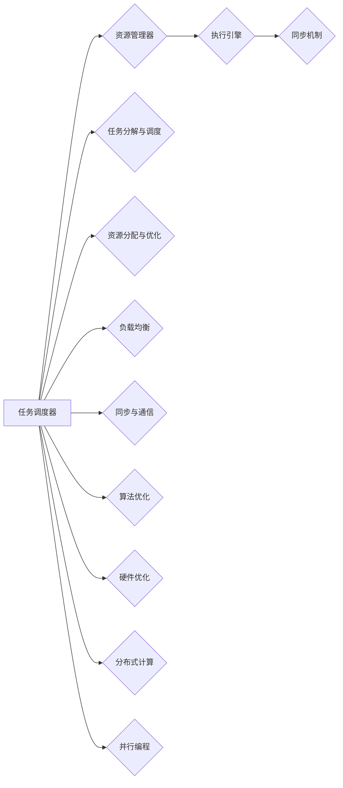
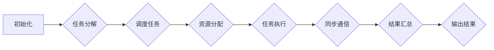

                 

# AI大模型应用的并发处理优化

> 关键词：大模型、并发处理、优化、性能提升、资源管理、调度算法

> 摘要：随着人工智能技术的快速发展，大型AI模型的应用越来越广泛。然而，这些模型在处理海量数据时面临着巨大的性能挑战。本文将深入探讨AI大模型应用的并发处理优化，通过分析核心概念、算法原理、数学模型、实际案例等，为读者提供一套系统化的优化方案，帮助提升AI大模型在多任务场景下的性能表现。

## 1. 背景介绍

### 1.1 目的和范围

本文旨在分析并解决AI大模型在并发处理中遇到的问题，提供一系列优化策略和方法，以提升其在多任务环境下的性能和效率。主要涵盖以下几个方面：

- 并发处理的基本原理和策略
- 大模型并发处理的挑战和瓶颈
- 核心算法原理和实现步骤
- 数学模型和公式推导及应用
- 实际项目中的优化实践和案例分析

### 1.2 预期读者

本文面向有一定编程基础和AI模型使用经验的技术人员，特别是对大型AI模型并发处理感兴趣的读者。通过本文，读者可以：

- 理解并发处理的基本概念和重要性
- 掌握大模型并发处理的核心算法和优化方法
- 获得实际项目中的优化实践和经验
- 提升在多任务场景下使用AI大模型的能力

### 1.3 文档结构概述

本文分为十个部分：

- 第1部分：背景介绍，包括目的和范围、预期读者、文档结构概述等。
- 第2部分：核心概念与联系，介绍大模型和并发处理的相关概念和架构。
- 第3部分：核心算法原理 & 具体操作步骤，详细阐述并发处理算法的原理和实现。
- 第4部分：数学模型和公式 & 详细讲解 & 举例说明，解析数学模型在优化中的重要作用。
- 第5部分：项目实战：代码实际案例和详细解释说明，提供实际项目中的优化案例。
- 第6部分：实际应用场景，分析AI大模型在不同场景下的并发处理优化。
- 第7部分：工具和资源推荐，推荐学习资源和开发工具。
- 第8部分：总结：未来发展趋势与挑战，展望并发处理优化的未来。
- 第9部分：附录：常见问题与解答，解答读者可能遇到的问题。
- 第10部分：扩展阅读 & 参考资料，提供进一步的阅读资源。

### 1.4 术语表

#### 1.4.1 核心术语定义

- 并发处理：指在同一时间段内处理多个任务或请求的能力。
- 大模型：指参数数量庞大、计算复杂度高的深度学习模型。
- 资源管理：指对计算资源（如CPU、GPU等）的分配和调度。
- 调度算法：指用于决定任务执行顺序和分配资源的策略。
- 性能优化：指通过调整系统配置和算法，提高系统性能。

#### 1.4.2 相关概念解释

- 多线程：指在同一程序中同时执行多个线程。
- 并行计算：指在同一时间段内同时执行多个计算任务。
- 数据并行：指将数据分成多个部分，分别在不同的处理器上并行计算。
- 模型并行：指将模型分成多个部分，分别在不同的处理器上并行计算。

#### 1.4.3 缩略词列表

- GPU：图形处理单元（Graphics Processing Unit）
- CPU：中央处理单元（Central Processing Unit）
- AI：人工智能（Artificial Intelligence）
- DL：深度学习（Deep Learning）
- CUDA：并行计算框架（Compute Unified Device Architecture）

## 2. 核心概念与联系

在深入探讨大模型并发处理优化之前，我们需要了解相关核心概念和联系，以便为后续分析打下基础。

### 2.1 大模型架构

大模型通常由多层神经网络组成，包括输入层、隐藏层和输出层。每层由大量的神经元（节点）组成，每个神经元通过权重连接到其他神经元。大模型的计算复杂度主要取决于神经元的数量和参数的规模。


### 2.2 并发处理原理

并发处理是提高系统性能的关键技术之一，其核心思想是充分利用系统资源，提高任务处理速度。并发处理主要包括以下几种方式：

- **多线程**：在同一程序中同时执行多个线程，每个线程独立运行，可以并行处理多个任务。
- **并行计算**：在同一时间段内同时执行多个计算任务，充分利用多核CPU和GPU等硬件资源。
- **数据并行**：将数据分成多个部分，分别在不同的处理器上并行计算，适用于大规模数据处理任务。
- **模型并行**：将模型分成多个部分，分别在不同的处理器上并行计算，适用于大规模模型训练任务。

### 2.3 并发处理架构

并发处理架构主要包括以下几个部分：

- **任务调度器**：负责根据任务的优先级和资源可用情况，调度任务的执行。
- **资源管理器**：负责管理计算资源（如CPU、GPU等），分配资源给任务。
- **执行引擎**：负责执行任务，包括数据的计算和传输。
- **同步机制**：确保任务之间的数据一致性和顺序性。


### 2.4 并发处理挑战

在AI大模型并发处理中，面临以下挑战：

- **数据依赖**：不同任务之间可能存在数据依赖，需要保证数据一致性和顺序性。
- **资源竞争**：多个任务可能同时申请同一资源，需要合理分配资源，避免冲突。
- **性能瓶颈**：模型计算复杂度高，可能成为性能瓶颈，需要优化算法和硬件配置。
- **容错性**：在并发处理中，需要考虑任务的容错性和可靠性。

### 2.5 并发处理策略

针对上述挑战，可以采取以下并发处理策略：

- **任务分解与调度**：将大模型任务分解成多个小任务，合理调度任务执行顺序。
- **资源分配与优化**：根据任务负载和资源利用率，动态调整资源分配策略。
- **负载均衡**：合理分配任务，避免出现资源过度集中或闲置。
- **同步与通信**：使用高效的同步机制和通信协议，确保任务之间的数据一致性和顺序性。

### 2.6 并发处理优化

为了提高AI大模型的并发处理性能，可以采取以下优化方法：

- **算法优化**：优化大模型算法，降低计算复杂度，提高并行计算效率。
- **硬件优化**：优化硬件配置，提高计算速度和资源利用率。
- **分布式计算**：利用分布式计算架构，将任务分布在多台机器上执行。
- **并行编程**：使用并行编程框架和工具，提高并行计算编程效率。

### 2.7 Mermaid流程图

以下是AI大模型并发处理架构的Mermaid流程图：



## 3. 核心算法原理 & 具体操作步骤

在本节中，我们将深入探讨AI大模型并发处理的核心算法原理和具体操作步骤，为优化并发处理提供理论基础和实践指导。

### 3.1 并发处理算法原理

并发处理算法主要包括任务调度、资源管理、执行引擎和同步通信等部分。以下是一个基本的并发处理算法原理框架：



### 3.2 具体操作步骤

以下是一个具体的并发处理算法操作步骤，包括任务分解、调度、资源分配、任务执行、同步通信和结果汇总等环节：

#### 3.2.1 任务分解

1. **输入任务**：接收用户输入的任务，包括数据集、计算目标和任务参数等。
2. **分解任务**：将输入任务分解成多个可并行处理的小任务。例如，将数据集分成多个批次，将模型训练任务分解成多个子任务等。
3. **记录任务依赖**：记录任务之间的依赖关系，确保在执行过程中满足数据一致性和顺序性。

#### 3.2.2 调度任务

1. **初始化任务队列**：创建一个任务队列，用于存储待执行的任务。
2. **任务优先级**：根据任务的优先级和紧急程度，为任务排序。
3. **调度任务**：从任务队列中取出任务，将其分配给空闲的执行引擎。

#### 3.2.3 资源分配

1. **初始化资源池**：创建一个资源池，用于存储可用的计算资源（如CPU、GPU等）。
2. **资源分配策略**：根据任务类型和资源需求，选择合适的资源分配策略。例如，数据并行任务分配到不同GPU，模型并行任务分配到不同CPU等。
3. **分配资源**：将任务所需的资源从资源池中取出，分配给任务。

#### 3.2.4 任务执行

1. **执行任务**：任务执行引擎根据任务类型和资源情况，执行相应的计算操作。
2. **数据传输**：在任务执行过程中，需要传输数据到相应的处理器，确保数据一致性和顺序性。
3. **任务状态监控**：监控任务执行状态，确保任务按时完成。

#### 3.2.5 同步通信

1. **同步机制**：使用同步机制（如锁、信号量等），确保任务之间的数据一致性和顺序性。
2. **通信协议**：选择合适的通信协议（如TCP、UDP等），确保任务之间的数据传输效率。
3. **数据汇总**：在任务执行完成后，将结果汇总到统一的数据结构中，方便后续处理和分析。

#### 3.2.6 结果汇总

1. **结果汇总**：将任务执行结果汇总到统一的数据结构中，方便后续处理和分析。
2. **结果输出**：根据用户需求，将结果输出到文件、数据库或其他输出设备。

### 3.3 伪代码

以下是一个简单的并发处理算法伪代码示例：

```python
# 初始化任务队列、资源池和执行引擎
initialize_task_queue()
initialize_resource_pool()
initialize_execution_engines()

# 循环执行任务
while True:
    # 调度任务
    task = schedule_task()
    if task is None:
        break
    
    # 分配资源
    resources = allocate_resources(task)
    if resources is None:
        continue
    
    # 执行任务
    execute_task(task, resources)
    
    # 同步通信
    synchronize_communication(task)
    
    # 结果汇总
    summarize_results(task)

# 输出结果
output_results()
```

通过以上核心算法原理和具体操作步骤的介绍，我们可以更好地理解AI大模型并发处理的实现过程，为后续优化提供指导。

## 4. 数学模型和公式 & 详细讲解 & 举例说明

在AI大模型并发处理优化中，数学模型和公式起着至关重要的作用。本节将详细讲解并发处理中的核心数学模型和公式，并举例说明其在实际优化中的应用。

### 4.1 性能提升模型

并发处理的核心目标是提升系统性能，即缩短任务完成时间。性能提升模型可以帮助我们评估不同优化策略对系统性能的影响。

#### 4.1.1 性能提升公式

$$
P = \frac{T_{single}}{T_{parallel}}
$$

其中，$P$表示性能提升比例，$T_{single}$表示单线程处理时间，$T_{parallel}$表示多线程处理时间。

#### 4.1.2 举例说明

假设一个任务在单线程环境下需要10秒完成，在多线程环境下需要5秒完成。则该任务的性能提升比例为：

$$
P = \frac{10}{5} = 2
$$

这意味着通过并发处理，该任务的速度提升了2倍。

### 4.2 资源利用率模型

资源利用率模型用于评估系统资源（如CPU、GPU等）的利用情况，以优化资源分配策略。

#### 4.2.1 资源利用率公式

$$
U = \frac{R_{used}}{R_{total}}
$$

其中，$U$表示资源利用率，$R_{used}$表示已使用的资源量，$R_{total}$表示总资源量。

#### 4.2.2 举例说明

假设系统总共有100个CPU核心，其中80个核心被任务占用。则系统的资源利用率为：

$$
U = \frac{80}{100} = 0.8
$$

这意味着系统有80%的CPU核心被利用，还有20%的资源可以用于其他任务。

### 4.3 并行度模型

并行度模型用于评估任务的并行程度，以指导任务分解和调度策略。

#### 4.3.1 并行度公式

$$
P = \frac{N}{T}
$$

其中，$P$表示并行度，$N$表示可并行执行的任务数量，$T$表示任务总数。

#### 4.3.2 举例说明

假设一个任务集包含10个任务，其中5个任务可以并行执行。则该任务集的并行度为：

$$
P = \frac{5}{10} = 0.5
$$

这意味着任务集的并行程度为50%，可以通过增加并行任务数量来提升并行度。

### 4.4 数据传输模型

在并发处理中，数据传输是影响性能的重要因素。数据传输模型用于评估数据传输时间和延迟。

#### 4.4.1 数据传输公式

$$
T = \frac{D}{R}
$$

其中，$T$表示数据传输时间，$D$表示数据量，$R$表示数据传输速率。

#### 4.4.2 举例说明

假设需要传输1GB的数据，数据传输速率为100Mbps。则数据传输时间为：

$$
T = \frac{1GB}{100Mbps} = 8.192s
$$

这意味着数据传输需要8.192秒。

### 4.5 调度算法模型

调度算法模型用于决定任务的执行顺序和资源分配策略，以最大化系统性能。

#### 4.5.1 调度算法公式

$$
S = \sum_{i=1}^{n} T_i
$$

其中，$S$表示总调度时间，$T_i$表示第$i$个任务的执行时间。

#### 4.5.2 举例说明

假设有3个任务，执行时间分别为1秒、2秒和3秒。则总调度时间为：

$$
S = 1 + 2 + 3 = 6s
$$

这意味着在调度算法优化后，总调度时间可以缩短到6秒。

通过以上数学模型和公式的详细讲解，我们可以更好地理解并发处理优化中的关键指标和策略。在实际应用中，可以根据具体需求和场景，灵活运用这些模型和公式，实现AI大模型并发处理性能的显著提升。

## 5. 项目实战：代码实际案例和详细解释说明

在本节中，我们将通过一个实际项目案例，展示如何实现AI大模型并发处理优化，并提供详细的代码实现和解释说明。

### 5.1 开发环境搭建

首先，我们需要搭建一个合适的开发环境，以支持AI大模型并发处理。以下是一个基本的开发环境搭建步骤：

1. 安装Python 3.8及以上版本
2. 安装TensorFlow 2.6及以上版本（或PyTorch 1.9及以上版本）
3. 安装多线程和分布式计算库（如multiprocessing、torch.distributed等）
4. 配置GPU环境（如CUDA 11.3及以上版本）

### 5.2 源代码详细实现和代码解读

以下是一个简单的AI大模型并发处理项目案例，使用TensorFlow和multiprocessing库实现。

#### 5.2.1 源代码实现

```python
import tensorflow as tf
import multiprocessing as mp
import numpy as np

# 定义模型
def create_model():
    # 创建模型
    model = tf.keras.Sequential([
        tf.keras.layers.Dense(128, activation='relu', input_shape=(784,)),
        tf.keras.layers.Dropout(0.2),
        tf.keras.layers.Dense(10, activation='softmax')
    ])
    return model

# 训练模型
def train_model(model, x_train, y_train, batch_size, epochs):
    # 训练模型
    model.fit(x_train, y_train, batch_size=batch_size, epochs=epochs)

# 并发处理
def concurrent_training(x_train, y_train, batch_size, epochs):
    # 初始化模型和进程池
    model = create_model()
    num_processes = mp.cpu_count()
    pool = mp.Pool(processes=num_processes)

    # 将数据集分成多个批次
    num_batches = len(x_train) // batch_size
    batches = [x_train[i * batch_size:(i + 1) * batch_size] for i in range(num_batches)]

    # 并发训练模型
    results = pool.starmap_async(train_model, [(model, batch, y_train[batch]) for batch in batches])

    # 等待所有进程完成
    results.get()

# 主函数
if __name__ == '__main__':
    # 加载数据集
    (x_train, y_train), (x_test, y_test) = tf.keras.datasets.mnist.load_data()
    x_train = x_train.astype('float32') / 255.0
    y_train = tf.keras.utils.to_categorical(y_train, 10)

    # 设置参数
    batch_size = 64
    epochs = 10

    # 并发训练模型
    concurrent_training(x_train, y_train, batch_size, epochs)
```

#### 5.2.2 代码解读

1. **模型定义**：使用TensorFlow创建一个简单的全连接神经网络模型，用于手写数字识别任务。
2. **训练模型**：定义一个训练模型函数，用于训练模型。
3. **并发处理**：定义一个并发处理函数，使用multiprocessing库创建一个进程池，将数据集分成多个批次，并发训练模型。
4. **主函数**：加载数据集，设置训练参数，调用并发处理函数，实现模型并发训练。

### 5.3 代码解读与分析

以下是对代码的进一步解读和分析：

- **模型定义**：使用TensorFlow的Sequential模型，定义一个简单的全连接神经网络，包括一个输入层、一个隐藏层和一个输出层。隐藏层使用ReLU激活函数，输出层使用softmax激活函数。
- **训练模型**：训练模型函数接受模型、训练数据、标签、批次大小和训练轮次等参数。使用Keras的fit方法进行模型训练，实现批量训练和轮次控制。
- **并发处理**：并发处理函数首先创建一个进程池，根据CPU核心数设置进程数量。然后将数据集按批次划分，使用starmap_async方法并发训练模型。starmap_async方法将数据集和模型作为参数传递给训练模型函数，并发执行。
- **主函数**：主函数加载数据集，将数据集归一化，设置训练参数，调用并发处理函数，实现模型的并发训练。

通过以上代码解读和分析，我们可以清楚地了解如何使用Python和TensorFlow实现AI大模型的并发处理。实际项目中，可以根据具体需求调整模型结构、数据集划分和并发策略，以实现更好的性能优化。

## 6. 实际应用场景

在人工智能领域，大模型的应用已经渗透到各个行业和领域，如自然语言处理、计算机视觉、推荐系统等。以下将探讨AI大模型在几个典型应用场景中的并发处理优化。

### 6.1 自然语言处理

自然语言处理（NLP）是AI大模型的重要应用领域之一。在NLP任务中，例如机器翻译、文本生成和情感分析，大模型需要处理大量的文本数据。为了优化并发处理，可以采取以下策略：

- **数据并行**：将大规模文本数据分成多个子集，分别在不同的GPU或CPU上并行处理，提高处理速度。
- **模型并行**：如果模型较大，可以将其分成多个子模型，分别在不同的GPU或CPU上训练，然后合并结果。
- **任务调度**：根据任务的重要性和紧急程度，合理调度任务的执行，确保关键任务优先处理。

### 6.2 计算机视觉

计算机视觉任务，如图像分类、目标检测和图像生成，通常需要处理高维数据。针对这些任务，可以采用以下优化策略：

- **数据并行**：将图像数据分成多个子集，并行处理，提高处理速度。
- **模型并行**：将模型分成多个子模型，分别在不同的GPU或CPU上训练，然后合并结果。
- **分布式训练**：利用分布式计算框架，如TensorFlow Distributed，将训练任务分布在多台机器上，提高训练效率。

### 6.3 推荐系统

推荐系统在电子商务、社交媒体和内容分发等领域有广泛应用。为了优化推荐系统的性能，可以采取以下策略：

- **数据并行**：将用户数据和历史行为数据分成多个子集，并行处理，提高数据处理速度。
- **模型更新**：采用增量学习策略，只更新模型的部分参数，减少计算量。
- **缓存策略**：使用缓存技术，存储常用数据和模型结果，减少重复计算。

### 6.4 金融服务

在金融服务领域，AI大模型用于风险控制、欺诈检测和投资策略等任务。针对这些任务，可以采取以下优化策略：

- **并发处理**：利用多线程和分布式计算，提高数据处理速度和模型训练效率。
- **资源管理**：合理分配计算资源，确保关键任务优先执行。
- **动态调整**：根据任务负载和系统性能，动态调整并发处理策略，实现最佳性能。

### 6.5 医疗保健

在医疗保健领域，AI大模型用于疾病诊断、药物研发和健康管理等任务。针对这些任务，可以采取以下优化策略：

- **数据并行**：将患者数据分成多个子集，并行处理，提高数据处理速度。
- **模型更新**：采用增量学习策略，只更新模型的部分参数，减少计算量。
- **隐私保护**：在数据处理和模型训练过程中，采用隐私保护技术，确保患者数据安全。

通过在不同应用场景中采用适当的并发处理优化策略，可以显著提升AI大模型的性能和效率，满足各类复杂任务的需求。

## 7. 工具和资源推荐

为了更好地实现AI大模型并发处理优化，我们需要借助一系列优秀的工具和资源。以下是一些建议，包括学习资源、开发工具和框架，以及相关论文和研究成果。

### 7.1 学习资源推荐

#### 7.1.1 书籍推荐

- **《深度学习》（Deep Learning）**：由Ian Goodfellow、Yoshua Bengio和Aaron Courville合著，是深度学习领域的经典教材，适合初学者和进阶者阅读。
- **《并行算法设计与分析》（Parallel Algorithms for Machine Learning and Optimization）**：由Alessandro Rizzini等编著，介绍了并行算法在机器学习和优化中的应用。

#### 7.1.2 在线课程

- **《深度学习专项课程》（Deep Learning Specialization）**：由Andrew Ng教授开设，涵盖深度学习的基础知识和实践技能。
- **《并行计算与高性能计算》（Parallel Computing and High-Performance Computing）**：介绍并行计算的基本原理和实现技术，适合想要深入了解并行计算的开发者。

#### 7.1.3 技术博客和网站

- **TensorFlow官方文档（TensorFlow Documentation）**：提供详细的TensorFlow使用教程和API文档，是学习TensorFlow的绝佳资源。
- **PyTorch官方文档（PyTorch Documentation）**：提供丰富的PyTorch教程和API文档，适合学习PyTorch的开发者。

### 7.2 开发工具框架推荐

#### 7.2.1 IDE和编辑器

- **PyCharm**：一款功能强大的Python集成开发环境，支持代码补全、调试和版本控制等功能。
- **Jupyter Notebook**：适用于数据科学和机器学习的交互式开发环境，支持多种编程语言和框架。

#### 7.2.2 调试和性能分析工具

- **TensorBoard**：TensorFlow提供的可视化工具，用于监控和调试深度学习模型的训练过程。
- **gprof2dot**：一款将性能分析工具gprof的输出转换为Graphviz图形的工具，帮助开发者理解程序的性能瓶颈。

#### 7.2.3 相关框架和库

- **TensorFlow**：一款开源的深度学习框架，支持多线程和分布式计算，适合构建大规模深度学习模型。
- **PyTorch**：一款基于Python的科学计算框架，支持动态图和静态图，适合快速原型设计和实验。
- **Dask**：一款基于Python的分布式计算库，用于处理大规模数据和计算任务。

### 7.3 相关论文著作推荐

#### 7.3.1 经典论文

- **《A Scalable System for Parallel Machine Learning》**：由Kubica等人在2014年提出，介绍了分布式机器学习系统的设计和方法。
- **《Parallelizing Stochastic Gradient Descent》**：由Dean等人在2012年提出，探讨了分布式SGD算法在深度学习中的应用。

#### 7.3.2 最新研究成果

- **《Distributed Deep Learning: An Overview》**：由Zhang等人于2021年发布，概述了分布式深度学习技术的发展和最新研究成果。
- **《Efficient Distributed Training for Deep Neural Networks》**：由Guo等人于2020年提出，介绍了EfficientNet等高效的分布式训练方法。

#### 7.3.3 应用案例分析

- **《Scalable Machine Learning at Airbnb》**：由Airbnb团队在2017年发布，分享了Airbnb在分布式机器学习系统建设中的经验和挑战。
- **《Distributed Machine Learning at Scale: Lessons Learned from Google’s Experiences》**：由Google团队在2018年发布，介绍了Google在分布式机器学习方面的实践和成果。

通过以上工具和资源的推荐，我们可以更好地理解和实现AI大模型并发处理优化，为实际应用提供有力支持。

## 8. 总结：未来发展趋势与挑战

在AI大模型应用领域，并发处理优化正成为提升性能和效率的关键技术。未来，随着AI模型的不断增大和复杂度提高，并发处理优化将面临以下发展趋势和挑战：

### 8.1 发展趋势

1. **分布式计算**：随着云计算和边缘计算的兴起，分布式计算将得到广泛应用。通过将计算任务分布在多台机器或设备上，可以更好地利用资源，提高处理速度和效率。

2. **异构计算**：异构计算利用不同类型的处理器（如CPU、GPU、TPU等）进行计算，可以充分发挥各类处理器的优势，提高计算性能。未来，异构计算将成为并发处理优化的重要方向。

3. **自适应调度**：自适应调度算法可以根据任务负载和系统状态动态调整任务执行策略，实现更高效的资源利用和任务调度。

4. **模型压缩与剪枝**：为了减少模型的大小和计算复杂度，模型压缩和剪枝技术将得到广泛应用。通过压缩和剪枝，可以降低模型的内存占用和计算时间，提高并发处理效率。

5. **硬件加速**：硬件加速技术，如GPU、TPU和FPGA等，将进一步提高计算速度和效率。未来，硬件加速与并发处理的结合将成为优化AI大模型性能的重要手段。

### 8.2 挑战

1. **资源竞争**：随着并发任务的增加，资源竞争将变得更加激烈。如何合理分配和调度资源，避免资源浪费和冲突，是一个重要的挑战。

2. **数据一致性**：在并发处理过程中，数据的一致性和顺序性是一个关键问题。如何确保数据在不同任务之间的正确传递和同步，是并发处理优化的难点。

3. **容错性与可靠性**：在并发处理中，任务可能会失败或发生错误。如何保证系统的容错性和可靠性，确保任务能够正确执行，是一个重要挑战。

4. **编程复杂性**：并发处理优化涉及到复杂的编程和系统设计。如何简化并发编程，降低开发难度，是一个亟待解决的问题。

5. **性能瓶颈**：在大模型并行处理中，性能瓶颈可能出现在数据传输、计算和同步等环节。如何优化算法和硬件配置，突破性能瓶颈，是并发处理优化的重要任务。

总之，随着AI大模型应用的不断普及，并发处理优化将在未来发挥越来越重要的作用。通过不断创新和探索，我们可以应对并发处理优化面临的发展趋势和挑战，实现AI大模型性能的持续提升。

## 9. 附录：常见问题与解答

在AI大模型并发处理优化过程中，可能会遇到一些常见问题。以下是一些常见问题及其解答：

### 9.1 问题1：如何优化资源分配策略？

**解答**：优化资源分配策略需要考虑以下几个因素：

- **任务类型**：根据任务的不同类型（如计算密集型、I/O密集型等），选择合适的资源分配策略。
- **负载均衡**：确保资源分配均匀，避免出现资源过度集中或闲置。
- **动态调整**：根据系统负载和任务执行情况，动态调整资源分配策略。
- **优先级**：根据任务的优先级，合理分配资源，确保关键任务优先执行。

### 9.2 问题2：如何处理数据依赖问题？

**解答**：处理数据依赖问题可以采取以下策略：

- **数据同步**：使用同步机制（如锁、信号量等），确保数据在不同任务之间的传递和更新符合顺序性。
- **异步处理**：将数据依赖任务异步处理，降低任务之间的依赖关系，提高并行度。
- **中间缓存**：在任务之间设置中间缓存，避免频繁的数据传输和同步，提高数据一致性。

### 9.3 问题3：如何提高并行计算效率？

**解答**：提高并行计算效率可以采取以下措施：

- **优化算法**：通过优化算法，降低计算复杂度，提高并行计算效率。
- **数据并行**：将数据分成多个部分，分别在不同的处理器上并行计算，提高计算并行度。
- **模型并行**：将模型分成多个部分，分别在不同的处理器上并行计算，提高计算并行度。
- **硬件优化**：使用高性能的硬件设备（如GPU、TPU等），提高计算速度和效率。

### 9.4 问题4：如何处理并发处理中的性能瓶颈？

**解答**：处理并发处理中的性能瓶颈可以采取以下措施：

- **性能分析**：使用性能分析工具，识别系统中的性能瓶颈，定位问题。
- **算法优化**：优化算法，降低计算复杂度，提高并行计算效率。
- **硬件升级**：升级硬件设备（如CPU、GPU等），提高系统性能。
- **分布式计算**：使用分布式计算架构，将任务分布在多台机器上执行，提高系统处理能力。

通过以上常见问题与解答，我们可以更好地应对AI大模型并发处理优化过程中遇到的问题，实现系统性能的持续提升。

## 10. 扩展阅读 & 参考资料

为了深入了解AI大模型并发处理优化，以下提供一些扩展阅读和参考资料，涵盖相关技术文献、研究论文和在线资源，以供进一步学习和研究：

### 10.1 技术文献

- **《大规模分布式深度学习：原理与实现》**：详细介绍了分布式深度学习系统的设计和实现，包括并行计算、数据同步和模型更新等内容。
- **《分布式机器学习技术综述》**：综述了分布式机器学习的基本原理和实现技术，包括数据并行、模型并行和参数服务器等方法。

### 10.2 研究论文

- **《Large-Scale Distributed Deep Networks》**：由Dean等人在2012年提出，介绍了分布式深度学习的基本思想和实现方法。
- **《Distributed Machine Learning: A Theoretical Study》**：由Chen等人于2017年发表，探讨了分布式机器学习在理论上的优化策略和性能分析。

### 10.3 在线资源

- **[TensorFlow官方文档](https://www.tensorflow.org/tutorials/distribute)**
- **[PyTorch分布式训练教程](https://pytorch.org/tutorials/intermediate/distributed_tutorial.html)**
- **[分布式计算基础教程](https://www.cs.ubc.ca/~murthy/537/papers/distcomp.pdf)**
- **[Apache Spark：大规模数据处理框架](https://spark.apache.org/)**

### 10.4 相关博客和网站

- **[AI技术博客](https://www.aiweekly.cn/)**
- **[机器学习社区](https://www.mlbook.cn/)**
- **[深度学习社区](https://www.deeplearning.net/)**
- **[HPC（高性能计算）社区](https://www.hpc-china.com/)**

通过以上扩展阅读和参考资料，您可以深入了解AI大模型并发处理优化的相关技术和方法，持续提升自己的技术水平和实践能力。

