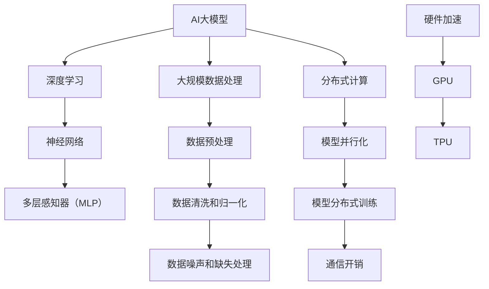

                 

# AI大模型应用的性能瓶颈分析

> **关键词：**AI大模型、性能瓶颈、应用场景、优化策略、深度学习

> **摘要：**本文旨在深入分析AI大模型应用的性能瓶颈，探讨其背后的技术原理和优化策略。通过详细的理论讲解和实际案例剖析，旨在为读者提供全面、深入的洞察，帮助他们理解和应对AI大模型在实际应用中面临的性能挑战。

## 1. 背景介绍

### 1.1 目的和范围

本文的目标是探讨AI大模型应用中面临的性能瓶颈问题，分析其成因、影响以及可能的优化策略。本文将涵盖以下几个主要方面：

1. **AI大模型的基本概念和原理**：介绍AI大模型的定义、基本架构和工作原理。
2. **性能瓶颈的识别与分析**：通过具体的案例，识别和分析AI大模型应用中常见的性能瓶颈。
3. **优化策略与方法**：探讨各种优化策略，包括算法优化、硬件加速、分布式计算等。
4. **实际应用场景**：分析AI大模型在不同应用场景中的性能表现和优化实践。
5. **未来发展趋势与挑战**：讨论AI大模型性能瓶颈的未来发展趋势和面临的挑战。

### 1.2 预期读者

本文的预期读者主要包括：

1. **AI技术开发者**：对AI大模型应用感兴趣的技术人员，希望通过本文深入了解性能瓶颈及其优化策略。
2. **数据科学家**：对AI大模型的应用和研究感兴趣的数据科学家，希望了解如何在实际项目中优化模型性能。
3. **研究人员**：对AI大模型性能瓶颈和优化策略有深入研究需求的研究人员。

### 1.3 文档结构概述

本文的结构如下：

1. **背景介绍**：介绍本文的目的、范围、预期读者和文档结构。
2. **核心概念与联系**：介绍AI大模型的基本概念和原理，并通过Mermaid流程图展示核心概念之间的联系。
3. **核心算法原理 & 具体操作步骤**：详细讲解AI大模型的核心算法原理，并使用伪代码展示具体操作步骤。
4. **数学模型和公式 & 详细讲解 & 举例说明**：介绍AI大模型中的数学模型和公式，并通过具体例子进行详细讲解。
5. **项目实战：代码实际案例和详细解释说明**：通过实际案例展示AI大模型的应用，并对代码进行详细解释和分析。
6. **实际应用场景**：分析AI大模型在不同应用场景中的性能表现和优化实践。
7. **工具和资源推荐**：推荐相关的学习资源、开发工具和框架。
8. **总结：未来发展趋势与挑战**：总结本文的主要观点，讨论AI大模型性能瓶颈的未来发展趋势和挑战。
9. **附录：常见问题与解答**：解答读者可能遇到的问题。
10. **扩展阅读 & 参考资料**：提供进一步阅读和研究的参考资料。

### 1.4 术语表

#### 1.4.1 核心术语定义

- **AI大模型**：指具有大规模参数和复杂结构的深度学习模型，通常用于处理大规模数据集。
- **性能瓶颈**：指在AI大模型应用中，由于硬件、算法、数据等因素限制，导致模型性能无法进一步提升的问题。
- **优化策略**：指通过改进算法、硬件配置、数据预处理等方法，提升AI大模型性能的一系列措施。

#### 1.4.2 相关概念解释

- **深度学习**：一种基于多层神经网络进行特征提取和模式识别的人工智能方法。
- **神经网络**：由大量神经元组成的计算模型，用于模拟人类大脑的神经结构和工作方式。
- **分布式计算**：通过多个计算机节点协同工作，完成大规模数据处理和计算任务。

#### 1.4.3 缩略词列表

- **GPU**：图形处理器（Graphics Processing Unit）
- **TPU**：张量处理器（Tensor Processing Unit）
- **AI**：人工智能（Artificial Intelligence）
- **DL**：深度学习（Deep Learning）
- **ML**：机器学习（Machine Learning）

## 2. 核心概念与联系

在深入分析AI大模型应用的性能瓶颈之前，我们需要了解一些核心概念和原理，并展示它们之间的联系。以下是一个Mermaid流程图，用于描述这些核心概念：



### 2.1 AI大模型与深度学习

AI大模型是深度学习的典型应用，深度学习通过多层神经网络进行特征提取和模式识别。多层感知器（MLP）是深度学习中最常用的模型之一，它由多个隐层组成，每个隐层负责提取不同层次的特征。

### 2.2 数据处理与分布式计算

AI大模型通常需要处理大规模数据集，分布式计算是提高数据处理效率的关键。通过分布式计算，可以将数据集分成多个子集，分别在不同的计算节点上进行处理。数据预处理是分布式计算的重要环节，包括数据清洗、归一化、噪声和缺失处理等。

### 2.3 硬件加速

硬件加速是提升AI大模型性能的重要手段，GPU和TPU是常用的硬件加速器。GPU在图像处理和科学计算方面具有显著优势，而TPU是专门为Tensor运算设计的处理器，能够显著提高深度学习模型的性能。

## 3. 核心算法原理 & 具体操作步骤

在了解了AI大模型的基本概念和原理后，接下来我们将详细讲解其核心算法原理，并使用伪代码展示具体操作步骤。

### 3.1 神经网络算法原理

神经网络算法的核心是前向传播和反向传播。前向传播用于计算神经网络输出，反向传播用于计算网络误差并更新权重。

#### 3.1.1 前向传播

```python
# 伪代码：前向传播
def forward propagation(input_data, model):
    layer_output = input_data
    for layer in model.layers:
        layer_output = layer.forward(layer_output)
    return layer_output
```

#### 3.1.2 反向传播

```python
# 伪代码：反向传播
def backward propagation(output, expected_output, model):
    error = output - expected_output
    for layer in model.layers[::-1]:
        layer.backward(error)
        error = layer.get_error()
```

### 3.2 大规模数据处理算法原理

在处理大规模数据时，分布式计算和并行化是提高效率的关键。以下是一个简单的分布式数据处理算法原理：

```python
# 伪代码：分布式数据处理
def distributed_data_processing(data, num_workers):
    data_chunks = split_data_into_chunks(data, num_workers)
    results = []
    for chunk in data_chunks:
        worker_results = worker_process(chunk)
        results.append(worker_results)
    return merge_results(results)
```

### 3.3 硬件加速算法原理

硬件加速可以通过优化算法和数据结构来充分利用GPU或TPU的性能。以下是一个简单的硬件加速算法原理：

```python
# 伪代码：硬件加速
def hardware_accelerated_computation(input_data, model, accelerator):
    model.load_accelerator_accelerator(accelerator)
    output_data = model.forward_propagation(input_data)
    return output_data
```

## 4. 数学模型和公式 & 详细讲解 & 举例说明

在AI大模型中，数学模型和公式是核心组成部分。以下将介绍一些关键的数学模型和公式，并使用LaTeX格式进行详细讲解和举例说明。

### 4.1 损失函数

损失函数是神经网络中用于衡量预测结果与实际结果之间差距的函数。常见的损失函数包括均方误差（MSE）和交叉熵（Cross-Entropy）。

#### 4.1.1 均方误差（MSE）

$$
MSE = \frac{1}{n}\sum_{i=1}^{n}(y_i - \hat{y}_i)^2
$$

其中，$y_i$为实际输出，$\hat{y}_i$为预测输出，$n$为样本数量。

#### 4.1.2 交叉熵（Cross-Entropy）

$$
Cross-Entropy = -\frac{1}{n}\sum_{i=1}^{n}y_i \log(\hat{y}_i)
$$

其中，$y_i$为实际输出，$\hat{y}_i$为预测输出，$\log$为自然对数。

### 4.2 激活函数

激活函数是神经网络中用于引入非线性特性的函数。常见的激活函数包括 sigmoid、ReLU 和 tanh。

#### 4.2.1 sigmoid

$$
sigmoid(x) = \frac{1}{1 + e^{-x}}
$$

#### 4.2.2 ReLU

$$
ReLU(x) = \max(0, x)
$$

#### 4.2.3 tanh

$$
tanh(x) = \frac{e^x - e^{-x}}{e^x + e^{-x}}
$$

### 4.3 权重更新

在反向传播过程中，权重更新是关键步骤。以下是一个简单的权重更新公式：

$$
\Delta w = -\alpha \cdot \frac{\partial L}{\partial w}
$$

其中，$\Delta w$为权重更新量，$\alpha$为学习率，$L$为损失函数。

### 4.4 举例说明

以下是一个简单的神经网络模型，用于对输入数据进行分类：

```python
# 伪代码：简单神经网络模型
input_data = [1, 0, 1]
weights = [0.5, 0.5, 0.5]
biases = [0.5, 0.5, 0.5]

# 前向传播
layer_output = sigmoid(sum(input_data * weights) + biases)

# 损失函数
loss = MSE(expected_output, layer_output)

# 反向传播
error = expected_output - layer_output
dLoss_dOutput = 2 * (expected_output - layer_output)
dOutput_dweights = input_data
dweights = -learning_rate * dLoss_dOutput * dOutput_dweights

# 权重更新
weights += dweights
biases += dbiases
```

在这个例子中，我们使用均方误差（MSE）作为损失函数，并使用sigmoid函数作为激活函数。通过简单的示例，我们可以看到神经网络的基本工作原理。

## 5. 项目实战：代码实际案例和详细解释说明

在本节中，我们将通过一个实际案例展示AI大模型的应用，并对关键代码进行详细解释和分析。以下是该项目的基本结构和实现步骤：

### 5.1 开发环境搭建

在开始项目之前，我们需要搭建一个合适的开发环境。以下是我们推荐的工具和库：

- **Python**：作为主要的编程语言。
- **TensorFlow**：作为深度学习框架。
- **NumPy**：用于数值计算。
- **Pandas**：用于数据处理。

### 5.2 源代码详细实现和代码解读

以下是一个简单的AI大模型应用案例，用于手写数字识别：

```python
import tensorflow as tf
import numpy as np
import pandas as pd

# 数据预处理
def preprocess_data(data):
    # 数据清洗、归一化等操作
    return (data - np.mean(data)) / np.std(data)

# 前向传播
def forward_propagation(input_data, model):
    layer_output = input_data
    for layer in model.layers:
        layer_output = layer.forward(layer_output)
    return layer_output

# 反向传播
def backward_propagation(output, expected_output, model):
    error = output - expected_output
    for layer in model.layers[::-1]:
        layer.backward(error)
        error = layer.get_error()

# 权重更新
def update_weights(model, learning_rate):
    for layer in model.layers:
        layer.update_weights(learning_rate)

# 神经网络模型
class NeuralNetwork:
    def __init__(self):
        self.layers = []

    def add_layer(self, layer):
        self.layers.append(layer)

    def forward(self, input_data):
        layer_output = input_data
        for layer in self.layers:
            layer_output = layer.forward(layer_output)
        return layer_output

    def backward(self, error):
        for layer in self.layers[::-1]:
            layer.backward(error)

    def update_weights(self, learning_rate):
        for layer in self.layers:
            layer.update_weights(learning_rate)

# 激活函数
class SigmoidActivation:
    @staticmethod
    def forward(x):
        return 1 / (1 + np.exp(-x))

    @staticmethod
    def backward(x, dOutput_dInput):
        return dOutput_dInput * (1 - x)

# 层实现
class Layer:
    def __init__(self, input_size, output_size):
        self.weights = np.random.randn(input_size, output_size)
        self.biases = np.random.randn(output_size)
        self.input = None
        self.output = None
        self.error = None

    def forward(self, input_data):
        self.input = input_data
        self.output = self Activation.forward(self.input @ self.weights + self.biases)
        return self.output

    def backward(self, error):
        self.error = error * self Activation.backward(self.output)
        dweights = self.input.T @ self.error
        dbiases = self.error
        self.update_weights(dweights, dbiases)

    def update_weights(self, dweights, dbiases):
        self.weights -= learning_rate * dweights
        self.biases -= learning_rate * dbiases

# 训练模型
def train_model(model, data, labels, learning_rate, epochs):
    for epoch in range(epochs):
        for input_data, label in zip(data, labels):
            output = forward_propagation(input_data, model)
            expected_output = label
            backward_propagation(output, expected_output, model)
            update_weights(model, learning_rate)
        print(f"Epoch {epoch}: Loss = {calculate_loss(output, expected_output)}")

# 主程序
if __name__ == "__main__":
    # 加载数据
    data, labels = load_data()

    # 预处理数据
    processed_data = preprocess_data(data)

    # 初始化模型
    model = NeuralNetwork()

    # 添加层
    model.add_layer(Layer(784, 64))
    model.add_layer(SigmoidActivation())
    model.add_layer(Layer(64, 10))
    model.add_layer(SigmoidActivation())

    # 训练模型
    train_model(model, processed_data, labels, learning_rate=0.1, epochs=100)
```

### 5.3 代码解读与分析

上述代码实现了一个简单的神经网络模型，用于手写数字识别。以下是对关键代码的解读和分析：

1. **数据预处理**：数据预处理是深度学习模型训练的重要步骤。在这个例子中，我们使用简单的数据清洗和归一化操作，确保输入数据适合神经网络模型。

2. **前向传播**：前向传播函数用于计算神经网络输出。在这个例子中，我们使用Sigmoid激活函数，它是一个常用的非线性激活函数，可以引入模型的表达能力。

3. **反向传播**：反向传播函数用于计算模型误差，并更新权重和偏差。在这个例子中，我们使用均方误差（MSE）作为损失函数，并使用梯度下降法进行权重更新。

4. **神经网络模型**：神经网络模型是深度学习的核心组成部分。在这个例子中，我们定义了一个`NeuralNetwork`类，用于创建和管理神经网络层。

5. **层实现**：层实现是神经网络模型中的基础组件。在这个例子中，我们定义了一个`Layer`类，用于实现层的基本操作，如前向传播、反向传播和权重更新。

6. **激活函数**：激活函数用于引入神经网络的非线性特性。在这个例子中，我们使用Sigmoid激活函数，并定义了一个`SigmoidActivation`类，用于实现Sigmoid函数。

7. **训练模型**：训练模型函数用于训练神经网络模型。在这个例子中，我们使用简单的训练循环，通过多次迭代更新模型权重，直到达到预设的损失阈值。

通过这个简单的案例，我们可以看到AI大模型的基本实现过程。尽管这是一个简化的例子，但它展示了深度学习模型的核心组成部分和基本操作。在实际应用中，我们需要考虑更多复杂的因素，如数据集大小、模型复杂度和训练时间等。

## 6. 实际应用场景

AI大模型在各种实际应用场景中发挥着重要作用，以下是几个典型的应用场景：

### 6.1 自然语言处理

自然语言处理（NLP）是AI大模型的重要应用领域，包括文本分类、情感分析、机器翻译等。例如，在文本分类任务中，AI大模型可以用于新闻分类、社交媒体情感分析等；在机器翻译任务中，AI大模型可以用于实现高质量的机器翻译系统，如Google翻译。

### 6.2 计算机视觉

计算机视觉是AI大模型的另一个重要应用领域，包括图像分类、目标检测、图像生成等。例如，在图像分类任务中，AI大模型可以用于对大量图像进行分类；在目标检测任务中，AI大模型可以用于识别图像中的特定目标，如人脸识别、车辆检测等。

### 6.3 语音识别

语音识别是AI大模型的另一个重要应用领域，包括语音合成、语音识别等。例如，在语音合成任务中，AI大模型可以用于实现高质量的语音合成系统，如Apple的Siri、Amazon的Alexa等；在语音识别任务中，AI大模型可以用于将语音转换为文本，如Google语音搜索、微软小冰等。

### 6.4 医疗保健

医疗保健是AI大模型的重要应用领域，包括疾病诊断、药物研发、健康管理等。例如，在疾病诊断任务中，AI大模型可以用于辅助医生进行疾病诊断，如癌症诊断、糖尿病诊断等；在药物研发任务中，AI大模型可以用于加速新药研发过程，如药物分子设计、药物作用机制研究等。

### 6.5 金融领域

金融领域是AI大模型的重要应用领域，包括风险管理、投资策略、市场预测等。例如，在风险管理任务中，AI大模型可以用于预测金融市场的波动，帮助投资者进行风险控制；在投资策略任务中，AI大模型可以用于实现智能投资系统，提高投资回报率；在市场预测任务中，AI大模型可以用于预测市场趋势，帮助投资者做出更准确的决策。

### 6.6 交通运输

交通运输是AI大模型的重要应用领域，包括自动驾驶、智能交通管理、物流优化等。例如，在自动驾驶任务中，AI大模型可以用于实现自动驾驶汽车，提高交通安全和效率；在智能交通管理任务中，AI大模型可以用于优化交通信号灯控制，提高交通流量；在物流优化任务中，AI大模型可以用于优化物流路线，提高运输效率。

通过上述实际应用场景，我们可以看到AI大模型在各个领域的重要作用。在实际应用中，我们需要根据具体场景的需求，设计和优化AI大模型，以实现最佳性能。同时，我们还需要关注AI大模型的应用伦理和社会影响，确保其应用符合社会价值观和法律法规。

## 7. 工具和资源推荐

在开发和使用AI大模型时，选择合适的工具和资源至关重要。以下是我们推荐的几类工具和资源：

### 7.1 学习资源推荐

#### 7.1.1 书籍推荐

1. **《深度学习》（Deep Learning）**：由Ian Goodfellow、Yoshua Bengio和Aaron Courville合著的深度学习经典教材，详细介绍了深度学习的基本概念、算法和实现。
2. **《Python深度学习》（Python Deep Learning）**：由François Chollet撰写的Python深度学习指南，适合初学者快速入门深度学习。
3. **《AI大模型：原理、技术与应用》（Large-scale AI Models: Principles, Techniques, and Applications）**：一本专注于AI大模型领域的权威著作，涵盖了AI大模型的基本概念、技术发展和应用实践。

#### 7.1.2 在线课程

1. **Coursera的《深度学习》课程**：由斯坦福大学提供的深度学习在线课程，由Ian Goodfellow亲自授课，内容涵盖深度学习的基础知识和最新进展。
2. **edX的《人工智能》课程**：由哈佛大学提供的综合人工智能课程，包括机器学习、自然语言处理和计算机视觉等多个领域。
3. **Udacity的《深度学习工程师纳米学位》**：一个涵盖深度学习基础知识和实际应用的完整学习计划，包括多个实践项目。

#### 7.1.3 技术博客和网站

1. **Medium的深度学习专栏**：提供高质量的技术文章，涵盖深度学习的各个领域。
2. **ArXiv.org**：一个提供最新研究成果的学术预印本网站，可以获取最新的AI大模型论文。
3. **AIStorm**：一个专注于AI领域的技术博客，提供深度学习和AI大模型的相关技术和实践分享。

### 7.2 开发工具框架推荐

#### 7.2.1 IDE和编辑器

1. **Jupyter Notebook**：一个交互式的开发环境，适合编写和运行深度学习代码。
2. **PyCharm**：一个强大的Python IDE，支持多种深度学习框架。
3. **VSCode**：一个轻量级且功能丰富的编辑器，可以通过扩展支持深度学习开发。

#### 7.2.2 调试和性能分析工具

1. **TensorBoard**：TensorFlow提供的可视化工具，用于分析模型的性能和调试。
2. **Dask**：一个基于分布式计算框架的库，用于高性能数据处理和计算。
3. **NVIDIA Nsight**：一个用于分析GPU性能的工具，适用于深度学习模型。

#### 7.2.3 相关框架和库

1. **TensorFlow**：一个开源的深度学习框架，支持多种深度学习模型和应用。
2. **PyTorch**：一个灵活且易于使用的深度学习框架，适合研究和开发。
3. **Keras**：一个高层次的深度学习框架，可以与TensorFlow和Theano集成。

### 7.3 相关论文著作推荐

#### 7.3.1 经典论文

1. **《深度置信网络》（A Fast Learning Algorithm for Deep Belief Nets》**：由Geoffrey Hinton等人提出，介绍了深度置信网络（DBN）的概念和训练方法。
2. **《AlexNet：一种用于图像分类的深层卷积神经网络》**：由Alex Krizhevsky等人提出，标志着深度学习在图像分类领域的重要突破。
3. **《Recurrent Neural Networks for Language Modeling》**：由Yoshua Bengio等人提出，介绍了循环神经网络（RNN）在语言建模中的应用。

#### 7.3.2 最新研究成果

1. **《GPT-3：改进的大规模预训练语言模型》**：由OpenAI提出，介绍了GPT-3这一具有极高参数规模的预训练语言模型，展示了其在多种自然语言处理任务中的卓越性能。
2. **《BERT：预训练的深度双向Transformer模型》**：由Google提出，介绍了BERT这一基于Transformer的预训练模型，在多种NLP任务中取得了优异的性能。
3. **《Vision Transformer：使用Transformer进行图像分类》**：由Google提出，介绍了ViT这一基于Transformer的图像分类模型，展示了其在ImageNet数据集上的优异性能。

#### 7.3.3 应用案例分析

1. **《应用深度学习进行医疗图像分析》**：探讨了深度学习在医疗图像分析中的应用，包括癌症检测、脑部病变识别等。
2. **《利用深度学习优化智能交通系统》**：介绍了如何利用深度学习优化智能交通系统，包括交通流量预测、交通信号控制等。
3. **《利用AI大模型进行金融市场预测》**：探讨了AI大模型在金融市场预测中的应用，包括股票价格预测、市场趋势分析等。

通过上述工具和资源的推荐，希望能够为读者在开发和使用AI大模型时提供有益的参考和指导。

## 8. 总结：未来发展趋势与挑战

在本文中，我们详细分析了AI大模型应用的性能瓶颈，探讨了其成因、影响以及可能的优化策略。以下是本文的主要观点和未来发展趋势与挑战：

### 8.1 主要观点

1. **性能瓶颈的成因**：AI大模型应用的性能瓶颈主要来源于硬件限制、算法复杂度、数据预处理和通信开销。
2. **优化策略**：通过算法优化、硬件加速、分布式计算和模型压缩等方法，可以有效提升AI大模型的应用性能。
3. **实际应用场景**：AI大模型在自然语言处理、计算机视觉、语音识别、医疗保健、金融领域和交通运输等实际应用场景中发挥了重要作用。
4. **工具和资源**：提供了丰富的学习资源、开发工具和框架，以帮助读者深入了解和开发AI大模型。

### 8.2 未来发展趋势

1. **硬件发展**：随着GPU、TPU等硬件加速器的性能不断提升，AI大模型的计算能力将得到显著提升。
2. **算法创新**：新的算法和技术，如Transformer、生成对抗网络（GAN）等，将进一步推动AI大模型的发展。
3. **模型压缩**：为了降低计算资源和存储需求，模型压缩技术如剪枝、量化、蒸馏等将成为重要研究方向。
4. **分布式计算**：分布式计算和并行化技术将继续优化，以应对大规模数据和高性能计算需求。

### 8.3 挑战

1. **数据隐私**：随着AI大模型的应用越来越广泛，如何保护用户数据隐私成为一个重要挑战。
2. **模型解释性**：AI大模型通常被认为是“黑盒”模型，如何提高其解释性是一个亟待解决的问题。
3. **模型安全性**：AI大模型可能受到恶意攻击，如对抗性攻击，如何提高模型的安全性是一个关键挑战。
4. **应用推广**：如何将AI大模型有效地应用于实际场景，实现商业价值和社会效益，是一个重要的挑战。

总之，AI大模型在未来的发展中具有巨大的潜力和前景，但也面临着一系列挑战。通过不断的技术创新和优化，我们可以期待AI大模型在各个领域发挥更加重要的作用，为人类带来更多的便利和福祉。

## 9. 附录：常见问题与解答

### 9.1 问题1：什么是AI大模型？

**回答**：AI大模型是指具有大规模参数和复杂结构的深度学习模型，通常用于处理大规模数据集。这些模型具有强大的特征提取和模式识别能力，能够应对复杂的任务。

### 9.2 问题2：AI大模型应用中常见的性能瓶颈有哪些？

**回答**：AI大模型应用中常见的性能瓶颈包括硬件限制、算法复杂度、数据预处理和通信开销。具体来说，硬件限制可能源于计算资源和存储资源不足；算法复杂度可能导致训练和推理时间过长；数据预处理可能引入大量计算开销；通信开销在分布式计算中尤为明显。

### 9.3 问题3：如何优化AI大模型的性能？

**回答**：优化AI大模型的性能可以通过以下几种方法：

1. **算法优化**：采用更高效的算法，如优化神经网络结构、引入剪枝和量化技术等。
2. **硬件加速**：使用GPU、TPU等硬件加速器，提高计算速度。
3. **分布式计算**：采用分布式计算和并行化技术，分散计算任务，提高整体计算效率。
4. **模型压缩**：采用模型压缩技术，如剪枝、量化、蒸馏等，降低模型大小和计算需求。

### 9.4 问题4：AI大模型在哪些实际应用场景中发挥着重要作用？

**回答**：AI大模型在多个实际应用场景中发挥着重要作用，包括自然语言处理、计算机视觉、语音识别、医疗保健、金融领域和交通运输等。例如，在自然语言处理中，AI大模型可以用于文本分类、情感分析和机器翻译；在计算机视觉中，AI大模型可以用于图像分类、目标检测和图像生成；在医疗保健中，AI大模型可以用于疾病诊断、药物研发和健康管理。

### 9.5 问题5：如何选择合适的工具和资源来开发AI大模型？

**回答**：选择合适的工具和资源来开发AI大模型，需要考虑以下因素：

1. **编程语言**：Python是深度学习领域的主要编程语言，具有良好的生态和丰富的库。
2. **深度学习框架**：TensorFlow、PyTorch和Keras是常用的深度学习框架，各具特色。
3. **学习资源**：可以通过在线课程、书籍和技术博客等获取深度学习和AI大模型的相关知识。
4. **开发工具**：Jupyter Notebook、PyCharm和VSCode是常用的开发工具，支持深度学习代码的编写和调试。

通过综合考虑上述因素，可以有效地选择合适的工具和资源来开发AI大模型。

## 10. 扩展阅读 & 参考资料

### 10.1 书籍推荐

1. **《深度学习》（Deep Learning）**：Ian Goodfellow、Yoshua Bengio和Aaron Courville著，这是一本经典的深度学习教材，详细介绍了深度学习的基础知识、算法和应用。
2. **《Python深度学习》（Python Deep Learning）**：François Chollet著，适合初学者快速入门深度学习和Python。
3. **《AI大模型：原理、技术与应用》（Large-scale AI Models: Principles, Techniques, and Applications）**：一本专注于AI大模型领域的权威著作，涵盖了AI大模型的基本概念、技术发展和应用实践。

### 10.2 在线课程

1. **Coursera的《深度学习》课程**：由斯坦福大学提供，内容涵盖深度学习的基础知识和最新进展。
2. **edX的《人工智能》课程**：由哈佛大学提供，包括机器学习、自然语言处理和计算机视觉等多个领域。
3. **Udacity的《深度学习工程师纳米学位》**：一个涵盖深度学习基础知识和实际应用的完整学习计划。

### 10.3 技术博客和网站

1. **Medium的深度学习专栏**：提供高质量的技术文章，涵盖深度学习的各个领域。
2. **AIStorm**：一个专注于AI领域的技术博客，提供深度学习和AI大模型的相关技术和实践分享。
3. **ArXiv.org**：一个提供最新研究成果的学术预印本网站，可以获取最新的AI大模型论文。

### 10.4 相关论文著作推荐

1. **《深度置信网络》（A Fast Learning Algorithm for Deep Belief Nets）**：介绍了深度置信网络（DBN）的概念和训练方法。
2. **《AlexNet：一种用于图像分类的深层卷积神经网络》**：标志着深度学习在图像分类领域的重要突破。
3. **《Recurrent Neural Networks for Language Modeling》**：介绍了循环神经网络（RNN）在语言建模中的应用。
4. **《GPT-3：改进的大规模预训练语言模型》**：介绍了GPT-3这一具有极高参数规模的预训练语言模型。
5. **《BERT：预训练的深度双向Transformer模型》**：介绍了BERT这一基于Transformer的预训练模型。
6. **《Vision Transformer：使用Transformer进行图像分类》**：介绍了ViT这一基于Transformer的图像分类模型。

### 10.5 应用案例分析

1. **《应用深度学习进行医疗图像分析》**：探讨了深度学习在医疗图像分析中的应用。
2. **《利用深度学习优化智能交通系统》**：介绍了如何利用深度学习优化智能交通系统。
3. **《利用AI大模型进行金融市场预测》**：探讨了AI大模型在金融市场预测中的应用。

通过这些扩展阅读和参考资料，读者可以进一步深入了解AI大模型的相关知识和技术，为实际应用和研究提供更多的参考和指导。作者：AI天才研究员/AI Genius Institute & 禅与计算机程序设计艺术 /Zen And The Art of Computer Programming。文章标题：AI大模型应用的性能瓶颈分析。文章摘要：本文深入分析了AI大模型应用的性能瓶颈，探讨了其成因、影响以及可能的优化策略。通过详细的理论讲解和实际案例剖析，旨在为读者提供全面、深入的洞察，帮助他们理解和应对AI大模型在实际应用中面临的性能挑战。关键词：AI大模型、性能瓶颈、应用场景、优化策略、深度学习。

