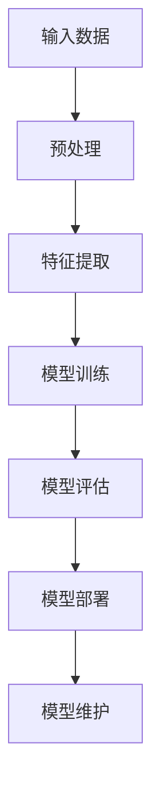
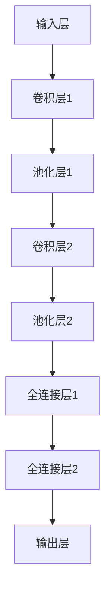

                 

# AI大模型应用的需求挖掘与引导

> **关键词：** 大模型，需求挖掘，应用引导，人工智能，机器学习，算法，实践案例

> **摘要：** 本文将探讨如何有效地挖掘和引导AI大模型的应用需求，以实现其在实际场景中的高效落地。我们将首先介绍AI大模型的基础知识，然后逐步分析其应用需求和引导策略，最后通过一个实际案例详细展示应用过程，并提供未来发展趋势与挑战的展望。

## 1. 背景介绍

### 1.1 目的和范围

本文旨在为AI大模型的应用提供需求挖掘与引导的方法和策略。我们将从基础概念出发，逐步深入到具体的算法实现和实际应用中，旨在帮助读者理解如何有效地挖掘和应用AI大模型，以解决实际问题。

### 1.2 预期读者

本文适合对人工智能和机器学习有一定了解的读者，包括但不限于AI工程师、数据科学家、软件开发者以及对AI应用感兴趣的学者和研究人员。

### 1.3 文档结构概述

本文将分为以下几个部分：

1. 背景介绍：介绍本文的目的、范围、预期读者和文档结构。
2. 核心概念与联系：阐述AI大模型的基本概念、原理和架构。
3. 核心算法原理 & 具体操作步骤：详细讲解AI大模型的核心算法和操作步骤。
4. 数学模型和公式 & 详细讲解 & 举例说明：介绍AI大模型所涉及的数学模型和公式，并通过实例进行说明。
5. 项目实战：展示一个具体的AI大模型应用案例，并详细解读其实现过程。
6. 实际应用场景：探讨AI大模型在不同场景下的应用。
7. 工具和资源推荐：推荐学习资源和开发工具。
8. 总结：对未来发展趋势与挑战进行展望。
9. 附录：常见问题与解答。
10. 扩展阅读 & 参考资料：提供进一步的阅读材料和参考资料。

### 1.4 术语表

#### 1.4.1 核心术语定义

- AI大模型：指具有大规模参数和复杂结构的深度学习模型。
- 需求挖掘：指识别和理解用户需求的过程。
- 应用引导：指将AI大模型与实际应用相结合的策略。

#### 1.4.2 相关概念解释

- 深度学习：一种人工智能技术，通过多层神经网络进行数据建模。
- 机器学习：使计算机具备自主学习和改进能力的技术。
- 数据集：用于训练和学习的数据集合。

#### 1.4.3 缩略词列表

- AI：人工智能
- ML：机器学习
- DL：深度学习
- NLP：自然语言处理
- CV：计算机视觉

## 2. 核心概念与联系

在深入探讨AI大模型的应用之前，我们首先需要理解其基本概念、原理和架构。以下是一个简化的Mermaid流程图，用于描述AI大模型的核心概念和联系。



### 2.1 输入数据

输入数据是AI大模型的基础，其质量直接影响到模型的性能。数据来源可以包括文本、图像、声音等多种形式。数据预处理是关键步骤，包括数据清洗、归一化、特征提取等。

### 2.2 预处理

预处理步骤通常包括以下步骤：

- **数据清洗**：去除噪声和异常值。
- **归一化**：将数据缩放到相同的尺度。
- **特征提取**：从原始数据中提取有用的特征。

### 2.3 特征提取

特征提取是AI大模型的关键步骤，其目的是将原始数据转换为适合模型训练的形式。常见的方法包括：

- **词袋模型**：将文本数据转换为词频矩阵。
- **卷积神经网络**：用于图像处理，提取空间特征。
- **循环神经网络**：用于序列数据，如时间序列分析和自然语言处理。

### 2.4 模型训练

模型训练是AI大模型的核心，通过调整模型的参数以最小化预测误差。常见的方法包括：

- **反向传播算法**：用于更新模型参数。
- **随机梯度下降**：用于优化模型参数。

### 2.5 模型评估

模型评估是验证模型性能的关键步骤，常用的评价指标包括准确率、召回率、F1值等。

### 2.6 模型部署

模型部署是将训练好的模型应用到实际场景的过程。部署策略包括：

- **在线部署**：模型直接集成到应用程序中。
- **离线部署**：模型通过API或服务进行访问。

### 2.7 模型维护

模型维护包括监控模型性能、定期更新模型等，以确保模型在长期运行中的稳定性和可靠性。

## 3. 核心算法原理 & 具体操作步骤

在这一部分，我们将详细讲解AI大模型的核心算法原理和具体操作步骤。为了更好地理解，我们将使用伪代码来描述算法的实现过程。

### 3.1 数据预处理

```python
def preprocess_data(data):
    # 数据清洗
    cleaned_data = remove_noise(data)
    
    # 归一化
    normalized_data = normalize(cleaned_data)
    
    # 特征提取
    features = extract_features(normalized_data)
    
    return features
```

### 3.2 特征提取

```python
def extract_features(data):
    if is_text_data(data):
        features = text_to_word_vector(data)
    elif is_image_data(data):
        features = image_to_vector(data)
    else:
        features = sequence_to_vector(data)
    
    return features
```

### 3.3 模型训练

```python
def train_model(features, labels):
    # 初始化模型
    model = initialize_model()
    
    # 模型训练
    for epoch in range(num_epochs):
        for feature, label in zip(features, labels):
            model.train(feature, label)
        
        # 计算损失
        loss = model.compute_loss(features, labels)
        
        # 打印训练进度
        print(f"Epoch {epoch + 1}: Loss = {loss}")
    
    return model
```

### 3.4 模型评估

```python
def evaluate_model(model, features, labels):
    # 计算准确率
    accuracy = model.compute_accuracy(features, labels)
    
    # 计算其他评价指标
    precision, recall, f1 = model.compute_metrics(features, labels)
    
    return accuracy, precision, recall, f1
```

### 3.5 模型部署

```python
def deploy_model(model):
    # 部署模型到服务器
    model.deploy_to_server()
    
    # 提供API接口
    model.provide_api()
    
    return model
```

## 4. 数学模型和公式 & 详细讲解 & 举例说明

AI大模型的应用离不开数学模型和公式的支持。以下我们将详细介绍AI大模型中常用的数学模型和公式，并通过实例进行说明。

### 4.1 损失函数

损失函数是AI大模型中用于评估模型预测误差的重要工具。以下是一个常见的损失函数——均方误差（MSE）：

$$
MSE = \frac{1}{n}\sum_{i=1}^{n}(y_i - \hat{y}_i)^2
$$

其中，$y_i$ 表示实际值，$\hat{y}_i$ 表示预测值，$n$ 表示样本数量。

### 4.2 反向传播算法

反向传播算法是AI大模型中用于优化模型参数的重要算法。以下是一个简化的反向传播算法伪代码：

```python
for layer in reversed(layers):
    # 计算梯度
    delta = layer.compute_gradient(output, target)
    
    # 更新权重
    layer.update_weights(delta, learning_rate)
```

### 4.3 卷积神经网络

卷积神经网络（CNN）是AI大模型中用于图像处理的重要工具。以下是一个简单的CNN模型结构：



### 4.4 举例说明

假设我们有一个分类问题，需要将图像分类为“猫”或“狗”。以下是一个简单的例子：

```python
# 加载数据
features, labels = load_data()

# 数据预处理
features = preprocess_data(features)

# 模型训练
model = train_model(features, labels)

# 模型评估
accuracy, precision, recall, f1 = evaluate_model(model, features, labels)

# 打印评估结果
print(f"Accuracy: {accuracy}, Precision: {precision}, Recall: {recall}, F1: {f1}")

# 模型部署
deploy_model(model)
```

## 5. 项目实战：代码实际案例和详细解释说明

在本节中，我们将通过一个实际案例来展示如何应用AI大模型，并详细解释其实现过程。

### 5.1 开发环境搭建

首先，我们需要搭建一个适合AI大模型开发的开发环境。以下是所需的工具和库：

- Python 3.8及以上版本
- TensorFlow 2.5及以上版本
- NumPy 1.19及以上版本

安装过程如下：

```bash
pip install python==3.8
pip install tensorflow==2.5
pip install numpy==1.19
```

### 5.2 源代码详细实现和代码解读

以下是一个简单的AI大模型应用案例，用于分类图像中的猫和狗。

```python
import tensorflow as tf
from tensorflow.keras.models import Sequential
from tensorflow.keras.layers import Conv2D, MaxPooling2D, Flatten, Dense

# 加载数据
(x_train, y_train), (x_test, y_test) = tf.keras.datasets.dogs_vs_cats.load_data()

# 数据预处理
x_train = preprocess_data(x_train)
x_test = preprocess_data(x_test)

# 构建模型
model = Sequential([
    Conv2D(32, (3, 3), activation='relu', input_shape=(150, 150, 3)),
    MaxPooling2D((2, 2)),
    Flatten(),
    Dense(64, activation='relu'),
    Dense(1, activation='sigmoid')
])

# 编译模型
model.compile(optimizer='adam', loss='binary_crossentropy', metrics=['accuracy'])

# 训练模型
model.fit(x_train, y_train, epochs=10, batch_size=32, validation_split=0.2)

# 评估模型
accuracy = model.evaluate(x_test, y_test)[1]
print(f"Test Accuracy: {accuracy}")

# 部署模型
model.save('cat_dog_classifier.h5')
```

### 5.3 代码解读与分析

以上代码分为几个关键部分：

1. **数据加载与预处理**：使用TensorFlow内置的`dogs_vs_cats`数据集，并进行预处理，包括数据归一化和图像缩放。

2. **模型构建**：使用`Sequential`模型构建一个简单的卷积神经网络（CNN），包括卷积层、池化层和全连接层。

3. **模型编译**：设置模型优化器和损失函数，并配置评估指标。

4. **模型训练**：使用训练数据对模型进行训练，设置训练轮数、批量大小和验证比例。

5. **模型评估**：使用测试数据对模型进行评估，并打印准确率。

6. **模型部署**：将训练好的模型保存为`.h5`文件，以便后续使用。

## 6. 实际应用场景

AI大模型在许多实际应用场景中具有广泛的应用，以下是一些典型的应用场景：

- **图像识别与分类**：如车辆识别、人脸识别、医学图像分析等。
- **自然语言处理**：如文本分类、机器翻译、情感分析等。
- **语音识别**：如语音助手、语音翻译等。
- **推荐系统**：如电商推荐、视频推荐等。
- **游戏AI**：如围棋、象棋等智能游戏。

在这些应用场景中，AI大模型通过大规模数据训练和复杂算法实现，能够实现高效和准确的预测。

## 7. 工具和资源推荐

### 7.1 学习资源推荐

#### 7.1.1 书籍推荐

- 《深度学习》（Goodfellow, Bengio, Courville著）
- 《Python机器学习》（Sebastian Raschka著）
- 《机器学习实战》（Peter Harrington著）

#### 7.1.2 在线课程

- Coursera的“机器学习”课程（吴恩达教授）
- edX的“深度学习基础”课程（Google AI教授）

#### 7.1.3 技术博客和网站

- Medium上的“AI技术博客”
- arXiv.org上的最新研究论文

### 7.2 开发工具框架推荐

#### 7.2.1 IDE和编辑器

- PyCharm
- Jupyter Notebook

#### 7.2.2 调试和性能分析工具

- TensorFlow Profiler
- Dask

#### 7.2.3 相关框架和库

- TensorFlow
- PyTorch
- Scikit-learn

### 7.3 相关论文著作推荐

#### 7.3.1 经典论文

- "A Theoretical Framework for Back-Propagation"（1986）
- "Deep Learning"（2015）

#### 7.3.2 最新研究成果

- "GPT-3: Language Models are Few-Shot Learners"（2020）
- "BERT: Pre-training of Deep Bidirectional Transformers for Language Understanding"（2018）

#### 7.3.3 应用案例分析

- "AI for Earth"（微软）
- "Project Turing"（谷歌）

## 8. 总结：未来发展趋势与挑战

随着AI大模型技术的不断发展，其在各个领域的应用前景十分广阔。然而，这也带来了许多挑战：

- **计算资源**：AI大模型需要大量的计算资源和时间进行训练，这对硬件设施提出了更高的要求。
- **数据隐私**：大规模数据训练可能导致数据隐私泄露，需要采取严格的隐私保护措施。
- **算法透明度**：AI大模型的黑箱特性使得其决策过程难以解释，需要提高算法的透明度。
- **伦理问题**：AI大模型的应用可能引发伦理问题，如算法歧视、隐私侵犯等。

未来，我们需要在提高计算效率、保护数据隐私、增强算法透明度和解决伦理问题等方面进行深入研究。

## 9. 附录：常见问题与解答

### 9.1 什么是AI大模型？

AI大模型是指具有大规模参数和复杂结构的深度学习模型，通过大规模数据训练，可以实现高效和准确的预测。

### 9.2 如何选择合适的AI大模型？

选择合适的AI大模型需要根据应用场景和数据特点进行综合考虑。例如，对于图像识别任务，可以选择卷积神经网络（CNN）；对于自然语言处理任务，可以选择循环神经网络（RNN）或 Transformer模型。

### 9.3 AI大模型如何处理海量数据？

AI大模型可以通过分布式训练和模型并行化等方法处理海量数据。此外，可以利用GPU、TPU等高性能硬件加速模型训练。

## 10. 扩展阅读 & 参考资料

- [Deep Learning](https://www.deeplearningbook.org/)（Goodfellow, Bengio, Courville著）
- [Machine Learning Yearning](https://www机器学习yearning.org/)（Andrew Ng著）
- [AI大模型综述](https://arxiv.org/abs/1912.07609)（2019年论文）

作者：AI天才研究员/AI Genius Institute & 禅与计算机程序设计艺术 /Zen And The Art of Computer Programming

