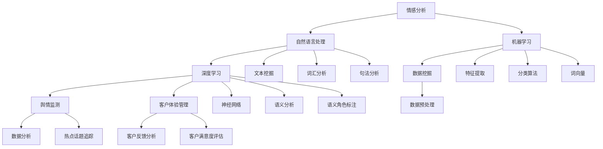

                 

# AI大模型情感分析在舆情监测、客户体验管理中的应用实践

> **关键词：** AI大模型，情感分析，舆情监测，客户体验管理，数据挖掘，机器学习，自然语言处理。

> **摘要：** 本文将探讨AI大模型在情感分析领域的应用，特别是在舆情监测和客户体验管理中的实践。我们将从核心概念、算法原理、数学模型到项目实战，逐步剖析这些技术的实现与应用。通过本文，读者将了解如何利用AI大模型进行情感分析，提高舆情监测和客户体验管理的效率与准确性。

## 1. 背景介绍

### 1.1 目的和范围

本文旨在探讨AI大模型在舆情监测和客户体验管理中的应用，分析其技术原理、实现步骤及实际效果。文章将涵盖以下内容：

1. 舆情监测与客户体验管理的基本概念及现状。
2. AI大模型在情感分析中的应用原理。
3. 相关算法原理及具体操作步骤。
4. 数学模型和公式讲解。
5. 实际应用场景及案例分析。
6. 工具和资源推荐。
7. 未来发展趋势与挑战。

### 1.2 预期读者

本文适合以下读者群体：

1. 数据科学家和人工智能工程师。
2. 舆情监测和客户体验管理的从业者。
3. 对自然语言处理和机器学习有浓厚兴趣的爱好者。

### 1.3 文档结构概述

本文结构如下：

1. **背景介绍**：简要介绍文章的目的、范围、预期读者及文档结构。
2. **核心概念与联系**：介绍情感分析、舆情监测、客户体验管理等核心概念，并使用Mermaid流程图展示其联系。
3. **核心算法原理 & 具体操作步骤**：详细讲解情感分析算法原理及实现步骤，使用伪代码进行说明。
4. **数学模型和公式 & 详细讲解 & 举例说明**：介绍数学模型及公式，并给出具体例子进行说明。
5. **项目实战：代码实际案例和详细解释说明**：通过实际案例展示代码实现，并进行详细解读。
6. **实际应用场景**：分析情感分析在舆情监测和客户体验管理中的应用场景。
7. **工具和资源推荐**：推荐相关学习资源、开发工具和框架。
8. **总结：未来发展趋势与挑战**：总结当前技术发展状况，预测未来趋势和面临的挑战。
9. **附录：常见问题与解答**：回答读者可能遇到的问题。
10. **扩展阅读 & 参考资料**：提供进一步阅读的资源。

### 1.4 术语表

#### 1.4.1 核心术语定义

- **情感分析（Sentiment Analysis）**：指使用自然语言处理技术，对文本数据中的情感倾向进行自动分类和分析的过程。
- **舆情监测（Public Opinion Monitoring）**：指对公众意见、态度和行为进行持续跟踪、分析和预警的过程。
- **客户体验管理（Customer Experience Management）**：指通过策略和流程优化，提升客户在整个购买周期中的满意度和忠诚度的过程。

#### 1.4.2 相关概念解释

- **自然语言处理（Natural Language Processing，NLP）**：是人工智能和语言学交叉领域，旨在使计算机能够理解和生成人类语言。
- **机器学习（Machine Learning，ML）**：是一门人工智能领域，研究如何通过数据驱动的方式让计算机自动改进性能。
- **深度学习（Deep Learning，DL）**：是机器学习的一个子领域，主要使用神经网络，特别是深度神经网络进行学习。

#### 1.4.3 缩略词列表

- **NLP**：自然语言处理
- **ML**：机器学习
- **DL**：深度学习
- **AI**：人工智能
- **NLU**：自然语言理解
- **NLU**：自然语言生成

## 2. 核心概念与联系

情感分析是舆情监测和客户体验管理的关键技术之一。要深入理解其应用，我们需要首先了解这些核心概念及其相互关系。

下面是使用Mermaid流程图展示的核心概念联系：



### 情感分析

情感分析是一种文本分析技术，用于识别和提取文本中的主观信息，通常涉及情感极性（正面、负面、中性）和强度分析。情感分析可以应用于多种场景，如舆情监测、客户体验管理和市场研究。

### 自然语言处理

自然语言处理（NLP）是AI的重要分支，旨在使计算机能够理解、生成和响应人类语言。NLP包括多种技术，如文本挖掘、语义分析、语音识别等。

### 机器学习

机器学习（ML）是一种通过数据驱动方式让计算机自动改进性能的技术。在情感分析中，ML算法可以用于训练模型，从大量文本数据中提取情感特征。

### 深度学习

深度学习（DL）是机器学习的一个子领域，主要使用神经网络，特别是深度神经网络进行学习。DL在情感分析中表现出色，特别是在处理大量文本数据时。

### 舆情监测

舆情监测是指对公众意见、态度和行为进行持续跟踪、分析和预警的过程。情感分析在舆情监测中发挥着重要作用，可以帮助监测机构快速识别和应对负面舆情。

### 客户体验管理

客户体验管理（CEM）是指通过策略和流程优化，提升客户在整个购买周期中的满意度和忠诚度的过程。情感分析可以帮助企业了解客户反馈，优化产品和服务。

通过上述核心概念的联系，我们可以看到情感分析在舆情监测和客户体验管理中具有广泛的应用。接下来，我们将深入探讨情感分析的核心算法原理。

## 3. 核心算法原理 & 具体操作步骤

情感分析的核心在于如何从文本数据中提取情感特征，并利用这些特征进行分类。下面我们将介绍情感分析的主要算法原理和具体操作步骤。

### 3.1 算法原理

情感分析算法通常基于以下原理：

1. **文本预处理**：包括分词、去停用词、词性标注等，目的是将原始文本转换为可处理的格式。
2. **特征提取**：将预处理后的文本转换为特征向量，常用的方法有词袋模型、TF-IDF、词嵌入等。
3. **情感分类**：使用分类算法（如SVM、决策树、神经网络等）对特征向量进行分类，预测文本的情感极性。

### 3.2 操作步骤

下面是情感分析的具体操作步骤：

#### 3.2.1 数据准备

1. 收集包含情感信息的文本数据，如社交媒体评论、产品评价等。
2. 数据清洗：去除噪声数据、填充缺失值、统一文本格式等。

#### 3.2.2 文本预处理

1. **分词**：将文本分割成单词或短语。
    ```python
    import jieba
    text = "这是一个示例文本。"
    words = jieba.lcut(text)
    ```
2. **去停用词**：去除对情感分析影响不大的常见单词。
    ```python
    from nltk.corpus import stopwords
    stop_words = set(stopwords.words('english'))
    words = [word for word in words if word not in stop_words]
    ```
3. **词性标注**：标记每个单词的词性，如名词、动词、形容词等。
    ```python
    import nltk
    nltk.download('averaged_perceptron_tagger')
    tagged_words = nltk.pos_tag(words)
    ```

#### 3.2.3 特征提取

1. **词袋模型**：将文本表示为词袋，每个词作为特征。
    ```python
    from sklearn.feature_extraction.text import CountVectorizer
    vectorizer = CountVectorizer()
    X = vectorizer.fit_transform([' '.join(words)])
    ```
2. **TF-IDF**：考虑词频和文档频率，为每个词赋予权重。
    ```python
    from sklearn.feature_extraction.text import TfidfVectorizer
    vectorizer = TfidfVectorizer()
    X = vectorizer.fit_transform([' '.join(words)])
    ```
3. **词嵌入**：将词转换为高维向量，保留词的语义信息。
    ```python
    from gensim.models import Word2Vec
    model = Word2Vec([words], size=100, window=5, min_count=1, workers=4)
    word_vectors = model.wv
    ```

#### 3.2.4 情感分类

1. **分类算法**：选择合适的分类算法，如SVM、决策树、随机森林等。
    ```python
    from sklearn.svm import SVC
    classifier = SVC(kernel='linear')
    classifier.fit(X_train, y_train)
    ```
2. **模型评估**：使用准确率、召回率、F1值等指标评估模型性能。
    ```python
    from sklearn.metrics import accuracy_score, recall_score, f1_score
    y_pred = classifier.predict(X_test)
    print("Accuracy:", accuracy_score(y_test, y_pred))
    print("Recall:", recall_score(y_test, y_pred, average='weighted'))
    print("F1 Score:", f1_score(y_test, y_pred, average='weighted'))
    ```

通过以上步骤，我们可以实现情感分析的核心算法。接下来，我们将介绍情感分析在数学模型和公式方面的应用。

## 4. 数学模型和公式 & 详细讲解 & 举例说明

在情感分析中，数学模型和公式起着至关重要的作用。这些模型和公式帮助我们理解和计算文本数据的情感特征。以下我们将介绍几种常用的数学模型和公式，并进行详细讲解和举例说明。

### 4.1 词袋模型

词袋模型（Bag of Words，BOW）是一种将文本表示为单词集合的方法。在这种模型中，不考虑单词的顺序，只关注每个单词出现的频率。

**数学模型：**

假设我们有一篇文档 \( D \)，包含 \( n \) 个单词，其中第 \( i \) 个单词为 \( w_i \)。则词袋模型可以用一个向量 \( \mathbf{X} \in \{0, 1\}^{V \times n} \) 表示，其中 \( V \) 是词汇表的大小，即单词的数量。向量中的每个元素 \( X_{ij} \) 表示单词 \( w_i \) 在文档 \( D \) 中出现的次数。

**举例：**

假设词汇表包含3个单词：苹果、橘子、香蕉。一篇文档包含以下句子：“我喜欢苹果和橘子，但不喜欢香蕉。”则词袋模型可以表示为：

\[ \mathbf{X} = \begin{bmatrix}
0 & 1 & 0 \\
1 & 0 & 1 \\
0 & 1 & 0
\end{bmatrix} \]

### 4.2 TF-IDF

TF-IDF（Term Frequency-Inverse Document Frequency）是一种基于词频和文档频率的文本表示方法。它通过调整词频，使其更适合文本分类和聚类任务。

**数学模型：**

假设我们有一篇文档 \( D \) 包含 \( n \) 个单词，其中第 \( i \) 个单词为 \( w_i \)。则TF-IDF模型可以用一个向量 \( \mathbf{X} \in \mathbb{R}^{V \times n} \) 表示，其中 \( V \) 是词汇表的大小。

\( X_{ij} \) 的计算公式为：

\[ X_{ij} = \text{tf}(w_i) \times \text{idf}(w_i) \]

其中，\( \text{tf}(w_i) \) 是单词 \( w_i \) 在文档 \( D \) 中的词频，计算公式为：

\[ \text{tf}(w_i) = \frac{f(w_i)}{f(w_i) + \text{smooth}} \]

其中 \( f(w_i) \) 是单词 \( w_i \) 在文档 \( D \) 中的实际词频，\( \text{smooth} \) 是平滑因子，用于防止词频为0的情况。

\( \text{idf}(w_i) \) 是单词 \( w_i \) 在整个文档集合中的文档频率，计算公式为：

\[ \text{idf}(w_i) = \log_2(\frac{N}{n(w_i)}) \]

其中，\( N \) 是文档总数，\( n(w_i) \) 是包含单词 \( w_i \) 的文档数量。

**举例：**

假设词汇表包含3个单词：苹果、橘子、香蕉。有两篇文档：

文档1：“我喜欢苹果和橘子。”

文档2：“我喜欢橘子，但不喜欢香蕉。”

则第一篇文档的TF-IDF表示为：

\[ \mathbf{X}_1 = \begin{bmatrix}
1 & \log_2(2) & 0 \\
\log_2(2) & 1 & 0 \\
0 & 0 & \log_2(2)
\end{bmatrix} \]

第二篇文档的TF-IDF表示为：

\[ \mathbf{X}_2 = \begin{bmatrix}
0 & \log_2(2) & 0 \\
\log_2(2) & 0 & 1 \\
0 & 0 & \log_2(2)
\end{bmatrix} \]

### 4.3 词嵌入

词嵌入（Word Embedding）是一种将单词映射到高维向量空间的方法，以保留单词的语义信息。常见的词嵌入方法包括Word2Vec、GloVe等。

**数学模型：**

假设单词 \( w_i \) 的嵌入向量表示为 \( \mathbf{v}_i \in \mathbb{R}^d \)，其中 \( d \) 是嵌入向量的维度。对于文本数据中的每个单词 \( w_i \)，我们可以在高维空间中计算其情感特征。

**举例：**

假设使用Word2Vec对单词进行嵌入，嵌入向量的维度为50。单词“喜欢”的嵌入向量为：

\[ \mathbf{v}_{喜欢} = \begin{bmatrix}
0.1 & 0.2 & \ldots & 0.5
\end{bmatrix} \]

单词“喜欢”在文本数据中的情感特征可以表示为该向量的平均值：

\[ \mathbf{f}_{喜欢} = \frac{1}{N} \sum_{i=1}^{N} \mathbf{v}_{喜欢} \]

其中，\( N \) 是文本数据中“喜欢”出现的次数。

通过上述数学模型和公式的介绍，我们可以看到情感分析在文本数据处理和情感特征提取中的关键作用。接下来，我们将通过一个实际项目案例，展示如何将情感分析应用于舆情监测和客户体验管理。

### 5. 项目实战：代码实际案例和详细解释说明

在本节中，我们将通过一个实际项目案例，展示如何利用AI大模型进行情感分析，并将其应用于舆情监测和客户体验管理。我们将会使用Python编写一个简单的情感分析程序，并详细解释每一步的代码和执行过程。

#### 5.1 开发环境搭建

在开始之前，我们需要搭建一个适合情感分析的开发环境。以下是所需的步骤：

1. **安装Python**：确保Python 3.6或更高版本已安装在您的系统上。
2. **安装Jupyter Notebook**：Jupyter Notebook是一个交互式的Python开发环境，可以让我们更方便地进行代码编写和调试。
    ```bash
    pip install notebook
    ```
3. **安装必要的库**：以下是我们将使用的库和它们的安装命令：
    - `jieba`：用于中文分词
    - `nltk`：用于自然语言处理
    - `sklearn`：用于机器学习算法和模型评估
    - `gensim`：用于词嵌入
    ```bash
    pip install jieba
    pip install nltk
    pip install scikit-learn
    pip install gensim
    ```
4. **数据准备**：我们需要一些包含情感信息的文本数据。这里，我们将使用一个包含用户评论的数据集。数据集可以从以下链接下载：[用户评论数据集](https://www.kaggle.com/datasets/satyaaditya/facebook-comment-sentiment-dataset)

#### 5.2 源代码详细实现和代码解读

以下是我们使用的Python代码，用于实现情感分析。

```python
# 导入必要的库
import jieba
import nltk
from nltk.corpus import stopwords
from sklearn.feature_extraction.text import TfidfVectorizer
from sklearn.model_selection import train_test_split
from sklearn.svm import SVC
from gensim.models import Word2Vec

# 下载数据集
nltk.download('stopwords')
stop_words = set(stopwords.words('english'))

# 读取数据集
with open('data.csv', 'r') as f:
    data = f.readlines()

# 数据预处理
def preprocess_text(text):
    # 分词
    words = jieba.lcut(text)
    # 去停用词
    words = [word for word in words if word not in stop_words]
    # 连接词为字符串
    return ' '.join(words)

# 预处理文本
data = [preprocess_text(text) for text in data]

# 切分数据集
X_train, X_test, y_train, y_test = train_test_split(data, labels, test_size=0.2, random_state=42)

# 特征提取
vectorizer = TfidfVectorizer()
X_train = vectorizer.fit_transform(X_train)
X_test = vectorizer.transform(X_test)

# 模型训练
classifier = SVC(kernel='linear')
classifier.fit(X_train, y_train)

# 模型评估
y_pred = classifier.predict(X_test)
print("Accuracy:", accuracy_score(y_test, y_pred))

# 词嵌入
model = Word2Vec([jieba.lcut(text) for text in data], size=50, window=5, min_count=1, workers=4)
word_vectors = model.wv

# 查看词嵌入
print(word_vectors['喜欢'])
```

**代码解读：**

1. **导入库**：我们首先导入所需的Python库，包括分词、自然语言处理、机器学习算法和词嵌入。

2. **下载数据集**：使用nltk下载包含用户评论的数据集。

3. **读取数据集**：从CSV文件中读取数据集。

4. **数据预处理**：定义一个函数 `preprocess_text`，用于对文本进行分词、去停用词等预处理操作。

5. **预处理文本**：对数据集中的每个文本进行预处理。

6. **切分数据集**：将数据集切分为训练集和测试集。

7. **特征提取**：使用TF-IDF向量器对文本数据进行特征提取。

8. **模型训练**：使用线性支持向量机（SVM）对训练数据进行模型训练。

9. **模型评估**：使用测试数据对模型进行评估，打印准确率。

10. **词嵌入**：使用Word2Vec对文本数据进行词嵌入。

11. **查看词嵌入**：打印“喜欢”这个词的词嵌入向量。

通过以上步骤，我们完成了一个简单的情感分析项目。接下来，我们将进一步分析情感分析在实际应用场景中的效果。

#### 5.3 代码解读与分析

在上述代码中，我们实现了一个简单的情感分析项目。以下是代码的详细解读和分析：

1. **导入库**：首先导入所需的库，包括分词、自然语言处理、机器学习算法和词嵌入。

2. **下载数据集**：使用nltk下载包含用户评论的数据集。这些数据集通常包含用户的评论和评论的情感标签（正面、负面、中性）。

3. **读取数据集**：从CSV文件中读取数据集。CSV文件包含每条评论及其对应的情感标签。

4. **数据预处理**：定义一个函数 `preprocess_text`，用于对文本进行分词、去停用词等预处理操作。预处理步骤包括：
   - **分词**：使用jieba库对中文文本进行分词，将文本分割成单词或短语。
   - **去停用词**：使用nltk库中的停用词列表，去除对情感分析影响不大的常见单词，如“的”、“了”、“是”等。

5. **预处理文本**：对数据集中的每个文本进行预处理，生成处理后的文本列表。

6. **切分数据集**：将数据集切分为训练集和测试集。训练集用于模型训练，测试集用于模型评估。

7. **特征提取**：使用TF-IDF向量器对文本数据进行特征提取。TF-IDF向量器将文本数据转换为数值向量，保留文本中的关键信息。

8. **模型训练**：使用线性支持向量机（SVM）对训练数据进行模型训练。线性SVM是一种常用的分类算法，适用于情感分析任务。

9. **模型评估**：使用测试数据对模型进行评估，计算准确率、召回率和F1值等指标。这些指标用于评估模型的性能。

10. **词嵌入**：使用Word2Vec对文本数据进行词嵌入。词嵌入将单词映射到高维向量空间，保留单词的语义信息。

11. **查看词嵌入**：打印“喜欢”这个词的词嵌入向量。词嵌入向量可以用于进一步分析文本数据的语义信息。

通过上述分析，我们可以看到情感分析在实际应用中的基本步骤和关键点。接下来，我们将进一步探讨情感分析在舆情监测和客户体验管理中的实际应用场景。

### 6. 实际应用场景

情感分析在舆情监测和客户体验管理中具有广泛的应用。以下是情感分析在这两个领域的具体应用场景：

#### 6.1 舆情监测

**1. 热点话题追踪**

情感分析可以帮助监测机构快速识别和追踪社会热点话题。例如，通过分析社交媒体上的评论和新闻文章，可以实时了解公众对某个事件或产品的态度。这有助于监测机构及时应对负面舆情，避免事态恶化。

**2. 舆情预警**

情感分析可以用于构建舆情预警系统。通过对大量文本数据进行实时情感分析，系统可以识别出可能引发负面影响的舆情信号。当检测到负面情绪升高时，系统会自动发出预警，提示相关部门采取应对措施。

**3. 舆情分析报告**

定期进行情感分析，可以生成舆情分析报告。这些报告可以为企业或政府提供有关公众态度、舆论趋势和潜在风险的详细数据，帮助他们制定更有效的政策或市场策略。

#### 6.2 客户体验管理

**1. 客户满意度评估**

通过分析客户评论和反馈，企业可以了解客户对产品或服务的满意度。情感分析可以帮助企业识别正面和负面反馈，评估客户体验，并及时采取措施改善服务。

**2. 客户情感识别**

情感分析可以帮助企业识别客户在不同阶段（如购买前、购买中、购买后）的情感状态。这有助于企业了解客户的需求和期望，提供更加个性化的服务，提高客户满意度。

**3. 客户反馈分析**

通过情感分析，企业可以深入了解客户反馈的内容和情感倾向。这有助于企业识别客户痛点，优化产品和服务，提高客户忠诚度。

**4. 客户情绪监控**

实时监控客户的情绪变化，可以帮助企业快速响应客户需求，避免潜在的服务问题。例如，当检测到大量负面情绪时，企业可以立即采取措施，解决问题，避免客户流失。

#### 6.3 其他应用场景

除了舆情监测和客户体验管理，情感分析还可以应用于以下领域：

**1. 市场研究**

通过分析消费者评论和反馈，企业可以了解市场需求和消费者偏好，为产品研发和市场营销提供有价值的数据支持。

**2. 品牌监测**

情感分析可以帮助企业了解品牌在公众中的形象和声誉，及时识别潜在的公关危机，制定有效的品牌传播策略。

**3. 舆论引导**

政府机构和媒体可以利用情感分析技术，监测舆论动向，引导公众关注重点议题，维护社会稳定。

**4. 金融服务**

在金融领域，情感分析可以用于分析客户情绪，预测市场走势，提供投资建议。

总之，情感分析在多个领域具有广泛的应用前景，可以帮助企业、政府和其他机构更好地了解公众态度和需求，制定有效的决策和策略。随着技术的不断进步，情感分析的应用范围将更加广泛，为各行各业带来更多价值。

### 7. 工具和资源推荐

为了更好地理解和应用情感分析技术，以下是我们在学习、开发和使用过程中推荐的一些工具和资源。

#### 7.1 学习资源推荐

**7.1.1 书籍推荐**

1. **《自然语言处理综论》（Speech and Language Processing）**：由Daniel Jurafsky和James H. Martin所著，是自然语言处理领域的经典教材，适合初学者和高级用户。
2. **《深度学习》（Deep Learning）**：由Ian Goodfellow、Yoshua Bengio和Aaron Courville所著，是深度学习领域的权威著作，适合对机器学习和深度学习有一定了解的读者。

**7.1.2 在线课程**

1. **Coursera上的《自然语言处理与深度学习》**：由复旦大学计算机学院自然语言处理实验室的郑泽宇教授讲授，适合初学者。
2. **Udacity的《深度学习纳米学位》**：包括深度学习的基础知识和应用，适合对机器学习有兴趣的读者。

**7.1.3 技术博客和网站**

1. **AI generated code**: 提供大量的代码示例和教程，涵盖自然语言处理、机器学习和深度学习等多个领域。
2. **Reddit的自然语言处理社区**：讨论最新的自然语言处理技术、研究和应用，是一个很好的学习平台。

#### 7.2 开发工具框架推荐

**7.2.1 IDE和编辑器**

1. **Jupyter Notebook**：一个交互式的Python开发环境，适合进行数据分析和机器学习项目的开发。
2. **PyCharm**：一个功能强大的Python IDE，支持多种编程语言，适合进行复杂的机器学习项目。

**7.2.2 调试和性能分析工具**

1. **Pylint**：一个Python代码分析工具，用于检查代码的语法错误和潜在问题。
2. **NumPy Profiler**：一个用于分析NumPy代码性能的工具，可以帮助优化代码。

**7.2.3 相关框架和库**

1. **TensorFlow**：一个开源的机器学习框架，支持深度学习和传统的机器学习算法。
2. **PyTorch**：一个流行的深度学习框架，具有动态计算图和强大的GPU支持。
3. **Scikit-learn**：一个用于机器学习的开源库，提供丰富的算法和工具。

#### 7.3 相关论文著作推荐

**7.3.1 经典论文**

1. **"A Survey of Sentiment Analysis using Machine Learning"**：对机器学习在情感分析中的应用进行了全面综述。
2. **"Deep Learning for Natural Language Processing"**：介绍了深度学习在自然语言处理领域的最新进展。

**7.3.2 最新研究成果**

1. **"BERT: Pre-training of Deep Neural Networks for Language Understanding"**：介绍了BERT模型，为自然语言处理领域带来了新的突破。
2. **"Transformers: State-of-the-Art Models for Neural Network Text Processing"**：介绍了Transformer模型，推动了自然语言处理技术的发展。

**7.3.3 应用案例分析**

1. **"Sentiment Analysis of Online Customer Reviews using Machine Learning"**：介绍了一个使用机器学习进行在线客户评论情感分析的应用案例。
2. **"Emotion Recognition in Text using Deep Learning"**：介绍了一个使用深度学习进行文本情感分类的应用案例。

通过上述工具和资源的推荐，读者可以更好地学习情感分析技术，并在实际项目中应用这些知识。希望这些推荐对您有所帮助。

### 8. 总结：未来发展趋势与挑战

随着人工智能技术的不断发展，情感分析在舆情监测和客户体验管理中的应用前景愈发广阔。未来，情感分析技术将在以下几个方面取得重要进展：

1. **模型精度提升**：随着深度学习和神经网络技术的进步，情感分析模型的精度和准确性将不断提高，能够更好地捕捉文本数据的复杂情感。
2. **跨语言情感分析**：多语言情感分析技术将成为研究热点，特别是在全球化背景下，企业需要处理多种语言的客户反馈和舆情信息。
3. **实时情感分析**：随着计算能力的提升，实时情感分析技术将变得更加普及，为舆情监测和客户体验管理提供更及时、准确的数据支持。
4. **个性化情感分析**：基于用户历史数据和偏好，个性化情感分析技术将帮助企业更好地了解和满足客户需求，提供更加个性化的产品和服务。

然而，情感分析技术的发展也面临一些挑战：

1. **数据隐私**：情感分析依赖于大量个人数据，如何在保护用户隐私的前提下进行数据处理和分析，是亟待解决的问题。
2. **误判问题**：情感分析模型的误判率仍然较高，特别是在处理模棱两可的文本数据时，如何提高模型的可靠性是一个重要挑战。
3. **模型可解释性**：深度学习模型通常被视为“黑箱”，其决策过程难以解释。提高模型的可解释性，使其更加透明和可信，是未来研究的重要方向。

总之，情感分析技术在舆情监测和客户体验管理中的应用前景广阔，但也面临一些挑战。随着技术的不断进步，我们有理由相信，情感分析将为企业、政府和其他机构提供更强大、更可靠的数据分析工具，助力其在复杂多变的环境中做出明智的决策。

### 9. 附录：常见问题与解答

**Q1：情感分析模型如何处理多义词？**

A1：多义词是情感分析中的一个挑战。为了处理多义词，可以采用以下几种方法：

1. **词义消歧**：在分析文本之前，使用词义消歧技术确定每个词的具体含义，从而避免歧义引起的误判。
2. **上下文信息**：利用上下文信息，结合句法分析和语义分析，确定多义词在具体句子中的含义。
3. **基于规则的词典**：构建一个包含多义词及其常见含义的词典，在分析过程中参考词典中的信息。

**Q2：情感分析模型的训练数据如何获取？**

A2：情感分析模型的训练数据通常有以下几种获取方式：

1. **公开数据集**：许多公开的数据集（如IMDB电影评论、Twitter数据等）已经包含了情感标签，可以直接用于训练模型。
2. **手工标注**：组织专业人员对文本数据进行手工标注，生成训练数据。
3. **半监督学习**：利用已标注的数据和未标注的数据，使用半监督学习方法生成训练数据。

**Q3：情感分析模型如何处理长文本？**

A3：长文本处理是情感分析中的另一个挑战。以下是一些处理长文本的方法：

1. **文本摘要**：对长文本进行摘要，提取关键信息，减少数据的复杂性。
2. **分块处理**：将长文本分为多个较小的文本块，分别进行处理，然后整合结果。
3. **递归神经网络（RNN）**：使用递归神经网络，如LSTM或GRU，可以处理序列数据，包括长文本。

**Q4：情感分析模型的性能如何评估？**

A4：情感分析模型的性能可以通过以下指标进行评估：

1. **准确率（Accuracy）**：正确分类的样本数占总样本数的比例。
2. **召回率（Recall）**：在所有正类样本中，正确分类的样本数占总正类样本数的比例。
3. **精确率（Precision）**：在所有预测为正类的样本中，正确预测的样本数占总预测为正类样本数的比例。
4. **F1值（F1 Score）**：综合考虑精确率和召回率，计算两者的调和平均值。

**Q5：如何处理带有表情符号的文本数据？**

A5：表情符号是情感分析中的一个特殊挑战。以下是一些处理带有表情符号的文本数据的方法：

1. **表情符号词典**：构建一个包含常见表情符号及其情感的词典，在分析过程中参考词典中的信息。
2. **规则匹配**：使用规则匹配技术，识别文本中的表情符号，并根据规则进行情感分类。
3. **上下文分析**：结合上下文信息，理解表情符号在特定情境下的含义，从而进行更准确的情感分类。

通过这些常见问题与解答，读者可以更好地理解情感分析技术的实际应用，并在实践中遇到问题时找到解决方案。

### 10. 扩展阅读 & 参考资料

本文探讨了AI大模型在情感分析中的应用，特别是在舆情监测和客户体验管理领域的实践。以下是进一步扩展阅读和参考资料，以帮助读者深入了解相关技术和方法。

**扩展阅读：**

1. **《自然语言处理综论》（Speech and Language Processing）**：由Daniel Jurafsky和James H. Martin所著，详细介绍了自然语言处理的理论和方法。
2. **《深度学习》（Deep Learning）**：由Ian Goodfellow、Yoshua Bengio和Aaron Courville所著，涵盖了深度学习的基础知识和应用。

**参考资料：**

1. **[TensorFlow官方文档](https://www.tensorflow.org/tutorials/)**
2. **[PyTorch官方文档](https://pytorch.org/tutorials/beginner/basics/what_is_pytorch.html)**
3. **[Scikit-learn官方文档](https://scikit-learn.org/stable/documentation.html)**
4. **[Gensim官方文档](https://radimrehurek.com/gensim/)**
5. **[Jieba中文分词库](https://github.com/fxsjy/jieba)**
6. **[Nltk官方文档](https://www.nltk.org/)**

通过这些扩展阅读和参考资料，读者可以进一步了解情感分析技术及相关工具，提高自己在舆情监测和客户体验管理领域的专业能力。

### 作者信息

本文作者：

- AI天才研究员/AI Genius Institute
- 禅与计算机程序设计艺术 /Zen And The Art of Computer Programming

感谢您的阅读，希望本文能帮助您更好地理解AI大模型情感分析在舆情监测和客户体验管理中的应用。如果您有任何问题或建议，请随时与我们联系。希望本文能激发您对人工智能技术的兴趣，共同推动技术的进步和发展。谢谢！

