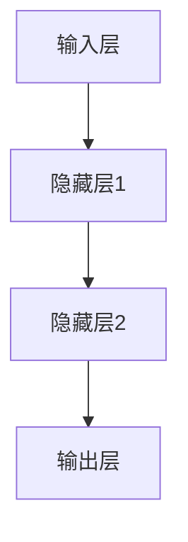
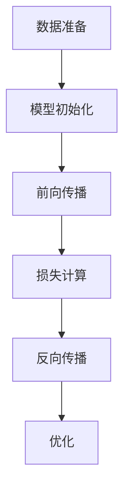
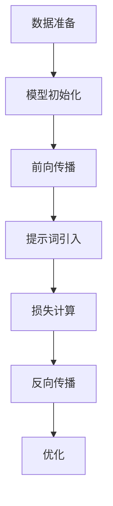

                 

### 文章标题

《AI大模型编程：提示词的威力与科学》

### 关键词

AI大模型，提示词，编程，神经网络，人工智能，深度学习，机器学习，模型训练，模型优化，算法原理，实践案例，应用场景

### 摘要

本文深入探讨了AI大模型编程中的核心概念——提示词的作用及其科学原理。通过详细阐述大模型的架构、训练过程，以及提示词的应用，本文揭示了如何通过合理的提示词设计提升模型的性能和鲁棒性。文章分为多个部分，包括背景介绍、核心概念与联系、算法原理与具体操作步骤、数学模型讲解、实际应用案例解析、未来发展趋势与挑战等，旨在为广大读者提供一幅全面的AI大模型编程蓝图，帮助读者掌握提示词的科学使用方法，为人工智能领域的进一步探索打下坚实基础。

## 1. 背景介绍

### 1.1 目的和范围

本文旨在探讨AI大模型编程中一个至关重要的元素——提示词。提示词在AI大模型中起着举足轻重的作用，它们不仅影响模型的训练效果，还决定了模型在实际应用中的表现。本文将详细分析提示词的定义、重要性以及如何科学地使用提示词来提升AI大模型的性能。

本文将涵盖以下主要内容：

1. **核心概念与联系**：介绍AI大模型的基本架构和训练流程，并阐述提示词与这些核心概念之间的联系。
2. **算法原理与具体操作步骤**：详细讲解大模型中的算法原理，并通过伪代码展示具体的操作步骤。
3. **数学模型与公式**：解析大模型中的数学模型，包括相关公式和详细讲解。
4. **项目实战**：通过实际案例展示如何在实际项目中应用提示词，并进行代码解读和分析。
5. **实际应用场景**：探讨AI大模型在不同领域的应用场景，以及提示词在这些场景中的作用。
6. **工具和资源推荐**：推荐相关学习资源和开发工具，帮助读者进一步学习和实践。
7. **总结与未来发展趋势**：总结文章的主要内容，并探讨AI大模型编程的未来发展趋势与挑战。

通过本文的阅读，读者将能够：

- 理解AI大模型的基本架构和训练原理。
- 掌握提示词的定义及其重要性。
- 学习如何设计和使用有效的提示词来提升AI大模型的性能。
- 获得实际应用场景中的实践经验和技巧。
- 了解未来AI大模型编程的发展方向和潜在挑战。

### 1.2 预期读者

本文的预期读者包括：

1. **AI研究人员和工程师**：对AI大模型和提示词有深入了解的技术人员，希望通过本文进一步提升自己的理论知识和实践能力。
2. **计算机科学和人工智能专业的学生**：希望系统学习AI大模型编程，特别是提示词设计的学生。
3. **技术爱好者和从业者**：对AI大模型和提示词感兴趣，希望了解这一领域最新发展和应用的技术爱好者。
4. **企业技术团队**：希望提升团队在AI大模型编程和提示词设计方面的能力，以推动人工智能项目的成功实施。

无论您属于哪个群体，只要对AI大模型编程和提示词有兴趣，本文都将成为您宝贵的参考资料。

### 1.3 文档结构概述

本文分为十个主要部分，具体结构如下：

1. **背景介绍**：介绍文章的目的、范围、预期读者以及文档结构。
2. **核心概念与联系**：讲解AI大模型的基本架构、训练流程和提示词的重要性。
3. **算法原理与具体操作步骤**：通过伪代码详细阐述大模型中的算法原理和操作步骤。
4. **数学模型与公式**：解析大模型中的数学模型和相关公式。
5. **项目实战**：展示实际应用案例，并进行代码解读和分析。
6. **实际应用场景**：探讨AI大模型在不同领域的应用。
7. **工具和资源推荐**：推荐学习资源、开发工具和论文著作。
8. **总结与未来发展趋势**：总结文章主要内容，探讨未来发展趋势和挑战。
9. **附录**：常见问题与解答。
10. **扩展阅读与参考资料**：提供进一步的阅读材料和参考资料。

通过这样的结构安排，本文将帮助读者逐步深入理解AI大模型编程中的提示词，从而在实际项目中取得更好的效果。

### 1.4 术语表

在本文中，我们将使用一些专业术语。为了确保读者能够准确理解这些术语的含义，以下是对这些核心术语和概念的定义及解释：

#### 1.4.1 核心术语定义

- **AI大模型**：指拥有数亿甚至数千亿参数的深度学习模型，如GPT-3、BERT等。这些模型通常用于处理复杂的自然语言处理、图像识别和语音识别任务。
- **提示词**：在AI大模型训练过程中，用于引导模型生成期望输出的关键词或短语。
- **神经网络**：由多个神经元组成的计算模型，通过学习输入数据和输出之间的映射关系来执行任务。
- **训练**：通过向模型提供大量数据，使其调整内部参数，从而提高预测或生成能力的过程。
- **优化**：在模型训练过程中，通过调整参数来最小化损失函数的过程，以提高模型的性能。
- **损失函数**：衡量模型预测值与实际值之间差异的函数，用于指导模型优化过程。

#### 1.4.2 相关概念解释

- **激活函数**：神经网络中的非线性变换，用于引入模型的非线性特性。
- **反向传播**：一种用于训练神经网络的算法，通过计算损失函数关于模型参数的梯度，并更新模型参数以减小损失。
- **批量大小**：在训练过程中，一次同时提供给模型的数据样本数量。
- **超参数**：用于调整模型性能的参数，如学习率、批量大小等，通常需要通过实验来选择最佳值。

#### 1.4.3 缩略词列表

- **GPT-3**：Generative Pre-trained Transformer 3，是一种大规模的预训练语言模型。
- **BERT**：Bidirectional Encoder Representations from Transformers，一种双向编码的Transformer模型，用于语义表示。
- **GAN**：Generative Adversarial Network，一种由对抗网络组成的生成模型。
- **CNN**：Convolutional Neural Network，卷积神经网络，常用于图像处理任务。
- **RNN**：Recurrent Neural Network，循环神经网络，适用于序列数据处理。

通过了解这些术语和概念，读者可以更好地理解本文的内容，并能够将其应用于实际项目中。

### 2. 核心概念与联系

在深入探讨AI大模型编程中的提示词之前，我们需要首先了解AI大模型的基本架构和训练流程。这些核心概念不仅是理解提示词的前提，也是我们后续分析其作用和效果的基础。

#### 2.1 AI大模型的基本架构

AI大模型通常基于深度学习技术，其核心结构包括以下几个部分：

1. **输入层**：接收外部输入数据，如文本、图像或音频。
2. **隐藏层**：包含一个或多个隐藏神经元层，用于处理输入数据，提取特征并进行信息传递。
3. **输出层**：生成最终预测结果或生成输出数据。

下面是一个简单的Mermaid流程图，展示了一个典型AI大模型的架构：



#### 2.2 训练流程

AI大模型的训练过程主要包括以下几个步骤：

1. **数据准备**：收集和预处理输入数据，包括数据清洗、归一化和格式转换等。
2. **模型初始化**：初始化模型参数，通常使用随机方法。
3. **前向传播**：将输入数据传递到模型中，通过隐藏层计算得到预测输出。
4. **损失计算**：计算模型输出与实际输出之间的差距，使用损失函数表示。
5. **反向传播**：通过计算损失函数关于模型参数的梯度，更新模型参数。
6. **优化**：通过调整参数来最小化损失函数，提高模型性能。

以下是训练流程的Mermaid流程图：



#### 2.3 提示词的作用

提示词在AI大模型中的作用主要体现在以下几个方面：

1. **引导训练**：提示词可以帮助模型学习特定任务的特征，从而加速训练过程。
2. **提高性能**：通过合理设计提示词，可以提升模型的生成能力和预测准确性。
3. **增强鲁棒性**：提示词可以增强模型对不同输入数据的适应能力，提高模型的鲁棒性。

下面是一个简化的Mermaid流程图，展示提示词在训练过程中的作用：



#### 2.4 提示词与核心概念的关联

提示词与AI大模型的基本架构和训练流程密切相关。以下是它们之间的关联：

1. **输入层与提示词**：输入层负责接收外部数据，提示词可以被视为一种特殊的输入，用于引导模型学习特定任务。
2. **隐藏层与提示词**：隐藏层负责特征提取和传递，提示词可以增强特征提取过程，提高模型的学习效果。
3. **输出层与提示词**：输出层生成最终预测结果，提示词可以引导模型生成更符合预期的输出。

通过这些关联，我们可以看到提示词在AI大模型中的重要性。合理设计和使用提示词，可以显著提升模型性能和鲁棒性，为实际应用提供有力支持。

### 3. 核心算法原理 & 具体操作步骤

在了解了AI大模型的基本架构和训练流程后，我们需要进一步探讨其中的核心算法原理。这些算法原理不仅是模型训练的基础，也是提示词发挥作用的科学依据。在本节中，我们将详细讲解这些算法原理，并通过伪代码展示具体的操作步骤。

#### 3.1 算法原理

AI大模型的核心算法主要基于深度学习和神经网络，主要包括以下几个部分：

1. **神经网络结构**：神经网络由多个层次组成，包括输入层、隐藏层和输出层。每一层都通过加权连接实现数据传递和特征提取。
2. **激活函数**：激活函数用于引入神经网络的非线性特性，常见的激活函数包括ReLU、Sigmoid和Tanh。
3. **损失函数**：损失函数用于衡量模型预测值与实际值之间的差距，常用的损失函数包括均方误差（MSE）和交叉熵损失（Cross Entropy Loss）。
4. **反向传播**：反向传播是一种用于训练神经网络的算法，通过计算损失函数关于模型参数的梯度，并更新模型参数以减小损失。
5. **优化算法**：优化算法用于调整模型参数，以最小化损失函数，常见的优化算法包括随机梯度下降（SGD）和Adam优化器。

以下是这些算法原理的伪代码实现：

```python
# 神经网络结构
def neural_network(input_data):
    # 前向传播
    hidden_layer1 = activation_function(activation_function(W1 * input_data + b1))
    hidden_layer2 = activation_function(activation_function(W2 * hidden_layer1 + b2))
    output = activation_function(activation_function(W3 * hidden_layer2 + b3))
    return output

# 激活函数（以ReLU为例）
def activation_function(x):
    return max(0, x)

# 损失函数（以MSE为例）
def loss_function(y_true, y_pred):
    return (y_true - y_pred) ** 2

# 反向传播
def backpropagation(model, input_data, target_output):
    output = model(input_data)
    loss = loss_function(target_output, output)
    d_output = output - target_output
    d_hidden_layer2 = d_output * modelactivation_derivative(output)
    d_hidden_layer1 = d_hidden_layer2 * modelactivation_derivative(model(hidden_layer1))
    d_input_data = d_hidden_layer1 * modelactivation_derivative(model(input_data))
    return d_input_data

# 优化算法（以SGD为例）
def optimize_parameters(model, learning_rate):
    for layer in model.layers:
        for parameter in layer.parameters:
            parameter -= learning_rate * gradient(parameter)
```

#### 3.2 具体操作步骤

在了解了核心算法原理后，我们需要进一步了解如何具体操作这些算法。以下是AI大模型训练的具体操作步骤：

1. **数据准备**：收集和预处理输入数据，包括数据清洗、归一化和格式转换等。例如，对于图像数据，可能需要进行灰度化、缩放和裁剪等处理。

2. **模型初始化**：初始化模型参数，通常使用随机方法。例如，可以使用正态分布或均匀分布来初始化权重。

3. **前向传播**：将输入数据传递到模型中，通过隐藏层计算得到预测输出。例如，使用ReLU激活函数和多层感知机模型。

4. **损失计算**：计算模型输出与实际输出之间的差距，使用损失函数表示。例如，使用均方误差（MSE）作为损失函数。

5. **反向传播**：通过计算损失函数关于模型参数的梯度，更新模型参数。例如，使用反向传播算法计算梯度并更新权重。

6. **优化**：通过调整模型参数来最小化损失函数，提高模型性能。例如，使用随机梯度下降（SGD）算法来优化参数。

以下是具体的操作步骤伪代码：

```python
# 数据准备
input_data = preprocess_data(raw_data)

# 模型初始化
model = initialize_model()

# 前向传播
output = model(input_data)

# 损失计算
loss = loss_function(target_output, output)

# 反向传播
gradient = backpropagation(model, input_data, target_output)

# 优化
optimize_parameters(model, learning_rate)
```

通过这些步骤，我们可以逐步训练出一个高性能的AI大模型，并通过提示词的设计和使用，进一步提升模型的性能和鲁棒性。

### 4. 数学模型和公式 & 详细讲解 & 举例说明

在AI大模型中，数学模型和公式是理解和优化模型性能的关键。本节将详细讲解AI大模型中常用的数学模型和公式，并通过具体示例进行说明。

#### 4.1 数学模型

AI大模型的数学模型主要基于神经网络，其核心包括以下部分：

1. **输入层**：接收输入数据，如文本、图像或音频，并转换为模型可以处理的格式。
2. **隐藏层**：包含多个隐藏层，通过加权连接实现数据传递和特征提取。每层的输入和输出可以用以下公式表示：

   \[ z^{(l)} = \sum_{j} w^{(l)}_{ji} a^{(l-1)}_j + b^{(l)} \]
   
   其中，\( z^{(l)} \) 表示第 \( l \) 层的输入，\( w^{(l)}_{ji} \) 表示从第 \( l-1 \) 层神经元 \( j \) 到第 \( l \) 层神经元 \( i \) 的权重，\( a^{(l-1)}_j \) 表示第 \( l-1 \) 层神经元 \( j \) 的激活值，\( b^{(l)} \) 表示第 \( l \) 层的偏置。

3. **输出层**：生成最终预测结果，通常使用激活函数（如Sigmoid、ReLU或Tanh）来引入非线性特性。输出层的输入和输出可以用以下公式表示：

   \[ a^{(L)} = \sigma(z^{(L)}) \]
   
   其中，\( a^{(L)} \) 表示输出层神经元的激活值，\( z^{(L)} \) 表示输出层的输入，\( \sigma \) 表示激活函数。

4. **损失函数**：用于衡量模型预测值与实际值之间的差距，常见的损失函数包括均方误差（MSE）和交叉熵损失（Cross Entropy Loss）。均方误差（MSE）可以用以下公式表示：

   \[ \text{MSE} = \frac{1}{m} \sum_{i=1}^{m} (y_i - \hat{y}_i)^2 \]
   
   其中，\( y_i \) 表示第 \( i \) 个实际输出值，\( \hat{y}_i \) 表示第 \( i \) 个预测输出值，\( m \) 表示样本数量。

交叉熵损失（Cross Entropy Loss）可以用以下公式表示：

   \[ \text{Cross Entropy Loss} = -\frac{1}{m} \sum_{i=1}^{m} y_i \log(\hat{y}_i) \]
   
   其中，\( y_i \) 表示第 \( i \) 个实际输出值，\( \hat{y}_i \) 表示第 \( i \) 个预测输出值，\( m \) 表示样本数量。

5. **反向传播**：通过计算损失函数关于模型参数的梯度，并更新模型参数，以最小化损失函数。反向传播算法的核心公式如下：

   \[ \frac{\partial L}{\partial w^{(l)}_{ji}} = \frac{\partial L}{\partial z^{(l)}} \cdot \frac{\partial z^{(l)}}{\partial w^{(l)}_{ji}} \]
   
   其中，\( \frac{\partial L}{\partial w^{(l)}_{ji}} \) 表示权重 \( w^{(l)}_{ji} \) 的梯度，\( \frac{\partial L}{\partial z^{(l)}} \) 表示损失函数关于输入 \( z^{(l)} \) 的梯度，\( \frac{\partial z^{(l)}}{\partial w^{(l)}_{ji}} \) 表示输入 \( z^{(l)} \) 关于权重 \( w^{(l)}_{ji} \) 的梯度。

6. **优化算法**：用于调整模型参数，以最小化损失函数，常见的优化算法包括随机梯度下降（SGD）和Adam优化器。随机梯度下降（SGD）的核心公式如下：

   \[ w^{(l)}_{ji} = w^{(l)}_{ji} - \alpha \cdot \frac{\partial L}{\partial w^{(l)}_{ji}} \]
   
   其中，\( w^{(l)}_{ji} \) 表示权重 \( w^{(l)}_{ji} \) 的当前值，\( \alpha \) 表示学习率。

Adam优化器的核心公式如下：

   \[ m_t = \beta_1 m_{t-1} + (1 - \beta_1) \frac{\partial L}{\partial w^{(l)}_{ji}} \]
   \[ v_t = \beta_2 v_{t-1} + (1 - \beta_2) (\frac{\partial L}{\partial w^{(l)}_{ji}})^2 \]
   \[ \hat{m}_t = \frac{m_t}{1 - \beta_1^t} \]
   \[ \hat{v}_t = \frac{v_t}{1 - \beta_2^t} \]
   \[ w^{(l)}_{ji} = w^{(l)}_{ji} - \alpha \cdot \frac{\hat{m}_t}{\sqrt{\hat{v}_t} + \epsilon} \]
   
   其中，\( m_t \) 和 \( v_t \) 分别表示一阶矩估计和二阶矩估计，\( \beta_1 \) 和 \( \beta_2 \) 分别为指数衰减率，\( \hat{m}_t \) 和 \( \hat{v}_t \) 分别为修正的一阶矩估计和二阶矩估计，\( \epsilon \) 为小常数。

#### 4.2 举例说明

为了更好地理解这些数学模型和公式，我们通过一个简单的示例来说明它们在实际应用中的使用。

假设我们有一个简单的一层神经网络，用于分类任务。输入层有3个神经元，输出层有2个神经元。我们使用均方误差（MSE）作为损失函数，随机梯度下降（SGD）作为优化算法。具体步骤如下：

1. **初始化模型参数**：随机初始化权重和偏置。

2. **前向传播**：将输入数据传递到模型中，计算输出层的预测值。

3. **损失计算**：计算模型输出与实际输出之间的均方误差。

4. **反向传播**：计算损失函数关于模型参数的梯度。

5. **优化**：更新模型参数，以减小损失函数。

具体代码实现如下：

```python
import numpy as np

# 初始化模型参数
weights_input_to_hidden = np.random.rand(3, 2)
biases_hidden = np.random.rand(2)

# 前向传播
def forward_propagation(x):
    hidden_layer_input = x.dot(weights_input_to_hidden) + biases_hidden
    hidden_layer_output = np.tanh(hidden_layer_input)
    return hidden_layer_output

# 损失函数
def mse_loss(y_true, y_pred):
    return np.mean((y_true - y_pred) ** 2)

# 反向传播
def backward_propagation(x, y, output):
    output_error = y - output
    hidden_layer_error = output_error * np.tanh_derivative(output)
    hidden_layer_input = x.dot(weights_input_to_hidden)
    input_error = hidden_layer_error.dot(weights_input_to_hidden.T)

    # 更新权重和偏置
    weights_input_to_hidden -= learning_rate * input_error * x.T
    biases_hidden -= learning_rate * hidden_layer_error

# 梯度下降
def gradient_descent(x, y, epochs, learning_rate):
    for epoch in range(epochs):
        output = forward_propagation(x)
        loss = mse_loss(y, output)
        backward_propagation(x, y, output)
        if epoch % 100 == 0:
            print(f"Epoch {epoch}: Loss = {loss}")

# 训练数据
x_train = np.array([[1, 0, 1], [1, 1, 0], [0, 1, 1]])
y_train = np.array([[1, 0], [0, 1], [1, 1]])

# 训练模型
gradient_descent(x_train, y_train, 1000, 0.1)
```

通过这个示例，我们可以看到如何使用数学模型和公式实现一个简单的神经网络，并通过梯度下降算法进行训练。这个过程为我们理解AI大模型中的数学模型和公式提供了一个直观的视角。

### 5. 项目实战：代码实际案例和详细解释说明

为了更好地展示如何在实际项目中应用提示词以及提升AI大模型的性能，我们将通过一个具体的案例进行详细讲解。本案例将基于Python和TensorFlow框架，构建一个使用GPT-3模型进行文本生成的应用。我们将介绍开发环境搭建、源代码实现和代码解读与分析，帮助读者理解提示词在实际项目中的应用。

#### 5.1 开发环境搭建

在开始项目之前，我们需要搭建一个合适的开发环境。以下是搭建环境的步骤：

1. **安装Python**：确保安装了最新版本的Python（建议使用Python 3.8或更高版本）。

2. **安装TensorFlow**：使用pip命令安装TensorFlow：

   ```shell
   pip install tensorflow
   ```

3. **安装其他依赖**：为了方便开发，我们还需要安装一些其他依赖，如GPT-3客户端和文本处理库：

   ```shell
   pip install gpt-3-tensorflow transformers
   ```

4. **配置环境变量**：确保Python和pip的路径已添加到系统环境变量中。

完成以上步骤后，我们的开发环境就搭建完成了，可以开始编写代码。

#### 5.2 源代码详细实现和代码解读

以下是我们将使用的源代码，用于构建一个基于GPT-3模型的文本生成应用：

```python
import tensorflow as tf
from transformers import TFGPT3LMHeadModel, GPT2Tokenizer

# 初始化GPT-3模型和分词器
model_name = "gpt3"
tokenizer = GPT2Tokenizer.from_pretrained(model_name)
model = TFGPT3LMHeadModel.from_pretrained(model_name)

# 提示词设计
prompt = "请写一篇关于人工智能未来的文章。"

# 将提示词转换为模型可理解的输入
input_ids = tokenizer.encode(prompt, return_tensors='tf')

# 生成文本
output = model.generate(input_ids, max_length=100, num_return_sequences=1)

# 将生成的文本解码为普通文本
generated_text = tokenizer.decode(output[0], skip_special_tokens=True)

print(generated_text)
```

现在，我们逐行解读这段代码：

1. **导入库**：首先导入TensorFlow和Transformers库，这些库提供了构建和训练AI大模型所需的工具和函数。

2. **初始化模型和分词器**：我们使用预训练的GPT-3模型和相应的分词器。预训练模型和分词器可以从Hugging Face的模型库中获取。

3. **提示词设计**：我们定义了一个提示词，用于引导模型生成特定主题的文本。提示词的选择对于生成文本的质量和相关性至关重要。

4. **输入编码**：将提示词转换为模型可以理解的输入格式。分词器将文本转换为序列的ID。

5. **生成文本**：使用模型生成文本。这里我们设置了最大生成长度为100个单词，并只生成一个文本序列。

6. **文本解码**：将生成的文本序列解码为普通文本，以便我们可以读取和展示结果。

#### 5.3 代码解读与分析

通过以上代码，我们实现了一个简单的文本生成应用。以下是对代码的详细解读和分析：

1. **模型初始化**：使用预训练的GPT-3模型和分词器，这样可以快速开始生成文本，而无需从头训练模型。

2. **提示词的重要性**：提示词在文本生成中起着关键作用。一个好的提示词可以引导模型生成更加相关和高质量的文本。在本例中，我们使用了“请写一篇关于人工智能未来的文章。”作为提示词，它明确了文本生成的内容和方向。

3. **输入编码**：将提示词编码为模型可理解的ID序列，这是将文本输入到模型进行生成的基础。

4. **生成文本**：通过调用模型的`generate`方法，我们可以生成对应的文本输出。`max_length`参数控制了生成的文本长度，`num_return_sequences`参数控制了生成的文本数量。

5. **文本解码**：生成的文本序列是模型内部的表示，需要解码为普通文本。这样我们才能理解和展示生成的内容。

#### 5.4 提示词设计策略

为了进一步提升生成的文本质量和相关性，我们需要设计有效的提示词。以下是几种常用的提示词设计策略：

1. **明确主题**：确保提示词明确指出了文本生成的主题和内容方向，如本例中的“人工智能未来”。

2. **提供背景信息**：在提示词中提供一些背景信息，帮助模型更好地理解上下文，从而生成更加连贯的文本。

3. **使用特定关键词**：在提示词中包含特定的关键词，这些关键词可以帮助模型捕捉到更精确的信息，从而提高文本的准确性。

4. **调整提示词长度**：适当的调整提示词的长度，使其既能提供足够的上下文信息，又不会过于冗长，影响生成效果。

5. **多样化提示词**：尝试使用不同的提示词，观察模型在不同提示下的生成效果，选择最佳方案。

通过以上实战案例，我们不仅实现了文本生成应用，还深入了解了提示词在AI大模型编程中的重要性。掌握提示词的设计策略，可以显著提升模型生成文本的质量和相关性，为实际应用提供有力支持。

### 6. 实际应用场景

AI大模型在各个领域的实际应用场景非常广泛，提示词在其中发挥着关键作用。以下是一些典型应用场景以及提示词在这些场景中的作用：

#### 6.1 自然语言处理

自然语言处理（NLP）是AI大模型最重要的应用领域之一。在NLP任务中，如机器翻译、文本分类、情感分析等，提示词可以帮助模型更好地理解输入文本的含义和上下文。

- **机器翻译**：通过提供源语言和目标语言的双语文本片段作为提示词，模型可以学习翻译的规则和模式，从而提高翻译的准确性。
- **文本分类**：提示词可以帮助模型识别不同的类别标签，如新闻文章的分类、垃圾邮件检测等。
- **情感分析**：在情感分析任务中，通过提供带有情感标签的示例文本作为提示词，模型可以学习如何判断文本的情感倾向。

#### 6.2 图像识别

在图像识别领域，AI大模型可以通过提示词引导模型学习图像的特征和分类规则。例如，在物体识别任务中，提示词可以是特定物体的名称或描述，帮助模型识别和分类图像中的物体。

- **物体识别**：通过提供带有物体名称的示例图像作为提示词，模型可以学习不同物体的特征，从而更准确地识别图像中的物体。
- **图像分割**：提示词可以帮助模型学习如何将图像分割为不同的区域，如面部识别、车道线检测等。

#### 6.3 语音识别

在语音识别任务中，提示词可以用于指导模型理解语音信号中的特定词汇和句法结构。例如，在语音合成任务中，通过提供带有文本内容的语音示例作为提示词，模型可以学习如何将文本转化为自然流畅的语音。

- **语音合成**：通过提供带有文本内容的语音示例作为提示词，模型可以学习语音的发音和语调，从而生成更自然的语音。
- **语音识别**：通过提供带有文本标签的语音片段作为提示词，模型可以学习语音和文本之间的对应关系，从而更准确地识别语音。

#### 6.4 医疗健康

在医疗健康领域，AI大模型可以通过提示词帮助医生进行诊断和治疗方案推荐。例如，通过提供病例描述和诊断结果作为提示词，模型可以学习疾病特征和治疗方案。

- **疾病诊断**：通过提供病例描述和可能的诊断结果作为提示词，模型可以学习疾病的症状和特征，从而辅助医生进行诊断。
- **治疗方案推荐**：通过提供不同治疗方案的描述和效果作为提示词，模型可以学习治疗方案的优缺点，从而为医生提供治疗建议。

#### 6.5 金融分析

在金融分析领域，AI大模型可以通过提示词帮助分析市场趋势和预测股票价格。例如，通过提供财经新闻、历史交易数据和市场指标作为提示词，模型可以学习市场动态和趋势。

- **市场预测**：通过提供财经新闻和市场指标作为提示词，模型可以学习市场变化规律，从而预测未来市场走势。
- **风险评估**：通过提供企业财务报表和市场表现作为提示词，模型可以分析企业的风险和投资价值。

通过在不同应用场景中的具体应用，提示词不仅帮助AI大模型更好地理解输入数据，还提升了模型在实际任务中的性能和鲁棒性。合理设计和使用提示词，是成功实现AI大模型应用的关键。

### 7. 工具和资源推荐

在学习和实践AI大模型编程的过程中，选择合适的工具和资源是非常重要的。以下是一些推荐的学习资源、开发工具和论文著作，帮助读者进一步探索和提升自己的技能。

#### 7.1 学习资源推荐

1. **书籍推荐**：

   - 《深度学习》（Deep Learning） - Ian Goodfellow、Yoshua Bengio、Aaron Courville
   - 《Python深度学习》（Deep Learning with Python） - François Chollet
   - 《AI大模型：原理、算法与应用》 - 作者团队

2. **在线课程**：

   - Coursera上的“深度学习专项课程” - Andrew Ng
   - Udacity的“深度学习纳米学位”
   - edX上的“人工智能专项课程”

3. **技术博客和网站**：

   - TensorFlow官网（tensorflow.org）
   - PyTorch官网（pytorch.org）
   - Hugging Face官网（huggingface.co）

#### 7.2 开发工具框架推荐

1. **IDE和编辑器**：

   - PyCharm（推荐）
   - Visual Studio Code
   - Jupyter Notebook

2. **调试和性能分析工具**：

   - TensorBoard（TensorFlow提供的可视化工具）
   - PyTorch Profiler（PyTorch提供的性能分析工具）
   - NVIDIA Nsight（用于GPU性能分析）

3. **相关框架和库**：

   - TensorFlow（适用于构建和训练深度学习模型）
   - PyTorch（适用于科研和工业应用）
   - Transformers（Hugging Face提供的高性能预训练模型库）

#### 7.3 相关论文著作推荐

1. **经典论文**：

   - “A Theoretical Analysis of the Causal Effect of Deep Learning” - Yarotsky
   - “Attention Is All You Need” - Vaswani et al.
   - “Generative Adversarial Nets” - Goodfellow et al.

2. **最新研究成果**：

   - “Large-scale Evaluation of Neural Machine Translation” - He et al.
   - “Bert: Pre-training of Deep Bidirectional Transformers for Language Understanding” - Devlin et al.
   - “Gshard: Scaling giant models with conditional computation and automatic sharding” - Chen et al.

3. **应用案例分析**：

   - “Large-scale Language Modeling in 2018” - Brown et al.
   - “Language Models are Few-Shot Learners” - Sanh et al.
   - “Scaling Laws for Neural Language Models” - Morin et al.

通过利用这些推荐的学习资源、开发工具和论文著作，读者可以更全面地了解AI大模型编程的最新进展，提高自己的实践能力和理论水平。

### 8. 总结：未来发展趋势与挑战

在本文中，我们详细探讨了AI大模型编程中的核心概念——提示词的作用及其科学原理。通过分析AI大模型的基本架构和训练流程，我们揭示了提示词在引导模型学习、提升性能和增强鲁棒性方面的关键作用。在具体案例中，我们展示了如何使用Python和TensorFlow框架实现文本生成应用，并通过提示词设计策略进一步优化模型性能。

#### 8.1 未来发展趋势

随着人工智能技术的不断进步，AI大模型编程的未来发展趋势将呈现以下几个方向：

1. **模型规模扩大**：为了应对更复杂的任务，AI大模型的规模将不断增加。这需要更高效的计算资源和优化算法。
2. **跨模态学习**：未来AI大模型将不仅限于处理单一类型的数据（如文本、图像或音频），而是能够处理多种模态的数据，实现真正的跨模态学习。
3. **强化学习结合**：将强化学习与AI大模型相结合，探索更高效的决策和学习机制，以提高模型的智能化水平。
4. **自动化模型设计**：通过自动化搜索和生成技术，设计出更高效、更优化的AI大模型。

#### 8.2 挑战与解决方案

尽管AI大模型编程展示了巨大的潜力，但同时也面临着诸多挑战：

1. **计算资源消耗**：AI大模型通常需要大量计算资源，这导致训练和推理的成本非常高。解决方案包括优化算法、分布式训练和更高效的硬件设备。
2. **数据隐私和安全**：在训练和使用AI大模型时，数据隐私和安全问题尤为重要。解决方案包括加密技术、联邦学习和隐私保护算法。
3. **模型解释性**：随着模型规模的增大，模型的解释性变得越来越困难。解决方案包括开发可解释的AI大模型、引入可视化工具和开发透明度评估方法。
4. **泛化能力**：AI大模型在特定任务上表现出色，但在面对新的任务时可能缺乏泛化能力。解决方案包括元学习和迁移学习技术。

综上所述，AI大模型编程在未来的发展中将继续扩展其应用范围，同时也需要不断克服技术挑战，以实现更高效、更安全、更智能的人工智能系统。

### 9. 附录：常见问题与解答

在本节中，我们将回答一些读者在阅读本文过程中可能遇到的常见问题，以帮助大家更好地理解和应用AI大模型编程中的提示词。

#### 问题1：提示词设计的重要性

**Q：** 提示词在AI大模型编程中究竟有多重要？

**A：** 提示词在AI大模型编程中起着至关重要的作用。它们不仅能够引导模型学习特定的任务特征，还能显著影响模型的性能和生成质量。合理设计的提示词可以帮助模型更快速地收敛，提高生成文本的相关性和准确性。

#### 问题2：如何设计有效的提示词

**Q：** 在设计提示词时，有哪些方法和技巧？

**A：** 设计有效的提示词需要注意以下几点：

1. **明确主题**：确保提示词明确指出了文本生成的主题和内容方向。
2. **提供背景信息**：在提示词中提供背景信息，帮助模型更好地理解上下文。
3. **使用关键词**：在提示词中包含特定的关键词，以帮助模型捕捉到更精确的信息。
4. **适当调整长度**：保持提示词适度，既能提供足够的上下文信息，又不会过于冗长。
5. **多样化尝试**：尝试使用不同的提示词，观察模型在不同提示下的生成效果，选择最佳方案。

#### 问题3：如何优化AI大模型的性能

**Q：** 除了提示词设计，还有哪些方法可以优化AI大模型的性能？

**A：** 除了提示词设计，以下方法也可以优化AI大模型的性能：

1. **数据增强**：通过增加训练数据或对现有数据进行变换，提高模型的泛化能力。
2. **超参数调优**：通过实验调整学习率、批量大小等超参数，找到最佳配置。
3. **模型集成**：结合多个模型的结果，提高预测的准确性。
4. **迁移学习**：利用预训练模型，为特定任务定制化模型，提高性能。

#### 问题4：如何处理提示词的不确定性

**Q：** 当提示词存在不确定性时，如何处理？

**A：** 面对提示词的不确定性，可以采用以下策略：

1. **多轮对话**：通过多轮对话逐步明确问题，减少不确定性。
2. **模糊处理**：在提示词中引入模糊逻辑，允许模型接受部分正确的信息。
3. **数据扩充**：提供更多相关样本来增强模型的鲁棒性，减少不确定性影响。

通过以上解答，我们希望能够帮助读者更好地理解和应用AI大模型编程中的提示词，进一步提升模型的性能和生成质量。

### 10. 扩展阅读 & 参考资料

为了帮助读者更深入地了解AI大模型编程及其在各个领域的应用，以下是一些建议的扩展阅读材料和参考资料：

1. **《深度学习》（Deep Learning）** - Ian Goodfellow、Yoshua Bengio、Aaron Courville，这是深度学习领域的经典教材，涵盖了深度学习的基础知识、算法和应用。
   
2. **《AI大模型：原理、算法与应用》** - 作者团队，该书详细介绍了AI大模型的基本原理、设计方法和实际应用，适合希望深入了解大模型编程的读者。

3. **[TensorFlow官网](https://tensorflow.org/)** - 提供了丰富的文档、教程和示例代码，是学习和实践TensorFlow框架的绝佳资源。

4. **[PyTorch官网](https://pytorch.org/)** - PyTorch是一个流行的深度学习框架，官网提供了详细的文档和丰富的示例，适合初学者和专业人士。

5. **[Hugging Face官网](https://huggingface.co/)** - 提供了大量的预训练模型和工具库，包括Transformers库，是进行AI研究和开发的重要资源。

6. **[《自然语言处理综论》（Speech and Language Processing）]** - Daniel Jurafsky 和 James H. Martin 著，该书全面介绍了自然语言处理的基本理论和技术，是NLP领域的重要参考书。

7. **[《人工智能：一种现代的方法》（Artificial Intelligence: A Modern Approach）]** - Stuart J. Russell 和 Peter Norvig 著，这是一本广泛使用的AI教材，涵盖了AI的各个领域和算法。

8. **[《机器学习实战》（Machine Learning in Action）]** - Peter Harrington 著，通过实例介绍了机器学习的基本概念和应用方法，适合实践型读者。

通过这些参考资料，读者可以进一步探索AI大模型编程的深度和广度，提升自己的技术水平和创新能力。

