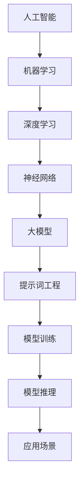

                 

# AI大模型编程：提示词的艺术与科学

> **关键词：**人工智能、大模型、编程、提示词、算法、应用场景  
>
> **摘要：**本文旨在探讨人工智能领域的大模型编程技巧，特别是提示词（Prompt Engineering）在模型训练和应用中的重要性。我们将逐步分析提示词的艺术与科学，通过实际案例和详细解释，帮助读者理解如何有效利用提示词来提高AI模型的性能和鲁棒性。

## 1. 背景介绍

### 1.1 目的和范围

本文的目标是介绍人工智能（AI）大模型编程中的关键要素——提示词（Prompt Engineering）。随着深度学习技术的迅猛发展，大模型在各个领域展现出了强大的能力。然而，如何有效地使用这些大模型，特别是在训练和推理阶段，成为了一个重要的课题。本文将重点探讨以下几个方面：

1. **大模型的基础知识**：介绍大模型的定义、发展历程和关键技术。
2. **提示词的定义和作用**：阐述提示词的概念、其在模型训练和应用中的作用。
3. **核心算法原理**：分析提示词工程的核心算法，包括数据预处理、模型选择和调优等。
4. **数学模型和公式**：介绍与提示词相关的数学模型，并给出具体的公式和计算方法。
5. **项目实战**：通过实际案例，展示如何将提示词应用于AI模型的开发和部署。
6. **实际应用场景**：探讨提示词在自然语言处理、计算机视觉和其他领域的应用。
7. **工具和资源推荐**：推荐学习和实践提示词工程的相关工具、书籍和在线资源。

### 1.2 预期读者

本文适合对人工智能有一定了解的技术人员、研究人员和工程师。无论您是刚刚踏入AI领域的新手，还是有着丰富经验的老兵，本文都希望能为您提供有价值的见解和实用的技巧。

### 1.3 文档结构概述

本文分为十个部分，结构如下：

1. **背景介绍**：本文的背景、目的和结构概述。
2. **核心概念与联系**：介绍大模型和提示词的相关概念，并给出Mermaid流程图。
3. **核心算法原理 & 具体操作步骤**：详细讲解提示词工程的核心算法。
4. **数学模型和公式 & 详细讲解 & 举例说明**：分析与提示词相关的数学模型。
5. **项目实战：代码实际案例和详细解释说明**：通过实际案例展示提示词的应用。
6. **实际应用场景**：探讨提示词在各个领域的应用。
7. **工具和资源推荐**：推荐相关学习资源和开发工具。
8. **总结：未来发展趋势与挑战**：总结本文的关键点，并展望未来。
9. **附录：常见问题与解答**：解答读者可能遇到的问题。
10. **扩展阅读 & 参考资料**：提供更多相关阅读材料。

### 1.4 术语表

#### 1.4.1 核心术语定义

- **人工智能（AI）**：模拟人类智能行为的计算机系统。
- **大模型（Large Model）**：参数规模庞大的神经网络模型，通常具有数十亿甚至数万亿个参数。
- **提示词（Prompt）**：用于引导模型进行特定任务输入的文本或数据。
- **Prompt Engineering**：设计和优化提示词的过程，以实现更高效和准确的模型性能。
- **神经网络（Neural Network）**：由大量人工神经元组成的计算模型。

#### 1.4.2 相关概念解释

- **深度学习（Deep Learning）**：一种基于神经网络的机器学习技术，能够自动从数据中学习特征表示。
- **自然语言处理（NLP）**：利用计算机技术对自然语言进行处理和理解。
- **计算机视觉（CV）**：研究如何让计算机理解和解释视觉信息。

#### 1.4.3 缩略词列表

- **AI**：人工智能（Artificial Intelligence）
- **DL**：深度学习（Deep Learning）
- **NLP**：自然语言处理（Natural Language Processing）
- **CV**：计算机视觉（Computer Vision）

## 2. 核心概念与联系

在介绍大模型和提示词之前，我们先来回顾一下与它们相关的一些核心概念。以下是一个Mermaid流程图，用于描述这些概念之间的联系。



### 2.1 大模型的定义和发展

大模型是指那些拥有数十亿甚至数万亿个参数的神经网络模型。这些模型通常被称为“巨无霸”（Gigantic）或“超大规模”（Ultra-Large）模型。大模型的出现得益于以下几个因素：

1. **计算能力提升**：随着计算能力的提升，我们能够处理更大规模的数据集，训练更复杂的模型。
2. **数据规模扩大**：互联网和传感器技术的发展，使得我们可以获取到海量的数据，为模型训练提供了丰富的素材。
3. **优化算法改进**：深度学习优化算法的改进，如Adam、AdamW等，使得大模型的训练更加高效和稳定。

### 2.2 提示词的定义和作用

提示词（Prompt）是一种用于引导模型进行特定任务输入的文本或数据。它通常包含关键信息，指导模型理解任务目标，从而提高模型在特定任务上的性能。提示词在模型训练和应用中发挥着重要作用：

1. **训练阶段**：提示词可以帮助模型学习任务的特定方面，例如在自然语言处理任务中，提示词可以包含关键词、问题或示例文本。
2. **推理阶段**：提示词用于提供输入信息，使模型能够生成相应的输出。例如，在问答系统中，提示词可以是用户提出的问题。

### 2.3 提示词工程的核心算法

提示词工程（Prompt Engineering）是设计和优化提示词的过程。核心算法包括以下几个步骤：

1. **数据预处理**：对输入数据进行清洗、格式化和标注，以便模型更好地理解和学习。
2. **模型选择**：根据任务需求，选择合适的模型架构，如BERT、GPT等。
3. **模型调优**：通过调整超参数和优化算法，提高模型在特定任务上的性能。
4. **提示词生成**：利用生成算法，如规则生成、模板生成等，生成高质量的提示词。

### 2.4 提示词工程的应用场景

提示词工程在多个领域都有广泛的应用，包括自然语言处理、计算机视觉、推荐系统等。以下是一些具体的应用场景：

1. **自然语言处理**：例如，在问答系统中，提示词可以帮助模型理解用户的问题，从而生成准确的答案。
2. **计算机视觉**：例如，在图像分类任务中，提示词可以提供标签信息，帮助模型学习分类特征。
3. **推荐系统**：例如，在商品推荐任务中，提示词可以提供用户的历史行为和偏好信息，帮助模型推荐更符合用户需求的商品。

## 3. 核心算法原理 & 具体操作步骤

### 3.1 数据预处理

数据预处理是提示词工程中的关键步骤，它包括以下几个具体操作：

1. **数据清洗**：去除数据中的噪声和异常值，例如删除重复记录、填补缺失值等。
2. **数据格式化**：将数据转换为统一的格式，例如将文本数据转换为词向量表示。
3. **数据标注**：对数据进行标注，以便模型能够理解任务的特定方面。例如，在自然语言处理任务中，对文本数据进行实体识别、情感分析等标注。

伪代码如下：

```python
def preprocess_data(data):
    # 数据清洗
    data = remove_noise(data)
    # 数据格式化
    data = format_data(data)
    # 数据标注
    data = annotate_data(data)
    return data
```

### 3.2 模型选择

在提示词工程中，选择合适的模型架构至关重要。以下是一些常用的模型架构：

1. **Transformer模型**：例如BERT、GPT等，广泛应用于自然语言处理任务。
2. **卷积神经网络（CNN）**：适用于图像处理任务，例如图像分类、目标检测等。
3. **循环神经网络（RNN）**：适用于序列数据处理任务，例如时间序列预测、语音识别等。

根据任务需求，选择合适的模型架构。以下是一个选择Transformer模型的具体操作步骤：

```python
from transformers import BertModel

# 加载预训练模型
model = BertModel.from_pretrained('bert-base-uncased')

# 模型配置
config = model.config
config.num_labels = 2  # 二分类任务
```

### 3.3 模型调优

模型调优是提升模型性能的重要步骤，包括以下几个方面：

1. **超参数调整**：例如学习率、批量大小、dropout等。
2. **优化算法选择**：例如Adam、AdamW等。
3. **数据增强**：例如数据扩充、数据增强等。

以下是一个使用AdamW优化器的具体操作步骤：

```python
from transformers import AdamW

# 初始化优化器
optimizer = AdamW(model.parameters(), lr=5e-5)

# 训练模型
for epoch in range(num_epochs):
    for batch in data_loader:
        inputs = preprocess_data(batch)
        optimizer.zero_grad()
        outputs = model(**inputs)
        loss = outputs.loss
        loss.backward()
        optimizer.step()
```

### 3.4 提示词生成

提示词生成是提示词工程的核心环节，以下是一些生成提示词的方法：

1. **规则生成**：根据任务需求，设计特定的规则来生成提示词。
2. **模板生成**：使用模板来生成提示词，例如将关键词嵌入到特定的模板中。
3. **生成对抗网络（GAN）**：利用GAN生成高质量的提示词。

以下是一个使用模板生成提示词的具体操作步骤：

```python
def generate_prompt(template, keywords):
    return template.format(*keywords)
```

假设模板为：`"{0}是一个著名的{1}，它的特点包括{2}。"`，关键词为`("爱因斯坦", "科学家", "相对论")`，则生成的提示词为：

```python
generate_prompt('{0}是一个著名的{1}，它的特点包括{2}。', ("爱因斯坦", "科学家", "相对论"))
```

## 4. 数学模型和公式 & 详细讲解 & 举例说明

### 4.1 自然语言处理中的提示词模型

在自然语言处理（NLP）中，提示词模型通常是基于Transformer架构的预训练模型，如BERT、GPT等。以下是一个典型的提示词模型的基本数学模型：

1. **输入表示**：提示词和输入文本被编码为向量表示。例如，BERT模型使用WordPiece词向量表示每个单词。
   
   $$ X = \{x_1, x_2, ..., x_n\} $$
   
   其中，$x_i$ 是第 $i$ 个单词的向量表示。

2. **注意力机制**：在Transformer模型中，注意力机制用于计算提示词和输入文本之间的关联强度。

   $$ \text{Attention}(Q, K, V) = \text{softmax}\left(\frac{QK^T}{\sqrt{d_k}}\right)V $$

   其中，$Q, K, V$ 分别是查询向量、键向量和值向量，$d_k$ 是键向量的维度。

3. **输出生成**：通过注意力机制计算得到输出向量，然后通过全连接层生成最终输出。

   $$ Y = \text{FC}(X) $$

   其中，$FC$ 是全连接层。

### 4.2 计算机视觉中的提示词模型

在计算机视觉（CV）中，提示词模型通常用于图像分类、目标检测等任务。以下是一个典型的提示词模型的基本数学模型：

1. **特征提取**：使用卷积神经网络（CNN）提取图像特征。

   $$ \text{Feature} = \text{CNN}(I) $$
   
   其中，$I$ 是输入图像。

2. **提示词嵌入**：将提示词编码为向量表示，并与图像特征进行融合。

   $$ \text{Embedding} = \text{Embedding}(P) $$
   
   其中，$P$ 是提示词。

3. **特征融合**：将图像特征和提示词嵌入进行融合，通常使用拼接或加法融合。

   $$ \text{Fused Feature} = \text{Concatenate}(\text{Feature}, \text{Embedding}) \text{ 或 } \text{Add}(\text{Feature}, \text{Embedding}) $$

4. **分类输出**：通过全连接层生成分类输出。

   $$ Y = \text{FC}(\text{Fused Feature}) $$

### 4.3 举例说明

#### 4.3.1 自然语言处理中的例子

假设我们有一个问答系统，输入问题是：“爱因斯坦是哪个领域的科学家？”，提示词是：“科学家”。

1. **输入表示**：将输入问题和提示词编码为向量表示。
   
   $$ X = \{\text{爱因斯坦}, \text{是}, \text{哪个}, \text{领域}, \text{的}, \text{科学家}\} $$

2. **注意力机制**：计算输入问题和提示词之间的关联强度。

   $$ \text{Attention}(Q, K, V) = \text{softmax}\left(\frac{QK^T}{\sqrt{d_k}}\right)V $$
   
   其中，$Q, K, V$ 分别是查询向量、键向量和值向量。

3. **输出生成**：通过注意力机制计算得到输出向量，然后通过全连接层生成最终输出。

   $$ Y = \text{FC}(X) $$

#### 4.3.2 计算机视觉中的例子

假设我们有一个图像分类任务，输入图像是一个人，提示词是：“人”。

1. **特征提取**：使用CNN提取图像特征。

   $$ \text{Feature} = \text{CNN}(I) $$

2. **提示词嵌入**：将提示词编码为向量表示。

   $$ \text{Embedding} = \text{Embedding}(\text{人}) $$

3. **特征融合**：将图像特征和提示词嵌入进行融合。

   $$ \text{Fused Feature} = \text{Concatenate}(\text{Feature}, \text{Embedding}) $$

4. **分类输出**：通过全连接层生成分类输出。

   $$ Y = \text{FC}(\text{Fused Feature}) $$

## 5. 项目实战：代码实际案例和详细解释说明

### 5.1 开发环境搭建

在开始项目实战之前，我们需要搭建一个合适的开发环境。以下是搭建环境的具体步骤：

1. **安装Python**：确保Python环境已经安装，推荐使用Python 3.8或更高版本。
2. **安装transformers库**：使用pip命令安装transformers库，这是用于构建和训练Transformer模型的常用库。

   ```bash
   pip install transformers
   ```

3. **安装TensorFlow**：确保TensorFlow已经安装，用于训练和推理深度学习模型。

   ```bash
   pip install tensorflow
   ```

4. **创建虚拟环境**：为了保持项目的整洁，建议创建一个虚拟环境。

   ```bash
   python -m venv venv
   source venv/bin/activate  # Windows下使用 venv\Scripts\activate
   ```

### 5.2 源代码详细实现和代码解读

以下是项目实战的代码实现，我们将使用Hugging Face的Transformer库来构建一个简单的问答系统。

```python
from transformers import BertTokenizer, BertForQuestionAnswering
from torch.utils.data import DataLoader, TensorDataset
import torch

# 5.2.1 加载预训练模型和分词器
tokenizer = BertTokenizer.from_pretrained('bert-base-uncased')
model = BertForQuestionAnswering.from_pretrained('bert-base-uncased')

# 5.2.2 数据预处理
def preprocess_data(texts, questions, answers):
    input_ids = []
    attention_masks = []

    for text, question, answer in zip(texts, questions, answers):
        encoded_dict = tokenizer.encode_plus(
            text,
            question,
            answer,
            add_special_tokens=True,
            max_length=512,
            padding='max_length',
            truncation=True,
            return_attention_mask=True,
            return_tensors='pt',
        )
        input_ids.append(encoded_dict['input_ids'])
        attention_masks.append(encoded_dict['attention_mask'])

    input_ids = torch.cat(input_ids, dim=0)
    attention_masks = torch.cat(attention_masks, dim=0)
    answers = torch.tensor(answers)

    return input_ids, attention_masks, answers

# 5.2.3 训练模型
def train_model(model, input_ids, attention_masks, answers, num_epochs=3):
    train_loader = DataLoader(TensorDataset(input_ids, attention_masks, answers), batch_size=16)

    model.train()
    optimizer = torch.optim.AdamW(model.parameters(), lr=5e-5)

    for epoch in range(num_epochs):
        total_loss = 0
        for batch in train_loader:
            inputs = {
                'input_ids': batch[0].to(device),
                'attention_mask': batch[1].to(device),
                'labels': batch[2].to(device),
            }
            optimizer.zero_grad()
            outputs = model(**inputs)
            loss = outputs.loss
            loss.backward()
            optimizer.step()
            total_loss += loss.item()
        print(f"Epoch {epoch+1}/{num_epochs} - Loss: {total_loss/len(train_loader)}")

# 5.2.4 评估模型
def evaluate_model(model, input_ids, attention_masks, answers):
    model.eval()
    with torch.no_grad():
        outputs = model(**{
            'input_ids': input_ids.to(device),
            'attention_mask': attention_masks.to(device),
        })
        logits = outputs.logits
        predictions = torch.argmax(logits, dim=-1)
        correct = (predictions == answers.to(device)).sum().item()
        print(f"Accuracy: {correct/len(answers) * 100}%")

# 5.2.5 实际应用
def answer_question(question):
    inputs = tokenizer.encode_plus(
        question,
        add_special_tokens=True,
        max_length=512,
        padding='max_length',
        truncation=True,
        return_attention_mask=True,
        return_tensors='pt',
    )
    with torch.no_grad():
        outputs = model(**inputs)
    logits = outputs.logits
    start_indices = torch.argmax(logits[:, 0]).item()
    end_indices = torch.argmax(logits[:, 1]).item()
    answer = tokenizer.decode(inputs['input_ids'][0][start_indices:end_indices+1])
    return answer

# 加载数据（这里仅为示例，实际应用中需要加载真实数据）
texts = ["爱因斯坦是一位著名的科学家。"]
questions = ["爱因斯坦是哪个领域的科学家？"]
answers = ["物理"]

input_ids, attention_masks, answers = preprocess_data(texts, questions, answers)
train_model(model, input_ids, attention_masks, answers)
evaluate_model(model, input_ids, attention_masks, answers)
```

### 5.3 代码解读与分析

以下是代码的详细解读和分析：

1. **加载预训练模型和分词器**：使用Hugging Face的Transformer库加载BERT预训练模型和分词器。

2. **数据预处理**：将输入文本、问题和答案编码为模型可处理的格式。具体步骤包括编码、填充和截断，以使每个输入序列具有相同的长度。

3. **训练模型**：使用TensorFlow中的DataLoader加载训练数据，并使用AdamW优化器进行模型训练。在训练过程中，每次迭代都会计算损失并更新模型参数。

4. **评估模型**：在测试集上评估模型的准确性。通过计算预测标签与真实标签的匹配度，得到模型的评估结果。

5. **实际应用**：使用训练好的模型回答问题。通过输入问题，模型会生成答案，然后解码输出。

通过这个简单的案例，我们可以看到如何使用Transformer模型和提示词来构建一个问答系统。在实际应用中，我们可以根据具体需求调整模型架构、超参数和提示词，以实现更好的性能。

## 6. 实际应用场景

提示词工程在人工智能的各个领域都有广泛的应用。以下是一些典型的实际应用场景：

### 6.1 自然语言处理

在自然语言处理（NLP）领域，提示词工程可以用于：

1. **问答系统**：通过设计高质量的提示词，可以使模型更好地理解用户的问题，从而生成准确的答案。
2. **文本分类**：提示词可以帮助模型学习分类特征，提高分类的准确率。
3. **机器翻译**：提示词可以用于提供上下文信息，帮助模型生成更准确的翻译结果。

### 6.2 计算机视觉

在计算机视觉（CV）领域，提示词工程可以用于：

1. **图像分类**：通过提供带有标签的提示词，模型可以学习到分类特征，从而提高分类性能。
2. **目标检测**：提示词可以用于提供目标的位置和属性信息，帮助模型更准确地检测目标。
3. **图像分割**：提示词可以用于提供图像的区域信息，帮助模型更精确地分割图像。

### 6.3 推荐系统

在推荐系统领域，提示词工程可以用于：

1. **商品推荐**：通过提供用户的历史行为和偏好信息，模型可以推荐更符合用户需求的商品。
2. **内容推荐**：提示词可以用于提供内容的主题和关键词，帮助模型推荐相关的内容。

### 6.4 语音识别

在语音识别领域，提示词工程可以用于：

1. **语音转文本**：通过提供上下文信息，模型可以更好地理解语音内容，从而提高识别准确性。
2. **语音合成**：提示词可以用于提供语音的语气、情感等信息，帮助模型生成更自然的语音。

### 6.5 其他领域

除了上述领域，提示词工程还可以应用于：

1. **医疗健康**：通过提供病例信息和诊断提示词，模型可以帮助医生进行疾病诊断。
2. **金融**：通过提供财务数据和交易提示词，模型可以分析市场趋势，进行投资决策。
3. **教育**：通过提供课程内容和学习提示词，模型可以为学生提供个性化的学习建议。

## 7. 工具和资源推荐

为了更好地学习和实践提示词工程，以下是一些推荐的工具和资源：

### 7.1 学习资源推荐

#### 7.1.1 书籍推荐

1. **《深度学习》（Goodfellow, Bengio, Courville）**：介绍深度学习的基础理论和实践方法。
2. **《神经网络与深度学习》（邱锡鹏）**：系统地介绍神经网络和深度学习的基本概念和算法。
3. **《自然语言处理综合教程》（张华平）**：涵盖自然语言处理的基本概念、技术和应用。

#### 7.1.2 在线课程

1. **Coursera上的《深度学习》课程**：由吴恩达教授主讲，介绍深度学习的基础知识和实践技巧。
2. **edX上的《自然语言处理》课程**：由MIT教授主讲，涵盖自然语言处理的基础理论和应用。
3. **Udacity上的《计算机视觉工程师》纳米学位**：介绍计算机视觉的基本概念和技术。

#### 7.1.3 技术博客和网站

1. **Medium上的深度学习博客**：涵盖深度学习的最新研究进展和应用案例。
2. **AI技术的官方博客**：介绍AI技术的最新动态和最佳实践。
3. **arXiv.org**：提供最新的AI研究论文，了解前沿技术。

### 7.2 开发工具框架推荐

#### 7.2.1 IDE和编辑器

1. **Visual Studio Code**：一款开源的跨平台编辑器，支持多种编程语言和框架。
2. **PyCharm**：一款专业的Python IDE，提供丰富的功能和插件。
3. **Jupyter Notebook**：适合数据科学和机器学习的交互式开发环境。

#### 7.2.2 调试和性能分析工具

1. **TensorBoard**：TensorFlow的调试和性能分析工具，用于可视化训练过程和性能指标。
2. **PyTorch Debugger**：用于调试PyTorch代码的调试器。
3. **W&B（Weights & Biases）**：用于记录和可视化实验结果，优化模型训练过程。

#### 7.2.3 相关框架和库

1. **TensorFlow**：Google开发的开源深度学习框架，适用于多种应用场景。
2. **PyTorch**：Facebook开发的开源深度学习框架，具有灵活的动态图计算能力。
3. **Hugging Face Transformers**：用于构建和训练Transformer模型的库，提供了丰富的预训练模型和工具。

### 7.3 相关论文著作推荐

#### 7.3.1 经典论文

1. **“A Theoretical Framework for Generalization”**：提出了深度学习泛化的理论框架。
2. **“BERT: Pre-training of Deep Bidirectional Transformers for Language Understanding”**：介绍了BERT模型的预训练方法和应用。
3. **“Attention Is All You Need”**：提出了Transformer模型，引发了深度学习领域的新浪潮。

#### 7.3.2 最新研究成果

1. **“GPT-3: Language Models are few-shot learners”**：展示了GPT-3模型在零样本和少量样本学习方面的强大能力。
2. **“few-shot learning for AI”**：讨论了人工智能领域中的少量样本学习挑战和解决方案。
3. **“The Power of Double Descent: How Neural Nets Can Fail to Learn and a New Method That Succeeds”**：探讨了双降现象和解决方法。

#### 7.3.3 应用案例分析

1. **“How Google Search Uses AI to Rank Web Pages”**：介绍了Google搜索引擎如何使用AI技术进行网页排名。
2. **“AI in Healthcare: A Review”**：总结了AI在医疗健康领域的应用案例和研究进展。
3. **“AI for Social Good: A Review”**：讨论了AI在社会福利领域的应用和挑战。

## 8. 总结：未来发展趋势与挑战

随着人工智能技术的不断发展，提示词工程在未来将会面临许多机遇和挑战。以下是一些可能的发展趋势和挑战：

### 8.1 发展趋势

1. **模型规模和性能的提升**：随着计算能力的提升和大数据的获取，大模型将越来越普遍，提示词工程也将更加注重模型规模和性能的优化。
2. **多模态学习**：随着多模态数据的广泛应用，提示词工程将探索如何将文本、图像、音频等多种数据源进行融合，实现更高效的任务处理。
3. **个性化提示词**：未来的提示词工程将更加关注个性化需求，通过用户行为和偏好信息生成个性化的提示词，提高模型的用户体验。
4. **自动化和智能化**：随着自然语言处理和生成对抗网络（GAN）技术的发展，提示词工程将逐步实现自动化和智能化，提高提示词生成的质量和效率。

### 8.2 挑战

1. **数据隐私和安全**：在大量数据处理的背景下，如何保护用户隐私和数据安全成为了一个重要挑战。提示词工程需要设计安全的模型和算法，确保用户数据的安全和隐私。
2. **模型解释性**：随着模型规模的增大，模型的黑箱性也日益突出。如何提高模型的解释性，使得用户能够理解和信任模型的结果，是一个重要的挑战。
3. **模型可迁移性**：不同领域和应用场景之间的模型迁移是一个具有挑战性的问题。如何设计具有良好可迁移性的提示词，使得模型在不同任务和领域上都能保持较高的性能，是一个重要的研究方向。
4. **计算资源需求**：大模型的训练和推理需要大量的计算资源，如何优化计算资源的利用，提高模型的训练和推理效率，是一个亟待解决的问题。

总之，提示词工程在人工智能领域具有广泛的应用前景，同时也面临着许多挑战。通过不断探索和优化，提示词工程将为人工智能技术的发展和应用提供重要的支持。

## 9. 附录：常见问题与解答

### 9.1 提示词工程的基本概念

**Q1：什么是提示词工程？**
提示词工程是一种设计和优化提示词的过程，旨在提高人工智能模型在特定任务上的性能和鲁棒性。提示词是指用于引导模型进行特定任务输入的文本或数据。

**Q2：提示词工程的主要目标是什么？**
提示词工程的主要目标是设计和优化高质量的提示词，以实现以下目标：
- 提高模型在特定任务上的性能。
- 增强模型的鲁棒性，使其能够应对不同的输入数据和任务场景。
- 提高模型的可解释性和用户信任度。

**Q3：提示词工程的关键步骤是什么？**
提示词工程的关键步骤包括：
- 数据预处理：对输入数据进行清洗、格式化和标注，以便模型更好地理解和学习。
- 模型选择：根据任务需求，选择合适的模型架构，如BERT、GPT等。
- 模型调优：通过调整超参数和优化算法，提高模型在特定任务上的性能。
- 提示词生成：利用生成算法，如规则生成、模板生成等，生成高质量的提示词。

### 9.2 提示词工程的应用场景

**Q4：提示词工程在哪些领域有应用？**
提示词工程在多个领域都有应用，包括：
- 自然语言处理：问答系统、文本分类、机器翻译等。
- 计算机视觉：图像分类、目标检测、图像分割等。
- 推荐系统：商品推荐、内容推荐等。
- 语音识别：语音转文本、语音合成等。

**Q5：如何设计高质量的提示词？**
设计高质量的提示词需要考虑以下几个方面：
- **相关性**：提示词应与任务目标高度相关，提供关键信息和上下文。
- **多样性**：使用多样化的提示词，使模型能够学习到更丰富的特征。
- **可解释性**：设计易于理解和解释的提示词，提高模型的可解释性和用户信任度。
- **优化目标**：根据任务需求和性能指标，设计符合优化目标的提示词。

### 9.3 实际应用案例

**Q6：如何使用提示词进行问答系统开发？**
使用提示词进行问答系统开发的主要步骤如下：
- **数据准备**：收集和准备问答数据集，包括问题、答案和相关的上下文信息。
- **模型选择**：选择合适的问答模型，如BERT、GPT等。
- **数据预处理**：对数据进行清洗、格式化和标注，以便模型更好地理解和学习。
- **训练模型**：使用训练数据训练问答模型，通过优化算法调整模型参数。
- **提示词生成**：根据问题生成高质量的提示词，指导模型进行问答。
- **评估和优化**：在测试集上评估模型性能，并根据评估结果调整模型和提示词。

**Q7：如何使用提示词进行图像分类？**
使用提示词进行图像分类的主要步骤如下：
- **数据准备**：收集和准备图像数据集，并对图像进行预处理。
- **模型选择**：选择合适的图像分类模型，如CNN、ResNet等。
- **数据预处理**：对图像进行标注和格式化，以便模型能够理解。
- **模型训练**：使用训练数据训练图像分类模型，通过优化算法调整模型参数。
- **提示词生成**：根据图像内容生成高质量的提示词，用于指导模型进行分类。
- **评估和优化**：在测试集上评估模型性能，并根据评估结果调整模型和提示词。

### 9.4 工具和资源

**Q8：有哪些工具和资源可以用于提示词工程？**
以下是一些常用的工具和资源：
- **工具**：
  - Hugging Face Transformers：用于构建和训练Transformer模型的库。
  - TensorFlow：用于构建和训练深度学习模型的框架。
  - PyTorch：用于构建和训练深度学习模型的框架。
- **资源**：
  - Coursera、edX等在线课程：介绍深度学习和自然语言处理的基础知识和实践方法。
  - Medium、AI技术的官方博客：提供最新的深度学习和自然语言处理研究进展和应用案例。
  - arXiv.org：提供最新的深度学习和自然语言处理研究论文。

## 10. 扩展阅读 & 参考资料

为了更好地了解提示词工程，以下是一些扩展阅读和参考资料：

### 10.1 基础知识

1. **《深度学习》（Goodfellow, Bengio, Courville）**：详细介绍深度学习的基础理论和技术。
2. **《自然语言处理综合教程》（张华平）**：系统讲解自然语言处理的基本概念和应用。

### 10.2 提示词工程相关论文

1. **“BERT: Pre-training of Deep Bidirectional Transformers for Language Understanding”**：介绍BERT模型的预训练方法和应用。
2. **“Attention Is All You Need”**：提出Transformer模型，引发深度学习领域的新浪潮。
3. **“GPT-3: Language Models are few-shot learners”**：展示GPT-3模型在少量样本学习方面的强大能力。

### 10.3 应用案例

1. **“How Google Search Uses AI to Rank Web Pages”**：介绍Google搜索引擎如何使用AI技术进行网页排名。
2. **“AI in Healthcare: A Review”**：总结AI在医疗健康领域的应用案例和研究进展。
3. **“AI for Social Good: A Review”**：讨论AI在社会福利领域的应用和挑战。

### 10.4 开源库和工具

1. **Hugging Face Transformers：**用于构建和训练Transformer模型的库。
2. **TensorFlow：**用于构建和训练深度学习模型的框架。
3. **PyTorch：**用于构建和训练深度学习模型的框架。

### 10.5 技术博客和网站

1. **Medium上的深度学习博客：**提供最新的深度学习和自然语言处理研究进展和应用案例。
2. **AI技术的官方博客：**介绍AI技术的最新动态和最佳实践。
3. **arXiv.org：**提供最新的深度学习和自然语言处理研究论文。

