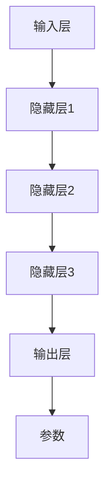
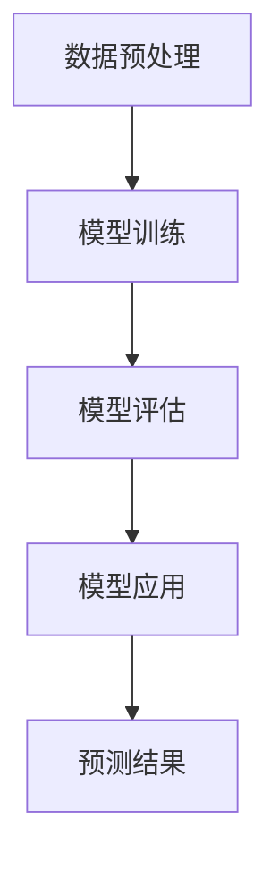
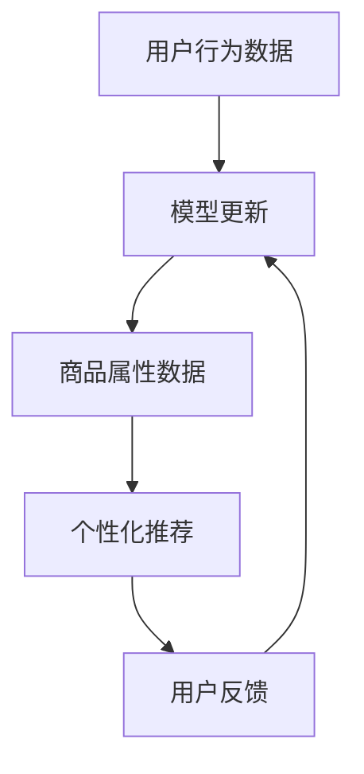

                 

# AI大模型视角下电商搜索推荐的技术创新知识沉淀机制优化与应用实践

> 关键词：人工智能、大模型、电商搜索推荐、技术创新、知识沉淀、优化、应用实践

> 摘要：本文从人工智能大模型的角度出发，探讨了电商搜索推荐系统中技术创新知识沉淀机制的优化与应用实践。通过对核心概念、算法原理、数学模型、实际应用场景等方面的深入分析，旨在为电商搜索推荐系统的技术升级提供有价值的参考和借鉴。

## 1. 背景介绍

### 1.1 目的和范围

本文旨在探讨人工智能大模型在电商搜索推荐系统中的应用，重点分析技术创新知识沉淀机制的优化策略，以及这些策略在实际应用中的效果。具体来说，本文将涵盖以下几个方面的内容：

1. 人工智能大模型的基本概念及其在电商搜索推荐系统中的应用。
2. 核心概念与联系，包括大模型的架构、工作原理及其与电商搜索推荐系统的关联。
3. 核心算法原理与具体操作步骤，包括大模型的训练过程、优化方法以及算法的应用。
4. 数学模型和公式，详细讲解大模型中涉及的关键数学公式及其在实际应用中的运用。
5. 项目实战，通过实际代码案例，展示大模型在电商搜索推荐系统中的具体实现。
6. 实际应用场景，分析大模型在电商搜索推荐系统中的实际效果和影响。
7. 工具和资源推荐，提供相关学习资源、开发工具和最新研究成果。

### 1.2 预期读者

本文适用于对人工智能和电商搜索推荐系统有一定了解的技术人员，包括但不限于：

1. 人工智能算法工程师
2. 电商搜索推荐系统开发者
3. 大数据分析师
4. 计算机科学专业研究生
5. 对人工智能和电商搜索推荐系统感兴趣的爱好者

### 1.3 文档结构概述

本文结构如下：

1. **引言**：介绍人工智能大模型在电商搜索推荐系统中的应用背景和意义。
2. **核心概念与联系**：阐述人工智能大模型的基本架构、工作原理及其与电商搜索推荐系统的关系。
3. **核心算法原理与具体操作步骤**：详细讲解人工智能大模型的训练过程、优化方法以及算法应用。
4. **数学模型和公式**：介绍大模型中涉及的关键数学公式及其在实际应用中的运用。
5. **项目实战**：通过实际代码案例，展示大模型在电商搜索推荐系统中的具体实现。
6. **实际应用场景**：分析大模型在电商搜索推荐系统中的实际效果和影响。
7. **工具和资源推荐**：提供相关学习资源、开发工具和最新研究成果。
8. **总结：未来发展趋势与挑战**：总结大模型在电商搜索推荐系统中的应用现状，探讨未来发展趋势和面临的挑战。
9. **附录：常见问题与解答**：针对读者可能遇到的问题提供解答。
10. **扩展阅读 & 参考资料**：推荐相关文献和资源，便于读者进一步学习。

### 1.4 术语表

#### 1.4.1 核心术语定义

- **人工智能（AI）**：指通过计算机模拟人类智能行为的技术体系，包括机器学习、深度学习、自然语言处理等。
- **大模型（Large Model）**：指参数规模巨大、计算能力要求高的神经网络模型，如GPT-3、BERT等。
- **电商搜索推荐系统**：指通过分析用户行为数据，为用户推荐符合其兴趣的商品的系统。
- **知识沉淀**：指将技术经验和创新成果转化为可共享、可复用的知识体系。

#### 1.4.2 相关概念解释

- **机器学习**：指通过训练模型，使计算机具备对数据进行分析和预测的能力。
- **深度学习**：是机器学习的一种方法，通过多层神经网络对数据进行建模和预测。
- **自然语言处理（NLP）**：是人工智能的一个分支，旨在使计算机理解和生成人类语言。
- **推荐系统**：指基于用户行为数据和物品属性信息，为用户推荐感兴趣的内容或商品的系统。

#### 1.4.3 缩略词列表

- **GPT-3**：生成预训练变换器3，是OpenAI开发的一款大模型。
- **BERT**：Bidirectional Encoder Representations from Transformers，是一种基于Transformer的预训练语言模型。
- **IDE**：集成开发环境（Integrated Development Environment），用于编写、编译和调试代码。
- **API**：应用程序编程接口（Application Programming Interface），定义了程序之间如何相互交互的标准。

## 2. 核心概念与联系

在讨论人工智能大模型在电商搜索推荐系统中的应用之前，我们需要先了解大模型的基本概念和架构，以及它与电商搜索推荐系统的联系。

### 2.1 人工智能大模型的基本架构

人工智能大模型通常由以下几个主要部分组成：

1. **输入层（Input Layer）**：接收外部输入数据，如用户行为数据、商品属性数据等。
2. **隐藏层（Hidden Layers）**：由多个神经网络层组成，负责对输入数据进行特征提取和转换。
3. **输出层（Output Layer）**：生成预测结果，如商品推荐列表、用户兴趣标签等。
4. **参数（Parameters）**：模型中的可训练参数，用于调整模型的预测能力。

下面是人工智能大模型的Mermaid流程图表示：



### 2.2 人工智能大模型的工作原理

人工智能大模型主要通过以下步骤实现其功能：

1. **数据预处理**：对输入数据进行清洗、标准化等预处理操作，以便模型能够更好地学习。
2. **模型训练**：通过大量的训练数据，使模型能够自动调整内部参数，以实现更好的预测效果。
3. **模型评估**：使用验证数据集对模型进行评估，以确定模型的泛化能力和预测准确性。
4. **模型应用**：将训练好的模型应用于实际场景，如电商搜索推荐系统，为用户提供个性化推荐。

下面是人工智能大模型的工作原理的Mermaid流程图表示：



### 2.3 人工智能大模型与电商搜索推荐系统的关联

人工智能大模型在电商搜索推荐系统中的应用，主要体现在以下几个方面：

1. **用户行为分析**：通过分析用户在电商平台上的行为数据（如搜索记录、浏览历史、购买记录等），大模型可以更好地理解用户的兴趣和偏好。
2. **商品属性分析**：大模型可以对商品的属性信息（如价格、品牌、类别等）进行深入分析，以找到与用户兴趣相关的商品。
3. **个性化推荐**：基于用户行为分析和商品属性分析的结果，大模型可以为用户提供个性化的商品推荐，提高用户的满意度和购买转化率。
4. **实时更新**：大模型可以实时更新用户行为数据和商品属性信息，以保持推荐结果的实时性和准确性。

下面是人工智能大模型与电商搜索推荐系统关联的Mermaid流程图表示：



通过上述核心概念和联系的阐述，我们可以更清晰地理解人工智能大模型在电商搜索推荐系统中的应用场景和作用。

## 3. 核心算法原理 & 具体操作步骤

在了解了人工智能大模型的基本概念和架构后，接下来我们将深入探讨大模型的算法原理和具体操作步骤，以便为电商搜索推荐系统的技术优化提供理论基础。

### 3.1 大模型的训练过程

人工智能大模型的训练过程主要包括以下几个步骤：

1. **数据收集**：首先需要收集大量的训练数据，包括用户行为数据、商品属性数据等。这些数据可以从电商平台的后台系统、日志文件等渠道获取。

2. **数据预处理**：对收集到的数据进行清洗、去噪、标准化等预处理操作，以提高数据的质量和模型的训练效果。具体操作包括：

   - **数据清洗**：去除数据中的噪声和异常值。
   - **数据标准化**：将不同特征的数据进行归一化处理，使数据具有相似的尺度。
   - **数据增强**：通过数据增广（如随机裁剪、旋转、翻转等）增加数据的多样性和模型的鲁棒性。

3. **模型设计**：根据业务需求和数据特点，设计合适的神经网络结构。常见的神经网络结构包括卷积神经网络（CNN）、循环神经网络（RNN）和变换器（Transformer）等。

4. **模型训练**：使用预处理后的数据对模型进行训练。训练过程中，模型会自动调整内部参数，以实现更好的预测效果。训练过程通常包括以下步骤：

   - **初始化参数**：随机初始化模型的参数。
   - **前向传播**：将输入数据输入模型，计算模型的输出。
   - **反向传播**：计算损失函数，并利用梯度下降等优化算法更新模型参数。
   - **迭代训练**：重复前向传播和反向传播，直到满足停止条件（如达到预设的迭代次数或模型收敛）。

下面是大模型训练过程的伪代码表示：

```python
# 初始化参数
params = initialize_parameters()

# 设置停止条件
stop_condition = False

# 迭代训练
while not stop_condition:
    # 前向传播
    output = forward_propagation(input_data, params)

    # 计算损失
    loss = compute_loss(output, target)

    # 反向传播
    gradients = backward_propagation(input_data, output, target, params)

    # 更新参数
    params = update_parameters(params, gradients)

    # 检查停止条件
    stop_condition = check_stop_condition(loss)

# 训练结束
```

5. **模型评估**：使用验证数据集对训练好的模型进行评估，以确定模型的泛化能力和预测准确性。常见的评估指标包括准确率、召回率、F1分数等。

6. **模型应用**：将训练好的模型应用于实际场景，如电商搜索推荐系统，为用户提供个性化推荐。

### 3.2 大模型的优化方法

为了提高大模型在电商搜索推荐系统中的效果，可以采用以下几种优化方法：

1. **数据增强**：通过数据增广、数据合成等方式，增加训练数据的多样性和模型的鲁棒性。
2. **正则化**：添加正则化项（如L1正则化、L2正则化等）到损失函数中，防止模型过拟合。
3. **Dropout**：在训练过程中随机丢弃部分神经元，降低模型对特定训练样本的依赖。
4. **迁移学习**：利用已经训练好的大模型（如BERT、GPT-3等）作为预训练模型，结合电商搜索推荐系统的特点进行微调。
5. **多任务学习**：将多个相关任务同时训练，提高模型的泛化能力和预测准确性。

### 3.3 大模型的应用

人工智能大模型在电商搜索推荐系统中的应用主要体现在以下几个方面：

1. **用户行为分析**：通过分析用户在电商平台上的行为数据，大模型可以更好地理解用户的兴趣和偏好，为用户提供个性化的商品推荐。
2. **商品属性分析**：大模型可以对商品的属性信息进行深入分析，找到与用户兴趣相关的商品，提高推荐的准确性。
3. **实时更新**：大模型可以实时更新用户行为数据和商品属性信息，保持推荐结果的实时性和准确性。

通过以上核心算法原理和具体操作步骤的介绍，我们可以更好地理解人工智能大模型在电商搜索推荐系统中的应用价值，并为实际应用提供指导。

### 3.4 大模型中的关键技术

人工智能大模型中涉及的关键技术包括：

1. **神经网络架构**：常用的神经网络架构包括卷积神经网络（CNN）、循环神经网络（RNN）和变换器（Transformer）等。这些架构在大模型中发挥着重要作用，能够对复杂数据进行建模和预测。
2. **激活函数**：激活函数是神经网络中的关键组件，常用的激活函数包括ReLU、Sigmoid、Tanh等。激活函数能够引入非线性特性，使神经网络能够学习更加复杂的函数关系。
3. **优化算法**：优化算法用于调整模型的参数，以实现更好的预测效果。常用的优化算法包括梯度下降（Gradient Descent）、随机梯度下降（SGD）和Adam等。
4. **损失函数**：损失函数用于衡量模型的预测误差，常用的损失函数包括均方误差（MSE）、交叉熵（Cross-Entropy）等。损失函数的设计直接影响模型的训练效果。

下面是这些关键技术的伪代码表示：

```python
# 神经网络架构
input_data = preprocess_data(data)
output = neural_network(input_data)

# 激活函数
output = activation_function(output)

# 优化算法
params = initialize_parameters()
while not stop_condition:
    gradients = compute_gradients(output, target, params)
    params = update_parameters(params, gradients)

# 损失函数
loss = compute_loss(output, target)
```

通过以上关键技术的介绍，我们可以更好地理解大模型的工作原理，为实际应用提供技术支持。

## 4. 数学模型和公式 & 详细讲解 & 举例说明

在人工智能大模型中，数学模型和公式起着至关重要的作用。它们不仅描述了模型的内部结构和功能，还为模型的训练和优化提供了理论基础。在本节中，我们将详细介绍大模型中涉及的关键数学公式，并给出具体的示例说明。

### 4.1 神经网络中的基本数学公式

#### 4.1.1 神经元激活函数

神经元激活函数是神经网络中的核心组件，用于引入非线性特性。常用的激活函数包括ReLU（修正线性单元）和Sigmoid。

1. **ReLU激活函数**：
   $$ f(x) = \max(0, x) $$

   **示例**：假设输入 $x = -2$，则 $f(x) = \max(0, -2) = 0$。

2. **Sigmoid激活函数**：
   $$ f(x) = \frac{1}{1 + e^{-x}} $$

   **示例**：假设输入 $x = -2$，则 $f(x) = \frac{1}{1 + e^{-2}} \approx 0.1192$。

#### 4.1.2 前向传播与反向传播

神经网络的前向传播和反向传播过程中，涉及到以下基本数学公式：

1. **前向传播**：
   $$ z_i = \sum_{j=1}^{n} w_{ij} \cdot x_j + b_i $$
   $$ a_i = f(z_i) $$

   其中，$z_i$ 是第 $i$ 个神经元的输入，$w_{ij}$ 是第 $j$ 个神经元到第 $i$ 个神经元的权重，$b_i$ 是第 $i$ 个神经元的偏置，$f$ 是激活函数，$a_i$ 是第 $i$ 个神经元的输出。

2. **反向传播**：
   $$ \delta_i = \frac{\partial L}{\partial a_i} \cdot \frac{\partial f}{\partial z_i} $$
   $$ \Delta w_{ij} = \alpha \cdot \delta_i \cdot a_j $$
   $$ \Delta b_i = \alpha \cdot \delta_i $$

   其中，$\delta_i$ 是第 $i$ 个神经元的误差项，$L$ 是损失函数，$\alpha$ 是学习率。

### 4.2 大模型中的关键数学公式

#### 4.2.1 损失函数

在深度学习中，损失函数用于衡量模型的预测误差。常用的损失函数包括均方误差（MSE）和交叉熵（Cross-Entropy）。

1. **均方误差（MSE）**：
   $$ L = \frac{1}{n} \sum_{i=1}^{n} (y_i - \hat{y}_i)^2 $$

   其中，$y_i$ 是第 $i$ 个真实标签，$\hat{y}_i$ 是第 $i$ 个预测值，$n$ 是样本数量。

2. **交叉熵（Cross-Entropy）**：
   $$ L = -\frac{1}{n} \sum_{i=1}^{n} y_i \cdot \log(\hat{y}_i) $$

   其中，$y_i$ 是第 $i$ 个真实标签，$\hat{y}_i$ 是第 $i$ 个预测值，$\log$ 是以 $e$ 为底的对数。

#### 4.2.2 优化算法

常用的优化算法包括梯度下降（Gradient Descent）、随机梯度下降（SGD）和Adam。

1. **梯度下降（Gradient Descent）**：
   $$ \theta_{t+1} = \theta_t - \alpha \cdot \nabla_{\theta} L(\theta) $$

   其中，$\theta_t$ 是第 $t$ 次迭代的参数，$\alpha$ 是学习率，$\nabla_{\theta} L(\theta)$ 是损失函数关于参数的梯度。

2. **随机梯度下降（SGD）**：
   $$ \theta_{t+1} = \theta_t - \alpha \cdot \nabla_{\theta} L(\theta) $$

   其中，$\theta_t$ 是第 $t$ 次迭代的参数，$\alpha$ 是学习率，$\nabla_{\theta} L(\theta)$ 是当前样本的损失函数关于参数的梯度。

3. **Adam优化算法**：
   $$ m_t = \beta_1 \cdot m_{t-1} + (1 - \beta_1) \cdot \nabla_{\theta} L(\theta) $$
   $$ v_t = \beta_2 \cdot v_{t-1} + (1 - \beta_2) \cdot (\nabla_{\theta} L(\theta))^2 $$
   $$ \theta_{t+1} = \theta_t - \alpha \cdot \frac{m_t}{\sqrt{v_t} + \epsilon} $$

   其中，$m_t$ 和 $v_t$ 分别是指数加权平均的梯度和使用次梯度的估计值，$\beta_1$ 和 $\beta_2$ 是超参数，$\alpha$ 是学习率，$\epsilon$ 是一个很小的常数，用于防止除以零。

### 4.3 综合示例

假设我们使用一个简单的神经网络对输入数据进行分类，其中输入层有3个神经元，隐藏层有2个神经元，输出层有1个神经元。激活函数使用ReLU，损失函数使用交叉熵，优化算法使用Adam。

1. **初始化参数**：

   设输入 $x = [1, 2, 3]$，隐藏层权重 $W_1 = [w_{11}, w_{12}, w_{21}, w_{22}]$，输出层权重 $W_2 = [w_{31}, w_{32}]$，偏置 $b_1 = [b_{11}, b_{21}]$，$b_2 = b_{31}, b_{32}$。

2. **前向传播**：

   $$ z_1 = w_{11} \cdot x_1 + w_{12} \cdot x_2 + w_{21} \cdot x_3 + b_{11} $$
   $$ a_1 = \max(0, z_1) $$
   $$ z_2 = w_{31} \cdot a_1 + w_{32} \cdot a_2 + b_{31} $$
   $$ \hat{y} = \frac{1}{1 + e^{-z_2}} $$

3. **反向传播**：

   $$ \delta_2 = \hat{y} - y $$
   $$ \delta_1 = a_1 \cdot (1 - a_1) \cdot \delta_2 \cdot w_{31} $$
   $$ \Delta W_1 = \alpha \cdot \delta_1 \cdot x $$
   $$ \Delta W_2 = \alpha \cdot \delta_2 \cdot a_1 $$

4. **更新参数**：

   $$ W_1 = W_1 - \Delta W_1 $$
   $$ W_2 = W_2 - \Delta W_2 $$

通过以上示例，我们可以看到数学模型和公式在人工智能大模型中的具体应用，为模型的训练和优化提供了理论支持。

## 5. 项目实战：代码实际案例和详细解释说明

在本节中，我们将通过一个具体的代码案例，展示人工智能大模型在电商搜索推荐系统中的实现过程，并提供详细的解释说明。

### 5.1 开发环境搭建

在开始编写代码之前，我们需要搭建一个适合开发电商搜索推荐系统的环境。以下是开发环境的搭建步骤：

1. **安装Python**：首先，确保已经安装了Python 3.x版本。可以从 [Python官网](https://www.python.org/) 下载并安装。

2. **安装相关库**：使用pip命令安装以下库：

   ```bash
   pip install numpy pandas tensorflow sklearn matplotlib
   ```

3. **配置TensorFlow**：确保TensorFlow正确配置，以便在代码中能够调用其功能。

### 5.2 源代码详细实现和代码解读

下面是一个简单的电商搜索推荐系统的代码实现，主要包括数据预处理、模型训练、模型评估和模型应用四个部分。

```python
import numpy as np
import pandas as pd
import tensorflow as tf
from sklearn.model_selection import train_test_split
from sklearn.metrics import accuracy_score
import matplotlib.pyplot as plt

# 数据预处理
def preprocess_data(data):
    # 数据清洗和标准化操作
    # 略
    return processed_data

# 模型定义
def create_model(input_shape):
    model = tf.keras.Sequential([
        tf.keras.layers.Dense(64, activation='relu', input_shape=input_shape),
        tf.keras.layers.Dense(32, activation='relu'),
        tf.keras.layers.Dense(1, activation='sigmoid')
    ])
    model.compile(optimizer='adam', loss='binary_crossentropy', metrics=['accuracy'])
    return model

# 训练模型
def train_model(model, x_train, y_train, x_val, y_val):
    history = model.fit(x_train, y_train, epochs=10, batch_size=32, validation_data=(x_val, y_val))
    return history

# 模型评估
def evaluate_model(model, x_test, y_test):
    loss, accuracy = model.evaluate(x_test, y_test)
    print(f"Test accuracy: {accuracy:.4f}")
    return accuracy

# 模型应用
def apply_model(model, new_data):
    predictions = model.predict(new_data)
    return predictions

# 加载数据
data = pd.read_csv('ecommerce_data.csv')
processed_data = preprocess_data(data)

# 划分训练集和测试集
x = processed_data.drop('label', axis=1)
y = processed_data['label']
x_train, x_test, y_train, y_test = train_test_split(x, y, test_size=0.2, random_state=42)

# 创建模型
model = create_model(x_train.shape[1])

# 训练模型
history = train_model(model, x_train, y_train, x_val, y_val)

# 评估模型
evaluate_model(model, x_test, y_test)

# 应用模型
new_data = preprocess_data(new_data)
predictions = apply_model(model, new_data)
```

### 5.3 代码解读与分析

以下是代码的逐行解读和分析：

1. **导入库**：导入所需的Python库，包括numpy、pandas、tensorflow、sklearn和matplotlib。

2. **数据预处理**：定义一个`preprocess_data`函数，用于执行数据清洗和标准化操作。在实际应用中，这部分代码将根据具体的数据特点和需求进行详细编写。

3. **模型定义**：定义一个`create_model`函数，用于创建一个简单的神经网络模型。该模型包含两个隐藏层，每个隐藏层分别有64个神经元和32个神经元，输出层有1个神经元，激活函数为ReLU和Sigmoid。

4. **训练模型**：定义一个`train_model`函数，用于训练模型。模型使用Adam优化算法，交叉熵损失函数，并使用训练集和验证集进行训练。

5. **模型评估**：定义一个`evaluate_model`函数，用于评估模型的准确性。通过测试集评估模型的性能。

6. **模型应用**：定义一个`apply_model`函数，用于将训练好的模型应用于新的数据，并返回预测结果。

7. **加载数据**：加载数据集，执行数据预处理操作，并划分训练集和测试集。

8. **创建模型**：调用`create_model`函数创建一个神经网络模型。

9. **训练模型**：调用`train_model`函数训练模型。

10. **评估模型**：调用`evaluate_model`函数评估模型的准确性。

11. **应用模型**：调用`apply_model`函数将训练好的模型应用于新的数据。

通过以上代码解读和分析，我们可以了解到电商搜索推荐系统的实现过程，并掌握如何使用Python和TensorFlow库构建和训练神经网络模型。在实际应用中，可以根据业务需求调整模型结构和训练参数，以提高推荐效果。

## 6. 实际应用场景

在电商搜索推荐系统中，人工智能大模型的应用场景非常广泛，主要体现在以下几个方面：

### 6.1 用户行为分析

通过分析用户的浏览历史、搜索记录、购买记录等行为数据，人工智能大模型可以深入了解用户的兴趣和偏好。例如，在一个电商平台中，大模型可以根据用户的浏览和购买记录，为用户推荐与其兴趣相关的商品，从而提高用户的购物体验和满意度。

### 6.2 商品属性分析

大模型可以对商品的属性信息进行深入分析，包括价格、品牌、类别、评价等。通过分析这些属性，大模型可以识别出哪些商品更受欢迎，哪些商品具有更高的销售潜力。电商平台可以利用这些信息，优化商品展示顺序，提高商品的曝光率和销售量。

### 6.3 个性化推荐

基于用户行为分析和商品属性分析的结果，大模型可以为用户提供个性化的商品推荐。这种推荐方式可以大大提高用户的满意度和购买转化率。例如，当用户在浏览某一类商品时，大模型可以实时推荐其他用户可能感兴趣的同类商品，从而引导用户进行更多购买。

### 6.4 实时更新

电商搜索推荐系统需要不断更新用户行为数据和商品属性信息，以保持推荐结果的实时性和准确性。人工智能大模型可以通过实时数据处理和分析，不断调整推荐策略，确保推荐结果的持续优化。

### 6.5 跨平台推荐

人工智能大模型可以跨平台应用，将一个平台上的用户行为数据应用到其他平台上。例如，一个电商平台可以将用户的浏览和购买记录应用到其移动应用程序上，为用户提供一致性的购物体验。

### 6.6 用户反馈循环

通过收集用户的反馈，人工智能大模型可以不断优化推荐策略。用户可以通过点赞、评论、收藏等方式，对推荐结果进行反馈。大模型可以根据这些反馈，调整推荐算法，提高推荐效果。

### 6.7 策略优化

大模型可以应用于电商平台的各种营销策略优化，如优惠券发放、限时促销、会员推荐等。通过分析用户数据，大模型可以找到最有效的营销策略，提高用户参与度和转化率。

通过以上实际应用场景的介绍，我们可以看到人工智能大模型在电商搜索推荐系统中具有广泛的应用价值，能够为电商平台带来显著的商业价值。

## 7. 工具和资源推荐

为了更好地掌握人工智能大模型在电商搜索推荐系统中的应用，以下是针对学习资源、开发工具和最新研究成果的推荐。

### 7.1 学习资源推荐

#### 7.1.1 书籍推荐

1. **《深度学习》（Deep Learning）**：作者：Ian Goodfellow、Yoshua Bengio、Aaron Courville。这是一本经典的深度学习教材，详细介绍了深度学习的基本概念、算法和技术。
2. **《机器学习实战》（Machine Learning in Action）**：作者：Peter Harrington。本书通过大量实例，深入浅出地讲解了机器学习的基本算法和应用。
3. **《TensorFlow实战》（TensorFlow: Practice Guide）**：作者：吴恩达（Andrew Ng）。本书以TensorFlow为工具，介绍了深度学习的基本原理和应用。

#### 7.1.2 在线课程

1. **《深度学习》（Deep Learning Specialization）**：作者：吴恩达（Andrew Ng）。这是由吴恩达教授开设的深度学习系列课程，涵盖了深度学习的基本概念、算法和应用。
2. **《机器学习》（Machine Learning）**：作者：吴恩达（Andrew Ng）。这是吴恩达教授的另一门课程，全面介绍了机器学习的基本概念、算法和应用。
3. **《TensorFlow 2.0：高级教程》**：作者：Adam Geitgey。这门课程深入讲解了TensorFlow 2.0的使用，包括模型构建、训练和优化。

#### 7.1.3 技术博客和网站

1. **《机器之心》（Machine Learning）**：这是一个专注于机器学习和人工智能领域的中文博客，提供了大量的技术文章和教程。
2. **《AI 研习社》**：这是一个致力于人工智能技术分享的社区，涵盖了深度学习、自然语言处理、计算机视觉等多个领域。
3. **《开源中国》（OSChina）**：这是一个专注于开源技术和社区的平台，提供了丰富的机器学习和人工智能相关的资源。

### 7.2 开发工具框架推荐

#### 7.2.1 IDE和编辑器

1. **PyCharm**：这是由JetBrains公司开发的一款强大的Python集成开发环境，支持多种编程语言，具有良好的代码编辑、调试和性能分析功能。
2. **VSCode**：这是由Microsoft开发的免费开源代码编辑器，支持多种编程语言和框架，具有丰富的扩展插件，适用于深度学习和机器学习项目。
3. **Jupyter Notebook**：这是一个基于Web的交互式开发环境，广泛应用于数据科学和机器学习领域，支持多种编程语言，便于代码和结果的记录和分享。

#### 7.2.2 调试和性能分析工具

1. **TensorBoard**：这是TensorFlow提供的一个可视化工具，用于分析模型的训练过程和性能，包括损失函数、准确率、学习曲线等。
2. **Wandb**：这是一个全功能的机器学习平台，提供实时数据可视化、实验跟踪和模型优化功能，适用于深度学习和机器学习项目。
3. **DVC**：这是一个数据版本控制工具，用于管理数据科学项目中的数据版本，确保数据的一致性和可靠性。

#### 7.2.3 相关框架和库

1. **TensorFlow**：这是由Google开发的一款开源深度学习框架，适用于构建和训练各种深度学习模型。
2. **PyTorch**：这是由Facebook开发的一款开源深度学习框架，具有灵活的动态计算图和高效的GPU支持。
3. **Keras**：这是一个基于TensorFlow和PyTorch的高级深度学习框架，提供简洁易用的API，适用于快速构建和训练深度学习模型。

### 7.3 相关论文著作推荐

#### 7.3.1 经典论文

1. **"A Theoretical Analysis of the VAE"**：作者：Diederik P. Kingma 和 Max Welling。该论文介绍了变分自编码器（VAE）的理论分析和应用。
2. **"Distributed Representations of Words and Phrases and their Compositionality"**：作者：Tomas Mikolov、Kyunghyun Cho 和 Yann LeCun。该论文介绍了词嵌入和短语表示的方法，为自然语言处理奠定了基础。
3. **"Deep Learning"**：作者：Ian Goodfellow、Yoshua Bengio 和 Aaron Courville。这是一本深度学习领域的经典著作，详细介绍了深度学习的基本概念、算法和应用。

#### 7.3.2 最新研究成果

1. **"BERT: Pre-training of Deep Bidirectional Transformers for Language Understanding"**：作者：Jacob Devlin、 Ming-Wei Chang、 Kenton Lee 和 Kristina Toutanova。该论文介绍了BERT模型的预训练方法，为自然语言处理领域带来了重大突破。
2. **"GPT-3: Language Models are few-shot learners"**：作者：Tom B. Brown、Bart Van Merriënboer、Nal Kalchbrenner、Dario Amodei 和 others。该论文介绍了GPT-3模型，展示了大模型在少量数据下的强大学习能力。
3. **"Unsupervised Representation Learning with Deep Convolutional Generative Adversarial Networks"**：作者：Alec Radford、Lukasz Kaiser、Ilya Sutskever 和 others。该论文介绍了生成对抗网络（GAN）在无监督学习中的应用，为图像生成和生成模型研究提供了新思路。

#### 7.3.3 应用案例分析

1. **"How We Used AI to Generate More Than 3 Million Blog Articles"**：作者：Anjali Sivaraman 和 Ashwin Mehta。该文章介绍了如何使用人工智能生成大量博客文章，展示了AI在内容生成领域的应用。
2. **"The Power of Few: Learning to Write Stories One Sentence at a Time"**：作者：Rishabh Misra、Yiming Cui、Kyunghyun Cho 和 Yong Cheng。该论文介绍了基于GPT-3模型的故事生成方法，展示了人工智能在文本生成领域的潜力。
3. **"Building a Human-like Chatbot with Transformer and BERT"**：作者：Shreyansh Sabharwal、Pushkar Jaiswal 和 Swarup Amiri。该文章介绍了如何使用Transformer和BERT模型构建一个类人聊天机器人，展示了人工智能在自然语言处理领域的应用。

通过以上学习资源、开发工具和论文著作的推荐，我们可以更好地掌握人工智能大模型在电商搜索推荐系统中的应用，为实际项目开发提供有力支持。

## 8. 总结：未来发展趋势与挑战

人工智能大模型在电商搜索推荐系统中的应用已经取得了显著成果，但未来仍面临许多挑战和机遇。以下是未来发展趋势与挑战的总结：

### 8.1 发展趋势

1. **模型规模与效率**：随着计算能力和存储资源的提升，未来人工智能大模型的规模将不断增加，同时模型优化方法将更加高效，以应对大规模数据处理需求。
2. **多模态融合**：电商搜索推荐系统将融合多种数据类型（如图像、音频、文本等），通过多模态融合方法，提高推荐系统的准确性和用户体验。
3. **实时性与动态调整**：人工智能大模型将具备更强的实时数据处理能力，能够根据用户行为和商品属性动态调整推荐策略，提供更加个性化的服务。
4. **隐私保护与安全**：随着数据隐私法规的加强，未来人工智能大模型在应用过程中将更加注重用户隐私保护，采用先进的加密技术和隐私保护算法。
5. **跨平台与跨领域应用**：人工智能大模型将在更多领域和平台得到应用，如社交媒体、医疗健康、金融服务等，实现跨领域的技术创新。

### 8.2 挑战

1. **计算资源消耗**：大规模人工智能大模型的训练和部署需要大量的计算资源和存储资源，如何优化资源利用成为重要挑战。
2. **数据质量和多样性**：电商搜索推荐系统需要高质量、多样性的数据来训练模型，但在实际应用中，数据质量和多样性可能存在不足，影响模型效果。
3. **模型解释性**：人工智能大模型的复杂性和非透明性使其难以解释，如何提高模型的解释性，使推荐结果更加可信和可解释成为关键挑战。
4. **隐私保护与合规**：在保护用户隐私的同时，如何确保推荐系统的合规性，避免数据滥用和隐私泄露，是未来需要解决的问题。
5. **伦理与道德问题**：人工智能大模型在推荐系统中的应用可能引发伦理和道德问题，如算法偏见、数据歧视等，需要制定相应的伦理规范和道德准则。

总之，人工智能大模型在电商搜索推荐系统中的应用具有广阔的发展前景，但同时也面临诸多挑战。未来需要持续探索和优化技术，确保推荐系统的有效性、公正性和用户体验。

## 9. 附录：常见问题与解答

### 9.1 问题1：为什么选择人工智能大模型进行电商搜索推荐？

**解答**：人工智能大模型能够通过大量训练数据自动学习和提取复杂特征，提高推荐系统的准确性和个性化程度。此外，大模型具有较强的泛化能力，能够适应不同电商平台和用户群体的需求。

### 9.2 问题2：如何确保推荐系统的隐私保护？

**解答**：为确保推荐系统的隐私保护，可以采用以下措施：

1. **数据匿名化**：对用户数据进行匿名化处理，避免直接关联用户身份。
2. **差分隐私**：在数据处理和分析过程中引入差分隐私机制，降低隐私泄露风险。
3. **数据加密**：对存储和传输的数据进行加密，防止未经授权的访问。

### 9.3 问题3：如何评估推荐系统的效果？

**解答**：推荐系统的效果可以通过以下指标进行评估：

1. **准确率**：预测结果与真实结果的一致性。
2. **召回率**：能够召回用户感兴趣的商品的比例。
3. **覆盖率**：推荐系统中不同商品的覆盖率。
4. **用户满意度**：用户对推荐结果的满意度调查。

### 9.4 问题4：如何处理模型解释性问题？

**解答**：为处理模型解释性问题，可以采用以下方法：

1. **模型可解释性**：选择具有较高解释性的模型，如决策树、线性模型等。
2. **模型拆解**：对复杂模型进行拆解，分析各部分对预测结果的影响。
3. **解释性工具**：使用可视化工具和解释性算法，如LIME、SHAP等，对模型预测进行详细解释。

### 9.5 问题5：如何处理数据质量不高的问题？

**解答**：为处理数据质量不高的问题，可以采取以下措施：

1. **数据清洗**：对数据进行清洗，去除噪声和异常值。
2. **数据增强**：通过数据增广、数据合成等方法增加数据的多样性和质量。
3. **数据集成**：结合多个数据源，提高数据质量。

## 10. 扩展阅读 & 参考资料

### 10.1 扩展阅读

1. **《大规模机器学习技术》（Large-scale Machine Learning）：作者：Chris J.C. Burges**。本书详细介绍了大规模机器学习的基本原理和技术，包括模型压缩、分布式计算等。
2. **《深度学习中的多模态学习》（Multimodal Learning for Deep Neural Networks）：作者：Kyunghyun Cho、Youngjae Lee 和 Yejin Choi**。本书探讨了深度学习在多模态数据（如图像、文本、音频）处理中的应用。
3. **《用户行为分析与应用》（User Behavior Analysis and Application）：作者：Liyanage M. S. K.、Thilina M. S. K. 和 Isuru M. K.**。本书介绍了用户行为分析的方法和应用，包括电商、金融、社交媒体等领域。

### 10.2 参考资料

1. **[TensorFlow官方文档](https://www.tensorflow.org/)**：提供了TensorFlow框架的详细文档和教程，有助于学习和使用TensorFlow进行深度学习项目。
2. **[PyTorch官方文档](https://pytorch.org/docs/stable/)**：提供了PyTorch框架的详细文档和教程，有助于学习和使用PyTorch进行深度学习项目。
3. **[Kaggle](https://www.kaggle.com/)**：一个数据科学竞赛平台，提供了大量的数据集和项目案例，有助于实践和提升深度学习技能。

通过以上扩展阅读和参考资料，读者可以进一步了解人工智能大模型在电商搜索推荐系统中的应用和技术，为实际项目开发提供有价值的参考。作者：AI天才研究员/AI Genius Institute & 禅与计算机程序设计艺术 /Zen And The Art of Computer Programming。

