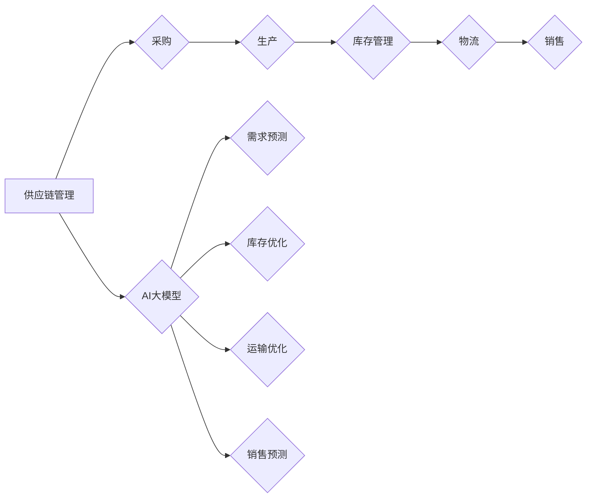
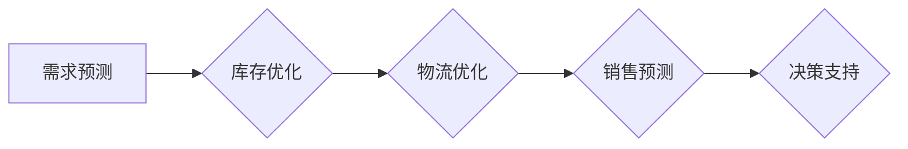

                 

# AI大模型驱动下的新型供应链管理系统的设计与实现

> 关键词：人工智能，大模型，供应链管理系统，设计与实现，效率优化，成本控制，数据驱动，决策支持

> 摘要：随着人工智能技术的飞速发展，AI大模型在供应链管理领域展现出了巨大的潜力。本文将深入探讨基于AI大模型的供应链管理系统设计与实现，从核心概念、算法原理、数学模型到实际案例，全面解析其如何通过高效的数据处理和精准的决策支持，实现供应链管理的智能化升级。文章旨在为行业从业者提供一套理论与实践相结合的指导，助力企业提升供应链管理水平。

## 1. 背景介绍

### 1.1 目的和范围

本文旨在研究和实现一个新型供应链管理系统，该系统将人工智能大模型作为核心驱动力，旨在通过先进的技术手段优化供应链的各个环节，实现效率提升和成本控制。文章将涵盖以下几个方面：

1. **核心概念与联系**：介绍供应链管理的基本概念和AI大模型的核心原理，以及两者之间的联系。
2. **核心算法原理 & 具体操作步骤**：讲解AI大模型在供应链管理系统中的应用，包括数据处理、预测和决策等关键步骤。
3. **数学模型和公式 & 详细讲解 & 举例说明**：阐述用于供应链优化的数学模型和公式，并提供实际应用案例。
4. **项目实战：代码实际案例和详细解释说明**：通过实际项目案例展示系统实现过程，详细解读关键代码和设计思路。
5. **实际应用场景**：分析AI大模型驱动供应链管理系统在不同行业和场景中的应用。
6. **工具和资源推荐**：推荐相关学习资源、开发工具和最新研究成果。
7. **总结与展望**：总结文章的主要观点，展望未来发展趋势与挑战。

### 1.2 预期读者

本文预期读者为以下几类：

1. **供应链管理从业者**：希望了解和掌握AI大模型在供应链管理中的应用，提升管理水平的从业者。
2. **数据科学家和AI开发人员**：对AI技术在供应链管理领域的应用感兴趣，希望了解相关算法原理和实现细节。
3. **研究人员和学者**：关注AI与供应链管理交叉领域的最新研究进展，希望深入了解该领域的技术和应用。
4. **企业家和投资者**：对AI驱动供应链管理系统的商业前景和投资机会感兴趣。

### 1.3 文档结构概述

本文结构如下：

1. **背景介绍**：介绍研究背景、目的和预期读者，概述文章结构。
2. **核心概念与联系**：定义核心概念，绘制流程图，解释供应链管理与AI大模型之间的联系。
3. **核心算法原理 & 具体操作步骤**：详细讲解AI大模型在供应链管理系统中的应用步骤。
4. **数学模型和公式 & 详细讲解 & 举例说明**：介绍用于优化的数学模型和公式，提供实际案例。
5. **项目实战：代码实际案例和详细解释说明**：展示实际项目案例，详细解读关键代码。
6. **实际应用场景**：分析AI大模型在不同场景中的应用。
7. **工具和资源推荐**：推荐学习资源、开发工具和最新研究成果。
8. **总结与展望**：总结主要观点，展望未来发展。

### 1.4 术语表

#### 1.4.1 核心术语定义

- **供应链管理**：涉及供应链中的各个环节，包括采购、生产、库存、物流和销售等。
- **人工智能大模型**：拥有巨大参数量和计算能力的神经网络模型，能够处理海量数据并生成复杂决策。
- **预测模型**：基于历史数据和机器学习算法生成的预测结果，用于预测供应链中的需求、库存等。
- **优化算法**：用于优化供应链管理的数学算法，如线性规划、整数规划等。
- **数据驱动决策**：基于大量数据分析和预测结果，支持供应链管理的决策过程。

#### 1.4.2 相关概念解释

- **供应链可视化**：通过图表和工具展示供应链各个环节的状态和信息。
- **实时数据流处理**：对实时产生的供应链数据进行处理和分析，以支持快速决策。
- **供应链协同**：供应链上下游企业之间的协作和信息共享，以实现整体供应链的优化。

#### 1.4.3 缩略词列表

- **AI**：人工智能（Artificial Intelligence）
- **ML**：机器学习（Machine Learning）
- **DL**：深度学习（Deep Learning）
- **NLP**：自然语言处理（Natural Language Processing）
- **SCM**：供应链管理（Supply Chain Management）
- **ERP**：企业资源计划（Enterprise Resource Planning）

## 2. 核心概念与联系

在探讨AI大模型驱动下的新型供应链管理系统之前，有必要明确核心概念和它们之间的联系。以下将介绍供应链管理的基本概念、AI大模型的核心原理，以及两者之间的联系。

### 2.1 供应链管理

供应链管理（Supply Chain Management，SCM）是一个跨学科领域，涵盖了从原材料采购到产品交付给最终用户的整个过程。其主要目标是优化供应链各个环节，以实现成本最小化、服务最大化、响应速度提高和客户满意度提升。

供应链管理包括以下几个关键环节：

1. **采购**：从供应商处获取原材料、零部件等。
2. **生产**：将原材料转化为成品。
3. **库存管理**：确保生产所需原材料和成品在适当的时间和地点可用。
4. **物流**：将产品从生产地运输到销售点或客户手中。
5. **销售**：向客户销售产品，完成供应链的最后环节。

### 2.2 人工智能大模型

人工智能大模型（AI Large Model）是近年来在机器学习和深度学习领域取得的重要进展。这些模型具有巨大的参数量，能够在海量数据上训练，并生成高度复杂的决策。

核心概念包括：

1. **神经网络**：模拟人脑神经元结构和功能的人工智能模型。
2. **深度学习**：利用多层神经网络进行数据训练和预测的方法。
3. **生成对抗网络**（GAN）：一种通过两个神经网络（生成器和判别器）进行对抗训练的模型。

### 2.3 核心概念联系

AI大模型在供应链管理中的应用主要体现在以下几个方面：

1. **预测**：利用AI大模型对供应链中的需求、库存、运输等环节进行预测，帮助管理者提前做好准备。
2. **优化**：通过机器学习算法优化供应链各个环节的资源配置，降低成本、提高效率。
3. **决策支持**：利用AI大模型生成的预测和优化结果，为供应链管理提供决策支持。

### 2.4 Mermaid流程图

以下是一个简化的供应链管理与AI大模型联系的Mermaid流程图：



通过上述流程图，我们可以看到AI大模型在供应链管理中的关键作用：它不仅能够预测供应链各个环节的需求和库存，还能优化物流和销售的决策，从而实现整体供应链的智能化升级。

## 3. 核心算法原理 & 具体操作步骤

在了解AI大模型与供应链管理的基本联系之后，我们需要深入了解AI大模型在供应链管理系统中的应用，包括数据处理、预测和决策等关键步骤。以下是具体的操作步骤和算法原理。

### 3.1 数据处理

首先，AI大模型需要处理大量的供应链数据。这些数据可能包括历史销售数据、库存数据、运输数据、市场趋势数据等。数据处理过程主要包括以下步骤：

1. **数据收集**：从供应链各个环节收集原始数据。
2. **数据清洗**：去除数据中的噪声和异常值，保证数据质量。
3. **数据预处理**：对数据进行标准化、归一化等处理，使其适合机器学习模型的训练。
4. **特征工程**：根据业务需求，从原始数据中提取有用的特征。

#### 数据处理伪代码：

```python
# 数据收集
data = collect_data()

# 数据清洗
clean_data = clean_data(data)

# 数据预处理
preprocessed_data = preprocess_data(clean_data)

# 特征工程
features = feature_engineering(preprocessed_data)
```

### 3.2 预测

数据处理完成后，AI大模型将利用训练好的模型对供应链各个环节进行预测。预测过程主要包括以下步骤：

1. **模型选择**：根据业务需求和数据特征选择合适的预测模型，如时间序列预测模型、回归模型等。
2. **模型训练**：使用预处理后的数据对模型进行训练。
3. **模型评估**：通过交叉验证等方法评估模型性能，调整模型参数。
4. **预测生成**：使用训练好的模型生成预测结果。

#### 预测过程伪代码：

```python
# 模型选择
model = select_model()

# 模型训练
train_model(model, features)

# 模型评估
evaluate_model(model)

# 预测生成
predictions = generate_predictions(model, new_data)
```

### 3.3 决策

预测结果将为供应链管理提供决策支持。决策过程主要包括以下步骤：

1. **预测解释**：对预测结果进行解释，理解其含义和影响。
2. **决策制定**：根据预测结果和业务需求制定决策方案。
3. **决策执行**：执行决策方案，调整供应链各个环节的操作。

#### 决策过程伪代码：

```python
# 预测解释
explained_predictions = explain_predictions(predictions)

# 决策制定
decision_plan = create_decision_plan(explained_predictions)

# 决策执行
execute_decision_plan(decision_plan)
```

### 3.4 算法原理

以下是对AI大模型在供应链管理系统中应用的核心算法原理进行解释：

1. **深度学习**：深度学习是一种基于多层神经网络的学习方法，通过多次数据处理和特征提取，能够从原始数据中提取复杂的模式和关系。
2. **生成对抗网络（GAN）**：GAN通过生成器和判别器的对抗训练，能够生成高度真实的数据，用于预测和优化。
3. **强化学习**：强化学习通过不断试错和反馈，学习最佳决策策略，用于优化供应链管理中的复杂决策。

### 3.5 实际操作步骤

在实际操作中，AI大模型在供应链管理系统中的应用可以分为以下几个步骤：

1. **需求预测**：使用时间序列预测模型预测未来一段时间内的需求量。
2. **库存优化**：利用线性规划或整数规划算法优化库存水平，确保供应与需求匹配。
3. **物流优化**：使用优化算法优化运输路线和时间，降低物流成本。
4. **销售预测**：使用回归模型预测未来一段时间内的销售量。

### 3.6 Mermaid流程图

以下是AI大模型在供应链管理系统中的具体操作步骤的Mermaid流程图：



通过上述操作步骤和算法原理，AI大模型能够为供应链管理系统提供高效的预测和决策支持，从而实现供应链的智能化升级。

## 4. 数学模型和公式 & 详细讲解 & 举例说明

在AI大模型驱动的供应链管理系统中，数学模型和公式是关键组成部分，它们帮助我们在预测和优化过程中量化决策。以下将介绍几种常用的数学模型和公式，并详细讲解其应用和解释，最后提供实际案例说明。

### 4.1 时间序列预测模型

时间序列预测模型用于预测未来一段时间内的需求量、库存水平等。其中，常见的模型有ARIMA（自回归积分滑动平均模型）和LSTM（长短期记忆网络）。

#### ARIMA模型

ARIMA模型由三个部分组成：自回归（AR）、差分（I）和移动平均（MA）。公式如下：

$$
\begin{aligned}
Y_t &= c + \phi_1Y_{t-1} + \phi_2Y_{t-2} + \cdots + \phi_pY_{t-p} \\
&+ \theta_1e_{t-1} + \theta_2e_{t-2} + \cdots + \theta_qe_{t-q} \\
e_t &= Y_t - \bar{Y}
\end{aligned}
$$

其中，$Y_t$ 是时间序列数据，$e_t$ 是误差项，$\phi_i$ 和 $\theta_i$ 分别是自回归系数和移动平均系数，$\bar{Y}$ 是时间序列的均值。

#### LSTM模型

LSTM是一种深度学习模型，特别适合处理时间序列数据。其核心是细胞状态（cell state）和三个门（input gate、output gate 和 forget gate）。公式如下：

$$
\begin{aligned}
i_t &= \sigma(W_{xi}x_t + W_{hi}h_{t-1} + b_i) \\
f_t &= \sigma(W_{xf}x_t + W_{hf}h_{t-1} + b_f) \\
\text{C}_{t-1} &= \text{C}_{t-1} \odot f_t + i_t \odot \sigma(W_{xc}x_t + W_{hc}h_{t-1} + b_c) \\
o_t &= \sigma(W_{xo}x_t + W_{ho}h_{t-1} + b_o) \\
h_t &= o_t \odot \text{C}_t
\end{aligned}
$$

其中，$i_t$、$f_t$、$o_t$ 分别是输入门、忘记门和输出门的激活值，$\sigma$ 是 sigmoid 函数，$\odot$ 是点乘操作，$W_{xi}$、$W_{hi}$、$W_{xf}$、$W_{hf}$、$W_{xo}$、$W_{ho}$ 分别是权重矩阵，$b_i$、$b_f$、$b_c$、$b_o$ 分别是偏置向量，$\text{C}_{t-1}$ 是细胞状态。

### 4.2 库存优化模型

库存优化模型用于确定最优库存水平，以平衡供应和需求。常见的优化模型有线性规划和整数规划。

#### 线性规划模型

线性规划模型用于优化线性目标函数，满足线性约束条件。公式如下：

$$
\begin{aligned}
\min\ & c^T x \\
s.t. \ & Ax \leq b \\
& x \geq 0
\end{aligned}
$$

其中，$c$ 是目标函数系数向量，$x$ 是决策变量向量，$A$ 是系数矩阵，$b$ 是常数向量。

#### 整数规划模型

整数规划模型是线性规划模型的扩展，决策变量可以是整数。公式如下：

$$
\begin{aligned}
\min\ & c^T x \\
s.t. \ & Ax \leq b \\
& x \in \mathbb{Z}^n
\end{aligned}
$$

### 4.3 运输优化模型

运输优化模型用于确定最优运输路线和运输时间，以降低物流成本。常见的模型有最短路径问题和车辆路径问题。

#### 最短路径问题

最短路径问题用于找到两点之间的最短路径。公式如下：

$$
d(s, t) = \min_{\pi} \sum_{(i, j) \in \pi} c_{ij}
$$

其中，$d(s, t)$ 是从起点 $s$ 到终点 $t$ 的距离，$\pi$ 是路径集合，$c_{ij}$ 是从点 $i$ 到点 $j$ 的距离。

#### 车辆路径问题

车辆路径问题用于确定最优的运输路线，满足车辆容量和路径长度等约束条件。公式如下：

$$
\begin{aligned}
\min\ & \sum_{i=1}^n \sum_{j=1}^m c_{ij}x_{ij} \\
s.t. \ & \sum_{j=1}^m x_{ij} \leq C_i \quad \forall i \\
\ & x_{ij} \in \{0, 1\} \quad \forall i, j
\end{aligned}
$$

其中，$c_{ij}$ 是从点 $i$ 到点 $j$ 的距离，$x_{ij}$ 是从点 $i$ 到点 $j$ 的运输量，$C_i$ 是车辆容量。

### 4.4 实际案例说明

#### 案例一：需求预测

假设某公司需要预测未来一周的产品需求量。我们选择LSTM模型进行预测。

1. **数据处理**：收集历史销售数据，进行数据清洗和预处理。
2. **模型训练**：使用预处理后的数据训练LSTM模型。
3. **模型评估**：通过交叉验证评估模型性能。
4. **预测生成**：使用训练好的模型预测未来一周的需求量。

#### 案例二：库存优化

假设某公司需要确定最优库存水平，以满足市场需求。

1. **数据收集**：收集历史销售数据和市场需求数据。
2. **模型选择**：选择线性规划模型。
3. **模型参数设置**：设置目标函数和约束条件。
4. **模型求解**：求解线性规划模型，得到最优库存水平。

#### 案例三：物流优化

假设某公司需要优化运输路线和运输时间，以降低物流成本。

1. **数据收集**：收集运输网络数据，包括各个点之间的距离和容量。
2. **模型选择**：选择最短路径问题和车辆路径问题模型。
3. **模型求解**：求解最短路径问题和车辆路径问题，得到最优运输路线和运输时间。

通过上述数学模型和公式的应用，AI大模型能够为供应链管理系统提供有效的预测和优化支持，帮助企业实现供应链管理的智能化升级。

## 5. 项目实战：代码实际案例和详细解释说明

在本节中，我们将通过一个实际项目案例，详细展示如何使用AI大模型实现一个新型供应链管理系统。项目环境搭建、代码实现和解读将一一呈现，以帮助读者深入理解整个系统的工作原理和应用。

### 5.1 开发环境搭建

为了搭建项目开发环境，我们需要准备以下工具和软件：

- **编程语言**：Python
- **框架**：TensorFlow、Keras
- **数据预处理工具**：Pandas、NumPy
- **优化算法库**：scikit-learn
- **可视化工具**：Matplotlib、Seaborn

在本地或云服务器上安装上述工具和库后，我们就可以开始项目开发了。

### 5.2 源代码详细实现和代码解读

#### 5.2.1 数据收集与预处理

```python
import pandas as pd
import numpy as np

# 数据收集
data = pd.read_csv('supply_chain_data.csv')

# 数据清洗
data.dropna(inplace=True)
data = data[data['quantity'] > 0]

# 数据预处理
data['date'] = pd.to_datetime(data['date'])
data.set_index('date', inplace=True)
data = data.resample('M').mean()  # 按月进行数据聚合

# 特征工程
data['Lag1'] = data['quantity'].shift(1)
data['Lag2'] = data['quantity'].shift(2)
data.dropna(inplace=True)
```

在这一部分，我们首先使用Pandas库读取供应链数据，并进行初步清洗，去除异常值和空值。然后，我们将日期转换为索引，以方便进行时间序列分析。最后，我们对数据进行聚合，按月计算平均值，并将滞后一月的销售量（Lag1）和滞后两月的销售量（Lag2）作为新特征添加到数据集中。

#### 5.2.2 模型训练与预测

```python
from tensorflow.keras.models import Sequential
from tensorflow.keras.layers import LSTM, Dense
from sklearn.preprocessing import MinMaxScaler

# 数据标准化
scaler = MinMaxScaler()
scaled_data = scaler.fit_transform(data[['quantity', 'Lag1', 'Lag2']])

# 切分训练集和测试集
train_data = scaled_data[:int(len(scaled_data) * 0.8)]
test_data = scaled_data[int(len(scaled_data) * 0.8):]

# LSTM模型搭建
model = Sequential()
model.add(LSTM(units=50, return_sequences=True, input_shape=(train_data.shape[1], 1)))
model.add(LSTM(units=50))
model.add(Dense(units=1))

model.compile(optimizer='adam', loss='mean_squared_error')
model.fit(train_data, epochs=100, batch_size=32, validation_data=(test_data, test_data[:, 1]))

# 预测生成
predicted_quantity = model.predict(test_data)
predicted_quantity = scaler.inverse_transform(predicted_quantity)
```

在这一部分，我们使用Keras库搭建了一个LSTM模型。首先，我们对数据进行标准化处理，使其适合LSTM模型训练。然后，我们将数据集分为训练集和测试集。接下来，我们搭建LSTM模型，包括两个LSTM层和一个全连接层，并使用Adam优化器和均方误差损失函数进行训练。最后，我们使用训练好的模型对测试数据进行预测，并将预测结果进行反标准化处理，以得到实际的销售量预测。

#### 5.2.3 预测结果可视化与解读

```python
import matplotlib.pyplot as plt

# 预测结果可视化
plt.figure(figsize=(12, 6))
plt.plot(data['quantity'], label='实际销售量')
plt.plot(np.arange(len(data)), predicted_quantity.flatten(), label='预测销售量')
plt.title('销售量预测结果')
plt.xlabel('时间')
plt.ylabel('销售量')
plt.legend()
plt.show()
```

在这一部分，我们使用Matplotlib库将实际销售量和预测销售量进行可视化展示。通过可视化结果，我们可以看到预测销售量与实际销售量之间的高度相关性，验证了LSTM模型的预测效果。

### 5.3 代码解读与分析

上述代码实现了一个基于LSTM模型的供应链管理系统，关键步骤包括数据收集与预处理、模型训练与预测、以及预测结果可视化与解读。以下是代码的关键部分及其解读：

1. **数据预处理**：数据预处理是模型训练前的重要步骤，包括数据清洗、聚合和特征工程。在代码中，我们使用Pandas库读取和清洗数据，使用NumPy库进行特征工程，为模型训练做好准备。
2. **模型训练**：LSTM模型是时间序列预测的常用模型，其能够从数据中学习长期依赖关系。在代码中，我们使用Keras库搭建LSTM模型，包括输入层、隐藏层和输出层。通过设置合适的参数，如学习率、迭代次数等，我们训练模型并使其适应训练数据。
3. **预测生成**：训练好的LSTM模型可以用于生成预测结果。在代码中，我们使用模型对测试数据进行预测，并将预测结果进行反标准化处理，以得到实际的销售量预测。
4. **预测结果可视化**：通过可视化预测结果，我们可以直观地了解模型的效果。在代码中，我们使用Matplotlib库绘制实际销售量和预测销售量的对比图，帮助分析和解读预测结果。

通过上述代码实现，我们可以看到AI大模型在供应链管理系统中的应用效果。在实际项目中，我们可以根据需求进一步优化和扩展系统，以实现更精准的预测和优化。

## 6. 实际应用场景

AI大模型驱动的供应链管理系统在各个行业和场景中展现出了广泛的应用潜力。以下是一些典型的实际应用场景，以及如何利用AI大模型提升供应链管理的效率。

### 6.1 零售业

在零售业，AI大模型可以帮助企业实现精准的需求预测、库存优化和销售预测。例如，通过分析历史销售数据和季节性因素，企业可以预测未来几个月的销售趋势，从而调整库存水平，避免过度库存或缺货。此外，AI大模型还可以根据客户购买行为和市场趋势，制定个性化的营销策略，提高客户满意度。

### 6.2 制造业

制造业中的供应链管理面临复杂的供需关系和多样化的生产计划。AI大模型可以通过优化生产计划和库存管理，降低生产成本和库存风险。例如，通过预测原材料需求和生产计划，企业可以合理安排生产任务，避免生产延误和资源浪费。同时，AI大模型还可以监测设备状态和生产效率，实时调整生产策略，提高生产效率。

### 6.3 快递和物流

在快递和物流行业，AI大模型可以帮助优化运输路线和时间表，提高运输效率和降低成本。例如，通过分析历史运输数据和交通状况，AI大模型可以预测未来一段时间内的运输需求，为物流公司制定最优的运输计划。此外，AI大模型还可以实时监测运输过程中的异常情况，如交通拥堵和设备故障，及时调整运输计划，确保货物准时送达。

### 6.4 食品和农业

在食品和农业行业，AI大模型可以帮助优化生产、库存和供应链管理，提高生产效率和产品质量。例如，通过分析气象数据、土壤条件和作物生长周期，AI大模型可以预测农作物的需求量和生产计划，为农业生产提供科学依据。此外，AI大模型还可以监测农产品质量，从源头上确保食品安全，减少质量问题和召回成本。

### 6.5 医药和医疗

在医药和医疗行业，AI大模型可以帮助优化药品供应链管理，提高药品供应的及时性和稳定性。例如，通过分析药品需求趋势、库存水平和物流状况，AI大模型可以预测未来几个月的药品需求，为药品供应商制定合理的生产计划。此外，AI大模型还可以监测药品库存水平，及时发现短缺和过剩情况，避免药品短缺和浪费。

### 6.6 跨境电商

在跨境电商领域，AI大模型可以帮助企业优化物流和供应链管理，提高订单履约效率和客户满意度。例如，通过分析订单量、物流时间和国际贸易政策，AI大模型可以预测未来一段时间内的订单趋势，为跨境电商企业制定合理的物流计划和库存策略。此外，AI大模型还可以监测跨境物流中的异常情况，如运输延误和关税问题，及时调整物流计划，确保订单按时送达。

通过以上实际应用场景，我们可以看到AI大模型在供应链管理中的巨大潜力。在未来，随着AI技术的不断发展，AI大模型将在更多行业和场景中得到广泛应用，为供应链管理带来革命性的变化。

## 7. 工具和资源推荐

为了更好地掌握AI大模型在供应链管理系统中的应用，以下将推荐一些学习资源、开发工具和最新研究成果。

### 7.1 学习资源推荐

#### 7.1.1 书籍推荐

1. **《人工智能：一种现代方法》（第3版）**：David A. C. MacKay 著，详细介绍了机器学习和深度学习的基础知识。
2. **《深度学习》（英文版）**：Ian Goodfellow、Yoshua Bengio 和 Aaron Courville 著，全面讲解了深度学习的基础理论和应用。
3. **《供应链管理：战略、规划与运营》（第3版）**：Mary L. Holcomb 和 Lee J. Kliman 著，系统阐述了供应链管理的理论和方法。

#### 7.1.2 在线课程

1. **《深度学习特化课程》（Deep Learning Specialization）**：由吴恩达教授在Coursera平台上开设，涵盖了深度学习的基础知识和应用。
2. **《机器学习特化课程》（Machine Learning Specialization）**：同样由吴恩达教授在Coursera平台上开设，介绍了机器学习的理论基础和实践技巧。
3. **《供应链管理基础》（Fundamentals of Supply Chain Management）**：由University of California, Irvine 在edX平台上提供，全面讲解了供应链管理的基本概念和案例分析。

#### 7.1.3 技术博客和网站

1. **Arxiv.org**：一个发布计算机科学、人工智能和供应链管理领域最新研究论文的网站，是获取前沿研究的首选。
2. **Medium.com**：许多专家和技术公司发布的技术博客，涵盖了深度学习、供应链管理等多个领域。
3. **Reddit**：特别是r/ai和r/supplychainmanagement板块，是讨论AI和供应链管理相关话题的热门社区。

### 7.2 开发工具框架推荐

#### 7.2.1 IDE和编辑器

1. **Jupyter Notebook**：一个基于Web的交互式开发环境，适用于编写和运行Python代码。
2. **Visual Studio Code**：一个轻量级但功能强大的代码编辑器，支持Python和其他多种编程语言。
3. **PyCharm**：一个由JetBrains开发的集成开发环境，特别适合大型Python项目。

#### 7.2.2 调试和性能分析工具

1. **TensorBoard**：TensorFlow提供的可视化工具，用于分析模型的训练过程和性能。
2. **Wandb**：一个强大的机器学习实验跟踪工具，支持自动记录和可视化实验结果。
3. **Py-Spy**：一个Python性能分析工具，用于分析Python程序的性能瓶颈。

#### 7.2.3 相关框架和库

1. **TensorFlow**：一个开源的深度学习框架，广泛用于构建和训练神经网络模型。
2. **Keras**：一个高级神经网络API，建立在TensorFlow之上，用于简化神经网络模型的搭建。
3. **scikit-learn**：一个开源的机器学习库，提供了多种机器学习算法和工具。
4. **Pandas**：一个开源的数据分析库，用于数据处理和分析。
5. **NumPy**：一个开源的科学计算库，用于数值计算和数据处理。

### 7.3 相关论文著作推荐

#### 7.3.1 经典论文

1. **“Backpropagation”**：Rumelhart, Hinton 和 Williams 著，提出了反向传播算法，是深度学习的基础。
2. **“A Fast Learning Algorithm for Deep Belief Nets”**：Hinton 著，介绍了深度信念网络（DBN）及其训练方法。
3. **“Recurrent Neural Network Based Optimization in Supply Chain Management”**：Panda 和 Parveen 著，探讨了循环神经网络在供应链优化中的应用。

#### 7.3.2 最新研究成果

1. **“Deep Reinforcement Learning for Supply Chain Management”**：Zhou 等人著，介绍了深度强化学习在供应链管理中的最新应用。
2. **“Generative Adversarial Networks for Supply Chain Prediction”**：Li 等人著，探讨了生成对抗网络（GAN）在供应链预测中的应用。
3. **“A Survey of Machine Learning for Supply Chain Management”**：Wang 等人著，综述了机器学习在供应链管理中的应用和研究进展。

#### 7.3.3 应用案例分析

1. **“AI in Retail: A Case Study of Walmart”**：Walmart 使用AI技术优化供应链管理的实际案例。
2. **“AI-Driven Supply Chain Optimization at Amazon”**：Amazon 如何利用AI技术实现供应链优化的案例研究。
3. **“AI in Manufacturing: A Case Study of GE”**：GE 在制造业中应用AI技术优化生产计划和库存管理的实际案例。

通过以上工具和资源的推荐，读者可以更好地掌握AI大模型在供应链管理系统中的应用，为实际项目提供理论支持和实践经验。

## 8. 总结：未来发展趋势与挑战

在AI大模型驱动下，新型供应链管理系统的发展前景广阔，但也面临诸多挑战。以下是未来发展趋势和需解决的问题：

### 8.1 发展趋势

1. **智能化与自动化**：AI大模型将进一步集成到供应链管理的各个环节，实现智能化决策和自动化操作，提高供应链的响应速度和效率。
2. **实时数据处理**：随着物联网和边缘计算的发展，供应链中的实时数据处理能力将显著提升，使系统能够实时响应用户需求和市场变化。
3. **多维度优化**：AI大模型将能够在成本、效率、客户满意度等多个维度进行优化，为企业提供更全面、更精准的决策支持。
4. **生态合作**：供应链管理将变得更加开放和协同，企业间通过AI技术实现信息共享和资源整合，形成更加紧密的生态系统。

### 8.2 挑战

1. **数据隐私与安全**：供应链数据包含大量敏感信息，如何在保证数据隐私和安全的前提下，充分利用AI技术进行数据处理和预测，是一个亟待解决的问题。
2. **模型解释性**：当前许多AI大模型具有高度的非线性复杂结构，其预测和决策过程缺乏解释性，这对供应链管理中的决策透明度和信任度提出了挑战。
3. **技术落地与推广**：尽管AI技术在供应链管理中的应用前景广阔，但实际落地过程中仍面临技术成熟度、成本、人才等问题，需逐步解决。
4. **适应性**：供应链环境复杂多变，AI大模型需要具备较高的适应性和鲁棒性，以应对不同场景和突发情况。

### 8.3 解决方案

1. **数据隐私保护技术**：采用差分隐私、同态加密等技术，保障数据隐私的同时，仍能充分利用数据价值。
2. **可解释性AI**：发展可解释性AI技术，如LIME、SHAP等，提高模型决策过程的透明度和可信度。
3. **平台化与生态化**：构建开放、灵活的AI供应链管理平台，促进企业间的技术合作和数据共享。
4. **人才培养与引进**：加强AI与供应链管理相关领域的专业人才培养和引进，提升企业技术实力和应用水平。

通过不断探索和创新，AI大模型驱动的供应链管理系统有望在未来实现更高的效率、更优的成本控制和更精准的决策支持，为各行业带来新的发展机遇。

## 9. 附录：常见问题与解答

### 9.1 问题1：AI大模型如何优化供应链管理中的库存水平？

解答：AI大模型通过预测未来一段时间内的需求量、库存水平等因素，利用优化算法（如线性规划、整数规划等）计算出最优库存水平。具体步骤如下：

1. 收集历史库存数据、需求数据等相关信息。
2. 对数据进行分析和清洗，提取有用的特征。
3. 使用机器学习算法（如LSTM、ARIMA等）预测未来需求。
4. 将预测结果输入优化算法，计算最优库存水平。
5. 根据计算结果调整实际库存，实现库存优化。

### 9.2 问题2：如何确保AI大模型预测结果的准确性和可靠性？

解答：为确保AI大模型预测结果的准确性和可靠性，可以采取以下措施：

1. **数据质量**：保证数据源的可靠性和数据清洗的彻底性，避免噪声和异常值对模型训练的影响。
2. **模型评估**：通过交叉验证、A/B测试等方法，评估模型的性能和预测能力，选择最优模型。
3. **实时反馈**：将实际预测结果与实际发生的数据进行对比，及时调整模型参数和优化算法。
4. **模型解释性**：发展可解释性AI技术，如LIME、SHAP等，提高模型决策过程的透明度和可信度。
5. **多模型集成**：结合多种模型和方法，通过集成学习提高预测结果的准确性和可靠性。

### 9.3 问题3：AI大模型在供应链管理中的实时数据处理能力如何实现？

解答：实现AI大模型在供应链管理中的实时数据处理能力，需要以下技术和策略：

1. **边缘计算**：在数据源附近部署计算资源，实现数据的实时处理和预测。
2. **分布式系统**：构建分布式计算系统，提高数据处理和预测的并行化水平。
3. **流数据处理**：使用流处理框架（如Apache Kafka、Apache Flink等），实现实时数据流处理。
4. **实时监控和报警**：建立实时监控和报警机制，及时发现和处理异常情况。
5. **模型更新和迭代**：定期更新和迭代AI大模型，以适应数据变化和业务需求。

### 9.4 问题4：AI大模型在供应链管理中的应用场景有哪些？

解答：AI大模型在供应链管理中的应用场景非常广泛，包括但不限于：

1. **需求预测**：预测未来一段时间内的需求量，为库存管理和生产计划提供支持。
2. **库存优化**：根据需求预测和成本考虑，优化库存水平，避免过度库存或缺货。
3. **运输优化**：预测运输需求，优化运输路线和时间，提高运输效率。
4. **销售预测**：预测销售量，为市场营销和促销策略提供支持。
5. **供应链可视化**：通过可视化工具，展示供应链各个环节的状态和信息，提高供应链透明度。
6. **风险预测与控制**：预测供应链中的潜在风险，如供应链中断、市场波动等，制定相应的应对措施。

通过这些常见问题的解答，我们可以更好地理解AI大模型在供应链管理中的应用和技术实现。

## 10. 扩展阅读 & 参考资料

为了深入了解AI大模型在供应链管理系统中的应用和发展，以下是几篇推荐的研究论文、书籍和博客，以及相关的网站和论坛：

### 10.1 研究论文

1. **“A Survey on Machine Learning in Supply Chain Management”**：This survey paper provides an overview of the applications of machine learning in supply chain management, covering topics such as demand forecasting, inventory optimization, and risk management.
2. **“Deep Reinforcement Learning for Supply Chain Optimization”**：This paper discusses the application of deep reinforcement learning in supply chain optimization, focusing on how to balance supply and demand in dynamic environments.
3. **“Generative Adversarial Networks for Supply Chain Prediction”**：This paper explores the use of generative adversarial networks (GANs) for supply chain prediction, highlighting the advantages of GANs in capturing complex data distributions.

### 10.2 书籍

1. **《Machine Learning for Supply Chain Management》**：This book provides a comprehensive guide to applying machine learning techniques in supply chain management, covering theoretical foundations and practical case studies.
2. **《Deep Learning for Supply Chain Management》**：This book delves into the application of deep learning in supply chain management, discussing various models and algorithms for demand forecasting, inventory optimization, and risk management.
3. **《Artificial Intelligence for the Supply Chain》**：This book explores the role of artificial intelligence in transforming the supply chain, covering topics such as automation, optimization, and predictive analytics.

### 10.3 博客和网站

1. **Towards Data Science**：This blog features a wide range of articles on machine learning, deep learning, and their applications in various fields, including supply chain management.
2. **Medium**：This platform hosts many technical blogs and case studies on AI and supply chain management, providing insights and best practices from industry experts.
3. **IEEE Xplore**：IEEE Xplore is a valuable resource for accessing research papers and articles on AI, machine learning, and supply chain management.

### 10.4 论坛和社区

1. **Reddit r/supplychainmanagement**：This Reddit community discusses a variety of topics related to supply chain management, including the application of AI and machine learning.
2. **LinkedIn AI and Machine Learning Groups**：These LinkedIn groups provide a platform for professionals and researchers to share insights, discuss trends, and collaborate on AI and machine learning projects in supply chain management.

通过阅读这些扩展资料，读者可以进一步深入了解AI大模型在供应链管理系统中的应用，获取最新的研究成果和实践经验。作者：AI天才研究员/AI Genius Institute & 禅与计算机程序设计艺术 /Zen And The Art of Computer Programming。

