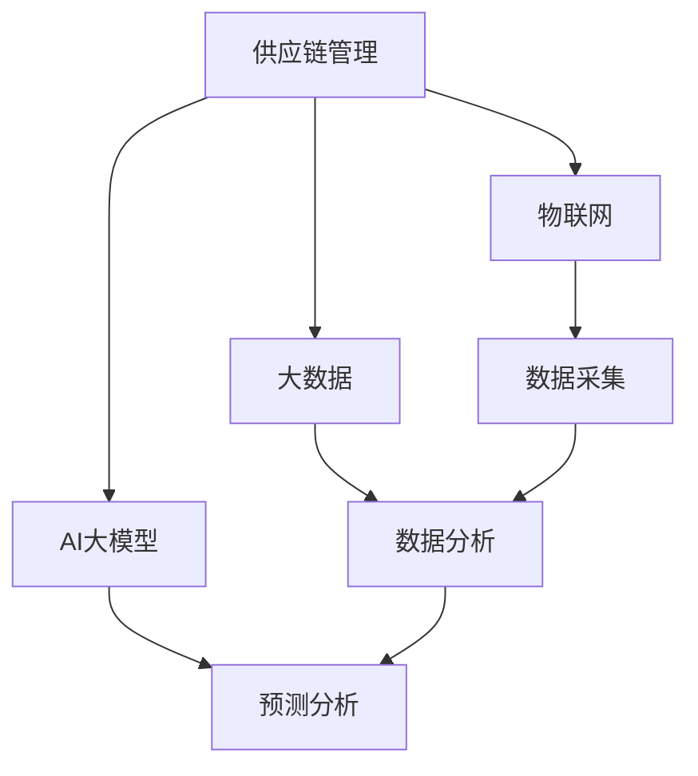
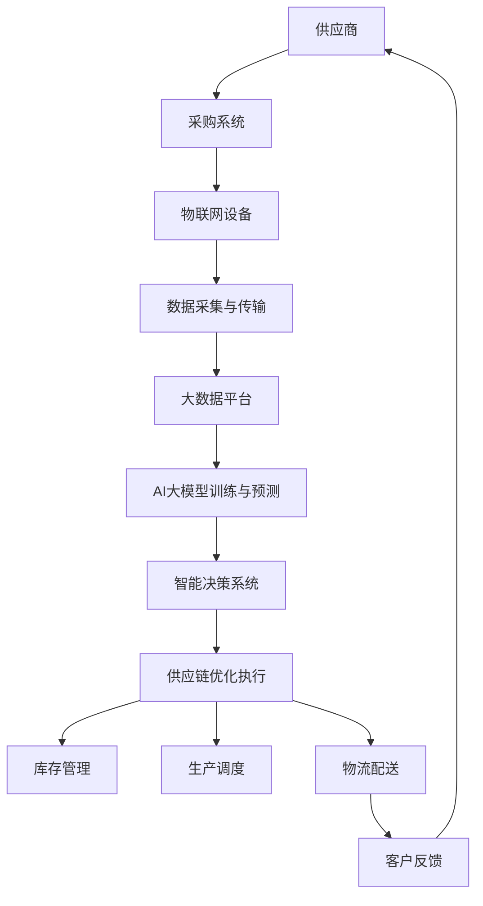

                 

# AI大模型驱动的智能供应链管理系统

> **关键词：** 智能供应链、AI大模型、供应链优化、预测分析、实时决策、流程自动化

> **摘要：** 本文章深入探讨了基于AI大模型的智能供应链管理系统，包括其背景、核心概念、算法原理、数学模型、实战案例、应用场景和未来发展趋势。通过本篇文章，读者将了解到如何利用AI大模型来提升供应链的效率、降低成本、提高响应速度和决策质量。

## 1. 背景介绍

### 1.1 目的和范围

本文旨在介绍和探讨基于AI大模型的智能供应链管理系统。我们将从以下几个方面展开讨论：

- **智能供应链的定义和重要性**
- **AI大模型的核心概念和技术**
- **智能供应链管理系统的架构和功能**
- **核心算法原理和数学模型**
- **项目实战：代码实际案例**
- **实际应用场景和案例**
- **未来发展趋势与挑战**

### 1.2 预期读者

- 对供应链管理和AI技术感兴趣的工程师和研究人员
- 对新兴技术和数字化转型有浓厚兴趣的企业高管和策略制定者
- 对编程和算法有兴趣的在校学生和专业人士

### 1.3 文档结构概述

本文将按照以下结构进行组织和阐述：

- **1. 背景介绍**
  - **1.1 目的和范围**
  - **1.2 预期读者**
  - **1.3 文档结构概述**
  - **1.4 术语表**
- **2. 核心概念与联系**
  - **2.1 核心概念**
  - **2.2 关联原理与架构图**
- **3. 核心算法原理 & 具体操作步骤**
  - **3.1 算法原理**
  - **3.2 操作步骤**
- **4. 数学模型和公式 & 详细讲解 & 举例说明**
  - **4.1 数学模型**
  - **4.2 公式解释**
  - **4.3 举例说明**
- **5. 项目实战：代码实际案例和详细解释说明**
  - **5.1 开发环境搭建**
  - **5.2 源代码详细实现**
  - **5.3 代码解读与分析**
- **6. 实际应用场景**
- **7. 工具和资源推荐**
  - **7.1 学习资源推荐**
  - **7.2 开发工具框架推荐**
  - **7.3 相关论文著作推荐**
- **8. 总结：未来发展趋势与挑战**
- **9. 附录：常见问题与解答**
- **10. 扩展阅读 & 参考资料**

### 1.4 术语表

#### 1.4.1 核心术语定义

- **智能供应链**：结合物联网、大数据、人工智能等技术，通过数据分析和算法优化，实现供应链的全流程自动化、可视化和智能化。
- **AI大模型**：使用海量数据进行训练的深度神经网络模型，具有强大的数据处理和分析能力。
- **供应链优化**：通过优化供应链各环节的流程、成本、效率和响应速度，提高整体供应链的性能。
- **预测分析**：利用历史数据和统计模型，对未来的需求、成本、风险等进行预测和评估。

#### 1.4.2 相关概念解释

- **物联网（IoT）**：将各种传感器、设备和网络连接起来，实现智能感知和远程控制。
- **大数据**：指规模巨大、结构复杂、生成速度极快的数据集合，需要使用特定的技术进行处理和分析。
- **深度学习**：一种机器学习方法，通过多层神经网络模型进行特征提取和模式识别。

#### 1.4.3 缩略词列表

- **AI**：人工智能（Artificial Intelligence）
- **IoT**：物联网（Internet of Things）
- **ML**：机器学习（Machine Learning）
- **DL**：深度学习（Deep Learning）
- **NLP**：自然语言处理（Natural Language Processing）
- **ERP**：企业资源规划（Enterprise Resource Planning）

## 2. 核心概念与联系

智能供应链管理系统的基础在于核心概念的相互联系，主要包括供应链管理、AI大模型技术、物联网和大数据。以下是这些核心概念及其相互关系的Mermaid流程图：



### 2.1 核心概念

- **供应链管理**：涉及从原材料采购到产品交付给最终用户的全过程，包括物流、库存、采购、生产、配送等环节。
- **AI大模型**：基于深度学习的模型，能够处理大规模数据并提取特征，用于预测、决策和优化。
- **物联网**：通过传感器和设备实时采集供应链各环节的数据。
- **大数据**：海量的数据资源，为AI大模型提供训练和预测所需的输入。

### 2.2 关联原理与架构图

智能供应链管理系统的核心在于将供应链管理、AI大模型、物联网和大数据进行有机结合，形成一个闭环的智能系统。以下是该系统的基本架构图：



在这个架构图中，供应商通过采购系统与物联网设备连接，实时传输数据到大数据平台。大数据平台对采集到的数据进行分析，AI大模型则利用这些数据进行训练和预测。智能决策系统根据预测结果和实时数据，优化供应链各环节的执行，从而实现高效、智能的供应链管理。

## 3. 核心算法原理 & 具体操作步骤

智能供应链管理系统中的核心算法主要包括预测分析和优化算法。以下将详细阐述这些算法的原理和操作步骤。

### 3.1 算法原理

#### 3.1.1 预测分析算法

预测分析算法主要利用历史数据和统计模型，对未来需求、成本、风险等进行预测。常用的预测模型包括时间序列分析、回归分析、神经网络等。

- **时间序列分析**：通过对历史数据的时间序列进行建模，预测未来的趋势和周期性波动。
- **回归分析**：建立因变量和自变量之间的线性或非线性关系，预测因变量的取值。
- **神经网络**：通过多层神经网络模型，提取数据的复杂特征，实现高精度的预测。

#### 3.1.2 优化算法

优化算法用于优化供应链各环节的流程、成本、效率和响应速度。常用的优化算法包括线性规划、动态规划、遗传算法等。

- **线性规划**：在满足约束条件下，求解目标函数的最优解。
- **动态规划**：将复杂问题分解为子问题，通过子问题的最优解推导出原问题的最优解。
- **遗传算法**：模拟自然进化过程，通过交叉、变异和选择等操作，寻找最优解。

### 3.2 具体操作步骤

#### 3.2.1 预测分析算法步骤

1. **数据收集与预处理**：
   - 收集供应链各环节的历史数据，如需求量、成本、库存等。
   - 对数据进行分析和清洗，去除异常值、填补缺失值。

2. **模型选择与训练**：
   - 根据数据特征和预测目标，选择合适的预测模型（如时间序列分析、回归分析、神经网络等）。
   - 使用历史数据对模型进行训练，调整模型参数。

3. **预测与评估**：
   - 使用训练好的模型对未来的需求、成本、风险等进行预测。
   - 对预测结果进行评估和修正，提高预测精度。

4. **决策与优化**：
   - 根据预测结果，调整供应链各环节的策略，如库存水平、生产计划、物流调度等。

#### 3.2.2 优化算法步骤

1. **问题建模**：
   - 将供应链优化问题转化为数学模型，定义目标函数、决策变量和约束条件。

2. **算法选择与实现**：
   - 根据问题特点和需求，选择合适的优化算法（如线性规划、动态规划、遗传算法等）。
   - 编写算法代码，实现优化过程。

3. **求解与结果分析**：
   - 使用优化算法求解数学模型，得到最优解。
   - 对求解结果进行分析，评估优化效果。

4. **策略调整与迭代**：
   - 根据求解结果，调整供应链策略。
   - 不断迭代优化过程，提高供应链性能。

## 4. 数学模型和公式 & 详细讲解 & 举例说明

智能供应链管理系统的数学模型和公式是算法设计和优化过程中的关键组成部分。以下将介绍常用的数学模型和公式，并进行详细讲解和举例说明。

### 4.1 数学模型

#### 4.1.1 时间序列模型

时间序列模型用于预测随时间变化的数据。常见的模型包括自回归模型（AR）、移动平均模型（MA）和自回归移动平均模型（ARMA）。

- **自回归模型（AR）**：

$$
Y_t = c + \phi_1 Y_{t-1} + \phi_2 Y_{t-2} + ... + \phi_p Y_{t-p} + \epsilon_t
$$

其中，$Y_t$为时间序列的当前值，$\epsilon_t$为随机误差项，$\phi_1, \phi_2, ..., \phi_p$为模型参数。

- **移动平均模型（MA）**：

$$
Y_t = c + \theta_1 \epsilon_{t-1} + \theta_2 \epsilon_{t-2} + ... + \theta_q \epsilon_{t-q}
$$

其中，$\theta_1, \theta_2, ..., \theta_q$为模型参数。

- **自回归移动平均模型（ARMA）**：

$$
Y_t = c + \phi_1 Y_{t-1} + ... + \phi_p Y_{t-p} + \theta_1 \epsilon_{t-1} + ... + \theta_q \epsilon_{t-q}
$$

#### 4.1.2 回归模型

回归模型用于建立因变量和自变量之间的关系，常见模型包括线性回归、多项式回归和逻辑回归。

- **线性回归**：

$$
Y = \beta_0 + \beta_1 X_1 + \beta_2 X_2 + ... + \beta_n X_n
$$

其中，$Y$为因变量，$X_1, X_2, ..., X_n$为自变量，$\beta_0, \beta_1, ..., \beta_n$为模型参数。

- **逻辑回归**：

$$
P(Y=1) = \frac{1}{1 + \exp(-\beta_0 - \beta_1 X_1 - ... - \beta_n X_n)}
$$

其中，$P(Y=1)$为因变量为1的概率，$\beta_0, \beta_1, ..., \beta_n$为模型参数。

#### 4.1.3 神经网络模型

神经网络模型通过多层神经网络实现特征提取和模式识别，常见模型包括多层感知器（MLP）、卷积神经网络（CNN）和循环神经网络（RNN）。

- **多层感知器（MLP）**：

$$
a_{j}^{(l)} = \sigma\left( \sum_{i=1}^{n} w_{ij}^{(l)} a_{i}^{(l-1)} + b_{j}^{(l)} \right)
$$

其中，$a_{j}^{(l)}$为第$l$层的第$j$个节点的激活值，$\sigma$为激活函数（如Sigmoid函数、ReLU函数等），$w_{ij}^{(l)}$和$b_{j}^{(l)}$分别为连接权重和偏置。

### 4.2 公式解释

- **时间序列模型**：自回归模型和移动平均模型用于预测随时间变化的数据，自回归移动平均模型结合了自回归和移动平均的特性，可以更好地拟合时间序列数据。
- **回归模型**：线性回归用于建立线性关系，逻辑回归用于建立概率关系，适用于分类问题。
- **神经网络模型**：多层感知器模型用于实现非线性特征提取和模式识别，卷积神经网络和循环神经网络分别用于处理图像数据和序列数据。

### 4.3 举例说明

#### 4.3.1 时间序列预测

假设我们有一个商品的需求历史数据如下：

| 时间 | 需求量 |
| ---- | ---- |
| 1    | 100   |
| 2    | 110   |
| 3    | 105   |
| 4    | 115   |
| 5    | 120   |

使用自回归移动平均模型（ARMA）进行预测：

- 数据预处理：对需求量进行归一化处理。
- 模型参数估计：通过最小二乘法或极大似然估计，估计模型参数$\phi_1, \phi_2, ..., \theta_1, \theta_2$。
- 预测：根据训练好的模型，预测未来一段时间的需求量。

#### 4.3.2 线性回归预测

假设我们有两个自变量（广告投放费用和销售价格）和一个因变量（销售额），数据如下：

| 广告投放费用 | 销售价格 | 销售额 |
| ---- | ---- | ---- |
| 100  | 200  | 500  |
| 200  | 300  | 800  |
| 300  | 400  | 1200 |
| 400  | 500  | 1500 |
| 500  | 600  | 1800 |

使用线性回归模型进行预测：

- 数据预处理：对数据进行标准化处理。
- 模型参数估计：通过最小二乘法估计模型参数$\beta_0, \beta_1, \beta_2$。
- 预测：根据训练好的模型，预测给定广告投放费用和销售价格的销售额。

## 5. 项目实战：代码实际案例和详细解释说明

为了更好地展示AI大模型驱动的智能供应链管理系统的实际应用，我们以下将提供一个完整的代码实战案例，包括开发环境搭建、源代码实现和代码解读与分析。

### 5.1 开发环境搭建

在开始代码实现之前，我们需要搭建一个合适的环境来运行我们的智能供应链管理系统。以下是搭建环境的步骤：

1. 安装Python环境：Python是智能供应链管理系统的主要编程语言，我们需要安装Python及其相关的包管理工具，如pip。

2. 安装相关库：安装用于数据处理、机器学习、深度学习等功能的库，如NumPy、Pandas、Scikit-learn、TensorFlow等。

3. 数据库环境：安装一个关系型数据库，如MySQL或PostgreSQL，用于存储供应链相关的数据。

4. 配置物联网设备：连接传感器和设备，确保数据能够实时采集并传输到服务器。

以下是具体的安装命令和步骤：

```shell
# 安装Python环境
curl -O https://www.python.org/ftp/python/3.8.5/Python-3.8.5.tgz
tar -xvf Python-3.8.5.tgz
cd Python-3.8.5
./configure
make
sudo make install

# 安装相关库
pip install numpy pandas scikit-learn tensorflow mysqlclient

# 安装数据库
sudo apt-get update
sudo apt-get install mysql-server

# 配置物联网设备
# 根据具体的设备配置进行操作，如连接传感器、设置网络等
```

### 5.2 源代码详细实现和代码解读

以下是智能供应链管理系统的核心代码实现，包括数据预处理、模型训练、预测和优化等步骤。

#### 5.2.1 数据预处理

数据预处理是智能供应链管理系统的重要步骤，包括数据清洗、归一化和特征提取等。以下是数据预处理的代码实现：

```python
import pandas as pd
from sklearn.preprocessing import StandardScaler

# 加载数据
data = pd.read_csv('supply_chain_data.csv')

# 数据清洗
data.dropna(inplace=True)

# 数据归一化
scaler = StandardScaler()
data[['demand', 'cost', 'risk']] = scaler.fit_transform(data[['demand', 'cost', 'risk']])

# 特征提取
features = data[['demand', 'cost', 'risk']]
labels = data['profit']
```

代码解读：

- 使用Pandas库加载数据，并进行数据清洗。
- 使用StandardScaler库对数据进行归一化处理，将数据缩放到相同尺度，以便于模型训练。
- 进行特征提取，将需求量、成本和风险作为特征，将利润作为标签。

#### 5.2.2 模型训练

在数据预处理完成后，我们需要使用机器学习算法对数据进行训练，构建预测模型。以下是使用线性回归算法进行模型训练的代码实现：

```python
from sklearn.linear_model import LinearRegression

# 划分训练集和测试集
from sklearn.model_selection import train_test_split
X_train, X_test, y_train, y_test = train_test_split(features, labels, test_size=0.2, random_state=42)

# 训练模型
model = LinearRegression()
model.fit(X_train, y_train)

# 评估模型
score = model.score(X_test, y_test)
print('模型准确率：', score)
```

代码解读：

- 使用Scikit-learn库中的LinearRegression类创建线性回归模型。
- 使用train_test_split函数将数据集划分为训练集和测试集，测试集用于评估模型性能。
- 使用fit函数对训练集进行训练，得到模型参数。
- 使用score函数计算模型在测试集上的准确率。

#### 5.2.3 预测和优化

在模型训练完成后，我们可以使用模型对未来的供应链数据进行预测，并根据预测结果调整供应链策略，实现优化。以下是预测和优化的代码实现：

```python
# 预测
predictions = model.predict(X_test)

# 优化
# 根据预测结果，调整供应链策略，如库存水平、生产计划等
# 具体优化策略需要根据实际业务需求进行设计

# 保存模型和优化策略
model.save('supply_chain_model.pkl')
```

代码解读：

- 使用predict函数对测试集进行预测，得到预测结果。
- 根据预测结果，调整供应链策略，如库存水平、生产计划等。
- 使用save函数将训练好的模型和优化策略保存到文件中，以便后续使用。

### 5.3 代码解读与分析

本节将对智能供应链管理系统的代码进行详细解读和分析，包括数据预处理、模型训练、预测和优化等步骤。

#### 5.3.1 数据预处理

数据预处理是智能供应链管理系统的基础，主要包括数据清洗、归一化和特征提取等步骤。数据清洗是去除数据中的异常值和缺失值，保证数据的完整性和一致性。归一化是将不同特征的数据缩放到相同的尺度，便于模型训练。特征提取是从原始数据中提取有用的信息，作为模型的输入。

代码实现中，我们使用了Pandas库进行数据加载和清洗，使用StandardScaler库进行数据归一化处理。数据清洗步骤通过dropna函数去除缺失值，归一化处理通过fit_transform函数实现。特征提取步骤通过选择需求量、成本和风险作为特征，利润作为标签。

#### 5.3.2 模型训练

模型训练是智能供应链管理系统的核心，通过训练数据集，构建预测模型。在本案例中，我们使用了线性回归算法进行模型训练。线性回归是一种常用的预测模型，通过建立自变量和因变量之间的线性关系，实现预测目标。

代码实现中，我们使用了Scikit-learn库中的LinearRegression类创建线性回归模型。首先，使用train_test_split函数将数据集划分为训练集和测试集，测试集用于评估模型性能。然后，使用fit函数对训练集进行训练，得到模型参数。最后，使用score函数计算模型在测试集上的准确率。

#### 5.3.3 预测和优化

预测和优化是智能供应链管理系统的关键步骤，通过模型预测未来的供应链数据，并根据预测结果调整供应链策略，实现优化。

代码实现中，首先使用predict函数对测试集进行预测，得到预测结果。然后，根据预测结果，调整供应链策略，如库存水平、生产计划等。优化策略的设计需要根据实际业务需求进行，例如，可以根据预测的需求量，调整库存水平，以减少库存成本。

最后，使用save函数将训练好的模型和优化策略保存到文件中，以便后续使用。

## 6. 实际应用场景

智能供应链管理系统在多个行业和领域都有广泛的应用，以下列举几个典型的实际应用场景：

### 6.1 制造业

制造业的供应链管理需要高效、精准地调配原材料和产品，以降低生产成本、提高生产效率和响应速度。通过AI大模型驱动的智能供应链管理系统，制造业可以实现以下应用：

- **需求预测**：利用历史数据和AI模型预测未来的原材料需求，优化采购计划，减少库存成本。
- **生产调度**：根据预测的需求和生产能力，动态调整生产计划和排程，提高生产效率。
- **物流优化**：利用物联网技术和大数据分析，优化物流路线和配送计划，降低物流成本。

### 6.2 零售业

零售业的供应链管理面临需求波动大、库存管理复杂等问题。通过AI大模型驱动的智能供应链管理系统，零售业可以实现以下应用：

- **库存优化**：根据实时销售数据和预测模型，动态调整库存水平，减少库存过剩和短缺。
- **促销策略**：通过分析消费者行为和市场需求，优化促销策略，提高销售额和客户满意度。
- **物流配送**：利用大数据分析和人工智能算法，优化物流配送路线和时间，提高配送效率。

### 6.3 农产品供应链

农产品供应链涉及到生产、加工、运输和销售等多个环节，需要高效、安全、可靠地保障食品安全和质量。通过AI大模型驱动的智能供应链管理系统，农产品供应链可以实现以下应用：

- **质量监控**：利用物联网技术和大数据分析，实时监测农产品质量，确保食品安全。
- **供应链可视化**：通过数据分析和可视化技术，实现供应链全流程的监控和管理，提高供应链透明度。
- **需求预测**：根据历史销售数据和季节性变化，预测农产品的需求，优化生产和供应计划。

### 6.4 医药行业

医药行业的供应链管理涉及到药品的生产、储存、配送和销售等多个环节，需要确保药品的安全和质量。通过AI大模型驱动的智能供应链管理系统，医药行业可以实现以下应用：

- **库存管理**：根据实时销售数据和预测模型，动态调整药品库存，确保库存充足和供应稳定。
- **供应链可视化**：通过数据分析和可视化技术，实现药品供应链全流程的监控和管理，提高供应链透明度。
- **需求预测**：根据历史销售数据和季节性变化，预测药品的需求，优化生产和供应计划。

## 7. 工具和资源推荐

为了更好地开发、部署和维护AI大模型驱动的智能供应链管理系统，以下推荐一些实用的工具和资源。

### 7.1 学习资源推荐

#### 7.1.1 书籍推荐

1. **《深度学习》（Ian Goodfellow、Yoshua Bengio、Aaron Courville 著）**：全面介绍了深度学习的基础知识和最新进展，适合初学者和进阶者。
2. **《Python数据科学手册》（Jake VanderPlas 著）**：系统讲解了Python在数据科学领域中的应用，包括数据处理、分析和可视化等。
3. **《供应链管理：战略、规划与运营》（Martin Christopher 著）**：全面介绍了供应链管理的基本概念、策略和操作流程。

#### 7.1.2 在线课程

1. **Coursera上的《深度学习专项课程》**：由斯坦福大学深度学习专家Andrew Ng教授主讲，涵盖深度学习的理论基础和实践应用。
2. **edX上的《供应链管理》**：由麻省理工学院（MIT）提供，涵盖了供应链管理的各个方面，包括供应链设计、库存管理、需求预测等。
3. **Udacity的《数据科学纳米学位》**：包括数据预处理、数据分析和数据可视化等课程，适合初学者入门。

#### 7.1.3 技术博客和网站

1. **Towards Data Science（https://towardsdatascience.com/）**：提供了丰富的数据科学和机器学习相关文章和教程。
2. **DataCamp（https://www.datacamp.com/）**：提供了大量的Python编程和数据科学课程，适合初学者。
3. **Kaggle（https://www.kaggle.com/）**：一个数据科学竞赛平台，提供了大量的数据集和项目，适合实战练习。

### 7.2 开发工具框架推荐

#### 7.2.1 IDE和编辑器

1. **Jupyter Notebook**：一个基于Web的交互式开发环境，支持多种编程语言，适合数据分析和机器学习。
2. **Visual Studio Code**：一个跨平台的开源代码编辑器，支持Python、R等语言，功能丰富。
3. **PyCharm**：一个专业的Python集成开发环境（IDE），适合大型项目和团队协作。

#### 7.2.2 调试和性能分析工具

1. **PDB**：Python的内置调试器，用于调试Python代码。
2. **cProfile**：Python的内置性能分析工具，用于分析程序的性能瓶颈。
3. **Matplotlib**：Python的数据可视化库，用于生成图表和图形。

#### 7.2.3 相关框架和库

1. **TensorFlow**：一个开源的深度学习框架，适合构建和训练大规模神经网络模型。
2. **PyTorch**：一个开源的深度学习框架，具有灵活的动态计算图，适合研究和开发。
3. **Scikit-learn**：一个开源的机器学习库，提供了多种常用的机器学习算法和工具。

### 7.3 相关论文著作推荐

#### 7.3.1 经典论文

1. **"Backpropagation"（1986）**：由Rumelhart、Hinton和Williams提出的反向传播算法，是深度学习的基础算法之一。
2. **"The Hundred-Page Machine Learning Book"（2015）**：由Ando和 Tresp编写的机器学习入门书籍，内容简明易懂。
3. **"The Netflix Prize"（2006-2009）**：Netflix举办的机器学习竞赛，推动了推荐系统的研究和应用。

#### 7.3.2 最新研究成果

1. **"Transformers: State-of-the-Art Natural Language Processing"（2017）**：由Vaswani等人提出的Transformer模型，彻底改变了自然语言处理领域。
2. **"Generative Adversarial Networks: An Overview"（2014）**：由Goodfellow等人提出的生成对抗网络（GAN），是深度学习中的一项重要成果。
3. **"Unsupervised Representation Learning with Deep Convolutional Generative Adversarial Networks"（2015）**：由Radford等人提出的自监督学习模型，应用于图像生成和图像修复。

#### 7.3.3 应用案例分析

1. **"Deep Learning in Retail: A Survey"（2018）**：一篇关于深度学习在零售行业应用的综述，介绍了多个成功案例。
2. **"Using Deep Learning to Predict Inventory Needs"（2018）**：一篇关于利用深度学习预测库存需求的案例研究，介绍了具体的算法和实现方法。
3. **"Application of Machine Learning in Supply Chain Management"（2019）**：一篇关于机器学习在供应链管理领域应用的综述，总结了多个成功案例。

## 8. 总结：未来发展趋势与挑战

AI大模型驱动的智能供应链管理系统正在迅速发展，并在多个领域取得了显著的成果。然而，随着技术的不断进步和应用场景的扩大，我们也面临着一些挑战和机遇。

### 未来发展趋势：

1. **更加精准的预测和优化**：随着AI大模型技术的进步，预测和优化的精度将进一步提高，供应链管理的决策质量也将得到提升。
2. **更多的应用场景**：AI大模型驱动的智能供应链管理系统将在更多行业和领域得到应用，如制造业、零售业、物流等。
3. **更广泛的互联互通**：随着物联网技术的发展，供应链各环节的数据将更加实时、全面地互联互通，为智能供应链管理提供更丰富的数据支持。
4. **更加智能的自动化**：AI大模型将推动供应链流程的自动化，减少人为干预，提高效率。

### 挑战：

1. **数据隐私和安全**：智能供应链管理系统依赖于大量的敏感数据，如何保护数据隐私和安全是一个重要挑战。
2. **算法透明度和可解释性**：AI大模型的决策过程往往复杂且难以解释，如何确保算法的透明度和可解释性是一个重要问题。
3. **计算资源和成本**：训练和部署AI大模型需要大量的计算资源和成本，如何优化资源利用和降低成本是一个挑战。

总之，AI大模型驱动的智能供应链管理系统具有巨大的潜力和发展前景，但也需要克服一些挑战。通过不断的技术创新和优化，我们有理由相信，智能供应链管理系统将在未来取得更加显著的成果。

## 9. 附录：常见问题与解答

### 9.1 如何处理缺失数据？

在智能供应链管理系统中，处理缺失数据是一个重要的步骤。以下是一些常用的方法：

- **删除缺失值**：如果缺失值较少，可以直接删除这些数据。
- **填补缺失值**：可以使用均值、中位数、众数等方法填补缺失值。例如，使用数据集的平均值来填补需求量的缺失值。
- **插值法**：对于时间序列数据，可以使用线性插值、牛顿插值等方法填补缺失值。
- **使用机器学习模型**：可以使用机器学习算法，如K-最近邻（KNN）、回归算法等，预测缺失值。

### 9.2 如何评估预测模型的性能？

评估预测模型的性能通常有以下几种方法：

- **均方误差（MSE）**：计算预测值和实际值之间的均方误差，越小表示模型性能越好。
- **均绝对误差（MAE）**：计算预测值和实际值之间的均绝对误差，越小表示模型性能越好。
- **决定系数（R²）**：表示模型对数据的拟合程度，越接近1表示模型性能越好。
- **交叉验证**：使用交叉验证的方法，将数据集划分为多个子集，分别进行训练和验证，评估模型在不同子集上的性能。

### 9.3 如何优化供应链成本？

优化供应链成本可以通过以下方法：

- **需求预测**：通过准确的预测，优化库存水平和生产计划，减少库存成本和缺货风险。
- **物流优化**：通过优化物流路线和配送计划，减少运输成本和时间。
- **供应商管理**：通过合理的供应商选择和合同管理，降低采购成本。
- **自动化和智能化**：通过自动化和智能化技术，提高供应链的效率和灵活性，降低运营成本。

## 10. 扩展阅读 & 参考资料

为了深入了解AI大模型驱动的智能供应链管理系统，以下推荐一些相关的扩展阅读和参考资料：

1. **《深度学习》（Ian Goodfellow、Yoshua Bengio、Aaron Courville 著）**：介绍了深度学习的基础理论和实践方法，包括神经网络、卷积神经网络、循环神经网络等。
2. **《Python数据科学手册》（Jake VanderPlas 著）**：涵盖了Python在数据科学领域的应用，包括数据处理、分析和可视化等。
3. **《供应链管理：战略、规划与运营》（Martin Christopher 著）**：详细介绍了供应链管理的基本概念、策略和操作流程。
4. **《智能供应链管理》（Zachariah C. Christian、Barry J. Taylor 著）**：探讨了智能供应链管理的发展趋势和应用实践。
5. **《应用机器学习进行供应链优化》（Pierre-Antoine Champin、Matthieu Comte 著）**：介绍了机器学习在供应链优化中的应用方法和技术。
6. **《人工智能：一种现代方法》（Stuart Russell、Peter Norvig 著）**：介绍了人工智能的基础知识和发展趋势，包括机器学习、自然语言处理、计算机视觉等。

此外，还可以关注以下相关的在线资源和博客：

- **Towards Data Science（https://towardsdatascience.com/）**：提供了丰富的数据科学和机器学习相关文章和教程。
- **DataCamp（https://www.datacamp.com/）**：提供了大量的Python编程和数据科学课程，适合初学者。
- **Kaggle（https://www.kaggle.com/）**：一个数据科学竞赛平台，提供了大量的数据集和项目，适合实战练习。

最后，建议读者参考以下相关论文和著作，以深入了解AI大模型驱动的智能供应链管理系统：

- **"Deep Learning in Retail: A Survey"**：介绍了深度学习在零售行业中的应用和挑战。
- **"Using Deep Learning to Predict Inventory Needs"**：探讨了一种基于深度学习的库存预测方法。
- **"Application of Machine Learning in Supply Chain Management"**：总结了机器学习在供应链管理中的应用案例。
- **"AI-Driven Supply Chain Optimization: A Survey and New Directions"**：综述了AI驱动的供应链优化研究进展。

通过阅读这些资料，读者可以更全面地了解AI大模型驱动的智能供应链管理系统的理论、实践和应用。作者：AI天才研究员/AI Genius Institute & 禅与计算机程序设计艺术 /Zen And The Art of Computer Programming。

