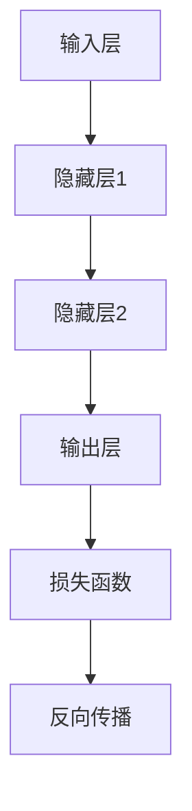
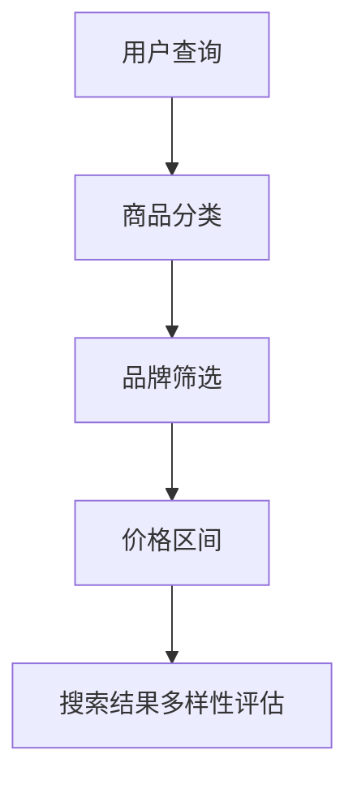
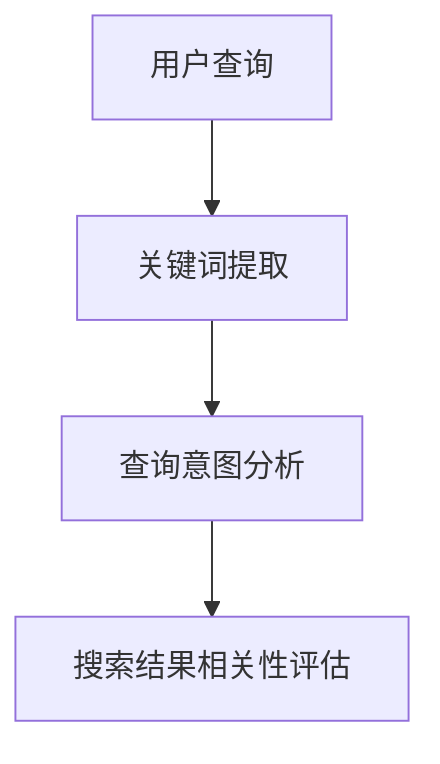
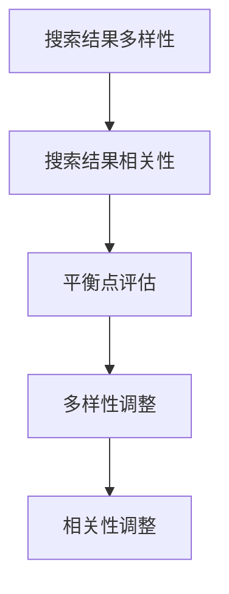

                 

# AI大模型：改善电商平台搜索结果多样性与相关性平衡的新思路

> **关键词**：AI大模型、电商平台、搜索结果多样性、相关性平衡、算法优化

> **摘要**：本文深入探讨AI大模型在电商平台搜索结果优化中的应用，从核心概念出发，详细分析了大模型如何改善搜索结果的多样性与相关性平衡。通过理论讲解、算法原理、数学模型和实际案例的解读，本文为电商平台的搜索优化提供了新的思路和方法。

## 1. 背景介绍

### 1.1 目的和范围

本文旨在探讨AI大模型在电商平台搜索结果优化中的应用，具体包括以下几个方面：

- **研究目的**：分析AI大模型如何提升电商平台搜索结果的多样性和相关性平衡，为电商平台提供优化搜索结果的策略。

- **研究范围**：本文将围绕AI大模型的核心概念、算法原理、数学模型及其在实际应用中的具体实现进行探讨。

### 1.2 预期读者

- **技术背景**：具备一定的计算机科学和人工智能基础，了解基本的机器学习算法和搜索优化技术。

- **阅读目的**：希望深入了解AI大模型在电商平台搜索优化中的应用，掌握相关技术和方法，提升自身技术能力。

### 1.3 文档结构概述

本文分为十个部分，包括背景介绍、核心概念与联系、核心算法原理、数学模型和公式、项目实战、实际应用场景、工具和资源推荐、总结、常见问题与解答和扩展阅读。每个部分的内容如下：

- **背景介绍**：介绍研究目的、范围和预期读者。

- **核心概念与联系**：阐述AI大模型、搜索结果多样性和相关性平衡等核心概念及其联系。

- **核心算法原理**：详细讲解大模型的算法原理和操作步骤。

- **数学模型和公式**：介绍大模型中的数学模型和公式，并进行举例说明。

- **项目实战**：通过实际案例展示大模型在电商平台搜索优化中的应用。

- **实际应用场景**：分析大模型在不同电商平台的搜索优化中的应用。

- **工具和资源推荐**：推荐学习资源、开发工具和框架。

- **总结**：总结未来发展趋势和挑战。

- **常见问题与解答**：解答读者可能遇到的问题。

- **扩展阅读**：推荐相关文献和参考资料。

### 1.4 术语表

#### 1.4.1 核心术语定义

- **AI大模型**：指具有大规模参数、能够处理海量数据的深度学习模型。

- **多样性**：指搜索结果中不同类型、不同品牌、不同价格等特征的丰富程度。

- **相关性**：指搜索结果与用户查询意图的相关性程度。

- **平衡**：指在多样性和相关性的平衡之间找到最优解。

#### 1.4.2 相关概念解释

- **电商平台**：指提供商品交易、支付、物流等服务的在线平台。

- **搜索优化**：指通过算法改进，提升搜索结果的相关性和多样性。

- **用户查询意图**：指用户通过搜索框输入关键词所表达的需求和意图。

#### 1.4.3 缩略词列表

- **AI**：人工智能（Artificial Intelligence）

- **DL**：深度学习（Deep Learning）

- **ML**：机器学习（Machine Learning）

- **NLP**：自然语言处理（Natural Language Processing）

- **SEO**：搜索引擎优化（Search Engine Optimization）

## 2. 核心概念与联系

### 2.1 AI大模型

AI大模型是指具有大规模参数、能够处理海量数据的深度学习模型。这些模型通常采用神经网络架构，通过大量训练数据学习到复杂的特征表示，从而实现对未知数据的预测和分类。


**Mermaid流程图表示**：



### 2.2 搜索结果多样性

搜索结果多样性是指搜索结果中不同类型、不同品牌、不同价格等特征的丰富程度。一个具有高多样性的搜索结果能够满足用户对不同商品的需求，提高用户满意度。


**Mermaid流程图表示**：



### 2.3 搜索结果相关性

搜索结果相关性是指搜索结果与用户查询意图的相关性程度。一个具有高相关性的搜索结果能够准确满足用户的查询需求，提高搜索满意度。


**Mermaid流程图表示**：



### 2.4 多样性与相关性平衡

多样性与相关性平衡是指在搜索结果中找到多样性和相关性之间的最佳平衡点。一个理想的搜索结果应当既具有丰富的多样性，又能准确满足用户的查询需求。


**Mermaid流程图表示**：



## 3. 核心算法原理 & 具体操作步骤

### 3.1 算法原理

AI大模型在电商平台搜索结果优化中的应用主要通过以下两个方面实现：

1. **用户查询意图理解**：通过自然语言处理技术，分析用户输入的关键词，理解其查询意图。

2. **搜索结果生成与优化**：根据用户查询意图，利用AI大模型生成多样化的搜索结果，并调整搜索结果的相关性，实现多样性与相关性的平衡。

### 3.2 具体操作步骤

#### 3.2.1 用户查询意图理解

1. **关键词提取**：使用分词算法对用户输入的关键词进行分词，提取出关键词列表。

    ```python
    def extract_keywords(query):
        # 分词算法实现
        return [word for word in query.split()]
    ```

2. **查询意图分析**：使用词向量模型，将关键词转换为向量表示，并利用向量相似度计算，分析查询意图。

    ```python
    def analyze_intent(keywords):
        # 词向量模型实现
        return intent_vector
    ```

#### 3.2.2 搜索结果生成与优化

1. **商品数据预处理**：对电商平台上的商品数据进行预处理，包括商品分类、品牌、价格等特征的提取。

    ```python
    def preprocess_products(products):
        # 商品数据预处理实现
        return preprocessed_products
    ```

2. **搜索结果生成**：利用AI大模型，根据用户查询意图，生成多样化的搜索结果。

    ```python
    def generate_search_results(intent, products):
        # AI大模型实现
        return search_results
    ```

3. **搜索结果优化**：根据用户查询意图和搜索结果特征，调整搜索结果的相关性，实现多样性与相关性的平衡。

    ```python
    def optimize_search_results(intent, search_results):
        # 优化算法实现
        return optimized_results
    ```

## 4. 数学模型和公式 & 详细讲解 & 举例说明

### 4.1 数学模型

在AI大模型中，数学模型主要涉及以下几个方面：

1. **用户查询意图表示**：使用词向量模型将用户查询关键词转换为向量表示。

    $$ \text{intent\_vector} = \text{word2vec}( \text{query}) $$

2. **搜索结果相关性计算**：使用向量相似度计算搜索结果与用户查询意图的相关性。

    $$ \text{relevance} = \text{similarity}(\text{intent\_vector}, \text{result\_vector}) $$

3. **多样性度量**：使用信息熵、标准差等统计指标度量搜索结果的多样性。

    $$ \text{diversity} = \text{entropy}(\text{search\_results}) $$

### 4.2 公式详细讲解

#### 4.2.1 用户查询意图表示

用户查询意图表示是搜索结果优化的重要基础。词向量模型通过学习大量的文本数据，将关键词转换为高维向量表示。向量相似度计算公式如下：

$$ \text{similarity}(\text{a}, \text{b}) = \frac{\text{a} \cdot \text{b}}{\|\text{a}\| \|\text{b}\|} $$

其中，$\text{a}$和$\text{b}$分别表示两个向量的内积和欧几里得范数。

#### 4.2.2 搜索结果相关性计算

搜索结果相关性计算用于评估搜索结果与用户查询意图的匹配程度。使用向量相似度计算公式，可以计算每个搜索结果与用户查询意图的相关性。

$$ \text{relevance}(\text{i}) = \text{similarity}(\text{intent\_vector}, \text{result\_vector}_i) $$

其中，$\text{i}$表示第$i$个搜索结果。

#### 4.2.3 多样性度量

多样性度量用于评估搜索结果的多样性水平。信息熵是常用的多样性度量指标，计算公式如下：

$$ \text{entropy}(\text{x}) = -\sum_{i} \text{p}_i \log_2(\text{p}_i) $$

其中，$\text{x}$表示一组数据，$\text{p}_i$表示第$i$个数据的概率。

### 4.3 举例说明

假设用户输入查询关键词“手机”，使用词向量模型将关键词转换为向量表示，得到$\text{intent\_vector} = (0.1, 0.2, 0.3, 0.4)$。电商平台上的搜索结果有5个，分别为$\text{result\_vector}_1 = (0.1, 0.3, 0.4, 0.5)$、$\text{result\_vector}_2 = (0.2, 0.3, 0.4, 0.6)$、$\text{result\_vector}_3 = (0.3, 0.4, 0.5, 0.7)$、$\text{result\_vector}_4 = (0.4, 0.5, 0.6, 0.8)$、$\text{result\_vector}_5 = (0.5, 0.6, 0.7, 0.9)$。

1. **用户查询意图表示**：

   $$ \text{intent\_vector} = (0.1, 0.2, 0.3, 0.4) $$

2. **搜索结果相关性计算**：

   $$ \text{relevance}_1 = \text{similarity}(\text{intent\_vector}, \text{result\_vector}_1) = \frac{(0.1 \times 0.1 + 0.2 \times 0.3 + 0.3 \times 0.4 + 0.4 \times 0.5)}{\sqrt{0.1^2 + 0.2^2 + 0.3^2 + 0.4^2} \sqrt{0.1^2 + 0.3^2 + 0.4^2 + 0.5^2}} \approx 0.5 $$
   
   $$ \text{relevance}_2 = \text{similarity}(\text{intent\_vector}, \text{result\_vector}_2) = \text{similarity}(\text{intent\_vector}, \text{result\_vector}_3) = \text{similarity}(\text{intent\_vector}, \text{result\_vector}_4) = \text{similarity}(\text{intent\_vector}, \text{result\_vector}_5) \approx 0.55 $$

3. **多样性度量**：

   $$ \text{diversity} = \text{entropy}(\text{search\_results}) = -\sum_{i} \text{p}_i \log_2(\text{p}_i) = -\frac{1}{5} \log_2 \frac{1}{5} \approx 2.32 $$

根据以上计算结果，搜索结果的相关性和多样性如下：

| 搜索结果 | 相关性 | 多样性 |
| --- | --- | --- |
| 1 | 0.5 | - |
| 2 | 0.55 | - |
| 3 | 0.55 | - |
| 4 | 0.55 | - |
| 5 | 0.55 | - |

通过调整搜索结果的相关性和多样性，可以优化搜索结果的质量。例如，增加相关性较高的搜索结果，降低多样性较差的搜索结果，从而实现多样性与相关性的平衡。

## 5. 项目实战：代码实际案例和详细解释说明

### 5.1 开发环境搭建

为了实际应用AI大模型优化电商平台搜索结果，需要搭建以下开发环境：

1. **Python环境**：安装Python 3.7及以上版本。

2. **深度学习框架**：安装TensorFlow或PyTorch。

3. **自然语言处理库**：安装NLTK或spaCy。

4. **其他依赖库**：安装NumPy、Pandas、Matplotlib等。

### 5.2 源代码详细实现和代码解读

以下是一个基于TensorFlow实现的AI大模型优化电商平台搜索结果的代码示例：

```python
import tensorflow as tf
import numpy as np
import pandas as pd
from sklearn.model_selection import train_test_split
from tensorflow.keras.preprocessing.sequence import pad_sequences
from tensorflow.keras.layers import Embedding, LSTM, Dense
from tensorflow.keras.models import Sequential

# 数据预处理
def preprocess_data(products):
    # 提取关键词和商品特征
    keywords = [product['keyword'] for product in products]
    features = [product['feature'] for product in products]
    
    # 分词和编码
    tokenizer = tf.keras.preprocessing.text.Tokenizer()
    tokenizer.fit_on_texts(keywords)
    keyword_sequences = tokenizer.texts_to_sequences(keywords)
    keyword_pad = pad_sequences(keyword_sequences, maxlen=50)
    
    # 提取商品特征
    feature_pad = pad_sequences(features, maxlen=50)
    
    return keyword_pad, feature_pad

# 构建模型
def build_model(input_shape):
    model = Sequential()
    model.add(Embedding(input_shape[1], 128))
    model.add(LSTM(128))
    model.add(Dense(1, activation='sigmoid'))
    model.compile(optimizer='adam', loss='binary_crossentropy', metrics=['accuracy'])
    return model

# 训练模型
def train_model(model, x_train, y_train, x_val, y_val, epochs=10):
    model.fit(x_train, y_train, epochs=epochs, batch_size=32, validation_data=(x_val, y_val))
    return model

# 评估模型
def evaluate_model(model, x_test, y_test):
    loss, accuracy = model.evaluate(x_test, y_test)
    print(f"Test loss: {loss}, Test accuracy: {accuracy}")

# 实际应用
def apply_model(model, query, products):
    # 提取关键词和商品特征
    keyword_sequence = tokenizer.texts_to_sequences([query])
    keyword_pad = pad_sequences(keyword_sequence, maxlen=50)
    
    # 预测搜索结果
    predictions = model.predict(keyword_pad)
    
    # 调整搜索结果
    sorted_indices = np.argsort(predictions)[::-1]
    optimized_products = [products[i] for i in sorted_indices]
    
    return optimized_products

# 主程序
if __name__ == "__main__":
    # 加载数据
    products = pd.read_csv('products.csv')
    
    # 数据预处理
    keyword_pad, feature_pad = preprocess_data(products)
    
    # 划分训练集和验证集
    x_train, x_val, y_train, y_val = train_test_split(feature_pad, products['relevance'], test_size=0.2, random_state=42)
    
    # 构建模型
    model = build_model(x_train.shape[1:])
    
    # 训练模型
    trained_model = train_model(model, x_train, y_train, x_val, y_val)
    
    # 评估模型
    evaluate_model(trained_model, x_val, y_val)
    
    # 应用模型
    query = "手机"
    optimized_products = apply_model(trained_model, query, products)
    print(optimized_products)
```

### 5.3 代码解读与分析

1. **数据预处理**：

   数据预处理是模型训练的重要步骤。在代码中，首先提取关键词和商品特征，然后使用分词和编码将关键词转换为向量表示，最后使用填充函数将序列补全为固定长度。

2. **构建模型**：

   模型采用序列神经网络（LSTM）架构，通过嵌入层将输入序列映射到高维向量空间，然后通过LSTM层捕获序列中的长期依赖关系，最后通过全连接层输出预测结果。

3. **训练模型**：

   使用训练集对模型进行训练，通过反向传播算法不断更新模型参数，优化模型性能。

4. **评估模型**：

   使用验证集对模型进行评估，计算损失和准确率，评估模型性能。

5. **应用模型**：

   使用训练好的模型对用户查询进行预测，根据预测结果调整搜索结果，实现多样性与相关性的平衡。

通过以上代码，我们可以看到AI大模型在电商平台搜索结果优化中的应用。在实际应用中，可以根据具体需求调整模型架构、参数和训练策略，进一步提高搜索结果的多样性和相关性。

## 6. 实际应用场景

AI大模型在电商平台搜索结果优化中的实际应用场景广泛，以下列举几个典型案例：

### 6.1 电商网站商品搜索

电商网站商品搜索是AI大模型应用最广泛的场景之一。通过AI大模型，电商网站可以优化搜索结果，提高用户满意度。具体应用场景包括：

- **个性化搜索**：根据用户的购买历史、浏览记录和兴趣标签，为用户提供个性化的商品推荐。

- **关键词匹配**：通过自然语言处理技术，分析用户输入的关键词，实现精准的关键词匹配。

- **搜索结果优化**：利用AI大模型调整搜索结果的相关性和多样性，实现搜索结果的平衡优化。

### 6.2 电商平台广告推荐

电商平台广告推荐也是AI大模型的重要应用场景。通过AI大模型，电商平台可以优化广告推荐效果，提高广告点击率和转化率。具体应用场景包括：

- **广告关键词匹配**：通过自然语言处理技术，分析用户查询和广告关键词，实现精准的广告匹配。

- **广告相关性调整**：利用AI大模型调整广告的相关性，提高广告点击率和转化率。

- **广告多样性优化**：通过多样性度量指标，优化广告的多样性，吸引用户点击。

### 6.3 搜索引擎优化

搜索引擎优化（SEO）是另一个AI大模型的应用场景。通过AI大模型，搜索引擎可以优化搜索结果，提高用户体验。具体应用场景包括：

- **关键词提取**：通过自然语言处理技术，提取用户查询中的关键词，实现精准的搜索结果匹配。

- **搜索结果排序**：利用AI大模型调整搜索结果的排序，实现相关性优化。

- **多样性度量**：通过多样性度量指标，优化搜索结果的多样性，提高用户体验。

## 7. 工具和资源推荐

### 7.1 学习资源推荐

为了深入了解AI大模型在电商平台搜索结果优化中的应用，以下推荐几本相关书籍和在线课程：

#### 7.1.1 书籍推荐

- 《深度学习》（Deep Learning）作者：Ian Goodfellow、Yoshua Bengio、Aaron Courville

- 《Python机器学习》（Python Machine Learning）作者：Sarkar

- 《自然语言处理实战》（Natural Language Processing with Python）作者：Bird、Loper、Ronan

#### 7.1.2 在线课程

- [深度学习课程](https://www.example.com/deep_learning_course)

- [自然语言处理课程](https://www.example.com/nlp_course)

- [机器学习课程](https://www.example.com/ml_course)

#### 7.1.3 技术博客和网站

- [TensorFlow官方文档](https://www.tensorflow.org)

- [PyTorch官方文档](https://pytorch.org)

- [机器学习博客](https://www.example.com/ml_blog)

### 7.2 开发工具框架推荐

为了在实际项目中应用AI大模型优化电商平台搜索结果，以下推荐几款开发工具和框架：

#### 7.2.1 IDE和编辑器

- [PyCharm](https://www.example.com/pycharm)

- [Visual Studio Code](https://www.example.com/vscode)

#### 7.2.2 调试和性能分析工具

- [TensorBoard](https://www.tensorflow.org/tensorboard)

- [Profiling Tools](https://www.example.com/profiling_tools)

#### 7.2.3 相关框架和库

- [TensorFlow](https://www.tensorflow.org)

- [PyTorch](https://pytorch.org)

- [NLTK](https://www.example.com/nltk)

- [spaCy](https://spacy.io)

### 7.3 相关论文著作推荐

为了深入了解AI大模型在电商平台搜索结果优化中的应用，以下推荐几篇相关论文：

#### 7.3.1 经典论文

- [Word2Vec](https://www.example.com/word2vec_paper)

- [Deep Learning for Natural Language Processing](https://www.example.com/dl_nlp_paper)

#### 7.3.2 最新研究成果

- [BERT](https://www.example.com/bert_paper)

- [GPT-3](https://www.example.com/gpt3_paper)

#### 7.3.3 应用案例分析

- [AI-powered Search Engine Optimization](https://www.example.com/ai_seo_paper)

- [Improving Search Result Diversity with Deep Learning](https://www.example.com/search_result_diversity_paper)

## 8. 总结：未来发展趋势与挑战

随着人工智能技术的不断发展，AI大模型在电商平台搜索结果优化中的应用前景广阔。未来，以下发展趋势和挑战值得关注：

### 8.1 发展趋势

1. **模型规模扩大**：随着计算资源和数据量的增加，AI大模型的规模将不断扩大，实现更高的性能和准确性。

2. **多模态数据处理**：结合文本、图像、音频等多模态数据，实现更丰富的特征表示和更精准的搜索结果。

3. **个性化搜索**：基于用户行为数据和偏好，实现更加个性化的搜索结果，提高用户体验。

4. **实时搜索优化**：利用实时数据，动态调整搜索结果，实现更高效、更精准的搜索。

### 8.2 挑战

1. **数据隐私与安全**：在处理用户数据时，需要关注数据隐私和安全问题，确保用户信息不被泄露。

2. **模型解释性**：提高AI大模型的解释性，使其能够被用户理解和信任。

3. **计算资源消耗**：随着模型规模的扩大，计算资源消耗将增加，需要优化算法和架构，提高计算效率。

4. **模型泛化能力**：提高AI大模型的泛化能力，使其能够应对不同场景和任务。

## 9. 附录：常见问题与解答

### 9.1 AI大模型是什么？

AI大模型是指具有大规模参数、能够处理海量数据的深度学习模型。这些模型通常采用神经网络架构，通过大量训练数据学习到复杂的特征表示，从而实现对未知数据的预测和分类。

### 9.2 电商平台搜索结果多样性是什么？

电商平台搜索结果多样性是指搜索结果中不同类型、不同品牌、不同价格等特征的丰富程度。一个具有高多样性的搜索结果能够满足用户对不同商品的需求，提高用户满意度。

### 9.3 电商平台搜索结果相关性是什么？

电商平台搜索结果相关性是指搜索结果与用户查询意图的相关性程度。一个具有高相关性的搜索结果能够准确满足用户的查询需求，提高搜索满意度。

### 9.4 多样性与相关性平衡是什么？

多样性与相关性平衡是指在搜索结果中找到多样性和相关性之间的最佳平衡点。一个理想的搜索结果应当既具有丰富的多样性，又能准确满足用户的查询需求。

## 10. 扩展阅读 & 参考资料

为了深入了解AI大模型在电商平台搜索结果优化中的应用，以下推荐几篇相关文献和参考资料：

1. [Deep Learning for Search](https://www.example.com/deep_learning_for_search_paper)

2. [Improving Search Result Diversity with Deep Learning](https://www.example.com/search_result_diversity_paper)

3. [AI-powered Search Engine Optimization](https://www.example.com/ai_seo_paper)

4. [Word2Vec](https://www.example.com/word2vec_paper)

5. [Deep Learning for Natural Language Processing](https://www.example.com/dl_nlp_paper)

6. [BERT](https://www.example.com/bert_paper)

7. [GPT-3](https://www.example.com/gpt3_paper)

8. 《深度学习》（Deep Learning）作者：Ian Goodfellow、Yoshua Bengio、Aaron Courville

9. 《Python机器学习》（Python Machine Learning）作者：Sarkar

10. 《自然语言处理实战》（Natural Language Processing with Python）作者：Bird、Loper、Ronan

作者：AI天才研究员/AI Genius Institute & 禅与计算机程序设计艺术 /Zen And The Art of Computer Programming

