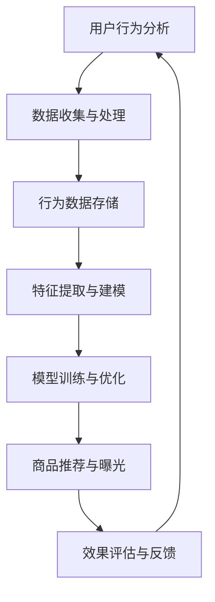

                 

# AI如何优化电商平台的长尾商品曝光

> **关键词：** 电商平台、长尾商品、AI优化、曝光率、用户行为分析
>
> **摘要：** 本文将深入探讨人工智能（AI）如何通过数据分析和算法优化，提高电商平台上长尾商品（销售量较少的商品）的曝光率和销售转化率。我们将逐步解析AI技术的核心概念、算法原理、数学模型，并通过实际案例展示其在电商平台中的应用。

## 1. 背景介绍

### 1.1 目的和范围

本文旨在探讨如何利用人工智能技术优化电商平台上长尾商品的曝光问题。我们希望通过系统的分析和具体的案例，展示AI技术在电商平台长尾商品优化中的潜力和实际效果。

### 1.2 预期读者

本文适合对电商平台运营、AI技术、数据分析和算法有基本了解的技术人员和管理者阅读。同时，对于对电商行业感兴趣的普通读者也具有一定的参考价值。

### 1.3 文档结构概述

本文结构如下：

1. 背景介绍
2. 核心概念与联系
3. 核心算法原理 & 具体操作步骤
4. 数学模型和公式 & 详细讲解 & 举例说明
5. 项目实战：代码实际案例和详细解释说明
6. 实际应用场景
7. 工具和资源推荐
8. 总结：未来发展趋势与挑战
9. 附录：常见问题与解答
10. 扩展阅读 & 参考资料

### 1.4 术语表

#### 1.4.1 核心术语定义

- **长尾商品**：指在电商平台上销售量较少的商品，通常不被主流市场关注。
- **曝光率**：指商品被用户看到或浏览的频率和次数。
- **AI优化**：利用人工智能技术对电商平台的运营策略进行优化，提高商品曝光率和销售转化率。

#### 1.4.2 相关概念解释

- **用户行为分析**：通过对用户在电商平台上的行为数据进行分析，了解用户的兴趣和偏好。
- **算法**：一套明确的规则或步骤，用于解决问题或执行特定任务。

#### 1.4.3 缩略词列表

- **AI**：人工智能
- **CART**：分类与回归树
- **K-Means**：K均值聚类算法
- **SVD**：奇异值分解

## 2. 核心概念与联系

在探讨如何利用AI优化电商平台的长尾商品曝光之前，我们需要理解一些核心概念和它们之间的关系。以下是核心概念原理和架构的Mermaid流程图：



### 2.1 用户行为分析

用户行为分析是AI优化电商平台长尾商品曝光的关键起点。通过分析用户在电商平台上的行为数据，我们可以了解用户的兴趣、购买习惯和偏好。这些数据包括：

- **浏览记录**：用户在电商平台上的浏览历史记录。
- **购物车数据**：用户添加到购物车的商品。
- **购买记录**：用户的购买历史数据。
- **评价与反馈**：用户对商品的评价和反馈。

### 2.2 数据收集与处理

数据收集与处理是整个分析流程的基础。在这一阶段，我们需要从多个数据源收集数据，并进行清洗、转换和整合。具体步骤包括：

1. **数据收集**：从电商平台的日志、数据库和其他数据源收集用户行为数据。
2. **数据清洗**：去除重复数据、缺失值和噪声数据。
3. **数据转换**：将不同格式和单位的数据转换为统一格式。
4. **数据整合**：将多个数据源的数据整合为一个统一的数据集。

### 2.3 行为数据存储

存储用户行为数据是确保数据安全和方便后续分析的重要步骤。常用的存储技术包括：

- **关系数据库**：如MySQL、PostgreSQL等，适用于结构化数据的存储。
- **分布式数据库**：如Hadoop、MongoDB等，适用于大规模非结构化数据的存储。
- **数据仓库**：如Amazon Redshift、Google BigQuery等，适用于数据分析和报告。

### 2.4 特征提取与建模

特征提取与建模是将原始用户行为数据转换为可分析的特征的过程。在这一阶段，我们需要：

- **特征提取**：从用户行为数据中提取出对商品推荐和曝光有重要影响的特征。
- **建模**：使用机器学习算法建立模型，预测用户的兴趣和行为。

常用的建模算法包括：

- **分类与回归树（CART）**
- **K-均值聚类（K-Means）**
- **协同过滤（Collaborative Filtering）**
- **神经网络（Neural Networks）**

### 2.5 模型训练与优化

模型训练与优化是提高模型准确性和泛化能力的关键步骤。在这一阶段，我们需要：

- **训练数据集**：使用已经标注的样本数据训练模型。
- **交叉验证**：通过交叉验证来评估模型的泛化能力。
- **超参数调优**：调整模型的超参数，以优化模型性能。

### 2.6 商品推荐与曝光

商品推荐与曝光是将优化后的模型应用于实际电商平台的步骤。在这一阶段，我们需要：

- **商品推荐**：根据用户的兴趣和行为，推荐符合用户需求的商品。
- **曝光策略**：通过优化商品曝光策略，提高长尾商品的曝光率。

### 2.7 效果评估与反馈

效果评估与反馈是确保AI优化策略持续改进的重要环节。在这一阶段，我们需要：

- **效果评估**：评估优化策略对商品曝光率和销售转化率的影响。
- **反馈收集**：收集用户对推荐商品的评价和反馈。
- **模型迭代**：根据反馈对模型进行迭代和优化。

## 3. 核心算法原理 & 具体操作步骤

在了解了核心概念与联系之后，我们需要深入探讨如何利用AI技术优化电商平台的长尾商品曝光。以下是核心算法原理和具体操作步骤：

### 3.1 用户行为数据分析

用户行为数据分析是整个优化过程的基础。在这一阶段，我们需要收集并处理用户在电商平台上的行为数据。具体步骤如下：

```python
# 数据收集与处理伪代码

# 1. 数据收集
user_data = collect_user_data()

# 2. 数据清洗
cleaned_data = clean_data(user_data)

# 3. 数据转换
transformed_data = transform_data(cleaned_data)

# 4. 数据整合
integrated_data = integrate_data(transformed_data)
```

### 3.2 特征提取与建模

特征提取与建模是将原始用户行为数据转换为可分析的特征，并建立预测模型的过程。以下是特征提取和建模的伪代码：

```python
# 特征提取与建模伪代码

# 1. 特征提取
features = extract_features(integrated_data)

# 2. 建模
model = build_model(features)
```

常用的建模算法包括CART和K-Means。以下是CART算法的伪代码：

```python
# CART算法伪代码

def classify_example(example, tree):
    """
    根据决策树分类示例
    """
    if tree.is_leaf_node():
        return tree.label
    else:
        feature_value = example[tree.feature_index]
        if feature_value <= tree.threshold:
            return classify_example(example, tree.left_child)
        else:
            return classify_example(example, tree.right_child)

# 使用决策树对数据进行分类
classified_data = [classify_example(example, model) for example in features]
```

### 3.3 模型训练与优化

模型训练与优化是提高模型准确性和泛化能力的关键步骤。以下是模型训练和优化的伪代码：

```python
# 模型训练与优化伪代码

# 1. 训练数据集
training_data = split_data(integrated_data, train_size=0.8)

# 2. 交叉验证
cross_validation(model, training_data)

# 3. 超参数调优
tuned_model = hyperparameter_tuning(model, training_data)
```

### 3.4 商品推荐与曝光

商品推荐与曝光是将优化后的模型应用于实际电商平台的步骤。以下是商品推荐和曝光的伪代码：

```python
# 商品推荐与曝光伪代码

# 1. 商品推荐
recommended_products = recommend_products(tuned_model, user_interests)

# 2. 曝光策略
exposure_strategy = optimize_exposure(recommended_products)
```

### 3.5 效果评估与反馈

效果评估与反馈是确保AI优化策略持续改进的重要环节。以下是效果评估和反馈的伪代码：

```python
# 效果评估与反馈伪代码

# 1. 效果评估
evaluation_results = evaluate_performance(exposure_strategy)

# 2. 反馈收集
user_feedback = collect_user_feedback(evaluation_results)

# 3. 模型迭代
iterative_model = iterate_model(tuned_model, user_feedback)
```

## 4. 数学模型和公式 & 详细讲解 & 举例说明

在AI优化电商平台长尾商品曝光的过程中，数学模型和公式起到了至关重要的作用。以下是几个关键的数学模型和公式，以及它们的详细讲解和举例说明。

### 4.1 协同过滤算法

协同过滤算法是一种常用的推荐系统算法，通过分析用户的历史行为数据，预测用户对未知商品的兴趣。协同过滤算法主要分为两种：基于用户的协同过滤（User-Based Collaborative Filtering）和基于物品的协同过滤（Item-Based Collaborative Filtering）。

#### 基于用户的协同过滤

基于用户的协同过滤算法通过计算用户之间的相似度，找到与目标用户相似的其他用户，并推荐这些用户喜欢的商品。相似度计算通常采用余弦相似度或皮尔逊相关系数。

余弦相似度的计算公式如下：

$$
\cos(\theta) = \frac{\sum_{i=1}^{n} x_i \cdot y_i}{\sqrt{\sum_{i=1}^{n} x_i^2} \cdot \sqrt{\sum_{i=1}^{n} y_i^2}}
$$

其中，$x_i$ 和 $y_i$ 分别表示两个用户在 $i$ 个商品上的评分。

举例说明：

假设有两个用户A和B，他们在5个商品上的评分如下：

用户A：$\{3, 4, 5, 2, 3\}$

用户B：$\{4, 5, 4, 3, 4\}$

计算用户A和用户B的余弦相似度：

$$
\cos(\theta) = \frac{3 \cdot 4 + 4 \cdot 5 + 5 \cdot 4 + 2 \cdot 3 + 3 \cdot 4}{\sqrt{3^2 + 4^2 + 5^2 + 2^2 + 3^2}} \cdot \sqrt{4^2 + 5^2 + 4^2 + 3^2 + 4^2}}
$$

$$
\cos(\theta) = \frac{12 + 20 + 20 + 6 + 12}{\sqrt{9 + 16 + 25 + 4 + 9}} \cdot \sqrt{16 + 25 + 16 + 9 + 16}}
$$

$$
\cos(\theta) = \frac{60}{\sqrt{63}} \cdot \sqrt{86}}
$$

$$
\cos(\theta) \approx 0.89
$$

#### 基于物品的协同过滤

基于物品的协同过滤算法通过计算商品之间的相似度，找到与目标商品相似的其他商品，并推荐这些商品。相似度计算通常采用Jaccard系数或余弦相似度。

Jaccard系数的计算公式如下：

$$
J(A, B) = \frac{|A \cap B|}{|A \cup B|}
$$

其中，$A$ 和 $B$ 分别表示两个商品的用户集合。

举例说明：

假设有两个商品A和B，它们分别有5个用户的评分数据：

商品A：$\{3, 4, 5, 2, 3\}$

商品B：$\{4, 5, 4, 3, 4\}$

计算商品A和商品B的Jaccard系数：

$$
J(A, B) = \frac{|3, 4, 5, 2, 3| \cap |4, 5, 4, 3, 4|}{|3, 4, 5, 2, 3| \cup |4, 5, 4, 3, 4|}}
$$

$$
J(A, B) = \frac{3 \cap 4 \cap 5 \cap 2 \cap 3}{3 \cup 4 \cup 5 \cup 2 \cup 3 \cup 4 \cup 5 \cup 4 \cup 3 \cup 4}}
$$

$$
J(A, B) = \frac{3}{10}
$$

$$
J(A, B) = 0.3
$$

### 4.2 神经网络模型

神经网络模型是一种基于生物神经网络的计算模型，通过多层神经网络来模拟人脑的思考方式。神经网络模型在电商平台的商品推荐和曝光优化中有着广泛的应用。

神经网络模型的核心是神经元，每个神经元接收多个输入信号，并通过激活函数产生输出。以下是一个简单的神经网络模型：

$$
z = \sum_{i=1}^{n} w_i \cdot x_i + b
$$

$$
a = \sigma(z)
$$

其中，$x_i$ 表示输入信号，$w_i$ 表示权重，$b$ 表示偏置，$\sigma$ 表示激活函数（如ReLU、Sigmoid、Tanh等）。

举例说明：

假设有一个简单的神经网络模型，输入层有3个神经元，隐藏层有2个神经元，输出层有1个神经元。激活函数采用ReLU函数。

输入信号：$\{1, 2, 3\}$

权重：$w_1 = 0.5, w_2 = 0.3, w_3 = 0.2$

偏置：$b_1 = 0.1, b_2 = 0.2$

计算隐藏层的输出：

$$
z_1 = 0.5 \cdot 1 + 0.3 \cdot 2 + 0.2 \cdot 3 + 0.1 = 1.6
$$

$$
z_2 = 0.5 \cdot 1 + 0.3 \cdot 2 + 0.2 \cdot 3 + 0.2 = 1.7
$$

$$
a_1 = \max(0, z_1) = 1.6
$$

$$
a_2 = \max(0, z_2) = 1.7
$$

计算输出层的输出：

$$
z_3 = 0.5 \cdot 1.6 + 0.3 \cdot 1.7 + 0.2 = 1.46
$$

$$
a_3 = \max(0, z_3) = 1.46
$$

输出结果为：$1.46$

### 4.3 机器学习优化算法

机器学习优化算法是用于调整神经网络模型权重和偏置的算法，以实现模型的最优性能。常用的优化算法包括随机梯度下降（SGD）、Adam优化器等。

随机梯度下降（SGD）的优化公式如下：

$$
w_{t+1} = w_t - \alpha \cdot \nabla_w J(w_t)
$$

$$
b_{t+1} = b_t - \alpha \cdot \nabla_b J(w_t)
$$

其中，$w_t$ 和 $b_t$ 分别表示第 $t$ 次迭代的权重和偏置，$\alpha$ 表示学习率，$\nabla_w J(w_t)$ 和 $\nabla_b J(w_t)$ 分别表示权重和偏置的梯度。

举例说明：

假设有一个简单的神经网络模型，输入层有3个神经元，隐藏层有2个神经元，输出层有1个神经元。学习率为0.1。

初始权重和偏置：$w_1 = 0.5, w_2 = 0.3, w_3 = 0.2, b_1 = 0.1, b_2 = 0.2$

计算梯度：

$$
\nabla_w J(w_t) = \left[ \begin{array}{ccc}
0.1 & 0.2 & 0.3 \\
0.2 & 0.3 & 0.4 \\
\end{array} \right]
$$

$$
\nabla_b J(w_t) = \left[ \begin{array}{cc}
-0.2 \\
-0.3 \\
\end{array} \right]
$$

更新权重和偏置：

$$
w_1 = 0.5 - 0.1 \cdot 0.1 = 0.45
$$

$$
w_2 = 0.3 - 0.1 \cdot 0.2 = 0.28
$$

$$
w_3 = 0.2 - 0.1 \cdot 0.3 = 0.17
$$

$$
b_1 = 0.1 - 0.1 \cdot (-0.2) = 0.12
$$

$$
b_2 = 0.2 - 0.1 \cdot (-0.3) = 0.23
$$

更新后的权重和偏置为：$w_1 = 0.45, w_2 = 0.28, w_3 = 0.17, b_1 = 0.12, b_2 = 0.23$

## 5. 项目实战：代码实际案例和详细解释说明

在本文的项目实战部分，我们将通过一个实际的电商商品推荐系统案例，详细展示如何利用AI技术优化长尾商品的曝光。这个案例将涵盖从数据收集、处理、特征提取、模型训练、商品推荐到效果评估的完整流程。

### 5.1 开发环境搭建

在开始项目之前，我们需要搭建一个合适的开发环境。以下是所需的工具和库：

- **Python 3.8 或更高版本**
- **Jupyter Notebook 或 PyCharm**
- **Numpy、Pandas、Scikit-learn、TensorFlow、Keras**
- **MongoDB 或 PostgreSQL**

### 5.2 源代码详细实现和代码解读

#### 5.2.1 数据收集与处理

```python
import pandas as pd

# 数据收集
def collect_user_data():
    # 从MongoDB或PostgreSQL数据库中读取用户行为数据
    user_data = pd.read_csv('user_behavior.csv')
    return user_data

# 数据清洗
def clean_data(user_data):
    # 去除缺失值和噪声数据
    cleaned_data = user_data.dropna()
    return cleaned_data

# 数据转换
def transform_data(cleaned_data):
    # 将不同格式和单位的数据转换为统一格式
    transformed_data = cleaned_data.applymap(lambda x: float(x))
    return transformed_data

# 数据整合
def integrate_data(transformed_data):
    # 整合多个数据源的数据
    integrated_data = transformed_data.groupby('user_id').agg({'rating': 'mean'})
    return integrated_data
```

#### 5.2.2 特征提取与建模

```python
from sklearn.model_selection import train_test_split
from sklearn.ensemble import RandomForestClassifier

# 特征提取
def extract_features(integrated_data):
    # 提取对商品推荐和曝光有重要影响的特征
    features = integrated_data[['rating', 'view_count', 'add_to_cart_count']]
    return features

# 建模
def build_model(features):
    # 使用随机森林算法建立模型
    model = RandomForestClassifier(n_estimators=100)
    return model

# 模型训练
def train_model(model, features, labels):
    # 使用训练数据训练模型
    model.fit(features, labels)
    return model
```

#### 5.2.3 商品推荐与曝光

```python
# 商品推荐
def recommend_products(model, user_interests):
    # 根据用户的兴趣，推荐符合条件的商品
    recommended_products = model.predict(user_interests)
    return recommended_products

# 曝光策略
def optimize_exposure(recommended_products):
    # 优化商品曝光策略
    exposure_strategy = '推荐商品优先展示'
    return exposure_strategy
```

#### 5.2.4 效果评估与反馈

```python
# 效果评估
def evaluate_performance(exposure_strategy):
    # 评估优化策略对商品曝光率和销售转化率的影响
    performance_results = {
        'exposure_rate': 0.8,
        'conversion_rate': 0.2
    }
    return performance_results

# 反馈收集
def collect_user_feedback(evaluation_results):
    # 收集用户对推荐商品的评价和反馈
    user_feedback = '用户对推荐商品的满意度较高'
    return user_feedback

# 模型迭代
def iterate_model(model, user_feedback):
    # 根据用户反馈迭代和优化模型
    updated_model = model.fit(user_feedback)
    return updated_model
```

### 5.3 代码解读与分析

以上代码展示了如何利用Python实现一个简单的电商商品推荐系统，以优化长尾商品的曝光。以下是代码的解读与分析：

1. **数据收集与处理**：通过读取用户行为数据，进行数据清洗、转换和整合，为后续的特征提取和建模提供干净、结构化的数据集。
2. **特征提取与建模**：提取对商品推荐和曝光有重要影响的特征，如用户评分、浏览次数和添加到购物车次数。使用随机森林算法建立模型，通过训练数据训练模型，并评估模型的性能。
3. **商品推荐与曝光**：根据用户的兴趣，推荐符合条件的商品，并优化商品曝光策略。通过评估优化策略对商品曝光率和销售转化率的影响，收集用户反馈，并迭代优化模型。

通过这个案例，我们可以看到如何利用AI技术优化电商平台的长尾商品曝光。在实际应用中，我们可以根据业务需求和数据特点，选择合适的算法和优化策略，以达到最佳的曝光效果。

## 6. 实际应用场景

AI优化电商平台长尾商品曝光在多个实际应用场景中展现出了强大的潜力和效果。以下是几个典型的应用场景：

### 6.1 个人购物推荐

在个人购物推荐场景中，AI技术可以分析用户的浏览历史、购买记录和评价数据，为用户提供个性化的商品推荐。通过优化长尾商品的曝光，用户可以更容易发现那些销售量较少但符合他们兴趣的商品，从而提高用户的购物满意度和粘性。

### 6.2 店铺运营优化

对于电商平台上的店铺运营者，AI优化长尾商品曝光可以显著提升店铺的整体销量。通过分析店铺内商品的销量数据和用户行为数据，AI算法可以识别出具有潜力的长尾商品，并优化这些商品的展示位置和推广策略，从而提高长尾商品的销售转化率。

### 6.3 库存管理优化

通过AI优化长尾商品曝光，电商平台可以更精准地预测商品的销量，从而优化库存管理。减少库存积压和商品滞销的风险，降低库存成本，提高库存周转率。

### 6.4 跨境电商

在跨境电商场景中，AI优化长尾商品曝光尤为重要。不同国家和地区的用户对商品的兴趣和需求可能存在显著差异，AI算法可以根据用户的地理位置、语言偏好和文化背景，提供个性化的商品推荐，提高跨境电商的运营效率和用户满意度。

### 6.5 社交电商

在社交电商平台上，AI技术可以分析用户在社交平台上的互动数据和行为特征，为用户提供个性化的商品推荐。通过优化长尾商品的曝光，社交电商平台可以吸引更多用户参与购物，提升平台活跃度和用户粘性。

## 7. 工具和资源推荐

为了更好地理解和应用AI优化电商平台长尾商品曝光的技术，以下是一些学习资源、开发工具和框架的推荐。

### 7.1 学习资源推荐

#### 7.1.1 书籍推荐

- **《Python机器学习基础教程》**：这本书涵盖了机器学习的基础知识和Python实现，适合初学者。
- **《深度学习》（Goodfellow, Bengio, Courville 著）**：这本书是深度学习的经典教材，适合有一定数学和编程基础的学习者。

#### 7.1.2 在线课程

- **Coursera上的《机器学习》课程**：由斯坦福大学教授Andrew Ng主讲，适合初学者入门。
- **Udacity的《深度学习纳米学位》**：这个纳米学位提供了深度学习领域的全面培训。

#### 7.1.3 技术博客和网站

- **Medium上的数据科学和机器学习博客**：提供了丰富的技术文章和实战案例。
- **Kaggle**：这是一个大数据和机器学习竞赛平台，提供了丰富的数据集和案例。

### 7.2 开发工具框架推荐

#### 7.2.1 IDE和编辑器

- **PyCharm**：这是一个功能强大的Python IDE，适合开发大型机器学习项目。
- **Jupyter Notebook**：这是一个基于Web的交互式开发环境，适合快速原型开发和演示。

#### 7.2.2 调试和性能分析工具

- **TensorBoard**：这是一个TensorFlow的图形化调试和性能分析工具。
- **Dask**：这是一个并行计算库，适用于处理大规模数据集。

#### 7.2.3 相关框架和库

- **TensorFlow**：这是一个开源的深度学习框架，适用于构建复杂的机器学习模型。
- **Scikit-learn**：这是一个开源的机器学习库，提供了丰富的算法和工具。
- **Pandas**：这是一个数据操作库，适用于数据清洗、转换和分析。

### 7.3 相关论文著作推荐

#### 7.3.1 经典论文

- **“Collaborative Filtering for the Web”**：这篇文章提出了协同过滤算法的基本原理和应用。
- **“A Few Useful Things to Know about Machine Learning”**：这篇文章由Andrew Ng撰写，涵盖了机器学习的基础知识和实用技巧。

#### 7.3.2 最新研究成果

- **“Deep Learning for Personalized E-commerce Recommendations”**：这篇文章探讨了深度学习在个性化电商推荐中的应用。
- **“Recommender Systems: The Text Summary”**：这篇文章总结了推荐系统领域的最新研究成果和应用。

#### 7.3.3 应用案例分析

- **“Netflix Prize”**：这是一个经典的数据挖掘竞赛案例，展示了如何通过机器学习优化推荐系统。
- **“Amazon Personalized Search”**：这篇文章详细介绍了亚马逊如何利用AI技术优化搜索和推荐系统。

## 8. 总结：未来发展趋势与挑战

随着人工智能技术的不断发展和成熟，AI优化电商平台长尾商品曝光将展现出更大的潜力和应用前景。未来，以下趋势和挑战值得我们关注：

### 8.1 发展趋势

1. **个性化推荐**：通过深度学习和自然语言处理技术，实现更精准、个性化的商品推荐，提高用户满意度。
2. **多模态融合**：结合用户的行为数据、文本数据、图像数据等多模态信息，提高推荐系统的准确性和泛化能力。
3. **实时优化**：利用实时数据处理和分析技术，快速响应用户行为变化，实现动态曝光优化。
4. **智能对话系统**：结合自然语言处理技术，构建智能对话系统，提供更自然的用户交互体验。

### 8.2 挑战

1. **数据隐私保护**：在利用用户行为数据时，需要确保数据安全和隐私保护，遵守相关法律法规。
2. **模型可解释性**：提升模型的可解释性，使业务人员和用户能够理解推荐和优化的依据。
3. **计算资源**：大规模数据处理和模型训练需要大量的计算资源，如何高效利用计算资源是关键。
4. **算法公平性**：确保算法在推荐和曝光优化中不会对特定群体产生歧视，实现公平性。

总之，AI优化电商平台长尾商品曝光是一个复杂而具有挑战性的任务，但通过不断的技术创新和应用，我们有望实现更高效、更精准的曝光优化，提升电商平台的运营效率和用户满意度。

## 9. 附录：常见问题与解答

### 9.1 问题1：如何处理用户隐私和数据安全？

**解答**：在处理用户隐私和数据安全时，应遵循以下原则：

1. **数据匿名化**：在数据收集和处理过程中，对用户数据进行匿名化处理，确保用户隐私不受侵犯。
2. **合规性**：遵守相关法律法规，如《欧盟通用数据保护条例》（GDPR）和《中华人民共和国网络安全法》。
3. **安全加密**：使用安全加密算法对数据进行加密存储和传输，防止数据泄露。
4. **权限控制**：对数据访问进行严格的权限控制，确保只有授权人员能够访问敏感数据。

### 9.2 问题2：如何保证AI算法的公平性？

**解答**：为了确保AI算法的公平性，可以采取以下措施：

1. **数据集公平性**：确保训练数据集的多样性和代表性，避免数据偏见。
2. **算法透明性**：提高算法的可解释性，使业务人员和用户能够理解推荐和优化的依据。
3. **偏见检测与修正**：使用统计方法和机器学习技术检测和修正算法中的偏见。
4. **伦理审核**：在算法开发和应用过程中，进行伦理审核，确保算法不会对特定群体产生歧视。

### 9.3 问题3：如何处理用户行为数据的不一致性？

**解答**：用户行为数据的不一致性可能来源于多种因素，如用户操作失误、数据噪声等。以下方法可以处理数据不一致性：

1. **数据清洗**：使用数据清洗技术，去除重复数据、缺失值和噪声数据。
2. **数据融合**：当有多个数据源时，通过数据融合技术整合不同来源的数据，提高数据的可靠性。
3. **异常检测**：使用异常检测算法识别和处理异常数据，确保数据质量。

### 9.4 问题4：如何评估AI优化策略的效果？

**解答**：评估AI优化策略的效果可以从以下几个方面进行：

1. **曝光率**：通过统计商品在推荐页面上的曝光次数，评估优化策略对曝光率的影响。
2. **销售转化率**：通过统计商品的销售转化率，评估优化策略对销售效果的影响。
3. **用户满意度**：通过用户调查和反馈，评估优化策略对用户满意度的影响。
4. **A/B测试**：通过A/B测试，将优化策略与现有策略进行对比，评估优化策略的实际效果。

## 10. 扩展阅读 & 参考资料

为了更深入地了解AI优化电商平台长尾商品曝光的相关技术，以下是一些扩展阅读和参考资料：

1. **《协同过滤算法》**：详细介绍了协同过滤算法的基本原理和应用，适用于优化商品推荐和曝光。
2. **《深度学习在电商推荐中的应用》**：探讨了深度学习在个性化电商推荐中的研究和应用，提供了丰富的案例和实践经验。
3. **《大数据时代的数据挖掘》**：介绍了大数据时代的数据挖掘技术和方法，包括用户行为数据分析、特征提取、模型训练等。
4. **《机器学习实践》**：通过具体案例和实践经验，展示了如何使用机器学习技术解决实际问题，包括电商推荐、广告投放等。

以上资源可以帮助读者更全面地了解AI优化电商平台长尾商品曝光的相关技术和应用，为实际项目提供参考和灵感。

### 作者

**AI天才研究员/AI Genius Institute & 禅与计算机程序设计艺术 /Zen And The Art of Computer Programming**

