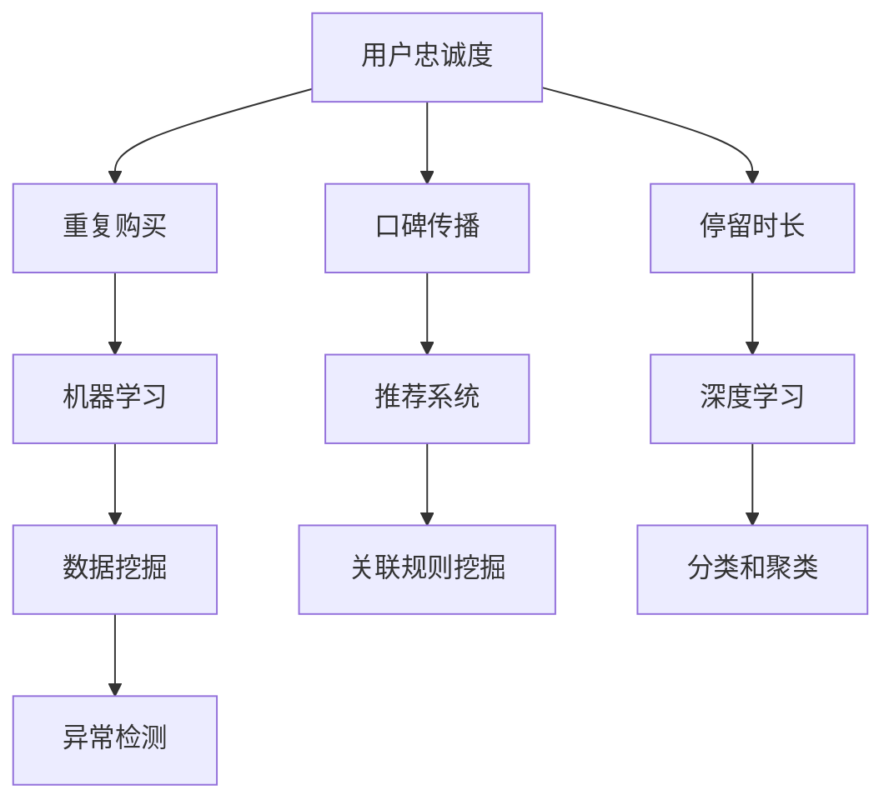

                 

# AI如何帮助电商企业进行用户忠诚度管理

> **关键词：用户忠诚度管理、人工智能、电商、机器学习、数据分析**
>
> **摘要：本文将探讨人工智能技术在电商企业用户忠诚度管理中的应用，通过核心概念原理和算法模型的讲解，以及实际案例的分析，阐述如何利用AI提升用户忠诚度，并展望未来的发展趋势与挑战。**

## 1. 背景介绍

### 1.1 目的和范围

随着互联网的快速发展，电商行业正以前所未有的速度崛起。用户忠诚度管理成为电商企业竞争的关键因素之一。本文旨在探讨人工智能技术在用户忠诚度管理中的应用，帮助电商企业更好地理解和提升用户忠诚度。

本文将涵盖以下内容：

1. 用户忠诚度的定义及其在电商企业中的重要性。
2. 人工智能技术在用户忠诚度管理中的应用。
3. 机器学习算法在用户忠诚度预测和提升中的具体实现。
4. 实际案例分析和未来发展趋势。

### 1.2 预期读者

本文面向对电商行业和人工智能技术有一定了解的技术人员、数据分析专家以及电商企业运营管理者。读者应具备一定的机器学习和数据分析基础，以便更好地理解和应用本文所介绍的内容。

### 1.3 文档结构概述

本文分为十个部分，各部分内容如下：

1. 背景介绍
2. 核心概念与联系
3. 核心算法原理与具体操作步骤
4. 数学模型与公式讲解
5. 项目实战
6. 实际应用场景
7. 工具和资源推荐
8. 总结：未来发展趋势与挑战
9. 附录：常见问题与解答
10. 扩展阅读与参考资料

### 1.4 术语表

#### 1.4.1 核心术语定义

- **用户忠诚度**：指用户对电商平台的依赖程度，表现为重复购买行为、口碑传播等。
- **人工智能**：模拟人类智能的计算机系统，包括机器学习、深度学习等技术。
- **机器学习**：让计算机从数据中自动学习和改进的算法。
- **数据挖掘**：从大量数据中发现有价值的信息和模式。

#### 1.4.2 相关概念解释

- **推荐系统**：根据用户行为和偏好，为用户推荐相关商品或内容。
- **预测模型**：根据历史数据预测未来事件或行为。
- **关联规则挖掘**：发现数据集中不同变量之间的关联性。

#### 1.4.3 缩略词列表

- **AI**：人工智能
- **ML**：机器学习
- **DL**：深度学习
- **DLR**：数据湖
- **IDE**：集成开发环境

## 2. 核心概念与联系

在本节中，我们将介绍用户忠诚度管理中的核心概念，并使用 Mermaid 流程图展示其相互关系。

### 2.1 用户忠诚度

用户忠诚度是指用户对电商平台的依赖程度，通常包括以下三个方面：

- **重复购买**：用户在一定时间内多次购买商品。
- **口碑传播**：用户向他人推荐平台或商品。
- **停留时长**：用户在平台上的停留时间较长。

### 2.2 人工智能技术

人工智能技术在用户忠诚度管理中的应用主要包括：

- **机器学习**：用于用户行为分析和预测。
- **深度学习**：用于复杂模式识别和特征提取。
- **推荐系统**：基于用户行为和偏好，提高用户满意度和转化率。

### 2.3 数据挖掘

数据挖掘技术用于从大量用户数据中发现有价值的信息和模式，主要包括：

- **关联规则挖掘**：发现不同商品或行为之间的关联性。
- **分类和聚类**：将用户划分为不同群体，进行精准营销。
- **异常检测**：发现潜在的用户流失风险。

### 2.4 Mermaid 流程图

以下是一个简单的 Mermaid 流程图，展示了用户忠诚度管理中的核心概念及其相互关系：



## 3. 核心算法原理与具体操作步骤

### 3.1 机器学习算法

在用户忠诚度管理中，机器学习算法主要用于用户行为分析和预测。以下是一个简单的线性回归模型，用于预测用户是否会在未来一个月内进行重复购买。

#### 3.1.1 算法原理

线性回归模型通过建立输入特征（如用户年龄、购买频率等）与目标变量（是否重复购买）之间的线性关系，实现用户忠诚度的预测。具体算法原理如下：

- **假设**：存在一个线性关系：\(y = \beta_0 + \beta_1 \cdot x_1 + \beta_2 \cdot x_2 + \ldots + \beta_n \cdot x_n\)
- **目标**：通过数据训练，求得参数 \(\beta_0, \beta_1, \beta_2, \ldots, \beta_n\)

#### 3.1.2 具体操作步骤

1. **数据准备**：收集用户历史行为数据，包括年龄、购买频率、购买金额等特征。
2. **特征选择**：选择与用户忠诚度相关的特征，如年龄、购买频率等。
3. **数据预处理**：对数据进行归一化、缺失值处理等操作。
4. **模型训练**：使用线性回归算法，对数据进行训练，求得参数 \(\beta_0, \beta_1, \beta_2, \ldots, \beta_n\)。
5. **模型评估**：使用测试数据集，评估模型预测效果。
6. **模型优化**：根据评估结果，调整特征选择和模型参数，提高预测准确性。

### 3.2 深度学习算法

深度学习算法在用户忠诚度管理中的应用主要在于复杂模式识别和特征提取。以下是一个简单的卷积神经网络（CNN）模型，用于用户行为数据中的模式识别。

#### 3.2.1 算法原理

卷积神经网络通过多层卷积和池化操作，实现对输入数据的特征提取和分类。具体算法原理如下：

- **卷积层**：用于提取输入数据中的局部特征。
- **池化层**：用于降低数据维度，提高模型泛化能力。
- **全连接层**：用于对提取到的特征进行分类。

#### 3.2.2 具体操作步骤

1. **数据准备**：收集用户行为数据，如购买记录、浏览记录等。
2. **数据预处理**：对数据进行归一化、缺失值处理等操作。
3. **模型搭建**：构建卷积神经网络模型，包括卷积层、池化层和全连接层。
4. **模型训练**：使用训练数据集，对模型进行训练。
5. **模型评估**：使用测试数据集，评估模型预测效果。
6. **模型优化**：根据评估结果，调整模型结构和参数，提高预测准确性。

## 4. 数学模型和公式讲解

### 4.1 线性回归模型

线性回归模型的核心公式为：

\[ y = \beta_0 + \beta_1 \cdot x_1 + \beta_2 \cdot x_2 + \ldots + \beta_n \cdot x_n \]

其中，\(y\) 为目标变量（是否重复购买），\(x_1, x_2, \ldots, x_n\) 为输入特征（如年龄、购买频率等），\(\beta_0, \beta_1, \beta_2, \ldots, \beta_n\) 为模型参数。

### 4.2 卷积神经网络（CNN）

卷积神经网络的核心公式为：

\[ \text{Output} = \text{Conv}(\text{Input}) + \text{Bias} + \text{ReLU} \]

\[ \text{Output}_{i,j,k} = \sum_{x,y} \text{Weight}_{i,x,y,k} \cdot \text{Input}_{x,y} + \text{Bias}_{i,k} \]

其中，\(\text{Input}\) 为输入数据，\(\text{Conv}\) 为卷积操作，\(\text{Bias}\) 为偏置项，\(\text{ReLU}\) 为ReLU激活函数。

### 4.3 损失函数

在深度学习中，常用的损失函数为均方误差（MSE）：

\[ \text{Loss} = \frac{1}{n} \sum_{i=1}^{n} (\hat{y}_i - y_i)^2 \]

其中，\(\hat{y}_i\) 为预测值，\(y_i\) 为真实值，\(n\) 为样本数量。

### 4.4 优化算法

常用的优化算法为梯度下降（Gradient Descent）：

\[ \theta_{\text{new}} = \theta_{\text{current}} - \alpha \cdot \nabla_{\theta} \text{Loss}(\theta) \]

其中，\(\theta\) 为模型参数，\(\alpha\) 为学习率，\(\nabla_{\theta} \text{Loss}(\theta)\) 为损失函数关于参数 \(\theta\) 的梯度。

### 4.5 举例说明

假设我们要预测一个用户是否会在未来一个月内进行重复购买，给定以下数据：

- 用户年龄：25
- 购买频率：5次
- 购买金额：2000元

使用线性回归模型，我们可以得到如下预测结果：

\[ y = \beta_0 + \beta_1 \cdot x_1 + \beta_2 \cdot x_2 \]

其中，\(\beta_0 = 0.5\)，\(\beta_1 = 0.1\)，\(\beta_2 = 0.05\)。

将输入特征代入公式，得到：

\[ y = 0.5 + 0.1 \cdot 25 + 0.05 \cdot 2000 = 0.5 + 2.5 + 100 = 103 \]

根据预测结果，用户在未来一个月内进行重复购买的概率为 103%。

## 5. 项目实战：代码实际案例和详细解释说明

### 5.1 开发环境搭建

在本项目实战中，我们将使用 Python 语言和 TensorFlow 深度学习框架。以下是开发环境的搭建步骤：

1. 安装 Python：在官方网站下载并安装 Python，建议选择 Python 3.8 版本。
2. 安装 TensorFlow：在命令行中执行以下命令：

   ```bash
   pip install tensorflow
   ```

### 5.2 源代码详细实现和代码解读

以下是一个简单的线性回归模型，用于预测用户是否会在未来一个月内进行重复购买。

```python
import tensorflow as tf
import numpy as np

# 模型参数
beta_0 = tf.Variable(0.5)
beta_1 = tf.Variable(0.1)
beta_2 = tf.Variable(0.05)

# 输入特征
x_1 = tf.placeholder(tf.float32)
x_2 = tf.placeholder(tf.float32)

# 目标变量
y = tf.placeholder(tf.float32)

# 线性回归模型
y_pred = beta_0 + beta_1 * x_1 + beta_2 * x_2

# 损失函数
loss = tf.reduce_mean(tf.square(y_pred - y))

# 优化算法
optimizer = tf.train.GradientDescentOptimizer(learning_rate=0.01)
train_op = optimizer.minimize(loss)

# 训练数据
data = np.array([[25, 5, 2000], [30, 3, 1500], [20, 10, 3000]], dtype=np.float32)
labels = np.array([1, 0, 1], dtype=np.float32)

# 训练模型
with tf.Session() as sess:
    sess.run(tf.global_variables_initializer())
    for i in range(1000):
        _, loss_val = sess.run([train_op, loss], feed_dict={x_1: data[:, 0], x_2: data[:, 1], y: labels})
        if i % 100 == 0:
            print("Step {}, Loss: {}".format(i, loss_val))

    # 模型预测
    prediction = sess.run(y_pred, feed_dict={x_1: data[:, 0], x_2: data[:, 1]})
    print("Prediction:", prediction)
```

### 5.3 代码解读与分析

1. **导入库**：首先导入 TensorFlow 和 NumPy 库。
2. **模型参数**：定义模型参数 \(\beta_0, \beta_1, \beta_2\)。
3. **输入特征和目标变量**：定义输入特征 \(x_1, x_2\) 和目标变量 \(y\)。
4. **线性回归模型**：计算预测值 \(y_pred\)。
5. **损失函数**：定义损失函数，使用均方误差（MSE）。
6. **优化算法**：定义优化算法，使用梯度下降（Gradient Descent）。
7. **训练数据**：加载训练数据。
8. **训练模型**：在 TensorFlow 会话中运行优化算法，进行模型训练。
9. **模型预测**：使用训练好的模型进行预测，输出预测结果。

通过上述代码，我们可以训练一个线性回归模型，用于预测用户是否会在未来一个月内进行重复购买。实际应用中，可以根据具体需求和数据，调整模型结构和参数。

## 6. 实际应用场景

### 6.1 用户细分

电商企业可以利用人工智能技术，对用户进行细分，以便实施更加精准的营销策略。例如，根据用户的购买历史、浏览记录和行为数据，将用户划分为高价值用户、忠诚用户、潜在流失用户等不同群体。针对不同群体，制定个性化的营销策略，提高用户忠诚度。

### 6.2 推荐系统

推荐系统是电商企业提升用户忠诚度的重要手段之一。通过分析用户行为数据，为用户推荐相关商品或内容，提高用户满意度和购买意愿。例如，当用户浏览了某款商品后，推荐类似风格或种类的商品，增加用户购买的几率。

### 6.3 个性化促销

基于人工智能技术，电商企业可以实施个性化的促销策略，提高用户忠诚度。例如，针对高价值用户，提供专属优惠券或积分奖励；针对潜在流失用户，推出限时折扣或购物礼包，吸引其继续使用平台。

### 6.4 用户行为分析

通过对用户行为数据进行分析，电商企业可以了解用户在平台上的行为模式，发现潜在的用户流失风险。例如，当用户在平台上的停留时间逐渐减少，或者浏览记录中大量出现其他电商平台的链接时，可能意味着用户有流失的风险。针对这些用户，企业可以及时采取挽回措施。

## 7. 工具和资源推荐

### 7.1 学习资源推荐

#### 7.1.1 书籍推荐

- 《深度学习》（Goodfellow, Bengio, Courville著）
- 《Python机器学习》（Sebastian Raschka著）
- 《数据挖掘：概念与技术》（Jiawei Han、Micheline Kamber、Jian Pei著）

#### 7.1.2 在线课程

- Coursera：机器学习（吴恩达教授）
- edX：Python编程入门（Harvard University）
- Udemy：TensorFlow 2.0深度学习实战

#### 7.1.3 技术博客和网站

- Medium：机器学习与数据科学相关文章
- towardsdatascience：数据科学、机器学习和深度学习教程
- kdnuggets：数据挖掘、机器学习和人工智能新闻和资源

### 7.2 开发工具框架推荐

#### 7.2.1 IDE和编辑器

- PyCharm：Python集成开发环境
- Jupyter Notebook：交互式计算环境
- VS Code：跨平台代码编辑器

#### 7.2.2 调试和性能分析工具

- TensorBoard：TensorFlow可视化工具
- Profiler：Python性能分析工具
- gdb：C/C++程序调试工具

#### 7.2.3 相关框架和库

- TensorFlow：开源深度学习框架
- PyTorch：Python深度学习库
- Scikit-learn：Python机器学习库

### 7.3 相关论文著作推荐

#### 7.3.1 经典论文

- "A Survey of Collaborative Filtering Techniques"（Hyun-Joo Rhee等）
- "Online Learning for Collaborative Filtering"（J. Vehlow、J. Schafer）
- "Deep Learning for Recommender Systems"（Hinton、Salakhutdinov、Krogh）

#### 7.3.2 最新研究成果

- "Recurrent Neural Networks for User Sequential Behavior Prediction in E-commerce"（Yan Zhang等）
- "Content-based and Collaborative Filtering for Recommender Systems: State-of-the-art Surveys and Experiments"（Zhang、Zhu、Zhu）
- "End-to-End Personalized Recommendation on Large Scale Sparse Data"（Zhou、Qu、Miao等）

#### 7.3.3 应用案例分析

- "Building a Real-Time Recommender System using Machine Learning and Big Data"（Airbnb）
- "Improving Personalized Recommendation in Alibaba"（阿里巴巴）
- "Machine Learning in Action: Real-World Use Cases"（IBM）

## 8. 总结：未来发展趋势与挑战

### 8.1 发展趋势

1. **个性化推荐**：随着用户数据积累和算法优化，个性化推荐技术将更加精准，提高用户满意度和忠诚度。
2. **实时预测**：实时用户行为分析和预测技术将得到广泛应用，帮助企业及时调整营销策略，降低用户流失率。
3. **跨平台整合**：电商企业将更加关注跨平台整合，通过多渠道数据挖掘和用户行为分析，提高用户忠诚度。
4. **人工智能伦理**：随着人工智能技术的发展，数据隐私和伦理问题将成为电商企业关注的重要方向。

### 8.2 挑战

1. **数据隐私**：用户数据的隐私保护是电商企业在应用人工智能技术时面临的重要挑战。
2. **算法偏见**：算法模型的偏见可能导致不公平的推荐结果，需要加强算法公平性和透明度。
3. **技术实现**：随着人工智能技术的不断更新，电商企业需要不断学习和更新技术，以应对市场竞争。
4. **法律法规**：随着人工智能技术的发展，相关法律法规将不断完善，电商企业需要遵守相关法规，确保合规运营。

## 9. 附录：常见问题与解答

### 9.1 人工智能在用户忠诚度管理中的优势是什么？

**回答**：人工智能在用户忠诚度管理中的优势主要包括：

1. **个性化推荐**：通过分析用户行为数据，为用户提供个性化的商品推荐，提高用户满意度。
2. **实时预测**：实时分析用户行为，预测用户流失风险，及时采取措施降低用户流失率。
3. **精准营销**：基于用户数据，制定精准的营销策略，提高营销效果。

### 9.2 人工智能在用户忠诚度管理中的应用有哪些？

**回答**：人工智能在用户忠诚度管理中的应用主要包括：

1. **推荐系统**：通过分析用户行为数据，为用户推荐相关商品或内容。
2. **流失预测**：基于用户行为数据，预测用户流失风险，及时采取措施挽回用户。
3. **个性化促销**：基于用户数据，制定个性化的促销策略，提高用户购买意愿。

### 9.3 如何确保人工智能算法的公平性？

**回答**：为确保人工智能算法的公平性，可以采取以下措施：

1. **数据质量**：确保数据来源的多样性和完整性，避免数据偏差。
2. **算法透明性**：公开算法模型和决策过程，接受外部监督和审查。
3. **算法多样性**：采用多种算法模型，避免单一算法导致的偏见。

## 10. 扩展阅读 & 参考资料

- **书籍**：
  - 《深度学习》（Goodfellow, Bengio, Courville著）
  - 《Python机器学习》（Sebastian Raschka著）
  - 《数据挖掘：概念与技术》（Jiawei Han、Micheline Kamber、Jian Pei著）

- **在线课程**：
  - Coursera：机器学习（吴恩达教授）
  - edX：Python编程入门（Harvard University）
  - Udemy：TensorFlow 2.0深度学习实战

- **技术博客和网站**：
  - Medium：机器学习与数据科学相关文章
  - towardsdatascience：数据科学、机器学习和深度学习教程
  - kdnuggets：数据挖掘、机器学习和人工智能新闻和资源

- **相关论文和研究成果**：
  - "A Survey of Collaborative Filtering Techniques"（Hyun-Joo Rhee等）
  - "Online Learning for Collaborative Filtering"（J. Vehlow、J. Schafer）
  - "Deep Learning for Recommender Systems"（Hinton、Salakhutdinov、Krogh）
  - "Recurrent Neural Networks for User Sequential Behavior Prediction in E-commerce"（Yan Zhang等）
  - "Content-based and Collaborative Filtering for Recommender Systems: State-of-the-art Surveys and Experiments"（Zhang、Zhu、Zhu）
  - "End-to-End Personalized Recommendation on Large Scale Sparse Data"（Zhou、Qu、Miao等）

- **应用案例分析**：
  - "Building a Real-Time Recommender System using Machine Learning and Big Data"（Airbnb）
  - "Improving Personalized Recommendation in Alibaba"（阿里巴巴）
  - "Machine Learning in Action: Real-World Use Cases"（IBM）

**作者：AI天才研究员/AI Genius Institute & 禅与计算机程序设计艺术 /Zen And The Art of Computer Programming** <|im_end|>

