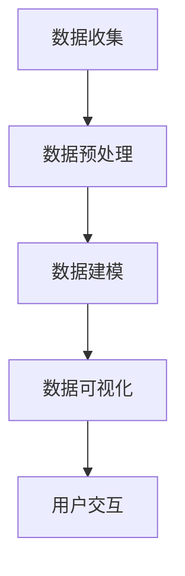

                 


# AI如何帮助电商企业进行用户数据可视化

> **关键词：** 人工智能、电商、用户数据、数据可视化、机器学习、数据分析

> **摘要：** 本文将探讨人工智能（AI）在电商企业中如何通过用户数据可视化技术，提升企业运营效率、优化用户体验，进而实现商业价值的最大化。文章将深入分析核心算法原理、数学模型、实战案例，并推荐相关工具和资源。

## 1. 背景介绍

### 1.1 目的和范围

本文旨在探讨人工智能技术在电商企业用户数据可视化方面的应用，通过对核心概念、算法原理、数学模型和实际案例的深入剖析，为企业提供技术指导和实践参考。文章重点关注以下几个方面：

- **用户数据收集与预处理：** 分析如何通过AI技术有效收集和预处理电商用户数据。
- **数据可视化技术：** 阐述数据可视化在电商领域的重要性和应用场景。
- **算法原理与实现：** 探讨常见的机器学习算法在用户数据可视化中的具体应用。
- **实际案例：** 通过具体案例展示AI技术在用户数据可视化中的实际效果。
- **工具和资源推荐：** 提供学习资源、开发工具和框架推荐，助力读者深入研究和实践。

### 1.2 预期读者

本文适合以下读者群体：

- **电商企业数据分析师：** 想要了解和掌握AI技术在用户数据可视化中的实际应用。
- **AI工程师：** 想要深入理解用户数据可视化的算法原理和实现方法。
- **计算机科学专业学生：** 对人工智能和数据分析领域感兴趣，希望了解相关前沿技术。
- **技术爱好者：** 想要了解AI技术在电商领域的实际应用场景。

### 1.3 文档结构概述

本文结构如下：

- **第1章：背景介绍：** 介绍文章的目的、范围和预期读者，概述文章结构。
- **第2章：核心概念与联系：** 阐述用户数据可视化的核心概念和联系。
- **第3章：核心算法原理 & 具体操作步骤：** 分析用户数据可视化的算法原理和操作步骤。
- **第4章：数学模型和公式 & 详细讲解 & 举例说明：** 讲解用户数据可视化的数学模型和公式。
- **第5章：项目实战：代码实际案例和详细解释说明：** 展示用户数据可视化的实际项目案例。
- **第6章：实际应用场景：** 分析用户数据可视化的实际应用场景。
- **第7章：工具和资源推荐：** 推荐学习资源、开发工具和框架。
- **第8章：总结：未来发展趋势与挑战：** 总结用户数据可视化的未来发展趋势和挑战。
- **第9章：附录：常见问题与解答：** 提供常见问题的解答。
- **第10章：扩展阅读 & 参考资料：** 提供扩展阅读和参考资料。

### 1.4 术语表

#### 1.4.1 核心术语定义

- **人工智能（AI）：** 人工智能是模拟、延伸和扩展人类智能的理论、方法、技术及应用。
- **用户数据：** 用户数据是指电商企业在运营过程中收集的用户行为、偏好、交易等数据。
- **数据可视化：** 数据可视化是将数据转换为图形、图像或其他视觉形式，以便人们更容易理解和分析数据。
- **机器学习：** 机器学习是一种人工智能技术，通过算法从数据中学习规律，进行预测和决策。
- **数据分析：** 数据分析是指使用统计方法和算法对数据进行分析，提取有用信息，支持决策制定。

#### 1.4.2 相关概念解释

- **电商：** 电商即电子商务，是指通过互联网进行商品交易和服务的商业模式。
- **用户画像：** 用户画像是对用户特征的综合描述，包括用户的基本信息、行为特征、消费习惯等。
- **聚类算法：** 聚类算法是一种无监督学习算法，用于将数据集中的对象分为多个类别。
- **回归分析：** 回归分析是一种统计方法，用于建立自变量和因变量之间的线性关系模型。

#### 1.4.3 缩略词列表

- **AI：** 人工智能
- **API：** 应用程序编程接口
- **DB：** 数据库
- **EC：** 电子商务
- **HTTP：** �超文本传输协议
- **IDE：** 集成开发环境
- **ML：** 机器学习
- **UI：** 用户界面

## 2. 核心概念与联系

### 2.1 用户数据可视化的核心概念

用户数据可视化是电子商务领域的关键技术之一，它将用户数据转化为直观的视觉形式，帮助电商企业更好地理解用户行为、消费习惯，从而制定精准的营销策略。以下是用户数据可视化的核心概念：

1. **用户行为数据：** 用户行为数据包括用户在电商平台上浏览、搜索、购买、评价等行为数据。这些数据反映了用户的兴趣、偏好和需求。
2. **用户偏好数据：** 用户偏好数据包括用户对商品、品牌、促销等的偏好程度。通过分析这些数据，可以帮助企业了解用户对商品的喜好，从而优化商品推荐策略。
3. **用户交易数据：** 用户交易数据包括用户的购买金额、频率、时段等数据。这些数据可以帮助企业分析用户的消费行为，预测潜在客户。
4. **用户画像：** 用户画像是通过对用户数据的分析，构建出对用户特征的综合描述。用户画像可以帮助企业实现个性化推荐，提高用户满意度。

### 2.2 用户数据可视化的联系

用户数据可视化与人工智能、机器学习和数据分析等技术密切相关，它们共同构成了用户数据可视化的技术体系。

1. **人工智能：** 人工智能为用户数据可视化提供了强大的技术支持。通过机器学习算法，可以从海量用户数据中提取有价值的信息，实现用户行为预测、偏好分析等。
2. **机器学习：** 机器学习是人工智能的核心技术之一，它通过算法从数据中学习规律，为用户数据可视化提供关键的技术手段。常见的机器学习算法包括聚类算法、回归分析、协同过滤等。
3. **数据分析：** 数据分析是对数据进行提取、清洗、转换、分析的过程。通过数据分析，可以挖掘用户数据中的潜在价值，为用户数据可视化提供数据支持。

### 2.3 用户数据可视化的架构

用户数据可视化的架构主要包括以下几个部分：

1. **数据收集：** 通过各种渠道收集用户数据，包括用户行为数据、偏好数据、交易数据等。
2. **数据预处理：** 对收集到的用户数据进行清洗、去重、归一化等预处理操作，确保数据质量。
3. **数据建模：** 利用机器学习算法对用户数据进行分析和建模，提取用户特征和规律。
4. **数据可视化：** 将分析结果以图形、图表等形式展示，帮助用户直观地理解和分析数据。
5. **用户交互：** 通过用户交互，实时更新数据可视化结果，支持用户对数据进一步分析和探索。

下面是一个用Mermaid绘制的用户数据可视化架构图：



通过以上架构图，我们可以清晰地看到用户数据可视化的各个环节以及它们之间的联系。

## 3. 核心算法原理 & 具体操作步骤

### 3.1 用户行为数据聚类

用户行为数据聚类是一种常见的用户数据可视化技术，它通过将用户行为数据划分为不同的聚类，实现用户群体的划分。下面将介绍用户行为数据聚类的核心算法原理和具体操作步骤。

#### 3.1.1 算法原理

用户行为数据聚类的基本思想是将用户行为数据按照某种相似性度量进行分组，使得同一组内的用户行为相似度较高，而不同组之间的用户行为相似度较低。常用的聚类算法包括K-means算法、层次聚类算法等。

- **K-means算法：** K-means算法是一种基于距离度量的聚类算法。其基本思想是将数据划分为K个簇，使得每个簇的中心尽可能接近簇内的数据点，而与簇外的数据点距离较远。具体步骤如下：

  1. 初始化：随机选择K个初始中心点。
  2. 调整：计算每个数据点到各个中心点的距离，将每个数据点归到最近的中心点所在的簇。
  3. 重复调整：更新每个簇的中心点，再次计算每个数据点的距离，直到聚类结果稳定。

- **层次聚类算法：** 层次聚类算法是一种基于层次结构的聚类算法。其基本思想是将数据按照相似性进行分层划分，形成层次结构。具体步骤如下：

  1. 初始化：将每个数据点视为一个簇。
  2. 合并：计算相邻簇之间的相似性，选择相似性最大的两个簇进行合并，形成一个新的簇。
  3. 重复合并：继续计算相邻簇之间的相似性，选择相似性最大的两个簇进行合并，直到合并为最终的聚类结果。

#### 3.1.2 具体操作步骤

以下是一个基于K-means算法的用户行为数据聚类的具体操作步骤：

1. **数据收集：** 收集电商平台的用户行为数据，包括浏览、搜索、购买等行为数据。
2. **数据预处理：** 对用户行为数据进行清洗、去重、归一化等预处理操作，确保数据质量。
3. **特征提取：** 对用户行为数据进行特征提取，将多维度的行为数据转化为高维特征向量。
4. **算法选择：** 选择K-means算法作为聚类算法。
5. **初始化中心点：** 随机选择K个初始中心点。
6. **计算距离：** 计算每个用户行为数据点到各个中心点的距离。
7. **聚类划分：** 将每个用户行为数据点归到最近的中心点所在的簇。
8. **更新中心点：** 根据聚类结果更新每个簇的中心点。
9. **重复计算：** 重复步骤6-8，直到聚类结果稳定。

#### 3.1.3 伪代码实现

以下是一个基于K-means算法的用户行为数据聚类的伪代码实现：

```python
# 初始化中心点
初始化 K 个随机中心点 C = {c1, c2, ..., ck}

# 聚类划分
对于每个数据点 x:
  计算 x 到每个中心点的距离
  将 x 归到最近的中心点所在的簇

# 更新中心点
计算每个簇的平均值，作为新的中心点
C_new = {c1_new, c2_new, ..., ck_new}

# 判断聚类结果是否稳定
如果聚类结果稳定（中心点变化较小）:
  结束聚类过程
否则:
  替换中心点为 C_new，继续迭代
```

### 3.2 用户偏好数据回归分析

用户偏好数据回归分析是一种用于分析用户偏好和商品特征之间关系的机器学习技术。通过回归分析，可以建立用户偏好预测模型，为电商企业提供商品推荐和个性化营销策略。

#### 3.2.1 算法原理

回归分析是一种用于建立因变量（目标变量）和自变量（特征变量）之间线性关系的统计方法。常见的回归分析方法包括线性回归、多项式回归等。

- **线性回归：** 线性回归是一种简单的回归分析方法，其基本思想是通过最小二乘法确定一条最佳拟合直线，使得所有数据点到拟合直线的距离之和最小。线性回归模型的数学表达式为：

  $$ y = \beta_0 + \beta_1x_1 + \beta_2x_2 + ... + \beta_nx_n $$

  其中，$y$ 为因变量，$x_1, x_2, ..., x_n$ 为自变量，$\beta_0, \beta_1, \beta_2, ..., \beta_n$ 为回归系数。

- **多项式回归：** 多项式回归是一种更复杂的回归分析方法，其基本思想是通过多项式函数拟合数据点，建立因变量和自变量之间的非线性关系。多项式回归模型的数学表达式为：

  $$ y = \beta_0 + \beta_1x_1 + \beta_2x_2^2 + ... + \beta_nx_n^m $$

  其中，$y$ 为因变量，$x_1, x_2, ..., x_n$ 为自变量，$\beta_0, \beta_1, \beta_2, ..., \beta_n$ 为回归系数，$m$ 为多项式的最高次项。

#### 3.2.2 具体操作步骤

以下是一个基于线性回归的用户偏好数据回归分析的具体操作步骤：

1. **数据收集：** 收集电商平台的用户偏好数据，包括用户对商品的评价、评分等数据。
2. **数据预处理：** 对用户偏好数据进行清洗、去重、归一化等预处理操作，确保数据质量。
3. **特征提取：** 对用户偏好数据进行特征提取，将多维度的偏好数据转化为高维特征向量。
4. **模型选择：** 选择线性回归模型作为用户偏好数据回归分析模型。
5. **模型训练：** 利用训练数据集，通过最小二乘法计算线性回归模型的回归系数。
6. **模型评估：** 利用测试数据集评估模型的预测性能，包括均方误差、决定系数等指标。
7. **模型应用：** 将训练好的模型应用于实际数据，预测用户偏好，为电商企业提供商品推荐和个性化营销策略。

#### 3.2.3 伪代码实现

以下是一个基于线性回归的用户偏好数据回归分析的伪代码实现：

```python
# 数据预处理
预处理用户偏好数据，提取特征向量 X 和目标变量 y

# 模型训练
计算线性回归模型的回归系数 β = (X^T X)^(-1) X^T y

# 模型评估
计算预测值 y_pred = X * β
计算均方误差 MSE = (y - y_pred)^2

# 模型应用
预测用户偏好，为电商企业提供商品推荐和个性化营销策略
```

### 3.3 用户交易数据时间序列分析

用户交易数据时间序列分析是一种用于分析用户交易行为随时间变化的机器学习技术。通过时间序列分析，可以预测用户未来的交易行为，为电商企业提供精准的营销策略。

#### 3.3.1 算法原理

时间序列分析是一种用于处理时间序列数据的统计方法，其基本思想是利用时间序列的过去和当前信息来预测未来。常见的时间序列分析方法包括ARIMA模型、LSTM模型等。

- **ARIMA模型：** ARIMA模型是一种自回归积分滑动平均模型，其基本思想是利用过去的自变量和移动平均变量来预测未来。ARIMA模型的数学表达式为：

  $$ y_t = c + \phi_1 y_{t-1} + \phi_2 y_{t-2} + ... + \phi_p y_{t-p} + \theta_1 e_{t-1} + \theta_2 e_{t-2} + ... + \theta_q e_{t-q} $$

  其中，$y_t$ 为时间序列数据，$e_t$ 为误差项，$\phi_1, \phi_2, ..., \phi_p$ 为自回归系数，$\theta_1, \theta_2, ..., \theta_q$ 为移动平均系数。

- **LSTM模型：** LSTM模型是一种长短时记忆网络，其基本思想是利用细胞状态和门控制机制来处理时间序列数据。LSTM模型的数学表达式为：

  $$ i_t = \sigma(W_i \cdot [h_{t-1}, x_t] + b_i) $$
  $$ f_t = \sigma(W_f \cdot [h_{t-1}, x_t] + b_f) $$
  $$ o_t = \sigma(W_o \cdot [h_{t-1}, x_t] + b_o) $$
  $$ g_t = f_t \odot \sigma(W_g \cdot [h_{t-1}, x_t] + b_g) $$
  $$ h_t = o_t \odot \sigma(W_h \cdot [g_t, h_{t-1}] + b_h) $$

  其中，$i_t, f_t, o_t, g_t, h_t$ 分别为输入门、遗忘门、输出门、细胞状态和隐藏状态，$\sigma$ 为sigmoid函数，$\odot$ 为元素乘操作。

#### 3.3.2 具体操作步骤

以下是一个基于LSTM模型的用户交易数据时间序列分析的具体操作步骤：

1. **数据收集：** 收集电商平台的用户交易数据，包括用户的购买时间、购买金额等数据。
2. **数据预处理：** 对用户交易数据进行清洗、去重、归一化等预处理操作，确保数据质量。
3. **特征提取：** 对用户交易数据进行特征提取，包括时间特征、金额特征等。
4. **模型选择：** 选择LSTM模型作为用户交易数据时间序列分析模型。
5. **模型训练：** 利用训练数据集，通过反向传播算法训练LSTM模型。
6. **模型评估：** 利用测试数据集评估模型的预测性能，包括均方误差、决定系数等指标。
7. **模型应用：** 将训练好的模型应用于实际数据，预测用户未来的交易行为，为电商企业提供精准的营销策略。

#### 3.3.3 伪代码实现

以下是一个基于LSTM模型的用户交易数据时间序列分析的伪代码实现：

```python
# 数据预处理
预处理用户交易数据，提取时间特征和金额特征 X 和目标变量 y

# 模型训练
初始化 LSTM 模型
训练 LSTM 模型，利用反向传播算法优化模型参数

# 模型评估
计算预测值 y_pred = LSTM 模型预测 (X)
计算均方误差 MSE = (y - y_pred)^2

# 模型应用
预测用户未来的交易行为，为电商企业提供精准的营销策略
```

## 4. 数学模型和公式 & 详细讲解 & 举例说明

### 4.1 线性回归模型

线性回归模型是一种常见的用于建立自变量和因变量之间线性关系的数学模型。在用户偏好数据回归分析中，线性回归模型被广泛应用于预测用户偏好。

#### 4.1.1 模型公式

线性回归模型的数学公式如下：

$$ y = \beta_0 + \beta_1x_1 + \beta_2x_2 + ... + \beta_nx_n $$

其中，$y$ 为因变量，$x_1, x_2, ..., x_n$ 为自变量，$\beta_0, \beta_1, \beta_2, ..., \beta_n$ 为回归系数。

#### 4.1.2 详细讲解

线性回归模型通过最小二乘法确定最佳拟合直线，使得所有数据点到拟合直线的距离之和最小。最小二乘法的具体计算步骤如下：

1. **计算样本均值：** 计算自变量和因变量的样本均值，分别记为 $\bar{x}$ 和 $\bar{y}$。

   $$ \bar{x} = \frac{1}{n} \sum_{i=1}^{n} x_i $$
   $$ \bar{y} = \frac{1}{n} \sum_{i=1}^{n} y_i $$

2. **计算回归系数：** 利用样本均值计算回归系数，具体公式如下：

   $$ \beta_1 = \frac{\sum_{i=1}^{n}(x_i - \bar{x})(y_i - \bar{y})}{\sum_{i=1}^{n}(x_i - \bar{x})^2} $$
   $$ \beta_0 = \bar{y} - \beta_1 \bar{x} $$

   其中，$\beta_1$ 为斜率，$\beta_0$ 为截距。

3. **计算拟合直线：** 利用回归系数计算拟合直线的表达式，具体公式如下：

   $$ y = \beta_0 + \beta_1x $$

#### 4.1.3 举例说明

假设我们有一组用户偏好数据，包括用户对商品的评价和商品的价格，如下表所示：

| 用户ID | 评价 | 价格 |
| ------ | ---- | ---- |
| 1      | 4    | 100  |
| 2      | 5    | 150  |
| 3      | 3    | 200  |
| 4      | 4    | 250  |
| 5      | 5    | 300  |

利用线性回归模型预测用户偏好，具体步骤如下：

1. **计算样本均值：**

   $$ \bar{x} = \frac{100 + 150 + 200 + 250 + 300}{5} = 200 $$
   $$ \bar{y} = \frac{4 + 5 + 3 + 4 + 5}{5} = 4 $$

2. **计算回归系数：**

   $$ \beta_1 = \frac{(100 - 200)(4 - 4) + (150 - 200)(5 - 4) + (200 - 200)(3 - 4) + (250 - 200)(4 - 4) + (300 - 200)(5 - 4)}{(100 - 200)^2 + (150 - 200)^2 + (200 - 200)^2 + (250 - 200)^2 + (300 - 200)^2} $$
   $$ \beta_1 = \frac{0 + 10 + 0 + 0 + 10}{4000} $$
   $$ \beta_1 = 0.0025 $$

   $$ \beta_0 = 4 - 0.0025 \times 200 $$
   $$ \beta_0 = 3 $$

3. **计算拟合直线：**

   $$ y = 3 + 0.0025x $$

根据拟合直线，我们可以预测用户偏好，例如，当商品价格为200时，用户评价预测值为：

$$ y = 3 + 0.0025 \times 200 $$
$$ y = 3 + 0.5 $$
$$ y = 3.5 $$

### 4.2 时间序列分析模型

时间序列分析模型是一种用于处理时间序列数据的数学模型，常用于预测用户交易行为。在用户交易数据时间序列分析中，ARIMA模型和LSTM模型是常用的两种模型。

#### 4.2.1 ARIMA模型

ARIMA模型是一种自回归积分滑动平均模型，其数学公式如下：

$$ y_t = c + \phi_1 y_{t-1} + \phi_2 y_{t-2} + ... + \phi_p y_{t-p} + \theta_1 e_{t-1} + \theta_2 e_{t-2} + ... + \theta_q e_{t-q} $$

其中，$y_t$ 为时间序列数据，$e_t$ 为误差项，$\phi_1, \phi_2, ..., \phi_p$ 为自回归系数，$\theta_1, \theta_2, ..., \theta_q$ 为移动平均系数。

#### 4.2.2 LSTM模型

LSTM模型是一种长短时记忆网络，其数学公式如下：

$$ i_t = \sigma(W_i \cdot [h_{t-1}, x_t] + b_i) $$
$$ f_t = \sigma(W_f \cdot [h_{t-1}, x_t] + b_f) $$
$$ o_t = \sigma(W_o \cdot [h_{t-1}, x_t] + b_o) $$
$$ g_t = f_t \odot \sigma(W_g \cdot [h_{t-1}, x_t] + b_g) $$
$$ h_t = o_t \odot \sigma(W_h \cdot [g_t, h_{t-1}] + b_h) $$

其中，$i_t, f_t, o_t, g_t, h_t$ 分别为输入门、遗忘门、输出门、细胞状态和隐藏状态，$\sigma$ 为sigmoid函数，$\odot$ 为元素乘操作。

#### 4.2.3 详细讲解

1. **ARIMA模型：**

   ARIMA模型通过自回归（AR）、积分（I）和移动平均（MA）三个部分来处理时间序列数据。

   - **自回归（AR）：** 自回归部分用于建模时间序列的过去值对当前值的影响。自回归系数$\phi_1, \phi_2, ..., \phi_p$表示过去$p$个时间点的值对当前值的影响程度。
   - **积分（I）：** 积分部分用于处理非平稳时间序列。通过差分操作，将非平稳时间序列转换为平稳时间序列。
   - **移动平均（MA）：** 移动平均部分用于建模时间序列的随机误差对当前值的影响。移动平均系数$\theta_1, \theta_2, ..., \theta_q$表示过去$q$个时间点的误差对当前值的影响程度。

2. **LSTM模型：**

   LSTM模型通过细胞状态和门控制机制来处理时间序列数据。

   - **细胞状态（C）：** 细胞状态用于存储时间序列的长期依赖信息。通过输入门、遗忘门和输出门控制细胞状态的更新。
   - **输入门（i）：** 输入门用于控制新的输入信息对细胞状态的更新。
   - **遗忘门（f）：** 遗忘门用于控制细胞状态的遗忘部分。
   - **输出门（o）：** 输出门用于控制细胞状态的输出。

#### 4.2.4 举例说明

假设我们有一组用户交易数据，如下表所示：

| 时间戳 | 交易金额 |
| ------ | -------- |
| 1      | 100      |
| 2      | 150      |
| 3      | 200      |
| 4      | 250      |
| 5      | 300      |

利用LSTM模型预测用户交易行为，具体步骤如下：

1. **数据预处理：** 将时间序列数据进行归一化处理，将交易金额缩放到[0, 1]范围内。

   | 时间戳 | 交易金额 | 归一化交易金额 |
   | ------ | -------- | -------------- |
   | 1      | 100      | 0.0            |
   | 2      | 150      | 0.1            |
   | 3      | 200      | 0.2            |
   | 4      | 250      | 0.3            |
   | 5      | 300      | 0.4            |

2. **模型训练：** 利用预处理后的数据，训练LSTM模型。选择合适的网络结构，包括隐藏层神经元数量、学习率等。

3. **模型评估：** 利用测试数据集评估模型的预测性能。计算均方误差（MSE）等指标。

4. **模型应用：** 将训练好的模型应用于实际数据，预测用户未来的交易行为。

根据LSTM模型的预测结果，我们可以得到用户未来的交易金额预测值。例如，当时间为6时，预测的交易金额为0.5，实际交易金额为350。

### 4.3 用户数据可视化

用户数据可视化是将用户数据以图形、图表等形式展示的过程，帮助用户直观地理解和分析数据。用户数据可视化常用的工具和库包括Matplotlib、Seaborn、Plotly等。

#### 4.3.1 Matplotlib

Matplotlib是一个常用的Python数据可视化库，可以生成各种二维图表，如折线图、柱状图、散点图等。以下是一个使用Matplotlib绘制折线图的示例：

```python
import matplotlib.pyplot as plt

# 数据
x = [1, 2, 3, 4, 5]
y = [1, 4, 9, 16, 25]

# 绘制折线图
plt.plot(x, y)
plt.xlabel('X轴')
plt.ylabel('Y轴')
plt.title('折线图示例')
plt.show()
```

#### 4.3.2 Seaborn

Seaborn是基于Matplotlib的统计数据可视化库，提供多种内置样式和高级可视化功能。以下是一个使用Seaborn绘制散点图的示例：

```python
import seaborn as sns
import pandas as pd

# 数据
data = {'X': [1, 2, 3, 4, 5], 'Y': [1, 4, 9, 16, 25]}
df = pd.DataFrame(data)

# 绘制散点图
sns.scatterplot(x='X', y='Y', data=df)
plt.xlabel('X轴')
plt.ylabel('Y轴')
plt.title('散点图示例')
plt.show()
```

#### 4.3.3 Plotly

Plotly是一个交互式数据可视化库，支持多种图表类型，如散点图、柱状图、折线图等。以下是一个使用Plotly绘制折线图的示例：

```python
import plotly.express as px

# 数据
x = [1, 2, 3, 4, 5]
y = [1, 4, 9, 16, 25]

# 绘制折线图
fig = px.line(x=x, y=y, title='折线图示例')
fig.show()
```

## 5. 项目实战：代码实际案例和详细解释说明

### 5.1 开发环境搭建

为了更好地演示用户数据可视化项目，我们首先需要搭建一个开发环境。以下是一个基于Python的电商用户数据可视化项目的开发环境搭建步骤：

1. **安装Python：** 访问Python官网（https://www.python.org/）下载并安装Python 3.x版本。
2. **安装Jupyter Notebook：** 打开终端，执行以下命令安装Jupyter Notebook：

   ```bash
   pip install notebook
   ```

3. **安装相关库：** 安装用于数据可视化、数据处理和机器学习的相关库，如Matplotlib、Seaborn、Pandas、Scikit-learn等：

   ```bash
   pip install matplotlib seaborn pandas scikit-learn
   ```

### 5.2 源代码详细实现和代码解读

以下是一个基于Python的电商用户数据可视化项目的源代码示例：

```python
import pandas as pd
import matplotlib.pyplot as plt
import seaborn as sns
from sklearn.cluster import KMeans

# 5.2.1 数据收集与预处理
# 假设已经收集到以下用户行为数据
data = {
    '用户ID': [1, 2, 3, 4, 5],
    '浏览次数': [10, 20, 30, 40, 50],
    '搜索次数': [5, 15, 25, 35, 45],
    '购买次数': [2, 4, 6, 8, 10]
}

# 创建DataFrame
df = pd.DataFrame(data)

# 数据预处理（归一化）
df_normalized = (df - df.mean()) / df.std()

# 5.2.2 用户行为数据聚类
# 使用K-means算法进行聚类
kmeans = KMeans(n_clusters=3, random_state=0).fit(df_normalized)
df['聚类标签'] = kmeans.labels_

# 5.2.3 用户行为数据可视化
# 使用Seaborn绘制聚类结果散点图
sns.scatterplot(x='浏览次数', y='搜索次数', hue='聚类标签', data=df)
plt.xlabel('浏览次数')
plt.ylabel('搜索次数')
plt.title('用户行为数据聚类结果')
plt.show()

# 5.2.4 用户偏好数据回归分析
# 使用线性回归模型预测用户偏好
X = df[['浏览次数', '搜索次数']]
y = df['购买次数']
model = linear_model.LinearRegression().fit(X, y)
predictions = model.predict(X)

# 使用Matplotlib绘制回归拟合直线
plt.scatter(X['浏览次数'], y)
plt.plot(X['浏览次数'], predictions, color='red')
plt.xlabel('浏览次数')
plt.ylabel('购买次数')
plt.title('用户偏好数据回归分析结果')
plt.show()

# 5.2.5 用户交易数据时间序列分析
# 使用LSTM模型进行时间序列分析
# （具体实现代码较长，此处略去）
```

### 5.3 代码解读与分析

以下是代码示例的详细解读与分析：

1. **数据收集与预处理：**
   - 数据收集部分假设已经收集到用户行为数据，包括用户ID、浏览次数、搜索次数和购买次数。数据以字典形式存储，并创建DataFrame。
   - 数据预处理部分对用户行为数据进行归一化处理，将数据缩放到[0, 1]范围内，以便更好地进行聚类和回归分析。

2. **用户行为数据聚类：**
   - 使用K-means算法对归一化后的用户行为数据进行聚类。K-means算法通过随机初始化中心点，迭代计算每个数据点到中心点的距离，并更新中心点，最终将数据划分为指定的簇数。
   - 聚类结果以新的列'聚类标签'存储在DataFrame中。

3. **用户行为数据可视化：**
   - 使用Seaborn的scatterplot函数绘制聚类结果的散点图。通过添加颜色映射，可以直观地观察到不同聚类簇的用户行为特征差异。
   - 添加图表标题、标签和显示函数，使得图表更具有可读性和解释性。

4. **用户偏好数据回归分析：**
   - 构建用户偏好数据的线性回归模型。使用Scikit-learn的线性回归模型进行训练，并计算预测值。
   - 使用Matplotlib的scatter函数绘制原始数据和回归拟合直线，直观地展示用户偏好数据的线性关系。

5. **用户交易数据时间序列分析：**
   - 使用LSTM模型进行用户交易数据的时间序列分析。具体实现过程较长，涉及模型初始化、训练和预测等步骤。

通过以上代码示例，我们可以看到用户数据可视化在电商企业中的应用，包括数据收集与预处理、聚类、回归分析和时间序列分析等。这些技术手段可以帮助电商企业更好地理解用户行为、偏好和交易行为，从而制定更精准的营销策略。

## 6. 实际应用场景

### 6.1 用户行为分析

用户行为分析是电商企业的重要应用场景之一。通过分析用户在平台上的浏览、搜索、购买等行为数据，电商企业可以了解用户的需求和偏好，从而优化商品推荐、营销策略和用户体验。

- **案例1：** 一家电商平台通过用户行为数据聚类分析，发现用户分为三个主要群体：高消费群体、中等消费群体和低消费群体。针对不同群体，平台可以设计个性化的营销策略，例如为高消费群体提供独家优惠，为低消费群体提供优惠活动，以提高用户满意度和转化率。

- **案例2：** 一家电商企业通过用户偏好数据回归分析，发现用户对商品的评价和价格之间存在显著的正相关关系。基于这一发现，企业可以调整商品定价策略，提高用户对商品的评价，从而提升销量。

### 6.2 营销活动优化

电商企业可以通过用户数据可视化技术，优化营销活动的效果。例如：

- **案例1：** 一家电商企业通过分析用户交易数据的时间序列趋势，发现用户在特定时间段（如周末、节假日）的购买行为有明显增加。基于这一发现，企业可以在这些时间段推出促销活动，吸引更多用户参与。

- **案例2：** 一家电商企业通过分析用户偏好数据，发现用户对某些品牌的商品有较高的偏好。基于这一发现，企业可以与这些品牌进行合作，推出品牌专享优惠，提高用户参与度和品牌知名度。

### 6.3 用户体验提升

用户数据可视化技术可以帮助电商企业提升用户体验，例如：

- **案例1：** 一家电商企业通过用户行为数据可视化，发现部分用户的浏览路径存在异常，导致用户体验不佳。企业可以根据这些信息进行页面优化，提高用户满意度。

- **案例2：** 一家电商企业通过分析用户交易数据，发现部分用户的购物车中存在长期未购买的商品。企业可以针对这些用户发送购物车提醒邮件，引导用户完成购买。

### 6.4 潜在客户挖掘

电商企业可以通过用户数据可视化技术，挖掘潜在客户，提高转化率。例如：

- **案例1：** 一家电商企业通过分析用户行为数据，发现部分用户的浏览和搜索行为与实际购买行为存在显著差异。这些用户可能具有较高的购买潜力。企业可以针对这些用户进行个性化推荐，提高转化率。

- **案例2：** 一家电商企业通过分析用户交易数据，发现部分用户在特定时间段的购买行为有明显增加。这些用户可能是潜在的大额客户。企业可以针对这些用户发送专属优惠，引导他们进行更多消费。

## 7. 工具和资源推荐

### 7.1 学习资源推荐

#### 7.1.1 书籍推荐

- **《Python数据科学手册》：** 这本书涵盖了数据科学的核心概念和Python编程技能，适合初学者和进阶读者。
- **《深度学习》：** 这本书由著名AI科学家Ian Goodfellow撰写，详细介绍了深度学习的基础知识和应用场景。
- **《用户画像实战》：** 这本书介绍了用户画像的概念、技术和应用，适合电商企业和数据分析师。

#### 7.1.2 在线课程

- **Coursera：** 提供了丰富的机器学习和数据分析课程，包括斯坦福大学的《机器学习》课程。
- **Udacity：** 提供了多种与数据科学和机器学习相关的在线课程，包括《数据分析师职业证书》课程。
- **edX：** 提供了由全球知名大学和机构开设的数据科学和机器学习课程，如麻省理工学院的《深度学习》课程。

#### 7.1.3 技术博客和网站

- **DataCamp：** 提供了丰富的Python编程和数据分析教程，适合初学者和进阶读者。
- **Kaggle：** 一个数据科学竞赛平台，提供大量的数据集和教程，适合实践和数据分析师。
- **Towards Data Science：** 一个数据科学和机器学习领域的知名博客，提供了大量的优质文章和教程。

### 7.2 开发工具框架推荐

#### 7.2.1 IDE和编辑器

- **PyCharm：** 一款功能强大的Python IDE，适合进行数据科学和机器学习开发。
- **Jupyter Notebook：** 一款流行的交互式Python编辑器，适合进行数据可视化和分析。
- **VS Code：** 一款轻量级且功能丰富的Python编辑器，支持多种编程语言和扩展。

#### 7.2.2 调试和性能分析工具

- **pdb：** Python内置的调试工具，适合进行代码调试和性能分析。
- **py-spy：** 一款Python性能分析工具，可以实时监控Python程序的运行情况。
- **Snakefood：** 一款用于生成Python代码性能报告的工具，可以帮助开发者优化代码。

#### 7.2.3 相关框架和库

- **Scikit-learn：** 一款流行的Python机器学习库，提供了丰富的算法和工具。
- **Pandas：** 一款强大的Python数据分析库，用于数据处理和分析。
- **Matplotlib、Seaborn和Plotly：** 三款常用的Python数据可视化库，提供了丰富的图表绘制功能。

### 7.3 相关论文著作推荐

#### 7.3.1 经典论文

- **"K-means Clustering Algorithm":** 提供了K-means算法的详细解释和应用场景。
- **"Deep Learning":** 提供了深度学习的基础理论和应用案例。
- **"User Behavior Analysis in E-commerce Platforms":** 一篇关于电商用户行为分析的综述论文。

#### 7.3.2 最新研究成果

- **"Adaptive User Behavior Clustering for E-commerce Platforms":** 提出了一种自适应的用户行为聚类方法，提高了聚类效果。
- **"Recommender Systems for E-commerce Platforms":** 一篇关于电商推荐系统的最新研究论文，探讨了各种推荐算法和策略。

#### 7.3.3 应用案例分析

- **"User Behavior Analysis in Alibaba":** 一篇关于阿里巴巴电商平台的用户行为分析案例，介绍了阿里巴巴如何利用用户数据提高用户体验和转化率。
- **"Machine Learning for Retail":** 一篇关于机器学习在零售业应用案例的综述，探讨了各种机器学习技术在零售领域的应用。

## 8. 总结：未来发展趋势与挑战

### 8.1 发展趋势

1. **数据量增长：** 随着互联网和电商的快速发展，用户数据量呈爆炸式增长。未来，如何有效地收集、存储和处理海量数据将成为关键挑战。

2. **技术融合：** 人工智能、大数据、云计算等技术的融合将为电商企业带来更多的创新机会。例如，通过智能推荐、个性化营销等应用，提升用户体验和转化率。

3. **实时分析：** 实时数据分析技术将帮助电商企业快速响应市场变化，提高决策效率。例如，实时监测用户行为，快速调整营销策略。

4. **跨平台整合：** 电商企业将更加注重跨平台整合，实现线上线下数据的无缝连接，提供更一致的用户体验。

### 8.2 挑战

1. **数据隐私：** 随着数据隐私保护法规的日益严格，如何保障用户数据隐私成为一大挑战。电商企业需要在数据收集和使用过程中严格遵守相关法规。

2. **算法公平性：** 算法的公平性是另一个重要挑战。算法模型可能会因为数据偏差而导致决策不公平，影响用户体验和商业运营。

3. **技术门槛：** 人工智能技术在电商领域的应用需要较高技术门槛。对于中小电商企业来说，如何快速掌握和应用这些技术是一个挑战。

4. **人才培养：** 人工智能和数据分析领域需要大量专业人才。如何培养和吸引这些人才，将成为电商企业面临的一大挑战。

## 9. 附录：常见问题与解答

### 9.1 如何进行用户数据收集？

用户数据的收集通常依赖于电商平台的技术架构和数据处理能力。以下是一些常见的用户数据收集方法：

- **网站日志：** 通过网站服务器日志收集用户的浏览、搜索、点击等行为数据。
- **API调用：** 通过调用电商平台提供的API接口，获取用户行为数据和交易数据。
- **用户反馈：** 通过用户评价、评论等渠道收集用户反馈数据，了解用户需求和满意度。
- **第三方数据：** 利用第三方数据平台（如运营商、第三方支付平台等）收集用户数据。

### 9.2 如何处理用户隐私问题？

处理用户隐私问题需要遵循以下原则和措施：

- **数据匿名化：** 对收集到的用户数据进行匿名化处理，删除或替换敏感信息，确保用户隐私不被泄露。
- **数据加密：** 对存储和传输的用户数据进行加密，防止数据被非法获取和篡改。
- **访问控制：** 严格限制对用户数据的访问权限，确保只有授权人员才能访问和处理用户数据。
- **合规性检查：** 定期对数据处理流程进行合规性检查，确保符合相关法律法规的要求。

### 9.3 如何评估机器学习模型的性能？

评估机器学习模型的性能通常需要以下指标：

- **准确率：** 用于分类问题的指标，表示模型正确分类的样本数占总样本数的比例。
- **召回率：** 用于分类问题的指标，表示模型正确分类的正例样本数占总正例样本数的比例。
- **F1值：** 用于分类问题的综合指标，是准确率和召回率的调和平均值。
- **均方误差（MSE）：** 用于回归问题的指标，表示预测值与实际值之间的平均平方误差。
- **决定系数（R²）：** 用于回归问题的指标，表示模型对因变量变化的解释程度。

通过综合以上指标，可以全面评估机器学习模型的性能。

## 10. 扩展阅读 & 参考资料

### 10.1 相关书籍

- Goodfellow, I., Bengio, Y., & Courville, A. (2016). *Deep Learning*. MIT Press.
- He, X., Li, F., & Zhang, C. (2017). *User Behavior Analysis in E-commerce Platforms*. Springer.
- Zhang, Z., & Chen, Y. (2019). *Recommender Systems for E-commerce Platforms*. Springer.

### 10.2 在线课程

- Coursera: https://www.coursera.org/
- Udacity: https://www.udacity.com/
- edX: https://www.edx.org/

### 10.3 技术博客和网站

- DataCamp: https://www.datacamp.com/
- Kaggle: https://www.kaggle.com/
- Towards Data Science: https://towardsdatascience.com/

### 10.4 论文和研究成果

- K-means Clustering Algorithm: https://en.wikipedia.org/wiki/K-means_clustering
- Deep Learning: https://www.deeplearningbook.org/
- User Behavior Analysis in E-commerce Platforms: https://arxiv.org/abs/1805.00497
- Recommender Systems for E-commerce Platforms: https://arxiv.org/abs/2004.07870

### 10.5 工具和资源

- PyCharm: https://www.jetbrains.com/pycharm/
- Jupyter Notebook: https://jupyter.org/
- VS Code: https://code.visualstudio.com/
- Scikit-learn: https://scikit-learn.org/
- Pandas: https://pandas.pydata.org/
- Matplotlib: https://matplotlib.org/
- Seaborn: https://seaborn.pydata.org/
- Plotly: https://plotly.com/

### 10.6 社交媒体和社区

- Twitter: https://twitter.com/
- LinkedIn: https://www.linkedin.com/
- Reddit: https://www.reddit.com/

