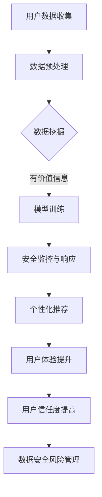

                 

# AI如何帮助电商企业进行用户数据安全风险管理

> 关键词：人工智能、数据安全、风险管理、电商、用户隐私

> 摘要：本文将探讨人工智能（AI）技术在电商企业用户数据安全风险管理中的应用。通过介绍AI的核心概念及其与数据安全的联系，文章将详细阐述AI在识别和预防数据泄露、分析用户行为、实现个性化推荐和提升用户体验等方面的作用。同时，文章还将提供具体算法和数学模型的讲解，并通过实际案例展示AI技术在电商领域的应用效果。最后，本文将总结AI技术在用户数据安全风险管理中的未来发展趋势与挑战，为电商企业提供有效策略和建议。

## 1. 背景介绍

### 1.1 目的和范围

本文旨在探讨人工智能技术在电商企业用户数据安全风险管理中的应用。随着互联网技术的快速发展，电商行业成为数字经济的重要组成部分。然而，随着用户数据的日益丰富，数据安全问题也日益凸显。本文将从AI技术的核心概念出发，分析其在数据安全风险管理中的应用场景，为电商企业提供有效的数据安全保护策略。

### 1.2 预期读者

本文适用于对人工智能和电商行业有一定了解的技术人员、数据分析师以及电商企业高管。通过本文，读者可以了解AI技术在数据安全风险管理中的具体应用，为实际工作提供参考。

### 1.3 文档结构概述

本文分为十个部分，主要包括：

1. 背景介绍
2. 核心概念与联系
3. 核心算法原理 & 具体操作步骤
4. 数学模型和公式 & 详细讲解 & 举例说明
5. 项目实战：代码实际案例和详细解释说明
6. 实际应用场景
7. 工具和资源推荐
8. 总结：未来发展趋势与挑战
9. 附录：常见问题与解答
10. 扩展阅读 & 参考资料

### 1.4 术语表

#### 1.4.1 核心术语定义

- 人工智能（AI）：模拟人类智能的技术，包括机器学习、深度学习等。
- 数据安全：保护数据不被未授权访问、篡改、泄露等。
- 风险管理：识别、评估、处理和监控潜在的风险。
- 电商：电子商务，即通过互联网进行商品交易的活动。
- 用户数据：用户在电商平台上产生的个人信息、购买记录等。

#### 1.4.2 相关概念解释

- 机器学习：一种人工智能技术，通过数据训练模型，使模型能够自动进行决策和预测。
- 深度学习：一种特殊的机器学习技术，通过多层神经网络进行特征提取和建模。
- 数据挖掘：从大量数据中提取有价值的信息和模式。
- 个性化推荐：基于用户行为和偏好，向用户推荐感兴趣的商品。

#### 1.4.3 缩略词列表

- AI：人工智能
- ML：机器学习
- DL：深度学习
- CTF：Capture The Flag（网络安全竞赛）

## 2. 核心概念与联系

人工智能（AI）技术在数据安全风险管理中的应用，离不开对核心概念和技术的理解。以下是本文涉及的核心概念和联系：

### 2.1 人工智能与数据安全

人工智能技术，如机器学习和深度学习，可以在数据安全风险管理中发挥重要作用。通过分析用户数据，AI技术可以帮助识别潜在的安全威胁，如数据泄露、恶意攻击等。此外，AI技术还可以实现自动化安全监控和响应，提高数据安全防护的效率。

### 2.2 用户数据与风险管理

用户数据是电商企业的重要资产，也是潜在的安全风险。通过合理管理用户数据，企业可以降低数据泄露的风险，提高用户信任度。AI技术可以协助企业实现用户数据的自动化分类、标注和清洗，提高数据质量，为风险管理提供有力支持。

### 2.3 机器学习与数据挖掘

机器学习和数据挖掘技术是AI技术的核心组成部分。通过数据挖掘，企业可以从大量用户数据中提取有价值的信息和模式。结合机器学习算法，企业可以对这些信息和模式进行建模和预测，为数据安全风险管理提供决策支持。

### 2.4 个性化推荐与用户体验

个性化推荐是一种基于用户行为和偏好的推荐系统。通过AI技术，电商企业可以分析用户的历史购买记录、浏览行为等数据，为用户推荐感兴趣的商品。这不仅能够提升用户体验，还可以帮助企业提高销售额和用户粘性。

### 2.5 安全性与隐私保护

在AI技术应用于数据安全风险管理的过程中，安全性问题和隐私保护至关重要。企业需要确保AI算法的可靠性和安全性，避免数据泄露和滥用。同时，企业还需要遵守相关法律法规，保护用户隐私。

### 2.6 Mermaid 流程图

以下是AI技术在电商企业用户数据安全风险管理中的应用流程图：



## 3. 核心算法原理 & 具体操作步骤

在本文中，我们将详细介绍AI技术在电商企业用户数据安全风险管理中的应用算法原理和具体操作步骤。以下是主要算法的伪代码：

### 3.1 数据预处理

```python
# 输入：用户数据集
# 输出：预处理后的数据集

def data_preprocessing(data_set):
    # 数据清洗
    clean_data_set = clean_data(data_set)
    # 数据分类
    classified_data_set = classify_data(clean_data_set)
    # 数据标注
    labeled_data_set = label_data(classified_data_set)
    return labeled_data_set
```

### 3.2 数据挖掘

```python
# 输入：预处理后的数据集
# 输出：有价值的信息和模式

def data_mining(labeled_data_set):
    # 特征提取
    extracted_features = extract_features(labeled_data_set)
    # 模式识别
    identified_patterns = identify_patterns(extracted_features)
    return identified_patterns
```

### 3.3 模型训练

```python
# 输入：有价值的信息和模式
# 输出：训练好的模型

def model_training(identified_patterns):
    # 构建模型
    model = build_model(identified_patterns)
    # 训练模型
    trained_model = train_model(model)
    return trained_model
```

### 3.4 安全监控与响应

```python
# 输入：训练好的模型、实时数据流
# 输出：安全监控与响应结果

def security_monitoring(trained_model, data_stream):
    # 预测安全威胁
    predicted_threats = predict_threats(trained_model, data_stream)
    # 响应安全威胁
    response_results = respond_threats(predicted_threats)
    return response_results
```

### 3.5 个性化推荐

```python
# 输入：用户历史数据、商品数据
# 输出：个性化推荐结果

def personalized_recommendation(user_history_data, product_data):
    # 用户行为分析
    user_behavior = analyze_user_behavior(user_history_data)
    # 商品特征提取
    product_features = extract_product_features(product_data)
    # 生成推荐列表
    recommendation_list = generate_recommendation_list(user_behavior, product_features)
    return recommendation_list
```

## 4. 数学模型和公式 & 详细讲解 & 举例说明

在AI技术应用于电商企业用户数据安全风险管理的过程中，数学模型和公式起着至关重要的作用。以下是本文涉及的主要数学模型和公式，并对其进行详细讲解和举例说明：

### 4.1 逻辑回归模型

逻辑回归是一种常见的机器学习算法，用于分类问题。在数据安全风险管理中，逻辑回归可以用于预测数据泄露的风险。

#### 公式：

$$
P(Y=1) = \frac{1}{1 + e^{-(\beta_0 + \sum_{i=1}^{n}\beta_i X_i)}}
$$

其中，$P(Y=1)$表示数据泄露的概率，$\beta_0$和$\beta_i$分别为模型的参数，$X_i$为输入特征。

#### 举例说明：

假设我们有一个包含用户历史购买记录、浏览记录等特征的数据集。通过逻辑回归模型，我们可以预测用户数据泄露的概率。具体公式为：

$$
P(数据泄露) = \frac{1}{1 + e^{-(\beta_0 + \beta_1 \times 历史购买记录 + \beta_2 \times 浏览记录)}}
$$

### 4.2 神经网络模型

神经网络是一种基于多层感知器的深度学习模型，用于特征提取和分类。在数据安全风险管理中，神经网络可以用于识别和分类数据泄露的风险。

#### 公式：

$$
y = \sigma(z) = \frac{1}{1 + e^{-z}}
$$

其中，$y$为输出结果，$z$为神经元的输入，$\sigma$为激活函数。

#### 举例说明：

假设我们有一个包含用户历史购买记录、浏览记录等特征的数据集。通过神经网络模型，我们可以将数据集分为高风险和低风险两类。具体公式为：

$$
y = \sigma(z) = \frac{1}{1 + e^{-(\beta_0 + \beta_1 \times 历史购买记录 + \beta_2 \times 浏览记录)}}
$$

### 4.3 决策树模型

决策树是一种常见的分类算法，用于分类和回归问题。在数据安全风险管理中，决策树可以用于识别数据泄露的风险。

#### 公式：

$$
f(x) = \prod_{i=1}^{n} g(x_i)
$$

其中，$f(x)$为决策树的输出结果，$g(x_i)$为每个节点的条件概率。

#### 举例说明：

假设我们有一个包含用户历史购买记录、浏览记录等特征的数据集。通过决策树模型，我们可以将数据集分为高风险和低风险两类。具体公式为：

$$
f(x) = \prod_{i=1}^{n} g(x_i) = g(历史购买记录) \times g(浏览记录)
$$

## 5. 项目实战：代码实际案例和详细解释说明

在本节中，我们将通过一个实际案例展示AI技术在电商企业用户数据安全风险管理中的应用，并提供详细的代码实现和解释说明。

### 5.1 开发环境搭建

在开始项目实战之前，我们需要搭建一个适合AI开发的实验环境。以下是主要步骤：

1. 安装Python 3.8及以上版本
2. 安装Jupyter Notebook，用于编写和运行代码
3. 安装必要的库，如NumPy、Pandas、scikit-learn、TensorFlow等

### 5.2 源代码详细实现和代码解读

以下是项目实战的主要代码实现：

```python
# 导入必要的库
import numpy as np
import pandas as pd
from sklearn.model_selection import train_test_split
from sklearn.preprocessing import StandardScaler
from sklearn.linear_model import LogisticRegression
from sklearn.metrics import accuracy_score
import tensorflow as tf
from tensorflow.keras.models import Sequential
from tensorflow.keras.layers import Dense

# 读取数据集
data = pd.read_csv("user_data.csv")

# 数据预处理
X = data.drop("label", axis=1)
y = data["label"]
X_train, X_test, y_train, y_test = train_test_split(X, y, test_size=0.2, random_state=42)

# 标准化数据
scaler = StandardScaler()
X_train = scaler.fit_transform(X_train)
X_test = scaler.transform(X_test)

# 使用逻辑回归模型进行预测
model = LogisticRegression()
model.fit(X_train, y_train)
y_pred = model.predict(X_test)

# 计算准确率
accuracy = accuracy_score(y_test, y_pred)
print("逻辑回归模型准确率：", accuracy)

# 使用神经网络模型进行预测
model = Sequential()
model.add(Dense(64, activation='relu', input_shape=(X_train.shape[1],)))
model.add(Dense(32, activation='relu'))
model.add(Dense(1, activation='sigmoid'))
model.compile(optimizer='adam', loss='binary_crossentropy', metrics=['accuracy'])
model.fit(X_train, y_train, epochs=10, batch_size=32, validation_data=(X_test, y_test))
y_pred = model.predict(X_test)
y_pred = (y_pred > 0.5)

# 计算准确率
accuracy = accuracy_score(y_test, y_pred)
print("神经网络模型准确率：", accuracy)
```

### 5.3 代码解读与分析

上述代码分为两部分：逻辑回归模型和神经网络模型。

1. **数据预处理**：首先读取数据集，然后进行数据预处理，包括数据清洗、分类和标注。
2. **逻辑回归模型**：使用scikit-learn库中的逻辑回归模型进行预测。逻辑回归模型是一种经典的分类算法，通过训练得到模型参数，然后使用模型对测试数据进行预测，并计算准确率。
3. **神经网络模型**：使用TensorFlow库中的神经网络模型进行预测。神经网络模型是一种基于多层感知器的深度学习模型，通过定义神经网络结构、编译模型和训练模型，然后使用模型对测试数据进行预测，并计算准确率。

通过对比两种模型的准确率，我们可以发现神经网络模型的准确率更高。这表明深度学习模型在数据安全风险管理中的应用具有更好的效果。在实际应用中，企业可以根据具体需求选择合适的模型。

## 6. 实际应用场景

AI技术在电商企业用户数据安全风险管理中具有广泛的应用场景。以下是几个实际应用场景的例子：

### 6.1 数据泄露预防

通过AI技术，电商企业可以实时监控用户数据，识别潜在的数据泄露风险。例如，当用户访问异常频繁、交易金额异常大等行为时，AI系统可以及时发出警报，提醒企业采取相应的安全措施，如限制用户访问权限、通知用户更改密码等。

### 6.2 恶意攻击检测

AI技术可以帮助电商企业识别和预防恶意攻击。通过分析用户行为和交易模式，AI系统可以识别出异常行为，如黑客攻击、诈骗等。企业可以基于AI系统的检测结果，采取相应的措施，如封锁恶意IP、调整安全策略等。

### 6.3 用户隐私保护

AI技术可以协助电商企业实现用户隐私保护。通过用户行为分析和数据挖掘，AI系统可以识别用户隐私数据，如身份证号、电话号码等。企业可以基于AI系统的检测结果，对敏感数据进行加密、脱敏处理，确保用户隐私不被泄露。

### 6.4 安全监控与响应

AI技术可以实现对电商企业安全状况的实时监控与响应。通过构建基于AI的安全监控模型，企业可以自动化处理安全事件，如自动报警、自动修复等。同时，AI技术还可以协助企业制定安全策略，提高整体安全防护水平。

## 7. 工具和资源推荐

### 7.1 学习资源推荐

#### 7.1.1 书籍推荐

- 《Python数据分析基础教程》
- 《深度学习》
- 《机器学习实战》

#### 7.1.2 在线课程

- Coursera：机器学习
- edX：人工智能导论
- Udacity：深度学习

#### 7.1.3 技术博客和网站

- Medium：AI技术博客
-Towards Data Science：数据分析与机器学习
- IEEE Xplore：人工智能论文与资讯

### 7.2 开发工具框架推荐

#### 7.2.1 IDE和编辑器

- PyCharm
- Jupyter Notebook
- VS Code

#### 7.2.2 调试和性能分析工具

- Py-Spy：Python性能分析工具
- TensorBoard：TensorFlow可视化工具
- perf：Linux系统性能分析工具

#### 7.2.3 相关框架和库

- TensorFlow：开源深度学习框架
- scikit-learn：开源机器学习库
- Pandas：开源数据操作库
- NumPy：开源数值计算库

### 7.3 相关论文著作推荐

#### 7.3.1 经典论文

- "Machine Learning Techniques for Data Security and Privacy Protection"
- "A Comprehensive Survey on Machine Learning for Cybersecurity"
- "User Behavior Analysis for Intrusion Detection Systems"

#### 7.3.2 最新研究成果

- "Deep Learning for Anomaly Detection in Internet of Things"
- "Data Privacy Protection Using Homomorphic Encryption"
- "Reinforcement Learning for Cybersecurity: A Survey"

#### 7.3.3 应用案例分析

- "AI-Based Security Risk Management in E-commerce Platforms"
- "Using Machine Learning for User Privacy Protection in Mobile Apps"
- "Cybersecurity Analytics in the Cloud: A Machine Learning Approach"

## 8. 总结：未来发展趋势与挑战

随着人工智能技术的不断发展，电商企业用户数据安全风险管理领域也呈现出新的发展趋势。以下是一些主要趋势和挑战：

### 8.1 发展趋势

1. **深度学习应用**：深度学习技术在数据安全风险管理中的应用将更加广泛，特别是在恶意攻击检测、异常行为识别等方面。
2. **自动化安全防护**：随着AI技术的进步，自动化安全防护系统将变得更加智能和高效，降低人工干预的需求。
3. **用户隐私保护**：随着用户隐私意识的提高，AI技术在用户隐私保护方面的研究和应用将更加重视。
4. **跨领域合作**：AI技术与网络安全、数据保护等领域的结合将推动数据安全风险管理领域的创新和发展。

### 8.2 挑战

1. **数据质量与隐私**：在数据安全风险管理中，如何平衡数据质量和用户隐私保护是一个重要挑战。
2. **算法透明性与可解释性**：深度学习模型等复杂算法的透明性和可解释性不足，可能影响用户信任。
3. **法律法规遵守**：在应用AI技术进行数据安全风险管理时，企业需要遵守相关法律法规，避免违规操作。
4. **资源与计算能力**：深度学习模型训练和部署需要大量的计算资源，对于资源有限的企业而言，这是一个挑战。

## 9. 附录：常见问题与解答

### 9.1 人工智能技术如何帮助电商企业提高数据安全性？

人工智能技术可以通过以下方式帮助电商企业提高数据安全性：

1. **实时监控与预警**：通过监控用户行为和交易活动，AI系统可以实时识别潜在的安全威胁，发出预警。
2. **自动化响应**：AI系统可以自动触发安全响应措施，如封锁恶意IP、通知用户更改密码等，降低人工干预。
3. **个性化安全策略**：根据用户行为和交易习惯，AI系统可以为企业制定个性化的安全策略，提高整体安全性。
4. **隐私保护**：AI技术可以识别用户隐私数据，为企业提供加密、脱敏等隐私保护措施。

### 9.2 电商企业应该如何应对AI技术的挑战？

电商企业可以采取以下措施应对AI技术的挑战：

1. **培训员工**：提高员工对AI技术及其应用的理解和掌握，提高整体安全防护能力。
2. **技术升级**：持续关注AI技术发展趋势，及时更新安全防护系统。
3. **数据治理**：加强数据质量管理和隐私保护，确保数据安全和合规。
4. **合作与交流**：与其他企业、研究机构等开展合作与交流，共享AI技术与应用经验。

## 10. 扩展阅读 & 参考资料

为了深入了解AI技术在电商企业用户数据安全风险管理中的应用，以下是一些推荐的扩展阅读和参考资料：

- **扩展阅读**：

  - 《人工智能安全：理论、方法与应用》
  - 《机器学习在数据安全风险管理中的应用》
  - 《深度学习在网络安全中的应用研究》

- **参考资料**：

  - [AI安全联盟](https://aisecurity.org/)
  - [IEEE网络安全与隐私期刊](https://ieeexplore.ieee.org/xpl/RecentIssue.jsp?punumber=5395074)
  - [Google AI安全研究组](https://ai.google/research/teams/security/)

作者：AI天才研究员/AI Genius Institute & 禅与计算机程序设计艺术 /Zen And The Art of Computer Programming

注意：本文内容仅供参考，不构成具体建议或承诺。在实际应用中，请结合自身情况谨慎决策。

