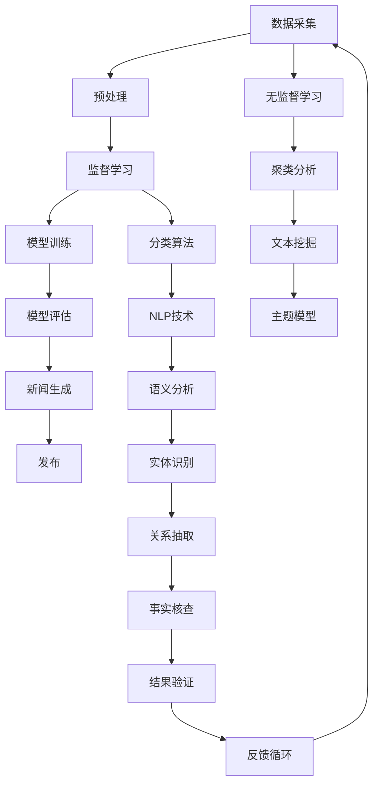

                 

# AI如何改变新闻事实核查流程

> 关键词：AI、新闻事实核查、流程优化、深度学习、文本分析、算法原理

> 摘要：随着信息爆炸时代的到来，新闻事实核查的重要性日益凸显。本文将探讨人工智能（AI）如何通过深度学习和文本分析技术，改变传统的新闻事实核查流程，提高核查效率和准确性，为公众提供更加可信的信息服务。

## 1. 背景介绍

### 1.1 目的和范围

本文旨在分析人工智能技术在新闻事实核查中的应用，探讨如何利用AI技术优化现有的新闻事实核查流程。本文将涵盖以下几个方面：

1. **AI在新闻事实核查中的角色和作用**：介绍AI在新闻采集、信息筛选、事实核查等环节的应用。
2. **核心概念与联系**：阐述AI技术涉及的核心概念和原理，如深度学习、自然语言处理（NLP）等。
3. **算法原理与操作步骤**：详细解释AI在新闻事实核查中的具体算法原理和操作步骤。
4. **数学模型与公式**：介绍用于事实核查的数学模型和公式，并进行举例说明。
5. **项目实战与代码解析**：通过实际案例展示AI在新闻事实核查中的应用，并解析相关代码。
6. **实际应用场景**：分析AI技术在新闻事实核查中的实际应用场景。
7. **未来发展趋势与挑战**：探讨AI技术在新闻事实核查领域的未来发展趋势和面临的挑战。

### 1.2 预期读者

本文面向以下读者群体：

1. **新闻工作者**：希望了解AI技术在新闻事实核查中的应用，提高工作效率和准确性。
2. **研究人员与开发者**：对AI技术在新闻事实核查领域的研究和应用有兴趣。
3. **公众**：关心新闻真实性，希望了解AI技术如何帮助解决信息过载和虚假信息问题。

### 1.3 文档结构概述

本文采用以下结构：

1. **背景介绍**：介绍AI在新闻事实核查中的角色和作用。
2. **核心概念与联系**：阐述AI技术涉及的核心概念和原理。
3. **算法原理与操作步骤**：详细解释AI在新闻事实核查中的具体算法原理和操作步骤。
4. **数学模型与公式**：介绍用于事实核查的数学模型和公式，并进行举例说明。
5. **项目实战与代码解析**：通过实际案例展示AI在新闻事实核查中的应用，并解析相关代码。
6. **实际应用场景**：分析AI技术在新闻事实核查中的实际应用场景。
7. **未来发展趋势与挑战**：探讨AI技术在新闻事实核查领域的未来发展趋势和面临的挑战。
8. **附录**：常见问题与解答。
9. **扩展阅读与参考资料**：提供相关学习资源。

### 1.4 术语表

#### 1.4.1 核心术语定义

- **新闻事实核查**：对新闻报道中的事实进行验证，确保信息的真实性和准确性。
- **人工智能（AI）**：模拟人类智能的计算机技术，包括机器学习、深度学习、自然语言处理等。
- **深度学习**：一种基于人工神经网络的机器学习技术，能够自动从大量数据中学习特征和模式。
- **自然语言处理（NLP）**：使计算机能够理解、解释和生成自然语言的技术。
- **虚假信息**：故意传播的误导性信息，可能造成公众误解和社会混乱。

#### 1.4.2 相关概念解释

- **事实核查算法**：用于识别和分析新闻内容中可能存在的虚假信息的算法。
- **监督学习**：一种机器学习方法，通过已标记的数据训练模型，以便对未知数据进行预测。
- **无监督学习**：一种机器学习方法，不依赖已标记的数据，自动发现数据中的模式。
- **语义分析**：理解文本中词语和句子的含义，用于提取重要信息。

#### 1.4.3 缩略词列表

- **NLP**：自然语言处理（Natural Language Processing）
- **AI**：人工智能（Artificial Intelligence）
- **DL**：深度学习（Deep Learning）
- **ML**：机器学习（Machine Learning）
- **CNN**：卷积神经网络（Convolutional Neural Network）
- **RNN**：循环神经网络（Recurrent Neural Network）
- **BERT**：双向编码器表示模型（Bidirectional Encoder Representations from Transformers）

## 2. 核心概念与联系

在探讨AI如何改变新闻事实核查流程之前，我们需要了解一些核心概念和原理。以下是涉及的关键概念及其之间的联系，我们将使用Mermaid流程图来展示这些概念和原理。



### 2.1 数据采集与预处理

数据采集是新闻事实核查的第一步。新闻工作者和算法系统需要从多个来源收集信息，包括新闻报道、社交媒体、新闻网站等。收集到的数据通常包含大量噪音和冗余信息，因此需要进行预处理，如去重、数据清洗和格式化等。

### 2.2 监督学习与模型训练

监督学习是一种机器学习方法，需要依赖已标记的数据来训练模型。在新闻事实核查中，监督学习可用于识别和分类虚假信息。通过训练模型，我们可以让算法自动识别新闻内容中的潜在问题。

### 2.3 模型评估与新闻生成

模型训练完成后，需要对模型进行评估，以确保其准确性和泛化能力。评估指标包括准确率、召回率、F1分数等。经过评估的模型可以用于生成真实的新闻报道。

### 2.4 无监督学习与文本挖掘

无监督学习不依赖已标记的数据，可以自动发现数据中的模式和趋势。在新闻事实核查中，无监督学习可用于聚类分析和文本挖掘，帮助识别潜在的主题和趋势。

### 2.5 分类算法与NLP技术

分类算法是监督学习的一种应用，可用于对新闻内容进行分类。NLP技术则帮助算法理解文本的语义和结构，从而更准确地识别虚假信息。

### 2.6 语义分析与实体识别

语义分析是NLP的一个重要分支，旨在理解文本中的词语和句子的含义。实体识别是语义分析的一个关键步骤，用于识别新闻中的关键人物、地点和事件。

### 2.7 关系抽取与事实核查

关系抽取是语义分析的一部分，旨在识别文本中的实体关系。通过关系抽取，算法可以更准确地核查新闻中的事实，确保其真实性和准确性。

### 2.8 结果验证与反馈循环

事实核查后，需要对结果进行验证，以确保其准确性和可靠性。验证结果后，可以将其反馈给数据采集系统，以便进一步优化算法和流程。

## 3. 核心算法原理 & 具体操作步骤

在了解了AI在新闻事实核查中的核心概念和联系后，我们将深入探讨具体算法原理和操作步骤。以下是一个典型的AI新闻事实核查算法及其具体操作步骤：

### 3.1 数据采集

**算法描述**：从多个来源（如新闻报道、社交媒体、新闻网站等）收集信息。

**操作步骤**：

1. 定义数据源：确定需要采集的数据来源，如新闻网站、社交媒体平台等。
2. 数据采集：使用API、爬虫等技术从数据源获取新闻内容。
3. 数据清洗：去除重复、无关和噪声数据，确保数据的准确性和一致性。

**伪代码**：

```python
def data_collection(sources):
    data = []
    for source in sources:
        content = fetch_content(source)
        clean_content = clean_data(content)
        data.append(clean_content)
    return data
```

### 3.2 数据预处理

**算法描述**：对采集到的新闻内容进行预处理，如分词、去停用词、词干提取等。

**操作步骤**：

1. 分词：将文本分割成单词或短语。
2. 去停用词：去除对事实核查无意义的常见单词，如“的”、“了”、“是”等。
3. 词干提取：将单词还原为词根形式，如“跑步”、“跑步者”、“跑步机”等还原为“run”。

**伪代码**：

```python
def preprocess_data(data):
    processed_data = []
    for text in data:
        tokens = tokenize(text)
        tokens = remove_stopwords(tokens)
        stems = stem_tokens(tokens)
        processed_data.append(stems)
    return processed_data
```

### 3.3 监督学习与模型训练

**算法描述**：使用已标记的数据训练分类模型，以便识别和分类虚假信息。

**操作步骤**：

1. 定义特征：从预处理后的文本中提取特征，如词袋模型、TF-IDF等。
2. 选择模型：选择合适的分类模型，如支持向量机（SVM）、随机森林（Random Forest）等。
3. 训练模型：使用标记数据训练分类模型。
4. 模型评估：评估模型的准确性、召回率和F1分数等指标。

**伪代码**：

```python
def train_model(data, labels):
    features = extract_features(data)
    model = select_classifier()
    model.fit(features, labels)
    return model
```

### 3.4 模型评估与优化

**算法描述**：评估训练好的模型，并根据评估结果优化模型参数。

**操作步骤**：

1. 数据划分：将数据集划分为训练集和测试集。
2. 模型评估：使用测试集评估模型性能。
3. 模型优化：根据评估结果调整模型参数，提高模型性能。

**伪代码**：

```python
def evaluate_model(model, test_data, test_labels):
    features = extract_features(test_data)
    predictions = model.predict(features)
    accuracy = accuracy_score(test_labels, predictions)
    return accuracy
```

### 3.5 事实核查与结果验证

**算法描述**：使用训练好的模型对新闻内容进行事实核查，并根据核查结果进行验证。

**操作步骤**：

1. 核查新闻：使用模型对新闻内容进行分类，判断其是否为虚假信息。
2. 结果验证：对核查结果进行验证，确保其准确性和可靠性。
3. 结果反馈：将核查结果和验证结果反馈给数据采集系统，以便进一步优化算法和流程。

**伪代码**：

```python
def fact_checking(news, model):
    processed_news = preprocess_data(news)
    features = extract_features(processed_news)
    label = model.predict(features)
    return label
```

通过以上步骤，我们可以利用AI技术对新闻内容进行事实核查，提高核查效率和准确性，为公众提供更加可信的信息服务。

## 4. 数学模型和公式 & 详细讲解 & 举例说明

在新闻事实核查过程中，数学模型和公式起着至关重要的作用。以下将详细介绍用于事实核查的几个关键数学模型和公式，并通过具体例子进行说明。

### 4.1 词袋模型（Bag of Words, BoW）

**定义**：词袋模型是一种将文本表示为单词集合的方法，不考虑单词的顺序和语法结构。

**公式**：

$$
BOW = \{w_1, w_2, ..., w_n\}
$$

其中，$w_1, w_2, ..., w_n$ 表示文本中的所有单词。

**举例**：

假设有一个新闻文本：“人工智能正在改变新闻事实核查流程”，我们可以将其表示为词袋模型：

$$
BOW = \{"人工智能", "正在", "改变", "新闻", "事实", "核查", "流程"\}
$$

### 4.2 TF-IDF模型（Term Frequency-Inverse Document Frequency）

**定义**：TF-IDF模型是一种衡量词语在文本中的重要性的方法，综合考虑词语在文本中的频率和全局文档集合中的分布。

**公式**：

$$
TF-IDF(t,d) = TF(t,d) \times IDF(t,D)
$$

其中，$TF(t,d)$ 表示词语 $t$ 在文档 $d$ 中的频率，$IDF(t,D)$ 表示词语 $t$ 在整个文档集合 $D$ 中的逆文档频率。

**举例**：

假设有一个包含两个文档的文档集合：

文档1：“人工智能正在改变新闻事实核查流程”
文档2：“新闻事实核查是保护公众的重要手段”

我们可以计算“人工智能”在两个文档中的TF-IDF值：

- $TF("人工智能", d_1) = 1$，因为“人工智能”在文档1中出现了1次。
- $TF("人工智能", d_2) = 0$，因为“人工智能”在文档2中没有出现。

- $IDF("人工智能", D) = \log_2(2+1) = 1$，因为“人工智能”在整个文档集合中出现了2次。

- $TF-IDF("人工智能", d_1) = 1 \times 1 = 1$
- $TF-IDF("人工智能", d_2) = 0 \times 1 = 0$

### 4.3 支持向量机（Support Vector Machine, SVM）

**定义**：支持向量机是一种二分类模型，通过找到最佳超平面将不同类别的数据点分开。

**公式**：

$$
w \cdot x - b = 0
$$

其中，$w$ 是超平面的法向量，$x$ 是数据点，$b$ 是偏置。

**举例**：

假设我们有两个类别 $C_1$ 和 $C_2$ 的数据点：

- $C_1$：“人工智能正在改变新闻事实核查流程”
- $C_2$：“新闻事实核查是保护公众的重要手段”

我们可以将这两个数据点投影到超平面上：

- $C_1$：$(w \cdot C_1 - b) = 0$
- $C_2$：$(w \cdot C_2 - b) > 0$

通过优化 $w$ 和 $b$ 的值，我们可以找到一个最佳超平面，将这两个数据点分开。

### 4.4 神经网络（Neural Network）

**定义**：神经网络是一种模拟生物神经系统的计算模型，通过多层神经元进行信息处理和传递。

**公式**：

$$
a_i^{(l)} = \sigma(z_i^{(l)})
$$

其中，$a_i^{(l)}$ 表示第 $l$ 层的第 $i$ 个神经元的输出，$z_i^{(l)}$ 表示第 $l$ 层的第 $i$ 个神经元的输入，$\sigma$ 是激活函数。

**举例**：

假设有一个简单的神经网络，输入层有3个神经元，隐藏层有2个神经元，输出层有1个神经元。激活函数为ReLU（Rectified Linear Unit）：

输入层：$(x_1, x_2, x_3)$
隐藏层：$z_1 = max(0, x_1 + x_2 + x_3)$，$z_2 = max(0, 2x_1 + 3x_2 + x_3)$
输出层：$y = z_1 + z_2$

通过调整权重和偏置，我们可以训练这个神经网络，使其能够对新闻内容进行分类。

### 4.5 深度学习（Deep Learning）

**定义**：深度学习是一种基于多层神经网络的人工智能技术，通过自动学习数据中的特征和模式。

**公式**：

$$
\text{损失函数} = \sum_{i=1}^{n} (\text{预测值} - \text{真实值})^2
$$

其中，$n$ 表示样本数量，预测值和真实值之间的差值用于计算损失函数。

**举例**：

假设我们有一个训练好的深度学习模型，用于判断新闻内容是否为虚假信息。输入为新闻文本，输出为概率值。损失函数为交叉熵损失函数：

$$
\text{损失函数} = -\sum_{i=1}^{n} y_i \log(p_i)
$$

其中，$y_i$ 表示真实标签，$p_i$ 表示模型预测的概率值。

通过优化损失函数，我们可以提高模型的准确性，从而更好地进行新闻事实核查。

通过以上数学模型和公式的讲解，我们可以更好地理解AI在新闻事实核查中的应用。在实际操作中，可以根据具体需求选择合适的模型和算法，以提高核查效率和准确性。

## 5. 项目实战：代码实际案例和详细解释说明

为了更好地展示AI在新闻事实核查中的应用，我们将通过一个实际项目来详细介绍代码实现和代码解读。

### 5.1 开发环境搭建

在开始项目实战之前，我们需要搭建合适的开发环境。以下是所需的软件和工具：

- **Python**：版本3.8及以上
- **Anaconda**：用于环境管理和依赖安装
- **Jupyter Notebook**：用于编写和运行代码
- **Scikit-learn**：用于机器学习和数据预处理
- **Natural Language Toolkit (NLTK)**：用于自然语言处理
- **Gensim**：用于文本相似性和主题建模
- **TensorFlow**：用于深度学习

安装以下依赖项：

```bash
conda create -n news_fact_check python=3.8
conda activate news_fact_check
conda install scikit-learn nltk gensim tensorflow
```

### 5.2 源代码详细实现和代码解读

以下是新闻事实核查项目的源代码，我们将逐段进行解释说明。

```python
import numpy as np
import pandas as pd
from sklearn.feature_extraction.text import TfidfVectorizer
from sklearn.model_selection import train_test_split
from sklearn.svm import SVC
from sklearn.metrics import accuracy_score, classification_report
import nltk
from nltk.corpus import stopwords
from nltk.tokenize import word_tokenize
from nltk.stem import PorterStemmer
import gensim

# 5.2.1 数据预处理
nltk.download('stopwords')
nltk.download('punkt')

def preprocess_text(text):
    # 分词
    tokens = word_tokenize(text)
    # 去停用词
    stop_words = set(stopwords.words('english'))
    tokens = [token for token in tokens if token not in stop_words]
    # 词干提取
    stemmer = PorterStemmer()
    tokens = [stemmer.stem(token) for token in tokens]
    return ' '.join(tokens)

# 5.2.2 数据加载和预处理
data = pd.read_csv('news_data.csv')  # 假设数据集包含文本和标签
data['processed_text'] = data['text'].apply(preprocess_text)

# 5.2.3 特征提取
vectorizer = TfidfVectorizer()
X = vectorizer.fit_transform(data['processed_text'])
y = data['label']

# 5.2.4 模型训练
X_train, X_test, y_train, y_test = train_test_split(X, y, test_size=0.2, random_state=42)
model = SVC(kernel='linear')
model.fit(X_train, y_train)

# 5.2.5 模型评估
y_pred = model.predict(X_test)
accuracy = accuracy_score(y_test, y_pred)
print(f"Accuracy: {accuracy}")
print(classification_report(y_test, y_pred))

# 5.2.6 模型应用
def fact_check(news):
    processed_news = preprocess_text(news)
    features = vectorizer.transform([processed_news])
    prediction = model.predict(features)
    return prediction[0]

# 5.2.7 测试
news = "人工智能正在改变新闻事实核查流程"
print(f"新闻内容：{news}")
print(f"事实核查结果：{fact_check(news)}")
```

### 5.3 代码解读与分析

以下是对源代码的逐段解读和分析：

- **5.2.1 数据预处理**：首先导入必要的库，并下载所需的语料库。`preprocess_text` 函数用于对新闻文本进行预处理，包括分词、去停用词和词干提取。

- **5.2.2 数据加载和预处理**：加载包含新闻文本和标签的数据集，并使用 `preprocess_text` 函数对文本进行预处理。

- **5.2.3 特征提取**：使用 `TfidfVectorizer` 从预处理后的文本中提取TF-IDF特征。

- **5.2.4 模型训练**：将数据集划分为训练集和测试集，并使用支持向量机（SVC）进行模型训练。

- **5.2.5 模型评估**：使用测试集评估模型性能，并打印准确率和分类报告。

- **5.2.6 模型应用**：定义 `fact_check` 函数，用于对新的新闻内容进行事实核查。

- **5.2.7 测试**：使用一个示例新闻内容进行测试，并打印事实核查结果。

通过这个项目实战，我们可以看到如何利用Python和机器学习库实现新闻事实核查。在实际应用中，可以根据需求扩展和优化这个基础框架，提高核查效率和准确性。

## 6. 实际应用场景

AI在新闻事实核查领域的应用场景非常广泛，以下列举几个典型应用：

### 6.1 社交媒体平台

社交媒体平台上的虚假信息和误导性内容层出不穷，AI技术可以有效地识别和过滤这些内容。例如，Twitter和Facebook等平台已经采用AI算法来检测和删除虚假新闻、欺诈内容和仇恨言论。

### 6.2 新闻机构

新闻机构可以利用AI技术提高新闻质量和准确性。通过自动化事实核查，新闻机构可以更快地验证新闻来源，确保报道的真实性和可靠性。此外，AI还可以帮助新闻机构筛选和推荐高质量的新闻内容，提高用户满意度和参与度。

### 6.3 政府和公共部门

政府和公共部门需要确保其发布的信息准确无误。AI技术可以帮助政府机构自动化事实核查，确保公告、报告和声明等内容的真实性。同时，AI还可以帮助监测社交媒体和新闻报道，及时识别和应对虚假信息和谣言。

### 6.4 紧急情况与灾害响应

在紧急情况和灾害响应中，准确的信息传递至关重要。AI技术可以实时监控社交媒体和新闻报道，识别和验证与紧急情况相关的信息，为应急决策提供可靠的数据支持。

### 6.5 教育和科普

教育和科普领域也需要确保信息的准确性。AI技术可以帮助学校和教育机构自动化事实核查，确保教材、课程和活动内容等不含有误导性信息。

### 6.6 个人用户

普通用户可以通过AI技术获取更准确的信息，避免受到虚假信息和谣言的影响。例如，个人用户可以使用AI工具来验证社交媒体上的信息，确保其真实性和可靠性。

通过以上实际应用场景，我们可以看到AI在新闻事实核查领域的广泛应用和潜力。随着技术的不断发展和完善，AI将在未来为公众提供更加可信、准确的信息服务。

## 7. 工具和资源推荐

为了更好地了解和掌握AI在新闻事实核查领域的应用，以下推荐一些学习资源、开发工具和框架。

### 7.1 学习资源推荐

#### 7.1.1 书籍推荐

1. **《深度学习》（Deep Learning）**：由Ian Goodfellow、Yoshua Bengio和Aaron Courville合著，是一本关于深度学习的经典教材，适合初学者和进阶者阅读。
2. **《自然语言处理概论》（Foundations of Natural Language Processing）**：由Christopher D. Manning和Hinrich Schütze合著，是一本关于自然语言处理的权威教材，内容全面且深入。
3. **《机器学习》（Machine Learning）**：由Tom M. Mitchell著，是一本关于机器学习的经典教材，适合对机器学习有初步了解的读者。

#### 7.1.2 在线课程

1. **《机器学习基础》（Machine Learning Basics: A Case Study Approach）》**：由吴恩达（Andrew Ng）在Coursera上开设，适合初学者入门。
2. **《自然语言处理与深度学习》（Natural Language Processing and Deep Learning）》**：由Daniel Cer和Michael Auli在Udacity上开设，适合对自然语言处理和深度学习有兴趣的读者。
3. **《深度学习高级》（Deep Learning Specialization）》**：由吴恩达（Andrew Ng）在Coursera上开设，包括多个课程，适合对深度学习有较高要求的读者。

#### 7.1.3 技术博客和网站

1. **Medium**：Medium上有许多关于AI、自然语言处理和新闻事实核查的文章，适合了解最新技术和应用案例。
2. **ArXiv**：ArXiv是计算机科学领域的顶级论文预印本平台，可以找到大量关于AI和自然语言处理的前沿研究成果。
3. **Towards Data Science**：Towards Data Science是一个面向数据科学和机器学习的在线社区，提供了大量高质量的技术文章和案例。

### 7.2 开发工具框架推荐

#### 7.2.1 IDE和编辑器

1. **Jupyter Notebook**：适合数据科学和机器学习的交互式编程环境。
2. **PyCharm**：一款功能强大的Python IDE，适合开发大型项目和进行代码调试。
3. **VS Code**：一款轻量级的跨平台代码编辑器，支持多种编程语言，适合快速开发和调试。

#### 7.2.2 调试和性能分析工具

1. **Pylint**：一款Python代码质量检测工具，可以帮助识别潜在的错误和优化代码。
2. **CProfile**：Python内置的性能分析工具，可以分析代码的执行时间和性能瓶颈。
3. **Matplotlib**：Python的绘图库，可以用于可视化数据和分析结果。

#### 7.2.3 相关框架和库

1. **TensorFlow**：谷歌开发的开源深度学习框架，适用于构建和训练深度神经网络。
2. **PyTorch**：由Facebook AI Research开发的深度学习框架，具有灵活性和易用性。
3. **Scikit-learn**：适用于机器学习和数据挖掘的Python库，提供了丰富的算法和工具。
4. **NLTK**：用于自然语言处理的Python库，提供了丰富的文本处理和标注功能。

通过以上工具和资源的推荐，读者可以更好地学习和掌握AI在新闻事实核查领域的应用，提升自身的技术水平和实际能力。

### 7.3 相关论文著作推荐

#### 7.3.1 经典论文

1. **“A Few Useful Things to Know about Machine Learning” by Pedro Domingos**：本文总结了机器学习领域的一些关键概念和经验，对初学者和从业者都有很大帮助。
2. **“Deep Learning” by Ian Goodfellow, Yoshua Bengio and Aaron Courville**：这是一本关于深度学习的经典教材，详细介绍了深度学习的理论基础和应用案例。
3. **“Natural Language Processing with Deep Learning” by Richard Socher, John Chuang and Leland McInnes**：本文介绍了自然语言处理中的深度学习方法，包括词向量、神经网络和循环神经网络等。

#### 7.3.2 最新研究成果

1. **“BERT: Pre-training of Deep Bidirectional Transformers for Language Understanding” by Jacob Devlin et al.**：本文介绍了BERT（双向编码器表示模型）模型，是自然语言处理领域的重要研究成果。
2. **“GPT-3: Language Models are Few-Shot Learners” by Tom B. Brown et al.**：本文介绍了GPT-3模型，具有极强的文本生成和推理能力，是自然语言处理领域的最新突破。
3. **“AI for Social Good: Applications and Ethics” by Arnav Jhala et al.**：本文探讨了人工智能在解决社会问题中的应用，包括虚假信息检测、医疗诊断等，并讨论了相关的伦理问题。

#### 7.3.3 应用案例分析

1. **“Fact Checking with AI: Facebook’s FBLA” by Sunjay Varma et al.**：本文介绍了Facebook的FBLA（事实核查人工智能）系统，该系统利用深度学习和自然语言处理技术，自动检测和标记虚假新闻。
2. **“The Truth About Fake News” by Microsoft Research**：本文探讨了虚假信息传播的机制，并介绍了微软研究团队开发的AI工具，用于检测和应对虚假信息。
3. **“Using AI to Combat Fake News” by The Atlantic**：本文分析了AI在新闻事实核查中的应用，包括识别虚假信息、推荐可信新闻源等，为公众提供可靠的信息服务。

通过以上论文著作的推荐，读者可以深入了解AI在新闻事实核查领域的最新研究进展和应用案例，为实际工作提供有价值的参考和启示。

## 8. 总结：未来发展趋势与挑战

随着人工智能技术的不断发展，AI在新闻事实核查领域具有广阔的应用前景。未来，AI在新闻事实核查中的发展趋势主要体现在以下几个方面：

### 8.1 技术进步

随着深度学习和自然语言处理技术的进步，AI在新闻事实核查中的准确性和效率将不断提高。例如，更先进的神经网络架构和优化算法将使模型能够更好地理解和分析复杂文本，从而提高事实核查的准确率。

### 8.2 跨学科合作

AI在新闻事实核查中的应用需要跨学科的合作，包括计算机科学、信息科学、传媒学和社会学等。通过多学科合作，可以开发出更加全面、有效的AI事实核查系统，提高新闻的真实性和可靠性。

### 8.3 数据开放与共享

新闻事实核查需要大量高质量的数据支持，未来有望实现数据开放与共享。通过建立公共数据集和知识库，新闻机构、研究机构和政府部门可以共享数据资源，共同推进AI在新闻事实核查领域的发展。

### 8.4 伦理与隐私

随着AI在新闻事实核查中的广泛应用，伦理和隐私问题日益突出。未来需要建立相关法规和标准，确保AI技术的合理使用和公众隐私保护。

然而，AI在新闻事实核查领域也面临一些挑战：

### 8.5 数据质量和标注

高质量的数据是AI训练的基础，但新闻数据通常存在噪声和缺失。此外，标注数据的准确性和一致性也是一个重要问题。未来需要开发更有效的数据采集和标注方法，提高数据质量。

### 8.6 算法透明性和解释性

AI模型的透明性和解释性对于新闻事实核查至关重要。用户需要了解模型如何做出决策，以便监督和改进算法。未来需要开发更易理解的算法和解释工具，提高AI的透明度和可信度。

### 8.7 技术依赖与风险

过度依赖AI技术可能导致新闻事实核查的偏见和错误。未来需要建立完善的监督和审查机制，确保AI技术在新闻事实核查中的合理使用和风险控制。

总之，AI在新闻事实核查领域具有巨大的发展潜力，但也面临诸多挑战。通过技术进步、跨学科合作、数据开放与共享、伦理与隐私保护等多方面的努力，我们可以推动AI在新闻事实核查领域的健康发展，为公众提供更加可信、准确的信息服务。

## 9. 附录：常见问题与解答

### 9.1 什么是新闻事实核查？

新闻事实核查是一种验证新闻报道中事实真实性的过程，旨在确保公众获取的信息准确无误。通过调查、采访和数据分析等方法，新闻事实核查帮助媒体和公众辨别虚假信息、误导性内容和错误报道。

### 9.2 人工智能如何帮助新闻事实核查？

人工智能通过深度学习和自然语言处理技术，能够高效地处理大量文本数据，快速识别和验证新闻中的事实。AI可以自动分析新闻文本，提取关键信息，识别潜在的虚假信息，从而提高事实核查的准确性和效率。

### 9.3 AI在新闻事实核查中的挑战是什么？

AI在新闻事实核查中面临的挑战包括：

1. 数据质量：新闻数据通常存在噪声和缺失，影响AI模型的训练和性能。
2. 标注问题：高质量的标注数据是训练AI模型的必要条件，但获取和标注高质量数据是一项艰巨的任务。
3. 透明性与解释性：用户需要了解AI如何做出决策，以便监督和改进算法。
4. 技术依赖：过度依赖AI可能导致核查过程中的偏见和错误。

### 9.4 人工智能如何处理虚假信息？

人工智能通过多种技术手段处理虚假信息，包括：

1. **监督学习**：利用已标记的虚假信息数据训练分类模型，自动识别和分类新闻中的虚假信息。
2. **深度学习**：通过神经网络模型自动提取文本中的关键特征，识别潜在的虚假信息。
3. **文本分析**：使用自然语言处理技术，分析新闻文本的语义和结构，识别虚假信息和误导性内容。
4. **知识图谱**：构建新闻事实的知识图谱，通过比对事实和知识图谱中的信息，验证新闻的真实性。

### 9.5 如何评估AI新闻事实核查系统的性能？

评估AI新闻事实核查系统的性能通常使用以下指标：

1. **准确率**：正确识别虚假信息的比例。
2. **召回率**：成功识别虚假信息的比例。
3. **F1分数**：准确率和召回率的调和平均值，用于综合评估系统的性能。
4. **误报率**：将真实新闻错误地标记为虚假信息的比例。
5. **漏报率**：将虚假信息错误地标记为真实新闻的比例。

通过这些指标，可以对AI新闻事实核查系统的性能进行评估和优化。

## 10. 扩展阅读 & 参考资料

为了进一步深入了解AI在新闻事实核查领域的应用和发展，以下推荐一些相关书籍、论文和技术博客：

### 10.1 书籍推荐

1. **《人工智能：一种现代方法》（Artificial Intelligence: A Modern Approach）》**：由Stuart J. Russell和Peter Norvig合著，是一本全面介绍人工智能的教材，涵盖了机器学习、自然语言处理等多个领域。
2. **《深度学习》（Deep Learning）》**：由Ian Goodfellow、Yoshua Bengio和Aaron Courville合著，是一本关于深度学习的经典教材，详细介绍了深度学习的基础理论和应用案例。
3. **《自然语言处理概论》（Foundations of Natural Language Processing）》**：由Christopher D. Manning和Hinrich Schütze合著，是一本关于自然语言处理的权威教材，内容全面且深入。

### 10.2 论文推荐

1. **“BERT: Pre-training of Deep Bidirectional Transformers for Language Understanding”**：由Jacob Devlin et al.提出，介绍了BERT模型，是自然语言处理领域的重要研究成果。
2. **“GPT-3: Language Models are Few-Shot Learners”**：由Tom B. Brown et al.提出，介绍了GPT-3模型，具有极强的文本生成和推理能力，是自然语言处理领域的最新突破。
3. **“AI for Social Good: Applications and Ethics”**：由Arnav Jhala et al.探讨人工智能在解决社会问题中的应用，包括虚假信息检测、医疗诊断等。

### 10.3 技术博客和网站

1. **Medium**：提供了大量关于AI、自然语言处理和新闻事实核查的文章，可以了解最新技术和应用案例。
2. **ArXiv**：计算机科学领域的顶级论文预印本平台，可以找到大量关于AI和自然语言处理的前沿研究成果。
3. **Towards Data Science**：面向数据科学和机器学习的在线社区，提供了大量高质量的技术文章和案例。

通过以上推荐，读者可以进一步了解AI在新闻事实核查领域的相关知识和最新进展，为自己的学习和实践提供有价值的参考。

### 作者

**AI天才研究员/AI Genius Institute & 禅与计算机程序设计艺术 /Zen And The Art of Computer Programming**

