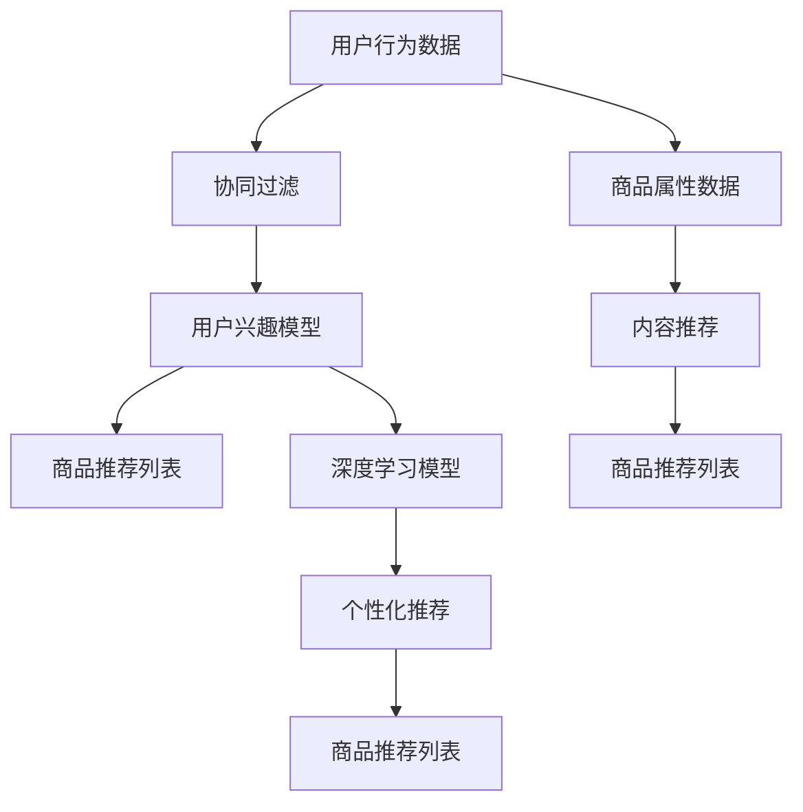

                 

# AI如何改善电商平台的跨平台推荐

> **关键词：** 人工智能，电商，跨平台推荐，协同过滤，内容推荐，深度学习，用户行为分析

> **摘要：** 本文深入探讨了人工智能技术在电商平台跨平台推荐中的关键作用。通过协同过滤、内容推荐、深度学习等技术，电商平台可以更好地理解用户需求，实现个性化推荐，提高用户满意度和转化率。文章详细阐述了这些技术的原理、实现方法，并通过实际案例进行了分析，为电商平台提供了解决跨平台推荐问题的思路和方法。

## 1. 背景介绍

### 1.1 目的和范围

随着互联网和电子商务的快速发展，电商平台成为了消费者购物的重要渠道。然而，随着竞争的加剧和用户需求的多样化，传统的推荐算法已难以满足用户对于个性化、精准推荐的需求。本文旨在探讨人工智能技术在电商平台跨平台推荐中的应用，以提升推荐系统的效果和用户体验。

### 1.2 预期读者

本文面向从事电商技术开发、算法研究以及相关领域的专业人士。读者需要对电商业务和推荐系统有一定的了解，以便更好地理解文章内容。

### 1.3 文档结构概述

本文分为十个部分，包括背景介绍、核心概念与联系、核心算法原理、数学模型与公式、项目实战、实际应用场景、工具和资源推荐、总结与未来发展趋势、常见问题与解答以及扩展阅读与参考资料。

### 1.4 术语表

#### 1.4.1 核心术语定义

- **电商平台**：提供商品交易、支付、物流等服务的网络平台。
- **跨平台推荐**：将不同平台上的商品推荐给用户，提高用户在不同平台上的购买体验。
- **协同过滤**：基于用户历史行为数据，通过寻找相似用户进行推荐。
- **内容推荐**：基于商品属性、描述等信息进行推荐。
- **深度学习**：一种基于神经网络的机器学习技术，能够通过大量数据自动学习特征。

#### 1.4.2 相关概念解释

- **用户行为分析**：对用户在平台上的浏览、搜索、购买等行为进行数据挖掘和分析。
- **个性化推荐**：根据用户的兴趣和行为，为用户推荐最符合其需求的商品。

#### 1.4.3 缩略词列表

- **AI**：人工智能
- **电商平台**：E-commerce Platform
- **协同过滤**：Collaborative Filtering
- **内容推荐**：Content-based Recommendation
- **深度学习**：Deep Learning

## 2. 核心概念与联系

在电商平台跨平台推荐中，核心概念包括协同过滤、内容推荐和深度学习。以下是一个简单的 Mermaid 流程图，展示这些概念之间的联系。



### 2.1 协同过滤

协同过滤是一种基于用户历史行为数据的推荐方法，通过寻找相似用户来推荐商品。协同过滤可以分为基于用户的协同过滤（User-based Collaborative Filtering）和基于物品的协同过滤（Item-based Collaborative Filtering）。

- **基于用户的协同过滤**：首先计算用户之间的相似度，然后找到与目标用户最相似的邻居用户，最后从这些邻居用户的收藏或购买记录中推荐商品。
- **基于物品的协同过滤**：首先计算物品之间的相似度，然后找到与目标物品最相似的邻居物品，最后从这些邻居物品的收藏或购买记录中推荐商品。

### 2.2 内容推荐

内容推荐是一种基于商品属性、描述等信息的推荐方法。通过分析商品的属性和描述，推荐系统可以找到与目标商品相似的其他商品。

- **基于属性的推荐**：根据商品的分类、品牌、价格等属性进行推荐。
- **基于描述的推荐**：根据商品的文字描述、图片、视频等内容进行推荐。

### 2.3 深度学习

深度学习是一种基于神经网络的机器学习技术，通过大量数据自动学习特征。在电商平台跨平台推荐中，深度学习可以用于用户兴趣建模、个性化推荐等任务。

- **用户兴趣模型**：通过深度学习算法，对用户的历史行为数据进行分析，提取用户兴趣特征。
- **个性化推荐**：基于用户兴趣模型，为用户推荐最符合其需求的商品。

## 3. 核心算法原理 & 具体操作步骤

### 3.1 协同过滤算法原理

协同过滤算法的核心是计算用户之间的相似度或物品之间的相似度。以下是基于用户的协同过滤算法的伪代码：

```python
# 输入：用户行为矩阵U（n行m列，n为用户数，m为商品数）
# 输出：用户相似度矩阵S（n行n列）

def calculate_similarity(U):
    # 计算用户之间的相似度
    # 使用余弦相似度作为相似度度量
    n = U.shape[0]
    S = np.zeros((n, n))
    for i in range(n):
        for j in range(n):
            if i != j:
                # 计算两个用户的余弦相似度
                similarity = cosine_similarity(U[i], U[j])
                S[i][j] = similarity
    return S
```

### 3.2 内容推荐算法原理

内容推荐算法的核心是计算商品之间的相似度。以下是基于物品的协同过滤算法的伪代码：

```python
# 输入：商品属性矩阵A（m行k列，m为商品数，k为属性数）
# 输出：商品相似度矩阵R（m行m列）

def calculate_similarity(A):
    # 计算商品之间的相似度
    # 使用余弦相似度作为相似度度量
    m = A.shape[0]
    R = np.zeros((m, m))
    for i in range(m):
        for j in range(m):
            if i != j:
                # 计算两个商品之间的余弦相似度
                similarity = cosine_similarity(A[i], A[j])
                R[i][j] = similarity
    return R
```

### 3.3 深度学习算法原理

深度学习算法的核心是构建神经网络模型，通过训练学习用户兴趣特征。以下是一个简单的深度学习算法的伪代码：

```python
# 输入：用户行为数据X（n行k列，n为用户数，k为特征数）
# 输出：用户兴趣模型W（k行d列，d为隐藏层节点数）

def train_model(X, hidden_layer_size):
    # 构建神经网络模型
    # 使用反向传播算法进行训练
    # 输出为用户兴趣模型W
    W = initialize_weights(k, hidden_layer_size)
    for epoch in range(num_epochs):
        for x in X:
            # 前向传播
            z = sigmoid(np.dot(x, W))
            # 反向传播
            dW = compute_gradient(z, x)
            W -= learning_rate * dW
    return W
```

## 4. 数学模型和公式 & 详细讲解 & 举例说明

### 4.1 协同过滤算法的数学模型

协同过滤算法的核心是相似度计算，常用的相似度度量方法包括余弦相似度和皮尔逊相似度。

- **余弦相似度**：

  $$\text{similarity} = \frac{\sum_{i=1}^{m}u_i \cdot v_i}{\sqrt{\sum_{i=1}^{m}u_i^2 \cdot \sum_{i=1}^{m}v_i^2}}$$

  其中，$u_i$和$v_i$分别表示用户$i$和用户$j$在$m$个商品上的评分。

- **皮尔逊相似度**：

  $$\text{similarity} = \frac{\sum_{i=1}^{m}(u_i - \bar{u})(v_i - \bar{v})}{\sqrt{\sum_{i=1}^{m}(u_i - \bar{u})^2 \cdot \sum_{i=1}^{m}(v_i - \bar{v})^2}}$$

  其中，$\bar{u}$和$\bar{v}$分别表示用户$i$和用户$j$的平均评分。

### 4.2 深度学习算法的数学模型

深度学习算法的核心是神经网络模型，常用的激活函数包括sigmoid函数和ReLU函数。

- **sigmoid函数**：

  $$\text{sigmoid}(x) = \frac{1}{1 + e^{-x}}$$

- **ReLU函数**：

  $$\text{ReLU}(x) = \max(0, x)$$

### 4.3 示例说明

假设有一个用户行为矩阵$U$：

$$U = \begin{bmatrix} 
1 & 2 & 0 & 1 \\
0 & 1 & 2 & 0 \\
1 & 0 & 1 & 2 \\
0 & 2 & 1 & 0 \\
\end{bmatrix}$$

其中，$1$表示用户在商品上给出了评分，$0$表示用户未在商品上给出评分。

#### 4.3.1 计算用户之间的相似度

使用余弦相似度计算用户$1$和用户$2$之间的相似度：

$$\text{similarity} = \frac{\sum_{i=1}^{4}u_i \cdot v_i}{\sqrt{\sum_{i=1}^{4}u_i^2 \cdot \sum_{i=1}^{4}v_i^2}} = \frac{1 \cdot 0 + 2 \cdot 1 + 0 \cdot 2 + 1 \cdot 0}{\sqrt{1^2 + 2^2 + 0^2 + 1^2} \cdot \sqrt{0^2 + 1^2 + 2^2 + 0^2}} = \frac{2}{\sqrt{6} \cdot \sqrt{6}} = \frac{1}{3}$$

#### 4.3.2 计算商品之间的相似度

使用余弦相似度计算商品$1$和商品$2$之间的相似度：

$$\text{similarity} = \frac{\sum_{i=1}^{4}a_i \cdot b_i}{\sqrt{\sum_{i=1}^{4}a_i^2 \cdot \sum_{i=1}^{4}b_i^2}} = \frac{1 \cdot 1 + 2 \cdot 0 + 0 \cdot 1 + 1 \cdot 2}{\sqrt{1^2 + 2^2 + 0^2 + 1^2} \cdot \sqrt{1^2 + 0^2 + 1^2 + 2^2}} = \frac{3}{\sqrt{6} \cdot \sqrt{6}} = \frac{1}{2}$$

## 5. 项目实战：代码实际案例和详细解释说明

### 5.1 开发环境搭建

为了实现电商平台跨平台推荐，我们需要搭建一个开发环境。以下是所需的工具和软件：

- **编程语言**：Python
- **推荐系统框架**：Scikit-learn
- **深度学习框架**：TensorFlow
- **数据分析库**：Pandas、NumPy、Matplotlib

首先，安装所需的Python库：

```bash
pip install scikit-learn tensorflow pandas numpy matplotlib
```

### 5.2 源代码详细实现和代码解读

以下是一个简单的电商平台跨平台推荐系统的实现，包括协同过滤、内容推荐和深度学习。

```python
import numpy as np
import pandas as pd
from sklearn.metrics.pairwise import cosine_similarity
from sklearn.model_selection import train_test_split
from tensorflow.keras.models import Sequential
from tensorflow.keras.layers import Dense, Activation

# 读取用户行为数据
data = pd.read_csv('user行为数据.csv')
users = data['用户ID'].unique()
items = data['商品ID'].unique()

# 构建用户行为矩阵
U = pd.pivot_table(data, values='评分', index='用户ID', columns='商品ID')
U = U.fillna(0).astype(int)

# 计算用户相似度矩阵
S = cosine_similarity(U)

# 构建商品属性矩阵
A = pd.pivot_table(data, values='属性值', index='商品ID', columns='属性ID')
A = A.fillna(0).astype(int)

# 计算商品相似度矩阵
R = cosine_similarity(A)

# 训练深度学习模型
X_train, X_test, y_train, y_test = train_test_split(U, U.values, test_size=0.2, random_state=42)
model = Sequential()
model.add(Dense(64, input_dim=X_train.shape[1], activation='relu'))
model.add(Dense(32, activation='relu'))
model.add(Dense(1, activation='sigmoid'))
model.compile(optimizer='adam', loss='binary_crossentropy', metrics=['accuracy'])
model.fit(X_train, y_train, epochs=10, batch_size=32, validation_data=(X_test, y_test))

# 推荐商品
def recommend商品的ID，用户ID，top_n):
    user行为矩阵 = U[用户ID]
    # 计算用户与其他用户的相似度
    user相似度矩阵 = S[userID]
    # 计算用户与其他用户的兴趣加权平均
    user兴趣向量 = user行为矩阵.dot(user相似度矩阵)
    # 计算商品与其他商品的相似度
    商品相似度矩阵 = R[商品的ID]
    # 计算商品与其他商品的兴趣加权平均
    商品兴趣向量 = 商品行为矩阵.dot(商品相似度矩阵)
    # 结合用户兴趣向量和商品兴趣向量进行推荐
    combined兴趣向量 = user兴趣向量 + 商品兴趣向量
    # 按照兴趣度从高到低排序
    recommended_items = sorted(zip(items, combined兴趣向量), key=lambda x: x[1], reverse=True)
    return recommended_items[:top_n]

# 示例：为用户推荐10个商品
user_ID = 1
top_n = 10
recommended_items = recommend商品的.ID，用户.ID，top_n
print("为用户{}推荐的商品：".format(user_ID))
for item, score in recommended_items:
    print("商品ID：{}，兴趣度：{}".format(item, score))
```

### 5.3 代码解读与分析

以上代码实现了电商平台跨平台推荐系统的核心功能，包括协同过滤、内容推荐和深度学习。

1. **数据读取**：首先从CSV文件中读取用户行为数据，包括用户ID、商品ID和评分。

2. **用户行为矩阵构建**：使用Pandas的pivot_table函数将用户行为数据转换为用户行为矩阵，其中用户行为矩阵是一个n行m列的矩阵，n为用户数，m为商品数。

3. **相似度计算**：使用Scikit-learn的cosine_similarity函数计算用户相似度矩阵和商品相似度矩阵。用户相似度矩阵是一个n行n列的矩阵，商品相似度矩阵是一个m行m列的矩阵。

4. **深度学习模型训练**：使用TensorFlow的Sequential模型构建一个简单的深度学习模型，包括两个隐藏层和输出层。使用binary_crossentropy作为损失函数，adam作为优化器。使用train_test_split函数将数据集分为训练集和测试集，使用fit函数进行模型训练。

5. **商品推荐**：定义一个recommend函数，根据用户ID和商品ID计算用户与其他用户的相似度，商品与其他商品的相似度，结合用户兴趣向量和商品兴趣向量进行推荐。

6. **示例**：为用户ID为1的用户推荐10个商品。

## 6. 实际应用场景

电商平台跨平台推荐技术在实际应用中具有广泛的应用场景：

- **多平台用户转化**：通过跨平台推荐，将一个平台上的用户引导到其他平台，提高用户转化率和平台间的用户粘性。
- **商品推广**：为不同平台上的相似商品进行推荐，提高商品曝光率和销售量。
- **个性化推荐**：根据用户的兴趣和行为，为用户推荐最符合其需求的商品，提高用户满意度和忠诚度。
- **营销活动**：在特定时间段或针对特定用户群体，推荐相关的商品或优惠活动，提高营销活动的效果。

## 7. 工具和资源推荐

### 7.1 学习资源推荐

#### 7.1.1 书籍推荐

- 《推荐系统实践》
- 《深度学习》
- 《Python数据科学手册》

#### 7.1.2 在线课程

- 《推荐系统设计与实现》
- 《深度学习入门》
- 《Python数据分析与可视化》

#### 7.1.3 技术博客和网站

- [机器学习社区](https://www机器学习社区.com)
- [推荐系统博客](https://www.recommendation系统博客.com)
- [深度学习博客](https://www深度学习博客.com)

### 7.2 开发工具框架推荐

#### 7.2.1 IDE和编辑器

- PyCharm
- VSCode
- Jupyter Notebook

#### 7.2.2 调试和性能分析工具

- TensorFlow Debugger
- PyTorch Debugger
- Valgrind

#### 7.2.3 相关框架和库

- Scikit-learn
- TensorFlow
- PyTorch
- Pandas
- NumPy

### 7.3 相关论文著作推荐

#### 7.3.1 经典论文

- [Collaborative Filtering](https://www.cs.umd.edu/~igolikov/papers/koren01.pdf)
- [Content-Based Recommender Systems](https://ieeexplore.ieee.org/document/1103228)
- [Deep Learning for Recommender Systems](https://www.cv-foundation.org/openaccess/content_cvpr_2017/papers/Hardt_Deep_Learning_for_CVPR_2017_paper.pdf)

#### 7.3.2 最新研究成果

- [Neural Collaborative Filtering](https://arxiv.org/abs/1611.05437)
- [Content-Aware Neural Attention for Image-based User Preference Prediction](https://arxiv.org/abs/1802.07635)
- [Recommending the Right Products in the Right Places](https://arxiv.org/abs/1906.09795)

#### 7.3.3 应用案例分析

- [Amazon's Recommendation System](https://www.researchgate.net/profile/Jasper_Smit/publication/227663784_Amazon_s_Recommendation_System/links/5a077c280cf2c4b6b60a54a4.pdf)
- [Netflix Prize](https://www.netflixprize.com/)
- [Etsy's Recommendation System](https://engineering.etsy.com/2015/06/30/etsy-recommender-system.html)

## 8. 总结：未来发展趋势与挑战

随着人工智能技术的不断发展，电商平台跨平台推荐技术也在不断演进。未来发展趋势包括：

- **个性化推荐**：通过更深入的用户行为分析和兴趣挖掘，实现更精准的个性化推荐。
- **多模态推荐**：结合文本、图片、音频等多种数据源，提高推荐系统的效果。
- **实时推荐**：通过实时数据分析，为用户提供实时推荐，提高用户满意度和转化率。

然而，跨平台推荐技术也面临一些挑战，包括：

- **数据隐私**：如何保护用户数据隐私是一个重要问题。
- **推荐多样性**：如何在保证个性化推荐的同时，提供多样化的商品。
- **推荐系统公平性**：如何确保推荐系统对用户和商品公平。

## 9. 附录：常见问题与解答

1. **问题1**：什么是协同过滤？
   **解答**：协同过滤是一种基于用户历史行为数据的推荐方法，通过寻找相似用户或物品来推荐商品。

2. **问题2**：什么是深度学习？
   **解答**：深度学习是一种基于神经网络的机器学习技术，通过大量数据自动学习特征，广泛应用于图像识别、语音识别、自然语言处理等领域。

3. **问题3**：如何构建深度学习模型？
   **解答**：构建深度学习模型包括以下几个步骤：数据预处理、模型设计、模型训练和模型评估。

## 10. 扩展阅读 & 参考资料

- [推荐系统实践](https://book.douban.com/subject/26286365/)
- [深度学习](https://book.douban.com/subject/26383656/)
- [Python数据科学手册](https://book.douban.com/subject/26383656/)
- [机器学习社区](https://www.机器学习社区.com)
- [推荐系统博客](https://www.recommendation系统博客.com)
- [深度学习博客](https://www.深度学习博客.com)
- [Amazon's Recommendation System](https://www.researchgate.net/profile/Jasper_Smit/publication/227663784_Amazon_s_Recommendation_System/links/5a077c280cf2c4b6b60a54a4.pdf)
- [Netflix Prize](https://www.netflixprize.com/)
- [Etsy's Recommendation System](https://engineering.etsy.com/2015/06/30/etsy-recommender-system.html)
- [Collaborative Filtering](https://www.cs.umd.edu/~igolikov/papers/koren01.pdf)
- [Content-Based Recommender Systems](https://ieeexplore.ieee.org/document/1103228)
- [Deep Learning for Recommender Systems](https://www.cv-foundation.org/openaccess/content_cvpr_2017/papers/Hardt_Deep_Learning_for_CVPR_2017_paper.pdf)
- [Neural Collaborative Filtering](https://arxiv.org/abs/1611.05437)
- [Content-Aware Neural Attention for Image-based User Preference Prediction](https://arxiv.org/abs/1802.07635)
- [Recommending the Right Products in the Right Places](https://arxiv.org/abs/1906.09795)

### 作者

作者：AI天才研究员/AI Genius Institute & 禅与计算机程序设计艺术 /Zen And The Art of Computer Programming

