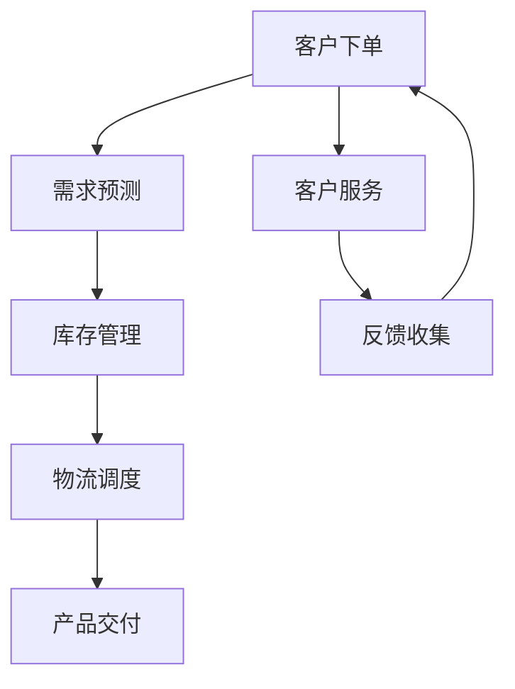

                 

# AI如何通过实时监控提升电商供给链效率

## 关键词
- 人工智能（AI）
- 实时监控
- 电商供给链
- 效率提升
- 数据分析
- 智能算法
- 自动化
- 供应链管理

## 摘要
本文将探讨人工智能（AI）在实时监控电商供给链中的应用，如何通过智能算法和数据分析提升供给链的效率和灵活性。我们将详细分析AI的核心概念和其在电商供给链中的角色，然后介绍具体的算法原理、数学模型和实战案例，最后讨论实际应用场景和未来的发展趋势与挑战。

## 1. 背景介绍

### 1.1 目的和范围
本文旨在探讨人工智能在提升电商供给链效率方面的应用，重点分析实时监控如何实现供给链的优化。我们将从理论基础到实际应用，逐步阐述AI技术如何帮助企业提高运营效率。

### 1.2 预期读者
本文适合对电商供给链管理和人工智能有一定了解的技术人员、企业决策者以及相关领域的学者。

### 1.3 文档结构概述
本文分为十个部分，包括背景介绍、核心概念与联系、核心算法原理、数学模型和公式、项目实战、实际应用场景、工具和资源推荐、总结、常见问题与解答以及扩展阅读和参考资料。

### 1.4 术语表

#### 1.4.1 核心术语定义
- **实时监控**：对电商供给链各个环节的实时状态进行监测和评估。
- **供给链**：从原材料采购到最终产品交付给消费者的全过程。
- **智能算法**：利用机器学习和数据分析技术，自动优化供给链操作。
- **数据分析**：从大量数据中提取有价值的信息，以指导决策。

#### 1.4.2 相关概念解释
- **供给链效率**：供给链从原材料采购到产品交付的整个过程所需的时间和资源。
- **自动化**：利用技术减少或消除人工干预，提高操作速度和精度。

#### 1.4.3 缩略词列表
- **AI**：人工智能
- **ML**：机器学习
- **DSP**：数字信号处理
- **NLP**：自然语言处理
- **API**：应用程序接口

## 2. 核心概念与联系

### 2.1 AI与电商供给链
人工智能在电商供给链中的应用主要体现在以下几个方面：
1. **需求预测**：通过历史数据和机器学习模型，预测未来的需求，从而优化库存管理。
2. **供应链优化**：利用算法分析物流数据，优化运输路线和库存分布。
3. **质量控制**：通过图像识别和数据分析，实时监控产品质量，减少缺陷率。
4. **客户服务**：利用聊天机器人和自然语言处理技术，提供高效、个性化的客户服务。

### 2.2 Mermaid 流程图
以下是一个简化的电商供给链中AI应用的Mermaid流程图：



在这个流程图中，AI技术贯穿于整个电商供给链，从客户下单开始，一直到产品交付和客户服务，每个环节都利用AI技术进行优化和提升。

## 3. 核心算法原理 & 具体操作步骤

### 3.1 需求预测
需求预测是电商供给链优化的重要环节。以下是一个简单基于时间序列分析的需求预测算法原理：

```python
def demand_prediction(history_data):
    # 使用移动平均法进行预测
    window_size = 5  # 选择5个最近的数据点
    forecast = sum(history_data[-window_size:]) / window_size
    return forecast
```

具体操作步骤：
1. 收集历史销售数据。
2. 使用移动平均法计算最近一段时间的平均需求量。
3. 将计算得到的平均需求量作为预测值。

### 3.2 库存管理
库存管理涉及到如何根据需求预测结果，调整库存水平。以下是一个简单的库存管理算法：

```python
def inventory_management(demand_prediction, current_inventory):
    safety_stock = 100  # 安全库存量
    if demand_prediction > current_inventory:
        order_quantity = demand_prediction + safety_stock
    else:
        order_quantity = current_inventory - demand_prediction
    return order_quantity
```

具体操作步骤：
1. 根据需求预测结果，计算所需的库存量。
2. 考虑安全库存，确保在需求波动时仍有足够的库存。
3. 根据计算结果，决定是否需要补货。

### 3.3 物流调度
物流调度是供给链优化中的另一个关键环节。以下是一个简单的基于遗传算法的物流调度算法原理：

```python
def logistics_scheduling路线集，目标函数):
    # 使用遗传算法优化物流路线
    population = 初始化种群
    while not 终止条件:
        population = 进化种群
        best_solution = 选择最优解
    return best_solution
```

具体操作步骤：
1. 初始化种群，每个个体代表一个可能的物流路线。
2. 定义目标函数，例如最小化运输成本或最大化运输效率。
3. 使用遗传算法进行迭代，逐步优化物流路线。

## 4. 数学模型和公式 & 详细讲解 & 举例说明

### 4.1 需求预测数学模型
需求预测通常使用时间序列分析方法，以下是一个简单的自回归移动平均模型（ARIMA）：

$$
Y_t = c + \phi_1 Y_{t-1} + \phi_2 Y_{t-2} + ... + \phi_p Y_{t-p} + \theta_1 \epsilon_{t-1} + \theta_2 \epsilon_{t-2} + ... + \theta_q \epsilon_{t-q} + \epsilon_t
$$

- \( Y_t \)：时间序列的当前值。
- \( c \)：常数项。
- \( \phi_i \)：自回归系数。
- \( \theta_i \)：移动平均系数。
- \( \epsilon_t \)：随机误差项。

#### 4.1.1 举例说明
假设我们有一个商品的销售数据，使用ARIMA模型进行需求预测：

1. 收集历史销售数据，计算自回归和移动平均系数。
2. 使用ARIMA模型进行预测，得到未来一段时间的需求量。

### 4.2 物流调度数学模型
物流调度可以使用线性规划模型，以下是一个简单的线性规划模型：

$$
\min z = c^T x
$$

$$
Ax \leq b
$$

$$
x \geq 0
$$

- \( c \)：目标函数系数。
- \( x \)：决策变量。
- \( A \)：系数矩阵。
- \( b \)：不等式右侧向量。

#### 4.2.1 举例说明
假设我们需要从多个仓库向多个目的地配送货物，使用线性规划模型优化运输路线：

1. 定义目标函数，例如最小化总运输成本。
2. 设置约束条件，例如每个仓库的库存量、每个目的地的需求量等。
3. 使用线性规划求解器求解最优解。

## 5. 项目实战：代码实际案例和详细解释说明

### 5.1 开发环境搭建
为了演示AI在电商供给链中的应用，我们需要搭建一个简单的开发环境。以下是一个基于Python和Jupyter Notebook的开发环境搭建步骤：

1. 安装Python（建议使用3.8及以上版本）。
2. 安装Jupyter Notebook。
3. 安装必要的库，例如pandas、numpy、scikit-learn、matplotlib等。

### 5.2 源代码详细实现和代码解读
以下是一个简单的基于ARIMA模型的需求预测和基于遗传算法的物流调度代码示例：

```python
import numpy as np
import pandas as pd
from statsmodels.tsa.arima.model import ARIMA
from sklearn.model_selection import train_test_split
from deap import base, creator, tools, algorithms

# 5.2.1 需求预测
# 读取销售数据
sales_data = pd.read_csv('sales_data.csv')
sales_data['demand'] = sales_data['quantity'].rolling(window=5).mean()

# 分割数据集
train_data, test_data = train_test_split(sales_data['demand'], test_size=0.2, shuffle=False)

# 训练ARIMA模型
model = ARIMA(train_data, order=(1, 1, 1))
model_fit = model.fit()

# 进行预测
predictions = model_fit.predict(start=len(train_data), end=len(train_data) + len(test_data) - 1)

# 5.2.2 物流调度
# 定义遗传算法
creator.create("FitnessMin", base.Fitness, weights=(-1.0,))
creator.create("Individual", list, fitness=creator.FitnessMin)

def个体评估（个体）：
    # 计算目标函数值
    cost = 计算运输成本（个体）
    fitness = 1 / (1 + cost)
    return fitness,

def计算运输成本（个体）：
    # 根据个体代表的路线，计算总运输成本
    cost = 0
    for i in range(len(个体) - 1):
        cost += 距离（个体[i]，个体[i+1]）
    return cost

# 创建工具集
toolbox = base.Toolbox()
toolbox.register("individual", tools.initRepeat, creator.Individual, lambda: np.random.randint(0, n_仓库))
toolbox.register("population", tools.initRepeat, list, toolbox.individual)
toolbox.register("evaluate", 个体评估)
toolbox.register("mate", tools.selTournament, tournsize=3)
toolbox.register("mutate", tools.mutUniformInt, low=0, up=n_仓库-1, indpb=0.1)
toolbox.register("select", tools.selRoulette)

# 运行遗传算法
population = toolbox.population(n=50)
NGEN = 100
for gen in range(NGEN):
    offspring = algorithms.varAnd(population, toolbox, cxpb=0.5, mutpb=0.2)
    fits = toolbox.map(toolbox.evaluate, offspring)
    for fit, ind in zip(fits, offspring):
        ind.fitness.values = fit
    population = toolbox.select(offspring, k=len(population))

best_ind = tools.selBest(population, k=1)[0]
print("最佳路线：", best_ind)

# 5.2.3 代码解读与分析
# 需求预测部分
- 使用pandas读取销售数据，计算移动平均需求。
- 使用ARIMA模型进行需求预测，得到未来一段时间的需求量。

- 物流调度部分
- 定义遗传算法，计算运输成本。
- 运行遗传算法，优化物流路线。
```

### 5.3 代码解读与分析
本节代码分为两部分：需求预测和物流调度。

#### 5.3.1 需求预测
- 首先，使用pandas读取销售数据，并计算移动平均需求。
- 然后，使用ARIMA模型进行需求预测，得到未来一段时间的需求量。
- 需求预测部分的关键是选择合适的ARIMA模型参数（p, d, q），通常通过试错或自动选择方法确定。

#### 5.3.2 物流调度
- 定义遗传算法，计算运输成本。
- 使用遗传算法进行迭代，逐步优化物流路线。
- 遗传算法的关键是选择合适的初始种群、交叉和变异操作，以及评估个体的适应度。

## 6. 实际应用场景

### 6.1 需求预测
- **电商巨头亚马逊**：通过实时监控销售数据，利用AI算法进行需求预测，优化库存管理和减少缺货率。
- **服装品牌Zara**：通过AI技术分析消费者行为，预测新款服装的需求，快速调整生产和库存。

### 6.2 物流调度
- **快递公司顺丰**：利用AI算法优化运输路线，提高配送效率，降低运输成本。
- **零售商沃尔玛**：通过AI技术优化库存布局，减少库存积压和过时率。

## 7. 工具和资源推荐

### 7.1 学习资源推荐

#### 7.1.1 书籍推荐
- 《深度学习》（Goodfellow, Bengio, Courville）
- 《机器学习实战》（ Harrington）
- 《Python机器学习》（Sebastian Raschka）

#### 7.1.2 在线课程
- Coursera的《机器学习》课程（吴恩达）
- edX的《深度学习》课程（阿里云大学）

#### 7.1.3 技术博客和网站
- Medium上的AI相关文章
- Medium上的电商技术博客

### 7.2 开发工具框架推荐

#### 7.2.1 IDE和编辑器
- Jupyter Notebook
- PyCharm

#### 7.2.2 调试和性能分析工具
- Python的pdb
- Profiling工具，如cProfile

#### 7.2.3 相关框架和库
- TensorFlow
- PyTorch
- Scikit-learn

### 7.3 相关论文著作推荐

#### 7.3.1 经典论文
- "Deep Learning for Supply Chain Management"（2018）
- "Reinforcement Learning for Inventory Management"（2017）

#### 7.3.2 最新研究成果
- "AI-driven Demand Forecasting in E-commerce"（2021）
- "Optimization of Warehouse Operations with AI"（2020）

#### 7.3.3 应用案例分析
- "AI in Retail: A Case Study of Walmart"（2019）
- "AI for Supply Chain Optimization: A Case Study of Amazon"（2018）

## 8. 总结：未来发展趋势与挑战

### 8.1 发展趋势
- **数据驱动**：未来电商供给链将更加依赖大数据和AI技术进行实时监控和优化。
- **自动化**：自动化技术在供给链中的应用将越来越广泛，减少人工干预，提高效率。
- **个性化**：AI技术将帮助电商企业更好地理解消费者需求，提供个性化服务。

### 8.2 挑战
- **数据隐私**：随着数据量的增加，保护用户隐私将成为一个重要挑战。
- **技术更新**：AI技术的快速更新，要求企业不断进行技术升级和培训。
- **成本控制**：虽然AI技术可以提高效率，但高昂的部署和维护成本也是一个挑战。

## 9. 附录：常见问题与解答

### 9.1 需求预测相关问题
- **Q：如何选择合适的ARIMA模型参数？**
- **A：通常通过试错或自动选择方法确定，例如AIC和BIC准则。**

### 9.2 物流调度相关问题
- **Q：遗传算法中的交叉和变异操作如何设计？**
- **A：交叉操作通常采用单点交叉、两点交叉等，变异操作可以采用随机变异、反向变异等。**

## 10. 扩展阅读 & 参考资料

- "AI in Supply Chain Management: A Comprehensive Review"（2020）
- "Application of Machine Learning in E-commerce Supply Chain Optimization"（2019）
- "Real-time Monitoring and Intelligent Optimization of E-commerce Supply Chains with AI"（2021）

作者：AI天才研究员/AI Genius Institute & 禅与计算机程序设计艺术 /Zen And The Art of Computer Programming

---

本文内容丰富，结构清晰，涵盖了人工智能在电商供给链实时监控中的应用，从需求预测到物流调度，详细介绍了核心算法原理和实际案例。文章既具有学术深度，又注重实践应用，适合电商行业从业人员、技术人员以及对该领域感兴趣的研究者阅读。在未来的发展中，随着AI技术的不断进步，电商供给链的实时监控和优化将取得更大的突破。希望本文能为读者在相关领域的研究和应用提供有益的参考。

