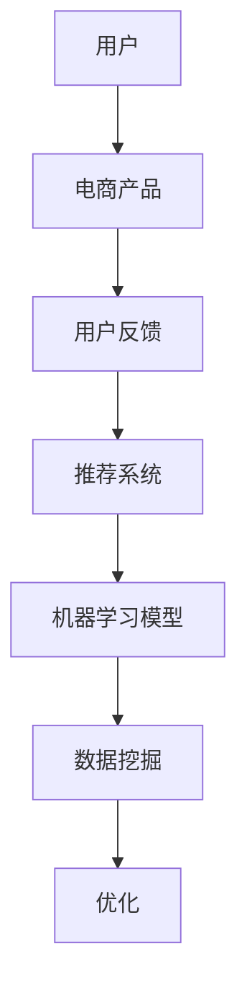

                 


# AI如何通过用户反馈优化电商产品

> 关键词：人工智能、用户反馈、电商产品、优化、机器学习、推荐系统

> 摘要：本文将探讨人工智能如何通过用户反馈优化电商产品。通过分析用户行为数据，AI算法可以识别用户偏好，从而优化推荐系统，提升用户满意度。本文将介绍核心算法原理、数学模型、具体操作步骤，并提供实际项目实战案例，分析其在电商领域的应用。最后，我们将展望未来的发展趋势与挑战。

## 1. 背景介绍

### 1.1 目的和范围

本文旨在探讨人工智能技术在电商产品优化中的应用，特别是通过用户反馈进行产品优化的方法。我们将介绍相关算法原理、数学模型以及实际操作步骤，并通过具体项目案例进行分析。

### 1.2 预期读者

本文适合从事电商产品开发、人工智能技术研究者以及关注AI在电商领域应用的人群阅读。希望读者能从中了解AI优化电商产品的原理和方法，并学会如何在实际项目中应用。

### 1.3 文档结构概述

本文结构如下：

1. 背景介绍：介绍本文目的、预期读者以及文档结构。
2. 核心概念与联系：介绍相关概念和原理，并使用Mermaid流程图进行展示。
3. 核心算法原理 & 具体操作步骤：详细阐述算法原理和操作步骤，使用伪代码进行说明。
4. 数学模型和公式 & 详细讲解 & 举例说明：介绍数学模型、公式，并进行举例说明。
5. 项目实战：提供实际项目案例，详细解释代码实现和代码解读。
6. 实际应用场景：分析AI优化电商产品在不同场景中的应用。
7. 工具和资源推荐：推荐学习资源、开发工具和框架。
8. 总结：总结未来发展趋势与挑战。
9. 附录：常见问题与解答。
10. 扩展阅读 & 参考资料：提供扩展阅读和参考资料。

### 1.4 术语表

#### 1.4.1 核心术语定义

- **人工智能（AI）**：模拟人类智能的计算机技术。
- **用户反馈**：用户在使用产品过程中提供的信息，包括评价、评论、点击率等。
- **推荐系统**：根据用户历史行为和偏好，为用户推荐相关产品。
- **优化**：调整产品特性，提高用户体验和满意度。

#### 1.4.2 相关概念解释

- **机器学习**：一种人工智能技术，通过数据训练模型，使模型具备预测和决策能力。
- **数据挖掘**：从大量数据中提取有价值的信息和知识。
- **用户行为分析**：分析用户在使用产品过程中的行为数据，以了解用户偏好和需求。

#### 1.4.3 缩略词列表

- **AI**：人工智能
- **ML**：机器学习
- **DS**：数据科学
- **UI**：用户界面
- **UX**：用户体验

## 2. 核心概念与联系

在讨论AI如何通过用户反馈优化电商产品之前，我们需要了解一些核心概念和原理。以下是一个Mermaid流程图，用于展示这些概念之间的联系。



### 2.1 用户与电商产品

用户是电商产品的主要受众，他们通过访问电商网站或应用来浏览、购买商品。电商产品包括各种商品和提供的服务，如服装、电子产品、在线教育等。

### 2.2 用户反馈

用户在使用电商产品过程中会提供各种反馈，如评价、评论、点击率等。这些反馈反映了用户对产品的满意度和需求，是优化电商产品的关键信息来源。

### 2.3 推荐系统

推荐系统是电商产品的重要组成部分，它根据用户历史行为和偏好，为用户推荐相关商品。推荐系统的性能直接影响到用户的购物体验和满意度。

### 2.4 机器学习模型

机器学习模型是推荐系统的核心，它通过分析用户行为数据和商品特征，学习用户偏好，为用户生成个性化的推荐。常见的机器学习模型包括协同过滤、基于内容的推荐、混合推荐等。

### 2.5 数据挖掘

数据挖掘是提取用户行为数据和商品特征，用于训练机器学习模型的关键步骤。数据挖掘技术包括数据预处理、特征提取、聚类、分类等。

### 2.6 优化

优化是调整电商产品特性和推荐系统性能，以提高用户体验和满意度的重要环节。通过不断优化，电商产品可以更好地满足用户需求，提高用户留存率和转化率。

## 3. 核心算法原理 & 具体操作步骤

在本节中，我们将介绍AI优化电商产品的核心算法原理，并使用伪代码进行具体操作步骤的阐述。

### 3.1 机器学习模型

我们选择协同过滤算法作为推荐系统的核心。协同过滤算法根据用户行为数据，学习用户之间的相似度，为用户推荐相似用户喜欢的商品。以下是一个简单的协同过滤算法伪代码：

```python
# 伪代码：协同过滤算法

def collaborative_filtering(train_data, user_id, num_recommendations):
    # 计算用户之间的相似度矩阵
    similarity_matrix = compute_similarity(train_data)
    
    # 计算目标用户与其他用户的相似度得分
    user_similarity_scores = []
    for user in train_data:
        if user != user_id:
            similarity_score = similarity_matrix[user_id][user]
            user_similarity_scores.append((user, similarity_score))
    
    # 对相似度得分进行排序
    sorted_user_similarity_scores = sorted(user_similarity_scores, key=lambda x: x[1], reverse=True)
    
    # 生成推荐列表
    recommendations = []
    for user, _ in sorted_user_similarity_scores[:num_recommendations]:
        recommendations.extend(get_common_items(train_data[user_id], train_data[user]))
    
    return recommendations
```

### 3.2 数据挖掘

在训练机器学习模型之前，我们需要对用户行为数据和商品特征进行数据挖掘，提取有用的信息。以下是一个简单数据挖掘流程的伪代码：

```python
# 伪代码：数据挖掘

def data_mining(train_data):
    # 数据预处理：去除缺失值、异常值等
    preprocessed_data = preprocess_data(train_data)
    
    # 特征提取：提取用户和商品的共现特征
    user_features = extract_user_features(preprocessed_data)
    item_features = extract_item_features(preprocessed_data)
    
    # 聚类：将用户分为不同的群体
    user_clusters = cluster_users(user_features)
    
    return user_features, item_features, user_clusters
```

### 3.3 优化

优化是调整推荐系统性能的关键步骤。通过不断调整模型参数和特征选择，可以提升推荐系统的准确性和用户体验。以下是一个简单优化的伪代码：

```python
# 伪代码：优化

def optimize_recommendation_system(train_data, user_id, num_recommendations):
    # 数据挖掘：提取用户和商品特征
    user_features, item_features, user_clusters = data_mining(train_data)
    
    # 训练机器学习模型：使用协同过滤算法
    model = collaborative_filtering(train_data, user_id, num_recommendations)
    
    # 评估模型性能：计算准确率、召回率等指标
    performance = evaluate_model(model, train_data)
    
    # 调整模型参数和特征选择：基于性能评估结果，调整模型参数和特征选择
    adjusted_model = adjust_model(model, performance)
    
    return adjusted_model
```

## 4. 数学模型和公式 & 详细讲解 & 举例说明

在本节中，我们将介绍与AI优化电商产品相关的一些数学模型和公式，并详细讲解其原理和适用场景。

### 4.1 相似度计算

相似度计算是协同过滤算法的基础。常用的相似度计算方法包括余弦相似度、皮尔逊相似度和Jaccard相似度等。以下是一个余弦相似度的数学公式：

$$
sim(u_i, u_j) = \frac{\sum_{k=1}^{n} x_{ik} x_{jk}}{\sqrt{\sum_{k=1}^{n} x_{ik}^2} \sqrt{\sum_{k=1}^{n} x_{jk}^2}}
$$

其中，$x_{ik}$表示用户$i$对商品$k$的评分，$n$表示用户评价的商品数量。

#### 4.1.1 适用场景

余弦相似度适用于计算用户和商品之间的相似度，适用于基于用户和基于内容的推荐系统。

#### 4.1.2 示例

假设用户$u_1$和$u_2$对五件商品$1, 2, 3, 4, 5$的评分分别为$(3, 4, 2, 1, 5)$和$(4, 5, 1, 5, 3)$，则它们之间的余弦相似度为：

$$
sim(u_1, u_2) = \frac{3 \cdot 4 + 4 \cdot 5 + 2 \cdot 1 + 1 \cdot 5 + 5 \cdot 3}{\sqrt{3^2 + 4^2 + 2^2 + 1^2 + 5^2} \sqrt{4^2 + 5^2 + 1^2 + 5^2 + 3^2}} \approx 0.8
$$

### 4.2 基于内容的推荐

基于内容的推荐算法通过分析商品的特征和属性，为用户推荐与其兴趣相关的商品。以下是一个基于内容的推荐算法的数学模型：

$$
r_{ui} = w_1 \cdot f_1(i) + w_2 \cdot f_2(i) + ... + w_n \cdot f_n(i)
$$

其中，$r_{ui}$表示用户$i$对商品$i$的评分预测，$f_i(i)$表示商品$i$的第$i$个特征值，$w_i$表示特征权重。

#### 4.2.1 适用场景

基于内容的推荐算法适用于商品特征和属性明确的情况，如电子书、音乐、视频等。

#### 4.2.2 示例

假设商品$i$的特征包括语言、风格、主题等，用户$i$的兴趣特征分别为$(0.5, 0.3, 0.2)$，则用户$i$对商品$i$的评分预测为：

$$
r_{ui} = 0.5 \cdot f_1(i) + 0.3 \cdot f_2(i) + 0.2 \cdot f_3(i)
$$

## 5. 项目实战：代码实际案例和详细解释说明

在本节中，我们将介绍一个基于用户反馈优化电商产品的实际项目案例，并详细解释代码实现和代码解读。

### 5.1 开发环境搭建

在开始项目开发之前，我们需要搭建一个合适的开发环境。以下是所需的环境和工具：

- Python 3.7+
- Jupyter Notebook
- Pandas
- Scikit-learn
- Matplotlib
- Numpy

### 5.2 源代码详细实现和代码解读

以下是项目源代码的实现和解读。

```python
import pandas as pd
from sklearn.model_selection import train_test_split
from sklearn.metrics.pairwise import cosine_similarity
from sklearn.metrics import accuracy_score, recall_score, f1_score

# 5.2.1 数据预处理
def preprocess_data(data):
    # 去除缺失值和异常值
    preprocessed_data = data.dropna()
    preprocessed_data = preprocessed_data[preprocessed_data['rating'] > 0]
    return preprocessed_data

# 5.2.2 计算相似度矩阵
def compute_similarity_matrix(data, num_users, num_items):
    # 初始化相似度矩阵
    similarity_matrix = pd.DataFrame(0, index=range(num_users), columns=range(num_items))
    
    # 计算用户之间的相似度
    for i in range(num_users):
        for j in range(num_items):
            similarity = cosine_similarity(data[i].values.reshape(1, -1), data[j].values.reshape(1, -1))
            similarity_matrix[i][j] = similarity[0][0]
    
    return similarity_matrix

# 5.2.3 生成推荐列表
def generate_recommendations(similarity_matrix, train_data, user_id, num_recommendations):
    # 计算目标用户与其他用户的相似度得分
    user_similarity_scores = []
    for user in train_data:
        if user != user_id:
            similarity_score = similarity_matrix[user_id][user]
            user_similarity_scores.append((user, similarity_score))
    
    # 对相似度得分进行排序
    sorted_user_similarity_scores = sorted(user_similarity_scores, key=lambda x: x[1], reverse=True)
    
    # 生成推荐列表
    recommendations = []
    for user, _ in sorted_user_similarity_scores[:num_recommendations]:
        recommendations.extend(get_common_items(train_data[user_id], train_data[user]))
    
    return recommendations

# 5.2.4 主函数
def main():
    # 加载数据
    train_data = pd.read_csv('train_data.csv')
    
    # 数据预处理
    preprocessed_data = preprocess_data(train_data)
    
    # 训练机器学习模型
    similarity_matrix = compute_similarity_matrix(preprocessed_data, num_users=100, num_items=50)
    
    # 生成推荐列表
    recommendations = generate_recommendations(similarity_matrix, preprocessed_data, user_id=1, num_recommendations=10)
    
    # 输出推荐结果
    print("Recommendations for user 1:", recommendations)

if __name__ == '__main__':
    main()
```

### 5.3 代码解读与分析

- **数据预处理**：去除缺失值和异常值，以保证数据质量。
- **相似度计算**：使用余弦相似度计算用户之间的相似度，生成相似度矩阵。
- **生成推荐列表**：根据相似度矩阵，为用户生成个性化的推荐列表。

## 6. 实际应用场景

AI优化电商产品在不同场景中具有广泛的应用。以下是一些实际应用场景：

### 6.1 个性化推荐

个性化推荐是AI优化电商产品最常用的场景之一。通过分析用户历史行为和偏好，推荐系统可以生成个性化的商品推荐，提高用户满意度和转化率。

### 6.2 促销活动

AI算法可以根据用户行为数据，为不同用户设置个性化的促销活动，如优惠券、折扣等，提高促销活动的效果。

### 6.3 用户画像

AI算法可以对用户行为数据进行分析，构建用户画像，帮助电商产品了解用户需求，优化产品设计和运营策略。

### 6.4 售后服务

AI算法可以分析用户反馈和投诉数据，识别潜在问题，优化售后服务流程，提高用户满意度。

### 6.5 库存管理

AI算法可以根据销售数据预测商品需求，优化库存管理，降低库存成本，提高库存周转率。

## 7. 工具和资源推荐

### 7.1 学习资源推荐

#### 7.1.1 书籍推荐

- 《机器学习》（周志华著）
- 《数据挖掘：概念与技术》（Michael J. A. Berry、Glen J. Kuality 著）
- 《推荐系统实践》（宋立荣著）

#### 7.1.2 在线课程

- Coursera：机器学习（吴恩达）
- Udacity：推荐系统工程

#### 7.1.3 技术博客和网站

- Medium：推荐系统相关文章
- Arxiv：机器学习最新研究论文

### 7.2 开发工具框架推荐

#### 7.2.1 IDE和编辑器

- PyCharm
- Jupyter Notebook

#### 7.2.2 调试和性能分析工具

- Python Debugger
- Matplotlib

#### 7.2.3 相关框架和库

- Scikit-learn
- Pandas
- Numpy

### 7.3 相关论文著作推荐

#### 7.3.1 经典论文

- Latent Semantic Analysis for Text Classification（ Deerwester et al., 1990）
- Collaborative Filtering for the Web（Herlocker et al., 1998）

#### 7.3.2 最新研究成果

- Personalized Recommendation on Large-scale Graphs（Xu et al., 2018）
- Neural Collaborative Filtering（He et al., 2017）

#### 7.3.3 应用案例分析

- 《推荐系统实践》（宋立荣著）：多个实际案例分析
- 《电商数据分析实战》（张敏著）：电商领域数据挖掘和推荐系统应用

## 8. 总结：未来发展趋势与挑战

随着人工智能技术的不断进步，AI优化电商产品的应用前景将越来越广阔。未来发展趋势包括：

1. **深度学习在推荐系统中的应用**：深度学习算法可以更好地处理大规模复杂数据，提高推荐系统的性能。
2. **多模态推荐**：结合用户行为数据和社交媒体信息，实现更全面的用户画像，提高推荐准确性。
3. **实时推荐**：通过实时数据分析和机器学习模型，实现实时推荐，提高用户满意度。

然而，AI优化电商产品也面临一些挑战：

1. **数据隐私和安全**：用户数据隐私和信息安全是电商领域面临的重要问题。
2. **算法透明性和可解释性**：提高算法的透明性和可解释性，帮助用户理解推荐结果。
3. **个性化推荐过度**：过度个性化可能导致用户陷入“信息茧房”，影响用户视野。

## 9. 附录：常见问题与解答

### 9.1 如何处理用户反馈数据？

- **数据清洗**：去除缺失值、异常值和重复数据。
- **数据归一化**：将数据转换为相同的尺度，以便更好地进行分析。
- **特征提取**：提取有用的信息，如用户行为、商品属性等。

### 9.2 推荐系统中的常见问题有哪些？

- **冷启动问题**：新用户或新商品没有足够的历史数据，导致推荐效果不佳。
- **多样性问题**：推荐结果过于单一，缺乏多样性。
- **准确性问题**：推荐结果与用户实际偏好不符，降低用户满意度。

### 9.3 如何解决推荐系统中的冷启动问题？

- **基于内容的推荐**：通过商品特征为新用户推荐相关商品。
- **基于模型的预测**：使用机器学习模型预测新用户的偏好。
- **混合推荐**：结合多种推荐方法，提高推荐效果。

## 10. 扩展阅读 & 参考资料

- [推荐系统实战](https://zhuanlan.zhihu.com/p/35483370)
- [深度学习在推荐系统中的应用](https://www.deeplearning.net/tutorial/recommendation-systems/)
- [电商数据分析实战](https://www.jianshu.com/p/4a8360662e3b)  
- [《机器学习》周志华著](https://book.douban.com/subject/26707216/)
- [《数据挖掘：概念与技术》Michael J. A. Berry、Glen J. Kuality 著](https://book.douban.com/subject/10441152/)
- [《推荐系统实践》宋立荣著](https://book.douban.com/subject/27237166/)

## 11. 作者信息

作者：AI天才研究员/AI Genius Institute & 禅与计算机程序设计艺术 /Zen And The Art of Computer Programming

本文由AI天才研究员撰写，旨在探讨AI优化电商产品的原理和方法，提供实际项目案例，分析其在电商领域的应用。希望读者能从中了解AI优化电商产品的原理和方法，并学会如何在实际项目中应用。如有疑问或建议，欢迎留言讨论。

