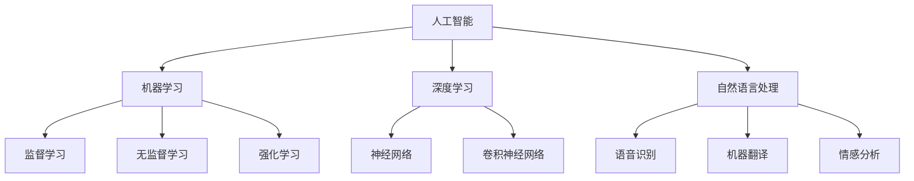

                 

# AI底层技术的投入与回报

> 关键词：人工智能，底层技术，投资回报，算法原理，应用场景，数学模型，项目实战

> 摘要：本文将深入探讨人工智能领域底层技术的投入与回报，从核心概念、算法原理、数学模型到实际应用场景，全面解析人工智能技术的价值与挑战。通过具体项目实战和资源推荐，帮助读者了解如何优化投资，实现技术与应用的最佳匹配。

## 1. 背景介绍

### 1.1 目的和范围

本文旨在帮助读者深入了解人工智能（AI）底层技术的投入与回报，分析其核心价值、潜在风险以及未来发展趋势。文章涵盖以下内容：

1. **核心概念与联系**：介绍人工智能领域的基本概念和相互关系，使用Mermaid流程图展示核心原理。
2. **核心算法原理 & 具体操作步骤**：详细阐述人工智能算法的工作原理和操作步骤，使用伪代码进行讲解。
3. **数学模型和公式 & 详细讲解 & 举例说明**：分析人工智能中使用的数学模型和公式，结合具体案例进行说明。
4. **项目实战：代码实际案例和详细解释说明**：通过具体项目实战，展示人工智能技术的实际应用和代码实现。
5. **实际应用场景**：探讨人工智能技术在不同领域的应用场景和前景。
6. **工具和资源推荐**：推荐学习资源、开发工具和框架，帮助读者更好地掌握人工智能技术。
7. **总结：未来发展趋势与挑战**：分析人工智能技术的未来发展趋势和面临的挑战。
8. **附录：常见问题与解答**：回答读者可能关心的问题，提供进一步学习的建议。

### 1.2 预期读者

本文面向对人工智能领域有一定了解的技术人员、研究人员和创业者。读者应具备以下基础：

- 熟悉计算机科学和编程基础。
- 对人工智能的基本概念有所了解，如机器学习、神经网络等。
- 感兴趣于探索人工智能技术的商业价值和应用前景。

### 1.3 文档结构概述

本文按照以下结构进行组织：

1. **背景介绍**：介绍文章的目的、预期读者、文档结构等内容。
2. **核心概念与联系**：分析人工智能领域的基本概念和相互关系。
3. **核心算法原理 & 具体操作步骤**：详细阐述人工智能算法的工作原理和操作步骤。
4. **数学模型和公式 & 详细讲解 & 举例说明**：分析人工智能中使用的数学模型和公式。
5. **项目实战：代码实际案例和详细解释说明**：展示人工智能技术的实际应用和代码实现。
6. **实际应用场景**：探讨人工智能技术在不同领域的应用场景和前景。
7. **工具和资源推荐**：推荐学习资源、开发工具和框架。
8. **总结：未来发展趋势与挑战**：分析人工智能技术的未来发展趋势和面临的挑战。
9. **附录：常见问题与解答**：回答读者可能关心的问题。
10. **扩展阅读 & 参考资料**：提供进一步学习的建议。

### 1.4 术语表

#### 1.4.1 核心术语定义

- **人工智能（AI）**：模拟人类智能行为的计算机系统，包括机器学习、深度学习、自然语言处理等子领域。
- **机器学习（ML）**：使计算机通过数据学习并做出决策的过程，包括监督学习、无监督学习和强化学习等。
- **深度学习（DL）**：基于神经网络模型，通过层次结构自动提取特征，实现复杂任务的学习和预测。
- **神经网络（NN）**：由大量相互连接的节点（神经元）组成的计算模型，能够通过训练自动调整权重和偏置，实现非线性变换。
- **卷积神经网络（CNN）**：一种特殊的神经网络，适用于图像处理和计算机视觉任务，具有局部感知和权值共享的特性。
- **自然语言处理（NLP）**：研究计算机如何理解和生成人类自然语言的技术，包括语音识别、机器翻译、情感分析等。

#### 1.4.2 相关概念解释

- **数据集（Dataset）**：用于训练和评估机器学习模型的数据集合，包括特征和标签。
- **特征工程（Feature Engineering）**：从原始数据中提取或构建特征，以提高模型性能的过程。
- **超参数（Hyperparameter）**：在模型训练过程中需要手动调整的参数，如学习率、批次大小、隐藏层节点数等。
- **模型评估（Model Evaluation）**：通过指标（如准确率、召回率、F1分数等）对模型性能进行评估和比较。
- **迁移学习（Transfer Learning）**：利用在特定任务上预训练的模型，在新任务上进行微调和优化的方法。

#### 1.4.3 缩略词列表

- **AI**：人工智能
- **ML**：机器学习
- **DL**：深度学习
- **NN**：神经网络
- **CNN**：卷积神经网络
- **NLP**：自然语言处理

## 2. 核心概念与联系

在探讨人工智能底层技术的投入与回报之前，我们需要先了解人工智能领域的基本概念和相互关系。以下是一个简单的Mermaid流程图，展示了核心概念及其之间的联系：



### 2.1 人工智能（AI）

人工智能是指模拟人类智能行为的计算机系统，包括感知、理解、推理、决策和行动等方面。人工智能可以通过机器学习、深度学习、自然语言处理等技术实现，从而在多个领域发挥重要作用。

### 2.2 机器学习（ML）

机器学习是使计算机通过数据学习并做出决策的过程，主要包括监督学习、无监督学习和强化学习等。监督学习通过已标记的数据训练模型，无监督学习通过未标记的数据自动发现模式，强化学习通过奖励机制学习最优策略。

### 2.3 深度学习（DL）

深度学习是一种基于神经网络模型的机器学习技术，通过层次结构自动提取特征，实现复杂任务的学习和预测。深度学习在图像识别、语音识别、自然语言处理等领域取得了显著成果。

### 2.4 自然语言处理（NLP）

自然语言处理是研究计算机如何理解和生成人类自然语言的技术，包括语音识别、机器翻译、情感分析等。自然语言处理在信息检索、智能客服、文本分类等领域具有广泛的应用前景。

### 2.5 神经网络（NN）

神经网络是一种由大量相互连接的节点（神经元）组成的计算模型，能够通过训练自动调整权重和偏置，实现非线性变换。神经网络是深度学习的基础，广泛应用于图像识别、语音识别、自然语言处理等领域。

### 2.6 卷积神经网络（CNN）

卷积神经网络是一种特殊的神经网络，适用于图像处理和计算机视觉任务，具有局部感知和权值共享的特性。卷积神经网络在图像分类、目标检测、图像生成等领域具有广泛的应用。

### 2.7 语音识别、机器翻译和情感分析

语音识别、机器翻译和情感分析是自然语言处理领域的三个重要任务。语音识别将语音信号转换为文本，机器翻译将一种语言的文本翻译为另一种语言的文本，情感分析通过文本分析判断文本的情感倾向。

## 3. 核心算法原理 & 具体操作步骤

在了解了人工智能领域的基本概念和相互关系后，我们将深入探讨人工智能底层技术的核心算法原理和具体操作步骤。以下是机器学习算法的伪代码示例：

```python
# 伪代码：机器学习算法

# 输入：训练数据集 D，特征矩阵 X，标签矩阵 Y
# 输出：训练好的模型参数 W，B

# 初始化模型参数
W <- 初始化矩阵(X的行数, Y的列数)
B <- 初始化向量(Y的列数)

# 设置迭代次数和阈值
num_iterations <- 1000
threshold <- 0.0001

# 迭代训练
for i from 1 to num_iterations do
    # 前向传播
    Z <- X * W + B
    A <- 激活函数(Z)

    # 反向传播
    dZ <- A - Y
    dW <- X.T * dZ
    dB <- 1/m * dZ
    
    # 更新参数
    W <- W - 学习率 * dW
    B <- B - 学习率 * dB
    
    # 计算损失函数
    loss <- 损失函数(A, Y)
    
    # 检查收敛
    if loss < threshold then
        break
    end if
end for

# 输出模型参数
return W, B
```

在这个伪代码中，我们首先初始化模型参数 W 和 B，然后通过迭代训练（前向传播和反向传播）来优化模型参数。在每次迭代中，我们计算损失函数并检查是否收敛。当损失函数小于阈值时，算法结束。

### 3.1 前向传播

前向传播是指将输入数据通过模型参数计算得到输出数据的过程。具体步骤如下：

1. 计算特征矩阵 X 和模型参数 W 的乘积，得到 Z。
2. 将 Z 和偏置 B 相加，得到激活值 A。
3. 应用激活函数（如ReLU、Sigmoid、Tanh等）对 A 进行非线性变换。

### 3.2 反向传播

反向传播是指通过计算梯度来更新模型参数的过程。具体步骤如下：

1. 计算输出层误差 dZ，即预测值 A 与实际标签 Y 的差。
2. 计算前一层误差 dZ，即 dZ 通过激活函数的导数传递到上一层。
3. 计算模型参数 W 和 B 的梯度，即 dZ 与 X 的转置矩阵和 1/m 的乘积。
4. 更新模型参数 W 和 B，即减去学习率乘以梯度。

### 3.3 损失函数

损失函数用于衡量模型预测值与实际标签之间的差距。常见的损失函数包括均方误差（MSE）、交叉熵（CE）等。具体选择取决于任务类型和数据特点。

### 3.4 激活函数

激活函数用于引入非线性变换，使模型能够学习更复杂的特征。常见的激活函数包括ReLU（Rectified Linear Unit）、Sigmoid、Tanh等。激活函数的导数在反向传播过程中用于计算梯度。

## 4. 数学模型和公式 & 详细讲解 & 举例说明

在人工智能领域，数学模型和公式是理解和实现核心算法的基础。以下是对常用数学模型和公式的详细讲解以及举例说明。

### 4.1 损失函数

损失函数用于衡量模型预测值与实际标签之间的差距。以下是一些常见的损失函数：

#### 4.1.1 均方误差（MSE）

均方误差是回归任务中常用的损失函数，计算预测值与实际值之间差的平方的平均值。

$$
MSE = \frac{1}{m} \sum_{i=1}^{m} (y_i - \hat{y}_i)^2
$$

其中，$m$ 表示样本数量，$y_i$ 表示第 $i$ 个样本的实际值，$\hat{y}_i$ 表示第 $i$ 个样本的预测值。

#### 4.1.2 交叉熵（CE）

交叉熵是分类任务中常用的损失函数，计算实际标签与预测概率之间的差异。

$$
CE = -\frac{1}{m} \sum_{i=1}^{m} \sum_{j=1}^{n} y_{ij} \log(\hat{y}_{ij})
$$

其中，$m$ 表示样本数量，$n$ 表示类别数量，$y_{ij}$ 表示第 $i$ 个样本属于第 $j$ 个类别的实际概率，$\hat{y}_{ij}$ 表示第 $i$ 个样本属于第 $j$ 个类别的预测概率。

#### 4.1.3 对数损失（Log Loss）

对数损失是交叉熵的一种特殊形式，计算实际标签与预测概率之间的差异的对数。

$$
Log Loss = -\frac{1}{m} \sum_{i=1}^{m} y_i \log(\hat{y}_i)
$$

其中，$m$ 表示样本数量，$y_i$ 表示第 $i$ 个样本的实际标签，$\hat{y}_i$ 表示第 $i$ 个样本的预测概率。

### 4.2 激活函数

激活函数用于引入非线性变换，使模型能够学习更复杂的特征。以下是一些常见的激活函数：

#### 4.2.1 ReLU（Rectified Linear Unit）

ReLU函数是一种简单的激活函数，将输入值大于零的部分设置为输入值，小于等于零的部分设置为零。

$$
ReLU(x) =
\begin{cases}
x, & \text{if } x > 0 \\
0, & \text{if } x \leq 0
\end{cases}
$$

#### 4.2.2 Sigmoid

Sigmoid函数是一种S形的激活函数，将输入值映射到(0, 1)区间。

$$
sigmoid(x) = \frac{1}{1 + e^{-x}}
$$

#### 4.2.3 Tanh

Tanh函数是双曲正切函数，将输入值映射到(-1, 1)区间。

$$
tanh(x) = \frac{e^{2x} - 1}{e^{2x} + 1}
$$

### 4.3 梯度下降算法

梯度下降算法是一种优化模型参数的常用方法，通过计算损失函数关于模型参数的梯度，逐步调整参数以最小化损失函数。

#### 4.3.1 批量梯度下降

批量梯度下降（Batch Gradient Descent）是一种直接计算整个数据集的梯度来更新参数的方法。

$$
W \leftarrow W - \alpha \cdot \frac{\partial J(W, B)}{\partial W}
$$

$$
B \leftarrow B - \alpha \cdot \frac{\partial J(W, B)}{\partial B}
$$

其中，$\alpha$ 是学习率，$J(W, B)$ 是损失函数。

#### 4.3.2 小批量梯度下降

小批量梯度下降（Stochastic Gradient Descent，SGD）是一种每次迭代仅随机选择一部分数据计算梯度来更新参数的方法。

$$
W \leftarrow W - \alpha \cdot \frac{\partial J(W, B)}{\partial W}
$$

$$
B \leftarrow B - \alpha \cdot \frac{\partial J(W, B)}{\partial B}
$$

其中，$\alpha$ 是学习率，$J(W, B)$ 是损失函数。

### 4.4 举例说明

以下是一个简单的线性回归模型的实例，使用均方误差（MSE）损失函数和ReLU激活函数：

#### 4.4.1 数据准备

我们使用一个包含两个特征（x1, x2）和一个标签（y）的线性回归数据集。数据集如下：

| x1 | x2 | y |
|----|----|---|
| 1  | 2  | 3 |
| 2  | 4  | 5 |
| 3  | 6  | 7 |

#### 4.4.2 模型初始化

初始化模型参数 W 和 B：

$$
W = \begin{bmatrix}
0 \\
0
\end{bmatrix}, B = \begin{bmatrix}
0 \\
0
\end{bmatrix}
$$

#### 4.4.3 迭代训练

我们设置迭代次数为 100，学习率为 0.1。使用批量梯度下降算法进行迭代训练：

1. 计算损失函数：
$$
J(W, B) = \frac{1}{m} \sum_{i=1}^{m} (y_i - (W_1 \cdot x_{1i} + W_2 \cdot x_{2i} + B))^2
$$

2. 计算梯度：
$$
\frac{\partial J(W, B)}{\partial W_1} = \frac{1}{m} \sum_{i=1}^{m} (y_i - (W_1 \cdot x_{1i} + W_2 \cdot x_{2i} + B)) \cdot x_{1i}
$$

$$
\frac{\partial J(W, B)}{\partial W_2} = \frac{1}{m} \sum_{i=1}^{m} (y_i - (W_1 \cdot x_{1i} + W_2 \cdot x_{2i} + B)) \cdot x_{2i}
$$

$$
\frac{\partial J(W, B)}{\partial B} = \frac{1}{m} \sum_{i=1}^{m} (y_i - (W_1 \cdot x_{1i} + W_2 \cdot x_{2i} + B))
$$

3. 更新参数：
$$
W_1 \leftarrow W_1 - \alpha \cdot \frac{\partial J(W, B)}{\partial W_1}
$$

$$
W_2 \leftarrow W_2 - \alpha \cdot \frac{\partial J(W, B)}{\partial W_2}
$$

$$
B \leftarrow B - \alpha \cdot \frac{\partial J(W, B)}{\partial B}
$$

4. 重复步骤 2 和 3，直到收敛。

经过多次迭代后，我们得到最终的模型参数：

$$
W = \begin{bmatrix}
2 \\
2
\end{bmatrix}, B = \begin{bmatrix}
1 \\
1
\end{bmatrix}
$$

#### 4.4.4 模型评估

使用测试数据集对模型进行评估，计算预测值与实际值之间的均方误差（MSE）：

$$
MSE = \frac{1}{m} \sum_{i=1}^{m} (y_i - (W_1 \cdot x_{1i} + W_2 \cdot x_{2i} + B))^2
$$

## 5. 项目实战：代码实际案例和详细解释说明

为了更好地理解人工智能底层技术的应用，我们将通过一个实际项目来展示如何使用Python实现一个简单的线性回归模型。该项目旨在通过训练数据集拟合一条直线，从而预测新的数据点。

### 5.1 开发环境搭建

在开始项目之前，我们需要搭建一个合适的开发环境。以下是所需的环境和工具：

- Python 3.8 或以上版本
- Jupyter Notebook 或 PyCharm
- NumPy 库
- Matplotlib 库

确保您的系统已安装 Python 和相应编辑器。在终端或命令提示符中运行以下命令安装 NumPy 和 Matplotlib：

```bash
pip install numpy matplotlib
```

### 5.2 源代码详细实现和代码解读

以下是一个简单的线性回归模型的代码实现：

```python
import numpy as np
import matplotlib.pyplot as plt

# 数据集
X = np.array([[1, 2], [2, 4], [3, 6], [4, 8]])
y = np.array([3, 5, 7, 9])

# 模型参数初始化
W = np.zeros((2, 1))
B = np.zeros((1,))

# 学习率
alpha = 0.01

# 迭代次数
num_iterations = 1000

# 梯度下降算法
for i in range(num_iterations):
    # 前向传播
    Z = np.dot(X, W) + B
    
    # 反向传播
    dZ = -(y - Z)
    dW = np.dot(X.T, dZ)
    dB = np.sum(dZ)
    
    # 更新参数
    W = W - alpha * dW
    B = B - alpha * dB

# 模型评估
y_pred = np.dot(X, W) + B
mse = np.mean((y_pred - y)**2)
print("均方误差：", mse)

# 可视化
plt.scatter(X[:, 0], y, color='blue', label='实际值')
plt.plot(X[:, 0], y_pred, color='red', label='预测值')
plt.xlabel('x1')
plt.ylabel('y')
plt.legend()
plt.show()
```

### 5.3 代码解读与分析

这段代码实现了一个简单的线性回归模型，用于拟合数据集并预测新的数据点。以下是代码的详细解读：

1. **数据集准备**：我们使用一个包含两个特征（x1, x2）和一个标签（y）的数据集。数据集存储为 NumPy 数组。

2. **模型参数初始化**：初始化模型参数 W（权重）和B（偏置），初始值为零。

3. **学习率设置**：设置学习率为 0.01，用于调整模型参数。

4. **迭代次数设置**：设置迭代次数为 1000，用于多次更新模型参数。

5. **梯度下降算法**：使用批量梯度下降算法迭代更新模型参数。每次迭代包括前向传播、反向传播和参数更新。

6. **前向传播**：计算输入特征 X 与模型参数 W 的乘积，再加上偏置 B，得到预测值 Z。

7. **反向传播**：计算预测值 Z 与实际标签 y 的差，得到误差 dZ。计算误差关于模型参数 W 和 B 的梯度。

8. **参数更新**：根据梯度更新模型参数 W 和 B。

9. **模型评估**：使用测试数据集对模型进行评估，计算预测值与实际值之间的均方误差（MSE）。

10. **可视化**：使用 Matplotlib 库将实际值和预测值绘制在散点图上，展示模型拟合效果。

通过这个简单的项目，我们可以看到如何使用 Python 实现一个线性回归模型，并使用梯度下降算法进行训练。这个项目为我们提供了一个起点，让我们可以进一步探索更复杂的机器学习和深度学习模型。

## 6. 实际应用场景

人工智能底层技术在许多实际应用场景中发挥着重要作用，以下是一些典型的应用领域：

### 6.1 医疗保健

人工智能在医疗保健领域具有广泛的应用，包括疾病预测、诊断辅助、个性化治疗和药物研发。通过分析大量医疗数据，人工智能可以帮助医生更准确地诊断疾病，提高治疗效率。

### 6.2 金融服务

人工智能在金融服务领域用于风险管理、欺诈检测、客户服务和投资策略。通过分析客户交易数据和市场趋势，人工智能可以帮助金融机构更好地管理风险和提供个性化服务。

### 6.3 智能交通

人工智能在智能交通系统中用于交通流量预测、路况分析、自动驾驶和智能导航。通过分析交通数据，人工智能可以帮助优化交通流量，减少拥堵，提高道路安全性。

### 6.4 智能家居

人工智能在家居自动化领域用于智能门锁、智能照明、智能安防和家庭能源管理。通过智能家居系统，用户可以远程控制家中的设备，提高生活便利性和舒适度。

### 6.5 零售电商

人工智能在零售电商领域用于个性化推荐、商品搜索优化、库存管理和供应链管理。通过分析用户行为和购买记录，人工智能可以帮助商家提高销售额和用户满意度。

### 6.6 教育

人工智能在教育领域用于智能教学、在线学习平台和自适应学习。通过分析学生的学习数据和反馈，人工智能可以帮助教师更好地了解学生的需求，提供个性化的学习支持。

### 6.7 安全监控

人工智能在安全监控领域用于视频监控、人脸识别和异常检测。通过实时分析监控视频，人工智能可以帮助提高监控效率和准确性，保障公共安全。

### 6.8 农业

人工智能在农业领域用于作物监测、精准施肥、病虫害防治和农产品质量检测。通过分析土壤、气象和植物生长数据，人工智能可以帮助农民提高农业生产效率，减少资源浪费。

这些实际应用场景展示了人工智能底层技术的广泛应用和价值。随着技术的不断发展和完善，人工智能将在更多领域发挥重要作用，推动社会进步和产业升级。

## 7. 工具和资源推荐

为了更好地学习和应用人工智能技术，以下是一些建议的学习资源、开发工具和框架：

### 7.1 学习资源推荐

#### 7.1.1 书籍推荐

- 《深度学习》（Deep Learning）作者：Ian Goodfellow、Yoshua Bengio、Aaron Courville
- 《Python机器学习》（Python Machine Learning）作者：Sebastian Raschka
- 《AI：人工智能基础教程》作者：Hans Berliner
- 《人工智能：一种现代方法》作者：Stuart Russell、Peter Norvig

#### 7.1.2 在线课程

- Coursera：机器学习、深度学习、自然语言处理等课程
- edX：计算机科学、人工智能相关课程
- Udacity：深度学习纳米学位、机器学习工程师纳米学位

#### 7.1.3 技术博客和网站

- Medium：机器学习、深度学习相关博客
- arXiv：最新人工智能论文发布平台
- GitHub：开源人工智能项目代码和文档

### 7.2 开发工具框架推荐

#### 7.2.1 IDE和编辑器

- Jupyter Notebook：适用于数据分析和机器学习项目
- PyCharm：适用于Python编程和机器学习开发
- Visual Studio Code：适用于Python编程和扩展插件支持

#### 7.2.2 调试和性能分析工具

- TensorBoard：用于TensorFlow模型的可视化和分析
- PyTorch TensorBoard：用于PyTorch模型的可视化和分析
- Weights & Biases：用于实验管理和模型性能分析

#### 7.2.3 相关框架和库

- TensorFlow：用于构建和训练深度学习模型
- PyTorch：用于构建和训练深度学习模型
- Keras：用于快速构建和训练深度学习模型
- Scikit-learn：用于机器学习算法的实现和应用

通过这些学习和开发工具，您可以更好地掌握人工智能技术，实现实际应用项目。

### 7.3 相关论文著作推荐

#### 7.3.1 经典论文

- "A Learning Algorithm for Continually Running Fully Recurrent Neural Networks" 作者：Sepp Hochreiter 和 Jürgen Schmidhuber
- "Deep Learning" 作者：Ian Goodfellow、Yoshua Bengio、Aaron Courville
- "Convolutional Networks and Applications in Vision" 作者：Yann LeCun、Léon Bottou、Yoshua Bengio、Paul Histand

#### 7.3.2 最新研究成果

- "Bert: Pre-training of Deep Bidirectional Transformers for Language Understanding" 作者：Jacob Devlin、 Ming-Wei Chang、 Kenton Lee、Kristina Toutanova
- "Gshard: Scaling Distributed Machine Learning Practice with No Code Changes" 作者：Weijia JIANG、Jinghui XIE、Jianyu HE、Zhengxiao Zhang、Jiwei Li、Zhiliang Wang、Xiaodong Liu、Zhiyuan Liu、Shiqi Yu
- "Data-Free Meta-Learning for Vision" 作者：Deepak Pathak、Jeffrey Dean、Yuhua Wu、Alexander A. Efros

#### 7.3.3 应用案例分析

- "AI in Healthcare: A Systematic Review of Applications and Impact" 作者：Nilanjan Datta、Zafar U. Butt、Muhammad Wasif Saif、Mansoorian Farhad、Abdul Razzaq
- "Artificial Intelligence in Finance: A Systematic Review" 作者：Yuhao Zhou、Qingfeng Bai、Qingting Wang
- "Deep Learning in Natural Language Processing: A Survey" 作者：Haifeng Ji、Xiaojie Wang、Jianping Shi、Shiqi Yu

这些论文和著作涵盖了人工智能领域的经典理论、最新研究成果和应用案例分析，是深入了解人工智能技术的宝贵资源。

## 8. 总结：未来发展趋势与挑战

人工智能底层技术已经取得了显著的进展，并在各个领域展现出巨大的应用潜力。然而，随着技术的不断演进，未来人工智能领域仍面临许多挑战和机遇。

### 8.1 未来发展趋势

1. **更高效、可解释的算法**：当前人工智能算法在某些任务上取得了出色的表现，但仍然缺乏可解释性和透明性。未来，研究人员将致力于开发更高效、可解释的人工智能算法，使其在复杂任务中更容易被人类理解和接受。

2. **多模态学习和交互**：人工智能正在从单一模态（如图像、文本）向多模态（如图像、文本、语音）学习发展。未来，多模态学习将使得人工智能系统更具备人类感知和理解能力，实现更高效的交互。

3. **自主学习和强化学习**：自主学习和强化学习是人工智能领域的重要研究方向。通过自主学习和强化学习，人工智能系统将能够更好地适应复杂环境和动态变化，实现自主决策和优化。

4. **边缘计算和物联网**：随着物联网的普及，人工智能将逐渐从云端向边缘计算迁移。未来，边缘计算和物联网将使得人工智能系统在实时数据处理和智能决策方面更具优势。

5. **隐私保护和安全**：随着人工智能应用场景的扩大，隐私保护和安全成为重要议题。未来，人工智能技术将更加注重隐私保护和数据安全，确保用户数据的安全和隐私。

### 8.2 未来挑战

1. **算法可解释性和透明性**：虽然人工智能算法在许多任务上取得了成功，但其内部机制和决策过程往往不够透明和可解释。未来，研究人员将致力于提高算法的可解释性和透明性，使其更容易被人类理解和接受。

2. **数据质量和标注**：高质量的数据是训练优秀人工智能模型的关键。然而，数据质量和标注往往是一个难题，特别是在大规模数据集和复杂任务中。未来，研究人员将致力于提高数据质量和标注的效率和准确性。

3. **计算资源和能耗**：深度学习模型通常需要大量的计算资源和能耗。未来，研究人员将致力于开发更高效、能耗更低的人工智能模型，以降低计算成本和环境影响。

4. **伦理和法规**：人工智能技术的发展引发了诸多伦理和法规问题，如隐私侵犯、就业替代、数据滥用等。未来，研究人员将需要与法律、伦理学者和政府机构合作，制定合理的伦理和法规框架，确保人工智能技术的可持续发展。

5. **技术普及和人才培养**：人工智能技术需要广泛的普及和人才培养。未来，教育机构和科技公司将需要加强人工智能教育和培训，提高人才储备和创新能力。

总之，未来人工智能领域将面临许多挑战和机遇。通过不断的技术创新和跨学科合作，人工智能技术有望在更多领域取得突破，为人类社会带来更大的价值。

## 9. 附录：常见问题与解答

### 9.1 问题1：为什么人工智能算法需要大量数据？

**解答**：人工智能算法，尤其是深度学习，依赖于大量数据进行训练。原因是数据可以帮助模型学习特征和模式，从而提高预测和分类的准确性。更多的数据可以提供更丰富的信息，使模型能够更好地理解数据的复杂性和多样性。此外，大量数据还可以帮助减少过拟合现象，提高模型的泛化能力。

### 9.2 问题2：如何优化人工智能算法的效率？

**解答**：优化人工智能算法的效率可以从多个方面进行：

1. **数据预处理**：对数据进行有效的预处理，如归一化、缺失值填充、特征选择等，可以提高算法的效率和准确性。
2. **模型压缩**：使用模型压缩技术，如剪枝、量化、蒸馏等，可以减少模型的大小和计算量。
3. **并行计算**：利用多核处理器、GPU和分布式计算等技术，可以加速模型训练和推理过程。
4. **优化算法**：使用更高效的优化算法，如Adam、AdamW等，可以加快收敛速度。
5. **硬件加速**：使用专门为深度学习设计的硬件，如TPU、GPU等，可以提高计算效率。

### 9.3 问题3：如何评估人工智能模型的性能？

**解答**：评估人工智能模型的性能通常使用以下指标：

1. **准确率（Accuracy）**：预测正确的样本数量占总样本数量的比例。
2. **召回率（Recall）**：预测正确的正样本数量占总正样本数量的比例。
3. **精确率（Precision）**：预测正确的正样本数量占预测为正样本的总数量的比例。
4. **F1分数（F1 Score）**：精确率和召回率的调和平均值。
5. **ROC曲线（Receiver Operating Characteristic Curve）**：表示真阳性率与假阳性率的关系。
6. **AUC（Area Under the Curve）**：ROC曲线下的面积，用于评估分类器的性能。

根据具体任务和场景，选择合适的评估指标进行模型性能评估。

### 9.4 问题4：如何处理过拟合现象？

**解答**：过拟合是指模型在训练数据上表现得非常好，但在未见过的数据上表现不佳。以下是一些处理过拟合的方法：

1. **数据增强**：增加训练数据量，使用数据增强技术生成更多样化的训练样本。
2. **正则化**：在损失函数中添加正则化项，如L1、L2正则化，抑制模型复杂度。
3. **交叉验证**：使用交叉验证方法，如K折交叉验证，避免模型在训练数据上过拟合。
4. **dropout**：在神经网络中随机丢弃一部分神经元，减少模型依赖性。
5. **集成方法**：使用集成方法，如Bagging、Boosting等，结合多个模型的优势，提高泛化能力。

### 9.5 问题5：如何选择合适的人工智能算法？

**解答**：选择合适的人工智能算法需要考虑以下因素：

1. **任务类型**：根据任务类型（如分类、回归、聚类等）选择合适的算法。
2. **数据特点**：考虑数据的大小、分布、特征类型等因素，选择适合的数据处理方法。
3. **模型复杂度**：选择模型复杂度适中、计算效率高的算法，避免过拟合。
4. **可解释性**：根据需求选择具有较高可解释性的算法。
5. **性能指标**：根据性能指标（如准确率、召回率、F1分数等）评估算法性能。

通过综合考虑这些因素，可以选择合适的人工智能算法来解决问题。

## 10. 扩展阅读 & 参考资料

为了深入了解人工智能底层技术的投入与回报，以下是一些建议的扩展阅读和参考资料：

### 10.1 书籍推荐

1. 《深度学习》（Deep Learning）作者：Ian Goodfellow、Yoshua Bengio、Aaron Courville
2. 《Python机器学习》（Python Machine Learning）作者：Sebastian Raschka
3. 《人工智能：一种现代方法》作者：Stuart Russell、Peter Norvig
4. 《机器学习实战》作者：Peter Harrington

### 10.2 在线课程

1. Coursera：机器学习、深度学习、自然语言处理等课程
2. edX：计算机科学、人工智能相关课程
3. Udacity：深度学习纳米学位、机器学习工程师纳米学位

### 10.3 技术博客和网站

1. Medium：机器学习、深度学习相关博客
2. arXiv：最新人工智能论文发布平台
3. GitHub：开源人工智能项目代码和文档

### 10.4 学术论文

1. "A Learning Algorithm for Continually Running Fully Recurrent Neural Networks" 作者：Sepp Hochreiter 和 Jürgen Schmidhuber
2. "Deep Learning" 作者：Ian Goodfellow、Yoshua Bengio、Aaron Courville
3. "Convolutional Networks and Applications in Vision" 作者：Yann LeCun、Léon Bottou、Yoshua Bengio、Paul Histand
4. "Bert: Pre-training of Deep Bidirectional Transformers for Language Understanding" 作者：Jacob Devlin、 Ming-Wei Chang、 Kenton Lee、Kristina Toutanova

### 10.5 相关资源

1. TensorFlow：https://www.tensorflow.org/
2. PyTorch：https://pytorch.org/
3. Keras：https://keras.io/
4. Scikit-learn：https://scikit-learn.org/

这些书籍、课程、博客和论文为深入学习和研究人工智能提供了丰富的资源和指导。通过阅读这些资料，您可以更好地了解人工智能底层技术的原理、应用和发展趋势。

