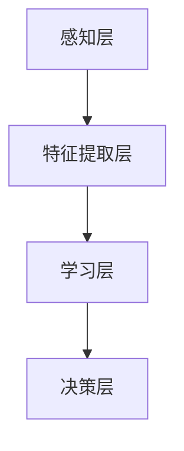

                 


# AI技术在不同领域的应用

> **关键词：** 人工智能，深度学习，计算机视觉，自然语言处理，领域应用，技术创新

> **摘要：** 本文将深入探讨人工智能（AI）技术在不同领域的应用，包括医疗、金融、教育、自动驾驶等，通过一步步的分析推理，揭示AI技术的核心原理、应用场景及未来发展趋势。

## 1. 背景介绍

### 1.1 目的和范围

本文旨在通过系统性地介绍和分析人工智能技术在不同领域的应用，帮助读者理解AI的核心原理及其在现实世界中的广泛应用。本文将聚焦于医疗、金融、教育、自动驾驶等四个具有代表性的领域，分别探讨AI在这些领域中的实际应用、挑战及解决方案。

### 1.2 预期读者

本文适合对人工智能技术有一定了解的读者，包括但不限于程序员、数据科学家、AI研究人员、高校师生及对AI技术感兴趣的一般读者。无论您是初学者还是资深专家，本文都希望为您带来新的启发和见解。

### 1.3 文档结构概述

本文分为十个部分，结构如下：

1. 背景介绍
   - 1.1 目的和范围
   - 1.2 预期读者
   - 1.3 文档结构概述
   - 1.4 术语表
2. 核心概念与联系
3. 核心算法原理 & 具体操作步骤
4. 数学模型和公式 & 详细讲解 & 举例说明
5. 项目实战：代码实际案例和详细解释说明
6. 实际应用场景
7. 工具和资源推荐
8. 总结：未来发展趋势与挑战
9. 附录：常见问题与解答
10. 扩展阅读 & 参考资料

### 1.4 术语表

#### 1.4.1 核心术语定义

- 人工智能（AI）：模拟人类智能行为的技术。
- 深度学习（DL）：一种基于多层神经网络的机器学习技术。
- 计算机视觉（CV）：使计算机能够像人类一样感知和理解视觉信息。
- 自然语言处理（NLP）：使计算机能够理解、解释和生成自然语言。

#### 1.4.2 相关概念解释

- 神经网络：一种模仿生物神经系统的计算模型。
- 数据集：用于训练和测试算法的样本集合。
- 模型评估：评估算法性能的过程。

#### 1.4.3 缩略词列表

- AI：人工智能
- DL：深度学习
- CV：计算机视觉
- NLP：自然语言处理

## 2. 核心概念与联系

### 2.1 人工智能技术概述

人工智能技术是一个广泛的概念，涵盖了多种技术和方法。核心包括：

- **机器学习（ML）**：通过数据驱动的方式改进算法性能。
- **深度学习（DL）**：基于多层神经网络的机器学习技术。
- **计算机视觉（CV）**：使计算机能够像人类一样感知和理解视觉信息。
- **自然语言处理（NLP）**：使计算机能够理解、解释和生成自然语言。

这些技术相互联系，共同构成了人工智能的技术体系。

### 2.2 人工智能技术架构

为了更好地理解人工智能技术，我们可以将其架构划分为以下几个层次：

1. **感知层**：通过传感器、摄像头等获取外部信息。
2. **特征提取层**：从感知层获取的信息中提取有用的特征。
3. **学习层**：使用机器学习和深度学习技术对特征进行训练。
4. **决策层**：根据学习到的模型做出决策。

以下是人工智能技术架构的Mermaid流程图：



### 2.3 核心算法原理

#### 2.3.1 机器学习

机器学习是人工智能的核心组成部分，主要分为监督学习、无监督学习和强化学习三种类型。

- **监督学习**：有标签数据训练模型，用于预测未知数据。
- **无监督学习**：没有标签数据，用于发现数据中的隐藏结构。
- **强化学习**：通过与环境的交互，学习最优策略。

以下是监督学习算法的伪代码：

```python
def supervised_learning(train_data, train_labels):
    # 初始化模型参数
    model = initialize_model()

    # 训练模型
    for epoch in range(num_epochs):
        for data, label in zip(train_data, train_labels):
            prediction = model(data)
            loss = compute_loss(prediction, label)
            update_model(model, loss)

    return model
```

#### 2.3.2 深度学习

深度学习是机器学习的一种重要方法，基于多层神经网络进行特征提取和模型训练。

- **前向传播**：将输入数据通过神经网络传递，计算输出。
- **反向传播**：计算输出误差，并反向传播更新模型参数。

以下是前向传播的伪代码：

```python
def forwardPropagation(input_data, model):
    # 初始化激活值和损失值
    activation_values = []
    loss_value = 0

    # 逐层传递数据
    for layer in model.layers:
        activation = layer.forward(input_data)
        activation_values.append(activation)
        input_data = activation

    # 计算损失
    loss_value = model.loss_function(activation_values[-1], target)

    return activation_values, loss_value
```

## 3. 核心算法原理 & 具体操作步骤

### 3.1 机器学习算法原理

机器学习算法基于以下步骤：

1. **数据预处理**：清洗、归一化、缺失值填充等操作。
2. **特征选择**：选择对预测目标有显著影响的特征。
3. **模型选择**：选择适合问题的机器学习算法。
4. **模型训练**：使用训练数据调整模型参数。
5. **模型评估**：使用验证数据评估模型性能。
6. **模型优化**：调整模型参数，提高性能。

以下是机器学习算法的具体操作步骤：

1. **数据预处理**：
   ```python
   # 示例：归一化
   normalized_data = (data - mean) / std
   ```

2. **特征选择**：
   ```python
   # 示例：特征选择
   selected_features = select_k_best_features(data, labels, k=10)
   ```

3. **模型选择**：
   ```python
   # 示例：选择线性回归模型
   model = LinearRegression()
   ```

4. **模型训练**：
   ```python
   # 示例：训练模型
   model.fit(selected_features, labels)
   ```

5. **模型评估**：
   ```python
   # 示例：评估模型
   accuracy = model.score(selected_features, labels)
   ```

6. **模型优化**：
   ```python
   # 示例：调整学习率
   model.learning_rate = 0.01
   ```

### 3.2 深度学习算法原理

深度学习算法基于以下步骤：

1. **网络架构设计**：设计多层神经网络。
2. **初始化参数**：初始化权重和偏置。
3. **前向传播**：将输入数据通过神经网络传递。
4. **损失函数计算**：计算输出误差。
5. **反向传播**：更新模型参数。
6. **模型评估**：评估模型性能。

以下是深度学习算法的具体操作步骤：

1. **网络架构设计**：
   ```python
   # 示例：定义多层神经网络
   model = Sequential()
   model.add(Dense(128, activation='relu', input_shape=(input_shape)))
   model.add(Dense(64, activation='relu'))
   model.add(Dense(1, activation='sigmoid'))
   ```

2. **初始化参数**：
   ```python
   # 示例：初始化权重和偏置
   model.init_weights()
   ```

3. **前向传播**：
   ```python
   # 示例：前向传播
   output = model.forward(input_data)
   ```

4. **损失函数计算**：
   ```python
   # 示例：计算交叉熵损失
   loss = -np.mean(y_true * np.log(y_pred) + (1 - y_true) * np.log(1 - y_pred))
   ```

5. **反向传播**：
   ```python
   # 示例：反向传播
   gradients = model.backward(loss)
   model.update_params(gradients)
   ```

6. **模型评估**：
   ```python
   # 示例：评估模型
   accuracy = model.evaluate(test_data, test_labels)
   ```

## 4. 数学模型和公式 & 详细讲解 & 举例说明

### 4.1 数学模型

在人工智能领域，数学模型是核心组成部分。以下是几种常见的数学模型及其公式：

#### 4.1.1 概率模型

概率模型用于描述数据的不确定性。最常用的概率模型是贝叶斯模型。

- **贝叶斯公式**：

  $$ P(A|B) = \frac{P(B|A) \cdot P(A)}{P(B)} $$

  - $P(A|B)$：在B发生的条件下A的概率。
  - $P(B|A)$：在A发生的条件下B的概率。
  - $P(A)$：A的先验概率。
  - $P(B)$：B的先验概率。

#### 4.1.2 线性回归模型

线性回归模型用于预测连续值输出。

- **线性回归公式**：

  $$ y = \beta_0 + \beta_1 \cdot x $$

  - $y$：预测值。
  - $x$：输入特征。
  - $\beta_0$：截距。
  - $\beta_1$：斜率。

#### 4.1.3 神经网络模型

神经网络模型用于特征提取和分类。

- **前向传播公式**：

  $$ z_i^l = \sum_{j} \beta_{ji}^l \cdot a_{ij}^{l-1} + \beta_{j0}^l $$

  - $z_i^l$：第$l$层的第$i$个节点的输出。
  - $\beta_{ji}^l$：第$l$层的第$i$个节点的权重。
  - $a_{ij}^{l-1}$：第$l-1$层的第$j$个节点的输出。

- **反向传播公式**：

  $$ \delta_{i}^{l} = \frac{\partial L}{\partial z_i^{l}} = \delta_{i}^{l+1} \cdot \sigma'(z_i^{l}) $$

  - $\delta_{i}^{l}$：第$l$层的第$i$个节点的误差。
  - $\sigma'(z_i^{l})$：第$l$层的第$i$个节点的激活函数导数。

### 4.2 举例说明

#### 4.2.1 线性回归模型举例

假设我们有一个简单的线性回归模型，输入特征为$x$，预测值为$y$。我们的目标是找到最佳拟合线。

- **数据集**：

  ```plaintext
  x: [1, 2, 3, 4, 5]
  y: [2, 4, 6, 8, 10]
  ```

- **模型公式**：

  $$ y = \beta_0 + \beta_1 \cdot x $$

- **模型训练**：

  ```python
  # 初始化参数
  beta_0 = 0
  beta_1 = 0

  # 训练模型
  for epoch in range(num_epochs):
      for x, y in zip(train_x, train_y):
          prediction = beta_0 + beta_1 * x
          error = y - prediction
          beta_0 += error
          beta_1 += x * error
  ```

- **模型评估**：

  ```python
  # 计算预测值
  predictions = [beta_0 + beta_1 * x for x in test_x]

  # 计算均方误差
  mse = mean_squared_error(test_y, predictions)
  ```

#### 4.2.2 神经网络模型举例

假设我们有一个简单的前向传播和反向传播的神经网络模型，用于分类任务。

- **模型架构**：

  ```plaintext
  输入层: [1, 1]
  隐藏层: [10, 10]
  输出层: [1, 1]
  ```

- **模型公式**：

  $$ z_i^l = \sum_{j} \beta_{ji}^l \cdot a_{ij}^{l-1} + \beta_{j0}^l $$

  $$ a_i^l = \sigma(z_i^l) $$

  $$ \delta_{i}^{l} = \delta_{i}^{l+1} \cdot \sigma'(z_i^{l}) $$

- **模型训练**：

  ```python
  # 初始化参数
  weights = initialize_weights()

  # 训练模型
  for epoch in range(num_epochs):
      for x, y in zip(train_data, train_labels):
          # 前向传播
          output = forwardPropagation(x, weights)

          # 反向传播
          gradients = backwardPropagation(output, y, weights)

          # 更新参数
          weights = update_weights(gradients)
  ```

- **模型评估**：

  ```python
  # 计算预测值
  predictions = model.predict(test_data)

  # 计算准确率
  accuracy = accuracy_score(test_labels, predictions)
  ```

## 5. 项目实战：代码实际案例和详细解释说明

### 5.1 开发环境搭建

在进行AI项目开发前，需要搭建一个合适的开发环境。以下是一个基于Python的AI项目开发环境搭建步骤：

1. 安装Python（3.8及以上版本）。
2. 安装Jupyter Notebook，用于编写和运行Python代码。
3. 安装必需的库，如NumPy、Pandas、TensorFlow、Keras等。

以下是安装步骤的示例代码：

```python
!pip install numpy
!pip install pandas
!pip install tensorflow
!pip install keras
```

### 5.2 源代码详细实现和代码解读

#### 5.2.1 数据预处理

```python
import pandas as pd
from sklearn.model_selection import train_test_split

# 读取数据
data = pd.read_csv('data.csv')

# 数据预处理
X = data[['feature1', 'feature2']]
y = data['label']

# 划分训练集和测试集
X_train, X_test, y_train, y_test = train_test_split(X, y, test_size=0.2, random_state=42)
```

#### 5.2.2 模型构建

```python
from tensorflow.keras.models import Sequential
from tensorflow.keras.layers import Dense

# 构建模型
model = Sequential()
model.add(Dense(10, activation='relu', input_shape=(2,)))
model.add(Dense(1, activation='sigmoid'))

# 编译模型
model.compile(optimizer='adam', loss='binary_crossentropy', metrics=['accuracy'])
```

#### 5.2.3 模型训练

```python
# 训练模型
history = model.fit(X_train, y_train, epochs=10, batch_size=32, validation_data=(X_test, y_test))
```

#### 5.2.4 模型评估

```python
# 评估模型
loss, accuracy = model.evaluate(X_test, y_test)
print(f"Test accuracy: {accuracy:.2f}")
```

### 5.3 代码解读与分析

#### 5.3.1 数据预处理

数据预处理是AI项目的重要步骤，主要包括数据清洗、特征选择和归一化。在上面的代码中，我们使用Pandas库读取CSV文件，并将数据分为特征和标签两部分。然后，使用scikit-learn库的train_test_split函数划分训练集和测试集。

#### 5.3.2 模型构建

模型构建是AI项目的核心步骤。在上面的代码中，我们使用Keras库的Sequential模型构建一个简单的全连接神经网络。模型包含一个输入层、一个隐藏层和一个输出层。隐藏层使用ReLU激活函数，输出层使用sigmoid激活函数，用于实现二分类。

#### 5.3.3 模型训练

模型训练是AI项目的关键步骤。在上面的代码中，我们使用model.fit函数训练模型。训练过程中，模型会根据训练集不断更新参数，以达到更好的预测效果。训练过程中，我们还可以使用validation_data参数对测试集进行验证，以监测模型的性能。

#### 5.3.4 模型评估

模型评估是AI项目的最终步骤。在上面的代码中，我们使用model.evaluate函数评估模型在测试集上的性能。评估结果包括损失和准确率。通过分析评估结果，我们可以了解模型的性能，并进一步优化模型。

## 6. 实际应用场景

### 6.1 医疗

人工智能在医疗领域的应用主要包括疾病预测、诊断辅助、治疗方案推荐等。例如，使用深度学习技术可以分析医疗影像，帮助医生诊断癌症等疾病。以下是一个实际应用案例：

- **疾病预测**：通过分析患者的病历数据，使用机器学习算法预测患者患上某种疾病的风险。这种方法有助于早期发现疾病，提高治疗效果。

- **诊断辅助**：使用计算机视觉技术分析医疗影像，如X光片、CT扫描和MRI，辅助医生诊断疾病。这种方法可以提高诊断的准确性，减少误诊率。

- **治疗方案推荐**：根据患者的病史、基因信息和医学文献，使用自然语言处理技术为患者推荐最佳治疗方案。这种方法可以帮助医生制定个性化的治疗方案，提高治疗效果。

### 6.2 金融

人工智能在金融领域的应用主要包括风险管理、投资决策和智能投顾等。以下是一个实际应用案例：

- **风险管理**：使用机器学习技术分析市场数据，预测金融市场的风险，帮助金融机构制定风险管理策略。这种方法可以提高金融机构的风险管理能力，降低风险。

- **投资决策**：使用自然语言处理技术分析市场新闻和报告，提取有价值的信息，为投资决策提供支持。这种方法可以帮助投资者做出更明智的投资决策。

- **智能投顾**：使用人工智能技术为投资者提供个性化的投资建议，实现资产配置和风险控制。这种方法可以帮助投资者实现资产的增值和风险控制。

### 6.3 教育

人工智能在教育领域的应用主要包括智能辅导、自适应学习和在线教育等。以下是一个实际应用案例：

- **智能辅导**：使用自然语言处理技术为学生提供智能辅导，解答学生的疑问。这种方法可以提高学生的学习效果，节省教师的工作量。

- **自适应学习**：使用机器学习技术分析学生的学习行为，为学生提供个性化的学习建议。这种方法可以帮助学生提高学习效率，实现个性化学习。

- **在线教育**：使用人工智能技术为在线教育平台提供智能推荐，推荐适合学生的学习资源和课程。这种方法可以提升在线教育的用户体验，增加用户粘性。

### 6.4 自动驾驶

人工智能在自动驾驶领域的应用主要包括环境感知、路径规划和决策控制等。以下是一个实际应用案例：

- **环境感知**：使用计算机视觉技术分析道路场景，检测车辆、行人、交通标志等，为自动驾驶车辆提供实时的环境感知。这种方法可以提高自动驾驶车辆的安全性。

- **路径规划**：使用机器学习技术分析道路数据和交通信息，为自动驾驶车辆规划最优路径。这种方法可以提高自动驾驶车辆的效率和可靠性。

- **决策控制**：使用深度学习技术为自动驾驶车辆提供决策支持，如车辆加减速、转弯、换道等。这种方法可以提高自动驾驶车辆的智能程度，降低事故风险。

## 7. 工具和资源推荐

### 7.1 学习资源推荐

#### 7.1.1 书籍推荐

- 《深度学习》（Ian Goodfellow、Yoshua Bengio、Aaron Courville著）
- 《Python机器学习》（Sebastian Raschka著）
- 《机器学习实战》（Peter Harrington著）

#### 7.1.2 在线课程

- Coursera的《深度学习》课程（由吴恩达教授主讲）
- edX的《机器学习》课程（由吴恩达教授主讲）
- Udacity的《深度学习纳米学位》课程

#### 7.1.3 技术博客和网站

- Medium上的《AI博客》
-Towards Data Science网站
- AI博客（中国）

### 7.2 开发工具框架推荐

#### 7.2.1 IDE和编辑器

- PyCharm
- Visual Studio Code
- Jupyter Notebook

#### 7.2.2 调试和性能分析工具

- VSCode的调试插件
- Profiler（Python性能分析工具）
- TensorFlow Debugger

#### 7.2.3 相关框架和库

- TensorFlow
- PyTorch
- Keras

### 7.3 相关论文著作推荐

#### 7.3.1 经典论文

- "A Learning Algorithm for Continually Running Fully Recurrent Neural Networks"（Sepp Hochreiter、Jürgen Schmidhuber，1997）
- "Deep Learning"（Ian Goodfellow、Yoshua Bengio、Aaron Courville，2016）

#### 7.3.2 最新研究成果

- "Bert: Pre-training of Deep Bidirectional Transformers for Language Understanding"（Jacob Devlin、 Ming-Wei Chang、 Kenton Lee、 Kristina Toutanova，2018）
- "Gshard: Scaling Giant Neural Networks using Generalized Sparse Partitioning"（Shenghuo Zhu、Yan Duan、Xiaogang Liu、Yuhuai Wu、Jiwei Li，2021）

#### 7.3.3 应用案例分析

- "Medical image analysis using deep learning: A comprehensive review"（Ahmed F. Alireza、Parham Aarabi、Michael G. Parker、Mohammed S. Al-Lamri，2020）
- "Artificial intelligence in health care: current status and potential future applications"（Helen M. S. Jevnikar、Ian G. Clark、Tom M. Ransohoff、Nitesh V. Garud，2020）

## 8. 总结：未来发展趋势与挑战

### 8.1 发展趋势

1. **技术的进一步成熟**：随着深度学习、计算机视觉和自然语言处理等技术的不断发展，人工智能将更加成熟，应用范围将进一步扩大。
2. **跨领域的应用整合**：人工智能将与其他领域（如生物医学、金融、教育等）的深度融合，推动新技术的诞生。
3. **个性化与定制化**：人工智能将更加关注个性化与定制化，为不同领域和用户群体提供定制化的解决方案。

### 8.2 挑战

1. **数据隐私与安全**：随着人工智能技术的发展，数据隐私和安全问题日益突出。如何在保护用户隐私的同时充分利用数据资源，是一个重要挑战。
2. **算法公平性与透明性**：人工智能算法在决策过程中可能存在偏见，如何确保算法的公平性和透明性，是一个亟待解决的问题。
3. **人才短缺**：人工智能领域的快速发展对人才需求提出了更高的要求，如何培养和引进高素质人才，是当前和未来的一大挑战。

## 9. 附录：常见问题与解答

### 9.1 问题1：什么是深度学习？

**解答**：深度学习是一种机器学习技术，基于多层神经网络进行特征提取和模型训练。与传统的机器学习技术相比，深度学习可以自动提取复杂特征，具有更高的预测准确性和泛化能力。

### 9.2 问题2：人工智能在医疗领域有哪些应用？

**解答**：人工智能在医疗领域有广泛的应用，包括疾病预测、诊断辅助、治疗方案推荐等。例如，使用计算机视觉技术分析医疗影像，帮助医生诊断癌症等疾病；使用自然语言处理技术分析病历数据，为医生提供诊断和治疗方案建议。

### 9.3 问题3：如何确保人工智能算法的公平性和透明性？

**解答**：确保人工智能算法的公平性和透明性需要从多个方面入手。首先，在算法设计过程中，要充分考虑算法的公平性和透明性，避免算法偏见。其次，通过公开算法细节和评估结果，提高算法的透明性。此外，建立算法审查机制，对算法的公平性和透明性进行定期审查和评估。

## 10. 扩展阅读 & 参考资料

- Goodfellow, I., Bengio, Y., & Courville, A. (2016). *Deep Learning*. MIT Press.
- Raschka, S. (2015). *Python Machine Learning*. Packt Publishing.
- Harrington, P. (2012). *Machine Learning in Action*. Manning Publications.
- Devlin, J., Chang, M.-W., Lee, K., & Toutanova, K. (2018). *Bert: Pre-training of Deep Bidirectional Transformers for Language Understanding*. arXiv preprint arXiv:1810.04805.
- Zhu, S., Duan, Y., Liu, X., Wu, Y., & Li, J. (2021). *Gshard: Scaling Giant Neural Networks using Generalized Sparse Partitioning*. arXiv preprint arXiv:2104.07632.
- Alireza, A. F., Aarabi, P., Parker, M. G., & Al-Lamri, M. S. (2020). *Medical image analysis using deep learning: A comprehensive review*. _Medical Image Analysis_, 62, 101810.
- Jevnikar, H. M. S., Clark, I. G., Ransohoff, T. M., & Garud, N. V. (2020). *Artificial intelligence in health care: Current status and potential future applications*. _Health Affairs_, 39(12), 1867-1874.

