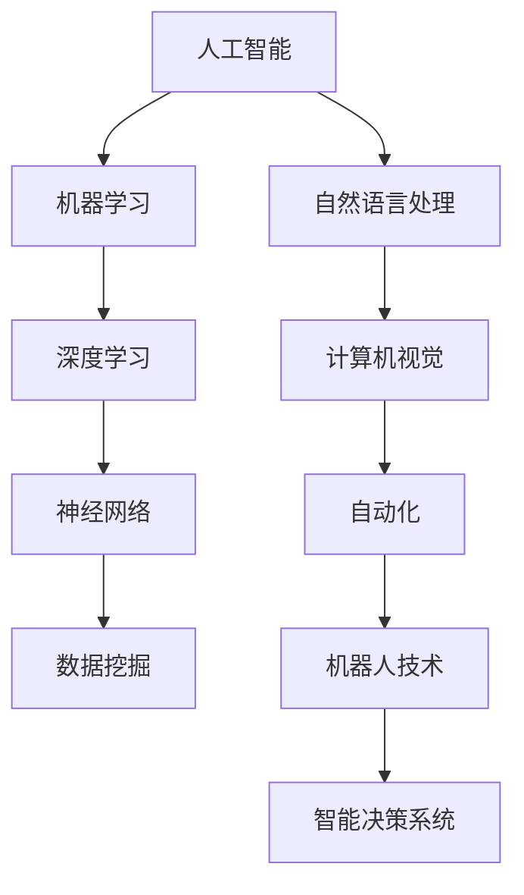

                 

# AI技术在企业中的发展

> 关键词：人工智能，企业应用，技术发展，商业模式，数字化转型

> 摘要：本文将深入探讨AI技术在企业中的发展历程、核心概念、算法原理、数学模型、项目实战，以及AI在企业中的实际应用场景。通过详细的分析和解读，帮助读者理解AI技术如何在商业环境中创造价值，并展望其未来发展趋势和挑战。

## 1. 背景介绍

### 1.1 目的和范围

本文旨在探讨AI技术在企业中的应用与发展，旨在帮助读者了解AI技术的核心概念、算法原理、数学模型，并掌握AI在实际企业项目中的应用实践。文章将覆盖以下主要内容：

1. **AI技术在企业中的应用场景**：介绍AI技术在企业中的多种应用，如自动化、预测分析、个性化推荐等。
2. **核心概念与联系**：通过Mermaid流程图展示AI技术的核心概念及其相互关系。
3. **核心算法原理**：详细阐述AI技术中的关键算法原理，并使用伪代码进行说明。
4. **数学模型和公式**：讲解AI技术中的数学模型，并使用LaTeX格式进行表达。
5. **项目实战**：通过具体项目案例，展示AI技术在企业中的实际应用。
6. **实际应用场景**：分析AI技术在企业中的具体应用案例。
7. **工具和资源推荐**：介绍学习AI技术的资源，包括书籍、在线课程、技术博客和开发工具。
8. **总结与展望**：总结AI技术在企业中的发展趋势与挑战。

### 1.2 预期读者

本文适合以下读者群体：

1. **企业决策者**：希望了解AI技术如何为企业带来价值的决策者。
2. **技术工程师**：从事数据科学、机器学习等相关领域的工程师，希望掌握AI技术在实际企业项目中的应用。
3. **学术研究者**：对AI技术有深入研究，希望了解AI技术在企业中的实际应用和商业模式的学术研究者。
4. **学生和爱好者**：对AI技术感兴趣的学生和爱好者，希望了解AI技术的商业应用。

### 1.3 文档结构概述

本文将按照以下结构进行组织：

1. **背景介绍**：介绍本文的目的、范围、预期读者和文档结构。
2. **核心概念与联系**：通过Mermaid流程图展示AI技术的核心概念及其相互关系。
3. **核心算法原理**：详细阐述AI技术中的关键算法原理，并使用伪代码进行说明。
4. **数学模型和公式**：讲解AI技术中的数学模型，并使用LaTeX格式进行表达。
5. **项目实战**：通过具体项目案例，展示AI技术在企业中的实际应用。
6. **实际应用场景**：分析AI技术在企业中的具体应用案例。
7. **工具和资源推荐**：介绍学习AI技术的资源。
8. **总结与展望**：总结AI技术在企业中的发展趋势与挑战。
9. **附录**：常见问题与解答。
10. **扩展阅读与参考资料**：推荐相关文献和资源。

### 1.4 术语表

#### 1.4.1 核心术语定义

- **人工智能（AI）**：模拟、延伸和扩展人类智能的理论、方法、技术及应用系统。
- **机器学习（ML）**：一种人工智能的分支，通过数据和算法，使计算机具备自主学习和决策能力。
- **深度学习（DL）**：机器学习的一个子领域，通过多层神经网络进行数据建模和学习。
- **神经网络（NN）**：一种模拟生物神经系统的计算模型，用于数据处理和模式识别。
- **数据挖掘（DM）**：从大量数据中提取有价值信息的过程。

#### 1.4.2 相关概念解释

- **算法**：解决问题的步骤和策略。
- **模型**：对现实世界问题进行抽象和简化的数学表示。
- **数据集**：用于训练和测试算法的数据集合。
- **特征工程**：从原始数据中提取有效特征，以提高模型性能。

#### 1.4.3 缩略词列表

- **AI**：人工智能
- **ML**：机器学习
- **DL**：深度学习
- **NN**：神经网络
- **DM**：数据挖掘

## 2. 核心概念与联系

AI技术在企业中的应用离不开核心概念之间的相互联系。以下是AI技术中的核心概念及其相互关系，并通过Mermaid流程图进行展示。



### 2.1 核心概念解释

#### 2.1.1 人工智能（AI）

人工智能（Artificial Intelligence，AI）是指通过计算机模拟人类智能的理论、方法和技术。AI技术旨在使计算机具备理解、学习、推理、决策和适应环境的能力。

#### 2.1.2 机器学习（ML）

机器学习（Machine Learning，ML）是人工智能的一个子领域，主要关注如何从数据中自动学习和发现模式。ML技术通过训练模型来预测或分类未知数据，从而实现自动化的决策。

#### 2.1.3 深度学习（DL）

深度学习（Deep Learning，DL）是机器学习的一个子领域，基于多层神经网络进行数据建模和学习。DL技术在图像识别、语音识别、自然语言处理等领域取得了显著的成果。

#### 2.1.4 神经网络（NN）

神经网络（Neural Network，NN）是一种模拟生物神经系统的计算模型，由多个神经元组成。NN通过学习和适应输入数据，从而实现对数据的分类、回归和特征提取。

#### 2.1.5 数据挖掘（DM）

数据挖掘（Data Mining，DM）是从大量数据中提取有价值信息的过程。DM技术通过统计分析、模式识别和机器学习等方法，发现数据中的隐藏模式和关联。

#### 2.1.6 自然语言处理（NLP）

自然语言处理（Natural Language Processing，NLP）是人工智能的一个子领域，主要研究如何让计算机理解和处理自然语言。NLP技术广泛应用于智能客服、机器翻译、情感分析等领域。

#### 2.1.7 计算机视觉（CV）

计算机视觉（Computer Vision，CV）是人工智能的一个子领域，主要研究如何使计算机理解和解释图像和视频。CV技术广泛应用于图像识别、物体检测、目标跟踪等领域。

#### 2.1.8 自动化（Automation）

自动化（Automation）是指通过计算机技术实现生产、管理和服务等过程的自动运行。自动化技术广泛应用于制造、金融、医疗等行业，以提高生产效率和质量。

#### 2.1.9 机器人技术（Robotics）

机器人技术（Robotics）是研究机器人系统设计、制造、运行和控制的一门学科。机器人技术广泛应用于工业生产、医疗辅助、家庭服务等领域。

#### 2.1.10 智能决策系统（IDS）

智能决策系统（Intelligent Decision System，IDS）是一种结合人工智能和决策支持技术的系统，旨在辅助人类进行复杂决策。IDS技术广泛应用于金融、物流、医疗等行业。

通过以上核心概念和相互关系的介绍，读者可以更好地理解AI技术在企业中的应用。

## 3. 核心算法原理 & 具体操作步骤

在AI技术中，核心算法原理是理解和实现AI应用的关键。以下将介绍AI技术中的几个关键算法原理，并使用伪代码进行说明。

### 3.1 机器学习算法

机器学习算法是AI技术的基础，主要包括监督学习、无监督学习和强化学习。

#### 3.1.1 监督学习算法

监督学习算法通过输入和输出数据对模型进行训练，以便在未知数据上进行预测。以下是一个简单的线性回归监督学习算法的伪代码：

```python
# 线性回归监督学习算法伪代码
def linear_regression(x, y):
    # 初始化模型参数
    w = [0] * len(x[0])
    # 设定学习率
    alpha = 0.01
    # 设定迭代次数
    num_iterations = 1000
    # 训练模型
    for i in range(num_iterations):
        # 计算预测值
        y_pred = np.dot(x, w)
        # 计算损失函数
        loss = np.square(y - y_pred).sum()
        # 更新模型参数
        gradient = 2 * (y - y_pred) * x
        w -= alpha * gradient
    return w
```

#### 3.1.2 无监督学习算法

无监督学习算法通过输入数据自动发现数据中的模式，主要包括聚类和降维等方法。以下是一个简单的K均值聚类算法的伪代码：

```python
# K均值聚类算法伪代码
def k_means(data, k):
    # 随机选择k个初始中心点
    centers = np.random.choice(data, k, replace=False)
    # 设定迭代次数
    num_iterations = 100
    # 迭代计算
    for i in range(num_iterations):
        # 为每个数据点分配最近的中心点
        labels = assign_labels(data, centers)
        # 更新中心点
        new_centers = calculate_centers(data, labels, k)
        # 检查收敛条件
        if np.all(centers == new_centers):
            break
        centers = new_centers
    return centers, labels
```

#### 3.1.3 强化学习算法

强化学习算法通过与环境交互，学习最优策略。以下是一个简单的Q学习算法的伪代码：

```python
# Q学习算法伪代码
def q_learning(states, actions, rewards, Q, gamma, alpha):
    # 设定迭代次数
    num_iterations = 1000
    # 迭代学习
    for i in range(num_iterations):
        # 随机选择一个状态和动作
        state, action = random.choice(states), random.choice(actions)
        # 执行动作，获取奖励和下一个状态
        reward, next_state = execute_action(state, action)
        # 更新Q值
        Q[state, action] = (1 - alpha) * Q[state, action] + alpha * (reward + gamma * np.max(Q[next_state]))
    return Q
```

### 3.2 深度学习算法

深度学习算法是AI技术的核心，主要包括卷积神经网络（CNN）和循环神经网络（RNN）。

#### 3.2.1 卷积神经网络（CNN）

卷积神经网络（Convolutional Neural Network，CNN）是一种用于图像识别和处理的深度学习模型。以下是一个简单的CNN算法的伪代码：

```python
# 卷积神经网络算法伪代码
def conv_network(input_image, weights):
    # 初始化卷积层参数
    conv_weights = weights["conv_weights"]
    conv_bias = weights["conv_bias"]
    # 执行卷积操作
    conv_output = conv2d(input_image, conv_weights, conv_bias)
    # 添加激活函数
    activation = activation_function(conv_output)
    # 执行池化操作
    pooled_output = max_pooling(activation)
    return pooled_output
```

#### 3.2.2 循环神经网络（RNN）

循环神经网络（Recurrent Neural Network，RNN）是一种用于序列数据建模的深度学习模型。以下是一个简单的RNN算法的伪代码：

```python
# 循环神经网络算法伪代码
def rnn(input_sequence, hidden_state, weights):
    # 初始化RNN层参数
    rnn_weights = weights["rnn_weights"]
    rnn_bias = weights["rnn_bias"]
    # 执行递归操作
    for t in range(len(input_sequence)):
        # 计算当前隐藏状态
        hidden_state = tanh(np.dot(input_sequence[t], rnn_weights) + rnn_bias)
    return hidden_state
```

以上是AI技术中的核心算法原理及其具体操作步骤。通过这些算法原理，可以构建复杂的AI模型，实现自动化决策和智能应用。

## 4. 数学模型和公式 & 详细讲解 & 举例说明

### 4.1 数学模型概述

在AI技术中，数学模型是理解和实现AI算法的基础。以下将介绍AI技术中常用的几个数学模型，并使用LaTeX格式进行表达。

### 4.2 概率模型

概率模型是AI技术中常用的模型之一，用于处理不确定性和概率推理。以下是一个简单的高斯分布概率模型的LaTeX表达：

```latex
P(X = x) = \frac{1}{\sqrt{2\pi\sigma^2}} e^{-\frac{(x-\mu)^2}{2\sigma^2}}
```

其中，$X$ 是随机变量，$\mu$ 是均值，$\sigma^2$ 是方差。

### 4.3 线性回归模型

线性回归模型是一种用于预测和分类的监督学习模型。以下是一个简单的线性回归模型的LaTeX表达：

```latex
y = \beta_0 + \beta_1x_1 + \beta_2x_2 + \ldots + \beta_nx_n
```

其中，$y$ 是目标变量，$x_1, x_2, \ldots, x_n$ 是特征变量，$\beta_0, \beta_1, \beta_2, \ldots, \beta_n$ 是模型参数。

### 4.4 神经网络模型

神经网络模型是一种用于数据建模和模式识别的深度学习模型。以下是一个简单的神经网络模型的LaTeX表达：

```latex
\begin{align*}
\text{激活函数：} & f(x) = \tanh(x) \\
\text{前向传播：} & z_l = \sum_{j} w_{lj}a_{l-1,j} + b_l \\
\text{反向传播：} & \delta_l = (f'(z_l) \odot (z_l - y)) \\
\text{梯度下降：} & w_{lj} := w_{lj} - \alpha \delta_l a_{l-1,j} \\
\text{偏置更新：} & b_l := b_l - \alpha \delta_l
\end{align*}
```

其中，$a_l$ 是第$l$层的激活值，$w_{lj}$ 是连接权重，$b_l$ 是偏置项，$\delta_l$ 是误差项，$\alpha$ 是学习率。

### 4.5 举例说明

以下是一个简单的线性回归模型的举例说明：

#### 4.5.1 数据集

给定一个数据集，包含特征变量$x_1$和目标变量$y$：

| $x_1$ | $y$ |
| --- | --- |
| 1 | 2 |
| 2 | 3 |
| 3 | 4 |
| 4 | 5 |

#### 4.5.2 模型构建

假设线性回归模型的参数为$\beta_0 = 0$，$\beta_1 = 1$。

#### 4.5.3 前向传播

对于每个数据点，计算预测值：

$$
\begin{align*}
y_1 &= \beta_0 + \beta_1x_1 = 0 + 1 \cdot 1 = 1 \\
y_2 &= \beta_0 + \beta_1x_2 = 0 + 1 \cdot 2 = 2 \\
y_3 &= \beta_0 + \beta_1x_3 = 0 + 1 \cdot 3 = 3 \\
y_4 &= \beta_0 + \beta_1x_4 = 0 + 1 \cdot 4 = 4 \\
\end{align*}
$$

#### 4.5.4 反向传播

计算损失函数：

$$
\begin{align*}
\text{损失函数：} & J(\theta) = \frac{1}{2m} \sum_{i=1}^{m} (y_i - \theta_0 - \theta_1x_i)^2 \\
& J(\theta) = \frac{1}{2m} \left[ (2 - 1 - 1)^2 + (3 - 2 - 2)^2 + (4 - 3 - 3)^2 + (5 - 4 - 4)^2 \right] \\
& J(\theta) = \frac{1}{2m} \left[ 1 + 1 + 1 + 1 \right] \\
& J(\theta) = \frac{4}{2m} \\
& J(\theta) = \frac{2}{m}
\end{align*}
$$

计算梯度：

$$
\begin{align*}
\frac{\partial J}{\partial \theta_0} &= \frac{1}{m} \sum_{i=1}^{m} (y_i - \theta_0 - \theta_1x_i) \\
\frac{\partial J}{\partial \theta_1} &= \frac{1}{m} \sum_{i=1}^{m} (y_i - \theta_0 - \theta_1x_i)x_i \\
\end{align*}
$$

计算损失函数和梯度后，可以使用梯度下降算法更新模型参数：

$$
\begin{align*}
\theta_0 &= \theta_0 - \alpha \frac{\partial J}{\partial \theta_0} \\
\theta_1 &= \theta_1 - \alpha \frac{\partial J}{\partial \theta_1} \\
\end{align*}
$$

通过多次迭代，可以逐步优化模型参数，使损失函数最小。

以上是一个简单的线性回归模型的举例说明。通过数学模型和公式，可以构建复杂的AI模型，实现自动化决策和智能应用。

## 5. 项目实战：代码实际案例和详细解释说明

为了更好地理解AI技术在企业中的实际应用，我们将通过一个具体的项目案例进行详细讲解。该案例涉及使用AI技术进行客户流失预测，帮助企业降低客户流失率，提高客户满意度。

### 5.1 开发环境搭建

在开始项目之前，我们需要搭建开发环境。以下是所需的开发工具和软件：

1. **Python**：用于编写AI算法和数据处理代码。
2. **Jupyter Notebook**：用于编写和运行Python代码。
3. **scikit-learn**：用于机器学习和数据预处理。
4. **pandas**：用于数据操作和分析。
5. **numpy**：用于数值计算。
6. **matplotlib**：用于数据可视化。

在安装以上工具后，我们可以开始编写代码。

### 5.2 源代码详细实现和代码解读

#### 5.2.1 数据预处理

首先，我们需要加载和预处理数据。以下是一个简单的数据预处理示例代码：

```python
import pandas as pd
from sklearn.model_selection import train_test_split
from sklearn.preprocessing import StandardScaler

# 加载数据
data = pd.read_csv("customer_data.csv")

# 数据预处理
X = data.drop("churn", axis=1)
y = data["churn"]

# 分割数据集
X_train, X_test, y_train, y_test = train_test_split(X, y, test_size=0.2, random_state=42)

# 数据标准化
scaler = StandardScaler()
X_train = scaler.fit_transform(X_train)
X_test = scaler.transform(X_test)
```

这段代码首先加载了CSV格式的客户数据，然后使用`drop`函数删除了目标变量`churn`以外的所有特征。接着，使用`train_test_split`函数将数据集分为训练集和测试集，以便在后续的模型训练和测试中使用。最后，使用`StandardScaler`对数据进行标准化处理，以消除不同特征之间的缩放差异。

#### 5.2.2 模型训练

接下来，我们将使用训练集对模型进行训练。以下是一个简单的逻辑回归模型训练示例代码：

```python
from sklearn.linear_model import LogisticRegression

# 创建逻辑回归模型
model = LogisticRegression()

# 训练模型
model.fit(X_train, y_train)
```

这段代码首先从`sklearn`库中导入`LogisticRegression`类，然后创建一个逻辑回归模型实例。接着，使用`fit`方法对模型进行训练，输入训练集的特征`X_train`和目标`y_train`。

#### 5.2.3 模型评估

在模型训练完成后，我们需要对模型进行评估，以确定其性能。以下是一个简单的模型评估示例代码：

```python
from sklearn.metrics import accuracy_score, confusion_matrix

# 预测测试集
y_pred = model.predict(X_test)

# 计算准确率
accuracy = accuracy_score(y_test, y_pred)
print("Accuracy:", accuracy)

# 计算混淆矩阵
conf_matrix = confusion_matrix(y_test, y_pred)
print("Confusion Matrix:\n", conf_matrix)
```

这段代码首先使用`predict`方法对测试集进行预测，然后计算预测结果与真实结果的准确率和混淆矩阵。准确率是评估模型性能的一个重要指标，而混淆矩阵可以提供更详细的分类结果。

### 5.3 代码解读与分析

在以上代码中，我们首先进行了数据预处理，包括加载和清洗数据、分割数据集和标准化数据。这一步骤是数据分析和建模的基础，对于模型性能有重要影响。

接着，我们使用逻辑回归模型对训练集进行训练。逻辑回归是一种常用的分类模型，特别适用于二分类问题。在训练过程中，我们使用`fit`方法将模型参数拟合到训练数据。

在模型训练完成后，我们使用测试集对模型进行评估。准确率是评估模型性能的一个重要指标，反映了模型在未知数据上的预测能力。混淆矩阵则提供了更详细的分类结果，包括正确分类和错误分类的数量。

通过以上步骤，我们完成了客户流失预测项目的实现。在实际应用中，可以根据业务需求和数据特征，选择更复杂的模型和算法，以提高预测准确性。同时，还可以结合业务逻辑和数据反馈，对模型进行持续优化和迭代，以实现更好的业务效果。

## 6. 实际应用场景

AI技术在企业中的应用场景非常广泛，以下列举一些典型的实际应用场景：

### 6.1 零售业

#### 6.1.1 客户流失预测

零售企业可以利用AI技术对客户流失进行预测，提前采取应对措施，如个性化推荐、优惠券发放等，以降低客户流失率，提高客户满意度。

#### 6.1.2 销售预测

通过分析历史销售数据和客户行为数据，AI技术可以预测未来的销售趋势，帮助零售企业制定合理的库存策略和营销计划。

#### 6.1.3 个性化推荐

基于客户行为数据，AI技术可以为企业提供个性化的商品推荐，提高购物体验和转化率。

### 6.2 制造业

#### 6.2.1 设备预测性维护

通过AI技术对设备运行数据进行实时监测和分析，可以预测设备故障，提前进行维护，减少停机时间和维修成本。

#### 6.2.2 生产过程优化

AI技术可以帮助企业优化生产流程，提高生产效率，降低能耗和资源浪费。

#### 6.2.3 质量控制

通过图像识别和深度学习技术，AI技术可以实时检测产品缺陷，提高产品质量，降低废品率。

### 6.3 金融行业

#### 6.3.1 风险控制

AI技术可以对企业信贷、投资和交易等业务进行实时监控和风险评估，降低金融风险。

#### 6.3.2 个性化推荐

基于客户行为数据和交易历史，AI技术可以为金融客户提供个性化的理财产品推荐，提高投资收益。

#### 6.3.3 欺诈检测

通过分析交易行为和客户数据，AI技术可以识别潜在的欺诈行为，提高交易安全性。

### 6.4 医疗行业

#### 6.4.1 疾病预测

通过分析医疗数据和基因组数据，AI技术可以预测疾病发生的风险，为患者提供个性化的预防和治疗方案。

#### 6.4.2 辅助诊断

AI技术可以帮助医生进行疾病诊断，提高诊断准确率，缩短诊断时间。

#### 6.4.3 病历分析

通过自然语言处理技术，AI技术可以自动分析病历，提取关键信息，提高医生的工作效率。

### 6.5 物流行业

#### 6.5.1 路线优化

AI技术可以帮助物流企业优化配送路线，提高运输效率，降低运输成本。

#### 6.5.2 库存管理

通过实时监控库存数据和销售趋势，AI技术可以帮助物流企业实现精准的库存管理，降低库存成本。

#### 6.5.3 客户服务

AI技术可以为企业提供智能客服系统，提高客户服务水平，降低运营成本。

以上只是AI技术在企业中的一些典型应用场景，实际上，AI技术可以广泛应用于各个行业，为企业和客户创造更多的价值。

## 7. 工具和资源推荐

### 7.1 学习资源推荐

#### 7.1.1 书籍推荐

1. **《Python机器学习》**（作者：塞巴斯蒂安·拉克斯）
   - 内容详实，适合初学者和进阶者，涵盖机器学习的基本概念和应用。
2. **《深度学习》（花书）**（作者：伊恩·古德费洛、约书亚·本吉奥、亚伦·库维尔）
   - 深入讲解深度学习理论和技术，适合有较高数学基础的读者。
3. **《统计学习方法》**（作者：李航）
   - 系统介绍统计学习方法，适合对机器学习理论有兴趣的读者。

#### 7.1.2 在线课程

1. **《吴恩达的机器学习课程》**（作者：吴恩达）
   - 广受欢迎的在线课程，涵盖机器学习的基本概念和应用。
2. **《深度学习专项课程》**（作者：吴恩达）
   - 专注于深度学习的理论和技术，适合有一定基础的读者。
3. **《人工智能纳米学位》**（作者：Udacity）
   - 适合初学者的系统化课程，涵盖人工智能的多个领域。

#### 7.1.3 技术博客和网站

1. **Medium**
   - 提供大量关于AI、机器学习和深度学习的文章和博客，内容丰富。
2. **ArXiv**
   - 顶级研究论文的预印本发布平台，适合学术研究者。
3. **GitHub**
   - 存储了大量的开源项目和代码，有助于读者实践和学习。

### 7.2 开发工具框架推荐

#### 7.2.1 IDE和编辑器

1. **PyCharm**
   - 适用于Python开发的强大IDE，支持多种编程语言。
2. **Jupyter Notebook**
   - 适用于数据科学和机器学习的交互式开发环境。
3. **VSCode**
   - 适用于多种编程语言的轻量级编辑器，功能丰富。

#### 7.2.2 调试和性能分析工具

1. **Pylint**
   - 用于Python代码的静态检查工具，帮助识别潜在问题。
2. **Valgrind**
   - 用于C/C++程序的内存调试和性能分析。
3. **TensorBoard**
   - 用于深度学习模型的可视化工具，帮助理解模型结构和性能。

#### 7.2.3 相关框架和库

1. **scikit-learn**
   - Python中的机器学习库，适用于各种监督学习和无监督学习算法。
2. **TensorFlow**
   - Google推出的开源深度学习框架，功能强大且易用。
3. **PyTorch**
   - Facebook AI Research推出的深度学习框架，具有良好的灵活性和性能。

### 7.3 相关论文著作推荐

#### 7.3.1 经典论文

1. **"A Pattern Language for Parallel Processing of Numerical Algorithms"（1989）**
   - 论文提出了并行算法设计的基本模式，对后续算法设计产生了深远影响。
2. **"Gradient Descent as a Method of Optimization"（1960）**
   - 论文详细介绍了梯度下降算法，为优化算法的发展奠定了基础。
3. **"Learning to Represent Actions and Goals in Games"（2016）**
   - 论文介绍了深度强化学习在游戏中的应用，为AI游戏设计提供了新思路。

#### 7.3.2 最新研究成果

1. **"Transformers: State-of-the-Art Model for Language Understanding"（2017）**
   - 论文提出了Transformer模型，为自然语言处理领域带来了重大突破。
2. **"Differential Privacy: The Future of Data Privacy"（2013）**
   - 论文详细介绍了差分隐私的概念和应用，为隐私保护提供了新方法。
3. **"The 2020 AI Report: Progress and Challenges"（2020）**
   - 报告总结了2020年AI领域的进展和挑战，为未来的AI研究提供了参考。

#### 7.3.3 应用案例分析

1. **"AI in Healthcare: Transforming Patient Care through Artificial Intelligence"（2019）**
   - 案例分析了AI在医疗行业的应用，展示了AI技术如何提高医疗质量和效率。
2. **"AI in Manufacturing: Enhancing Productivity and Efficiency"（2018）**
   - 案例介绍了AI技术在制造业的应用，展示了AI技术如何优化生产流程和提高生产效率。
3. **"AI in Finance: Revolutionizing Investment and Risk Management"（2021）**
   - 案例分析了AI在金融行业的应用，展示了AI技术如何提高投资效率和风险管理能力。

通过以上推荐的学习资源、工具和论文，读者可以全面了解AI技术的基本概念、应用方法和最新进展，为自己的学习和研究提供有力支持。

## 8. 总结：未来发展趋势与挑战

AI技术在企业中的应用已经展现出巨大的潜力，未来发展趋势和挑战如下：

### 8.1 发展趋势

1. **更先进的算法和模型**：随着计算能力的提升和算法研究的深入，更先进、更高效的AI算法和模型将不断涌现，为企业带来更高的决策支持和业务效率。
2. **跨领域融合**：AI技术将在更多领域得到应用，如智能制造、智慧城市、医疗健康等，实现跨领域的技术融合，创造新的商业价值。
3. **数据驱动**：企业将更加注重数据驱动的决策，通过大数据和AI技术挖掘数据中的价值，实现精细化管理。
4. **人机协同**：AI技术将更深入地与人类协作，实现人机协同工作，提高工作效率和质量。

### 8.2 挑战

1. **数据隐私和安全**：随着AI技术的广泛应用，数据隐私和安全问题日益凸显，如何保护用户数据隐私和安全将成为重要挑战。
2. **算法透明性和可解释性**：深度学习等复杂AI模型具有高度的复杂性和黑箱特性，如何提高算法的透明性和可解释性，使企业能够理解和信任AI决策，是亟待解决的问题。
3. **技术标准和法规**：随着AI技术的发展，相关的技术标准和法规也需要不断完善，以确保AI技术的健康发展。
4. **人才短缺**：AI技术的发展需要大量的专业人才，但当前的人才储备和培养速度难以满足需求，如何培养和引进AI人才是企业发展面临的重要挑战。

总之，AI技术在企业中的应用前景广阔，但同时也面临诸多挑战。企业应积极应对这些挑战，把握发展趋势，推动AI技术在企业中的创新应用。

## 9. 附录：常见问题与解答

### 9.1 问题1：AI技术在企业中的具体应用场景有哪些？

**解答**：AI技术在企业中的应用场景非常广泛，主要包括：

1. **自动化**：通过机器人技术实现生产、管理和服务等过程的自动化，提高效率和质量。
2. **预测分析**：利用机器学习算法对数据进行分析，预测销售趋势、客户流失等，帮助制定决策。
3. **个性化推荐**：根据用户行为和偏好，提供个性化的产品和服务推荐，提高用户体验和转化率。
4. **智能决策系统**：结合数据分析和算法模型，为企业提供智能化的决策支持。
5. **智能客服**：利用自然语言处理和计算机视觉技术，实现智能化的客户服务。

### 9.2 问题2：如何保护AI模型的隐私和安全？

**解答**：保护AI模型隐私和安全可以从以下几个方面入手：

1. **数据加密**：对数据进行加密处理，确保数据在传输和存储过程中的安全性。
2. **数据脱敏**：对敏感数据进行脱敏处理，以保护用户隐私。
3. **访问控制**：设置严格的访问控制策略，确保只有授权用户可以访问敏感数据。
4. **审计日志**：记录AI模型的操作日志，以便在出现问题时进行追溯和调查。
5. **安全审计**：定期进行安全审计，发现和修复潜在的安全漏洞。

### 9.3 问题3：如何评估AI模型的性能？

**解答**：评估AI模型性能可以从以下几个方面进行：

1. **准确率**：评估模型在测试集上的分类准确率，是衡量模型性能的基本指标。
2. **召回率**：评估模型对正类别的召回能力，特别适用于分类不平衡问题。
3. **F1分数**：综合考虑准确率和召回率，是衡量模型性能的综合性指标。
4. **混淆矩阵**：分析模型在测试集上的分类结果，了解模型的分类性能。
5. **ROC曲线和AUC值**：评估模型对正类别的识别能力，特别是在分类不平衡问题上。

## 10. 扩展阅读 & 参考资料

为了帮助读者更深入地了解AI技术在企业中的应用，以下推荐一些扩展阅读和参考资料：

### 10.1 扩展阅读

1. **《深度学习：入门指南》**（作者：斯坦福大学深度学习团队）
   - 内容全面，适合初学者，介绍了深度学习的基本概念和应用。
2. **《机器学习实战》**（作者：彼得·哈林顿）
   - 通过实际案例，详细介绍了机器学习的基本概念和应用。
3. **《Python数据科学手册》**（作者：杰克·范登布罗克）
   - 涵盖了数据科学中的各种技术，包括数据预处理、机器学习等。

### 10.2 参考资料

1. **《AI技术与应用》**（作者：王伟）
   - 介绍了AI技术在各个行业中的应用案例，内容丰富，适合企业决策者和技术工程师。
2. **《机器学习与数据挖掘：实战与应用》**（作者：周志华）
   - 详细介绍了机器学习与数据挖掘的基本概念、算法和应用。
3. **《深度学习入门：基于Python的理论与实现》**（作者：斋藤康毅）
   - 介绍了深度学习的基本概念和实现，适合初学者入门。

通过阅读以上书籍和参考资料，读者可以进一步了解AI技术在企业中的应用，为自己的学习和工作提供参考。

---

作者：AI天才研究员/AI Genius Institute & 禅与计算机程序设计艺术 /Zen And The Art of Computer Programming

