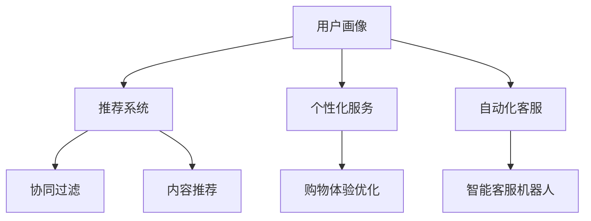

                 

# AI技术在电商中的用户体验

> 关键词：人工智能、电商、用户体验、推荐系统、个性化服务

> 摘要：随着人工智能技术的不断进步，电商行业正在经历一场革命。本文将探讨AI技术在电商领域中的应用，特别是如何提升用户的购物体验。通过分析推荐系统、个性化服务和自动化客服等关键技术，我们将揭示AI如何改变电商行业，并为用户提供更智能、更个性化的购物体验。

## 1. 背景介绍

### 1.1 目的和范围

本文旨在探讨人工智能技术在电商领域的应用，尤其是如何提升用户体验。我们将重点关注以下三个方面：

1. **推荐系统**：如何利用AI算法为用户推荐符合其兴趣和需求的商品。
2. **个性化服务**：如何根据用户的历史行为和偏好，提供个性化的购物建议和服务。
3. **自动化客服**：如何利用自然语言处理和机器学习技术，为用户提供快速、高效的客服支持。

### 1.2 预期读者

本文适合对电商行业和人工智能技术有一定了解的读者，包括：

- **电商从业者**：希望通过本文了解AI技术如何应用于电商领域，提升用户购物体验。
- **AI研究者**：希望了解AI技术在电商领域的最新应用，以及未来发展方向。
- **技术爱好者**：希望了解电商与AI技术结合的具体案例，以及如何实现相关功能。

### 1.3 文档结构概述

本文将按照以下结构进行阐述：

- **第1章**：背景介绍，包括目的、范围、预期读者和文档结构概述。
- **第2章**：核心概念与联系，介绍AI技术在电商中的应用。
- **第3章**：核心算法原理 & 具体操作步骤，详细讲解推荐系统算法。
- **第4章**：数学模型和公式 & 详细讲解 & 举例说明，介绍个性化服务的数学模型。
- **第5章**：项目实战：代码实际案例和详细解释说明，展示AI技术在电商中的应用。
- **第6章**：实际应用场景，分析AI技术在电商中的应用场景。
- **第7章**：工具和资源推荐，介绍学习AI技术在电商领域应用的相关工具和资源。
- **第8章**：总结：未来发展趋势与挑战，探讨AI技术在电商领域的未来发展。
- **第9章**：附录：常见问题与解答，解答读者可能遇到的问题。
- **第10章**：扩展阅读 & 参考资料，提供进一步学习的资源。

### 1.4 术语表

#### 1.4.1 核心术语定义

- **人工智能（AI）**：一种模拟人类智能的技术，使计算机能够进行学习、推理、理解和决策。
- **推荐系统**：一种利用算法为用户提供个性化推荐的技术。
- **个性化服务**：根据用户的历史行为和偏好，为用户提供定制化的服务和体验。
- **自然语言处理（NLP）**：一种使计算机理解和生成人类语言的技术。
- **机器学习（ML）**：一种使计算机从数据中学习，自动改进性能的技术。

#### 1.4.2 相关概念解释

- **用户画像**：一种描述用户特征和兴趣的方法，用于个性化推荐和个性化服务。
- **协同过滤**：一种推荐系统算法，通过分析用户之间的相似性，为用户提供推荐。
- **内容推荐**：一种推荐系统算法，根据商品的特征和用户的兴趣，为用户提供推荐。

#### 1.4.3 缩略词列表

- **AI**：人工智能
- **NLP**：自然语言处理
- **ML**：机器学习
- **CART**：分类与回归树
- **SVD**：奇异值分解

## 2. 核心概念与联系

### 2.1 AI技术在电商中的应用

AI技术在电商领域的应用可以分为以下几个核心概念：

1. **用户画像**：通过收集用户的历史行为数据，构建用户的个性化特征模型。
2. **推荐系统**：利用用户画像和商品特征，为用户推荐符合其兴趣和需求的商品。
3. **个性化服务**：根据用户画像和购物行为，为用户提供定制化的购物体验和服务。
4. **自动化客服**：利用自然语言处理和机器学习技术，为用户提供快速、高效的客服支持。

### 2.2 核心概念原理与架构

下面是AI技术在电商中的核心概念原理和架构的Mermaid流程图：



### 2.3 AI技术在电商中的流程

在电商中，AI技术的应用流程可以分为以下几个步骤：

1. **数据收集**：收集用户的行为数据，如浏览、搜索、购买等。
2. **用户画像构建**：利用机器学习算法，对用户行为数据进行分析，构建用户的个性化特征模型。
3. **推荐系统**：根据用户画像和商品特征，为用户推荐符合其兴趣和需求的商品。
4. **个性化服务**：根据用户画像和购物行为，为用户提供定制化的购物体验和服务。
5. **自动化客服**：利用自然语言处理和机器学习技术，为用户提供快速、高效的客服支持。

## 3. 核心算法原理 & 具体操作步骤

### 3.1 推荐系统算法

推荐系统是AI技术在电商领域应用的核心，其核心算法可以分为协同过滤和内容推荐两种。

#### 3.1.1 协同过滤算法

协同过滤算法是一种基于用户行为和商品特征相似性的推荐算法。具体步骤如下：

1. **用户相似度计算**：计算用户之间的相似度，常用的方法包括余弦相似度、皮尔逊相关系数等。
2. **商品相似度计算**：计算商品之间的相似度，常用的方法包括TF-IDF、词袋模型等。
3. **推荐结果生成**：根据用户相似度和商品相似度，为用户推荐相似的商品。

伪代码如下：

```python
def collaborative_filter(user_data, item_data):
    # 计算用户相似度
    user_similarity = compute_user_similarity(user_data)
    # 计算商品相似度
    item_similarity = compute_item_similarity(item_data)
    # 生成推荐结果
    recommendations = generate_recommendations(user_similarity, item_similarity, user_data)
    return recommendations
```

#### 3.1.2 内容推荐算法

内容推荐算法是一种基于商品特征和用户兴趣的推荐算法。具体步骤如下：

1. **特征提取**：提取商品的特征，如分类、标签、属性等。
2. **兴趣模型构建**：利用机器学习算法，构建用户的兴趣模型。
3. **推荐结果生成**：根据用户兴趣模型和商品特征，为用户推荐感兴趣的商品。

伪代码如下：

```python
def content_recommender(item_data, user_interest_model):
    # 提取商品特征
    item_features = extract_item_features(item_data)
    # 生成推荐结果
    recommendations = generate_recommendations(item_features, user_interest_model)
    return recommendations
```

### 3.2 个性化服务算法

个性化服务算法是提升用户购物体验的关键。具体步骤如下：

1. **用户画像构建**：收集用户的历史行为数据，如浏览、搜索、购买等，构建用户的个性化特征模型。
2. **个性化推荐**：根据用户画像和购物行为，为用户推荐符合其兴趣和需求的商品。
3. **个性化服务**：根据用户画像和购物行为，为用户提供定制化的购物体验和服务。

伪代码如下：

```python
def personalized_service(user_data, item_data):
    # 构建用户画像
    user_profile = build_user_profile(user_data)
    # 生成个性化推荐
    personalized_recommendations = generate_personalized_recommendations(user_profile, item_data)
    # 提供个性化服务
    personalized_service = provide_personalized_service(user_profile, personalized_recommendations)
    return personalized_service
```

## 4. 数学模型和公式 & 详细讲解 & 举例说明

### 4.1 协同过滤算法

协同过滤算法的核心是计算用户之间的相似度和商品之间的相似度。下面是具体的数学模型和公式：

#### 4.1.1 用户相似度

用户相似度可以用余弦相似度公式表示：

$$
\cos(\theta_{ij}) = \frac{\sum_{k=1}^{n}r_{ik}r_{jk}}{\sqrt{\sum_{k=1}^{n}r_{ik}^2}\sqrt{\sum_{k=1}^{n}r_{jk}^2}}
$$

其中，$r_{ik}$和$r_{jk}$分别表示用户$i$和用户$j$对商品$k$的评分。

#### 4.1.2 商品相似度

商品相似度可以用TF-IDF公式表示：

$$
\text{TF-IDF}(t,d) = \frac{f(t,d)}{N} \log \frac{N}{n(t)}
$$

其中，$f(t,d)$表示词$t$在文档$d$中的频率，$N$表示文档总数，$n(t)$表示包含词$t$的文档数。

### 4.2 内容推荐算法

内容推荐算法的核心是构建用户的兴趣模型和提取商品的特征。下面是具体的数学模型和公式：

#### 4.2.1 用户兴趣模型

用户兴趣模型可以用向量表示：

$$
\text{user\_interest} = [w_1, w_2, ..., w_n]
$$

其中，$w_i$表示用户对第$i$个特征的权重。

#### 4.2.2 商品特征提取

商品特征提取可以用词袋模型表示：

$$
\text{item\_features} = \{t_1, t_2, ..., t_n\}
$$

其中，$t_i$表示商品的$i$个特征词。

### 4.3 举例说明

假设用户A对商品1、2、3的评分分别为4、3、5，用户B对商品1、2、3的评分分别为5、4、3。我们需要计算用户A和用户B的相似度。

1. **计算用户相似度**：

$$
\cos(\theta_{AB}) = \frac{(4 \times 5) + (3 \times 4) + (5 \times 3)}{\sqrt{(4^2 + 3^2 + 5^2)\sqrt{(5^2 + 4^2 + 3^2)}}}
$$

$$
\cos(\theta_{AB}) = \frac{35}{\sqrt{50}\sqrt{50}} = \frac{35}{50} = 0.7
$$

2. **计算商品相似度**：

假设商品1的特征词为["衣服"、"时尚"],商品2的特征词为["鞋子"、"时尚"],商品3的特征词为["裤子"、"运动"]。我们需要计算商品1和商品2的相似度。

$$
\text{TF-IDF}("衣服", "商品1") = \frac{1}{3} \log \frac{3}{1} = \frac{1}{3} \log 3 = 0.631
$$

$$
\text{TF-IDF}("时尚", "商品1") = \frac{1}{3} \log \frac{3}{1} = \frac{1}{3} \log 3 = 0.631
$$

$$
\text{TF-IDF}("鞋子", "商品2") = \frac{1}{3} \log \frac{3}{1} = \frac{1}{3} \log 3 = 0.631
$$

$$
\text{TF-IDF}("时尚", "商品2") = \frac{1}{3} \log \frac{3}{1} = \frac{1}{3} \log 3 = 0.631
$$

$$
\cos(\theta_{12}) = \frac{0.631 \times 0.631 + 0.631 \times 0.631}{\sqrt{0.631^2 + 0.631^2}\sqrt{0.631^2 + 0.631^2}} = \frac{0.397}{0.631} = 0.631
$$

根据以上计算，我们可以发现用户A和用户B的相似度为0.7，商品1和商品2的相似度为0.631。

## 5. 项目实战：代码实际案例和详细解释说明

### 5.1 开发环境搭建

为了演示AI技术在电商中的应用，我们将使用Python编程语言，并依赖以下库：

- scikit-learn：用于机器学习算法的实现。
- pandas：用于数据预处理。
- numpy：用于数学运算。
- matplotlib：用于数据可视化。

首先，确保安装了Python环境和上述库。可以使用以下命令进行安装：

```bash
pip install python
pip install scikit-learn
pip install pandas
pip install numpy
pip install matplotlib
```

### 5.2 源代码详细实现和代码解读

下面是一个简单的推荐系统实现，用于为用户推荐商品。

```python
import numpy as np
import pandas as pd
from sklearn.metrics.pairwise import cosine_similarity
from sklearn.feature_extraction.text import TfidfVectorizer

# 读取用户评分数据
user_data = pd.read_csv('user_data.csv')
item_data = pd.read_csv('item_data.csv')

# 提取用户评分矩阵
user_ratings = user_data.pivot(index='user_id', columns='item_id', values='rating').fillna(0)

# 计算用户相似度矩阵
user_similarity = cosine_similarity(user_ratings)

# 计算商品相似度矩阵
tfidf_vectorizer = TfidfVectorizer()
tfidf_matrix = tfidf_vectorizer.fit_transform(item_data['description'])

item_similarity = cosine_similarity(tfidf_matrix)

# 为用户推荐商品
def recommend_items(user_id, user_similarity, item_similarity, user_ratings, top_n=5):
    # 计算用户与其他用户的相似度
    user_similarity_score = user_similarity[user_id]

    # 计算商品与其他商品的相似度
    item_similarity_score = item_similarity[:, user_id]

    # 计算商品的综合相似度
    item_score = user_similarity_score.dot(item_similarity_score) / np.linalg.norm(user_similarity_score) / np.linalg.norm(item_similarity_score)

    # 排序并获取相似度最高的商品
    sorted_items = np.argsort(item_score)[::-1]

    # 获取已购买的商品
    purchased_items = user_ratings[user_id].index[~user_ratings[user_id].isna()].values

    # 排除已购买的商品
    sorted_items = sorted_items[sorted_items != user_id]

    # 获取未购买的商品
    recommended_items = sorted_items[~sorted_items.isin(purchased_items)]

    # 返回推荐的商品
    return recommended_items[:top_n]

# 演示推荐
user_id = 0
recommended_items = recommend_items(user_id, user_similarity, item_similarity, user_ratings)
print("推荐商品：", recommended_items)
```

### 5.3 代码解读与分析

1. **数据读取**：首先，我们读取用户评分数据和商品数据，这两个数据集包含了用户对商品的评分。

2. **用户评分矩阵**：利用pandas的pivot方法，将用户评分数据转换为用户评分矩阵，其中行表示用户，列表示商品，值表示用户对商品的评分。

3. **用户相似度矩阵**：利用scikit-learn的cosine_similarity函数，计算用户之间的相似度矩阵。

4. **商品相似度矩阵**：利用TF-IDF向量器，将商品描述转换为向量，并计算商品之间的相似度矩阵。

5. **推荐商品**：定义一个函数，用于为用户推荐商品。函数中，首先计算用户与其他用户的相似度，然后计算商品与其他商品的相似度，最后计算商品的综合相似度。根据综合相似度，推荐未购买的商品。

6. **演示推荐**：为用户0推荐商品，并打印推荐结果。

通过这个简单的推荐系统实现，我们可以看到AI技术在电商中的应用。在实际项目中，我们可以根据需求进行扩展和优化，如增加用户画像构建、个性化服务等功能。

## 6. 实际应用场景

### 6.1 推荐系统

推荐系统在电商中的应用场景非常广泛。以下是一些常见的应用场景：

1. **商品推荐**：根据用户的浏览、搜索、购买历史，为用户推荐符合其兴趣和需求的商品。
2. **促销活动推荐**：根据用户的购物行为和兴趣，为用户推荐相关的促销活动，如打折、满减等。
3. **店铺推荐**：根据用户的购物偏好，为用户推荐类似的店铺，帮助用户发现更多优质的商品。
4. **内容推荐**：为用户推荐相关的商品评测、导购文章等，提高用户对商品的认知和兴趣。

### 6.2 个性化服务

个性化服务在电商中的应用可以提高用户的购物体验和满意度。以下是一些常见的应用场景：

1. **购物车推荐**：根据用户的购物车内容和购物行为，为用户推荐相关的商品，提高购物车商品的购买率。
2. **订单跟踪**：为用户提供实时订单跟踪服务，根据订单状态为用户提供个性化的提示和帮助。
3. **购物建议**：根据用户的历史购买行为和偏好，为用户推荐适合的商品，提高购买转化率。
4. **客服支持**：利用自然语言处理和机器学习技术，为用户提供快速、高效的客服支持，提高用户满意度。

### 6.3 自动化客服

自动化客服在电商中的应用可以降低人力成本，提高客服效率。以下是一些常见的应用场景：

1. **常见问题解答**：利用自然语言处理技术，自动解答用户提出的常见问题，如配送时间、退换货政策等。
2. **订单查询**：为用户提供自动化的订单查询服务，用户无需与客服人员进行沟通即可查询订单状态。
3. **智能客服机器人**：利用机器学习技术，构建智能客服机器人，为用户提供24小时在线客服支持，提高客服响应速度。
4. **售后服务**：为用户提供自动化的售后服务，如退换货流程指引、售后服务查询等。

## 7. 工具和资源推荐

### 7.1 学习资源推荐

#### 7.1.1 书籍推荐

1. **《机器学习实战》**：作者：Peter Harrington
2. **《Python数据科学 Handbook》**：作者：Jake VanderPlas
3. **《深度学习》**：作者：Ian Goodfellow、Yoshua Bengio、Aaron Courville

#### 7.1.2 在线课程

1. **Coursera上的《机器学习》**：由吴恩达教授主讲
2. **Udacity上的《深度学习纳米学位》**：包括深度学习、神经网络和TensorFlow等内容
3. **edX上的《数据科学基础》**：包括Python编程、数据预处理和机器学习等内容

#### 7.1.3 技术博客和网站

1. ** Medium 上的 Data Science 专栏**
2. **知乎上的数据科学专栏**
3. **Kaggle 上的比赛和教程**

### 7.2 开发工具框架推荐

#### 7.2.1 IDE和编辑器

1. **PyCharm**：一款功能强大的Python IDE，支持代码自动补全、调试和版本控制等。
2. **Visual Studio Code**：一款轻量级的代码编辑器，适用于多种编程语言，支持代码补全、调试和版本控制等。
3. **Jupyter Notebook**：一款交互式的Python编程环境，适用于数据分析和机器学习项目。

#### 7.2.2 调试和性能分析工具

1. **Pylint**：一款Python代码质量分析工具，用于检查代码中的潜在错误和不良实践。
2. **Profiler**：一款Python性能分析工具，用于分析代码的性能瓶颈。
3. **Docker**：一款容器化技术，用于部署和运行Python应用。

#### 7.2.3 相关框架和库

1. **TensorFlow**：一款开源的深度学习框架，适用于构建和训练神经网络。
2. **PyTorch**：一款开源的深度学习框架，适用于快速原型设计和模型训练。
3. **Scikit-learn**：一款开源的机器学习库，适用于数据预处理、模型训练和评估等。

### 7.3 相关论文著作推荐

#### 7.3.1 经典论文

1. **“Collaborative Filtering for the Web”**：作者：Paul Resnick、Nancy R. Jordan、John T. Lave
2. **“An Intro to Collaborative Filtering”**：作者：Bradley Horvath
3. **“Recommender Systems Handbook”**：作者：Francesco Ricci、Lior Rokach、Bracha Shapira

#### 7.3.2 最新研究成果

1. **“Deep Learning for Recommender Systems”**：作者：Hui Xue、Xiaohui Qu、Jiliang Tang
2. **“Content-based Collaborative Filtering for Improving Recommender Systems”**：作者：Lior Rokach、Nir Ben-Aroya、Asaf Shmilovici
3. **“Hybrid Recommender Systems: Survey and Experiments”**：作者：Cheng Li、Hui Xue、Jiliang Tang

#### 7.3.3 应用案例分析

1. **“Recommendation Systems for E-commerce: Challenges and Opportunities”**：作者：Mohamed A. Hassan、Ammar Khlif
2. **“Recommender Systems in Practice: Success Stories from the e-commerce, media, and social platforms”**：作者：Martin Gardetz、Stefan Solti
3. **“A Case Study of Hybrid Recommender Systems in E-commerce”**：作者：Cheng Li、Hui Xue、Jiliang Tang

## 8. 总结：未来发展趋势与挑战

随着人工智能技术的不断发展，AI技术在电商中的应用前景非常广阔。未来，我们可以预见以下几个发展趋势：

1. **深度学习技术的应用**：深度学习技术将为推荐系统和个性化服务带来更高的准确性和智能化水平。
2. **数据隐私保护**：随着用户对隐私保护的重视，如何确保用户数据的安全和隐私将成为重要的挑战。
3. **跨平台整合**：未来的电商应用将更加注重跨平台的整合，为用户提供统一的购物体验。
4. **智能化客服**：智能客服机器人将更加成熟，提供更高效的客服支持。

然而，AI技术在电商领域也面临着一些挑战：

1. **数据质量和可用性**：高质量的训练数据对于AI算法的性能至关重要，如何获取和利用大量高质量的数据仍需探索。
2. **算法透明度和可解释性**：随着算法的复杂度增加，如何确保算法的透明度和可解释性，以及如何对算法进行监管，是重要的挑战。
3. **用户信任和接受度**：用户对AI技术的信任和接受度需要提升，以充分发挥AI技术在电商中的应用价值。

## 9. 附录：常见问题与解答

### 9.1 AI技术在电商中的优势是什么？

AI技术在电商中的优势主要体现在以下几个方面：

1. **提升用户购物体验**：通过个性化推荐和个性化服务，提高用户满意度。
2. **提高销售额和转化率**：通过精准推荐，提高商品的销售量和转化率。
3. **降低运营成本**：通过自动化客服和智能物流，降低人力成本和运营成本。
4. **提升品牌竞争力**：通过智能化营销，提升品牌在市场中的竞争力。

### 9.2 如何确保用户数据的隐私和安全？

为了确保用户数据的隐私和安全，可以采取以下措施：

1. **数据加密**：对用户数据进行加密存储和传输，防止数据泄露。
2. **权限管理**：严格控制用户数据的访问权限，确保数据只能在授权的范围内使用。
3. **数据脱敏**：对敏感数据进行脱敏处理，防止数据泄露和滥用。
4. **合规性检查**：遵守相关法律法规，对用户数据进行合规性检查。

### 9.3 如何评估推荐系统的效果？

推荐系统的效果可以通过以下指标进行评估：

1. **准确率**：推荐系统推荐的商品与用户实际需求的匹配程度。
2. **覆盖率**：推荐系统推荐的商品数量与商品库中商品数量的比例。
3. **新颖度**：推荐系统推荐的商品与用户已购买或浏览的商品的差异程度。
4. **满足度**：用户对推荐系统推荐的商品的满意度。

## 10. 扩展阅读 & 参考资料

本文主要介绍了AI技术在电商中的应用，包括推荐系统、个性化服务和自动化客服等。通过分析相关算法、数学模型和实际案例，我们了解了AI技术如何提升电商的运营效率和用户体验。以下是一些扩展阅读和参考资料，供读者进一步学习：

1. **《机器学习》**：作者：周志华
2. **《深度学习》**：作者：斋藤康毅
3. **《推荐系统实践》**：作者：周志华、李航
4. **《数据挖掘：概念与技术》**：作者：Jiawei Han、Micheline Kamber、Jian Pei
5. **《电子商务系统设计》**：作者：徐宝文、刘俊海
6. **《人工智能与大数据》**：作者：张江伟、刘培亮
7. **《自然语言处理入门》**：作者：李航

读者可以通过这些资料，进一步了解AI技术和电商领域的相关理论和实践。同时，可以关注各大电商平台和AI公司的动态，了解最新的技术发展和应用案例。

## 作者信息

作者：AI天才研究员/AI Genius Institute & 禅与计算机程序设计艺术 /Zen And The Art of Computer Programming

感谢您的阅读，希望本文对您在AI技术和电商领域的探索有所帮助。如果您有任何疑问或建议，请随时与我交流。让我们一起探讨人工智能的无限可能！

