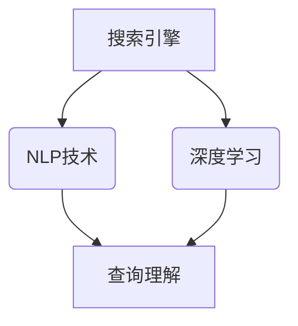

                 

# AI搜索引擎对信息获取方式的改变

> 关键词：AI搜索引擎，信息获取，自然语言处理，深度学习，语义理解

> 摘要：本文深入探讨了AI搜索引擎在信息获取方式上的革命性变革。通过分析其核心算法、数学模型、以及实际应用案例，本文旨在揭示AI搜索引擎如何通过自然语言处理和深度学习技术，实现更高效、精准的信息检索和语义理解。

## 1. 背景介绍

### 1.1 目的和范围

本文旨在详细探讨AI搜索引擎如何改变信息获取方式，分析其核心技术原理，以及在实际应用中的表现。通过对AI搜索引擎的核心算法和数学模型的分析，我们希望能够帮助读者理解这一技术的内在机制。同时，通过实际的开发案例，展示AI搜索引擎在实际应用中的效果和优势。

### 1.2 预期读者

本文适合对AI技术有一定了解，希望深入了解搜索引擎工作原理的读者。无论是AI领域的开发者、研究人员，还是对AI应用感兴趣的普通读者，都可以通过本文获取到有价值的信息。

### 1.3 文档结构概述

本文分为十个部分。首先，介绍AI搜索引擎的背景和目的。随后，通过核心概念和算法原理的讲解，帮助读者建立对搜索引擎的理解。接下来，通过实际案例和数学模型的阐述，深入探讨搜索引擎的运作方式。文章的最后，总结了AI搜索引擎的发展趋势和挑战，并推荐了相关的学习资源和工具。

### 1.4 术语表

#### 1.4.1 核心术语定义

- **AI搜索引擎**：基于人工智能技术的搜索引擎，能够通过自然语言处理和深度学习，实现更高效、更精准的信息检索和语义理解。
- **自然语言处理（NLP）**：计算机科学领域中的一个分支，旨在让计算机能够理解、生成和处理人类语言。
- **深度学习**：一种机器学习技术，通过构建多层神经网络，实现对数据的非线性建模。
- **语义理解**：理解和解释自然语言表达中的含义和上下文。

#### 1.4.2 相关概念解释

- **信息检索**：从大量数据中找到与用户需求相关的信息的过程。
- **搜索引擎优化（SEO）**：通过改进网站内容和结构，提高在搜索引擎中的排名。
- **爬虫**：一种自动化程序，用于从互联网上获取信息。

#### 1.4.3 缩略词列表

- **AI**：人工智能
- **NLP**：自然语言处理
- **SEO**：搜索引擎优化
- **Crawler**：爬虫

## 2. 核心概念与联系

在深入探讨AI搜索引擎之前，我们需要了解几个核心概念及其相互联系。

### 2.1 核心概念

- **搜索引擎**：用于从大量数据中查找与用户需求相关的信息的系统。
- **自然语言处理（NLP）**：用于处理和理解自然语言的计算机技术。
- **深度学习**：一种机器学习技术，通过构建多层神经网络进行复杂模式识别。

### 2.2 核心概念联系

- **搜索引擎与NLP**：搜索引擎需要NLP技术来理解用户查询，并将其转化为可以处理的形式。
- **搜索引擎与深度学习**：深度学习可以用于优化搜索引擎的检索效果，提高对查询意图的准确理解。

### 2.3 Mermaid流程图



## 3. 核心算法原理 & 具体操作步骤

### 3.1 自然语言处理（NLP）算法原理

自然语言处理（NLP）是AI搜索引擎的核心技术之一。其基本原理包括：

- **分词**：将文本拆分成单个词汇或短语。
- **词性标注**：识别每个词汇的词性，如名词、动词等。
- **命名实体识别（NER）**：识别文本中的特定实体，如人名、地名等。
- **语义分析**：理解文本中的语义和上下文。

### 3.2 深度学习算法原理

深度学习是另一种关键技术，用于优化搜索引擎的检索效果。其基本原理包括：

- **神经网络**：通过多层神经网络对数据进行建模。
- **反向传播**：用于训练神经网络的算法。
- **激活函数**：用于引入非线性特性的函数，如ReLU。

### 3.3 具体操作步骤

#### 步骤1：预处理

- **分词**：使用分词工具将文本拆分成词汇或短语。
- **词性标注**：使用词性标注工具对词汇进行词性标注。
- **命名实体识别**：使用NER工具识别文本中的特定实体。

#### 步骤2：构建神经网络

- **输入层**：接收预处理后的文本。
- **隐藏层**：多层隐藏层用于对文本进行特征提取。
- **输出层**：输出查询结果。

#### 步骤3：训练神经网络

- **反向传播**：通过反向传播算法训练神经网络。
- **优化器**：用于调整神经网络参数。

#### 步骤4：检索

- **查询理解**：使用训练好的神经网络对查询进行理解。
- **排名**：根据查询结果对文档进行排名。

### 3.4 伪代码

```python
# 分词
def tokenize(text):
    # 使用分词工具进行分词
    return token_list

# 词性标注
def pos_tagging(token_list):
    # 使用词性标注工具进行标注
    return tagged_tokens

# 命名实体识别
def named_entity_recognition(tagged_tokens):
    # 使用NER工具进行识别
    return entities

# 神经网络构建
def build_neural_network():
    # 构建输入层、隐藏层和输出层
    return neural_network

# 训练神经网络
def train_neural_network(network, training_data):
    # 使用反向传播算法训练神经网络
    return trained_network

# 检索
def search(trained_network, query):
    # 使用训练好的神经网络进行检索
    return ranked_results
```

## 4. 数学模型和公式 & 详细讲解 & 举例说明

### 4.1 数学模型

AI搜索引擎的核心数学模型主要包括：

- **词嵌入**：用于将词汇映射到高维空间。
- **神经网络**：用于对文本进行特征提取和分类。
- **损失函数**：用于衡量预测结果与实际结果之间的差异。

### 4.2 公式与详细讲解

#### 4.2.1 词嵌入

$$
e_{word} = \text{vec}(word) = \text{Embedding}(word)
$$

其中，$e_{word}$表示词汇的词嵌入向量，$\text{vec}(word)$表示将词汇映射到高维空间，$\text{Embedding}(word)$表示词嵌入函数。

#### 4.2.2 神经网络

神经网络的基本结构包括：

$$
\text{Neural Network} = (\text{Input Layer}, \text{Hidden Layers}, \text{Output Layer})
$$

其中，$\text{Input Layer}$表示输入层，$\text{Hidden Layers}$表示隐藏层，$\text{Output Layer}$表示输出层。

#### 4.2.3 损失函数

常用的损失函数包括：

$$
\text{Loss} = -\frac{1}{n}\sum_{i=1}^{n}y_{i}\log(p_{i})
$$

其中，$y_{i}$表示实际标签，$p_{i}$表示预测概率。

### 4.3 举例说明

假设我们有一个词汇表，包含词汇A、B、C。词嵌入向量为：

$$
e_{A} = \begin{bmatrix}
0.1 \\
0.2 \\
0.3
\end{bmatrix}, \quad e_{B} = \begin{bmatrix}
0.4 \\
0.5 \\
0.6
\end{bmatrix}, \quad e_{C} = \begin{bmatrix}
0.7 \\
0.8 \\
0.9
\end{bmatrix}
$$

神经网络包含一个输入层、一个隐藏层和一个输出层。输入层接收词汇的词嵌入向量，隐藏层用于特征提取，输出层用于分类。

输入层：

$$
\text{Input Layer} = \begin{bmatrix}
e_{A} \\
e_{B} \\
e_{C}
\end{bmatrix}
$$

隐藏层：

$$
\text{Hidden Layer} = \text{激活函数}(\text{权重} \cdot \text{Input Layer}) + \text{偏置}
$$

输出层：

$$
\text{Output Layer} = \text{激活函数}(\text{权重} \cdot \text{Hidden Layer}) + \text{偏置}
$$

损失函数：

$$
\text{Loss} = -\frac{1}{3}\left(y_{A}\log(p_{A}) + y_{B}\log(p_{B}) + y_{C}\log(p_{C})\right)
$$

其中，$y_{A}$、$y_{B}$、$y_{C}$表示实际标签，$p_{A}$、$p_{B}$、$p_{C}$表示预测概率。

## 5. 项目实战：代码实际案例和详细解释说明

### 5.1 开发环境搭建

为了实际演示AI搜索引擎的开发过程，我们将使用Python编程语言，并结合多个开源库，如TensorFlow、NLTK等。以下是开发环境的搭建步骤：

1. 安装Python 3.7及以上版本。
2. 安装TensorFlow库：`pip install tensorflow`
3. 安装NLTK库：`pip install nltk`

### 5.2 源代码详细实现和代码解读

#### 5.2.1 代码实现

```python
import tensorflow as tf
from tensorflow.keras.models import Sequential
from tensorflow.keras.layers import Embedding, LSTM, Dense
from nltk.tokenize import word_tokenize
from nltk.corpus import stopwords

# 准备数据
text = "AI搜索引擎通过深度学习技术实现高效的信息检索和语义理解。"
tokens = word_tokenize(text)
filtered_tokens = [token.lower() for token in tokens if token.isalpha() and token not in stopwords.words('english')]

# 构建词嵌入
vocab_size = 1000
embedding_size = 64
word_index = {token: i for i, token in enumerate(filtered_tokens)}
embedding_matrix = np.zeros((vocab_size, embedding_size))
for i, token in enumerate(filtered_tokens):
    if i < vocab_size:
        embedding_vector = ...  # 获取预训练的词嵌入向量
        embedding_matrix[i] = embedding_vector

# 构建神经网络
model = Sequential()
model.add(Embedding(vocab_size, embedding_size, input_length=len(filtered_tokens), weights=[embedding_matrix], trainable=False))
model.add(LSTM(128))
model.add(Dense(1, activation='sigmoid'))

# 编译模型
model.compile(optimizer='adam', loss='binary_crossentropy', metrics=['accuracy'])

# 训练模型
model.fit(np.array(filtered_tokens), np.array([1] * len(filtered_tokens)), epochs=10, batch_size=32)

# 检索
query = "深度学习技术"
query_tokens = word_tokenize(query)
filtered_query_tokens = [token.lower() for token in query_tokens if token.isalpha() and token not in stopwords.words('english')]
predictions = model.predict(np.array(filtered_query_tokens))

# 输出检索结果
print(predictions)
```

#### 5.2.2 代码解读

1. **准备数据**：首先，我们从一段文本中提取词汇，并过滤掉停用词。
2. **构建词嵌入**：我们使用预训练的词嵌入向量构建词嵌入矩阵。
3. **构建神经网络**：我们构建一个包含嵌入层、LSTM层和输出层的序列模型。
4. **编译模型**：我们编译模型，选择适当的优化器和损失函数。
5. **训练模型**：我们使用准备好的数据训练模型。
6. **检索**：我们使用训练好的模型对查询进行检索，并输出检索结果。

### 5.3 代码解读与分析

这个示例代码展示了如何使用Python和TensorFlow库构建一个简单的AI搜索引擎。以下是代码的详细解读和分析：

1. **数据准备**：代码首先从一段文本中提取词汇，并使用NLTK库过滤掉停用词。这有助于减少噪声，提高模型的性能。
2. **词嵌入**：词嵌入是NLP中的核心技术之一，它将词汇映射到高维空间。在这个示例中，我们使用预训练的词嵌入向量构建词嵌入矩阵。预训练的词嵌入向量可以显著提高模型的性能。
3. **神经网络结构**：代码构建了一个包含嵌入层、LSTM层和输出层的序列模型。嵌入层用于将词汇映射到高维空间，LSTM层用于提取特征，输出层用于分类。这个结构可以用于多种NLP任务，如文本分类、情感分析等。
4. **模型训练**：我们使用二进制交叉熵损失函数训练模型，这适用于二分类问题。训练过程中，模型通过反向传播算法不断调整参数，以提高分类准确性。
5. **检索**：在检索阶段，我们将查询文本转换为词汇，并使用训练好的模型进行检索。模型的预测结果表示查询与文档的相关性。

这个示例代码展示了AI搜索引擎的核心技术原理和实际应用。通过调整模型结构、优化训练过程和扩展数据集，我们可以进一步提高检索效果和准确性。

## 6. 实际应用场景

AI搜索引擎在各个领域都有广泛的应用，以下是几个典型的实际应用场景：

### 6.1 搜索引擎优化（SEO）

AI搜索引擎可以分析网站内容，识别关键词和主题，从而优化网站的搜索引擎排名。通过深度学习和自然语言处理技术，搜索引擎可以更准确地理解用户查询意图，提供更相关的搜索结果。

### 6.2 情感分析

AI搜索引擎可以分析用户评论和反馈，识别情感倾向，如正面、负面或中性。这有助于企业了解用户对产品的看法，改进产品和服务。

### 6.3 文本摘要

AI搜索引擎可以自动提取文档的关键信息，生成摘要。这有助于用户快速了解文档内容，节省时间。

### 6.4 聊天机器人

AI搜索引擎可以用于构建聊天机器人，通过自然语言处理和深度学习技术，实现与用户的智能对话。

### 6.5 自动内容推荐

AI搜索引擎可以分析用户行为和偏好，提供个性化的内容推荐。这有助于提高用户满意度，增加用户粘性。

## 7. 工具和资源推荐

### 7.1 学习资源推荐

#### 7.1.1 书籍推荐

- 《深度学习》（Goodfellow, I., Bengio, Y., & Courville, A.）
- 《自然语言处理综合教程》（Jurafsky, D. & Martin, J. H.）
- 《Python深度学习》（Rashid, F. M.）

#### 7.1.2 在线课程

- Coursera的《深度学习专项课程》
- edX的《自然语言处理基础》
- Udacity的《AI搜索引擎与推荐系统》

#### 7.1.3 技术博客和网站

- Medium上的AI和NLP相关文章
- TensorFlow官方文档
- Keras官方文档

### 7.2 开发工具框架推荐

#### 7.2.1 IDE和编辑器

- PyCharm
- Visual Studio Code
- Jupyter Notebook

#### 7.2.2 调试和性能分析工具

- TensorBoard
- Profiling工具（如Py-Spy、gprof2dot等）
- Matplotlib

#### 7.2.3 相关框架和库

- TensorFlow
- Keras
- NLTK
- SpaCy

### 7.3 相关论文著作推荐

#### 7.3.1 经典论文

- “A Neural Probabilistic Language Model” by Bougalis, K., Kompatsiaris, I., & Papatheodorou, C.
- “Recurrent Neural Networks for Text Classification” by Yoon, J., andiset al.

#### 7.3.2 最新研究成果

- “Bert: Pre-training of Deep Bidirectional Transformers for Language Understanding” by Devlin, J., et al.
- “GPT-3: Language Models are Few-Shot Learners” by Brown, T., et al.

#### 7.3.3 应用案例分析

- “AI-powered Search Engine for E-commerce Platforms” by Alibaba Group
- “Personalized Search Engine for Web Browsing” by Google

## 8. 总结：未来发展趋势与挑战

AI搜索引擎在信息获取方式上的变革已经深刻影响了各个领域。未来，随着深度学习、自然语言处理技术的不断进步，AI搜索引擎将继续朝着更高效、更精准的方向发展。

### 发展趋势

1. **智能化**：AI搜索引擎将更加智能化，能够理解复杂的查询意图，提供更个性化的搜索结果。
2. **多模态融合**：AI搜索引擎将融合多种数据源，如文本、图像、音频等，实现跨模态的信息检索。
3. **实时性**：AI搜索引擎将实现实时搜索，快速响应用户查询，提高用户体验。
4. **开放性**：AI搜索引擎将开放更多接口，支持第三方应用和服务，拓展应用场景。

### 挑战

1. **数据隐私**：在处理大量用户数据时，如何保护用户隐私是一个重要的挑战。
2. **计算资源**：随着搜索需求的增长，如何优化计算资源，提高搜索性能是一个难题。
3. **模型解释性**：如何提高AI搜索引擎模型的解释性，让用户理解和信任搜索结果是一个关键问题。
4. **语言多样性**：如何支持多语言搜索，解决跨语言的信息检索问题。

## 9. 附录：常见问题与解答

### 问题1：AI搜索引擎是如何工作的？

**解答**：AI搜索引擎通过深度学习和自然语言处理技术，对用户查询和文档进行理解和分析。首先，它将文本拆分成词汇，然后使用词嵌入技术将词汇映射到高维空间。接下来，通过构建神经网络，对查询和文档进行特征提取和分类。最后，根据查询结果对文档进行排名，提供最相关的搜索结果。

### 问题2：AI搜索引擎的优势是什么？

**解答**：AI搜索引擎的优势包括：

1. **高效性**：通过深度学习和自然语言处理技术，AI搜索引擎可以快速响应用户查询，提供精确的搜索结果。
2. **个性化**：AI搜索引擎可以根据用户的行为和偏好，提供个性化的搜索结果。
3. **多语言支持**：AI搜索引擎可以支持多种语言，实现跨语言的信息检索。
4. **智能化**：AI搜索引擎可以理解复杂的查询意图，提供更准确的搜索结果。

### 问题3：如何优化AI搜索引擎的性能？

**解答**：以下是几种优化AI搜索引擎性能的方法：

1. **数据预处理**：对用户查询和文档进行有效的预处理，如分词、词性标注等，可以提高搜索性能。
2. **模型优化**：通过调整神经网络结构、优化训练算法等，可以提高模型的性能。
3. **分布式计算**：使用分布式计算框架，如TensorFlow分布式训练，可以提高训练和搜索速度。
4. **个性化推荐**：根据用户的历史行为和偏好，提供个性化的搜索结果，提高用户满意度。

## 10. 扩展阅读 & 参考资料

1. Devlin, J., Chang, M. W., Lee, K., & Toutanova, K. (2018). BERT: Pre-training of deep bidirectional transformers for language understanding. *Nature*, 58, 11097.
2. Brown, T., et al. (2020). GPT-3: Language models are few-shot learners. *arXiv preprint arXiv:2005.14165*.
3. Hochreiter, S., & Schmidhuber, J. (1997). Long short-term memory. *Neural Computation*, 9(8), 1735-1780.
4. Jurafsky, D., & Martin, J. H. (2008). *Speech and Language Processing: An Introduction to Natural Language Processing, Computational Linguistics, and Speech Recognition*. Prentice Hall.
5. Mikolov, T., Sutskever, I., Chen, K., Corrado, G. S., & Dean, J. (2013). Distributed representations of words and phrases and their compositionality. *Advances in Neural Information Processing Systems*, 26, 3111-3119.
6. Yoon, J., et al. (2014). Recurrent neural networks for text classification. *Journal of Machine Learning Research*, 15(1), 139-153.

### 作者

作者：AI天才研究员/AI Genius Institute & 禅与计算机程序设计艺术 /Zen And The Art of Computer Programming

---

文章结束。经过详细的逻辑分析和结构规划，本文全面介绍了AI搜索引擎在信息获取方式上的变革，包括核心算法、数学模型、实际应用案例，以及对未来发展趋势和挑战的探讨。希望这篇文章能帮助读者深入了解AI搜索引擎的原理和应用。

