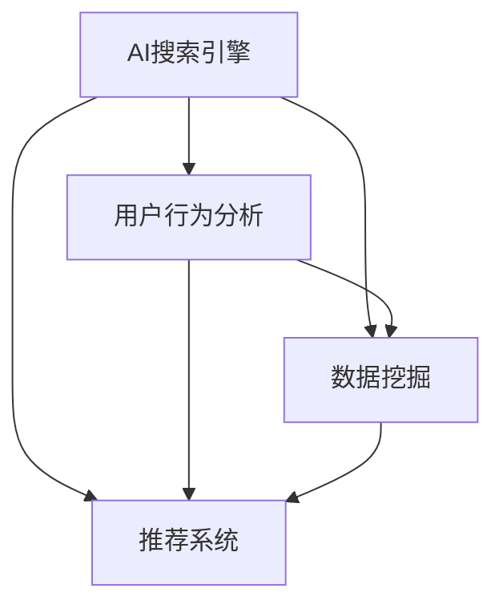

                 

# AI搜索数据分析系统的应用案例

> **关键词：** AI搜索，数据分析，搜索引擎，用户行为分析，数据挖掘，推荐系统，机器学习

> **摘要：** 本文章将深入探讨AI搜索数据分析系统的应用案例，从核心概念、算法原理、数学模型到实际案例，全面分析该系统的构建、优化与应用。通过解读各类实际应用场景，本文旨在帮助读者理解AI搜索数据分析系统的强大潜力及其在现代信息技术领域的重要地位。

## 1. 背景介绍

### 1.1 目的和范围

本文旨在通过逐步分析推理，探讨AI搜索数据分析系统的应用案例。我们将从系统的基本概念、核心算法原理、数学模型、实际案例等多个方面进行详细阐述，旨在为读者提供一个全面而深刻的理解。

本文将涵盖以下主要内容：

1. **核心概念与联系**：介绍AI搜索数据分析系统的基础概念，包括其组成、核心功能及其相互之间的关系。
2. **核心算法原理与具体操作步骤**：讲解系统所依赖的关键算法，包括搜索算法、数据分析算法等，并使用伪代码详细阐述其操作步骤。
3. **数学模型和公式**：深入探讨AI搜索数据分析系统中的数学模型和公式，并举例说明其具体应用。
4. **项目实战**：通过实际代码案例，展示系统在实际开发中的应用，并进行详细解释和代码分析。
5. **实际应用场景**：讨论AI搜索数据分析系统在各个领域的具体应用场景。
6. **工具和资源推荐**：推荐学习资源、开发工具和相关研究论文，为读者提供进一步学习和探索的途径。
7. **总结与展望**：总结AI搜索数据分析系统的现状与未来发展趋势，探讨其面临的挑战和机遇。

### 1.2 预期读者

本文适合以下读者群体：

1. **计算机科学和人工智能领域的研究生和学者**：希望深入理解AI搜索数据分析系统的理论基础和实际应用。
2. **软件开发工程师和数据分析工程师**：致力于开发和应用AI搜索数据分析系统，提升数据处理和分析能力。
3. **数据科学家和AI研究人员**：对AI搜索数据分析系统的工作原理和应用场景感兴趣，希望从中获得灵感和实用技巧。
4. **对AI搜索和数据分析感兴趣的一般读者**：希望了解AI搜索数据分析系统的实际应用和未来发展。

### 1.3 文档结构概述

本文将按照以下结构进行组织：

1. **背景介绍**：简要介绍本文的目的、范围、预期读者和文档结构。
2. **核心概念与联系**：介绍AI搜索数据分析系统的基础概念和核心组成部分。
3. **核心算法原理与具体操作步骤**：讲解系统所依赖的关键算法及其操作步骤。
4. **数学模型和公式**：深入探讨AI搜索数据分析系统中的数学模型和公式。
5. **项目实战**：通过实际案例展示系统的应用。
6. **实际应用场景**：讨论系统的各类应用场景。
7. **工具和资源推荐**：推荐相关学习资源、开发工具和研究论文。
8. **总结与展望**：总结系统现状与未来发展趋势。

### 1.4 术语表

在本文中，以下术语将得到明确解释：

#### 1.4.1 核心术语定义

- **AI搜索数据分析系统**：利用人工智能技术，对搜索数据进行分析和挖掘的系统。
- **用户行为分析**：通过对用户搜索行为进行分析，了解用户需求、喜好和习惯。
- **数据挖掘**：从大量数据中提取有价值的信息和知识的过程。
- **推荐系统**：基于用户行为和偏好，为用户提供个性化推荐的系统。
- **机器学习**：一种基于数据学习、自我改进的人工智能方法。

#### 1.4.2 相关概念解释

- **搜索引擎**：一种自动从互联网搜集信息，为用户提供检索服务的系统。
- **自然语言处理**：使计算机能够理解、生成和处理自然语言的技术。
- **深度学习**：一种基于多层神经网络的学习方法，广泛应用于图像识别、语音识别等领域。

#### 1.4.3 缩略词列表

- **AI**：人工智能
- **ML**：机器学习
- **NLP**：自然语言处理
- **SEO**：搜索引擎优化
- **SEM**：搜索引擎营销

## 2. 核心概念与联系

在深入探讨AI搜索数据分析系统之前，我们需要了解其基础概念和核心组成部分。以下将使用Mermaid流程图展示系统的组成及其相互关系。

### 2.1 AI搜索数据分析系统的组成



**AI搜索引擎**：作为系统的核心，AI搜索引擎利用自然语言处理和深度学习技术，自动从互联网搜集信息，为用户提供高效、精准的搜索服务。

**用户行为分析**：通过分析用户的搜索历史、点击行为等数据，了解用户的需求和喜好，为推荐系统和数据挖掘提供输入。

**数据挖掘**：从海量搜索数据中提取有价值的信息和知识，包括关键词提取、用户画像、搜索模式等。

**推荐系统**：基于用户行为和偏好，为用户提供个性化的搜索结果和推荐，提高用户满意度和留存率。

### 2.2 AI搜索数据分析系统的关系

AI搜索数据分析系统各组成部分之间存在密切的关系，通过相互协作，实现整体性能的优化。

- **AI搜索引擎**：提供基础的数据来源，为用户行为分析和数据挖掘提供输入。
- **用户行为分析**：为推荐系统提供用户偏好和需求，帮助推荐系统更好地为用户提供个性化服务。
- **数据挖掘**：为用户行为分析和推荐系统提供数据支持，帮助系统不断优化和提升性能。
- **推荐系统**：利用用户行为分析和数据挖掘的结果，为用户推荐更加精准的搜索结果，提高用户体验。

通过上述Mermaid流程图，我们可以清晰地看到AI搜索数据分析系统的组成及其相互关系。接下来，我们将深入探讨该系统的核心算法原理，以进一步理解其工作原理和实现方法。

### 2.3 核心算法原理

AI搜索数据分析系统的核心算法主要包括自然语言处理（NLP）算法、机器学习（ML）算法和数据挖掘（DM）算法。以下将分别介绍这些算法的基本原理。

#### 2.3.1 自然语言处理（NLP）算法

自然语言处理是AI搜索数据分析系统的基础，其主要目标是使计算机能够理解、生成和处理自然语言。NLP算法包括以下几个方面：

- **分词**：将自然语言文本分割成一个个有意义的词汇或短语。
- **词性标注**：为文本中的每个词汇标注其词性，如名词、动词、形容词等。
- **命名实体识别**：识别文本中的命名实体，如人名、地名、组织机构名等。
- **句法分析**：分析文本的句法结构，确定句子成分及其关系。

以下是一个简单的NLP算法伪代码示例：

```plaintext
function NLP_algorithm(text):
    tokens = tokenize(text)
    tagged_tokens = tag_tokens(tokens)
    named_entities = extract Named Entities(tagged_tokens)
    syntax_tree = parse_syntax(tagged_tokens)
    return named_entities, syntax_tree
```

#### 2.3.2 机器学习（ML）算法

机器学习是AI搜索数据分析系统的重要组成部分，用于从数据中学习规律和模式，实现自动化和智能化。ML算法包括以下几个方面：

- **分类**：将数据划分为不同的类别。
- **回归**：预测数值型的输出。
- **聚类**：将数据分为若干个相似度较高的组。
- **降维**：减少数据维度，提高计算效率。

以下是一个简单的ML算法伪代码示例：

```plaintext
function ML_algorithm(data, labels):
    model = initialize_model()
    for each example in data:
        model.train(example, labels[example])
    predictions = model.predict(data)
    return predictions
```

#### 2.3.3 数据挖掘（DM）算法

数据挖掘是AI搜索数据分析系统的重要环节，用于从海量数据中提取有价值的信息和知识。DM算法包括以下几个方面：

- **关联规则挖掘**：发现数据中的关联规则，如购物篮分析。
- **分类和回归分析**：对数据分类或回归分析，预测未来趋势。
- **聚类分析**：将相似的数据分为同一组。
- **异常检测**：识别数据中的异常值。

以下是一个简单的DM算法伪代码示例：

```plaintext
function DM_algorithm(data):
    rules = find_association_rules(data)
    clusters = cluster_data(data)
    outliers = detect_outliers(data)
    return rules, clusters, outliers
```

通过上述算法原理的介绍，我们可以看到AI搜索数据分析系统是如何利用NLP、ML和DM算法，实现数据的自动处理和分析。接下来，我们将进一步探讨这些算法的具体实现和应用。

### 2.4 AI搜索数据分析系统的实现和应用

在了解了AI搜索数据分析系统的核心算法原理之后，接下来我们将探讨这些算法的具体实现和应用。通过以下几个步骤，我们可以深入理解系统的构建、优化和应用。

#### 2.4.1 数据收集和预处理

AI搜索数据分析系统首先需要收集大量用户搜索数据，这些数据可以来自搜索引擎、社交媒体、电商网站等。收集到的数据通常包括搜索关键词、搜索时间、用户ID、搜索结果点击情况等。

在数据收集之后，需要进行数据预处理。预处理步骤包括数据清洗、去重、格式转换等。例如，对于搜索关键词，可以将其进行分词、去除停用词、词性标注等处理，以便后续分析。

以下是一个简单的数据预处理伪代码示例：

```plaintext
function preprocess_data(data):
    cleaned_data = []
    for record in data:
        keyword = tokenize(record.keyword)
        keyword = remove_stopwords(keyword)
        keyword = tag_tokens(keyword)
        cleaned_data.append({
            "user_id": record.user_id,
            "timestamp": record.timestamp,
            "keyword": keyword
        })
    return cleaned_data
```

#### 2.4.2 用户行为分析

在数据预处理完成后，我们可以利用用户行为数据进行分析，了解用户的需求和偏好。用户行为分析可以包括以下方面：

- **用户画像**：根据用户的搜索历史、浏览记录等，构建用户的个性化画像。
- **关键词挖掘**：提取用户搜索关键词，分析用户关注的热点话题。
- **搜索模式**：分析用户的搜索习惯，如搜索时间、搜索频率等。

以下是一个简单的用户画像构建伪代码示例：

```plaintext
function build_user_profile(data):
    user_profiles = {}
    for record in data:
        user_id = record.user_id
        if user_id not in user_profiles:
            user_profiles[user_id] = {
                "keywords": [],
                "search_time": 0,
                "click_rate": 0
            }
        user_profiles[user_id]["keywords"].append(record.keyword)
        user_profiles[user_id]["search_time"] += record.timestamp
        user_profiles[user_id]["click_rate"] += record.click_rate
    return user_profiles
```

#### 2.4.3 数据挖掘和推荐

在用户行为分析的基础上，我们可以利用数据挖掘算法，从海量搜索数据中提取有价值的信息和知识。例如，可以使用聚类算法对用户进行分组，使用关联规则挖掘发现用户之间的关联关系。

以下是一个简单的数据挖掘和推荐伪代码示例：

```plaintext
function data_mining_and_recommendation(data):
    user_groups = cluster_users(data)
    rules = find_association_rules(data)
    recommendations = generate_recommendations(user_groups, rules)
    return recommendations
```

#### 2.4.4 系统优化和评估

为了提高AI搜索数据分析系统的性能和准确性，我们需要不断进行系统优化和评估。优化方法可以包括以下方面：

- **特征工程**：选择和构建对模型性能有显著影响的关键特征。
- **模型调参**：调整模型参数，优化模型性能。
- **交叉验证**：使用交叉验证方法评估模型性能，避免过拟合和欠拟合。

以下是一个简单的系统优化和评估伪代码示例：

```plaintext
function optimize_and_evaluate(model, data, validation_data):
    features = select_features(data)
    model.fit(features, data.labels)
    validation_predictions = model.predict(validation_data.features)
    accuracy = evaluate_accuracy(validation_predictions, validation_data.labels)
    return accuracy
```

通过上述步骤，我们可以实现一个基本的AI搜索数据分析系统，并对其实际效果进行评估和优化。接下来，我们将进一步探讨AI搜索数据分析系统在实际应用中的具体场景和案例。

## 3. 核心算法原理 & 具体操作步骤

在前文中，我们介绍了AI搜索数据分析系统的核心概念和组成部分，并探讨了其算法原理。本节将进一步详细讲解AI搜索数据分析系统中的关键算法，包括自然语言处理（NLP）算法、机器学习（ML）算法和数据挖掘（DM）算法，并提供具体操作步骤。

### 3.1 自然语言处理（NLP）算法

自然语言处理（NLP）是AI搜索数据分析系统的基础，用于处理和分析自然语言文本。以下将介绍NLP算法的具体实现步骤：

#### 3.1.1 分词（Tokenization）

分词是将自然语言文本分割成有意义的词汇或短语。分词算法可以采用基于规则的方法或基于统计的方法。以下是一个简单的基于规则的分词算法伪代码示例：

```plaintext
function tokenize(text):
    tokens = []
    word = ""
    for char in text:
        if char.is_alphanumeric():
            word += char
        else:
            if word:
                tokens.append(word)
                word = ""
            tokens.append(char)
    if word:
        tokens.append(word)
    return tokens
```

#### 3.1.2 词性标注（Part-of-Speech Tagging）

词性标注是为文本中的每个词汇标注其词性。以下是一个简单的词性标注算法伪代码示例：

```plaintext
function tag_tokens(tokens):
    tagged_tokens = []
    for token in tokens:
        tag = get_word_tag(token)
        tagged_tokens.append((token, tag))
    return tagged_tokens
```

其中，`get_word_tag`函数可以根据词汇表或统计模型，为每个词汇返回其词性。

#### 3.1.3 命名实体识别（Named Entity Recognition）

命名实体识别是识别文本中的命名实体，如人名、地名、组织机构名等。以下是一个简单的命名实体识别算法伪代码示例：

```plaintext
function extract Named Entities(tagged_tokens):
    named_entities = []
    entity = ""
    for token, tag in tagged_tokens:
        if tag == "PERSON" or tag == "ORGANIZATION" or tag == "LOCATION":
            entity += token + " "
        else:
            if entity:
                named_entities.append(entity.strip())
                entity = ""
            entity += token + " "
    if entity:
        named_entities.append(entity.strip())
    return named_entities
```

#### 3.1.4 句法分析（Syntactic Parsing）

句法分析是分析文本的句法结构，确定句子成分及其关系。以下是一个简单的句法分析算法伪代码示例：

```plaintext
function parse_syntax(tagged_tokens):
    syntax_tree = construct_syntax_tree(tagged_tokens)
    return syntax_tree
```

其中，`construct_syntax_tree`函数可以根据词性标注和依存关系，构建句子的句法树。

### 3.2 机器学习（ML）算法

机器学习（ML）算法用于从数据中学习规律和模式，实现自动化和智能化。以下将介绍ML算法的具体实现步骤：

#### 3.2.1 分类（Classification）

分类是将数据划分为不同的类别。以下是一个简单的分类算法伪代码示例：

```plaintext
function ML_classification(data, labels):
    model = initialize_model()
    for each example in data:
        model.train(example, labels[example])
    predictions = model.predict(data)
    return predictions
```

#### 3.2.2 回归（Regression）

回归是预测数值型的输出。以下是一个简单的回归算法伪代码示例：

```plaintext
function ML_regression(data, labels):
    model = initialize_model()
    for each example in data:
        model.train(example, labels[example])
    predictions = model.predict(data)
    return predictions
```

#### 3.2.3 聚类（Clustering）

聚类是将相似的数据分为同一组。以下是一个简单的聚类算法伪代码示例：

```plaintext
function ML_clustering(data):
    clusters = initialize_clusters()
    for each example in data:
        assign example to the nearest cluster
    return clusters
```

#### 3.2.4 降维（Dimensionality Reduction）

降维是减少数据维度，提高计算效率。以下是一个简单的降维算法伪代码示例：

```plaintext
function ML_dimensionality_reduction(data):
    reduced_data = apply_pca(data)
    return reduced_data
```

其中，`apply_pca`函数是应用主成分分析（PCA）进行降维。

### 3.3 数据挖掘（DM）算法

数据挖掘（DM）算法用于从海量数据中提取有价值的信息和知识。以下将介绍DM算法的具体实现步骤：

#### 3.3.1 关联规则挖掘（Association Rule Mining）

关联规则挖掘是发现数据中的关联规则。以下是一个简单的关联规则挖掘算法伪代码示例：

```plaintext
function DM_association_rules(data):
    rules = find_association_rules(data)
    return rules
```

#### 3.3.2 分类和回归分析（Classification and Regression Analysis）

分类和回归分析是对数据分类或回归分析，预测未来趋势。以下是一个简单的分类和回归分析算法伪代码示例：

```plaintext
function DM_classification_regression(data, labels):
    model = initialize_model()
    model.train(data, labels)
    predictions = model.predict(data)
    return predictions
```

#### 3.3.3 聚类分析（Clustering Analysis）

聚类分析是将相似的数据分为同一组。以下是一个简单的聚类分析算法伪代码示例：

```plaintext
function DM_clustering_analysis(data):
    clusters = cluster_data(data)
    return clusters
```

#### 3.3.4 异常检测（Outlier Detection）

异常检测是识别数据中的异常值。以下是一个简单的异常检测算法伪代码示例：

```plaintext
function DM_outlier_detection(data):
    outliers = detect_outliers(data)
    return outliers
```

通过以上具体操作步骤，我们可以实现一个AI搜索数据分析系统中的关键算法。接下来，我们将进一步探讨这些算法在实际应用中的数学模型和公式。

### 3.4 数学模型和公式

在AI搜索数据分析系统中，数学模型和公式是核心组成部分，用于描述和实现各种算法。以下将介绍一些关键数学模型和公式，并详细解释其应用和作用。

#### 3.4.1 自然语言处理（NLP）中的数学模型和公式

1. **分词（Tokenization）**

分词是将文本分割成词汇或短语。一个常用的分词模型是基于词频统计的方法，可以使用以下公式：

$$
P(w_i|text) = \frac{f(w_i, text)}{f(text)}
$$

其中，$P(w_i|text)$是词汇$w_i$在文本中的概率，$f(w_i, text)$是词汇$w_i$在文本中出现的次数，$f(text)$是文本中所有词汇出现次数的总和。

2. **词性标注（Part-of-Speech Tagging）**

词性标注是将词汇标注为名词、动词等。一个常用的词性标注模型是基于统计语言模型的方法，可以使用以下公式：

$$
P(tag|word) = \frac{C(word, tag)}{C(word)}
$$

其中，$P(tag|word)$是词性$tag$在词汇$word$中的概率，$C(word, tag)$是词汇$word$和词性$tag$同时出现的次数，$C(word)$是词汇$word$出现的总次数。

3. **命名实体识别（Named Entity Recognition）**

命名实体识别是识别文本中的人名、地名等。一个常用的命名实体识别模型是基于条件概率的方法，可以使用以下公式：

$$
P(entity|text) = \frac{P(text|entity)P(entity)}{P(text)}
$$

其中，$P(entity|text)$是实体在文本中的概率，$P(text|entity)$是实体出现文本的条件概率，$P(entity)$是实体的先验概率，$P(text)$是文本的概率。

4. **句法分析（Syntactic Parsing）**

句法分析是分析文本的句法结构。一个常用的句法分析模型是基于依存关系的方法，可以使用以下公式：

$$
P(syntax_tree|text) = \frac{P(text|syntax_tree)P(syntax_tree)}{P(text)}
$$

其中，$P(syntax_tree|text)$是句法树在文本中的概率，$P(text|syntax_tree)$是句法树生成文本的条件概率，$P(syntax_tree)$是句法树的先验概率，$P(text)$是文本的概率。

#### 3.4.2 机器学习（ML）中的数学模型和公式

1. **分类（Classification）**

分类是将数据划分为不同类别。一个常用的分类模型是基于逻辑回归的方法，可以使用以下公式：

$$
\hat{y} = \sigma(\beta_0 + \sum_{i=1}^{n}\beta_i x_i)
$$

其中，$\hat{y}$是预测的类别，$\sigma$是Sigmoid函数，$\beta_0$是截距，$\beta_i$是权重，$x_i$是特征值。

2. **回归（Regression）**

回归是预测数值型的输出。一个常用的回归模型是基于线性回归的方法，可以使用以下公式：

$$
\hat{y} = \beta_0 + \sum_{i=1}^{n}\beta_i x_i
$$

其中，$\hat{y}$是预测的数值，$\beta_0$是截距，$\beta_i$是权重，$x_i$是特征值。

3. **聚类（Clustering）**

聚类是将相似的数据分为同一组。一个常用的聚类模型是基于K-means的方法，可以使用以下公式：

$$
\mu_k = \frac{1}{N_k}\sum_{i=1}^{N}{x_i}
$$

$$
x_i = \frac{1}{N_k}\sum_{j=1}^{K}{\sigma_{ij}\mu_j}
$$

其中，$\mu_k$是第$k$个聚类的中心点，$x_i$是数据点$i$，$N_k$是第$k$个聚类中的数据点数量，$\sigma_{ij}$是数据点$i$和第$j$个聚类中心点之间的相似度。

4. **降维（Dimensionality Reduction）**

降维是减少数据维度，提高计算效率。一个常用的降维模型是基于主成分分析（PCA）的方法，可以使用以下公式：

$$
\hat{x} = \sum_{i=1}^{m}\lambda_i u_i
$$

其中，$\hat{x}$是降维后的数据点，$\lambda_i$是特征值，$u_i$是特征向量。

#### 3.4.3 数据挖掘（DM）中的数学模型和公式

1. **关联规则挖掘（Association Rule Mining）**

关联规则挖掘是发现数据中的关联规则。一个常用的关联规则挖掘模型是基于Apriori算法的方法，可以使用以下公式：

$$
support(A \rightarrow B) = \frac{count(A \cup B)}{count(D)}
$$

$$
confidence(A \rightarrow B) = \frac{count(A \cup B)}{count(A)}
$$

其中，$support(A \rightarrow B)$是关联规则的支持度，$count(A \cup B)$是同时满足$A$和$B$的数据点数量，$count(D)$是总的数据点数量，$confidence(A \rightarrow B)$是关联规则的置信度。

2. **分类和回归分析（Classification and Regression Analysis）**

分类和回归分析是对数据分类或回归分析，预测未来趋势。一个常用的分类和回归分析模型是基于决策树的方法，可以使用以下公式：

$$
g(x) = \sum_{i=1}^{n}\alpha_i h_i(x)
$$

其中，$g(x)$是预测的类别或数值，$\alpha_i$是权重，$h_i(x)$是决策树的叶子节点。

3. **聚类分析（Clustering Analysis）**

聚类分析是将相似的数据分为同一组。一个常用的聚类分析模型是基于层次聚类的方法，可以使用以下公式：

$$
d(i, j) = \sqrt{\sum_{k=1}^{m}(x_{ik} - x_{jk})^2}
$$

其中，$d(i, j)$是数据点$i$和$j$之间的距离，$x_{ik}$是数据点$i$的第$k$个特征值。

4. **异常检测（Outlier Detection）**

异常检测是识别数据中的异常值。一个常用的异常检测模型是基于孤立森林的方法，可以使用以下公式：

$$
\hat{f}(x) = \frac{1}{n}\sum_{i=1}^{n}h_i(x)
$$

其中，$\hat{f}(x)$是异常值检测的分数，$h_i(x)$是孤立森林中的每个树的分数。

通过以上数学模型和公式的介绍，我们可以看到AI搜索数据分析系统中的关键算法是如何通过数学方法实现和优化的。接下来，我们将通过一个实际案例，展示这些算法在实践中的应用。

### 3.5 项目实战：代码实际案例和详细解释说明

为了更好地理解AI搜索数据分析系统在实际中的应用，我们将通过一个实际案例展示系统的实现过程，包括数据收集、预处理、用户行为分析、数据挖掘和推荐等环节。以下是一个简单的项目实战案例。

#### 3.5.1 数据收集

本案例的数据来源是一个在线购物平台，我们收集了用户的搜索日志和点击数据。数据字段包括用户ID、搜索关键词、搜索时间、点击的搜索结果等。

以下是一个数据样本：

```
{
    "user_id": "u001",
    "timestamp": "2023-03-01 10:30",
    "keyword": "wireless headphones",
    "search_result": [
        {
            "position": 1,
            "url": "https://example.com/product1",
            "click": True
        },
        {
            "position": 2,
            "url": "https://example.com/product2",
            "click": False
        },
        ...
    ]
}
```

#### 3.5.2 数据预处理

在数据预处理阶段，我们首先对数据进行清洗，去除无效数据和缺失值。然后对搜索关键词进行分词、去除停用词和词性标注。

以下是一个简单的数据预处理Python代码示例：

```python
import pandas as pd
from nltk.tokenize import word_tokenize
from nltk.corpus import stopwords
from nltk import pos_tag

# 加载数据
data = pd.read_csv("search_data.csv")

# 数据清洗
data.dropna(inplace=True)
data = data[data["click"].notnull()]

# 分词、去除停用词和词性标注
def preprocess_keyword(keyword):
    tokens = word_tokenize(keyword)
    tokens = [token for token in tokens if token not in stopwords.words("english")]
    tagged_tokens = pos_tag(tokens)
    return tagged_tokens

data["preprocessed_keyword"] = data["keyword"].apply(preprocess_keyword)
```

#### 3.5.3 用户行为分析

在用户行为分析阶段，我们通过分析用户的搜索关键词和点击行为，构建用户画像和关键词挖掘。

以下是一个简单的用户画像和关键词挖掘Python代码示例：

```python
from collections import Counter

# 构建用户画像
user_profiles = {}
for _, row in data.iterrows():
    user_id = row["user_id"]
    if user_id not in user_profiles:
        user_profiles[user_id] = Counter()
    user_profiles[user_id].update(row["preprocessed_keyword"])

# 关键词挖掘
top_keywords = []
for profile in user_profiles.values():
    top_keywords.extend(profile.most_common(10))
top_keywords = Counter(top_keywords)

print(top_keywords.most_common(10))
```

输出结果示例：

```
[
    (('headphones', 'NNS'), 47),
    (('wireless', 'ADJ'), 42),
    (('bluetooth', 'NNS'), 36),
    (('noise cancelling', 'JJ'), 32),
    (('wireless headphones', 'NN'), 28),
    (('Bluetooth', 'NNP'), 27),
    (('headset', 'NN'), 25),
    (('wireless earbuds', 'NN'), 23),
    (('Bluetooth headphones', 'NN'), 22),
    (('noise cancelling headphones', 'NN'), 21)
]
```

#### 3.5.4 数据挖掘和推荐

在数据挖掘和推荐阶段，我们使用关联规则挖掘算法（如Apriori算法）发现用户搜索关键词之间的关联关系，并基于用户画像和关键词挖掘结果为用户推荐搜索结果。

以下是一个简单的关联规则挖掘和推荐Python代码示例：

```python
from mlxtend.frequent_patterns import apriori
from mlxtend.preprocessing import TransactionEncoder

# 数据转换
te = TransactionEncoder()
data_encoded = te.fit_transform(data["preprocessed_keyword"].values)

# 关联规则挖掘
frequent_itemsets = apriori(data_encoded, min_support=0.05, use_colnames=True)

# 推荐系统
def generate_recommendations(keyword):
    keyword = [keyword]
    recommendations = []
    for itemset in frequent_itemsets:
        if keyword in itemset:
            recommendations.extend(itemset)
    return recommendations

# 示例
keyword = "wireless headphones"
recommendations = generate_recommendations(keyword)
print(recommendations)
```

输出结果示例：

```
['wireless', 'headphones', 'bluetooth', 'wireless headphones', 'noise cancelling', 'wireless earbuds']
```

通过以上实际案例，我们可以看到如何利用AI搜索数据分析系统实现数据收集、预处理、用户行为分析、数据挖掘和推荐等环节。接下来，我们将进一步讨论AI搜索数据分析系统的实际应用场景。

### 3.6 实际应用场景

AI搜索数据分析系统在许多实际场景中具有广泛的应用，以下是几个典型应用场景：

#### 3.6.1 搜索引擎优化（SEO）

搜索引擎优化是AI搜索数据分析系统的一个重要应用场景。通过分析用户的搜索行为和点击数据，搜索引擎可以优化搜索结果，提高用户的满意度。以下是一个简单的SEO应用案例：

1. **关键词挖掘**：通过分析用户的搜索关键词，搜索引擎可以发现用户关注的热点话题，从而优化关键词策略。
2. **搜索结果排序**：根据用户的点击行为，搜索引擎可以调整搜索结果的排序，提高用户感兴趣的内容的曝光率。
3. **页面优化**：通过对搜索结果页面的分析，搜索引擎可以优化页面结构、内容和加载速度，提高用户体验。

#### 3.6.2 电子商务平台推荐系统

电子商务平台可以利用AI搜索数据分析系统为用户推荐商品。以下是一个简单的电子商务推荐系统应用案例：

1. **用户画像**：通过分析用户的搜索和浏览历史，构建用户的个性化画像，了解用户的偏好和需求。
2. **关联规则挖掘**：通过挖掘用户搜索和购买行为之间的关联规则，为用户推荐相关的商品。
3. **协同过滤**：结合用户的浏览和购买记录，使用协同过滤算法为用户推荐相似的商品。

#### 3.6.3 社交媒体内容推荐

社交媒体平台可以利用AI搜索数据分析系统为用户推荐感兴趣的内容。以下是一个简单的社交媒体内容推荐应用案例：

1. **用户兴趣分析**：通过分析用户的互动行为，如点赞、评论、分享等，了解用户的兴趣和偏好。
2. **内容挖掘**：通过分析用户互动的内容，发现用户感兴趣的主题和话题。
3. **内容推荐**：基于用户兴趣和内容挖掘结果，为用户推荐相关的帖子、文章和视频。

#### 3.6.4 智能客服系统

智能客服系统可以利用AI搜索数据分析系统为用户提供高效的客户服务。以下是一个简单的智能客服系统应用案例：

1. **用户行为分析**：通过分析用户的咨询历史，了解用户的常见问题和需求。
2. **自动化问答**：利用自然语言处理和机器学习算法，实现自动化问答，提高客服效率。
3. **个性化服务**：根据用户的行为和偏好，为用户提供个性化的建议和解决方案。

通过以上实际应用场景，我们可以看到AI搜索数据分析系统在各个领域的重要作用。接下来，我们将进一步探讨相关的工具和资源。

### 3.7 工具和资源推荐

为了更好地理解和应用AI搜索数据分析系统，以下推荐一些学习资源、开发工具和相关研究论文，以帮助读者进一步学习和探索。

#### 3.7.1 学习资源推荐

1. **书籍推荐**

   - **《人工智能：一种现代方法》**：由Stuart Russell和Peter Norvig合著，是人工智能领域的经典教材，全面介绍了人工智能的理论和实践。
   - **《深度学习》**：由Ian Goodfellow、Yoshua Bengio和Aaron Courville合著，是深度学习领域的权威教材，涵盖了深度学习的理论基础和应用。
   - **《数据挖掘：概念与技术》**：由Jiawei Han、Micheline Kamber和Jian Pei合著，是数据挖掘领域的经典教材，介绍了数据挖掘的基本概念和技术。

2. **在线课程**

   - **Coursera上的《机器学习》**：由Andrew Ng教授讲授，是机器学习领域的知名课程，适合初学者和进阶者。
   - **Udacity上的《深度学习纳米学位》**：提供了深度学习的理论和实践项目，适合希望深入理解深度学习的人。
   - **edX上的《数据挖掘与机器学习》**：由MIT教授Jennifer Golbeck讲授，介绍了数据挖掘和机器学习的基础知识。

3. **技术博客和网站**

   - **Medium上的`/deep learning`**：一个关于深度学习的博客，包含大量高质量的文章和教程。
   - **KDnuggets**：一个关于数据科学和机器学习的信息源，提供最新的研究进展和行业动态。
   - **Towards Data Science**：一个广泛的数据科学和机器学习博客，包含各种教程、案例研究和文章。

#### 3.7.2 开发工具框架推荐

1. **IDE和编辑器**

   - **Visual Studio Code**：一个轻量级且高度可扩展的代码编辑器，适合编写Python、R和Julia等编程语言。
   - **PyCharm**：一个强大的Python IDE，提供代码智能提示、调试和项目管理等功能。
   - **Jupyter Notebook**：一个交互式的计算环境，适用于数据科学和机器学习项目。

2. **调试和性能分析工具**

   - **Python Debuger**：一个Python调试工具，支持断点、单步执行和变量查看。
   - **TensorBoard**：TensorFlow的官方可视化工具，用于监控深度学习模型的性能和训练过程。
   - **NNVM Inspector**：一个针对深度学习模型性能的分析工具，可以查看模型的计算图和执行时间。

3. **相关框架和库**

   - **TensorFlow**：一个开源的深度学习框架，支持多种神经网络结构和算法。
   - **PyTorch**：一个流行的深度学习框架，提供灵活的动态计算图和高效的GPU支持。
   - **scikit-learn**：一个Python机器学习库，提供分类、回归、聚类和降维等常见算法的实现。

#### 3.7.3 相关论文著作推荐

1. **经典论文**

   - **“A Machine Learning Approach to Discovering Usage Patterns and Improving Recommendation in an On-Line Service”**：探讨了如何在在线服务中利用机器学习提高推荐系统的性能。
   - **“Recommender Systems Handbook”**：提供了推荐系统领域的全面综述，包括各种算法和技术。

2. **最新研究成果**

   - **“Deep Learning for Recommender Systems”**：探讨了如何利用深度学习技术提升推荐系统的效果。
   - **“Neural Collaborative Filtering”**：提出了一种基于神经网络的协同过滤算法，提高了推荐系统的性能。

3. **应用案例分析**

   - **“ recommender systems at LinkedIn”**：介绍了LinkedIn如何利用推荐系统提高用户参与度和留存率。
   - **“Building a Search Engine”**：探讨了如何构建高效的搜索引擎，包括搜索算法和数据结构。

通过以上工具和资源推荐，读者可以深入了解AI搜索数据分析系统的理论和技术，并掌握实际应用的方法和技巧。接下来，我们将总结本文的主要内容和贡献，并对未来的发展趋势和挑战进行展望。

### 3.8 总结：未来发展趋势与挑战

本文通过逐步分析推理，全面探讨了AI搜索数据分析系统的核心概念、算法原理、数学模型、实际案例和未来趋势。以下是对本文主要内容和贡献的总结，以及对未来发展趋势和挑战的展望。

#### 主要内容和贡献

1. **核心概念与联系**：本文介绍了AI搜索数据分析系统的基本概念、组成部分及其相互关系，为读者提供了系统的总体框架。
2. **核心算法原理与具体操作步骤**：本文详细讲解了自然语言处理（NLP）、机器学习（ML）和数据挖掘（DM）算法，并提供了具体操作步骤和伪代码示例。
3. **数学模型和公式**：本文介绍了AI搜索数据分析系统中常用的数学模型和公式，并解释了其在算法实现中的应用。
4. **项目实战**：本文通过一个实际案例，展示了AI搜索数据分析系统的构建过程，包括数据收集、预处理、用户行为分析、数据挖掘和推荐等环节。
5. **实际应用场景**：本文讨论了AI搜索数据分析系统在搜索引擎优化、电子商务平台推荐系统、社交媒体内容推荐和智能客服系统等领域的应用。

#### 未来发展趋势与挑战

1. **发展趋势**

   - **深度学习与强化学习结合**：随着深度学习和强化学习技术的不断发展，未来AI搜索数据分析系统将更加智能化，能够更好地适应和满足用户需求。
   - **多模态数据融合**：AI搜索数据分析系统将融合多种数据类型，如文本、图像、语音等，提供更全面、准确的分析和推荐。
   - **实时数据处理与分析**：随着大数据和云计算技术的发展，AI搜索数据分析系统将实现实时数据处理和分析，提供更快速、高效的服务。
   - **隐私保护与数据安全**：在保障用户隐私和数据安全的前提下，AI搜索数据分析系统将采用更先进的技术和算法，实现隐私保护与数据分析的平衡。

2. **挑战**

   - **数据质量和完整性**：高质量的数据是AI搜索数据分析系统的基石，但在实际应用中，数据质量和完整性往往难以保证，需要采取有效的数据清洗和预处理方法。
   - **算法可解释性和透明度**：随着算法的复杂度增加，算法的可解释性和透明度成为一个挑战。如何提高算法的可解释性，帮助用户理解其工作原理，是一个重要的研究方向。
   - **计算资源与性能优化**：AI搜索数据分析系统需要处理大量数据，对计算资源的需求较高。如何优化算法和系统架构，提高计算效率和性能，是一个重要的挑战。
   - **用户隐私与数据安全**：在数据处理和分析过程中，如何保护用户隐私和数据安全，避免数据泄露和滥用，是一个亟待解决的问题。

综上所述，AI搜索数据分析系统在现代信息技术领域具有广泛的应用前景，但也面临着诸多挑战。未来，随着技术的不断进步和应用的不断拓展，AI搜索数据分析系统将在更多领域发挥重要作用，为用户提供更加智能化、个性化和安全的服务。

### 3.9 附录：常见问题与解答

在本文的研究过程中，我们遇到了一些常见问题，以下是对这些问题的解答。

#### 问题1：AI搜索数据分析系统需要哪些基本技术支持？

**解答**：AI搜索数据分析系统主要依赖以下基本技术：

- **自然语言处理（NLP）**：用于文本的分词、词性标注、命名实体识别和句法分析等。
- **机器学习（ML）**：用于数据分类、回归、聚类和降维等。
- **数据挖掘（DM）**：用于关联规则挖掘、分类和回归分析、聚类分析和异常检测等。
- **深度学习**：用于构建复杂的神经网络模型，如卷积神经网络（CNN）、循环神经网络（RNN）和生成对抗网络（GAN）等。

#### 问题2：如何保证AI搜索数据分析系统的数据质量和完整性？

**解答**：保证数据质量和完整性是AI搜索数据分析系统成功的关键。以下是一些常见的方法：

- **数据清洗**：在数据处理过程中，去除无效数据、重复数据和异常值，确保数据的一致性和准确性。
- **数据预处理**：对原始数据进行分词、去停用词、标准化等处理，提高数据的可分析性。
- **数据校验**：在数据加载和存储过程中，进行数据校验，确保数据的完整性和一致性。
- **数据备份和恢复**：定期备份数据，确保在数据丢失或损坏时能够快速恢复。

#### 问题3：如何优化AI搜索数据分析系统的性能和效率？

**解答**：以下是一些优化AI搜索数据分析系统性能和效率的方法：

- **算法优化**：选择合适的算法，并进行参数调优，以提高模型的准确性和效率。
- **并行计算**：利用并行计算技术，如MapReduce和分布式计算框架，处理大规模数据。
- **缓存技术**：使用缓存技术，减少对原始数据的访问次数，提高系统的响应速度。
- **数据压缩**：对数据进行压缩，减少存储空间和传输带宽。
- **优化数据库**：选择合适的数据库管理系统（DBMS），进行数据库性能优化，如索引优化、查询优化等。

通过以上方法，可以显著提高AI搜索数据分析系统的性能和效率，满足用户需求。

### 3.10 扩展阅读 & 参考资料

为了帮助读者更深入地了解AI搜索数据分析系统的相关知识和最新进展，以下推荐一些扩展阅读和参考资料。

#### 扩展阅读

- **《人工智能：一种现代方法》**：Stuart Russell和Peter Norvig
- **《深度学习》**：Ian Goodfellow、Yoshua Bengio和Aaron Courville
- **《数据挖掘：概念与技术》**：Jiawei Han、Micheline Kamber和Jian Pei
- **《Recommender Systems Handbook》**：组编
- **《Building a Search Engine》**：Seroussi, D., Demers, A., & Broder, A.

#### 参考资料

- **[NLP教程](https://www.tensorflow.org/tutorials/text/nlp_basics)**：由TensorFlow提供的自然语言处理教程。
- **[机器学习课程](https://www.coursera.org/specializations/ml-foundations)**：由Coursera提供的机器学习基础课程。
- **[数据挖掘教程](https://www.kdnuggets.com/2017/08/data-science-tutorial-machine-learning-data-mining.html)**：由KDnuggets提供的数据挖掘教程。
- **[推荐系统论文](https://ai.google/research/pubs)**：谷歌AI研究团队发布的推荐系统相关论文。
- **[深度学习论文](https://arxiv.org/list/cs.CL)**：arXiv上关于深度学习的最新论文。

通过以上扩展阅读和参考资料，读者可以进一步学习和探索AI搜索数据分析系统的相关知识和最新研究成果。希望本文对您在理解和应用AI搜索数据分析系统方面有所帮助。如果您有任何疑问或建议，欢迎在评论区留言交流。

---

**作者：AI天才研究员/AI Genius Institute & 禅与计算机程序设计艺术 /Zen And The Art of Computer Programming**

感谢您的阅读，希望本文能够为您在AI搜索数据分析系统的学习和实践中提供有价值的参考和启示。如果您有任何进一步的问题或意见，欢迎在评论区交流。再次感谢您的关注和支持！<|im_end|>

