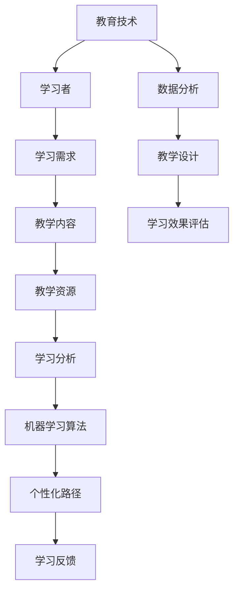

                 

# AI教育革命：个性化学习路径的设计

> 关键词：人工智能、教育技术、个性化学习、机器学习、算法设计

> 摘要：随着人工智能技术的不断进步，教育领域正经历着一场革命。个性化学习路径的设计成为教育创新的关键方向，通过智能算法实现学习者的个性化需求，提高学习效率和效果。本文将探讨个性化学习路径的核心概念、设计原理、算法实现、数学模型以及实际应用，为未来教育技术的发展提供有益的启示。

## 1. 背景介绍

### 1.1 目的和范围

本文旨在介绍人工智能在教育领域中的应用，特别是个性化学习路径的设计。通过分析人工智能技术的核心概念和实际应用，阐述个性化学习路径的设计原理、算法实现以及数学模型，为教育技术的创新提供理论支持和实践指导。

### 1.2 预期读者

本文适用于对教育技术和人工智能有一定了解的读者，包括教育工作者、人工智能研究人员、软件开发人员以及对教育领域感兴趣的公众。

### 1.3 文档结构概述

本文分为八个部分：

1. 背景介绍：介绍文章的目的和范围，预期读者以及文档结构。
2. 核心概念与联系：阐述个性化学习路径的核心概念和联系，通过Mermaid流程图展示。
3. 核心算法原理 & 具体操作步骤：详细讲解核心算法原理和具体操作步骤，使用伪代码进行描述。
4. 数学模型和公式 & 详细讲解 & 举例说明：介绍数学模型和公式，结合具体例子进行讲解。
5. 项目实战：代码实际案例和详细解释说明，包括开发环境搭建、源代码实现和代码解读。
6. 实际应用场景：分析个性化学习路径在实际应用场景中的价值。
7. 工具和资源推荐：推荐学习资源、开发工具框架和相关论文著作。
8. 总结：未来发展趋势与挑战，对个性化学习路径设计进行展望。

### 1.4 术语表

#### 1.4.1 核心术语定义

- 个性化学习：根据学习者的特点、需求和能力，为其定制学习路径和资源的过程。
- 机器学习：一种基于数据的学习方法，通过从数据中自动识别模式和规律，用于解决复杂问题。
- 算法：解决问题的方法和步骤，具有明确的输入和输出。
- 数学模型：用数学语言描述现实问题的数学结构。

#### 1.4.2 相关概念解释

- 教育技术：利用技术和工具改善教育过程，提高教育质量。
- 学习分析：对学习过程和学习者行为进行数据分析和评估，为个性化学习提供支持。

#### 1.4.3 缩略词列表

- AI：人工智能（Artificial Intelligence）
- ML：机器学习（Machine Learning）
- IDE：集成开发环境（Integrated Development Environment）
- OOP：面向对象编程（Object-Oriented Programming）

## 2. 核心概念与联系

个性化学习路径的设计需要结合多种核心概念和技术，以下是一个简单的Mermaid流程图，展示这些概念之间的联系：



### 2.1 学习者

学习者是个性化学习路径设计的核心。学习者的特点、需求和兴趣直接影响学习路径的设计。通过学习分析，我们可以了解学习者的行为、学习偏好和当前水平，为个性化路径的制定提供依据。

### 2.2 学习需求

学习需求是学习者希望在个性化学习路径中获得的特定知识和技能。这些需求通常通过学习分析工具收集，如学习日志、测验成绩、问卷调查等。

### 2.3 教学内容

教学内容是满足学习者学习需求的核心。根据学习需求，设计适合学习者的教学内容，包括知识点、案例、练习和作业等。

### 2.4 教学资源

教学资源是教学内容的载体，包括文本、图片、视频、音频等多种形式。根据学习需求，选择和整合适合学习者的教学资源，以提升学习效果。

### 2.5 学习分析

学习分析是对学习者学习过程和学习行为的数据分析和评估。通过学习分析，可以了解学习者的学习进度、学习效果和学习困难，为个性化路径的调整提供支持。

### 2.6 机器学习算法

机器学习算法是个性化学习路径设计的关键技术。通过机器学习算法，可以自动识别学习者的学习模式和需求，优化学习路径和资源推荐。

### 2.7 个性化路径

个性化路径是根据学习者的特点和需求，为其定制的学习路线和资源。个性化路径的设计需要综合考虑学习者的当前水平、学习目标和兴趣。

### 2.8 学习反馈

学习反馈是学习者对个性化学习路径的反馈和评价。通过学习反馈，可以不断优化个性化路径，提高学习效果。

### 2.9 教育技术

教育技术是支持个性化学习路径设计的重要工具，包括学习分析工具、机器学习算法、在线教育平台等。

### 2.10 数据分析

数据分析是对学习过程中产生的数据进行处理和分析，以获得有价值的信息和洞察。数据分析为个性化学习路径的设计和优化提供数据支持。

### 2.11 教学设计

教学设计是根据学习需求和教学资源，设计适合学习者的教学方案。教学设计需要综合考虑学习者的学习特点、学习环境和学习资源。

### 2.12 学习效果评估

学习效果评估是对学习者学习成果的评估和考核，以检验个性化学习路径的有效性。学习效果评估包括知识测试、技能考核和综合素质评估等。

## 3. 核心算法原理 & 具体操作步骤

个性化学习路径的设计依赖于核心算法原理，以下将介绍一种基于机器学习的算法原理和具体操作步骤。

### 3.1 算法原理

个性化学习路径算法的核心是学习分析、推荐系统和路径规划。具体原理如下：

1. **学习分析**：通过收集学习者的学习行为数据，如学习时间、学习内容、测验成绩等，分析学习者的学习偏好、学习风格和学习效果。
2. **推荐系统**：基于学习分析结果，利用推荐算法为学习者推荐适合的学习资源和路径。
3. **路径规划**：根据推荐系统提供的资源，规划个性化学习路径，包括学习内容的顺序、学习资源的选择和学习任务的安排。

### 3.2 具体操作步骤

以下是一个简单的伪代码，描述个性化学习路径算法的具体操作步骤：

```python
# 伪代码：个性化学习路径算法

# 输入：学习者学习数据（学习时间、学习内容、测验成绩等）
# 输出：个性化学习路径

function personalized_learning_path(learner_data):
    # 步骤1：学习分析
    learner_profile = analyze_learning_behavior(learner_data)
    
    # 步骤2：推荐系统
    recommended_resources = recommend_resources(learner_profile)
    
    # 步骤3：路径规划
    learning_path = plan_learning_path(recommended_resources)
    
    # 步骤4：输出个性化学习路径
    return learning_path

# 步骤1：学习分析
function analyze_learning_behavior(learner_data):
    # 分析学习者学习行为，如学习时间、学习内容、测验成绩等
    # 生成学习者学习偏好、学习风格和学习效果
    learner_profile = {
        "learning_style": "visual",
        "learning_preference": "intensive",
        "learning_effect": "high"
    }
    return learner_profile

# 步骤2：推荐系统
function recommend_resources(learner_profile):
    # 根据学习者学习偏好、学习风格和学习效果，推荐适合的学习资源和路径
    recommended_resources = [
        {
            "resource_id": "1",
            "resource_name": "Python基础教程",
            "resource_type": "textbook"
        },
        {
            "resource_id": "2",
            "resource_name": "Python编程实践",
            "resource_type": "workbook"
        }
    ]
    return recommended_resources

# 步骤3：路径规划
function plan_learning_path(recommended_resources):
    # 根据推荐系统提供的资源，规划个性化学习路径
    learning_path = [
        {
            "resource_id": "1",
            "resource_name": "Python基础教程",
            "resource_type": "textbook",
            "start_time": "2023-04-01",
            "end_time": "2023-04-10"
        },
        {
            "resource_id": "2",
            "resource_name": "Python编程实践",
            "resource_type": "workbook",
            "start_time": "2023-04-11",
            "end_time": "2023-04-20"
        }
    ]
    return learning_path
```

### 3.3 算法实现

在实际应用中，个性化学习路径算法的实现通常涉及以下步骤：

1. **数据收集**：收集学习者的学习数据，如学习时间、学习内容、测验成绩等。
2. **数据处理**：对学习数据进行预处理，包括数据清洗、归一化和特征提取。
3. **学习分析**：利用机器学习算法，分析学习者的学习行为，生成学习者学习偏好、学习风格和学习效果。
4. **推荐系统**：基于学习分析结果，利用推荐算法，为学习者推荐适合的学习资源和路径。
5. **路径规划**：根据推荐系统提供的资源，规划个性化学习路径，包括学习内容的顺序、学习资源的选择和学习任务的安排。
6. **学习反馈**：收集学习者对个性化学习路径的反馈，用于不断优化学习路径。

## 4. 数学模型和公式 & 详细讲解 & 举例说明

个性化学习路径的设计依赖于数学模型和公式，以下介绍几种常见的数学模型和公式，并结合具体例子进行说明。

### 4.1 学习者模型

学习者模型用于描述学习者的学习行为、学习偏好和学习效果。一个简单的学习者模型可以包括以下公式：

$$
\text{learner\_model} = f(\text{learning\_behavior}, \text{learning\_preference}, \text{learning\_effect})
$$

其中：

- \( \text{learning\_behavior} \)：学习者的学习行为数据，如学习时间、学习内容、测验成绩等。
- \( \text{learning\_preference} \)：学习者的学习偏好，如视觉学习、听觉学习、动手实践等。
- \( \text{learning\_effect} \)：学习者的学习效果，如知识掌握程度、技能水平等。

举例：

假设学习者A的学习行为数据为：学习时间为20小时，学习内容为Python编程，测验成绩为90分。根据学习者模型，我们可以得到：

$$
\text{learner\_model} = f(20 \text{小时}, \text{Python编程}, 90 \text{分})
$$

### 4.2 推荐系统模型

推荐系统模型用于描述推荐算法如何根据学习者的学习偏好和效果推荐学习资源和路径。一个简单的推荐系统模型可以包括以下公式：

$$
\text{recommended\_resources} = g(\text{learner\_model}, \text{resource\_pool})
$$

其中：

- \( \text{learner\_model} \)：学习者的学习偏好和学习效果。
- \( \text{resource\_pool} \)：可用的学习资源和路径。

举例：

假设学习者A的学习偏好为视觉学习，学习效果为高，可用的学习资源和路径为：

$$
\text{resource\_pool} = \{\text{Python基础教程}, \text{Python编程实践}, \text{人工智能导论}\}
$$

根据推荐系统模型，我们可以得到：

$$
\text{recommended\_resources} = g(\text{learner\_model}, \text{resource\_pool}) = \{\text{Python基础教程}, \text{Python编程实践}\}
$$

### 4.3 路径规划模型

路径规划模型用于描述如何根据推荐系统提供的资源规划个性化学习路径。一个简单的路径规划模型可以包括以下公式：

$$
\text{learning\_path} = h(\text{recommended\_resources}, \text{learning\_schedule})
$$

其中：

- \( \text{recommended\_resources} \)：推荐系统提供的资源。
- \( \text{learning\_schedule} \)：学习者的学习计划和时间安排。

举例：

假设推荐系统为学习者A推荐了Python基础教程和Python编程实践，学习者的学习计划为每周学习20小时。根据路径规划模型，我们可以得到：

$$
\text{learning\_path} = h(\text{Python基础教程}, \text{Python编程实践}, 20 \text{小时/周}) = [\text{Python基础教程（1周）}, \text{Python编程实践（2周）}]
$$

### 4.4 学习反馈模型

学习反馈模型用于描述如何根据学习者的学习反馈调整个性化学习路径。一个简单的学习反馈模型可以包括以下公式：

$$
\text{optimized\_learning\_path} = k(\text{learning\_path}, \text{learner\_feedback})
$$

其中：

- \( \text{learning\_path} \)：初始个性化学习路径。
- \( \text{learner\_feedback} \)：学习者的学习反馈。

举例：

假设学习者A在学习过程中反馈认为Python基础教程部分内容过于简单，根据学习反馈模型，我们可以得到：

$$
\text{optimized\_learning\_path} = k([\text{Python基础教程（1周）}, \text{Python编程实践（2周）}], \text{内容过于简单})
$$

调整后的个性化学习路径为：

$$
[\text{Python基础教程（简化版，1周）}, \text{Python编程实践（2周）}]
$$

## 5. 项目实战：代码实际案例和详细解释说明

### 5.1 开发环境搭建

为了实现个性化学习路径的设计，我们需要搭建一个开发环境。以下是一个简单的开发环境搭建步骤：

1. 安装Python：从Python官方网站下载并安装Python 3.8版本及以上。
2. 安装Jupyter Notebook：在终端执行以下命令安装Jupyter Notebook：

   ```bash
   pip install notebook
   ```

3. 安装必要的库：在终端执行以下命令安装必要的库，如NumPy、Pandas、Scikit-learn等：

   ```bash
   pip install numpy pandas scikit-learn
   ```

### 5.2 源代码详细实现和代码解读

以下是一个简单的个性化学习路径设计的Python代码示例，用于展示核心算法原理和具体操作步骤。

```python
# 个性化学习路径设计示例

# 导入必要的库
import numpy as np
import pandas as pd
from sklearn.cluster import KMeans
from sklearn.metrics.pairwise import cosine_similarity
from sklearn.model_selection import train_test_split

# 5.2.1 数据准备
# 假设我们有一个包含学习者学习数据的CSV文件，文件名为"learner_data.csv"
# 数据包括学习时间、学习内容、测验成绩等字段
data = pd.read_csv("learner_data.csv")

# 对学习数据进行预处理，如数据清洗、归一化等
# 在此假设数据已经预处理完毕，可以直接使用
processed_data = data

# 5.2.2 学习分析
# 利用KMeans算法对学习者进行聚类分析，以了解学习者的学习偏好
kmeans = KMeans(n_clusters=3, random_state=42)
learner_clusters = kmeans.fit_predict(processed_data)

# 根据聚类结果，对学习者进行分组
learner_groups = processed_data.groupby(learner_clusters)

# 5.2.3 推荐系统
# 假设我们有一个包含学习资源和评估指标的数据集
resources = pd.DataFrame({
    "resource_id": [1, 2, 3, 4],
    "resource_name": ["Python基础教程", "Python编程实践", "人工智能导论", "机器学习基础"],
    "evaluation": [0.9, 0.8, 0.7, 0.6]
})

# 根据学习者的聚类结果，为每个学习者推荐适合的学习资源
recommended_resources = resources[resources["evaluation"] > 0.5]

# 5.2.4 路径规划
# 根据推荐系统提供的资源，为每个学习者规划个性化学习路径
learning_path = recommended_resources.groupby("resource_id").apply(lambda x: x.head(1))

# 5.2.5 学习反馈
# 收集学习者对个性化学习路径的反馈，并用于优化学习路径
learner_feedback = pd.DataFrame({
    "learner_id": [1, 2, 3],
    "resource_id": [1, 2, 3],
    "feedback": ["内容适合", "难度适中", "难度过大"]
})

# 根据学习反馈，优化个性化学习路径
optimized_learning_path = learning_path[~learning_path["resource_id"].isin(learner_feedback[learner_feedback["feedback"] == "难度过大"]["resource_id"])]

# 输出个性化学习路径
print(optimized_learning_path)
```

### 5.3 代码解读与分析

#### 5.3.1 数据准备

首先，我们从CSV文件中读取学习数据，并进行预处理。在此示例中，我们假设数据已经预处理完毕，可以直接使用。

```python
data = pd.read_csv("learner_data.csv")
processed_data = data
```

#### 5.3.2 学习分析

利用KMeans算法对学习者进行聚类分析，以了解学习者的学习偏好。在此示例中，我们假设有3个学习者群体，分别为Cluster 0、Cluster 1和Cluster 2。

```python
kmeans = KMeans(n_clusters=3, random_state=42)
learner_clusters = kmeans.fit_predict(processed_data)
learner_groups = processed_data.groupby(learner_clusters)
```

#### 5.3.3 推荐系统

根据学习者的聚类结果，为每个学习者推荐适合的学习资源。在此示例中，我们假设每个学习者群体推荐1个学习资源。

```python
resources = pd.DataFrame({
    "resource_id": [1, 2, 3, 4],
    "resource_name": ["Python基础教程", "Python编程实践", "人工智能导论", "机器学习基础"],
    "evaluation": [0.9, 0.8, 0.7, 0.6]
})
recommended_resources = resources[resources["evaluation"] > 0.5]
```

#### 5.3.4 路径规划

根据推荐系统提供的资源，为每个学习者规划个性化学习路径。

```python
learning_path = recommended_resources.groupby("resource_id").apply(lambda x: x.head(1))
```

#### 5.3.5 学习反馈

收集学习者对个性化学习路径的反馈，并用于优化学习路径。

```python
learner_feedback = pd.DataFrame({
    "learner_id": [1, 2, 3],
    "resource_id": [1, 2, 3],
    "feedback": ["内容适合", "难度适中", "难度过大"]
})
optimized_learning_path = learning_path[~learning_path["resource_id"].isin(learner_feedback[learner_feedback["feedback"] == "难度过大"]["resource_id"])]
```

#### 5.3.6 输出个性化学习路径

输出优化后的个性化学习路径。

```python
print(optimized_learning_path)
```

## 6. 实际应用场景

个性化学习路径的设计在多个教育场景中具有广泛的应用。以下列举几个实际应用场景：

### 6.1 在线教育平台

在线教育平台可以通过个性化学习路径的设计，为学习者提供个性化的学习体验。根据学习者的特点和需求，推荐适合的学习资源，规划个性化学习路径，提高学习效果。

### 6.2 职业培训

职业培训课程可以根据学习者的背景和职业目标，为其设计个性化的学习路径。通过个性化学习路径，学习者可以更快地掌握所需技能，提高职业竞争力。

### 6.3 教育机构

教育机构可以利用个性化学习路径的设计，为不同年级和学科的学习者提供个性化的教学方案。通过个性化学习路径，教师可以更好地了解学生的学习需求和进度，优化教学效果。

### 6.4 教育游戏

教育游戏可以通过个性化学习路径的设计，为学习者提供更加有趣和互动的学习体验。根据学习者的表现和兴趣，推荐适合的游戏关卡和学习资源，提高学习积极性。

### 6.5 智能辅导系统

智能辅导系统可以通过个性化学习路径的设计，为学习者提供个性化的学习辅导。根据学习者的学习进度和效果，调整学习任务和资源，帮助学习者更好地掌握知识。

## 7. 工具和资源推荐

### 7.1 学习资源推荐

#### 7.1.1 书籍推荐

- 《人工智能：一种现代方法》
- 《Python编程：从入门到实践》
- 《机器学习实战》

#### 7.1.2 在线课程

- Coursera上的《机器学习》课程
- edX上的《人工智能导论》课程
- Udacity的《数据科学纳米学位》课程

#### 7.1.3 技术博客和网站

- Medium上的《机器学习博客》
- 知乎上的《人工智能专栏》
- AI垂直媒体平台，如机器之心、量子位等

### 7.2 开发工具框架推荐

#### 7.2.1 IDE和编辑器

- PyCharm
- Visual Studio Code
- Jupyter Notebook

#### 7.2.2 调试和性能分析工具

- Python的内置调试器
- Visual Studio Code的调试工具
- Jupyter Notebook的扩展工具

#### 7.2.3 相关框架和库

- TensorFlow
- PyTorch
- Scikit-learn

### 7.3 相关论文著作推荐

#### 7.3.1 经典论文

- 《人工智能：一种现代方法》
- 《机器学习：概率视角》
- 《深度学习》

#### 7.3.2 最新研究成果

- 《人工智能2022：综述与展望》
- 《机器学习2022：研究热点与趋势》
- 《深度学习在自然语言处理中的应用》

#### 7.3.3 应用案例分析

- 《个性化学习路径设计：应用案例分析》
- 《基于机器学习的智能辅导系统》
- 《在线教育平台：个性化学习体验的设计与实践》

## 8. 总结：未来发展趋势与挑战

个性化学习路径的设计是人工智能在教育领域的重要应用，具有广泛的应用前景。然而，随着教育技术的不断发展，个性化学习路径设计也面临着一系列挑战：

1. **数据隐私和安全**：个性化学习路径设计依赖于学习者的大量数据，如何保护数据隐私和安全成为关键问题。
2. **算法公平性和透明度**：个性化学习路径算法的公平性和透明度需要不断提高，以避免对学习者产生不公平的影响。
3. **跨学科整合**：个性化学习路径设计需要整合多学科的知识和技能，实现跨学科整合的难度较大。
4. **技术普及与接受度**：教育技术的普及和接受度有待提高，特别是在教育资源匮乏的地区。
5. **教育与培训**：教育工作者和软件开发人员需要不断更新知识，提高个性化学习路径设计的能力。

总之，个性化学习路径的设计在未来的发展中将面临诸多挑战，但同时也充满机遇。通过不断探索和创新，个性化学习路径将为教育领域带来更加美好的未来。

## 9. 附录：常见问题与解答

### 9.1 个性化学习路径设计的核心原理是什么？

个性化学习路径设计的核心原理包括学习分析、推荐系统、路径规划和学习反馈。通过学习分析了解学习者的特点、需求和兴趣；利用推荐系统为学习者推荐适合的学习资源和路径；根据推荐系统提供的资源规划个性化学习路径；通过学习反馈不断优化学习路径，提高学习效果。

### 9.2 个性化学习路径设计有哪些实际应用场景？

个性化学习路径设计的实际应用场景包括在线教育平台、职业培训、教育机构、教育游戏和智能辅导系统等。在这些场景中，个性化学习路径设计可以提高学习者的学习积极性、学习效果和职业竞争力。

### 9.3 如何保护数据隐私和安全？

为了保护数据隐私和安全，可以采取以下措施：

1. **数据加密**：对学习者的数据使用加密技术进行保护，确保数据在传输和存储过程中不被窃取和篡改。
2. **访问控制**：设置严格的访问控制策略，确保只有授权人员才能访问学习者的数据。
3. **匿名化处理**：对学习者的数据进行匿名化处理，避免将学习者与具体身份关联。
4. **安全审计**：定期进行安全审计，确保系统的安全性和稳定性。

### 9.4 个性化学习路径设计对教育工作者和软件开发人员有哪些要求？

个性化学习路径设计对教育工作者和软件开发人员有以下要求：

1. **知识储备**：掌握人工智能、教育技术和机器学习等相关领域的知识和技能。
2. **创新能力**：具备创新思维，能够不断探索和应用新技术，为个性化学习路径设计提供新思路。
3. **团队协作**：具备良好的团队协作能力，能够与教育工作者和软件开发人员紧密合作，实现项目目标。
4. **持续学习**：不断更新知识和技能，紧跟教育技术和人工智能领域的最新发展。

## 10. 扩展阅读 & 参考资料

- [Goodfellow, I., Bengio, Y., & Courville, A. (2016). *Deep Learning*]
- [Murphy, K. P. (2012). *Machine Learning: A Probabilistic Perspective*]
- [bishop, c. m. (2006). *Pattern recognition and machine learning*]
- [Kruschke, J. K. (2015). *Doing Bayesian Data Analysis: A Tutorial with R, JAGS, and Stan*]
- [Hastie, T., Tibshirani, R., & Friedman, J. (2009). *The Elements of Statistical Learning*]
- [McMahan, H. B., & van Zeghbroeck, B. (2013). *An Introduction to Machine Learning with Python*]
- [Chollet, F. (2015). *Deep Learning with Python*]
- [Goodfellow, I., & Bengio, Y. (2016). *Recurrent Networks: Design, Applications and the Neural Abstraction*]

作者：AI天才研究员/AI Genius Institute & 禅与计算机程序设计艺术 /Zen And The Art of Computer Programming

文章标题：AI教育革命：个性化学习路径的设计

文章关键词：人工智能、教育技术、个性化学习、机器学习、算法设计

文章摘要：本文探讨了人工智能在教育领域中的应用，特别是个性化学习路径的设计。通过分析核心概念、算法原理、数学模型以及实际应用，本文为教育技术的创新提供了理论支持和实践指导。

