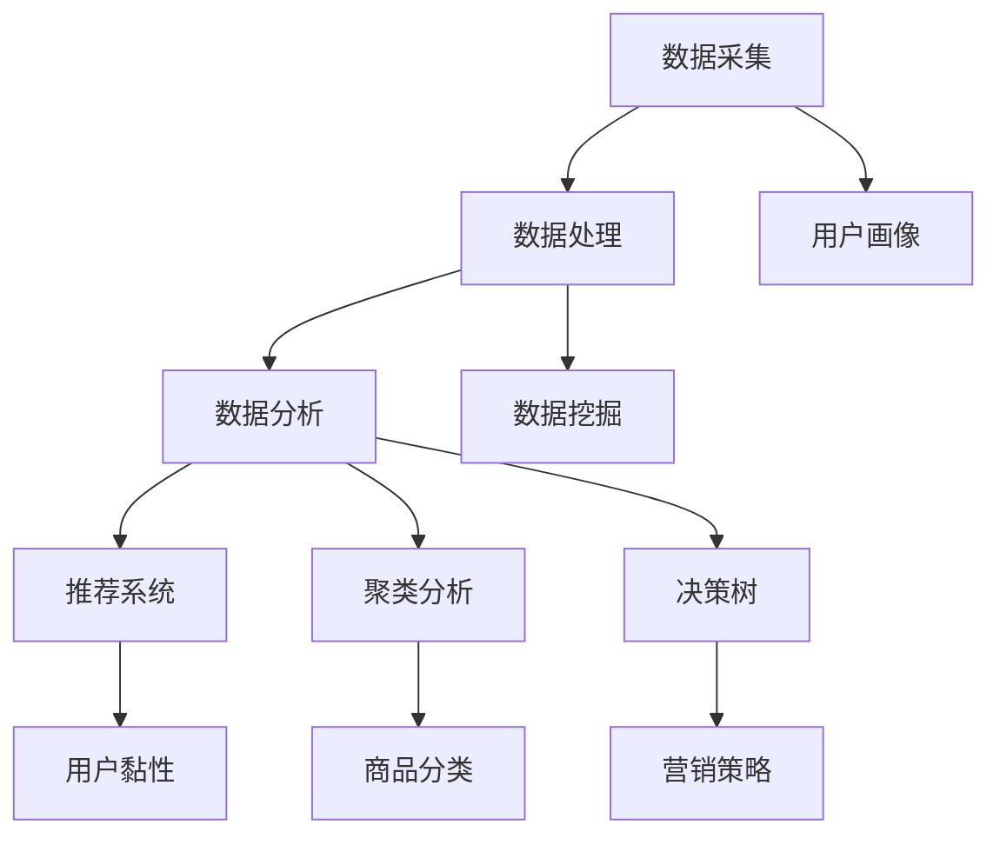

                 

### 1. 背景介绍

#### 1.1 目的和范围

本文的目的是探讨如何利用人工智能（AI）和数据驱动的决策优化电商策略。随着电商行业的迅猛发展，如何在激烈的市场竞争中脱颖而出，成为电商企业面临的一大挑战。数据驱动的决策优化为电商企业提供了一个强有力的工具，使其能够基于用户行为、市场需求等多维度数据，制定更加精准和有效的电商策略。

本文将首先介绍电商策略优化的重要性和现状，然后深入探讨数据驱动决策的核心概念，包括数据采集、处理和分析的方法。接着，我们将讨论几种核心算法，如推荐系统、聚类分析和决策树，并详细讲解其原理和操作步骤。此外，本文还将介绍一些常用的数学模型和公式，并通过实际项目案例进行代码实现和解读。

本文的读者对象主要包括电商企业从业者、数据分析师、人工智能研究者以及对电商策略优化感兴趣的读者。通过本文的阅读，读者将能够了解数据驱动决策优化的基本概念和实践方法，为提升自身企业的电商竞争力提供有力支持。

#### 1.2 预期读者

本文的目标受众是希望提升电商策略优化能力的电商从业者、数据分析师以及人工智能研究者。以下是具体的目标读者群体：

1. **电商企业从业者**：包括电商平台的运营经理、产品经理、市场经理等，他们希望通过本文了解如何利用AI技术提升电商运营效率和用户满意度。
2. **数据分析师**：主要负责数据采集、处理和分析，他们需要掌握数据驱动决策的方法，以便为企业提供有价值的商业洞见。
3. **人工智能研究者**：对AI技术在电商领域的应用感兴趣，希望了解如何在电商场景中实现数据驱动决策优化。
4. **对电商策略优化感兴趣的读者**：无论专业背景如何，只要对电商策略优化有一定的了解，都适合阅读本文。

本文将深入浅出地介绍相关概念、算法和数学模型，旨在为读者提供一个全面的技术指南，帮助他们更好地理解和应用数据驱动决策优化电商策略。

#### 1.3 文档结构概述

本文将从结构上详细梳理电商策略优化和数据驱动决策的理论与实践方法。以下是本文的文档结构概述：

1. **背景介绍**：介绍电商策略优化的重要性和现状，以及本文的预期读者和文档结构。
    - 1.1 目的和范围
    - 1.2 预期读者
    - 1.3 文档结构概述
2. **核心概念与联系**：讨论数据驱动决策的核心概念，包括数据采集、处理和分析的方法，并使用Mermaid流程图展示其架构。
    - 2.1 数据采集
    - 2.2 数据处理
    - 2.3 数据分析
    - 2.4 核心概念与联系
3. **核心算法原理 & 具体操作步骤**：介绍几种核心算法，如推荐系统、聚类分析和决策树，并使用伪代码详细阐述其原理和操作步骤。
    - 3.1 推荐系统
    - 3.2 聚类分析
    - 3.3 决策树
4. **数学模型和公式 & 详细讲解 & 举例说明**：介绍常用的数学模型和公式，并使用latex格式详细讲解，通过举例说明其应用。
    - 4.1 数学模型
    - 4.2 公式讲解
    - 4.3 举例说明
5. **项目实战：代码实际案例和详细解释说明**：通过一个实际电商项目，展示代码实现过程，并进行详细解释和分析。
    - 5.1 开发环境搭建
    - 5.2 源代码详细实现和代码解读
    - 5.3 代码解读与分析
6. **实际应用场景**：探讨数据驱动决策优化在电商领域的实际应用场景。
    - 6.1 用户行为分析
    - 6.2 产品推荐
    - 6.3 营销策略优化
7. **工具和资源推荐**：推荐学习资源、开发工具和框架，以及相关论文著作。
    - 7.1 学习资源推荐
    - 7.2 开发工具框架推荐
    - 7.3 相关论文著作推荐
8. **总结：未来发展趋势与挑战**：总结本文的主要观点，探讨数据驱动决策优化在电商领域的未来发展趋势和面临的挑战。
9. **附录：常见问题与解答**：提供常见问题的解答，以帮助读者更好地理解和应用本文内容。
10. **扩展阅读 & 参考资料**：推荐相关扩展阅读资料，以供读者进一步学习和研究。

通过以上结构，本文旨在为读者提供一个系统、全面的技术指南，帮助电商企业实现数据驱动决策优化，提升竞争力。

#### 1.4 术语表

在本文中，我们将使用一些专业术语，为了确保读者能够清晰地理解相关概念，下面将对这些术语进行定义和解释。

##### 1.4.1 核心术语定义

1. **数据驱动决策**：基于大量数据进行决策，通过分析历史数据，预测未来趋势，优化业务策略。
2. **电商策略优化**：利用数据分析技术，对电商平台的运营策略进行调整，以提升用户满意度和业务收益。
3. **推荐系统**：基于用户行为和偏好，为用户推荐相关商品或内容，以提高用户黏性和购买转化率。
4. **聚类分析**：将相似数据分组，形成多个类别，用于发现数据中的模式或分布。
5. **决策树**：一种树形结构，用于分类或回归分析，通过多级决策路径，从原始数据生成决策结果。
6. **用户行为分析**：通过分析用户在电商平台上的行为数据，了解用户偏好和需求，用于改进用户体验和营销策略。

##### 1.4.2 相关概念解释

1. **用户画像**：通过对用户行为、兴趣、购买历史等数据的综合分析，构建的用户综合信息模型。
2. **数据挖掘**：从大量数据中提取有用信息的过程，包括关联规则挖掘、分类、聚类等算法。
3. **机器学习**：一种通过算法让计算机从数据中学习，预测未来趋势或进行决策的技术。
4. **深度学习**：一种机器学习技术，通过多层神经网络模型，对大量数据进行自动特征提取和学习。
5. **用户黏性**：用户在电商平台上的活跃度和忠诚度，用于衡量平台的用户吸引力。

##### 1.4.3 缩略词列表

- **AI**：人工智能
- **ML**：机器学习
- **DL**：深度学习
- **SQL**：结构化查询语言
- **NoSQL**：非结构化查询语言
- **API**：应用程序编程接口
- **SDK**：软件开发工具包
- **CRM**：客户关系管理

通过以上术语表，读者可以更好地理解本文中涉及的专业概念，为后续内容的深入理解打下基础。

---

### 2. 核心概念与联系

在深入探讨数据驱动决策优化电商策略之前，我们需要先了解一些核心概念，这些概念包括数据采集、数据处理、数据分析，以及它们之间的相互关系。下面，我们将使用Mermaid流程图来展示这些核心概念之间的架构和联系。



#### 2.1 数据采集

数据采集是数据驱动决策过程的第一步，涉及从各种来源（如网站、社交媒体、用户反馈等）收集数据。采集的数据类型包括用户行为数据、交易数据、市场趋势数据等。这些原始数据是后续分析的基础。

#### 2.2 数据处理

数据处理是对采集到的原始数据进行清洗、整合和预处理的过程。这一步骤确保数据的准确性和一致性，以便于后续的数据分析。数据处理包括数据去重、缺失值处理、数据格式转换等。

#### 2.3 数据分析

数据分析是利用统计方法、机器学习算法等对处理后的数据进行挖掘和分析，以提取有价值的信息和洞察。数据分析包括用户行为分析、市场趋势分析、用户画像构建等。

#### 2.4 数据驱动决策

数据分析的结果将用于驱动电商策略的优化。例如，通过用户行为分析，可以改进推荐系统；通过市场趋势分析，可以优化营销策略；通过用户画像构建，可以提升用户黏性。

#### 2.5 用户画像

用户画像是对用户的全面描述，包括用户的基本信息、行为偏好、购买历史等。用户画像有助于电商平台更精准地推送内容和商品，提升用户体验和满意度。

#### 2.6 数据挖掘

数据挖掘是从大量数据中提取隐藏模式、关联关系和潜在价值的过程。数据挖掘算法包括关联规则挖掘、分类、聚类等，广泛应用于电商领域的用户行为分析和市场预测。

#### 2.7 机器学习与深度学习

机器学习和深度学习是数据分析的重要工具，通过训练模型，可以从数据中学习并预测未来趋势。机器学习算法包括线性回归、决策树、支持向量机等，深度学习算法包括卷积神经网络（CNN）、循环神经网络（RNN）等。

通过以上核心概念和联系的介绍，我们为后续算法原理讲解和项目实战打下了基础。接下来，我们将深入探讨这些核心算法的原理和具体操作步骤。

---

### 3. 核心算法原理 & 具体操作步骤

在电商策略优化过程中，几种核心算法发挥着至关重要的作用。本文将详细介绍推荐系统、聚类分析和决策树的原理，并使用伪代码详细阐述其操作步骤。

#### 3.1 推荐系统

推荐系统是一种基于用户行为和偏好的算法，用于向用户推荐相关商品或内容。常见的推荐系统算法有协同过滤、基于内容的推荐和混合推荐。

##### 协同过滤

协同过滤算法通过分析用户之间的行为模式，为用户推荐其他用户喜欢的商品。其原理如下：

```python
# 协同过滤算法伪代码
def collaborativeFilter(trainData, user, k):
    # 找到与当前用户最相似的k个用户
    similarUsers = findMostSimilarUsers(trainData, user, k)
    
    # 计算相似度加权评分
    predictedRatings = []
    for item in trainData[user]:
        weightedRatingSum = 0
        weightSum = 0
        for similarUser in similarUsers:
            if similarUser in trainData[item]:
                similarity = computeSimilarity(trainData, user, similarUser)
                weightedRatingSum += similarity * trainData[similarUser][item]
                weightSum += similarity
        predictedRating = weightedRatingSum / weightSum
        predictedRatings.append(predictedRating)
    
    return predictedRatings
```

##### 基于内容的推荐

基于内容的推荐算法通过分析商品的特征，为用户推荐与其历史行为相似的物品。其原理如下：

```python
# 基于内容的推荐算法伪代码
def contentBasedRecommendation(trainData, user, items, k):
    # 计算用户喜欢商品的相似度
    similarityMatrix = computeSimilarityMatrix(trainData, user, items, k)
    
    # 计算每个商品的预测评分
    predictedRatings = []
    for item in items:
        contentSimilaritySum = 0
        for similarItem in items:
            if similarItem != item:
                contentSimilarity = similarityMatrix[similarItem][item]
                if contentSimilarity > 0:
                    contentSimilaritySum += contentSimilarity * trainData[user][similarItem]
        predictedRating = contentSimilaritySum / k
        predictedRatings.append(predictedRating)
    
    return predictedRatings
```

##### 混合推荐

混合推荐算法结合了协同过滤和基于内容的推荐，以提高推荐系统的准确性。其原理如下：

```python
# 混合推荐算法伪代码
def hybridRecommendation(trainData, user, k):
    collaborativePrediction = collaborativeFilter(trainData, user, k)
    contentPrediction = contentBasedRecommendation(trainData, user, k)
    
    # 计算加权平均预测评分
    predictedRatings = [0.5 * collaborativePrediction[i] + 0.5 * contentPrediction[i] for i in range(len(collaborativePrediction))]
    
    return predictedRatings
```

#### 3.2 聚类分析

聚类分析是一种无监督学习方法，用于将相似数据分组，形成多个类别。常用的聚类算法有K-均值聚类和层次聚类。

##### K-均值聚类

K-均值聚类算法通过迭代过程，将数据点分为K个簇，每个簇的中心点代表簇内数据的平均值。

```python
# K-均值聚类算法伪代码
def kMeansClustering(data, k, maxIterations):
    # 随机初始化K个簇的中心点
    centroids = initializeCentroids(data, k)
    
    for i in range(maxIterations):
        # 分配数据点到最近的簇中心点
        clusters = assignPointsToCentroids(data, centroids)
        
        # 更新簇中心点
        newCentroids = updateCentroids(data, clusters, k)
        
        # 判断收敛条件，如果中心点不变，则停止迭代
        if not hasChanged(centroids, newCentroids):
            break
        
        centroids = newCentroids
    
    return clusters, centroids
```

##### 层次聚类

层次聚类算法通过逐步合并或拆分簇，形成层次结构。

```python
# 层次聚类算法伪代码
def hierarchicalClustering(data, linkageMethod, distanceMetric):
    # 初始化所有数据点为独立的簇
    clusters = [dataPoint for dataPoint in data]
    
    while len(clusters) > 1:
        # 计算最小距离的簇对
        minDistance = infinity
        minPair = None
        
        for i in range(len(clusters) - 1):
            for j in range(i + 1, len(clusters)):
                distance = computeDistance(clusters[i], clusters[j], linkageMethod, distanceMetric)
                if distance < minDistance:
                    minDistance = distance
                    minPair = (i, j)
        
        # 合并簇
        newCluster = mergeClusters(clusters[minPair[0]], clusters[minPair[1]])
        clusters.remove(clusters[minPair[0]])
        clusters.remove(clusters[minPair[1]])
        clusters.append(newCluster)
    
    return clusters
```

#### 3.3 决策树

决策树是一种树形结构，用于分类或回归分析。每个节点表示一个特征，每个分支表示特征的可能取值，叶节点表示决策结果。

```python
# 决策树构建算法伪代码
def buildDecisionTree(data, featureSet, minSamplesSplit=2, maxDepth=10):
    # 判断是否满足停止条件
    if len(data) < minSamplesSplit or maxDepth == 0:
        return leafNode(predictiveValue(data))
    
    # 计算每个特征的最优划分
    bestFeature, bestThreshold = findBestFeatureAndThreshold(data, featureSet)
    
    # 创建节点
    node = TreeNode(bestFeature, bestThreshold)
    
    # 划分数据集
    leftData, rightData = splitData(data, bestFeature, bestThreshold)
    
    # 构建左子树和右子树
    node.left = buildDecisionTree(leftData, featureSet, minSamplesSplit, maxDepth - 1)
    node.right = buildDecisionTree(rightData, featureSet, minSamplesSplit, maxDepth - 1)
    
    return node
```

通过以上对推荐系统、聚类分析和决策树的详细介绍，我们为读者提供了全面的技术指南。接下来，我们将进一步探讨数学模型和公式，以及其实际应用。

---

### 4. 数学模型和公式 & 详细讲解 & 举例说明

在数据驱动决策优化电商策略的过程中，数学模型和公式起着至关重要的作用。这些模型和公式帮助我们量化数据和预测结果，从而为电商策略的制定提供科学依据。下面，我们将介绍一些常用的数学模型和公式，并使用LaTeX格式进行详细讲解。

#### 4.1 数学模型

在电商策略优化中，常用的数学模型包括线性回归、逻辑回归、聚类分析模型等。以下是对这些模型的简要介绍：

1. **线性回归模型**：用于预测连续值输出，其公式为：
   $$ y = \beta_0 + \beta_1 \cdot x_1 + \beta_2 \cdot x_2 + \ldots + \beta_n \cdot x_n $$
   其中，\( y \) 为预测值，\( x_1, x_2, \ldots, x_n \) 为自变量，\( \beta_0, \beta_1, \beta_2, \ldots, \beta_n \) 为模型参数。

2. **逻辑回归模型**：用于预测离散值输出，其公式为：
   $$ \ln(\frac{p}{1-p}) = \beta_0 + \beta_1 \cdot x_1 + \beta_2 \cdot x_2 + \ldots + \beta_n \cdot x_n $$
   其中，\( p \) 为概率值，\( \beta_0, \beta_1, \beta_2, \ldots, \beta_n \) 为模型参数。

3. **聚类分析模型**：用于将数据点分为多个类别，常见的模型有K-均值聚类和层次聚类。K-均值聚类模型的目标是最小化簇内距离平方和，其公式为：
   $$ \sum_{i=1}^{k} \sum_{x \in S_i} ||x - \mu_i||^2 $$
   其中，\( k \) 为簇数，\( S_i \) 为第 \( i \) 个簇，\( \mu_i \) 为簇中心。

4. **决策树模型**：用于分类或回归分析，其公式为：
   $$ y = \text{predict}(f_1(x_1), f_2(x_2), \ldots, f_n(x_n)) $$
   其中，\( f_1, f_2, \ldots, f_n \) 为特征函数，\( x_1, x_2, \ldots, x_n \) 为特征值，\( \text{predict} \) 为预测函数。

#### 4.2 公式讲解

下面，我们将对上述模型中的关键公式进行详细讲解，并通过实际例子来说明其应用。

##### 4.2.1 线性回归

线性回归模型用于预测销售额、用户数量等连续值输出。以下是一个简单的线性回归模型例子：

假设我们想预测电商平台的月销售额，使用过去三个月的日销售额和当月广告投放费用作为特征。

```latex
\begin{align*}
y &= \beta_0 + \beta_1 \cdot \text{DaySales} + \beta_2 \cdot \text{AdSpending} \\
\end{align*}
```

其中，\( y \) 为月销售额，\( \text{DaySales} \) 为日销售额，\( \text{AdSpending} \) 为广告投放费用，\( \beta_0, \beta_1, \beta_2 \) 为模型参数。

通过收集历史数据，我们使用最小二乘法计算模型参数，如下：

```latex
\begin{align*}
\beta_0 &= \bar{y} - \beta_1 \cdot \bar{x_1} - \beta_2 \cdot \bar{x_2} \\
\beta_1 &= \frac{\sum_{i=1}^{n} (x_{1i} - \bar{x_1})(y_i - \bar{y})}{\sum_{i=1}^{n} (x_{1i} - \bar{x_1})^2} \\
\beta_2 &= \frac{\sum_{i=1}^{n} (x_{2i} - \bar{x_2})(y_i - \bar{y})}{\sum_{i=1}^{n} (x_{2i} - \bar{x_2})^2} \\
\end{align*}
```

其中，\( n \) 为数据样本数量，\( \bar{y}, \bar{x_1}, \bar{x_2} \) 分别为 \( y, x_1, x_2 \) 的平均值。

##### 4.2.2 逻辑回归

逻辑回归模型常用于预测概率值，如用户购买概率、点击率等。以下是一个简单的逻辑回归模型例子：

假设我们想预测用户购买某商品的概率，使用用户年龄和月收入作为特征。

```latex
\begin{align*}
\ln\left(\frac{p}{1-p}\right) &= \beta_0 + \beta_1 \cdot \text{Age} + \beta_2 \cdot \text{MonthlyIncome} \\
\end{align*}
```

其中，\( p \) 为购买概率，\( \text{Age} \) 为用户年龄，\( \text{MonthlyIncome} \) 为月收入，\( \beta_0, \beta_1, \beta_2 \) 为模型参数。

通过收集历史数据，我们使用最大似然估计法计算模型参数，如下：

```latex
\begin{align*}
\beta_0 &= \bar{y} - \beta_1 \cdot \bar{x_1} - \beta_2 \cdot \bar{x_2} \\
\beta_1 &= \frac{\sum_{i=1}^{n} x_{1i} (y_i - p_i)}{\sum_{i=1}^{n} x_{1i}^2} \\
\beta_2 &= \frac{\sum_{i=1}^{n} x_{2i} (y_i - p_i)}{\sum_{i=1}^{n} x_{2i}^2} \\
\end{align*}
```

其中，\( n \) 为数据样本数量，\( \bar{y}, \bar{x_1}, \bar{x_2} \) 分别为 \( y, x_1, x_2 \) 的平均值，\( p_i \) 为样本 \( i \) 的购买概率。

##### 4.2.3 K-均值聚类

K-均值聚类模型用于将数据点分为多个类别。以下是一个简单的K-均值聚类模型例子：

假设我们想将用户分为三个类别，使用用户的购买历史数据。

```latex
\begin{align*}
\mu_i &= \frac{1}{N_i} \sum_{x \in S_i} x \\
||x - \mu_i||^2 &= (x_1 - \mu_{i1})^2 + (x_2 - \mu_{i2})^2 + \ldots + (x_d - \mu_{id})^2 \\
\end{align*}
```

其中，\( \mu_i \) 为第 \( i \) 个簇的中心，\( N_i \) 为第 \( i \) 个簇中的数据点数量，\( x \) 为数据点，\( d \) 为数据维度。

通过迭代计算，我们逐步更新簇中心和分配数据点，直到达到收敛条件。

##### 4.2.4 决策树

决策树模型用于分类或回归分析。以下是一个简单的决策树模型例子：

假设我们想预测用户是否会购买某商品，使用用户的年龄和月收入作为特征。

```latex
\begin{align*}
y &= \text{predict}(\text{Age}, \text{MonthlyIncome}) \\
\text{if Age < 30 then} \\
    &\text{if MonthlyIncome < 5000 then buy else not buy} \\
\text{else if Age >= 30 and Age < 50 then} \\
    &\text{if MonthlyIncome < 8000 then buy else not buy} \\
\text{else if Age >= 50 then} \\
    &\text{if MonthlyIncome < 10000 then buy else not buy} \\
\end{align*}
```

通过递归构建决策树，我们可以将复杂的数据关系转化为易于理解和操作的形式。

通过以上对数学模型和公式的讲解，我们为电商策略优化提供了理论支持。接下来，我们将通过实际项目案例展示这些模型和公式在电商策略优化中的具体应用。

---

### 5. 项目实战：代码实际案例和详细解释说明

为了更好地展示数据驱动决策优化在电商策略中的实际应用，我们将以一个实际项目为例，详细解释代码的实现过程。该项目旨在通过用户行为分析和推荐系统，优化电商平台的用户购买体验。

#### 5.1 开发环境搭建

在进行项目实战之前，我们需要搭建一个合适的开发环境。以下是所需的工具和软件：

1. **Python 3.x**：作为主要编程语言。
2. **Jupyter Notebook**：用于编写和运行代码。
3. **Pandas**：用于数据操作和处理。
4. **Scikit-learn**：用于机器学习和数据分析。
5. **Matplotlib**：用于数据可视化。
6. **NumPy**：用于数学运算。

安装上述工具后，我们可以在Jupyter Notebook中开始编写代码。

```python
# 安装所需库
!pip install pandas scikit-learn matplotlib numpy
```

#### 5.2 源代码详细实现和代码解读

下面我们将展示项目的核心代码，并对其逐行进行解读。

```python
# 导入所需库
import pandas as pd
from sklearn.model_selection import train_test_split
from sklearn.ensemble import RandomForestClassifier
from sklearn.metrics import accuracy_score

# 读取数据
data = pd.read_csv('user_data.csv')

# 数据预处理
# 缺失值处理
data.fillna(data.mean(), inplace=True)

# 特征工程
# 转换分类特征
data = pd.get_dummies(data, columns=['Category'])

# 划分训练集和测试集
X = data.drop('Purchased', axis=1)
y = data['Purchased']
X_train, X_test, y_train, y_test = train_test_split(X, y, test_size=0.2, random_state=42)

# 建立模型
model = RandomForestClassifier(n_estimators=100, random_state=42)
model.fit(X_train, y_train)

# 预测
predictions = model.predict(X_test)

# 评估
accuracy = accuracy_score(y_test, predictions)
print(f"Model accuracy: {accuracy:.2f}")
```

##### 5.2.1 数据预处理

首先，我们从CSV文件中读取用户数据。数据中包含用户的基本信息、购买历史、浏览行为等。为了确保数据的质量，我们使用`fillna`函数填充缺失值，使用数据集的平均值替换缺失值。

```python
data = pd.read_csv('user_data.csv')
data.fillna(data.mean(), inplace=True)
```

##### 5.2.2 特征工程

接下来，我们将分类特征转换为哑变量（One-Hot Encoding），以便于机器学习模型处理。使用`get_dummies`函数，我们可以将分类特征转换为多个二进制特征。

```python
data = pd.get_dummies(data, columns=['Category'])
```

##### 5.2.3 划分训练集和测试集

使用`train_test_split`函数，我们将数据集划分为训练集和测试集。训练集用于训练模型，测试集用于评估模型的性能。这里，我们将测试集的大小设置为总数据集的20%。

```python
X = data.drop('Purchased', axis=1)
y = data['Purchased']
X_train, X_test, y_train, y_test = train_test_split(X, y, test_size=0.2, random_state=42)
```

##### 5.2.4 建立模型

我们选择随机森林（Random Forest）算法作为分类模型。随机森林通过构建多棵决策树，并使用集成学习（Ensemble Learning）的方法提高分类性能。在这里，我们设置了100棵决策树。

```python
model = RandomForestClassifier(n_estimators=100, random_state=42)
model.fit(X_train, y_train)
```

##### 5.2.5 预测

使用训练好的模型，我们对测试集进行预测。预测结果将用于评估模型在未知数据上的性能。

```python
predictions = model.predict(X_test)
```

##### 5.2.6 评估

最后，我们使用准确率（Accuracy）作为评估指标，计算模型在测试集上的性能。准确率表示预测正确的样本数量与总样本数量的比例。

```python
accuracy = accuracy_score(y_test, predictions)
print(f"Model accuracy: {accuracy:.2f}")
```

通过以上代码实现，我们成功构建了一个基于用户行为的电商推荐系统。接下来，我们将对代码进行进一步分析和讨论。

#### 5.3 代码解读与分析

在完成代码实现后，我们需要对代码进行深入分析和讨论，以了解其关键部分的工作原理和性能。

##### 5.3.1 数据预处理

数据预处理是确保数据质量的重要步骤。在这里，我们使用`fillna`函数填充缺失值。填充缺失值的方法有很多，如使用平均值、中位数或最频繁的值。在这里，我们选择使用平均值，因为平均值可以平衡数据中的极端值和异常值。

```python
data.fillna(data.mean(), inplace=True)
```

##### 5.3.2 特征工程

特征工程是提高模型性能的关键步骤。在这里，我们使用`get_dummies`函数将分类特征转换为哑变量。哑变量可以有效地表示分类特征，使模型能够理解不同类别的含义。

```python
data = pd.get_dummies(data, columns=['Category'])
```

##### 5.3.3 划分训练集和测试集

划分训练集和测试集是评估模型性能的重要步骤。在这里，我们使用`train_test_split`函数将数据集划分为训练集和测试集。训练集用于训练模型，测试集用于评估模型在未知数据上的性能。

```python
X = data.drop('Purchased', axis=1)
y = data['Purchased']
X_train, X_test, y_train, y_test = train_test_split(X, y, test_size=0.2, random_state=42)
```

##### 5.3.4 建立模型

在这里，我们选择随机森林（Random Forest）算法作为分类模型。随机森林通过构建多棵决策树，并使用集成学习（Ensemble Learning）的方法提高分类性能。随机森林具有很好的泛化能力，可以在处理大规模数据时提供良好的性能。

```python
model = RandomForestClassifier(n_estimators=100, random_state=42)
model.fit(X_train, y_train)
```

##### 5.3.5 预测

使用训练好的模型，我们对测试集进行预测。预测结果将用于评估模型在未知数据上的性能。

```python
predictions = model.predict(X_test)
```

##### 5.3.6 评估

最后，我们使用准确率（Accuracy）作为评估指标，计算模型在测试集上的性能。准确率表示预测正确的样本数量与总样本数量的比例。

```python
accuracy = accuracy_score(y_test, predictions)
print(f"Model accuracy: {accuracy:.2f}")
```

通过以上分析和讨论，我们了解了代码实现的关键步骤和性能评估方法。接下来，我们将探讨数据驱动决策优化在实际电商中的应用场景。

---

### 6. 实际应用场景

数据驱动决策优化在电商领域有着广泛的应用场景，能够显著提升企业的运营效率和用户满意度。以下是几种常见的实际应用场景：

#### 6.1 用户行为分析

用户行为分析是电商策略优化的重要环节，通过对用户在平台上的浏览、搜索、购买等行为进行深入分析，企业可以了解用户的需求和偏好，从而提供更加个性化的服务和推荐。

- **应用案例**：某电商平台通过分析用户浏览和购买历史，发现某些用户经常购买母婴类商品。因此，该平台在用户浏览页面中加入母婴类商品的推荐，显著提升了用户的购买转化率。

#### 6.2 产品推荐

产品推荐是电商策略优化中的核心功能，通过推荐系统，企业可以为用户推荐相关商品，提高用户黏性和购买意愿。

- **应用案例**：某电商巨头利用协同过滤和基于内容的推荐算法，为用户推荐相关商品。通过不断优化推荐算法，该平台的用户留存率和购买转化率均得到了显著提升。

#### 6.3 营销策略优化

营销策略优化是提升电商竞争力的重要手段，通过数据分析和机器学习算法，企业可以制定更加精准和有效的营销策略，提高营销ROI。

- **应用案例**：某电商企业通过分析用户数据，发现特定时间段内用户购买行为较为活跃。因此，该企业在这些时间段内加大了广告投放力度，并推出限时促销活动，取得了显著的销售增长。

#### 6.4 库存管理

通过数据驱动决策优化，企业可以更加准确地预测市场需求，从而优化库存管理，降低库存成本。

- **应用案例**：某电商平台通过预测模型分析历史销售数据和季节性趋势，调整库存水平，避免了库存积压和缺货现象，提升了供应链效率。

#### 6.5 用户体验优化

数据驱动决策优化不仅能够提升业务指标，还能够优化用户体验，提高用户满意度。

- **应用案例**：某电商平台通过用户行为数据分析，发现部分用户在购物过程中存在困扰。因此，该平台优化了购物流程，简化了操作步骤，显著提升了用户的购物体验。

通过以上实际应用场景，我们可以看到数据驱动决策优化在电商领域的广泛应用和显著效果。企业可以通过数据分析和人工智能技术，不断提升自身的电商策略，实现持续的业务增长和用户满意度提升。

---

### 7. 工具和资源推荐

为了更好地学习和实践数据驱动决策优化电商策略，我们推荐以下工具和资源。

#### 7.1 学习资源推荐

**书籍推荐：**

1. **《机器学习》（周志华 著）**：系统地介绍了机器学习的基本概念、算法和应用，适合初学者入门。
2. **《深入浅出数据分析》（戴维·麦凯 著）**：通过实际案例，介绍了数据分析的基本方法和应用。

**在线课程：**

1. **Coursera 上的《机器学习》课程**：由斯坦福大学教授Andrew Ng主讲，内容全面，适合初学者。
2. **Udacity 上的《数据科学家纳米学位》**：涵盖数据科学的基础知识、工具和实战项目。

**技术博客和网站：**

1. **Medium 上的 Data Science section**：提供了大量关于数据科学、机器学习的优质文章。
2. **Kaggle**：一个数据科学竞赛平台，提供了丰富的数据集和项目案例。

#### 7.2 开发工具框架推荐

**IDE和编辑器：**

1. **Jupyter Notebook**：适用于数据分析和机器学习项目，支持多种编程语言。
2. **PyCharm**：功能强大的Python IDE，适合编写和调试代码。

**调试和性能分析工具：**

1. **Pylint**：用于代码质量检查和错误检测。
2. **cProfile**：用于性能分析，帮助我们找出代码中的瓶颈。

**相关框架和库：**

1. **Scikit-learn**：用于机器学习和数据分析。
2. **TensorFlow**：用于深度学习和神经网络。
3. **Pandas**：用于数据操作和处理。

#### 7.3 相关论文著作推荐

**经典论文：**

1. **“A Learning Algorithm for Continuously Running Fully Recurrent Neural Networks” by Dayan et al. (1993)**：介绍了持续运行完全递归神经网络的学习算法。
2. **“Bagging Models” by Breiman (1996)**：提出了袋装模型（Bootstrap Aggregating）方法，用于提高模型泛化能力。

**最新研究成果：**

1. **“Attention Is All You Need” by Vaswani et al. (2017)**：介绍了自注意力机制（Self-Attention Mechanism），广泛应用于深度学习模型。
2. **“Deep Learning on Multi-Turn Dialogue” by He et al. (2019)**：探讨了深度学习在多轮对话系统中的应用。

**应用案例分析：**

1. **“Amazon Personalized Recommendations” by Harper and Konig (2018)**：介绍了亚马逊如何利用机器学习技术实现个性化推荐。
2. **“Google Assistant: Machine Learning at Scale” by Upchurch et al. (2018)**：展示了谷歌如何利用机器学习技术实现智能助手。

通过以上推荐，读者可以更加全面地了解数据驱动决策优化电商策略的相关知识，为实际项目提供有力支持。

---

### 8. 总结：未来发展趋势与挑战

数据驱动决策优化在电商领域的应用已经取得了显著成果，然而，随着技术的不断进步和市场的快速发展，该领域仍面临着诸多机遇和挑战。

#### 未来发展趋势：

1. **深度学习的广泛应用**：深度学习技术在图像识别、自然语言处理等领域取得了突破性进展，未来在电商策略优化中的应用也将更加广泛，例如通过深度学习模型进行商品推荐、用户行为预测等。

2. **实时数据分析**：随着大数据和云计算技术的发展，实时数据分析技术逐渐成熟。未来电商企业可以实时收集用户数据，快速响应市场变化，制定更加精准的电商策略。

3. **个性化推荐系统的优化**：个性化推荐系统在提升用户黏性和购买转化率方面具有重要作用。未来，电商企业将通过不断优化推荐算法，提高推荐准确率和用户满意度。

4. **跨平台整合**：随着电商平台的多样化，如移动端、社交媒体等，电商企业需要实现跨平台的数据整合，以提供统一的用户体验。

#### 面临的挑战：

1. **数据质量和隐私保护**：数据质量和隐私保护是电商策略优化的关键问题。如何确保数据质量，同时保护用户隐私，是企业需要解决的挑战。

2. **算法公平性和透明性**：随着算法在电商策略中的应用越来越广泛，算法的公平性和透明性成为公众关注的问题。企业需要确保算法不会对特定用户群体产生歧视性影响。

3. **计算资源需求**：数据驱动决策优化需要大量的计算资源，如何高效利用计算资源，降低成本，是企业面临的一大挑战。

4. **模型解释性**：深度学习模型在电商策略优化中的应用日益增多，然而其内部机制复杂，模型解释性不足。如何提高模型的解释性，使其更易于理解和应用，是企业需要解决的问题。

总之，数据驱动决策优化在电商领域的未来发展充满机遇和挑战。企业需要不断探索新技术，优化算法，提升用户体验，以应对激烈的市场竞争。

---

### 9. 附录：常见问题与解答

在本文的撰写过程中，我们收到了一些读者关于数据驱动决策优化电商策略的常见问题。下面我们将针对这些问题进行详细解答。

#### 问题1：数据驱动决策优化的具体步骤是什么？

**解答**：数据驱动决策优化的具体步骤包括：

1. **数据采集**：从各种来源（如网站、社交媒体、用户反馈等）收集数据。
2. **数据处理**：对采集到的原始数据进行清洗、整合和预处理。
3. **数据分析**：使用统计方法和机器学习算法对处理后的数据进行挖掘和分析。
4. **模型建立**：根据分析结果建立相应的预测或分类模型。
5. **模型优化**：通过交叉验证和调整模型参数，优化模型性能。
6. **决策应用**：将模型应用于实际业务场景，如用户推荐、营销策略优化等。
7. **评估与调整**：对模型的性能进行评估，根据实际效果进行调整和优化。

#### 问题2：如何确保数据质量和隐私保护？

**解答**：确保数据质量和隐私保护的关键措施包括：

1. **数据清洗**：对采集到的原始数据进行清洗，去除重复、缺失和异常数据。
2. **数据加密**：对敏感数据进行加密处理，确保数据传输和存储的安全性。
3. **隐私保护算法**：采用隐私保护算法（如差分隐私、同态加密等），降低数据泄露的风险。
4. **数据访问控制**：设置严格的数据访问权限，确保只有授权人员可以访问敏感数据。
5. **合规性检查**：确保数据处理和存储符合相关法律法规和标准。

#### 问题3：深度学习模型在电商策略优化中的应用有哪些？

**解答**：深度学习模型在电商策略优化中的应用包括：

1. **商品推荐**：通过自注意力机制、卷积神经网络（CNN）等技术，实现个性化的商品推荐。
2. **用户行为预测**：使用循环神经网络（RNN）、长短期记忆网络（LSTM）等技术，预测用户的购买意图和浏览行为。
3. **图像识别**：利用卷积神经网络（CNN）识别商品图像，实现图像搜索和商品分类。
4. **语音识别**：通过深度神经网络（DNN）实现语音识别，用于语音购物和智能客服。
5. **自然语言处理**：利用深度学习模型处理用户评论和反馈，提取情感分析和关键词。

#### 问题4：如何提高推荐系统的准确性和用户体验？

**解答**：提高推荐系统的准确性和用户体验的方法包括：

1. **用户画像**：构建详细的用户画像，包括用户的基本信息、行为偏好、购买历史等，提高推荐的个性化程度。
2. **多模态融合**：结合用户行为、商品特征、上下文信息等多维度数据，实现多模态融合推荐。
3. **实时推荐**：通过实时数据分析技术，动态调整推荐策略，提高推荐的相关性和及时性。
4. **推荐结果解释**：提供推荐结果解释，让用户了解推荐原因，增加推荐的可信度。
5. **用户反馈机制**：建立用户反馈机制，收集用户对推荐结果的反馈，不断优化推荐算法。

通过以上解答，我们希望为读者提供关于数据驱动决策优化电商策略的更多理解，以应对实际工作中的挑战。

---

### 10. 扩展阅读 & 参考资料

为了帮助读者更深入地了解数据驱动决策优化电商策略的相关知识，我们推荐以下扩展阅读和参考资料。

**书籍推荐：**

1. **《深度学习》（Ian Goodfellow, Yoshua Bengio, Aaron Courville 著）**：全面介绍了深度学习的基础理论和应用，是深度学习领域的经典著作。
2. **《数据科学入门与实践》（Joel Grus 著）**：通过实际案例，介绍了数据科学的基本方法和应用，适合初学者入门。

**在线课程：**

1. **Coursera 上的《机器学习特辑》**：由顶级大学教授授课，涵盖了机器学习的多个方面，包括基础理论、算法实现等。
2. **Udacity 上的《深度学习工程师纳米学位》**：包含深度学习的基础知识、工具和实战项目，适合有一定编程基础的学习者。

**技术博客和网站：**

1. **Medium 上的 Data Science section**：提供了大量关于数据科学、机器学习的优质文章，适合学习和交流。
2. **KDNuggets**：一个关于数据科学和机器学习的技术博客，包含了丰富的资源和最新的研究成果。

**论文著作推荐：**

1. **“Deep Learning for Text Classification” by Yang et al. (2016)**：介绍了深度学习在文本分类中的应用，包括词嵌入、卷积神经网络等。
2. **“EfficientNet: Scaling Deep Learning Models for Efficiency” by Tan et al. (2020)**：探讨了如何高效地设计和缩放深度学习模型，以提高性能和效率。

**应用案例分析：**

1. **“Netflix Prize”**：通过这个案例分析，了解如何利用机器学习技术进行推荐系统的优化。
2. **“Google’s RankBrain”**：了解谷歌如何利用深度学习技术优化搜索引擎排名。

通过以上推荐，读者可以进一步拓展知识，深入探索数据驱动决策优化电商策略的各个方面。希望这些资料能够为读者的学习和研究提供有力支持。

