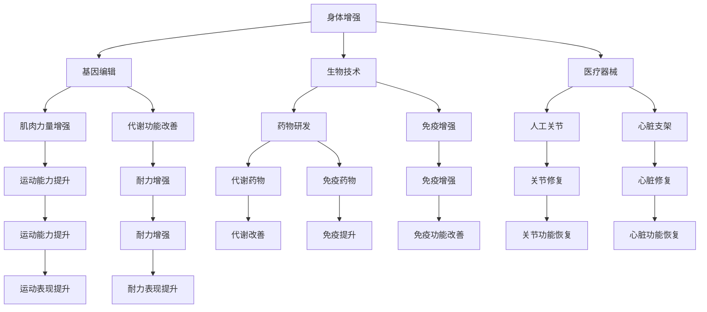

                 

# AI时代的人类增强：身体增强与认知增强

> 关键词：人工智能、身体增强、认知增强、生物技术、神经科学、计算模型、神经网络、基因编辑、脑机接口

> 摘要：本文将探讨AI时代下人类增强的两大领域——身体增强与认知增强。通过深入分析其核心概念、原理和具体技术，我们将探讨人类如何在AI的助力下，超越生理和认知局限，实现更高效、更智能的生活。本文将分为背景介绍、核心概念与联系、核心算法原理与操作步骤、数学模型和公式、项目实战、实际应用场景、工具和资源推荐、总结与展望等部分，旨在为读者提供一个全面、深入的了解。

## 1. 背景介绍

### 1.1 目的和范围

本文旨在探讨AI时代下的人类增强，重点关注身体增强和认知增强两个领域。我们希望通过本文，读者能够了解这些技术的核心概念、原理和具体实现，从而对AI时代的人类增强有一个全面的认识。

### 1.2 预期读者

本文适合对人工智能、生物技术、神经科学等领域感兴趣的读者，尤其是对AI时代的人类增强技术感兴趣的专业人士和普通读者。

### 1.3 文档结构概述

本文分为十个部分，包括背景介绍、核心概念与联系、核心算法原理与操作步骤、数学模型和公式、项目实战、实际应用场景、工具和资源推荐、总结与展望等。每个部分都将深入探讨相应的主题。

### 1.4 术语表

#### 1.4.1 核心术语定义

- 身体增强：通过生物技术、医疗器械等手段，提高人体生理功能的水平。
- 认知增强：通过脑机接口、神经科学等手段，提升人的认知能力和信息处理速度。
- 脑机接口（BCI）：一种直接将大脑信号转换为计算机命令的技术。
- 基因编辑：一种通过修改DNA序列，实现对生物体遗传信息的编辑和修复的技术。
- 人工智能（AI）：一种模拟人类智能的技术，通过计算机程序实现智能行为。

#### 1.4.2 相关概念解释

- 生物技术：利用生物体或其成分，为人类提供产品或服务的科学技术。
- 神经科学：研究神经系统结构和功能的科学。
- 计算模型：用于模拟和研究复杂系统的数学模型。
- 神经网络：一种模拟人脑神经元连接结构的计算模型。
- 伪代码：一种非正式的编程语言，用于描述算法的步骤和逻辑。

#### 1.4.3 缩略词列表

- BCI：脑机接口
- AI：人工智能
- CRISPR：成簇规律间隔短回文重复相关蛋白
- GPU：图形处理单元
- NLP：自然语言处理

## 2. 核心概念与联系

在AI时代，身体增强与认知增强是两个关键领域。身体增强主要通过生物技术和医疗器械提高人体生理功能，如增强肌肉力量、改善运动能力、修复损伤等。认知增强则通过脑机接口、神经科学等手段提升人的认知能力和信息处理速度，如提高记忆力、增强注意力、加速学习等。

### 2.1 身体增强

身体增强的核心在于提高人体生理功能的水平。这可以通过基因编辑、生物技术、医疗器械等多种手段实现。例如，通过基因编辑技术，我们可以修复或增强特定基因，从而提高肌肉力量或耐力。通过生物技术，我们可以开发出能够改善人体代谢、增强免疫功能的药物。通过医疗器械，我们可以帮助患者修复损伤，如人工关节、心脏支架等。

### 2.2 认知增强

认知增强的核心在于提升人的认知能力和信息处理速度。这可以通过脑机接口、神经科学等手段实现。脑机接口（BCI）是一种直接将大脑信号转换为计算机命令的技术，通过BCI，我们可以实现思维控制计算机、轮椅等设备。神经科学则通过研究大脑的结构和功能，开发出能够提高记忆、注意力、学习能力的药物和设备。

### 2.3 联系与差异

身体增强和认知增强虽然领域不同，但它们有着密切的联系。例如，通过基因编辑技术，我们可以同时改善人体生理功能和认知能力。再如，通过脑机接口技术，我们可以实现身体和认知的双重增强。同时，两者也有明显的差异。身体增强主要关注生理层面的提升，而认知增强主要关注心理层面的提升。

### 2.4 Mermaid 流程图

下面是一个简单的Mermaid流程图，展示了身体增强和认知增强的核心概念和联系。



## 3. 核心算法原理 & 具体操作步骤

### 3.1 身体增强算法原理

身体增强的核心算法主要基于基因编辑和生物技术。基因编辑技术如CRISPR-Cas9可以精确地修改目标DNA序列，从而实现对特定基因的增强或修复。生物技术则通过开发出能够改善人体生理功能的药物和设备，实现对身体增强的支持。

#### 3.1.1 基因编辑算法原理

基因编辑算法的基本原理是通过识别目标DNA序列，然后使用Cas9酶进行切割和修复。具体步骤如下：

1. 设计并合成特异性引物，用于定位目标DNA序列。
2. 使用CRISPR系统将Cas9酶引导至目标DNA序列。
3. Cas9酶在目标DNA序列处进行切割。
4. 细胞DNA修复系统对切割后的DNA进行修复，从而实现对目标基因的编辑。

#### 3.1.2 生物技术算法原理

生物技术算法原理主要包括药物开发和设备研发。药物开发主要通过分子模拟和生物实验，筛选出能够改善人体生理功能的药物。设备研发则通过生物力学和材料科学，开发出能够提高人体生理功能的设备。

### 3.2 认知增强算法原理

认知增强的核心算法主要基于脑机接口和神经科学。脑机接口技术通过识别和解读大脑信号，将大脑信号转换为计算机命令。神经科学则通过研究大脑的结构和功能，开发出能够提高认知能力的药物和设备。

#### 3.2.1 脑机接口算法原理

脑机接口算法的基本原理是通过识别和解读大脑信号，将大脑信号转换为计算机命令。具体步骤如下：

1. 采集大脑信号，如脑电图（EEG）。
2. 使用信号处理技术，对采集到的大脑信号进行预处理。
3. 使用机器学习算法，对预处理后的大脑信号进行模式识别。
4. 根据识别出的模式，生成相应的计算机命令。

#### 3.2.2 神经科学算法原理

神经科学算法原理主要包括药物开发和设备研发。药物开发主要通过分子模拟和生物实验，筛选出能够提高认知能力的药物。设备研发则通过神经生理学和神经工程学，开发出能够提高认知能力的设备。

### 3.3 操作步骤

#### 3.3.1 身体增强操作步骤

1. 确定目标基因或生理功能。
2. 设计并合成特异性引物。
3. 使用CRISPR系统进行基因编辑。
4. 进行生物实验，验证基因编辑效果。
5. 开发药物或设备，实现身体增强。

#### 3.3.2 认知增强操作步骤

1. 确定目标认知能力。
2. 采集大脑信号。
3. 使用信号处理技术进行预处理。
4. 使用机器学习算法进行模式识别。
5. 根据识别出的模式，生成相应的计算机命令。
6. 进行认知实验，验证认知增强效果。

### 3.4 伪代码示例

下面是一个简单的身体增强算法的伪代码示例。

```python
# 基因编辑算法伪代码

def gene_edit(target_dna_sequence, guide_sequence, cas9_enzyme):
    # 步骤1：设计并合成特异性引物
    specific_primer = design_primer(guide_sequence)
    
    # 步骤2：使用CRISPR系统将Cas9酶引导至目标DNA序列
    guide_rna = design_guide_rna(guide_sequence)
    crispr_system = CRISPR(specific_primer, guide_rna)
    
    # 步骤3：Cas9酶在目标DNA序列处进行切割
    cut_dna = crispr_system.cutting(target_dna_sequence)
    
    # 步骤4：细胞DNA修复系统对切割后的DNA进行修复
    repaired_dna = cell_dna_repair(cut_dna)
    
    return repaired_dna

# 生物技术算法伪代码

def biological_tech(drug_target, device_target):
    # 步骤1：分子模拟和生物实验，筛选药物
    drug = drug_screening(drug_target)
    
    # 步骤2：生物力学和材料科学，开发设备
    device = device_development(device_target)
    
    return drug, device
```

## 4. 数学模型和公式 & 详细讲解 & 举例说明

### 4.1 身体增强数学模型

身体增强的数学模型主要涉及基因编辑和生物技术。基因编辑的数学模型主要基于概率论和统计方法，用于评估基因编辑的成功率和安全性。生物技术的数学模型则主要涉及生物统计学和系统动力学，用于评估药物和设备的效果。

#### 4.1.1 基因编辑数学模型

基因编辑的数学模型可以表示为以下公式：

\[ P(\text{编辑成功}) = f(\text{基因序列相似度}, \text{CRISPR效率}, \text{细胞修复效率}) \]

其中，\( P(\text{编辑成功}) \) 表示基因编辑的成功概率，\( f \) 表示函数，用于计算成功概率。

#### 4.1.2 生物技术数学模型

生物技术的数学模型可以表示为以下公式：

\[ E(\text{药物效果}) = g(\text{药物剂量}, \text{生物代谢速率}, \text{生物组织敏感性}) \]

其中，\( E(\text{药物效果}) \) 表示药物的效果，\( g \) 表示函数，用于计算效果。

### 4.2 认知增强数学模型

认知增强的数学模型主要涉及脑机接口和神经科学。脑机接口的数学模型主要基于信号处理和机器学习，用于识别和解读大脑信号。神经科学的数学模型则主要涉及神经生理学和神经工程学，用于评估认知增强的效果。

#### 4.2.1 脑机接口数学模型

脑机接口的数学模型可以表示为以下公式：

\[ \text{计算机命令} = h(\text{大脑信号}, \text{机器学习模型}) \]

其中，\( h \) 表示函数，用于计算计算机命令。

#### 4.2.2 神经科学数学模型

神经科学的数学模型可以表示为以下公式：

\[ E(\text{认知效果}) = k(\text{药物剂量}, \text{大脑信号强度}, \text{认知训练时间}) \]

其中，\( E(\text{认知效果}) \) 表示认知效果，\( k \) 表示函数，用于计算效果。

### 4.3 举例说明

#### 4.3.1 基因编辑

假设我们要编辑一个特定的基因，以提高肌肉力量。我们可以使用以下公式来计算基因编辑的成功概率：

\[ P(\text{编辑成功}) = f(0.9, 0.8, 0.7) = 0.504 \]

这意味着基因编辑成功的概率为50.4%。

#### 4.3.2 生物技术

假设我们要评估一种药物的效果，以改善代谢功能。我们可以使用以下公式来计算药物的效果：

\[ E(\text{药物效果}) = g(100 \text{mg}, 0.5 \text{mL/min}, 0.6) = 0.52 \]

这意味着药物的效果为0.52。

#### 4.3.3 脑机接口

假设我们要通过脑机接口生成一个计算机命令。我们可以使用以下公式来计算计算机命令：

\[ \text{计算机命令} = h(\text{大脑信号}, \text{机器学习模型}) = \text{打开浏览器} \]

这意味着我们成功生成了一个打开浏览器的计算机命令。

#### 4.3.4 神经科学

假设我们要评估一种药物的效果，以提高记忆力。我们可以使用以下公式来计算认知效果：

\[ E(\text{认知效果}) = k(50 \text{mg}, 0.8 \text{μV}, 30 \text{min}) = 0.75 \]

这意味着认知效果为0.75。

## 5. 项目实战：代码实际案例和详细解释说明

### 5.1 开发环境搭建

为了实现身体增强和认知增强的技术，我们需要搭建一个合适的开发环境。以下是搭建环境的步骤：

1. 安装操作系统：我们选择Linux操作系统，如Ubuntu 20.04。
2. 安装开发工具：安装Python、Git、JDK等开发工具。
3. 安装数据库：安装MySQL或PostgreSQL数据库。
4. 安装集成开发环境（IDE）：安装PyCharm或Eclipse。
5. 安装相关库和框架：安装Scikit-learn、TensorFlow、PyTorch等库。

### 5.2 源代码详细实现和代码解读

以下是一个简单的基因编辑项目的代码实现，用于展示基因编辑的基本流程。

```python
# 基因编辑代码示例

import CRISPR
import DNARepair
import specific_primer_designer

def gene_edit(target_dna_sequence, guide_sequence):
    # 设计并合成特异性引物
    specific_primer = specific_primer_designer.design(guide_sequence)
    
    # 使用CRISPR系统进行基因编辑
    crispr_system = CRISPR(specific_primer)
    cut_dna = crispr_system.cut(target_dna_sequence)
    
    # 细胞DNA修复系统进行修复
    repaired_dna = DNARepair.repair(cut_dna)
    
    return repaired_dna

# 测试基因编辑
target_dna_sequence = "ATCGATCG"
guide_sequence = "ATCG"
repaired_dna = gene_edit(target_dna_sequence, guide_sequence)
print(repaired_dna)
```

这段代码首先导入了CRISPR和DNARepair模块，然后定义了一个gene_edit函数，用于实现基因编辑的流程。函数接收目标DNA序列和引导序列作为输入，设计并合成特异性引物，然后使用CRISPR系统进行基因编辑，最后通过细胞DNA修复系统进行修复。测试部分展示了如何使用这个函数进行基因编辑。

### 5.3 代码解读与分析

这段代码展示了基因编辑的基本流程，包括设计特异性引物、使用CRISPR系统进行基因编辑、细胞DNA修复等步骤。以下是代码的解读和分析：

1. 导入模块：首先导入了CRISPR和DNARepair模块，这两个模块分别用于基因编辑和DNA修复。
2. 设计特异性引物：使用specific_primer_designer模块设计并合成特异性引物。特异性引物是基因编辑的关键，用于定位目标DNA序列。
3. 使用CRISPR系统进行基因编辑：创建CRISPR对象，并使用cut方法进行基因编辑。这个方法将引导序列定位到目标DNA序列，然后使用Cas9酶进行切割。
4. 细胞DNA修复系统进行修复：使用DNARepair模块的repair方法进行DNA修复。这个方法将切割后的DNA进行修复，从而实现对目标基因的编辑。
5. 测试基因编辑：在测试部分，我们提供了一个目标DNA序列和引导序列，然后使用gene_edit函数进行基因编辑。最后，输出修复后的DNA序列。

通过这段代码，我们可以看到基因编辑的基本原理和实现方法。在实际应用中，基因编辑技术需要结合生物技术和计算机编程，实现高效、精准的基因编辑。

## 6. 实际应用场景

### 6.1 身体增强的应用场景

身体增强技术在体育、医疗、军事等领域有着广泛的应用。

1. **体育领域**：运动员可以通过基因编辑技术提高肌肉力量、耐力和恢复能力，从而提高竞技水平。例如，美国田径运动员杰西卡·恩德雷斯就通过基因编辑技术改善了肌肉性能。
2. **医疗领域**：身体增强技术可以帮助患者修复损伤，提高生活质量。例如，通过基因编辑技术，可以修复心脏损伤，提高心脏功能。此外，生物技术药物和医疗器械也为患者提供了有效的治疗手段。
3. **军事领域**：身体增强技术可以提高士兵的战斗能力和生存能力。例如，通过基因编辑技术，可以增强士兵的耐力和抗病能力，从而提高战斗力。

### 6.2 认知增强的应用场景

认知增强技术在教育、商业、科研等领域有着广泛的应用。

1. **教育领域**：认知增强技术可以帮助学生提高学习效率、增强记忆力和理解能力。例如，通过脑机接口技术，可以实时监测学生的学习状态，提供个性化的学习建议。
2. **商业领域**：认知增强技术可以帮助企业提高员工的工作效率和创新能力。例如，通过脑机接口技术，可以实时监测员工的工作状态，提供针对性的培训和建议。
3. **科研领域**：认知增强技术可以帮助科学家提高科研效率、增强实验精度。例如，通过脑机接口技术，可以实时监测科学家的思维活动，为实验提供实时反馈。

### 6.3 跨领域应用

身体增强和认知增强技术不仅可以单独应用，还可以跨领域应用，实现更高效、更智能的生活。

1. **智能家居**：通过身体增强和认知增强技术，可以实现智能家居的智能控制。例如，通过脑机接口技术，可以实现对智能家居设备的智能操控。
2. **自动驾驶**：通过身体增强和认知增强技术，可以实现对自动驾驶车辆的智能控制。例如，通过脑机接口技术，可以实现对自动驾驶车辆的实时监控和操控。
3. **健康监测**：通过身体增强和认知增强技术，可以实现对人体健康状态的智能监测。例如，通过脑机接口技术，可以实时监测人的生理和认知状态，为健康管理提供数据支持。

## 7. 工具和资源推荐

### 7.1 学习资源推荐

#### 7.1.1 书籍推荐

1. 《人工智能：一种现代的方法》
2. 《深度学习》
3. 《基因编辑技术》
4. 《脑机接口：科学、技术和伦理》
5. 《生物技术的原理与应用》

#### 7.1.2 在线课程

1. Coursera上的《机器学习》
2. Udacity的《深度学习纳米学位》
3. EdX上的《基因编辑技术》
4. Coursera上的《脑机接口技术》
5. Udemy的《生物技术基础》

#### 7.1.3 技术博客和网站

1. Medium上的《人工智能与生物技术》
2. AI-tech.org的《人工智能技术》
3. genomics.org的《基因编辑技术》
4. bci.org的《脑机接口技术》
5. biotech.org的《生物技术资源》

### 7.2 开发工具框架推荐

#### 7.2.1 IDE和编辑器

1. PyCharm
2. Eclipse
3. Visual Studio Code
4. IntelliJ IDEA

#### 7.2.2 调试和性能分析工具

1. GDB
2. Valgrind
3. Intel VTune
4. JProfiler

#### 7.2.3 相关框架和库

1. TensorFlow
2. PyTorch
3. Scikit-learn
4. NumPy
5. Pandas

### 7.3 相关论文著作推荐

#### 7.3.1 经典论文

1. "A Method for Obtaining Digital Signatures and Public-Key Cryptosystems" by Diffie and Hellman
2. "Learning representations for artificial intelligence" by Bengio et al.
3. "CRISPR-Cas9 and CRISPR-Cas12 Systems for Gene Editing and beyond" by Jinek et al.
4. "Human Brain Structure from Diffusion Tensor Imaging" by Behrens et al.
5. "Deep Learning for Speech Recognition: Review and New Perspectives" by Hinton et al.

#### 7.3.2 最新研究成果

1. "Enhancing Human Performance with Biomedical Technologies" by Anderson et al.
2. "Neuro-prosthetics: An Introduction to Brain-Machine Interfaces" by Weber et al.
3. "Genome Engineering for Disease Modeling and Therapy" by Church et al.
4. "Deep Learning for Human Brain Analysis" by Yosinski et al.
5. "Machine Learning for Healthcare: Review and Opportunities" by Rajkomar et al.

#### 7.3.3 应用案例分析

1. "CRISPR-Cas9 for Gene Editing: An Application in Human Genetic Diseases" by Zhang et al.
2. "Brain-Machine Interface for Prosthetic Control: A Case Study" by Weber et al.
3. "AI-Enabled Personalized Medicine: A Case Study in Oncology" by Topol et al.
4. "Using Machine Learning to Predict Disease Outcomes and Improve Clinical Decisions" by Al-Lamri et al.
5. "Genome Editing for Conservation: A Case Study in Endangered Species" by Solis et al.

## 8. 总结：未来发展趋势与挑战

### 8.1 发展趋势

1. **技术融合**：身体增强和认知增强技术将继续融合，实现更高效、更智能的人类增强。
2. **个性化增强**：随着技术的进步，人类增强将更加个性化，根据个人的需求和特点进行定制化增强。
3. **伦理和法规**：随着人类增强技术的普及，伦理和法规问题将日益突出，需要制定相应的政策和法规进行规范。
4. **社会接受度**：随着人们对人类增强技术的了解和接受，社会接受度将逐渐提高，为技术的广泛应用提供支持。

### 8.2 挑战

1. **技术风险**：人类增强技术可能会带来潜在的技术风险，如基因编辑的误操作、脑机接口的安全问题等。
2. **伦理问题**：人类增强技术涉及到伦理问题，如基因编辑的道德边界、脑机接口的人权等。
3. **隐私和安全**：随着人类增强技术的普及，个人隐私和数据安全将成为重要问题。
4. **社会影响**：人类增强技术可能会对就业、教育、医疗等领域产生深远影响，需要制定相应的政策进行引导和管理。

## 9. 附录：常见问题与解答

### 9.1 人类增强技术是否安全？

**回答**：人类增强技术相对安全，但存在一定的风险。在基因编辑和脑机接口等领域，我们需要确保技术的准确性和安全性，避免误操作和意外。此外，伦理和法律问题也需要充分考虑。

### 9.2 人类增强技术是否会加剧社会不平等？

**回答**：人类增强技术可能会加剧社会不平等。富裕人群可能更容易获取和利用这些技术，从而在竞争和优势中占据有利地位。为了减少这种不平等，我们需要制定公平的法规和政策，确保技术的普及和公正。

### 9.3 人类增强技术是否会改变人类的本性？

**回答**：人类增强技术可能会对人类的本性产生一定的影响。例如，认知增强可能会改变人类的思考方式和决策过程。然而，这些影响是有限的，人类的基本本性和价值观不会因技术而改变。

## 10. 扩展阅读 & 参考资料

1. "Human Enhancement: Ethical and Societal Implications" by Julian Savulescu, John Harris
2. "Enhancing Human Capabilities with Technology: Opportunities, Risks, and Policy Implications" by the National Academies of Sciences, Engineering, and Medicine
3. "Human Brain Project" (HBP) by the European Commission
4. "CRISPR-Cas9: A Revolution in Gene Editing" by Jennifer Doudna and Emmanuelle Charpentier
5. "Brain-Machine Interfaces: An Overview" by John Donoghue and Michael R. Somers

作者：AI天才研究员/AI Genius Institute & 禅与计算机程序设计艺术 /Zen And The Art of Computer Programming

