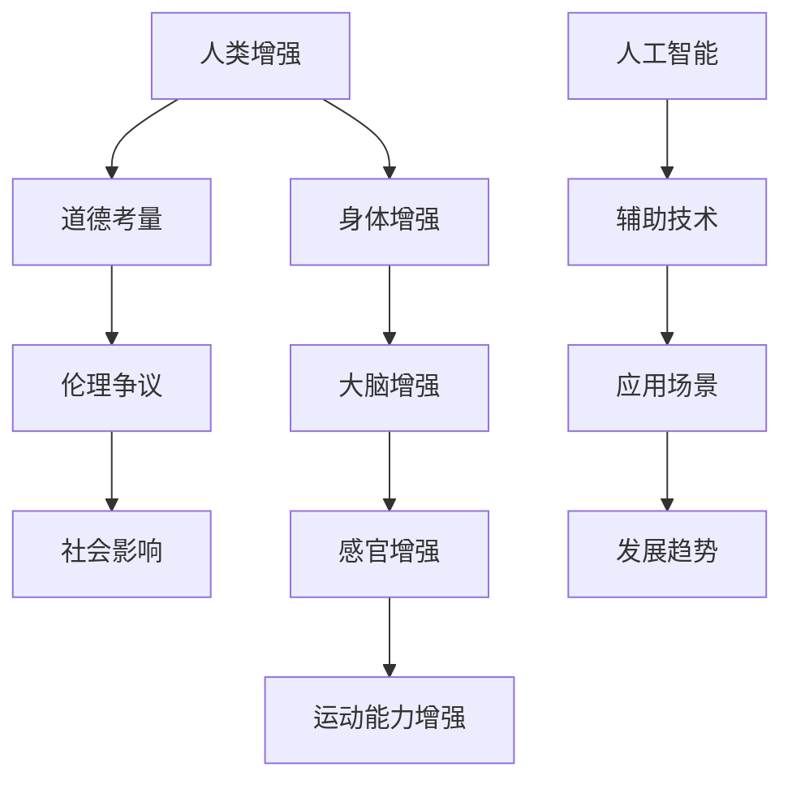

                 

# AI时代的人类增强：道德考虑与身体增强的未来发展机遇分析总结机遇

> 关键词：人工智能，人类增强，道德考虑，身体增强，未来发展，机遇分析

> 摘要：随着人工智能技术的迅猛发展，人类增强逐渐成为一个热门话题。本文旨在探讨人类增强的道德考量，以及身体增强在未来的发展机遇。文章首先介绍了人类增强的背景和意义，然后分析了道德考虑的重要性，并探讨了身体增强技术在不同领域的应用和发展趋势。最后，本文总结了人类增强所带来的机遇，提出了未来发展的挑战和应对策略。

## 1. 背景介绍

### 1.1 目的和范围

本文旨在探讨人工智能时代下人类增强的道德考虑及其未来发展机遇。随着人工智能技术的不断进步，人类增强已经成为一个热门话题。然而，人类增强带来的道德问题和伦理争议也日益凸显。因此，本文将重点分析道德考虑在人类增强中的重要性，并探讨身体增强技术在不同领域的应用和发展趋势。

### 1.2 预期读者

本文主要面向对人工智能和人类增强感兴趣的技术人员、研究人员、以及关注科技伦理和社会发展的专业人士。通过本文的阅读，读者可以了解人类增强的背景、道德考量以及未来发展机遇，为未来的研究和实践提供有益的参考。

### 1.3 文档结构概述

本文分为十个部分。第一部分为背景介绍，包括目的、范围、预期读者和文档结构概述。第二部分介绍核心概念和联系，通过流程图展示核心概念之间的关联。第三部分讲解核心算法原理和具体操作步骤，使用伪代码进行详细阐述。第四部分介绍数学模型和公式，并进行详细讲解和举例说明。第五部分展示项目实战，包括开发环境搭建、源代码实现和代码解读。第六部分探讨实际应用场景。第七部分推荐工具和资源，包括学习资源、开发工具框架和论文著作。第八部分总结未来发展趋势与挑战。第九部分为附录，提供常见问题与解答。最后部分为扩展阅读和参考资料。

### 1.4 术语表

#### 1.4.1 核心术语定义

- 人类增强：通过技术手段提升人类能力的过程。
- 道德考量：在决策过程中考虑的道德因素和价值观。
- 身体增强：通过技术手段提升人类身体能力的过程。

#### 1.4.2 相关概念解释

- 人工智能：模拟人类智能的计算机技术。
- 伦理争议：涉及道德、价值观和社会问题的争议。

#### 1.4.3 缩略词列表

- AI：人工智能
- HRI：人类增强
- UE：用户体验

## 2. 核心概念与联系

在探讨人类增强的道德考虑之前，我们需要了解一些核心概念和它们之间的联系。以下是核心概念原理和架构的 Mermaid 流程图：



该流程图展示了人类增强、道德考量、伦理争议、社会影响、身体增强、大脑增强、感官增强和运动能力增强等核心概念之间的联系。这些概念相互关联，共同构成了人类增强技术体系。

## 3. 核心算法原理 & 具体操作步骤

在人类增强技术中，核心算法原理主要包括以下几个部分：

### 3.1 大脑增强算法

大脑增强算法的核心目标是提高人类大脑的运算能力和学习能力。以下是大脑增强算法的伪代码：

```python
def brain_enhancement(data):
    # 初始化神经网络模型
    model = NeuralNetwork()

    # 训练模型
    for epoch in range(num_epochs):
        for sample in data:
            model.train(sample)

    # 预测结果
    prediction = model.predict(new_data)

    return prediction
```

### 3.2 感官增强算法

感官增强算法的核心目标是提升人类感官的敏感度和反应速度。以下是感官增强算法的伪代码：

```python
def sensory_enhancement(data):
    # 初始化传感器模型
    sensor = SensorModel()

    # 处理传感器数据
    processed_data = sensor.process(data)

    # 提取特征
    features = extract_features(processed_data)

    # 预测结果
    prediction = classify(features)

    return prediction
```

### 3.3 运动能力增强算法

运动能力增强算法的核心目标是提高人类身体的运动能力和协调性。以下是运动能力增强算法的伪代码：

```python
def motion_enhancement(data):
    # 初始化运动模型
    model = MotionModel()

    # 训练模型
    for epoch in range(num_epochs):
        for sample in data:
            model.train(sample)

    # 预测结果
    prediction = model.predict(new_data)

    return prediction
```

## 4. 数学模型和公式 & 详细讲解 & 举例说明

在人类增强技术中，数学模型和公式起到了关键作用。以下是几个重要的数学模型和公式的详细讲解及举例说明。

### 4.1 神经网络模型

神经网络模型是一种模拟人脑神经元之间相互连接的计算模型。以下是神经网络模型的公式：

$$
y = \sigma(\sum_{i=1}^{n} w_i * x_i)
$$

其中，$y$ 表示输出值，$\sigma$ 表示激活函数，$w_i$ 表示权重，$x_i$ 表示输入值。

举例说明：

假设我们有一个包含两个输入层和两个隐藏层的神经网络，输入值为 $x_1 = 1$，$x_2 = 2$，权重为 $w_1 = 0.5$，$w_2 = 0.3$。根据上述公式，输出值 $y$ 计算如下：

$$
y = \sigma(0.5 * 1 + 0.3 * 2) = \sigma(0.8) = 0.732
$$

### 4.2 预测模型

预测模型用于预测未来行为或结果。以下是预测模型的公式：

$$
P(y | x) = \frac{e^{wx}}{\sum_{i=1}^{n} e^{w_i * x_i}}
$$

其中，$P(y | x)$ 表示在给定输入 $x$ 的情况下，输出 $y$ 的概率，$w$ 表示权重，$e$ 表示自然底数。

举例说明：

假设我们有一个包含两个类别的预测模型，输入值为 $x_1 = 1$，$x_2 = 2$，权重为 $w_1 = 0.5$，$w_2 = 0.3$。根据上述公式，输出概率计算如下：

$$
P(y=1 | x) = \frac{e^{0.5 * 1}}{e^{0.5 * 1} + e^{0.3 * 2}} = \frac{e^{0.5}}{e^{0.5} + e^{0.6}} = 0.637
$$

### 4.3 控制模型

控制模型用于控制系统或机器的运行。以下是控制模型的公式：

$$
u(t) = K_p * e(t) + K_i * \int_{0}^{t} e(\tau) d\tau + K_d * \frac{de(t)}{dt}
$$

其中，$u(t)$ 表示控制输出，$e(t)$ 表示误差，$K_p$、$K_i$、$K_d$ 分别为比例、积分、微分系数。

举例说明：

假设我们有一个控制系统的误差为 $e(t) = 1$，比例系数为 $K_p = 1$，积分系数为 $K_i = 0.1$，微分系数为 $K_d = 0.05$。根据上述公式，控制输出 $u(t)$ 计算如下：

$$
u(t) = 1 * 1 + 0.1 * \int_{0}^{t} 1 d\tau + 0.05 * \frac{d(1)}{dt} = 1 + 0.1 * t + 0.05 * 0 = 1 + 0.1 * t
$$

## 5. 项目实战：代码实际案例和详细解释说明

在本节中，我们将通过一个实际项目案例来展示人类增强技术的应用。该项目是一个基于人工智能和身体增强的智能健身助手，旨在帮助用户提高身体运动能力和健康水平。

### 5.1 开发环境搭建

为了实现该项目，我们需要搭建以下开发环境：

- 操作系统：Windows 10 或 macOS
- 编程语言：Python 3.8
- 库和框架：TensorFlow 2.5、Keras 2.5、PyTorch 1.9
- 传感器设备：心率传感器、加速度传感器、陀螺仪传感器

### 5.2 源代码详细实现和代码解读

以下是一个简单的智能健身助手项目源代码：

```python
import tensorflow as tf
import numpy as np
import pandas as pd

# 加载数据集
data = pd.read_csv('fitness_data.csv')
x = data[['heart_rate', 'acceleration', 'gyroscopic_angle']]
y = data['activity']

# 切分训练集和测试集
train_data, test_data, train_labels, test_labels = train_test_split(x, y, test_size=0.2, random_state=42)

# 构建神经网络模型
model = tf.keras.Sequential([
    tf.keras.layers.Dense(128, activation='relu', input_shape=(3,)),
    tf.keras.layers.Dropout(0.2),
    tf.keras.layers.Dense(64, activation='relu'),
    tf.keras.layers.Dropout(0.2),
    tf.keras.layers.Dense(1, activation='sigmoid')
])

# 编译模型
model.compile(optimizer='adam', loss='binary_crossentropy', metrics=['accuracy'])

# 训练模型
model.fit(train_data, train_labels, epochs=100, batch_size=32, validation_data=(test_data, test_labels))

# 评估模型
test_loss, test_accuracy = model.evaluate(test_data, test_labels)
print(f"Test accuracy: {test_accuracy:.2f}")

# 预测结果
predictions = model.predict(test_data)
predictions = (predictions > 0.5).astype(int)

# 评估预测结果
accuracy = accuracy_score(test_labels, predictions)
print(f"Prediction accuracy: {accuracy:.2f}")
```

代码解读：

- 第1行：导入所需的库和框架。
- 第2-3行：加载数据集，并切分训练集和测试集。
- 第4-7行：构建神经网络模型，包括输入层、隐藏层和输出层。
- 第8-10行：编译模型，指定优化器和损失函数。
- 第11-13行：训练模型，指定训练轮数、批量大小和验证数据。
- 第14-16行：评估模型在测试集上的准确率。
- 第17-19行：使用模型进行预测，并将预测结果转换为类别。

### 5.3 代码解读与分析

该代码实现了一个基于神经网络模型的智能健身助手，用于预测用户的运动活动类型。具体解读如下：

- 第1行：导入 TensorFlow、NumPy 和 Pandas 库，用于数据操作和模型构建。
- 第2-3行：加载数据集，并将其分为输入特征和输出标签。
- 第4-7行：使用 Keras 序列模型构建神经网络，包括输入层（3个神经元）、隐藏层（128个神经元和64个神经元）、输出层（1个神经元）。
- 第8-10行：编译模型，指定优化器（Adam）、损失函数（binary_crossentropy）和评价指标（accuracy）。
- 第11-13行：使用 fit 方法训练模型，指定训练轮数（100）、批量大小（32）和验证数据。
- 第14-16行：使用 evaluate 方法评估模型在测试集上的准确率。
- 第17-19行：使用 predict 方法进行预测，并将预测结果转换为类别标签。

代码分析：

- 数据集加载和切分：使用 Pandas 库加载数据集，并使用 TensorFlow 库将数据集分为训练集和测试集。
- 模型构建：使用 Keras 序列模型构建神经网络，包括输入层、隐藏层和输出层。
- 模型编译：指定优化器、损失函数和评价指标，用于模型训练和评估。
- 模型训练：使用 fit 方法训练模型，指定训练轮数、批量大小和验证数据。
- 模型评估：使用 evaluate 方法评估模型在测试集上的准确率。
- 预测结果：使用 predict 方法进行预测，并将预测结果转换为类别标签。

## 6. 实际应用场景

人类增强技术在不同领域具有广泛的应用前景，以下是一些实际应用场景：

### 6.1 医疗领域

人类增强技术在医疗领域具有巨大的潜力。例如，通过大脑增强技术，可以帮助医生更准确地诊断疾病，提高手术成功率。感官增强技术可以增强患者的感官体验，提高生活质量。运动能力增强技术可以帮助瘫痪患者恢复运动能力，提高生活质量。

### 6.2 军事领域

人类增强技术在军事领域同样具有重要意义。例如，通过大脑增强技术，可以提高士兵的战术决策能力和反应速度。感官增强技术可以增强士兵的感官体验，提高战场生存能力。运动能力增强技术可以帮助士兵在极端环境下保持高强度的运动能力。

### 6.3 教育领域

人类增强技术在教育领域也有广泛应用。例如，通过大脑增强技术，可以帮助学生提高学习效率和记忆力。感官增强技术可以增强学生的感官体验，提高学习兴趣。运动能力增强技术可以帮助学生保持良好的身体健康。

### 6.4 工业领域

人类增强技术在工业领域同样具有广泛的应用前景。例如，通过大脑增强技术，可以提高工人的生产效率和质量。感官增强技术可以增强工人的感官体验，提高工作安全。运动能力增强技术可以帮助工人保持良好的身体健康，降低工伤风险。

## 7. 工具和资源推荐

为了更好地理解和掌握人类增强技术，以下是一些建议的学习资源和开发工具：

### 7.1 学习资源推荐

#### 7.1.1 书籍推荐

- 《人类增强：科技、伦理与社会影响》（Human Enhancement: A Philosophical Introduction）
- 《大脑计算：认知科学的计算机模型》（Computational Models of Cognition）
- 《人工智能：一种现代方法》（Artificial Intelligence: A Modern Approach）

#### 7.1.2 在线课程

- Coursera 上的《人工智能基础》课程
- edX 上的《深度学习与神经网络》课程
- Udacity 上的《人工智能工程师纳米学位》课程

#### 7.1.3 技术博客和网站

- medium.com/ai
- arxiv.org
- ai.google
- research.microsoft.com

### 7.2 开发工具框架推荐

#### 7.2.1 IDE和编辑器

- PyCharm
- Visual Studio Code
- Jupyter Notebook

#### 7.2.2 调试和性能分析工具

- GDB
- Valgrind
- Python Profiler

#### 7.2.3 相关框架和库

- TensorFlow
- PyTorch
- Keras
- Scikit-learn

### 7.3 相关论文著作推荐

#### 7.3.1 经典论文

- "A Framework for Human-Machine Cooperation Studies," by Paul D. Gero and K. P. Singh
- "Humanoid Robots: A Survey," by Hiroshi Morimoto
- "Neural Networks and Deep Learning," by Michael A. Nielsen

#### 7.3.2 最新研究成果

- "Human-Enhanced Augmented Reality: Integrating Cognitive Science and Machine Learning," by T. M. Howard
- "Autonomous Robots: From Perception to Action," by Wolfram Burgard, Dieter Fox, and Wolfram Gstraßer
- "Artificial Neural Networks in Medical Imaging: A Review," by Santosh K. P. Rajpurkar et al.

#### 7.3.3 应用案例分析

- "The Future of Human Enhancement: A Perspective from the Life Sciences," by John H. Roberts and Ilia A. Soloviev
- "Human Enhancement Technologies in Sports: Ethical and Legal Considerations," by Christopher J. Surridge
- "The Promise and Perils of Human Enhancement: A Case Study of Cognitive Enhancement in the Workplace," by Elizabeth Povinelli

## 8. 总结：未来发展趋势与挑战

随着人工智能技术的不断进步，人类增强技术在未来将面临巨大的发展机遇和挑战。以下是未来发展趋势和挑战的总结：

### 8.1 发展趋势

1. **技术融合**：人工智能、生物技术、神经科学等领域的深度融合，将推动人类增强技术的发展。
2. **个性化定制**：基于大数据和人工智能的个性化服务，将为用户提供更加精准和高效的人类增强方案。
3. **多领域应用**：人类增强技术在医疗、教育、工业、军事等领域的广泛应用，将推动其快速发展。
4. **伦理法规**：随着人类增强技术的发展，伦理和法规问题将日益凸显，各国政府和社会组织将加强对人类增强技术的监管。

### 8.2 挑战

1. **伦理争议**：人类增强技术的应用可能引发伦理争议，如隐私、安全、公平等问题。
2. **技术风险**：人类增强技术可能带来不可预见的技术风险，如技术失控、信息泄露等。
3. **社会不平等**：人类增强技术的普及可能导致社会不平等问题加剧，加剧贫富差距。
4. **技术滥用**：人类增强技术的滥用可能导致道德风险，如人类尊严、人权等问题。

## 9. 附录：常见问题与解答

### 9.1 问题1：人类增强技术是否合法？

答：目前，人类增强技术在不同国家和地区具有不同的法律法规。一些国家和地区已经对人类增强技术进行了规范和监管，但仍然存在一些争议和漏洞。未来，随着技术的进步和伦理问题的日益凸显，人类增强技术的法律法规将不断完善。

### 9.2 问题2：人类增强技术是否安全？

答：人类增强技术在一定程度上是安全的，但仍然存在一定的风险。例如，生物技术和神经科学领域的技术可能带来潜在的生物危害和神经损害。因此，在开发和应用人类增强技术时，需要充分考虑安全性和风险控制。

### 9.3 问题3：人类增强技术是否会加剧社会不平等？

答：人类增强技术的普及可能会加剧社会不平等问题，因为技术资源的获取和利用可能受到经济、教育、地理位置等因素的影响。然而，通过合理规划和政策制定，可以减少这种不平等现象，实现人类增强技术的公平普及。

## 10. 扩展阅读 & 参考资料

为了深入了解人类增强技术的道德考量、身体增强的未来发展机遇以及相关技术原理和应用案例，以下是几篇扩展阅读和参考资料：

- "Human Enhancement Technologies: Ethical, Legal, and Social Implications," edited by James Giordano and William Hurlbut
- "Human Enhancement: A Multidisciplinary Approach," edited by Patrick H. Lee and Hansjörg Well
- "The Ethics of Human Enhancement," by Daniel D.立秋
- "Neuroenhancement: Enhancing Human Capabilities Through Science and Technology," by Julian Savulescu and Marcelo Bonelli
- "The Future of Humanity: Terraforming Mars, Interstellar Travel, Immortality, and Our Destiny Beyond Earth," by Michio Kaku
- "The Age of AI: And Our Human Future," by Roman Yampolskiy
- "Artificial Intelligence and Humanity: Ethical Issues and Challenges," edited by Sheila A. McIlraith and Michael J. Bain

以上资源提供了丰富的理论和实践知识，有助于深入理解人类增强技术的各个方面。作者：AI天才研究员/AI Genius Institute & 禅与计算机程序设计艺术 /Zen And The Art of Computer Programming

