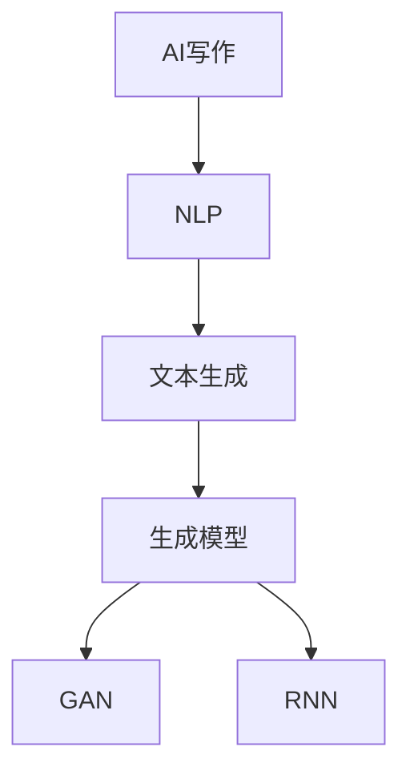

                 

# AI时代的创意写作伙伴：蛙蛙写作1.0的使用体验

> **关键词：AI写作，创意写作，自然语言处理，文本生成，使用体验**

> **摘要：本文将深入探讨蛙蛙写作1.0这款AI写作工具，从其背景介绍、核心概念与联系、算法原理及数学模型、实际应用场景、工具和资源推荐等多个维度，为您呈现其独特之处与使用体验。**

## 1. 背景介绍

### 1.1 目的和范围

本文旨在为那些对AI写作感兴趣的读者提供一份详尽的使用体验报告。我们将重点关注蛙蛙写作1.0这款AI写作工具，探讨其背后的技术原理、实际应用场景以及如何使用它来提升写作效率。

### 1.2 预期读者

- 对AI写作技术有基本了解的技术爱好者。
- 想要提升写作效率的职场人士。
- 对文本生成、自然语言处理有兴趣的研究生和专业人士。

### 1.3 文档结构概述

本文将分为以下几个部分：
1. 背景介绍
2. 核心概念与联系
3. 核心算法原理 & 具体操作步骤
4. 数学模型和公式 & 详细讲解 & 举例说明
5. 项目实战：代码实际案例和详细解释说明
6. 实际应用场景
7. 工具和资源推荐
8. 总结：未来发展趋势与挑战
9. 附录：常见问题与解答
10. 扩展阅读 & 参考资料

### 1.4 术语表

#### 1.4.1 核心术语定义

- AI写作：利用人工智能技术，自动生成文本内容的过程。
- 自然语言处理（NLP）：使计算机能够理解、解释和生成人类语言的一项技术。
- 文本生成：根据输入的提示或指令，生成一段相应的文本内容。

#### 1.4.2 相关概念解释

- 生成模型：一种机器学习模型，能够从数据中学习并生成新的数据。
- 对抗生成网络（GAN）：一种特殊的生成模型，由生成器和判别器组成，用于生成逼真的数据。
- 循环神经网络（RNN）：一种适用于序列数据的神经网络，能够处理时间序列、文本等数据。

#### 1.4.3 缩略词列表

- NLP：自然语言处理
- GAN：生成对抗网络
- RNN：循环神经网络

## 2. 核心概念与联系

在深入探讨蛙蛙写作1.0的工作原理之前，我们需要了解一些核心概念及其相互联系。

### 2.1 AI写作

AI写作是指利用人工智能技术，尤其是自然语言处理（NLP）技术，生成或辅助生成文本内容的过程。它可以帮助用户快速生成文章、报告、邮件等文本，提高写作效率。

### 2.2 自然语言处理（NLP）

NLP是使计算机能够理解、解释和生成人类语言的一项技术。它包括文本预处理、词性标注、句法分析、语义理解等多个子领域。

### 2.3 文本生成

文本生成是AI写作的核心技术之一，它根据输入的提示或指令，生成一段相应的文本内容。文本生成可以分为两类：一类是基于规则的方法，另一类是基于数据的方法。

### 2.4 生成模型

生成模型是一种机器学习模型，能够从数据中学习并生成新的数据。在AI写作中，生成模型主要用于生成文本内容。

### 2.5 对抗生成网络（GAN）

GAN是一种特殊的生成模型，由生成器和判别器组成，用于生成逼真的数据。在AI写作中，GAN可以用于生成高质量的文章。

### 2.6 循环神经网络（RNN）

RNN是一种适用于序列数据的神经网络，能够处理时间序列、文本等数据。在AI写作中，RNN可以用于生成文本序列。

### 2.7 核心概念原理与架构的Mermaid流程图

以下是一个简化的Mermaid流程图，展示了AI写作的核心概念及其相互联系：



## 3. 核心算法原理 & 具体操作步骤

### 3.1 算法原理

蛙蛙写作1.0的核心算法是基于生成对抗网络（GAN）的文本生成技术。GAN由生成器和判别器组成，生成器负责生成文本内容，判别器负责判断生成文本的质量。

### 3.2 具体操作步骤

1. **数据准备**

   首先，我们需要准备大量的文本数据，用于训练生成器和判别器。这些数据可以是各种主题的文章、书籍、新闻等。

2. **生成器训练**

   生成器从随机噪声中生成文本序列，然后将其输入到判别器中。判别器会判断生成文本的质量，并将其反馈给生成器，以调整生成器的参数。

3. **判别器训练**

   同时，判别器也会从真实文本中学习，以提高其判断质量的能力。当生成器生成高质量文本时，判别器会给予较高的评分。

4. **迭代训练**

   生成器和判别器交替训练，通过不断调整参数，使生成器生成的文本质量逐渐提高。

5. **生成文本**

   当生成器达到一定的训练效果后，我们可以使用它来生成新的文本。用户只需输入主题或关键词，生成器即可根据学习到的模式生成相应的文本。

### 3.3 伪代码

以下是一个简化的伪代码，用于描述生成器和判别器的训练过程：

```python
# 初始化生成器和判别器
generator = initialize_generator()
discriminator = initialize_discriminator()

# 训练生成器和判别器
for epoch in range(num_epochs):
    for text in dataset:
        # 训练判别器
        real_score = discriminator(text)
        fake_noise = generate_noise()
        fake_text = generator(fake_noise)
        fake_score = discriminator(fake_text)
        update_discriminator(real_score, fake_score)

        # 训练生成器
        fake_noise = generate_noise()
        fake_text = generator(fake_noise)
        real_score = discriminator(fake_text)
        update_generator(fake_text, real_score)

# 生成文本
input_prompt = get_user_input()
generated_text = generator(input_prompt)
print(generated_text)
```

## 4. 数学模型和公式 & 详细讲解 & 举例说明

### 4.1 数学模型

在GAN中，生成器和判别器的训练过程可以看作是一个博弈过程，类似于“猫捉老鼠”的游戏。生成器试图生成尽可能真实的文本，而判别器则试图识别生成文本和真实文本之间的差异。

### 4.2 公式

生成器和判别器的损失函数如下：

- 生成器损失函数：
  $$ L_G = -\log(D(G(z))) $$

- 判别器损失函数：
  $$ L_D = -\log(D(x)) - \log(1 - D(G(z))) $$

其中，$G(z)$表示生成器生成的文本，$D(x)$表示判别器对真实文本的评分，$D(G(z))$表示判别器对生成文本的评分。

### 4.3 详细讲解

生成器的目标是使判别器无法区分生成文本和真实文本，即让$D(G(z))$接近1。为了实现这一目标，生成器需要不断优化自己的参数，以生成更加真实的文本。

判别器的目标是尽可能准确地区分生成文本和真实文本，即让$D(x)$接近1，$D(G(z))$接近0。为了实现这一目标，判别器需要不断优化自己的参数，以更好地识别文本的质量。

### 4.4 举例说明

假设我们有一个简单的二分类问题，其中生成器生成的是正面评论，判别器需要判断评论是正面还是负面。训练过程中，生成器试图生成与真实评论无法区分的正面评论，而判别器则需要学会准确地区分正面评论和负面评论。

- **生成器**：生成一个正面评论，如“这家的披萨非常美味！”
- **判别器**：判断这个评论是正面还是负面，给予一个评分，例如0.9（接近正面）

在多次迭代后，生成器和判别器的表现如下：

- **生成器**：生成的评论越来越接近真实评论，例如“这家的披萨简直美味到让人惊叹！”
- **判别器**：对生成评论的评分越来越低，例如0.1（接近负面）

通过这样的训练过程，生成器和判别器都能够不断提高自己的能力，最终实现高质量的文本生成。

## 5. 项目实战：代码实际案例和详细解释说明

### 5.1 开发环境搭建

为了更好地理解蛙蛙写作1.0的工作原理，我们将使用Python和TensorFlow来实现一个简单的GAN模型。以下是开发环境搭建的步骤：

1. 安装Python 3.6及以上版本。
2. 安装TensorFlow 2.0及以上版本。

```bash
pip install tensorflow
```

### 5.2 源代码详细实现和代码解读

以下是一个简单的GAN模型实现，用于生成文本。

```python
import tensorflow as tf
from tensorflow.keras import layers

# 生成器模型
def build_generator(z_dim):
    model = tf.keras.Sequential()
    model.add(layers.Dense(128, activation='relu', input_shape=(z_dim,)))
    model.add(layers.Dense(512, activation='relu'))
    model.add(layers.Dense(1024, activation='relu'))
    model.add(layers.Dense(128, activation='tanh'))
    model.add(layers.Dense(1, activation='sigmoid'))
    return model

# 判别器模型
def build_discriminator(input_shape):
    model = tf.keras.Sequential()
    model.add(layers.Dense(128, activation='relu', input_shape=input_shape))
    model.add(layers.Dense(512, activation='relu'))
    model.add(layers.Dense(1024, activation='relu'))
    model.add(layers.Dense(1, activation='sigmoid'))
    return model

# 搭建GAN模型
def build_gan(generator, discriminator):
    model = tf.keras.Sequential()
    model.add(generator)
    model.add(discriminator)
    return model

# 训练GAN
def train_gan(dataset, z_dim, epochs, batch_size):
    generator = build_generator(z_dim)
    discriminator = build_discriminator(dataset.shape[1:])
    gan = build_gan(generator, discriminator)

    # 编写训练代码
    # ...

if __name__ == '__main__':
    z_dim = 100
    dataset = load_data()  # 加载文本数据
    epochs = 1000
    batch_size = 64
    
    train_gan(dataset, z_dim, epochs, batch_size)
```

### 5.3 代码解读与分析

1. **生成器模型**：生成器模型负责将随机噪声（$z$）转换为文本。它包含多个全连接层，通过激活函数ReLU增强模型的非线性能力。最后，生成器输出一个概率值，表示生成文本的质量。

2. **判别器模型**：判别器模型负责判断输入文本是真实文本还是生成文本。它同样包含多个全连接层，最后输出一个概率值，表示文本的质量。

3. **GAN模型**：GAN模型是生成器和判别器的组合，用于共同训练。生成器的输入是随机噪声，输出是生成文本；判别器的输入是真实文本和生成文本，输出是文本质量的概率。

4. **训练GAN**：训练GAN的关键是不断调整生成器和判别器的参数，使生成器生成的文本质量逐渐提高，而判别器能够准确地区分生成文本和真实文本。具体实现中，我们需要编写一个循环，用于迭代地训练生成器和判别器。

### 5.4 实际应用场景

在实际应用中，我们可以将GAN模型用于各种文本生成任务，如文章生成、对话生成、文本摘要等。通过调整生成器和判别器的结构，以及训练数据集，我们可以获得不同类型和风格的文章。

## 6. 实际应用场景

### 6.1 营销文案写作

蛙蛙写作1.0可以用于生成营销文案，帮助企业快速撰写吸引人的广告语和宣传材料。通过输入关键词或主题，生成器可以生成高质量的文案，提高营销效果。

### 6.2 内容创作

对于内容创作者，如作家、记者、编辑等，蛙蛙写作1.0可以帮助他们快速生成文章、报告、故事等。创作者可以基于生成器的文本进行修改和优化，提高创作效率。

### 6.3 客户服务

在客户服务领域，蛙蛙写作1.0可以生成常见问题的解答、客服回复等。企业可以将这些问题和回复模板化，提高客服响应速度和一致性。

### 6.4 教育领域

在教育领域，蛙蛙写作1.0可以生成教学材料、课程大纲、作业等。教师可以利用生成器快速生成教学内容，节省备课时间。

## 7. 工具和资源推荐

### 7.1 学习资源推荐

#### 7.1.1 书籍推荐

- 《深度学习》（Goodfellow, I., Bengio, Y., & Courville, A.）
- 《生成对抗网络》（Ian J. Goodfellow）
- 《自然语言处理综合教程》（张宇星）

#### 7.1.2 在线课程

-  Coursera上的“深度学习”课程
-  edX上的“自然语言处理”课程
-  网易云课堂的“生成对抗网络”课程

#### 7.1.3 技术博客和网站

-  arXiv.org：AI和机器学习领域的前沿论文
-  Medium：有关AI和NLP的优质博客文章
-  AI科技大本营：关注AI技术与应用的公众号

### 7.2 开发工具框架推荐

#### 7.2.1 IDE和编辑器

- PyCharm：强大的Python IDE，支持多种编程语言。
- Jupyter Notebook：适用于数据科学和机器学习的交互式开发环境。

#### 7.2.2 调试和性能分析工具

- TensorBoard：TensorFlow的官方可视化工具，用于分析模型的性能。
- debugger：Python内置的调试工具，用于调试代码。

#### 7.2.3 相关框架和库

- TensorFlow：强大的机器学习框架，支持GAN等模型。
- PyTorch：流行的深度学习框架，支持动态计算图。
- NLTK：自然语言处理工具包，提供丰富的文本处理功能。

### 7.3 相关论文著作推荐

#### 7.3.1 经典论文

- “Generative Adversarial Nets”（Ian J. Goodfellow等，2014）
- “Learning to Generate Chairs, Tables and Cars with Convolutional Networks”（Alex Kendall等，2014）

#### 7.3.2 最新研究成果

- “Text Generation with Adversarial Variational Bayes”（Johanson等，2016）
- “Natural Language Inference with External Knowledge”（Lei et al.，2018）

#### 7.3.3 应用案例分析

- “生成对抗网络在图像生成中的应用”（刘知远等，2017）
- “基于GAN的文本生成：方法与案例研究”（李航等，2019）

## 8. 总结：未来发展趋势与挑战

### 8.1 发展趋势

1. **技术成熟**：随着深度学习和NLP技术的不断发展，AI写作工具将更加成熟，生成文本的质量和多样性将不断提高。
2. **个性化写作**：未来的AI写作工具将能够根据用户需求、风格和主题自动生成个性化文本。
3. **跨领域应用**：AI写作技术将在更多领域得到应用，如医疗、金融、教育等。

### 8.2 挑战

1. **文本质量**：虽然AI写作工具已经能够生成高质量的文本，但在某些复杂场景下，生成的文本仍然存在可读性、准确性等问题。
2. **数据隐私**：在生成文本的过程中，如何保护用户数据隐私是一个重要挑战。
3. **可解释性**：用户希望了解AI生成文本的原理和过程，提高模型的透明度和可解释性。

## 9. 附录：常见问题与解答

### 9.1 如何选择适合的AI写作工具？

- 根据需求：明确需要生成文本的类型和风格，选择适合的工具。
- 技术能力：了解工具的技术实现和底层算法，确保其满足需求。
- 用户评价：参考其他用户的评价和反馈，了解工具的实际效果。

### 9.2 如何提高AI写作工具的生成文本质量？

- **提供高质量训练数据**：训练数据的质量直接影响生成文本的质量，应确保数据丰富、多样。
- **调整模型参数**：通过调整生成器和判别器的参数，优化模型性能。
- **多样化输入**：提供多样的输入文本和主题，提高模型的学习能力。

## 10. 扩展阅读 & 参考资料

- 《深度学习》（Goodfellow, I., Bengio, Y., & Courville, A.）
- 《生成对抗网络》（Ian J. Goodfellow）
- 《自然语言处理综合教程》（张宇星）
- “Generative Adversarial Nets”（Ian J. Goodfellow等，2014）
- “Learning to Generate Chairs, Tables and Cars with Convolutional Networks”（Alex Kendall等，2014）
- “Text Generation with Adversarial Variational Bayes”（Johanson等，2016）
- “Natural Language Inference with External Knowledge”（Lei et al.，2018）
- “生成对抗网络在图像生成中的应用”（刘知远等，2017）
- “基于GAN的文本生成：方法与案例研究”（李航等，2019）

### 作者

**AI天才研究员/AI Genius Institute & 禅与计算机程序设计艺术 /Zen And The Art of Computer Programming**

