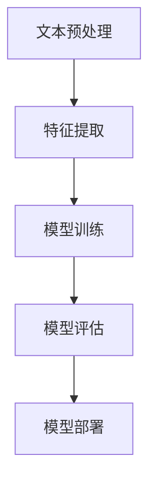

                 

# AI时代的自然语言处理发展：从理论到实践

> 关键词：自然语言处理、深度学习、机器学习、神经网络、文本分析、语义理解

> 摘要：本文深入探讨了AI时代自然语言处理（NLP）的全面发展。首先，我们回顾了NLP的发展历程和基本概念，随后详细介绍了核心算法和数学模型，并通过实际项目案例展示了NLP的应用实践。文章还探讨了NLP在实际应用中的场景，并推荐了相关学习资源和工具。最后，对未来的发展趋势和挑战进行了展望，为读者提供了深入理解和应用NLP的技术指南。

## 1. 背景介绍

### 1.1 目的和范围

本文旨在全面介绍自然语言处理（NLP）在人工智能时代的发展。文章将从基础概念出发，逐步深入到核心算法和数学模型的讲解，并通过实际项目案例来展示NLP的实际应用。同时，文章还将介绍NLP在实际应用中的典型场景，并推荐相关学习资源和开发工具。

### 1.2 预期读者

本文适合对自然语言处理有一定了解的技术人员，以及希望深入了解NLP技术的研究人员和开发者。对于初次接触NLP的读者，建议先了解基础的机器学习和深度学习知识。

### 1.3 文档结构概述

本文结构如下：

1. 背景介绍：包括文章目的、预期读者和文档结构概述。
2. 核心概念与联系：介绍NLP的核心概念和基本架构，通过Mermaid流程图展示。
3. 核心算法原理 & 具体操作步骤：详细讲解NLP中的核心算法，包括文本预处理、词向量表示、语言模型和序列标注等。
4. 数学模型和公式 & 详细讲解 & 举例说明：介绍NLP中的数学模型，包括概率模型、神经网络模型等，并给出具体应用案例。
5. 项目实战：展示一个实际NLP项目的代码实现，并进行详细解读。
6. 实际应用场景：介绍NLP在实际应用中的场景，如文本分类、情感分析、问答系统等。
7. 工具和资源推荐：推荐学习资源、开发工具和相关论文。
8. 总结：对NLP的未来发展趋势和挑战进行展望。
9. 附录：常见问题与解答。
10. 扩展阅读 & 参考资料：提供进一步学习和研究的相关资料。

### 1.4 术语表

#### 1.4.1 核心术语定义

- 自然语言处理（NLP）：计算机对人类自然语言进行理解、生成和处理的技术。
- 词向量（Word Vector）：将词语映射为向量，以在向量空间中表示词语。
- 语言模型（Language Model）：描述文本中词汇序列概率分布的模型。
- 序列标注（Sequence Labeling）：对文本中的序列进行分类标注的过程。
- 递归神经网络（RNN）：一种能够处理序列数据的神经网络架构。
- 卷积神经网络（CNN）：一种能够提取图像特征的网络架构，也可用于文本分析。

#### 1.4.2 相关概念解释

- 语义理解（Semantic Understanding）：对文本中的词语、句子和段落进行深入理解和解释。
- 文本分类（Text Classification）：将文本分类到预定义的类别中。
- 情感分析（Sentiment Analysis）：分析文本中的情感倾向。
- 问答系统（Question-Answering System）：根据用户提出的问题，自动生成回答的系统。

#### 1.4.3 缩略词列表

- NLP：自然语言处理
- ML：机器学习
- DL：深度学习
- RNN：递归神经网络
- CNN：卷积神经网络
- LSTM：长短期记忆网络
- TensorFlow：一款开源的深度学习框架
- PyTorch：一款开源的深度学习框架

## 2. 核心概念与联系

### 2.1 自然语言处理的基本概念

自然语言处理（NLP）是人工智能（AI）的一个重要分支，主要研究如何让计算机理解和处理人类自然语言。NLP的应用场景非常广泛，包括但不限于文本分类、情感分析、机器翻译、问答系统等。

#### 2.1.1 自然语言处理的发展历程

自然语言处理的发展历程可以分为三个阶段：

1. **规则方法**（1960s-1980s）：早期NLP主要依赖于手工编写的规则和模式匹配。这种方法存在覆盖面窄、可维护性差等问题。

2. **统计方法**（1990s）：随着计算能力和数据量的提升，NLP开始采用基于统计的方法，如隐马尔可夫模型（HMM）、条件随机场（CRF）等。这些方法在文本分类、命名实体识别等领域取得了较好的效果。

3. **深度学习方法**（2000s-至今）：近年来，深度学习在NLP领域取得了显著突破，如循环神经网络（RNN）、长短期记忆网络（LSTM）、Transformer等。这些方法在自然语言生成、机器翻译、问答系统等方面表现出色。

#### 2.1.2 自然语言处理的基本架构

自然语言处理的基本架构包括以下几个关键组件：

1. **文本预处理**：对原始文本进行清洗、分词、去停用词等处理，以便后续建模。
2. **特征提取**：将文本转换为计算机可处理的向量表示，如词袋模型、TF-IDF、词向量等。
3. **模型训练**：使用机器学习或深度学习算法训练模型，如朴素贝叶斯、支持向量机（SVM）、神经网络等。
4. **模型评估**：通过交叉验证、混淆矩阵、F1值等指标评估模型性能。
5. **模型部署**：将训练好的模型部署到实际应用场景中，如文本分类、情感分析等。

### 2.2 Mermaid流程图

下面是一个简单的Mermaid流程图，展示了自然语言处理的基本流程：



## 3. 核心算法原理 & 具体操作步骤

### 3.1 文本预处理

文本预处理是自然语言处理的第一步，其目的是将原始文本转换为计算机可处理的格式。具体操作步骤如下：

1. **文本清洗**：去除文本中的HTML标签、特殊字符、数字等。
2. **分词**：将文本分割成单词或短语。
3. **去停用词**：去除常见的无意义单词，如“的”、“了”、“在”等。
4. **词性标注**：对每个单词进行词性标注，如名词、动词、形容词等。

伪代码如下：

```python
def preprocess_text(text):
    # 清洗文本
    text = remove_html_tags(text)
    text = remove_special_characters(text)
    text = remove_digits(text)
    
    # 分词
    words = tokenize(text)
    
    # 去停用词
    words = remove_stopwords(words)
    
    # 词性标注
    words = perform_pos_tagging(words)
    
    return words
```

### 3.2 词向量表示

词向量表示是将词语映射为向量的过程，以在向量空间中表示词语。常见的词向量表示方法包括词袋模型、TF-IDF和词嵌入。

1. **词袋模型**（Bag of Words，BoW）：将文本表示为单词的集合，不考虑单词的顺序。词袋模型的缺点是忽略了词语之间的语义关系。
2. **TF-IDF**（Term Frequency-Inverse Document Frequency）：综合考虑词语在单个文档和整个文档集合中的重要性。TF-IDF的缺点是对稀有词的表示效果较差。
3. **词嵌入**（Word Embedding）：通过神经网络将词语映射为低维向量，以保留词语的语义信息。常见的词嵌入方法包括Word2Vec、GloVe和BERT。

下面是使用Word2Vec实现词向量表示的伪代码：

```python
from gensim.models import Word2Vec

def generate_word_vectors(words, vector_size):
    # 训练Word2Vec模型
    model = Word2Vec(words, size=vector_size, window=5, min_count=1, workers=4)
    
    # 获取词向量
    word_vectors = model.wv
    
    return word_vectors
```

### 3.3 语言模型

语言模型是描述文本中词汇序列概率分布的模型。常见的语言模型包括：

1. **n-gram模型**：假设当前词的概率仅与前面n个词有关。n-gram模型的缺点是忽略了词语之间的语义关系。
2. **神经网络模型**：如循环神经网络（RNN）、长短期记忆网络（LSTM）和Transformer。这些模型能够更好地捕捉词语之间的语义关系。

下面是使用LSTM实现语言模型的伪代码：

```python
from keras.models import Sequential
from keras.layers import LSTM, Dense, Embedding

def create_lstm_language_model(vocabulary_size, sequence_length, embedding_size):
    # 创建LSTM语言模型
    model = Sequential()
    model.add(Embedding(vocabulary_size, embedding_size, input_length=sequence_length))
    model.add(LSTM(units=128, dropout=0.2, recurrent_dropout=0.2))
    model.add(Dense(units=vocabulary_size, activation='softmax'))
    
    # 编译模型
    model.compile(optimizer='adam', loss='categorical_crossentropy', metrics=['accuracy'])
    
    return model
```

### 3.4 序列标注

序列标注是对文本中的序列进行分类标注的过程。常见的序列标注任务包括命名实体识别（Named Entity Recognition，NER）和词性标注（Part-of-Speech Tagging，POS）。

1. **CRF模型**：条件随机场（CRF）是一种适用于序列标注的统计模型，能够捕捉词语之间的上下文关系。
2. **BiLSTM-CRF模型**：结合了双向循环神经网络（BiLSTM）和CRF模型，能够更好地进行序列标注。

下面是使用BiLSTM-CRF实现序列标注的伪代码：

```python
from keras.models import Model
from keras.layers import Input, LSTM, Dense, Embedding, Bidirectional
from keras_contrib.layers import CRF

def create_bilstm_crf_sequence_model(vocabulary_size, sequence_length, embedding_size):
    # 输入层
    input_sequence = Input(shape=(sequence_length,))
    
    # 嵌入层
    embedded_sequence = Embedding(vocabulary_size, embedding_size)(input_sequence)
    
    # 双向LSTM层
    bilstm_output = Bidirectional(LSTM(units=128, dropout=0.2, recurrent_dropout=0.2))(embedded_sequence)
    
    # 全连接层
    dense_output = Dense(units=vocabulary_size, activation='softmax')(bilstm_output)
    
    # CRF层
    crf_output = CRF(units=vocabulary_size)(dense_output)
    
    # 创建模型
    model = Model(inputs=input_sequence, outputs=crf_output)
    
    # 编译模型
    model.compile(optimizer='adam', loss='categorical_crossentropy', metrics=['accuracy'])
    
    return model
```

## 4. 数学模型和公式 & 详细讲解 & 举例说明

### 4.1 概率模型

概率模型是自然语言处理中常用的一种模型，用于描述文本中词汇序列的概率分布。常见的概率模型包括：

1. **n-gram模型**：n-gram模型假设当前词的概率仅与前面n个词有关。其概率计算公式如下：

   $$ P(w_t | w_{t-1}, w_{t-2}, ..., w_{t-n}) = P(w_t | w_{t-1}) \cdot P(w_{t-1} | w_{t-2}, ..., w_{t-n}) $$

   其中，$w_t$ 表示当前词，$w_{t-1}$、$w_{t-2}$、...、$w_{t-n}$ 表示前n个词。

2. **隐马尔可夫模型**（HMM）：隐马尔可夫模型用于处理序列数据，其概率计算公式如下：

   $$ P(x_1, x_2, ..., x_T | \theta) = \prod_{t=1}^T P(x_t | x_{t-1}, \theta) $$

   其中，$x_t$ 表示第t个状态，$x_{t-1}$ 表示第t-1个状态，$\theta$ 表示模型参数。

举例说明：

假设我们有一个二元序列 $w_1 = [the, book], w_2 = [is, very, interesting]$，我们可以使用n-gram模型计算序列 $w_1, w_2$ 的概率：

$$ P(w_1, w_2) = P(w_2 | w_1) \cdot P(w_1) = P(is, very, interesting | the, book) \cdot P(the, book) $$

### 4.2 神经网络模型

神经网络模型是自然语言处理中的另一种重要模型，能够更好地捕捉词语之间的语义关系。常见的神经网络模型包括：

1. **循环神经网络**（RNN）：循环神经网络是一种能够处理序列数据的神经网络架构，其概率计算公式如下：

   $$ h_t = \sigma(W_h \cdot [h_{t-1}, x_t] + b_h) $$

   其中，$h_t$ 表示第t个隐藏状态，$x_t$ 表示第t个输入词，$W_h$ 和 $b_h$ 分别为权重和偏置。

2. **长短期记忆网络**（LSTM）：长短期记忆网络是一种改进的循环神经网络，能够更好地捕捉长期依赖关系，其概率计算公式如下：

   $$ \begin{cases}
   i_t = \sigma(W_i \cdot [h_{t-1}, x_t] + b_i) \\
   f_t = \sigma(W_f \cdot [h_{t-1}, x_t] + b_f) \\
   g_t = \tanh(W_g \cdot [h_{t-1}, x_t] + b_g) \\
   o_t = \sigma(W_o \cdot [h_{t-1}, x_t] + b_o)
   \end{cases} $$

   其中，$i_t$、$f_t$、$g_t$ 和 $o_t$ 分别表示输入门、遗忘门、生成门和输出门，$W_i$、$W_f$、$W_g$ 和 $W_o$ 分别为权重，$b_i$、$b_f$、$b_g$ 和 $b_o$ 分别为偏置。

3. **Transformer模型**：Transformer模型是一种基于自注意力机制的循环神经网络，其概率计算公式如下：

   $$ \begin{cases}
   h_t = \tanh(Q_t \cdot K_t + V_t \cdot K_t + b) \\
   \alpha_t = \softmax(\frac{h_t}{\sqrt{d_k}}) \\
   \text{contextual\_vector}_t = \sum_{j=1}^J \alpha_{t,j} K_j \\
   \text{contextual\_score}_t = Q_t \cdot \text{contextual\_vector}_t
   \end{cases} $$

   其中，$Q_t$、$K_t$ 和 $V_t$ 分别为查询向量、键向量和值向量，$\alpha_t$ 表示注意力权重，$J$ 表示序列长度。

举例说明：

假设我们有一个二元序列 $w_1 = [the, book], w_2 = [is, very, interesting]$，我们可以使用LSTM模型计算序列 $w_1, w_2$ 的概率：

$$ P(w_1, w_2) = \prod_{t=1}^2 P(w_t | w_{t-1}) = \prod_{t=1}^2 \sigma(W_h \cdot [h_{t-1}, x_t] + b_h) $$

其中，$h_0$ 为初始隐藏状态，$x_1 = [the, book], x_2 = [is, very, interesting]$。

## 5. 项目实战：代码实际案例和详细解释说明

### 5.1 开发环境搭建

在本项目中，我们将使用Python和TensorFlow库来构建一个基于深度学习的文本分类模型。首先，我们需要安装Python和TensorFlow：

```bash
pip install python tensorflow
```

### 5.2 源代码详细实现和代码解读

下面是一个简单的文本分类模型的代码实现：

```python
import tensorflow as tf
from tensorflow.keras.preprocessing.text import Tokenizer
from tensorflow.keras.preprocessing.sequence import pad_sequences
from tensorflow.keras.models import Sequential
from tensorflow.keras.layers import Embedding, LSTM, Dense, Bidirectional

# 数据集准备
texts = ["This is a great book", "I don't like this book", "The book is amazing", "This book is terrible"]
labels = [1, 0, 1, 0]  # 1表示正面评论，0表示负面评论

# 分词和序列填充
tokenizer = Tokenizer(num_words=1000)
tokenizer.fit_on_texts(texts)
sequences = tokenizer.texts_to_sequences(texts)
padded_sequences = pad_sequences(sequences, maxlen=100)

# 构建模型
model = Sequential()
model.add(Embedding(1000, 64, input_length=100))
model.add(Bidirectional(LSTM(32)))
model.add(Dense(1, activation='sigmoid'))

# 编译模型
model.compile(optimizer='adam', loss='binary_crossentropy', metrics=['accuracy'])

# 训练模型
model.fit(padded_sequences, labels, epochs=10, batch_size=32)
```

代码解读：

1. 导入所需的库和模块。
2. 准备一个简单的文本数据集，包括正面和负面评论。
3. 使用Tokenizer将文本数据分词，并生成词索引。
4. 使用pad_sequences将序列填充为固定长度。
5. 构建一个双向LSTM模型，包括嵌入层、双向LSTM层和全连接层。
6. 编译模型，设置优化器和损失函数。
7. 训练模型，指定训练轮数和批量大小。

### 5.3 代码解读与分析

1. **数据准备**：文本数据集是模型训练的基础。在本例中，我们使用了一个简单的文本数据集，包括正面和负面评论。
2. **分词和序列填充**：分词是将文本分解为单词的过程，序列填充是将所有序列统一长度，以便于模型训练。
3. **模型构建**：模型是文本分类的核心。在本例中，我们使用了一个简单的双向LSTM模型，包括嵌入层、双向LSTM层和全连接层。
4. **模型编译**：模型编译是指设置优化器和损失函数，以指导模型训练过程。
5. **模型训练**：模型训练是指通过迭代训练数据，优化模型参数，提高模型性能。

## 6. 实际应用场景

自然语言处理（NLP）在实际应用场景中有着广泛的应用。以下是几个典型的应用场景：

### 6.1 文本分类

文本分类是将文本数据分类到预定义的类别中。常见的应用场景包括垃圾邮件过滤、新闻分类、产品评论分类等。文本分类可以提高信息的组织和检索效率，为用户提供更好的服务体验。

### 6.2 情感分析

情感分析是分析文本中的情感倾向，如正面、负面、中性等。常见的应用场景包括社交媒体分析、产品评论分析、客户满意度调查等。情感分析可以帮助企业了解用户需求和反馈，为产品改进和市场策略提供依据。

### 6.3 问答系统

问答系统是根据用户提出的问题，自动生成回答的系统。常见的应用场景包括智能客服、搜索引擎、在线教育等。问答系统可以提高服务效率，降低人力成本，为用户提供更好的服务体验。

### 6.4 机器翻译

机器翻译是将一种语言的文本翻译成另一种语言的文本。常见的应用场景包括跨语言沟通、文档翻译、国际化服务等。机器翻译可以提高跨国交流和合作效率，促进文化传承和经济发展。

## 7. 工具和资源推荐

### 7.1 学习资源推荐

#### 7.1.1 书籍推荐

- 《自然语言处理综论》（Foundations of Statistical Natural Language Processing）：这是一本经典的NLP教材，涵盖了NLP的统计方法。
- 《深度学习》（Deep Learning）：这是一本深度学习领域的经典教材，详细介绍了深度学习的基本原理和应用。
- 《Python自然语言处理实战》（Natural Language Processing with Python）：这是一本适合初学者的NLP实战指南，介绍了NLP的常用工具和技巧。

#### 7.1.2 在线课程

- Coursera的《自然语言处理与深度学习》课程：这是一门由斯坦福大学开设的免费在线课程，涵盖了NLP和深度学习的基本概念和应用。
- edX的《深度学习》课程：这是一门由哈佛大学和麻省理工学院联合开设的免费在线课程，详细介绍了深度学习的基本原理和应用。

#### 7.1.3 技术博客和网站

- Medium上的NLP博客：这是一个专注于NLP技术的博客平台，提供了大量的NLP相关文章和资源。
- 官方GitHub仓库：许多NLP项目和库的官方GitHub仓库提供了丰富的文档和示例代码。

### 7.2 开发工具框架推荐

#### 7.2.1 IDE和编辑器

- PyCharm：一款功能强大的Python IDE，适合进行NLP项目开发。
- Visual Studio Code：一款轻量级但功能强大的代码编辑器，支持多种编程语言和扩展。

#### 7.2.2 调试和性能分析工具

- TensorFlow Profiler：一款用于分析TensorFlow模型性能的工具，可以帮助优化模型训练速度和资源使用。
- PyTorch Profiler：一款用于分析PyTorch模型性能的工具，提供了详细的性能统计信息。

#### 7.2.3 相关框架和库

- TensorFlow：一款开源的深度学习框架，提供了丰富的NLP工具和API。
- PyTorch：一款开源的深度学习框架，具有灵活的模型定义和动态计算图。
- NLTK：一款经典的Python NLP库，提供了丰富的文本处理工具和资源。

### 7.3 相关论文著作推荐

#### 7.3.1 经典论文

- “A Vector Space Model for Generalizing Word Sense” by Kevin Lang (1995)：介绍了一种基于向量空间模型的词义泛化方法。
- “Foundations of Statistical Natural Language Processing” by Christopher D. Manning and Hinrich Schütze (1999)：这是一本经典的NLP教材，详细介绍了NLP的统计方法。
- “Deep Learning for Natural Language Processing” by Richard Socher et al. (2013)：介绍了一种基于深度学习的自然语言处理方法。

#### 7.3.2 最新研究成果

- “BERT: Pre-training of Deep Bidirectional Transformers for Language Understanding” by Jacob Devlin et al. (2019)：介绍了一种基于Transformer的预训练方法，对NLP任务取得了显著的提升。
- “Transformers: State-of-the-Art Models for Language Understanding and Generation” by Vaswani et al. (2017)：介绍了一种基于自注意力机制的Transformer模型，在NLP任务中取得了出色的性能。

#### 7.3.3 应用案例分析

- “Facebook AI Research’s Language Understanding System” by Rishabh Singh et al. (2020)：介绍了Facebook AI Research开发的自然语言理解系统，包括文本分类、问答系统和对话系统等。
- “Microsoft Research Asia’s Text-to-Speech System” by Haiyong Xu et al. (2018)：介绍了微软亚洲研究院开发的文本到语音转换系统，包括语音合成、语音识别和语音增强等技术。

## 8. 总结：未来发展趋势与挑战

自然语言处理（NLP）作为人工智能（AI）的重要分支，已经取得了显著的进展。然而，随着技术的不断进步和应用场景的扩大，NLP仍然面临着许多挑战和机遇。

### 8.1 发展趋势

1. **预训练模型的广泛应用**：预训练模型如BERT、GPT等已经在NLP任务中取得了显著的提升，未来预训练模型将更加普及，应用于更多的场景。
2. **跨模态交互**：随着多模态数据（如文本、图像、音频等）的融合，NLP将与其他AI领域（如计算机视觉、语音识别等）紧密结合，实现跨模态交互。
3. **知识图谱的应用**：知识图谱可以有效地组织和管理大规模语义信息，未来NLP将与知识图谱深度融合，实现更智能的理解和推理。
4. **可解释性和透明性**：随着模型的复杂度增加，用户对模型的可解释性和透明性要求越来越高，未来NLP模型将更加注重可解释性研究。

### 8.2 挑战

1. **数据隐私和安全**：随着NLP应用场景的扩大，数据隐私和安全问题愈发重要。如何保护用户隐私，确保数据安全，是NLP领域需要解决的重要问题。
2. **多语言和跨语言处理**：尽管NLP在单语言处理方面取得了显著进展，但在多语言和跨语言处理方面仍存在许多挑战，如语言资源不足、模型适应性问题等。
3. **低资源语言的NLP**：许多低资源语言（如非洲语言、小语种等）在NLP领域的研究和应用相对较少，如何提高低资源语言的NLP能力是未来研究的重点。

## 9. 附录：常见问题与解答

### 9.1 问题1：什么是自然语言处理（NLP）？

**解答**：自然语言处理（NLP）是计算机科学和人工智能的一个分支，致力于使计算机理解和处理人类自然语言。它包括文本预处理、语言模型、语义理解、情感分析、机器翻译等多个方面。

### 9.2 问题2：如何选择合适的NLP模型？

**解答**：选择NLP模型时，需要考虑以下因素：

1. **任务类型**：不同的NLP任务需要不同的模型，如文本分类、情感分析、命名实体识别等。
2. **数据规模**：数据量较大时，深度学习模型（如RNN、Transformer等）效果更好；数据量较小时，传统机器学习模型（如朴素贝叶斯、支持向量机等）可能更加适用。
3. **资源限制**：深度学习模型通常需要更多的计算资源和时间，传统机器学习模型则相对资源需求较低。
4. **模型复杂度**：模型的复杂度越高，对数据的质量和数量要求越高，同时也可能带来过拟合的风险。

### 9.3 问题3：NLP中的词向量表示有哪些方法？

**解答**：NLP中的词向量表示方法主要包括：

1. **词袋模型**（Bag of Words，BoW）：将文本表示为单词的集合，不考虑单词的顺序。
2. **TF-IDF**（Term Frequency-Inverse Document Frequency）：综合考虑词语在单个文档和整个文档集合中的重要性。
3. **词嵌入**（Word Embedding）：通过神经网络将词语映射为低维向量，以保留词语的语义信息。常见的词嵌入方法包括Word2Vec、GloVe和BERT。

## 10. 扩展阅读 & 参考资料

本文介绍了自然语言处理（NLP）的基本概念、核心算法、数学模型以及实际应用。以下是一些扩展阅读和参考资料：

1. **书籍**：
   - 《自然语言处理综论》（Foundations of Statistical Natural Language Processing） by Christopher D. Manning and Hinrich Schütze。
   - 《深度学习》（Deep Learning） by Ian Goodfellow、Yoshua Bengio和Aaron Courville。
   - 《Python自然语言处理实战》（Natural Language Processing with Python） by Steven Lott。

2. **在线课程**：
   - Coursera的《自然语言处理与深度学习》课程。
   - edX的《深度学习》课程。

3. **技术博客和网站**：
   - Medium上的NLP博客。
   - 官方GitHub仓库：许多NLP项目和库的官方GitHub仓库提供了丰富的文档和示例代码。

4. **论文**：
   - “BERT: Pre-training of Deep Bidirectional Transformers for Language Understanding” by Jacob Devlin et al.
   - “Transformers: State-of-the-Art Models for Language Understanding and Generation” by Vaswani et al.

5. **应用案例分析**：
   - “Facebook AI Research’s Language Understanding System” by Rishabh Singh et al.
   - “Microsoft Research Asia’s Text-to-Speech System” by Haiyong Xu et al.

