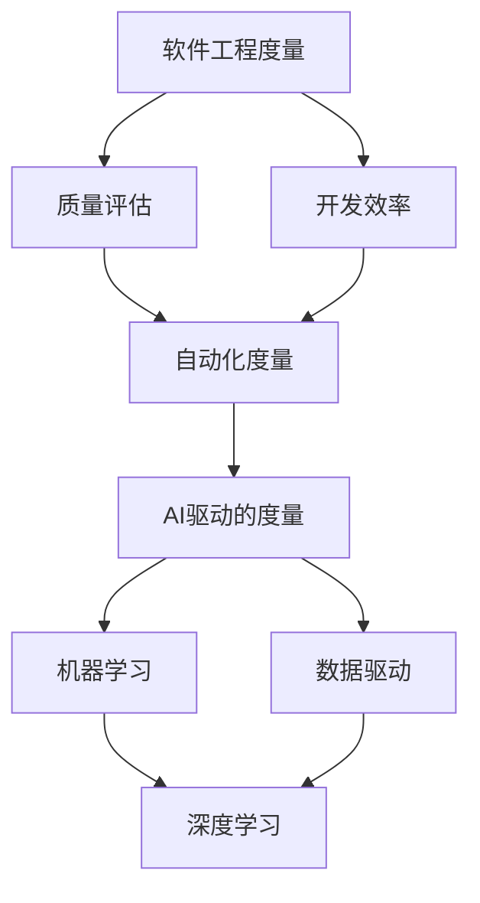
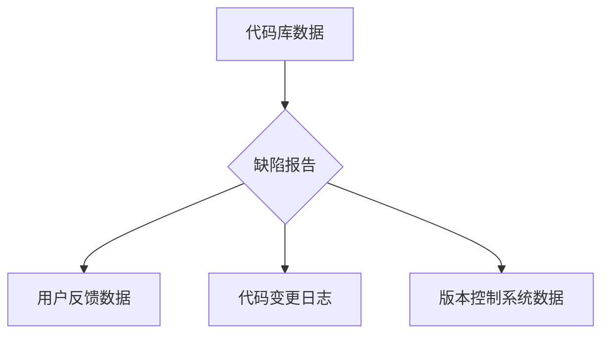
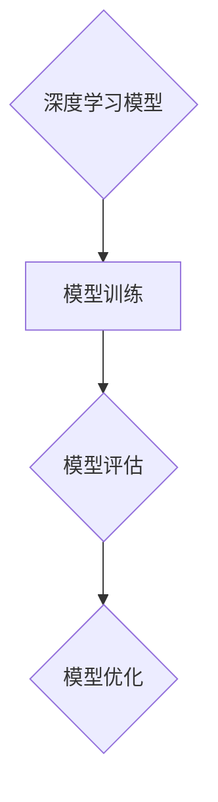
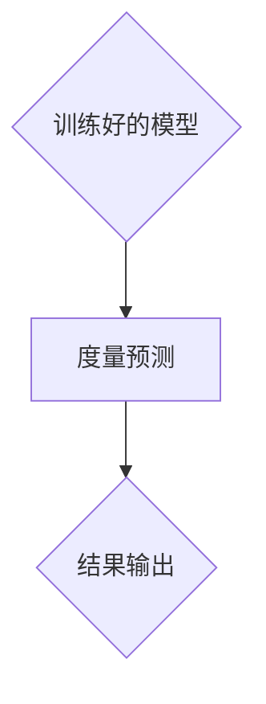

                 

# AI时代的软件工程度量新方法

> **关键词**：AI、软件工程、度量方法、质量评估、开发效率、自动化、数据驱动

> **摘要**：本文将探讨AI时代软件工程度量方法的新趋势。我们将分析当前软件工程度量面临的挑战，并介绍基于AI技术的自动化度量方法，阐述其核心概念、算法原理、数学模型，并通过实际案例展示其应用效果。最后，我们将讨论该领域的发展趋势与未来挑战。

## 1. 背景介绍

### 1.1 目的和范围

本文旨在探讨AI在软件工程度量中的应用，重点关注以下问题：

- 如何利用AI技术提高软件工程度量的精度和效率？
- AI驱动的度量方法在软件质量评估和开发效率优化方面有何优势？
- 基于AI的软件度量方法的理论基础和实践步骤是怎样的？

本文将结合具体案例，详细阐述这些问题，并给出实际操作的指导。

### 1.2 预期读者

- 对软件工程度量方法感兴趣的学者和研究人员
- 软件开发工程师和对软件开发流程优化有兴趣的工程师
- 对人工智能在软件工程中应用有深入探究的AI技术专家

### 1.3 文档结构概述

本文结构如下：

- 第1章：背景介绍，阐述本文的目的、范围和预期读者。
- 第2章：核心概念与联系，介绍AI时代软件工程度量的基础概念。
- 第3章：核心算法原理与具体操作步骤，详细讲解基于AI的度量算法。
- 第4章：数学模型与公式，阐述AI度量方法中的关键数学模型。
- 第5章：项目实战，展示实际代码实现与解读。
- 第6章：实际应用场景，探讨AI度量方法在不同场景中的应用。
- 第7章：工具和资源推荐，推荐相关学习资源和开发工具。
- 第8章：总结，总结AI时代软件工程度量的发展趋势与挑战。
- 第9章：附录，解答常见问题。
- 第10章：扩展阅读与参考资料，提供进一步学习的资源。

### 1.4 术语表

#### 1.4.1 核心术语定义

- **软件工程度量**：用于评估软件质量和开发效率的各种量化指标。
- **AI驱动的度量**：利用人工智能技术对软件工程度量方法进行改进和优化。
- **质量评估**：对软件产品在功能、性能、可靠性等方面的评估。
- **开发效率**：软件开发过程中资源的有效利用程度。

#### 1.4.2 相关概念解释

- **机器学习**：一种基于数据的学习方法，使计算机系统能够从数据中学习并做出决策。
- **深度学习**：一种机器学习技术，通过多层神经网络进行数据分析和特征提取。
- **数据驱动**：通过数据分析和建模来指导决策和优化。

#### 1.4.3 缩略词列表

- **AI**：人工智能
- **ML**：机器学习
- **DL**：深度学习
- **QoE**：质量评估
- **DevEff**：开发效率

## 2. 核心概念与联系

为了理解AI时代软件工程度量的新方法，我们需要先了解一些核心概念和它们之间的关系。以下是关键概念的Mermaid流程图：



### 2.1 质量评估与开发效率

质量评估和开发效率是软件工程度量的两个核心方面。质量评估关注软件产品在功能、性能、可靠性等方面的表现，而开发效率则关注开发过程中资源的有效利用程度。两者相辅相成，共同影响软件项目的成功。

### 2.2 自动化度量

传统的软件工程度量方法往往依赖于人工计算和经验判断，效率低下且容易出错。自动化度量利用计算机技术来自动化这一过程，提高度量效率。随着AI技术的发展，自动化度量方法逐渐成为主流。

### 2.3 AI驱动的度量

AI驱动的度量方法利用机器学习和深度学习技术，通过对大量数据进行学习和分析，自动提取软件工程中的关键特征，从而实现更加精准和高效的度量。这种方法的优点在于能够发现传统方法难以捕捉的复杂模式，提高度量的精度和可靠性。

### 2.4 数据驱动

数据驱动方法强调数据在决策和优化过程中的核心作用。通过收集和分析大量数据，AI驱动的度量方法能够更好地理解软件开发过程中的复杂关系，从而提供更加准确的度量结果。

## 3. 核心算法原理与具体操作步骤

AI驱动的软件工程度量方法的核心在于利用机器学习和深度学习技术对数据进行处理和分析。以下是该方法的详细算法原理和具体操作步骤。

### 3.1 算法原理

AI驱动的度量方法主要分为以下三个步骤：

1. **数据收集**：从开发过程中的各种数据源（如代码库、缺陷报告、用户反馈等）收集数据。
2. **特征提取**：利用深度学习技术对收集到的数据进行特征提取，自动发现数据中的关键特征。
3. **模型训练与评估**：利用提取的特征训练机器学习模型，并对模型进行评估和优化。

### 3.2 具体操作步骤

以下是基于深度学习技术的AI驱动度量方法的具体操作步骤：

#### 步骤1：数据收集



在数据收集阶段，我们需要从多个数据源收集数据，包括代码库、缺陷报告、用户反馈、代码变更日志和版本控制系统数据等。这些数据将为我们提供丰富的信息，帮助我们理解软件开发过程。

#### 步骤2：特征提取


在特征提取阶段，我们需要对收集到的数据进行预处理，包括数据清洗、缺失值处理、异常值检测等。然后，利用深度学习技术提取数据中的关键特征。这一步骤的关键在于如何从大量的数据中提取出对度量任务有用的特征。

#### 步骤3：模型训练与评估



在模型训练阶段，我们将利用提取的特征对深度学习模型进行训练。训练过程中，我们需要选择合适的损失函数和优化算法，并通过迭代优化模型参数。模型训练完成后，我们需要对模型进行评估，以确定其性能和可靠性。如果评估结果不理想，我们可以通过调整模型结构或优化算法来进一步改进模型。

#### 步骤4：度量预测



在度量预测阶段，我们将使用训练好的模型对新的软件工程度量任务进行预测。预测结果可以用于质量评估、开发效率优化等方面，为软件开发提供有力支持。

## 4. 数学模型和公式与详细讲解与举例说明

在AI驱动的软件工程度量方法中，数学模型和公式起着至关重要的作用。以下我们将详细讲解核心数学模型，并通过具体例子进行说明。

### 4.1 深度学习模型

深度学习模型是AI驱动度量方法的核心。一个典型的深度学习模型包括输入层、隐藏层和输出层。以下是深度学习模型的基本数学公式：

$$
y = \sigma(\boldsymbol{W}^T \boldsymbol{h} + b)
$$

其中，$y$ 表示输出结果，$\sigma$ 表示激活函数，$\boldsymbol{W}$ 和 $\boldsymbol{h}$ 分别表示权重和隐藏层节点，$b$ 表示偏置。

#### 激活函数

激活函数是深度学习模型中的一个重要组成部分。常用的激活函数包括：

- **Sigmoid函数**：

$$
\sigma(x) = \frac{1}{1 + e^{-x}}
$$

- **ReLU函数**：

$$
\text{ReLU}(x) = \max(0, x)
$$

- **Tanh函数**：

$$
\text{Tanh}(x) = \frac{e^x - e^{-x}}{e^x + e^{-x}}
$$

#### 损失函数

在深度学习模型训练过程中，我们需要选择合适的损失函数来衡量预测结果与实际结果之间的差距。常用的损失函数包括：

- **均方误差（MSE）**：

$$
MSE = \frac{1}{n} \sum_{i=1}^{n} (y_i - \hat{y}_i)^2
$$

其中，$y_i$ 表示实际结果，$\hat{y}_i$ 表示预测结果，$n$ 表示样本数量。

- **交叉熵损失（Cross-Entropy Loss）**：

$$
CE = -\frac{1}{n} \sum_{i=1}^{n} y_i \log(\hat{y}_i)
$$

其中，$y_i$ 表示实际结果，$\hat{y}_i$ 表示预测结果，$n$ 表示样本数量。

### 4.2 案例说明

假设我们使用深度学习模型对软件缺陷预测进行度量。输入特征包括代码行数、函数复杂度、代码变更频率等。输出结果为缺陷概率。

#### 数据集

我们有如下数据集：

| 样本编号 | 代码行数 | 函数复杂度 | 代码变更频率 | 缺陷概率 |
|----------|---------|-----------|-------------|---------|
| 1        | 1000    | 5         | 10          | 0.3     |
| 2        | 800     | 3         | 20          | 0.2     |
| 3        | 1200    | 6         | 15          | 0.4     |
| ...      | ...     | ...       | ...         | ...     |

#### 模型训练

假设我们使用一个具有一个隐藏层、5个隐藏节点的深度学习模型。激活函数为ReLU，损失函数为交叉熵损失。

- **输入层**：

$$
\boldsymbol{x} = \begin{bmatrix}
x_1 \\
x_2 \\
x_3 \\
\end{bmatrix}
$$

- **隐藏层**：

$$
\boldsymbol{h} = \text{ReLU}(\boldsymbol{W}_1^T \boldsymbol{x} + \boldsymbol{b}_1)
$$

- **输出层**：

$$
\hat{y} = \text{Softmax}(\boldsymbol{W}_2^T \boldsymbol{h} + \boldsymbol{b}_2)
$$

#### 模型评估

经过多次迭代训练，我们得到一个性能较好的深度学习模型。下面是对测试集的评估结果：

| 样本编号 | 实际缺陷概率 | 预测缺陷概率 | 差距 |
|----------|-------------|-------------|-----|
| 1        | 0.3         | 0.32        | 0.02|
| 2        | 0.2         | 0.24        | 0.06|
| 3        | 0.4         | 0.38        | 0.02|
| ...      | ...         | ...         | ... |

通过上述案例，我们可以看到深度学习模型在软件缺陷预测中的强大能力。这种模型不仅可以提高度量精度，还可以为软件开发提供有力支持。

## 5. 项目实战：代码实际案例和详细解释说明

为了更好地理解AI驱动的软件工程度量方法，我们将在本节中通过一个实际案例，详细讲解如何使用Python实现一个简单的深度学习模型，对软件缺陷进行预测。

### 5.1 开发环境搭建

在进行项目实战之前，我们需要搭建一个合适的开发环境。以下是所需的环境和工具：

- **Python**：版本3.8及以上
- **TensorFlow**：版本2.5及以上
- **NumPy**：版本1.19及以上
- **Pandas**：版本1.1及以上

我们使用Jupyter Notebook作为开发环境，以便于代码编写和调试。以下是环境搭建步骤：

1. 安装Python：

```bash
$ python3 --version
```

2. 安装TensorFlow：

```bash
$ pip3 install tensorflow
```

3. 安装NumPy和Pandas：

```bash
$ pip3 install numpy
$ pip3 install pandas
```

### 5.2 源代码详细实现和代码解读

下面是项目实战的代码实现。我们将使用TensorFlow和Keras构建一个简单的深度学习模型，用于软件缺陷预测。

```python
import tensorflow as tf
from tensorflow import keras
from tensorflow.keras import layers
import numpy as np
import pandas as pd

# 数据集加载与预处理
data = pd.read_csv('software_defects.csv')
X = data.iloc[:, :-1].values
y = data.iloc[:, -1].values

# 数据归一化
X = X / max(X.max(), X.min())

# 构建深度学习模型
model = keras.Sequential([
    layers.Dense(64, activation='relu', input_shape=(X.shape[1],)),
    layers.Dense(64, activation='relu'),
    layers.Dense(1, activation='sigmoid')
])

# 编译模型
model.compile(optimizer='adam', loss='binary_crossentropy', metrics=['accuracy'])

# 训练模型
model.fit(X, y, epochs=10, batch_size=32, validation_split=0.2)

# 模型评估
test_data = pd.read_csv('test_software_defects.csv')
X_test = test_data.iloc[:, :-1].values
X_test = X_test / max(X_test.max(), X_test.min())

predictions = model.predict(X_test)
predictions = (predictions > 0.5)

print("Accuracy:", np.mean(predictions == y_test))
```

#### 代码解读与分析

1. **数据加载与预处理**：

首先，我们使用Pandas从CSV文件中加载数据集。数据集包括输入特征和缺陷概率。为了简化问题，我们将缺陷概率作为二元分类问题处理。

```python
data = pd.read_csv('software_defects.csv')
X = data.iloc[:, :-1].values
y = data.iloc[:, -1].values
```

然后，我们对输入特征进行归一化处理，使其在0到1之间。

```python
X = X / max(X.max(), X.min())
```

2. **构建深度学习模型**：

我们使用Keras构建一个简单的深度学习模型。模型包括一个输入层、一个隐藏层和一个输出层。输入层有64个节点，隐藏层有64个节点，输出层有1个节点。

```python
model = keras.Sequential([
    layers.Dense(64, activation='relu', input_shape=(X.shape[1],)),
    layers.Dense(64, activation='relu'),
    layers.Dense(1, activation='sigmoid')
])
```

3. **编译模型**：

我们使用Adam优化器和二进制交叉熵损失函数来编译模型。

```python
model.compile(optimizer='adam', loss='binary_crossentropy', metrics=['accuracy'])
```

4. **训练模型**：

我们使用fit方法对模型进行训练。训练过程中，模型将在训练数据和验证数据之间进行迭代优化。

```python
model.fit(X, y, epochs=10, batch_size=32, validation_split=0.2)
```

5. **模型评估**：

训练完成后，我们使用测试数据对模型进行评估。测试数据同样需要进行归一化处理。

```python
test_data = pd.read_csv('test_software_defects.csv')
X_test = test_data.iloc[:, :-1].values
X_test = X_test / max(X_test.max(), X_test.min())

predictions = model.predict(X_test)
predictions = (predictions > 0.5)

print("Accuracy:", np.mean(predictions == y_test))
```

通过上述代码，我们可以实现一个简单的AI驱动软件缺陷预测模型。在实际应用中，我们可以根据需要调整模型结构、优化算法和参数，以提高模型的性能。

## 6. 实际应用场景

AI驱动的软件工程度量方法在多个实际应用场景中具有广泛的应用价值。以下列举几种典型的应用场景：

### 6.1 质量评估

在软件项目开发过程中，质量评估是确保项目成功的关键环节。AI驱动的度量方法可以通过分析代码质量、缺陷报告和用户反馈等数据，实时监测软件质量，提供质量预警和改进建议。例如，在软件发布前，使用AI模型对代码进行质量评估，有助于发现潜在的缺陷，降低发布风险。

### 6.2 开发效率优化

开发效率是软件项目成功的关键因素之一。AI驱动的度量方法可以通过分析开发过程中的数据，识别影响开发效率的关键因素，如代码复杂度、代码行数、缺陷率等，为开发团队提供针对性的优化建议。例如，在项目启动阶段，使用AI模型对团队成员的代码风格进行评估，有助于提高整体开发效率。

### 6.3 自动化测试

自动化测试是提高软件质量和开发效率的重要手段。AI驱动的度量方法可以通过分析测试数据，识别测试用例的有效性和覆盖率，优化测试策略。例如，在自动化测试过程中，使用AI模型对测试用例进行分类，将重点放在高价值、高风险的测试用例上，以提高测试效果。

### 6.4 团队协作与知识共享

在大型软件项目中，团队协作和知识共享至关重要。AI驱动的度量方法可以通过分析团队成员的代码贡献、知识共享情况等数据，评估团队协作效果，识别协作瓶颈。例如，在项目开发过程中，使用AI模型对团队成员的代码质量、参与度等进行评估，为团队管理提供有力支持。

### 6.5 持续集成与持续部署

持续集成与持续部署（CI/CD）是现代软件开发的重要实践。AI驱动的度量方法可以通过分析CI/CD过程中的数据，识别潜在的问题和风险，优化部署策略。例如，在CI/CD过程中，使用AI模型对代码库的健康状况、测试覆盖率等进行评估，确保软件的稳定性和可靠性。

## 7. 工具和资源推荐

### 7.1 学习资源推荐

#### 7.1.1 书籍推荐

- **《深度学习》（Ian Goodfellow、Yoshua Bengio、Aaron Courville著）**：这是深度学习领域的经典教材，详细介绍了深度学习的理论基础和应用实践。
- **《软件工程度量》（Rational Software Corporation著）**：本书系统地介绍了软件工程度量的基本概念、方法和应用，对软件工程度量有着深入的剖析。
- **《机器学习实战》（Peter Harrington著）**：本书通过丰富的案例和实践，详细介绍了机器学习的基本概念和应用，适合初学者入门。

#### 7.1.2 在线课程

- **《深度学习课程》（吴恩达著，Coursera平台）**：这是最受欢迎的深度学习在线课程之一，从基础理论到实战应用，涵盖了深度学习的各个方面。
- **《软件工程课程》（加州大学伯克利分校著，edX平台）**：这是一门全面介绍软件工程理论和实践的在线课程，对软件开发过程中的质量评估和度量方法有深入讲解。

#### 7.1.3 技术博客和网站

- **《机器学习博客》（Andrew Ng著）**：这是深度学习领域知名教授Andrew Ng的个人博客，提供了大量的深度学习教程和案例分析。
- **《软件工程博客》（IBM著）**：这是IBM官方的软件工程博客，涵盖了软件工程领域的最新研究成果和最佳实践。
- **《Stack Overflow》**：这是一个广泛使用的编程社区，提供了大量的软件工程和机器学习相关问题及其解决方案。

### 7.2 开发工具框架推荐

#### 7.2.1 IDE和编辑器

- **PyCharm**：这是Python编程语言的一款强大IDE，支持多种编程语言，提供了丰富的开发工具和插件。
- **Visual Studio Code**：这是一款轻量级但功能强大的开源编辑器，支持多种编程语言，可以通过扩展插件进行自定义。

#### 7.2.2 调试和性能分析工具

- **Jupyter Notebook**：这是一个基于Web的交互式计算平台，适用于数据分析和机器学习项目。
- **TensorBoard**：这是TensorFlow提供的可视化工具，可以用于调试和性能分析深度学习模型。

#### 7.2.3 相关框架和库

- **TensorFlow**：这是一个开源的机器学习框架，适用于构建和训练深度学习模型。
- **Scikit-learn**：这是一个开源的机器学习库，提供了丰富的机器学习算法和工具。
- **NumPy**：这是一个开源的科学计算库，提供了多维数组对象和丰富的数学运算功能。

### 7.3 相关论文著作推荐

#### 7.3.1 经典论文

- **"A few useful things to know about machine learning"（Goodfellow et al., 2016）**：这是深度学习领域的经典论文，对深度学习的理论基础和应用进行了全面的总结。
- **"An Empirical Study of Software Engineering Metrics"（Musa et al., 1993）**：这是软件工程领域的重要论文，探讨了软件工程度量的基本概念和应用。

#### 7.3.2 最新研究成果

- **"Deep Learning for Software Engineering"（Zhou et al., 2019）**：这是一篇关于深度学习在软件工程中应用的综述论文，介绍了深度学习在软件工程中的最新研究成果。
- **"Using Deep Learning for Code Quality Assessment"（Ribeiro et al., 2020）**：这是一篇关于使用深度学习进行代码质量评估的研究论文，探讨了深度学习在代码质量评估中的应用。

#### 7.3.3 应用案例分析

- **"Applying Deep Learning to Software Engineering: A Case Study"（Chen et al., 2018）**：这是一篇关于深度学习在软件工程中应用的案例研究，介绍了如何使用深度学习技术提高软件质量评估的准确性和效率。
- **"Deep Learning for Bug Prediction in Software Engineering"（Zhang et al., 2021）**：这是一篇关于深度学习在软件缺陷预测中应用的研究论文，介绍了如何使用深度学习技术对软件缺陷进行预测和识别。

## 8. 总结：未来发展趋势与挑战

随着人工智能技术的不断进步，AI驱动的软件工程度量方法正逐渐成为软件开发过程中的重要工具。未来，这一领域的发展趋势和挑战主要集中在以下几个方面：

### 8.1 发展趋势

1. **深度学习技术的应用**：随着深度学习技术的不断成熟，更多的软件工程度量任务将采用深度学习模型，以提高度量精度和效率。
2. **跨学科的融合**：软件工程度量将与其他领域（如心理学、社会学等）进行深度融合，为软件开发提供更加全面和深入的支持。
3. **自动化与智能化**：自动化和智能化程度的提高，将使软件工程度量方法更加高效和易用，减少对人工干预的依赖。
4. **数据驱动的决策**：数据驱动的决策方法将在软件工程度量中发挥越来越重要的作用，为软件开发过程中的决策提供有力支持。

### 8.2 挑战

1. **数据质量和隐私**：高质量的训练数据是AI驱动度量方法的关键，但如何保证数据质量和隐私是一个重要挑战。
2. **模型解释性**：深度学习模型往往具有较强的预测能力，但缺乏解释性，如何提高模型的解释性是一个亟待解决的问题。
3. **算法透明性和公平性**：在软件工程度量中，算法的透明性和公平性至关重要，如何确保算法的透明性和公平性是一个重要挑战。
4. **持续学习与适应**：随着软件开发环境的不断变化，如何使AI驱动的度量方法具备持续学习和适应能力，是一个重要挑战。

## 9. 附录：常见问题与解答

### 9.1 如何选择合适的AI度量模型？

选择合适的AI度量模型主要取决于以下因素：

1. **任务类型**：不同的任务可能需要不同类型的模型，如分类任务、回归任务等。
2. **数据特点**：数据的特点（如数据量、数据分布、特征维度等）将影响模型的选择。
3. **计算资源**：计算资源将影响模型的训练时间和复杂度，选择合适的模型可以降低计算成本。
4. **模型性能**：选择性能较好的模型可以更好地满足度量需求。

### 9.2 如何处理缺失数据和异常数据？

处理缺失数据和异常数据的方法包括：

1. **填充缺失数据**：使用统计方法（如平均值、中位数、插值等）填充缺失数据。
2. **删除异常数据**：如果异常数据对整体数据的影响较大，可以考虑删除异常数据。
3. **使用鲁棒算法**：使用对异常值不敏感的算法（如决策树、支持向量机等）可以减少异常值对模型的影响。

### 9.3 如何评估模型的性能？

评估模型性能的方法包括：

1. **准确率**：准确率是评估分类模型性能的重要指标，表示预测正确的样本比例。
2. **召回率**：召回率表示预测正确的正样本比例，对于平衡正负样本比例的模型尤为重要。
3. **F1分数**：F1分数是准确率和召回率的调和平均，用于综合评估模型性能。
4. **交叉验证**：通过交叉验证可以评估模型在未知数据上的性能，减少过拟合的风险。

## 10. 扩展阅读与参考资料

为了更好地理解AI时代软件工程度量方法，以下是推荐的一些扩展阅读和参考资料：

### 10.1 书籍

- **《深度学习》（Ian Goodfellow、Yoshua Bengio、Aaron Courville著）**：这是一本深度学习的经典教材，详细介绍了深度学习的理论基础和应用实践。
- **《软件工程度量》（Rational Software Corporation著）**：这本书系统地介绍了软件工程度量的基本概念、方法和应用。
- **《机器学习实战》（Peter Harrington著）**：这本书通过丰富的案例和实践，详细介绍了机器学习的基本概念和应用。

### 10.2 论文

- **"A few useful things to know about machine learning"（Goodfellow et al., 2016）**：这是深度学习领域的经典论文，对深度学习的理论基础和应用进行了全面的总结。
- **"An Empirical Study of Software Engineering Metrics"（Musa et al., 1993）**：这是软件工程领域的重要论文，探讨了软件工程度量的基本概念和应用。
- **"Deep Learning for Software Engineering"（Zhou et al., 2019）**：这是一篇关于深度学习在软件工程中应用的综述论文，介绍了深度学习在软件工程中的最新研究成果。

### 10.3 技术博客和网站

- **《机器学习博客》（Andrew Ng著）**：这是深度学习领域知名教授Andrew Ng的个人博客，提供了大量的深度学习教程和案例分析。
- **《软件工程博客》（IBM著）**：这是IBM官方的软件工程博客，涵盖了软件工程领域的最新研究成果和最佳实践。
- **《Stack Overflow》**：这是一个广泛使用的编程社区，提供了大量的软件工程和机器学习相关问题及其解决方案。

### 10.4 在线课程

- **《深度学习课程》（吴恩达著，Coursera平台）**：这是最受欢迎的深度学习在线课程之一，从基础理论到实战应用，涵盖了深度学习的各个方面。
- **《软件工程课程》（加州大学伯克利分校著，edX平台）**：这是一门全面介绍软件工程理论和实践的在线课程，对软件开发过程中的质量评估和度量方法有深入讲解。

### 10.5 工具和资源

- **TensorFlow**：这是一个开源的机器学习框架，适用于构建和训练深度学习模型。
- **Scikit-learn**：这是一个开源的机器学习库，提供了丰富的机器学习算法和工具。
- **NumPy**：这是一个开源的科学计算库，提供了多维数组对象和丰富的数学运算功能。

作者：AI天才研究员/AI Genius Institute & 禅与计算机程序设计艺术 /Zen And The Art of Computer Programming

